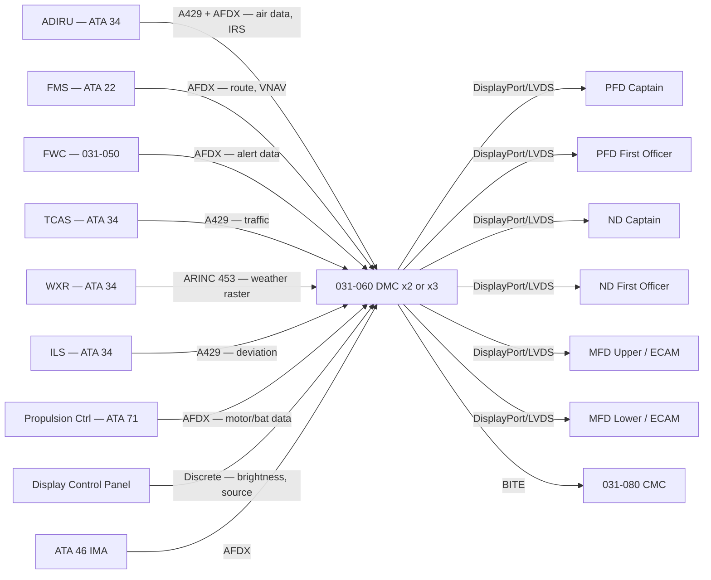
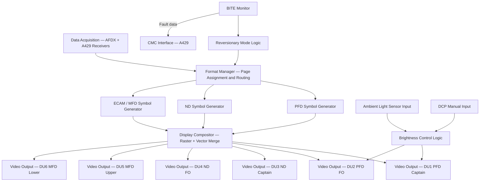
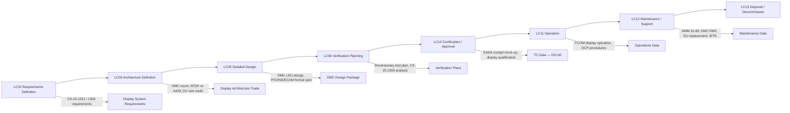

# 031-060 — Electronic Display and Indication Systems
### AMPEL360e eWTW · ATA 31 · Q+ATLANTIDE ATLAS Scaffold

---

## §0 Hyperlink Policy

All internal links use relative paths from the current directory. External regulatory and standards references use anchor links defined in [§20 References](#20-references). Links marked **TBD** indicate targets not yet allocated. Programme-level links traverse five directory levels (`../../../../../`). No absolute URLs are used for internal navigation.

---

## §1 Purpose

This document describes the Electronic Display and Indication Systems for the AMPEL360e eWTW aircraft, specifically the Display Management Computer (DMC), symbol generation, display unit driving electronics, and Electronic Flight Instrument System (EFIS) architecture. The DMC is the core computing element responsible for generating all cockpit display imagery — transforming raw avionics data into formatted, symbology-compliant visual presentations on the flight deck display units (PFD, ND, MFD/ECAM).

The eWTW employs a six-display glass cockpit managed by dual or triple redundant DMCs connected to display units via a high-speed digital video interface (DisplayPort or equivalent — TBD by supplier). All display units use Active Matrix Liquid Crystal Display (AMLCD) technology, providing high brightness (minimum 1500 nit) and wide viewing angles (±60° horizontal minimum) appropriate for daylight readability and shared crew viewing. The display architecture is qualified per EUROCAE ED-14G for the applicable environmental categories.

A fundamental safety feature of the DMC architecture is the reversionary capability. Any single DMC is capable of driving all six display units in a reversionary layout, ensuring that loss of one DMC does not result in loss of all flight information. The automatic reversionary mode is engaged within one second of detecting a DMC failure. If a single display unit fails, the DMC redistributes the failed unit's pages across the remaining display units and generates a crew caution alert.

A key eWTW-specific display requirement is the presentation of electric propulsion system data. The DMC generates dedicated ECAM system pages for battery State of Charge, motor output power, inverter operating temperatures, and propulsion mode status. There are no EPR (Engine Pressure Ratio) indicators — replaced by motor power percentage and torque displays. These novel display formats require a purpose-developed display format specification not present in conventional aircraft EFIS designs.

---

## §2 Applicability

| Attribute | Value |
|---|---|
| Programme | AMPEL360e Wide Tube-and-Wing (eWTW) |
| ATA Chapter / Subsubject | 31-60 — Electronic Display and Indication Systems |
| Aircraft Variant | eWTW-100 (baseline), eWTW-100ER |
| Certification Basis | CS-25 (EASA), FAR Part 25 (FAA bilateral) |
| S1000D SNS | 031-60 |
| DMC Prefix | DMC-AMPEL360E-EWTW-031-60 |
| Effectivity | All MSN from MSN 001 |

---

## §3 System / Function Overview

The DMC acquires data from all display data sources — ADIRU, FMS, FWC, TCAS, WXR, ILS, and propulsion controllers — via the AFDX network and ARINC 429 inputs. It processes this data through symbol generation algorithms to produce display raster images in real time. The images are transmitted to display units over high-speed video links. Each DMC is capable of simultaneously generating images for all six display positions, ensuring full reversionary capability from a single unit.

Symbol generation covers four primary formats: (1) PFD format — attitude direction indicator, airspeed tape, altitude tape, vertical speed indicator, ILS/FD/AP guidance symbols, and mode annunciations; (2) ND format — moving map with terrain, weather, traffic, route, bearing, and range; (3) ECAM upper — propulsion primary parameters (motor power, battery SoC); (4) ECAM lower — selectable system synoptic pages (electric power, hydraulic, flight controls, ECS, cabin). All formats are vector/raster hybrid with smooth animation.

The DMC also manages display brightness in response to ambient light sensor data from each display unit. Manual brightness control is provided via the Display Control Panel (DCP) on the instrument panel. An automatic mode sets brightness to maintain a target contrast ratio against the ambient cockpit light level. The fail-safe behaviour on ambient light sensor failure is to revert to a predefined brightness level sufficient for all lighting conditions (typically 100% brightness as conservative default).

---

## §4 Scope

### 4.1 Included
- DMC LRU (×2 or ×3 — TBD by redundancy trade): all symbol generation, format management, and display driving logic
- AFDX and ARINC 429 data acquisition interfaces on DMC
- Display unit video interface (DisplayPort or LVDS — TBD) from DMC to display units
- Display unit LRU electronics (AMLCD panel, backlight driver, video input processor, ambient light sensor)
- Reversionary mode logic (automatic switchover on DMC or DU failure)
- Brightness control (automatic + manual DCP override)
- Electric propulsion display format (ECAM propulsion synoptic page — novel eWTW requirement)
- DMC BITE and display integrity monitoring

### 4.2 Excluded
- FWC (alert generation) — covered under 031-050
- ADIRU, FMS, TCAS, WXR data sources — covered under ATA 34 and ATA 22
- ISI — covered under 031-020
- Display unit physical panel mounting and wiring — covered under 031-010
- IMA platform hardware — covered under ATA 46

---

## §5 Architecture Description

- **Dual or triple DMC**: each DMC independently capable of generating all six display pages; TBD whether dual or triple after redundancy/FHA analysis
- **AFDX primary data interface**: DMC receives display data from IMA (FWC alerts, FMS route), ADIRU, and other systems via ARINC 664 Part 7 AFDX; 100 Mbps full-duplex
- **ARINC 429 legacy inputs**: ADIRU secondary output, ILS receivers, TCAS display data — ARINC 429 retained as backup data path
- **DisplayPort or LVDS video output**: high-speed video from DMC to each display unit; interface standard TBD by display unit supplier
- **AMLCD display units**: 6 units, each with integrated ambient light sensor, backlight dimmer, and video processor; min 1500 nit peak brightness
- **Reversionary logic**: automatic DMC failure detection; DMC cross-comparison; failed DMC isolated; remaining DMC assumes full control; < 1 second switchover
- **Electric propulsion ECAM pages**: purpose-developed format for battery, motor, and inverter data; no EPR display; new display symbology required
- **DO-178C DAL B**: DMC display software developed to DAL B for PFD format (safety-critical primary flight data)

---

## §6 Functional Breakdown

| Function ID | Function Title | Description | Applicable Component |
|---|---|---|---|
| F-001 | Display Management and Source Selection | Manages which data sources feed which display pages; controls page routing in normal and reversionary modes | DMC management function |
| F-002 | PFD Symbol Generation | Generates ADI, ASI tape, altimeter tape, VSI, ILS deviation, FD command bars, AP mode annunciations | DMC PFD symbol generator |
| F-003 | ND Symbol Generation | Generates moving map, route, terrain overlay, weather radar overlay, TCAS traffic, bearing/range | DMC ND symbol generator |
| F-004 | ECAM/MFD System Page Generation | Generates system synoptic pages, CAS message display, propulsion ECAM page | DMC ECAM symbol generator |
| F-005 | Reversionary Mode Switching | Detects DMC or DU failure; automatically reconfigures display layout; generates crew alert | DMC reversionary logic |
| F-006 | Display Unit Brightness Control | Controls backlight driver per ambient light sensor and DCP input; manual override available | DMC + DU backlight subsystem |
| F-007 | BITE and Display Integrity Monitoring | Monitors DMC internal health and DU video output integrity; reports to CMC | DMC BITE function |
| F-008 | Video and Graphical Overlay Integration | Integrates video streams (e.g., weather radar synthetic raster) with vector symbol layers | DMC compositor |

---

## §7 System Context Diagram

---

## §8 Internal Functional Architecture

---

## §9 Lifecycle Traceability

---

## §10 Interfaces

| Interface ID | System / Chapter | Interface Type | Data / Signal | Direction | Status |
|---|---|---|---|---|---|
| IF-031-060-001 | ATA 34 ADIRU | ARINC 429 + AFDX | Air data and IRS data for PFD | ADIRU → DMC |  |
| IF-031-060-002 | ATA 22 FMS | AFDX | Route, VNAV, performance data for ND | FMS → DMC |  |
| IF-031-060-003 | 031-050 FWC | AFDX | Alert messages and synoptic page commands | FWC → DMC |  |
| IF-031-060-004 | ATA 34 TCAS | ARINC 429 | Traffic advisories for ND display | TCAS → DMC |  |
| IF-031-060-005 | ATA 34 WXR | ARINC 453 | Weather radar raster scan data for ND overlay | WXR → DMC |  |
| IF-031-060-006 | ATA 71 Propulsion | AFDX | Motor power, battery SoC, inverter data for ECAM page | Propulsion → DMC |  |
| IF-031-060-007 | 031-010 Display Units | DisplayPort / LVDS | Formatted video signal to each DU | DMC → DU |  |
| IF-031-060-008 | 031-010 DCP | Discrete | Brightness control and source selection commands | DCP → DMC |  |
| IF-031-060-009 | 031-080 CMC | ARINC 429 | DMC and DU BITE data | DMC → CMC |  |
| IF-031-060-010 | ATA 46 IMA | AFDX | IMA platform data and health monitoring | IMA ↔ DMC |  |

---

## §11 Operating Modes

| Mode ID | Mode Name | Description | Entry Condition | Exit Condition |
|---|---|---|---|---|
| OM-001 | Normal | All DMC(s) operating; all 6 DUs active; full information presented per normal layout | All LRUs healthy, powered | Any failure |
| OM-002 | Single DMC Failed | Remaining DMC(s) take over all 6 displays; reversionary layout activated automatically | DMC BITE failure detected < 1 s | Failed DMC replaced |
| OM-003 | Single DU Failed | DMC redistributes failed DU's pages across remaining 5 DUs; caution alert generated | DU BITE failure or video signal loss | DU replaced |
| OM-004 | Manual Brightness | Crew controls brightness via DCP; automatic mode bypassed | DCP manual selection | DCP auto mode reselected |
| OM-005 | All Main Displays Failed | All 6 DUs failed; ISI (031-020) is primary flight reference; audio alerts via WEU | All 6 DU BITE failures | Power restored, DUs replaced |
| OM-006 | Ground / Maintenance | DMC operates in ground display mode; maintenance menus accessible; reduced display set permitted | WOW active, ground power | Aircraft powered down |

---

## §12 Monitoring and Diagnostics

The DMC continuously monitors the video output channel integrity of each connected display unit using a signal loopback or external feedback mechanism (TBD per supplier). A detected DU video failure triggers the reversionary mode sequence and generates a crew caution alert and a CMC maintenance fault message. The DMC also monitors the health of all its AFDX and ARINC 429 data inputs; a lost data source triggers appropriate failure flags in the affected display format (red X over failed parameter).

DMC internal health monitoring includes: processor loading, memory integrity, and software partition watchdog. Internal failures are reported to the CMC via dedicated BITE status words. The CMC correlates DMC BITE data with DU status to provide the maintenance crew with a complete picture of the display system health. Post-flight, the CMC display system fault history is accessible to maintenance personnel via the ground maintenance interface.

---

## §13 Maintenance Concept

The DMC is an LRU replaced at line maintenance in the avionics bay. Post-replacement, the DMC is configured automatically upon power-up by downloading its configuration and format management software from the IMA or a dedicated configuration loader. No separate alignment or calibration step is required. Software updates to the DMC (including display format changes) are performed via ARINC 615A under CMC control with part number verification.

Display unit replacement is tool-free at line maintenance (TBD per supplier design). After DU replacement, the DMC detects the new DU on power-up and configures it automatically. A brief visual check is performed by the crew per FCOM/AMM procedures. Periodic tasks include display face cleaning per AMM, periodic brightness check, and ambient light sensor functional verification.

---

## §14 S1000D / CSDB Mapping

### 14.1 SNS to DMC Mapping

| SNS Code | Subsubject | DMC Prefix | Info Codes Planned | DMRL Status |
|---|---|---|---|---|
| 031-60 | Electronic Display and Indication Systems | DMC-AMPEL360E-EWTW-031-60 | 040, 300, 400, 520, 720 |  |
| 031-60-01 | Display Management Computer | DMC-AMPEL360E-EWTW-031-60-01 | 040, 400, 520, 720 |  |
| 031-60-02 | Display Units (AMLCD) | DMC-AMPEL360E-EWTW-031-60-02 | 040, 400, 720 |  |
| 031-60-03 | Reversionary Mode Logic | DMC-AMPEL360E-EWTW-031-60-03 | 040, 300 |  |
| 031-60-04 | eWTW Propulsion Display Format | DMC-AMPEL360E-EWTW-031-60-04 | 040 |  |

### 14.2 Information Code Definitions (031-60)

| Info Code | Description | Notes |
|---|---|---|
| 040 | System description — DMC architecture, display layout, AMLCD technology | AMM/FCOM basis |
| 300 | Operation — reversionary mode procedures, brightness control, DCP use | FCOM/QRH |
| 400 | Maintenance — DMC software load, DU replacement, BITE test | AMM |
| 520 | Troubleshooting — display blank, incorrect data, reversionary fault | FRM/TSM |
| 720 | Removal and installation — DMC R&R, DU R&R | AMM |

---

## §15 Footprints

### 15.1 Physical Footprint
- DMC: avionics bay, ARINC 600 standard rack, 4–6 MCU per unit (TBD); 2 or 3 units depending on redundancy level
- Display units: flight deck instrument panel — 6 active DU positions; target 8×10 inch active area (TBD); AMLCD panel with integrated ambient sensor
- DCP: instrument panel, each pilot position; small dedicated panel for brightness and source selection

### 15.2 Electrical / Data Footprint
- DMC power: 28VDC essential bus (each unit on different bus feed for redundancy)
- DU power: 28VDC non-essential bus for MFDs; essential bus for at least 1 PFD per pilot
- Data: AFDX 100 Mbps to DMC; ARINC 429 for legacy inputs; DisplayPort or LVDS from DMC to each DU (6 video channels per DMC output)

### 15.3 Maintenance Footprint
- DMC R&R: tool-free (target); avionics bay access; no post-replacement calibration; software auto-configured on power-up
- DU R&R: tool-free per supplier; flight deck access only; < 15 minutes per unit
- Software updates: ARINC 615A; CMC-controlled; approximately 10–20 minutes per update (TBD)

### 15.4 Data Footprint
- DMC NVM: display configuration, format management tables, BITE log (min 100 events)
- DU NVM: display unit serial number, calibration data (factory set), BITE log
- Reversionary event log: last 20 reversionary mode events with timestamp; in DMC NVM

---

## §16 Safety and Certification Considerations

| Requirement | Source | Description | Compliance Approach | Status |
|---|---|---|---|---|
| CS-25.1321 | EASA CS-25 | Pilot field of view — all primary instruments visible | Cockpit mock-up and HF evaluation; DU position verified |  |
| EUROCAE ED-14G | EUROCAE | Environmental qualification of DMC and DU LRUs | Full ED-14G qualification test per applicable categories |  |
| CS-25.1309 | EASA CS-25 | DMC failure condition — loss of PFD data | DMC dual/triple redundancy; FHA for single DMC failure |  |
| DO-178C DAL B | EUROCAE/RTCA | DMC PFD display software assurance | DMC software for PFD format developed to DO-178C DAL B |  |
| SAE ARP 5289 | SAE | Electronic cockpit display qualification | DMC and DU design reviewed against ARP 5289 |  |

---

## §17 Verification and Validation

| V&V ID | Requirement | Method | Success Criterion | Status |
|---|---|---|---|---|
| VV-031-060-001 | CS-25.1309 — DMC failure | Analysis + Iron Bird | Single DMC failure: reversionary mode active < 1 s; no loss of primary flight info |  |
| VV-031-060-002 | PFD accuracy and format | Ground Test + Flight Test | PFD parameters within required accuracy; format compliant with CS-25.1303 |  |
| VV-031-060-003 | ND terrain and weather overlay | Ground Test | Terrain and weather correctly geo-referenced and displayed on ND |  |
| VV-031-060-004 | ED-14G environmental qualification | Supplier qualification test | Full ED-14G test report for DMC and DU LRUs |  |
| VV-031-060-005 | Reversionary mode — single DU failure | Iron Bird | Single DU failure: correct page redistribution on remaining DUs |  |
| VV-031-060-006 | Electric propulsion ECAM page | Ground Test | Battery SoC, motor power, inverter status displayed correctly vs known reference values |  |

---

## §18 Glossary

| Term | Acronym | Definition |
|---|---|---|
| Display Management Computer | DMC | Computer that acquires avionics data and generates cockpit display imagery for all display units |
| Symbol Generator | — | Software function within the DMC that creates vector and raster display symbols from raw data |
| Active Matrix Liquid Crystal Display | AMLCD | Display panel technology using thin-film transistors to address individual LCD pixels |
| Electronic Flight Instrument System | EFIS | System comprising electronic display units, symbol generators, and their associated computers for primary flight display |
| Reversionary Mode | — | Backup display configuration activated automatically upon DMC or display unit failure |
| AFDX | — | Avionics Full Duplex Switched Ethernet (ARINC 664 Part 7) — deterministic Ethernet network |
| Brightness Nit | nit | Unit of luminance (candela per square metre); target display brightness minimum 1500 nit |
| Viewing Angle | — | Angular range over which display maintains acceptable image quality; target ±60° horizontal |
| Information Code | — | S1000D code classifying the type of information in a data module (e.g., 040 = description) |
| Display Unit | DU | Individual LCD panel assembly including backlight, video input processor, and ambient sensor |
| Format Management | — | Software function managing which data pages are assigned to which display units |
| Display Control Panel | DCP | Panel allowing crew to manually adjust display brightness and select data source |
| Video Bus | — | High-speed serial video link (DisplayPort, LVDS) from DMC to display unit |

---

## §19 Citations

| Citation ID | Source | Title / Description | Relevance |
|---|---|---|---|
| CIT-031-060-001 | EASA | CS-25 §1321 — Arrangement and Visibility | Pilot field of view compliance |
| CIT-031-060-002 | EASA | CS-25 §1309 — Equipment Failure Condition Analysis | DMC failure analysis |
| CIT-031-060-003 | EUROCAE | ED-14G (DO-160G) — Environmental Conditions and Test Procedures | DMC and DU qualification standard |
| CIT-031-060-004 | EUROCAE | ED-12C (DO-178C) — Software Considerations | DMC display software DAL B |
| CIT-031-060-005 | SAE | ARP 5289 — Electronic Cockpit Displays | Display qualification guidance |

---

## §20 References

| Ref ID | Document | Title | Version | Link |
|---|---|---|---|---|
| REF-031-060-001 | EASA CS-25 | Certification Specifications — §1321, §1309 | Amdt 27 | [CS-25](https://www.easa.europa.eu/) |
| REF-031-060-002 | EUROCAE ED-14G | Environmental Conditions and Test Procedures | 2012 | [ED-14G](https://eurocae.net/) |
| REF-031-060-003 | EUROCAE ED-12C | Software Considerations in Airborne Systems | 2011 | [ED-12C](https://eurocae.net/) |
| REF-031-060-004 | SAE ARP 5289 | Electronic Cockpit Displays | 2016 | [ARP 5289](https://www.sae.org/) |
| REF-031-060-005 | ARINC 664 Pt7 | Aircraft Data Network — AFDX | 2009 | [ARINC 664](https://aviation-ia.com/) |
| REF-031-060-006 | 031-010 | Flight Deck Indicating and Control Panels | 0.1.0 | [031-010](./031-010-Flight-Deck-Indicating-and-Control-Panels.md) |

---

## §21 Open Issues

| Issue ID | Description | Owner | Priority | Target Date | Status |
|---|---|---|---|---|---|
| OI-031-060-001 | DMC count — dual vs triple — pending redundancy analysis and FHA | Safety Engineer | High | LC03 |  |
| OI-031-060-002 | Display unit size — 8×10 vs 6×8 inch active area — pending cockpit layout trade | Avionics Architect | High | LC03 |  |
| OI-031-060-003 | Video interface standard — DisplayPort vs LVDS — pending DU supplier selection | Procurement | High | LC03 |  |
| OI-031-060-004 | Electric propulsion ECAM page format specification — not yet authored | Systems Engineer | High | LC05 |  |
| OI-031-060-005 | AFDX vs ARINC 429 for display data sources — some sources may still use ARINC 429 only | Avionics Engineer | Medium | LC05 |  |

---

## §22 Change Log

| Revision | Date | Author | Description of Change |
|---|---|---|---|
| 0.1.0 | 2026-05-09 | ATLAS Scaffold Generator | Initial scaffold creation — all sections populated; marked DRAFT |

 This document is a programme-controlled scaffold. All content is subject to review by the responsible system expert before formal issue.
