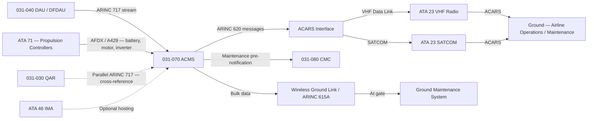
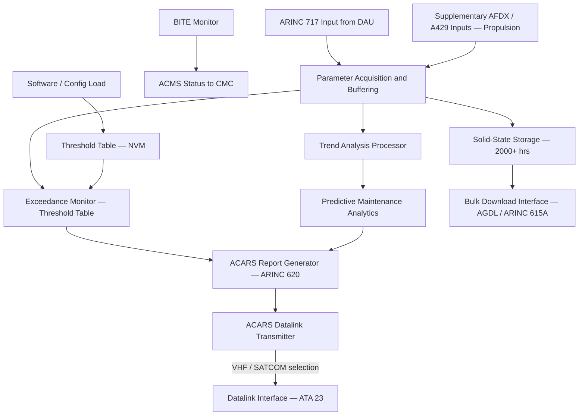
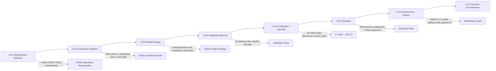

# 031-070 — Automatic Data Reporting and Aircraft Condition Monitoring
### AMPEL360e eWTW · ATA 31 · Q+ATLANTIDE ATLAS Scaffold

---

## §0 Hyperlink Policy

All internal links use relative paths from the current directory. External regulatory and standards references use anchor links defined in [§20 References](#20-references). Links marked **TBD** indicate targets not yet allocated. Programme-level links traverse five directory levels (`../../../../../`). No absolute URLs are used for internal navigation.

---

## §1 Purpose

This document describes the Aircraft Condition Monitoring System (ACMS) and its associated automatic data reporting functions, including ACARS (Aircraft Communication Addressing and Reporting System) datalink, for the AMPEL360e eWTW aircraft. The ACMS provides airlines with a sophisticated tool for monitoring aircraft health, detecting parameter exceedances, performing trend analysis, and generating automatic pre-notification of maintenance requirements — all without requiring physical access to the aircraft between flights.

The eWTW ACMS is implemented as a software function (IMA-hosted or standalone LRU — TBD per LC03 trade) that acquires data from the DFDAU ARINC 717 stream and supplementary ARINC 429 / AFDX data buses. It stores acquired data in solid-state memory and generates periodic and event-triggered reports in ARINC 620 message format for transmission via the ACARS datalink. The ACARS datalink is provided by the aircraft's VHF data radio (ATA 23) or, when out of VHF range, by the SATCOM link.

A defining feature of the eWTW ACMS is its extension to cover electric propulsion condition monitoring. Conventional ACMS systems focus on gas turbine engine parameters (EGT trend, vibration, oil consumption). The eWTW ACMS must address: battery State of Charge and degradation trend, battery thermal performance (charge/discharge efficiency vs temperature), motor winding temperature trend, inverter efficiency degradation, and regenerative braking energy recovery performance. These novel parameters require purpose-developed ACMS algorithms and exceedance thresholds in close coordination with ATA 71 (Propulsion) engineering.

The ACMS also provides the data foundation for the airline's Flight Operations Quality Assurance (FOQA) programme. In-flight exceedance detection (hard landing, over-speed, over-G, battery over-temperature) triggers automatic ACARS reports to the airline operations centre, enabling rapid maintenance assessment and dispatch decisions without waiting for QAR data download.

---

## §2 Applicability

| Attribute | Value |
|---|---|
| Programme | AMPEL360e Wide Tube-and-Wing (eWTW) |
| ATA Chapter / Subsubject | 31-70 — Automatic Data Reporting and Aircraft Condition Monitoring |
| Aircraft Variant | eWTW-100 (baseline), eWTW-100ER |
| Certification Basis | CS-25 (EASA), FAR Part 25 (FAA bilateral) |
| S1000D SNS | 031-70 |
| DMC Prefix | DMC-AMPEL360E-EWTW-031-70 |
| Effectivity | All MSN from MSN 001 |

---

## §3 System / Function Overview

The ACMS continuously monitors a defined set of aircraft parameters at sampling rates appropriate for trend analysis and exceedance detection. The parameter set for ACMS is typically broader and at higher sample rates than the mandatory FDR parameter set: while the FDR records 1024–2048 words per second on a continuous loop, the ACMS may selectively record specific parameters at higher rates (e.g., 4–8 samples per second for battery current and voltage) during critical flight phases. Data is stored in a large solid-state storage module and is managed by the ACMS software with configurable storage policies.

ACARS datalink integration allows the ACMS to transmit short structured reports in near-real-time during flight. These reports — formatted per ARINC 620 — include: periodic position/engine health reports (sent every 15–30 minutes), exceedance reports (transmitted within seconds of threshold crossing), end-of-flight reports (transmitted at engine shutdown or parking), and maintenance pre-notification messages (alerting ground maintenance to observed faults before aircraft arrival). The ACARS reports are received by the airline's ground maintenance system, which feeds into the maintenance planning and aircraft monitoring infrastructure.

For the eWTW, the ACMS datalink via VHF and SATCOM enables the airline to monitor battery degradation over the fleet, optimise charging profiles, detect early motor controller anomalies, and manage warranty claims against propulsion system suppliers. This predictive maintenance capability is essential for managing the high capital cost of the battery and propulsion system.

---

## §4 Scope

### 4.1 Included
- ACMS software function (IMA-hosted or standalone LRU — TBD): data acquisition, processing, storage, and report generation
- ACMS parameter set management (supplementary to FDR mandatory set)
- Electric propulsion condition monitoring algorithms (battery, motor, inverter)
- ACARS report generation (ARINC 620 format): periodic, exceedance, end-of-flight, maintenance pre-notification
- ACARS datalink interface (to ATA 23 VHF data radio and to SATCOM)
- Exceedance detection and threshold management
- Post-flight bulk data download interface (to QAR or AGDL)
- ACMS BITE self-monitoring

### 4.2 Excluded
- VHF ACARS radio hardware — covered under ATA 23 (Communications)
- SATCOM hardware — covered under ATA 23
- DFDAU/DAU (provides ARINC 717 data to ACMS) — covered under 031-040
- QAR (receives parallel ARINC 717 for bulk access) — covered under 031-030
- CMC (receives ACMS fault data) — covered under 031-080
- Electric propulsion sensors — covered under ATA 71/80

---

## §5 Architecture Description

- **ACMS software function**: IMA-hosted (preferred for LRU reduction) or standalone LRU; acquires from FDR ARINC 717 stream plus supplementary ARINC 429/AFDX data buses
- **Supplementary data buses**: ACMS acquires propulsion-specific data (battery, motor, inverter) via dedicated AFDX or ARINC 429 interfaces beyond the standard DFDAU output
- **Large solid-state storage**: ACMS data store significantly larger than QAR (target: 2000+ flight hours of ACMS-selected parameters); managed by circular buffer and report archive
- **ARINC 620 report format**: standard industry format for ACARS messages; programme-specific message templates (AOC report types) to be defined
- **ACARS datalink**: primary — VHF Data Link (VDL Mode 2 or HFDL — TBD); secondary — SATCOM broadband; switching logic automatic based on signal availability
- **Exceedance detection**: real-time parameter comparison against threshold tables stored in ACMS NVM; thresholds configurable by airline via approved software update
- **Ground download**: ACMS data downloadable via wireless AGDL link or ARINC 615A at gate without LRU removal
- **Cybersecurity**: ACARS message integrity and datalink authentication per EUROCAE ED-201 / RTCA DO-326A

---

## §6 Functional Breakdown

| Function ID | Function Title | Description | Applicable Component |
|---|---|---|---|
| F-001 | Flight Parameter Acquisition for ACMS | Acquires data from FDR ARINC 717 stream and supplementary buses; higher rate for selected parameters | ACMS data acquisition |
| F-002 | Electric Propulsion Trend Monitoring | Battery degradation, motor winding temperature trend, inverter efficiency, regenerative braking performance | ACMS propulsion monitoring |
| F-003 | In-Flight ACARS Report Generation | Generates periodic and event-triggered ARINC 620 reports for transmission via ACARS datalink | ACMS report generator |
| F-004 | Ground Datalink Transmission | Transmits ACMS reports via VHF ACARS (primary) or SATCOM (secondary) | ACMS datalink interface |
| F-005 | Exceedance Detection and Automatic Reporting | Monitors parameters against threshold table; triggers ACARS report on exceedance within 30 seconds | ACMS exceedance monitor |
| F-006 | Post-Flight Bulk Data Download | Provides full ACMS dataset to ground system via AGDL or ARINC 615A after flight | ACMS download function |
| F-007 | Predictive Maintenance Data Processing | Analyses trend data; generates maintenance pre-notification ACARS reports | ACMS analytics function |
| F-008 | ACMS BITE Monitoring | Monitors ACMS function health; reports to CMC; generates maintenance message on ACMS failure | ACMS BITE |

---

## §7 System Context Diagram

---

## §8 Internal Functional Architecture

---

## §9 Lifecycle Traceability

---

## §10 Interfaces

| Interface ID | System / Chapter | Interface Type | Data / Signal | Direction | Status |
|---|---|---|---|---|---|
| IF-031-070-001 | 031-040 DAU/DFDAU | ARINC 717 | FDR data stream input to ACMS | DAU → ACMS |  |
| IF-031-070-002 | ATA 71 Propulsion | AFDX / ARINC 429 | Battery SoC, motor torque, inverter temp, efficiency | ATA71 → ACMS |  |
| IF-031-070-003 | ATA 23 VHF Radio | ARINC 631 / VDL | ACARS message transmission (VHF primary) | ACMS → ATA23 |  |
| IF-031-070-004 | ATA 23 SATCOM | SATCOM bus | ACARS message transmission (SATCOM backup) | ACMS → ATA23 |  |
| IF-031-070-005 | 031-030 QAR | ARINC 717 | Cross-reference — QAR records same data stream | Parallel — no direct interface |  |
| IF-031-070-006 | 031-080 CMC | AFDX / ARINC 429 | ACMS fault data and maintenance pre-notification | ACMS → CMC |  |
| IF-031-070-007 | ATA 45 / ATA 46 Ground Interface | AGDL / ARINC 615A | Bulk ACMS data download at gate | Ground → ACMS (download) |  |
| IF-031-070-008 | ATA 46 IMA | AFDX / IMA partition | IMA hosting of ACMS software function (if applicable) | IMA ↔ ACMS |  |

---

## §11 Operating Modes

| Mode ID | Mode Name | Description | Entry Condition | Exit Condition |
|---|---|---|---|---|
| OM-001 | In-Flight Monitoring | Continuous parameter acquisition and trend analysis; ACARS datalink active | Aircraft airborne | Landing (parking) |
| OM-002 | Exceedance Reporting | Triggered by threshold exceedance; ACARS report generated and transmitted within 30 s | Threshold exceedance detected | Report acknowledged or new event |
| OM-003 | Ground Download | Auto-triggered on parking; bulk data transmitted via AGDL; no crew action required | WOW + parking brake set | Download complete |
| OM-004 | Manual Report Request | Crew or maintenance requests specific ACMS report via CMC or ACMS terminal | Maintenance access active | Report generated and transmitted |
| OM-005 | Inhibited | ACMS data recording continues but datalink transmission inhibited (ferry flight, test flight) | Crew selects inhibit | Inhibit removed |
| OM-006 | ACMS Failure | ACMS BITE fault detected; CMC maintenance message generated; ACARS not available | ACMS software failure or hardware fault | ACMS software reload or LRU replacement |

---

## §12 Monitoring and Diagnostics

The ACMS function performs continuous self-monitoring of its data acquisition inputs (ARINC 717 frame synchronisation, ARINC 429 label freshness), storage health, and datalink status. A failure of the ACMS function is reported to the CMC via ARINC 429 or AFDX. An ACMS failure generates a maintenance message accessible via the CMC ground interface; it does not generate an ECAM crew alert since the ACMS is not a mandatory safety-critical system.

Datalink health monitoring: the ACMS monitors the ACARS datalink status (VHF and SATCOM) and automatically switches between VHF and SATCOM based on signal quality and availability. Loss of both datalinks is reported as a maintenance message; no crew alert. Ground download health: the AGDL or ARINC 615A download interface is monitored by the CMC; a failed download attempt is reported to the ground maintenance system.

---

## §13 Maintenance Concept

If the ACMS is IMA-hosted, software updates (including exceedance threshold changes) are applied via ARINC 615A under CMC control. Threshold changes require airline authorisation and an approved software change process. If standalone, the ACMS LRU is replaced at line maintenance in the avionics bay; no post-replacement calibration required; threshold configuration loaded automatically from NVM or ARINC 615A on power-up.

Routine maintenance includes periodic ACMS data quality check (comparing ACMS recorded values against DFDAU reference) and ACARS datalink functional test. Interval TBD per MRB. ACMS data is purged from storage per the airline's data management policy; the ACMS NVM circular buffer automatically overwrites oldest data when full.

---

## §14 S1000D / CSDB Mapping

### 14.1 SNS to DMC Mapping

| SNS Code | Subsubject | DMC Prefix | Info Codes Planned | DMRL Status |
|---|---|---|---|---|
| 031-70 | Automatic Data Reporting and ACMS | DMC-AMPEL360E-EWTW-031-70 | 040, 300, 400, 520 |  |
| 031-70-01 | ACMS Software Function | DMC-AMPEL360E-EWTW-031-70-01 | 040, 400 |  |
| 031-70-02 | ACARS Datalink Interface | DMC-AMPEL360E-EWTW-031-70-02 | 040, 300, 400 |  |
| 031-70-03 | Electric Propulsion ACMS Monitoring | DMC-AMPEL360E-EWTW-031-70-03 | 040 |  |

### 14.2 Information Code Definitions (031-70)

| Info Code | Description | Notes |
|---|---|---|
| 040 | System description — ACMS architecture, report types, propulsion monitoring | AMM/FCOM basis |
| 300 | Operation — manual report request, inhibit procedure, datalink management | FCOM |
| 400 | Maintenance — ACMS software load, ground download, datalink test | AMM |
| 520 | Troubleshooting — ACMS failure, datalink fault, exceedance false positive | FRM |

---

## §15 Footprints

### 15.1 Physical Footprint
- ACMS: IMA-hosted — no dedicated LRU; or standalone — avionics bay, ARINC 600 rack, 3–4 MCU (TBD)
- Solid-state storage: integrated within ACMS LRU or IMA platform

### 15.2 Electrical / Data Footprint
- ACMS power: 28VDC from avionics bus (typical 10–20 W for standalone)
- Data inputs: ARINC 717 (from DAU); AFDX (propulsion data); ARINC 429 (legacy sources)
- Data outputs: ARINC 620 messages via ACARS (VHF/SATCOM); bulk data via AGDL / ARINC 615A; fault data via ARINC 429 to CMC

### 15.3 Maintenance Footprint
- Software load: ARINC 615A; CMC-controlled; includes threshold table update
- Ground download: AGDL at gate (automatic, no crew/maintenance action); ARINC 615A as backup
- Standalone LRU R&R: line maintenance; no calibration required

### 15.4 Data Footprint
- ACMS storage: solid-state, minimum 2000 flight hours of ACMS-selected parameters; circular overwrite
- ACARS report archive: last 100 transmitted reports stored in ACMS NVM
- Exceedance event log: minimum 500 exceedance events with parameter values, timestamp, flight phase

---

## §16 Safety and Certification Considerations

| Requirement | Source | Description | Compliance Approach | Status |
|---|---|---|---|---|
| CS-25.1301 | EASA CS-25 | ACMS must perform its intended function without adversely affecting aircraft systems | ACMS is a monitoring-only function; no command authority over aircraft systems |  |
| EUROCAE ED-201 | EUROCAE | Avionics Cybersecurity Process Standard | ACARS datalink security assessment per DO-326A; authentication of maintenance reports |  |
| ARINC 620 | ARINC | ACARS message format integrity | ACMS report generation validated against ARINC 620 message format |  |
| DAL (ACMS) | ARP 4754A | ACMS failure — ACMS not safety-critical; expected DAL D or E | DAL assessment to be confirmed in SSA |  |

---

## §17 Verification and Validation

| V&V ID | Requirement | Method | Success Criterion | Status |
|---|---|---|---|---|
| VV-031-070-001 | ACMS exceedance detection | Ground Test (simulated exceedance) | Exceedance correctly detected; ACARS report generated within 30 seconds of threshold crossing |  |
| VV-031-070-002 | ACARS report format | Analysis + Ground Test | ACARS reports verified as ARINC 620 compliant by airline ground system |  |
| VV-031-070-003 | Datalink VHF / SATCOM switching | Ground Test | Automatic switching from VHF to SATCOM on VHF signal loss verified |  |
| VV-031-070-004 | Electric propulsion parameter acquisition | Ground Test | Battery SoC, motor torque, inverter temp correctly acquired by ACMS and reported |  |
| VV-031-070-005 | Bulk data download | Ground Test | Complete ACMS dataset downloadable via AGDL in < 10 minutes (TBD) at gate |  |

---

## §18 Glossary

| Term | Acronym | Definition |
|---|---|---|
| Aircraft Condition Monitoring System | ACMS | System that monitors aircraft and propulsion parameters, detects exceedances, and generates maintenance reports |
| Aircraft Communication Addressing and Reporting System | ACARS | Datalink system for transmitting short structured messages between aircraft and ground stations |
| ARINC 620 | — | Standard format for ACARS data messages used in AOC (Airline Operational Control) communications |
| ARINC 631 | — | Standard for VHF Digital Link (VDL) — used for ACARS VHF datalink |
| ARINC 745A | — | Standard for ACMS data management and report formats |
| SATCOM | — | Satellite Communication — provides ACARS datalink when out of VHF range |
| VHF Datalink | VDL | VHF-based digital communication channel for ACARS transmission |
| Exceedance | — | Condition where a monitored parameter exceeds a defined threshold, triggering an automatic report |
| Trend Monitoring | — | Analysis of parameter evolution over time to detect degradation before failure occurs |
| Airline Operational Control | AOC | Airline department responsible for flight operations; primary recipient of ACMS ACARS reports |
| Predictive Maintenance | — | Maintenance strategy that uses condition monitoring data to predict and prevent failures before they occur |
| Datalink | — | Digital communication link between the aircraft and ground stations via radio or satellite |
| Real-Time Reporting | — | Transmission of ACMS reports during flight, enabling ground decisions before aircraft landing |

---

## §19 Citations

| Citation ID | Source | Title / Description | Relevance |
|---|---|---|---|
| CIT-031-070-001 | ARINC | ARINC 620 — Data Link Ground System Standard (DLGSS) | ACARS report format standard |
| CIT-031-070-002 | ARINC | ARINC 745A — ACMS requirements | ACMS data management standard |
| CIT-031-070-003 | EUROCAE | ED-201 — Avionics Cybersecurity Process Standard | ACARS datalink security |
| CIT-031-070-004 | RTCA | DO-326A — Airworthiness Security Process Specification | Datalink cybersecurity compliance |
| CIT-031-070-005 | EASA | CS-25 §1301 — Function and installation | ACMS general compliance |

---

## §20 References

| Ref ID | Document | Title | Version | Link |
|---|---|---|---|---|
| REF-031-070-001 | ARINC 620 | Data Link Ground System Standard | 2005 | [ARINC 620](https://aviation-ia.com/) |
| REF-031-070-002 | ARINC 745A | Aircraft Condition Monitoring Function | 2003 | [ARINC 745A](https://aviation-ia.com/) |
| REF-031-070-003 | EUROCAE ED-201 | Avionics Cybersecurity Process Standard | 2018 | [ED-201](https://eurocae.net/) |
| REF-031-070-004 | RTCA DO-326A | Airworthiness Security Process Specification | 2014 | [DO-326A](https://www.rtca.org/) |
| REF-031-070-005 | 031-040 | Data Acquisition and Concentration | 0.1.0 | [031-040](./031-040-Data-Acquisition-and-Concentration.md) |

---

## §21 Open Issues

| Issue ID | Description | Owner | Priority | Target Date | Status |
|---|---|---|---|---|---|
| OI-031-070-001 | ACMS as IMA-hosted function vs standalone LRU — architecture trade not completed | Systems Architect | High | LC03 |  |
| OI-031-070-002 | VHF vs SATCOM as primary ACARS datalink — requirements from airline customers not yet received | Sales / Operations | Medium | LC03 |  |
| OI-031-070-003 | Electric propulsion ACMS parameter set and exceedance thresholds — not yet defined | Propulsion Systems Eng | High | LC05 |  |
| OI-031-070-004 | ACRS report format (ARINC 620 message types) — airline-specific requirements not yet collected | Customer Support | Medium | LC05 |  |
| OI-031-070-005 | Cybersecurity assessment of ACARS datalink — DO-326A assessment not yet initiated | Security Engineer | High | LC05 |  |

---

## §22 Change Log

| Revision | Date | Author | Description of Change |
|---|---|---|---|
| 0.1.0 | 2026-05-09 | ATLAS Scaffold Generator | Initial scaffold creation — all sections populated; marked DRAFT |

 This document is a programme-controlled scaffold. All content is subject to review by the responsible system expert before formal issue.
