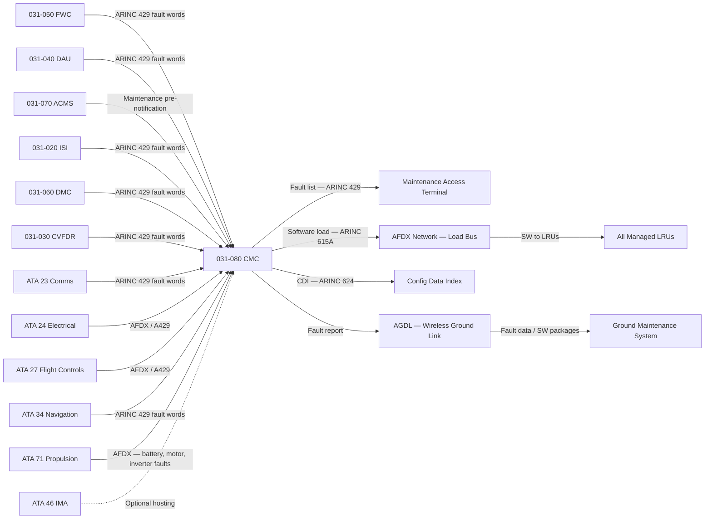
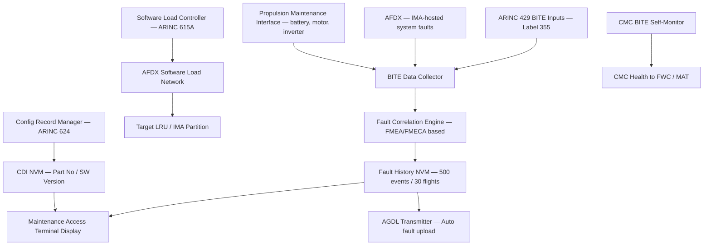
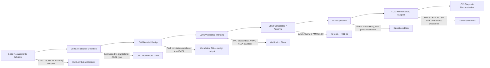

# 031-080 — Maintenance Recording and Diagnostic Interfaces
### AMPEL360e eWTW · ATA 31 · Q+ATLANTIDE ATLAS Scaffold

---

## §0 Hyperlink Policy

All internal links use relative paths from the current directory. External regulatory and standards references use anchor links defined in [§20 References](#20-references). Links marked **TBD** indicate targets not yet allocated. Programme-level links traverse five directory levels (`../../../../../`). No absolute URLs are used for internal navigation.

---

## §1 Purpose

This document defines the Maintenance Recording and Diagnostic Interface functions for the AMPEL360e eWTW aircraft. These functions collectively constitute the onboard maintenance system that records, consolidates, and provides access to aircraft Built-In Test Equipment (BITE) data from all avionic and system LRUs, enabling efficient line and base maintenance diagnostics and reducing aircraft on-ground time.

The central element is the Central Maintenance Computer (CMC), also referred to as the On-board Maintenance System (OMS) in some conventions. The CMC collects BITE fault messages from all contributing systems via ARINC 429 buses and AFDX, correlates faults to identify root-cause LRUs, stores a fault history for a configurable duration, and presents consolidated maintenance information at the Maintenance Access Terminal (MAT) in the flight deck and at the ground maintenance panel. The CMC also controls the software loading process via ARINC 615A and manages the configuration record of all LRUs.

**ATA 31 vs ATA 45 Boundary — Open Issue**: There is an unresolved programme boundary decision regarding whether the CMC/OMS is attributed to ATA 31 (Indicating and Recording) or ATA 45 (Central Maintenance System). Current ATA iSpec 2200 and most airline MEL structures place the CMC under ATA 45. However, the eWTW IMA architecture may result in the CMC being a software function within the IMA platform, which is primarily governed under ATA 31. This boundary must be resolved at programme level. Pending resolution, this document covers the CMC/OMS under ATA 31-80 as a recording and diagnostic interface function, with the understanding that a separate ATA 45 document may supersede or cross-reference this content.

---

## §2 Applicability

| Attribute | Value |
|---|---|
| Programme | AMPEL360e Wide Tube-and-Wing (eWTW) |
| ATA Chapter / Subsubject | 31-80 — Maintenance Recording and Diagnostic Interfaces |
| Aircraft Variant | eWTW-100 (baseline), eWTW-100ER |
| Certification Basis | CS-25 (EASA), FAR Part 25 (FAA bilateral) |
| S1000D SNS | 031-80 |
| DMC Prefix | DMC-AMPEL360E-EWTW-031-80 |
| Effectivity | All MSN from MSN 001 |

---

## §3 System / Function Overview

The CMC performs the following primary functions:

1. **BITE data collection**: Receives fault and exceedance messages from all system LRUs and IMA-hosted functions via ARINC 429 (Label 355 fault words) and AFDX. Contributing systems include: FWC, DAU, ACMS, ISI, DMC, CVFDR, ATC transponder, VHF radios, navigation systems (ATA 34), HVDC electrical system (ATA 24), battery management (ATA 80), propulsion controllers (ATA 71), and flight controls (ATA 27).

2. **Fault correlation**: Correlates multiple BITE messages to identify the likely root-cause LRU using an internal correlation logic database. Reduces spurious intermediate faults and prevents unnecessary LRU removals.

3. **Fault history storage**: Stores fault events with timestamps, flight phase, flight number, and parameter snapshots in non-volatile memory (target: minimum 500 fault events, minimum 30 flights).

4. **Maintenance access terminal (MAT)**: Provides maintenance crew with access to fault history, system test initiation, software loading, and LRU configuration record via a dedicated display in the flight deck (accessible on ground only) or a portable maintenance terminal connected at the maintenance access panel.

5. **Software loading control (ARINC 615A)**: Manages the loading of approved software to avionics LRUs and IMA partitions via the ARINC 615A data loader protocol, using the aircraft's local AFDX network.

6. **Configuration record management (ARINC 624)**: Maintains the aircraft Configuration Data Index (CDI) per ARINC 624, recording part number, software version, and hardware version of all managed LRUs. Generates LRU configuration reports for maintenance planning.

7. **Wireless ground link (AGDL) interface**: Manages the wireless ground datalink (802.11 or equivalent — TBD) used for automatic BITE data and software upload/download at the gate without physical connection.

---

## §4 Scope

### 4.1 Included
- CMC/OMS software function (IMA-hosted or standalone LRU — boundary TBD: ATA 31 vs ATA 45)
- BITE data collection interface (ARINC 429 label 355 and AFDX) from all contributing systems
- Fault correlation logic database
- Fault history storage (NVM — minimum 500 events / 30 flights)
- Maintenance Access Terminal (MAT) — flight deck maintenance display
- Ground maintenance panel interface
- Software loading control via ARINC 615A
- LRU configuration record management (ARINC 624)
- Automatic Ground Data Link (AGDL) interface management
- Propulsion system maintenance data (battery, motor, inverter fault history)

### 4.2 Excluded
- Individual system BITE functions — each system provides its own BITE (ATA 23, 24, 27, 34, 71, etc.)
- ATA 46 IMA platform management (though CMC may be IMA-hosted, IMA management is ATA 46)
- CMC-independent test systems (ATA 45 if separate CMC allocated there)
- External ground maintenance systems (airline side)

---

## §5 Architecture Description

- **CMC implementation**: IMA-hosted (preferred) or standalone ARINC 600 LRU in avionics bay (3 MCU typical); pending ATA 31 vs ATA 45 boundary decision
- **BITE data collection**: ARINC 429 label 355 (fault words) from all contributing LRUs; AFDX for IMA-hosted system faults; 100% electrical system fault collection via HVDC bus manager and battery management system
- **Fault correlation database**: compiled from eWTW FMEA/FMECA outputs; approved as part of CMC software; defines single-fault and multi-fault correlation trees for all system combinations
- **Fault history NVM**: minimum 500 events; minimum 30 flight-leg records; circular overwrite when full; protected against power loss
- **Maintenance Access Terminal**: dedicated display in flight deck (lower centre pedestal or P5 maintenance panel); accessible only when WOW (weight on wheels) signal active; password protected (TBD: access control method)
- **ARINC 615A data loader**: CMC acts as data loader host on AFDX network; supports all standard ARINC 615A load types (full image, partial update, config data)
- **ARINC 624 CDI**: CMC polls each managed LRU for part number and software version; maintains CDI in NVM; compared against the aircraft's approved Configuration Control Document (CCD)
- **AGDL**: wireless ground link (802.11ac or 4G LTE — TBD); automatically activates on gate arrival; transmits fault report to airline ground maintenance system; can receive software packages for next-flight loading

---

## §6 Functional Breakdown

| Function ID | Function Title | Description | Applicable Component |
|---|---|---|---|
| F-001 | BITE Data Collection | Collects fault messages from all ARINC 429 / AFDX contributing systems; validates label 355 data | CMC data collection |
| F-002 | Fault Correlation | Correlates multi-system BITE messages; identifies root-cause LRU; reduces false fault removals | CMC correlation engine |
| F-003 | Fault History Storage | Stores timestamped fault events with flight phase and parameter snapshot in NVM | CMC NVM storage |
| F-004 | Maintenance Access Terminal Display | Provides fault list, system status, and test initiation to maintenance crew at MAT | CMC display function |
| F-005 | Software Loading Control | Controls ARINC 615A loading of LRU and IMA software from portable DL or AGDL | CMC data loader |
| F-006 | Configuration Record Management | Maintains ARINC 624 CDI; generates LRU config report | CMC config manager |
| F-007 | AGDL Interface | Manages wireless ground data link for automatic fault report upload and software download | CMC AGDL interface |
| F-008 | Propulsion System Maintenance Integration | Integrates electric propulsion fault history (battery, motor, inverter) with standard BITE collection | CMC propulsion module |
| F-009 | CMC BITE Self-Monitoring | Monitors CMC health; generates maintenance message on CMC failure; reports to flight deck memo | CMC BITE |

---

## §7 System Context Diagram

---

## §8 Internal Functional Architecture

---

## §9 Lifecycle Traceability

---

## §10 Interfaces

| Interface ID | System / Chapter | Interface Type | Data / Signal | Direction | Status |
|---|---|---|---|---|---|
| IF-031-080-001 | 031-050 FWC | ARINC 429 / AFDX | FWC BITE fault words (label 355) | FWC → CMC |  |
| IF-031-080-002 | 031-040 DAU | ARINC 429 | DAU BITE fault words | DAU → CMC |  |
| IF-031-080-003 | 031-070 ACMS | ARINC 429 / AFDX | ACMS maintenance pre-notification | ACMS → CMC |  |
| IF-031-080-004 | ATA 71 Propulsion | AFDX / ARINC 429 | Battery, motor, inverter fault data | ATA71 → CMC |  |
| IF-031-080-005 | ATA 24 Electrical | AFDX / ARINC 429 | HVDC bus fault data, battery management fault | ATA24 → CMC |  |
| IF-031-080-006 | ATA 27 Flight Controls | AFDX / ARINC 429 | FCS BITE fault words | ATA27 → CMC |  |
| IF-031-080-007 | ATA 34 Navigation | ARINC 429 | IRS, ADC, GPS BITE fault words | ATA34 → CMC |  |
| IF-031-080-008 | MAT display | ARINC 429 / discrete | Fault list, test initiation, SW load commands | CMC ↔ MAT |  |
| IF-031-080-009 | AFDX Load Bus | AFDX | ARINC 615A software data loads to LRUs | CMC → All LRUs |  |
| IF-031-080-010 | AGDL (wireless) | 802.11 / LTE (TBD) | Auto fault report upload; SW package download | CMC ↔ Ground |  |
| IF-031-080-011 | ATA 46 IMA | AFDX / IMA partition | IMA hosting of CMC function (if applicable) | IMA ↔ CMC |  |

---

## §11 Operating Modes

| Mode ID | Mode Name | Description | Entry Condition | Exit Condition |
|---|---|---|---|---|
| OM-001 | In-Flight Monitoring | CMC collects BITE data from all systems; fault history updated; no MAT display access | Aircraft airborne | Landing |
| OM-002 | Ground Maintenance | Full MAT access — fault list, system tests, configuration record; AGDL active | WOW active + parking brake | Aircraft airborne |
| OM-003 | Software Loading | ARINC 615A data load in progress; affected LRU(s) may be temporarily unavailable | Maintenance initiates load | Load complete or aborted |
| OM-004 | Configuration Check | CMC polls all LRUs for part number / SW version; CDI updated and compared against CCD | Triggered by maintenance or at each power-up | CDI update complete |
| OM-005 | AGDL Auto Transfer | Fault report automatically transmitted via AGDL on gate arrival | AGDL link established on gate arrival | Transfer complete or AGDL link lost |
| OM-006 | CMC Failure | CMC BITE fault; maintenance memo generated; manual MAT access not available | CMC hardware or software failure | CMC restart or LRU replacement |

---

## §12 Monitoring and Diagnostics

The CMC continuously monitors its own health via an internal BITE function. A CMC failure is reported as a maintenance memo on the ECAM/EICAS system. BITE data collection continues on a best-effort basis even if the CMC data correlator fails; raw fault messages are preserved in a direct-record buffer to prevent data loss during a partial CMC failure.

For the eWTW electric propulsion system, the CMC provides a dedicated maintenance view of battery fault history, motor controller alarms, and inverter thermal events. This propulsion-specific maintenance view is accessible at the MAT under a dedicated menu. The propulsion maintenance data is critical for battery warranty management, and the CMC provides configurable export of propulsion fault data in CSV or ARINC 620 format for transmission via ACARS (via ACMS interface).

---

## §13 Maintenance Concept

CMC software is loaded via ARINC 615A; the fault correlation database is part of the CMC software image and is updated when the software is updated. Threshold changes to the fault correlation logic require an approved CMC software change. Standalone CMC LRU: line maintenance R&R; no calibration required; fault history and CDI may or may not be transferred to replacement unit (TBD — NVM transfer procedure). IMA-hosted CMC: software reload via ARINC 615A; no physical R&R.

Fault history review: maintenance crew accesses MAT on ground; filters by ATA chapter, flight leg, or fault code; prints or downloads fault record via AGDL or maintenance USB port (TBD). CDI check: performed at each maintenance visit; discrepancies between CDI and CCD generate a non-conformance report for configuration management.

---

## §14 S1000D / CSDB Mapping

### 14.1 SNS to DMC Mapping

| SNS Code | Subsubject | DMC Prefix | Info Codes Planned | DMRL Status |
|---|---|---|---|---|
| 031-80 | Maintenance Recording and Diagnostic Interfaces | DMC-AMPEL360E-EWTW-031-80 | 040, 300, 400, 520 |  |
| 031-80-01 | CMC / OMS Software Function | DMC-AMPEL360E-EWTW-031-80-01 | 040, 400 |  |
| 031-80-02 | ARINC 615A Software Loading | DMC-AMPEL360E-EWTW-031-80-02 | 300, 400 |  |
| 031-80-03 | Propulsion Maintenance Integration | DMC-AMPEL360E-EWTW-031-80-03 | 040, 400 |  |
| 031-80-04 | AGDL Ground Interface | DMC-AMPEL360E-EWTW-031-80-04 | 040, 300 |  |

### 14.2 Information Code Definitions (031-80)

| Info Code | Description | Notes |
|---|---|---|
| 040 | System description — CMC architecture, BITE collection, fault correlation, AGDL | AMM basis |
| 300 | Operation — MAT access, fault review, configuration check procedures | AMM Line Maintenance |
| 400 | Maintenance — CMC SW load, fault history download, CDI procedure | AMM |
| 520 | Troubleshooting — CMC failure, BITE data missing, AGDL fault | FRM |

---

## §15 Footprints

### 15.1 Physical Footprint
- CMC: IMA-hosted — no dedicated LRU; or standalone — avionics bay, ARINC 600 rack, 3–4 MCU (TBD pending ATA 31/45 boundary decision)
- MAT: integrated display in flight deck lower panel or dedicated maintenance laptop port

### 15.2 Electrical / Data Footprint
- CMC power: 28VDC from avionics bus (typical 15–30 W for standalone)
- BITE data inputs: ARINC 429 from each contributing system; AFDX for IMA-hosted functions
- Software load bus: AFDX (ARINC 615A over AFDX)
- AGDL: 802.11 or LTE — TBD; managed by CMC; feeds into airline maintenance ground system

### 15.3 Maintenance Footprint
- Standalone R&R: avionics bay, ARINC 600 connector, line maintenance
- Software load: ARINC 615A via CMC control; AGDL or portable data loader
- Fault history: exported via AGDL or USB (TBD) at each maintenance stop

### 15.4 Data Footprint
- Fault history NVM: minimum 500 events / 30 flight-legs, each with timestamp, flight phase, and parameter snapshot
- CDI database: all managed LRU part numbers and software versions — persistent across power cycles
- Software load archive: last three software image sets retained on CMC (TBD)

---

## §16 Safety and Certification Considerations

| Requirement | Source | Description | Compliance Approach | Status |
|---|---|---|---|---|
| CS-25.1301 | EASA CS-25 | CMC must not adversely affect airworthiness of served systems | CMC is ground-access-only for maintenance functions; BITE data collection passive (no command authority) |  |
| ARINC 615A | ARINC | Software load standard | All CMC-managed software loads comply with ARINC 615A; loaded software validated per DO-178C |  |
| ARINC 624 | ARINC | On-Board Maintenance System standard | CMC implements ARINC 624 CDI and report formats |  |
| DAL (CMC) | ARP 4754A | CMC failure — ground maintenance impact only, not safety-critical; expected DAL D or E | DAL confirmed in SSA |  |
| DO-326A | RTCA | AGDL cybersecurity | AGDL data link security assessment per DO-326A — TBD |  |

---

## §17 Verification and Validation

| V&V ID | Requirement | Method | Success Criterion | Status |
|---|---|---|---|---|
| VV-031-080-001 | BITE data collection from all systems | Ground Test (iron bird or laboratory) | Fault messages from all contributing systems correctly received and stored in CMC fault history |  |
| VV-031-080-002 | Fault correlation logic | Analysis + Ground Test | Injected multi-system fault correctly identifies root-cause LRU per correlation database |  |
| VV-031-080-003 | ARINC 615A software load | Ground Test | All managed LRUs successfully loaded with test software image via CMC control |  |
| VV-031-080-004 | ARINC 624 CDI | Ground Test | CDI correctly reports part number and software version for all managed LRUs |  |
| VV-031-080-005 | AGDL automatic transfer | Ground Test | Fault report automatically transmitted to ground system on simulated gate arrival |  |
| VV-031-080-006 | Electric propulsion fault integration | Ground Test | Battery, motor, and inverter fault messages from ATA 71 correctly integrated in CMC fault history |  |

---

## §18 Glossary

| Term | Acronym | Definition |
|---|---|---|
| Central Maintenance Computer | CMC | Avionics computer that collects, correlates, stores, and displays BITE data from all aircraft systems |
| On-board Maintenance System | OMS | Synonym for CMC in some conventions; also used as the broader concept including MAT and AGDL |
| Built-In Test Equipment | BITE | Self-test capability within each LRU that generates fault messages on detection of anomalies |
| Maintenance Access Terminal | MAT | Display and input device in flight deck through which maintenance crew accesses CMC data |
| ARINC 615A | — | Standard for airborne data loader — used for software loading to LRUs via data network |
| ARINC 624 | — | Standard for On-board Maintenance Systems — defines CDI, report formats, and data interchange |
| Configuration Data Index | CDI | Record of all LRU part numbers and software versions maintained by the CMC |
| Automatic Ground Data Link | AGDL | Wireless data link used to automatically transfer maintenance data and software at the gate |
| Fault Correlation | — | Process by which the CMC identifies the most probable root-cause LRU from a set of related BITE messages |
| Label 355 | — | ARINC 429 label number used for fault word transmission from LRUs to the CMC |
| Configuration Control Document | CCD | Programme document defining the approved configuration of all LRUs; CMC CDI is compared against the CCD |
| Data Loader | — | Device or function that loads software images to avionics LRUs via ARINC 615A |

---

## §19 Citations

| Citation ID | Source | Title / Description | Relevance |
|---|---|---|---|
| CIT-031-080-001 | ARINC | ARINC 615A — Airborne Data Loader | Software loading standard |
| CIT-031-080-002 | ARINC | ARINC 624 — On-Board Maintenance System | CMC data format standard |
| CIT-031-080-003 | RTCA | DO-326A — Airworthiness Security Process | AGDL cybersecurity |
| CIT-031-080-004 | EASA | CS-25 §1301 | CMC general compliance |
| CIT-031-080-005 | SAE | ARP 4754A — Development of Civil Aircraft Systems | DAL assessment for CMC |

---

## §20 References

| Ref ID | Document | Title | Version | Link |
|---|---|---|---|---|
| REF-031-080-001 | ARINC 615A | Airborne Data Loader | 2006 | [ARINC 615A](https://aviation-ia.com/) |
| REF-031-080-002 | ARINC 624 | On-Board Maintenance System | 1993 | [ARINC 624](https://aviation-ia.com/) |
| REF-031-080-003 | RTCA DO-326A | Airworthiness Security Process Specification | 2014 | [DO-326A](https://www.rtca.org/) |
| REF-031-080-004 | 031-050 | Central Warning, Caution and Advisory | 0.1.0 | [031-050](./031-050-Central-Warning-Caution-and-Advisory.md) |
| REF-031-080-005 | 031-070 | Automatic Data Reporting and ACMS | 0.1.0 | [031-070](./031-070-Automatic-Data-Reporting-and-Aircraft-Condition-Monitoring.md) |

---

## §21 Open Issues

| Issue ID | Description | Owner | Priority | Target Date | Status |
|---|---|---|---|---|---|
| OI-031-080-001 | ATA 31 vs ATA 45 boundary for CMC — must be resolved at programme level to establish correct documentation tree | Systems Architect | Critical | LC02 |  |
| OI-031-080-002 | CMC as IMA-hosted function vs standalone LRU — pending boundary decision and IMA sizing study | Systems Architect | High | LC03 |  |
| OI-031-080-003 | AGDL technology (802.11 vs LTE vs other) — airport infrastructure availability not yet assessed | Ground Operations | Medium | LC03 |  |
| OI-031-080-004 | Electric propulsion fault correlation database — requires FMEA/FMECA inputs from ATA 71 (not yet available) | Propulsion Systems Eng | High | LC05 |  |
| OI-031-080-005 | AGDL cybersecurity assessment (DO-326A) — not yet initiated | Security Engineer | High | LC05 |  |
| OI-031-080-006 | MAT access control — password / biometric / smart card — human factors study pending | Human Factors | Low | LC05 |  |

---

## §22 Change Log

| Revision | Date | Author | Description of Change |
|---|---|---|---|
| 0.1.0 | 2026-05-09 | ATLAS Scaffold Generator | Initial scaffold creation — all sections populated; marked DRAFT |

 This document is a programme-controlled scaffold. All content is subject to review by the responsible system expert before formal issue.
