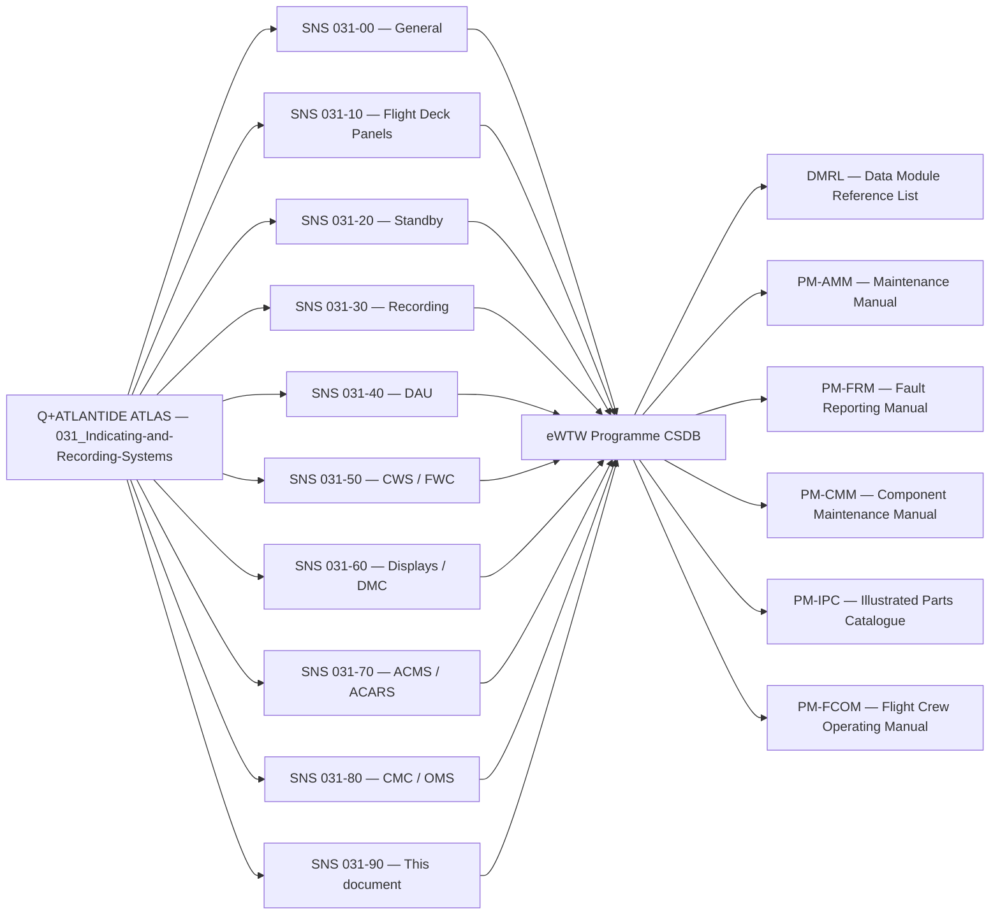
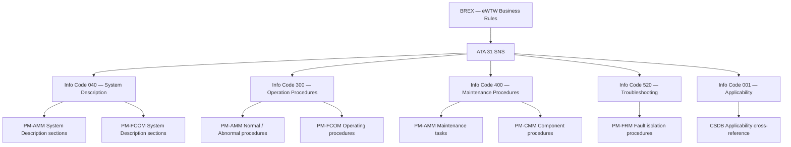
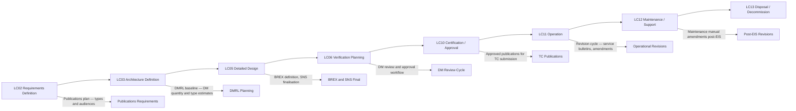

# 031-090 — S1000D CSDB Mapping and Traceability
### AMPEL360e eWTW · ATA 31 · Q+ATLANTIDE ATLAS Scaffold

---

## §0 Hyperlink Policy

All internal links use relative paths from the current directory. External regulatory and standards references use anchor links defined in [§20 References](#20-references). Links marked **TBD** indicate targets not yet allocated. Programme-level links traverse five directory levels (`../../../../../`). No absolute URLs are used for internal navigation.

---

## §1 Purpose

This document provides the complete S1000D System/Subsystem/Subject (SNS) allocation table for ATA 31 (Indicating and Recording Systems) on the AMPEL360e eWTW programme. It serves as the traceability bridge between the Q+ATLANTIDE ATLAS scaffold node structure and the programme CSDB (Common Source DataBase) Data Module Reference List (DMRL), defining which SNS codes are allocated to which ATLAS nodes, which information codes are planned for each SNS, and which publications will consume those data modules.

This document also specifies the BREX (Business Rules Exchange) applicability for ATA 31 data modules and the CSDB workflow states that govern the authoring, review, approval, and publication lifecycle of ATA 31 content. It replaces the generic "Operating Modes" section used in other 031-0XX files with CSDB authoring workflow states, as this document governs documentation process rather than system operation.

The S1000D mapping covers all ten subsubject nodes of ATA 31 as defined in this ATLAS (031-000 through 031-090) and provides the DMRL planning baseline for the Technical Publications department.

---

## §2 Applicability

| Attribute | Value |
|---|---|
| Programme | AMPEL360e Wide Tube-and-Wing (eWTW) |
| ATA Chapter / Subsubject | 31-90 — S1000D CSDB Mapping and Traceability |
| Aircraft Variant | eWTW-100 (baseline), eWTW-100ER |
| S1000D SNS | 031-90 |
| DMC Prefix | DMC-AMPEL360E-EWTW-031-90 |
| Effectivity | All MSN from MSN 001 |
| S1000D Issue | 5.0 (target; 4.2 fallback — TBD) |

---

## §3 System / Function Overview

S1000D is the international specification for technical publications for civil and military equipment, maintained by the Aerospace and Defence Industries Association of Europe (ASD), the Aerospace Industries Association (AIA), and the Air Transport Association (ATA). For the eWTW programme, S1000D Issue 5.0 is the target authoring specification, with Issue 4.2 as a fallback if toolchain compatibility requires it.

The CSDB is the authoritative source repository for all eWTW technical data modules. It is managed by the Technical Publications department and is governed by the programme BREX. All data modules in the CSDB are identified by a Data Module Code (DMC) that encodes the Model Identification Code (MIC), System Difference Code, Standard Numbering System (SNS), assembly code, disassembly variant, information code, and language/variant codes.

For ATA 31, the SNS structure follows the established ATA iSpec 2200 chapter structure, with the addition of the novel eWTW-specific electric propulsion parameters distributed across the relevant subsubjects. The DMRL for ATA 31 is maintained as a programme-controlled register; this document provides the planning baseline. The actual DMRL (including DM quantity, applicability, and effectivity) is maintained in the CSDB DMRL module.

---

## §4 Scope

### 4.1 Included
- SNS allocation table for all 031-00 through 031-90 subsubjects
- DMRL planning baseline: information code assignments, publication type assignments, and DM quantity estimates for each SNS
- BREX applicability rules for ATA 31 data modules
- Publication hierarchy: which publications (PM-AMM, FRM, CMM, IPC, FCOM) consume ATA 31 data modules and from which SNS ranges
- CSDB workflow states replacing the standard "Operating Modes" section in this file
- S1000D–ATLAS ATLAS-node cross-reference table

### 4.2 Excluded
- Actual data module content — content is in the individual ATLAS node documents and the CSDB DMs
- BREX file maintenance — maintained by the CSDB administrator; referenced not authored here
- DMRL formal register — maintained in CSDB; this document is the planning basis only
- Publication assemblies (PM, IPD etc.) — maintained in CSDB

---

## §5 Architecture Description

The eWTW S1000D publication infrastructure for ATA 31 consists of:

- **CSDB**: programme CSDB (toolchain TBD — likely Cortona3D Smart Publisher, Flatirons CORENA, or equivalent); all DMs authored and managed in CSDB with full version control and workflow
- **DMRL**: Data Module Reference List — the formal register of all DMs planned for the programme; ATA 31 subset managed by the Avionics Tech Pubs lead
- **BREX**: Business Rules Exchange data module — specifies allowed values for all coded elements in eWTW DMs; validated against each DM before publication
- **Publication Modules (PM)**: assemble DMs into deliverable publications; PM-AMM (Aircraft Maintenance Manual), PM-FRM (Fault Reporting Manual), PM-CMM (Component Maintenance Manual), PM-IPC (Illustrated Parts Catalogue), PM-FCOM (Flight Crew Operating Manual link to ATA 31 cockpit procedures)
- **Applicability**: DM applicability coded per CSDB applicability cross-reference table (ACT); eWTW-100 and eWTW-100ER variants managed via applicability annotations
- **Effectivity**: MSN-based effectivity managed in CSDB; from MSN 001 for all ATA 31 DMs at EIS

---

## §6 SNS Allocation Table — ATA 31

| SNS Code | ATLAS Node | Subsubject Title | Lead ATLAS Doc | DM Prefix | Approx DM Qty | Primary Publications |
|---|---|---|---|---|---|---|
| 031-00 | 031-000 | Indicating and Recording — General | 031-000-Indicating-and-Recording-General.md | DMC-AMPEL360E-EWTW-031-00 | 4–6 | PM-AMM, PM-FCOM |
| 031-10 | 031-010 | Flight Deck Indicating and Control Panels | 031-010-Flight-Deck-Indicating-and-Control-Panels.md | DMC-AMPEL360E-EWTW-031-10 | 10–15 | PM-AMM, PM-IPC, PM-FCOM |
| 031-20 | 031-020 | Independent and Standby Indicating Systems | 031-020-Independent-and-Standby-Indicating-Systems.md | DMC-AMPEL360E-EWTW-031-20 | 6–8 | PM-AMM, PM-IPC, PM-CMM |
| 031-30 | 031-030 | Recording Systems | 031-030-Recording-Systems.md | DMC-AMPEL360E-EWTW-031-30 | 8–12 | PM-AMM, PM-CMM, PM-IPC |
| 031-40 | 031-040 | Data Acquisition and Concentration | 031-040-Data-Acquisition-and-Concentration.md | DMC-AMPEL360E-EWTW-031-40 | 6–10 | PM-AMM, PM-CMM |
| 031-50 | 031-050 | Central Warning, Caution and Advisory | 031-050-Central-Warning-Caution-and-Advisory.md | DMC-AMPEL360E-EWTW-031-50 | 10–15 | PM-AMM, PM-FRM, PM-FCOM |
| 031-60 | 031-060 | Electronic Display and Indication Systems | 031-060-Electronic-Display-and-Indication-Systems.md | DMC-AMPEL360E-EWTW-031-60 | 12–18 | PM-AMM, PM-IPC, PM-CMM, PM-FCOM |
| 031-70 | 031-070 | Automatic Data Reporting and ACMS | 031-070-Automatic-Data-Reporting-and-Aircraft-Condition-Monitoring.md | DMC-AMPEL360E-EWTW-031-70 | 6–10 | PM-AMM, PM-FCOM |
| 031-80 | 031-080 | Maintenance Recording and Diagnostic Interfaces | 031-080-Maintenance-Recording-and-Diagnostic-Interfaces.md | DMC-AMPEL360E-EWTW-031-80 | 8–12 | PM-AMM, PM-FRM |
| 031-90 | 031-090 | S1000D CSDB Mapping and Traceability | 031-090-S1000D-CSDB-Mapping-and-Traceability.md | DMC-AMPEL360E-EWTW-031-90 | 2–4 | Tech Pubs internal |

---

## §7 ATLAS Node to CSDB Context Diagram

---

## §8 DMRL Planning — Information Code Allocation

---

## §9 Lifecycle Traceability

---

## §10 CSDB Workflow States

The following workflow states govern ATA 31 data modules in the CSDB from initial authoring through to publication. This section replaces the generic "Operating Modes" section used in other 031-0XX documents, as this subsubject governs documentation process lifecycle rather than avionics system operation.

| State ID | CSDB State | Description | Entry Condition | Exit Condition |
|---|---|---|---|---|
| WS-001 | Authoring | DM content under active development by technical author | DM allocated in DMRL; author assigned | Technical author marks DM ready for review |
| WS-002 | Technical Review | DM reviewed by subject matter expert (system engineer, test engineer) | Author releases to review | Reviewer accepts or rejects with comments |
| WS-003 | Editorial Review | DM reviewed for S1000D conformance, BREX compliance, and language quality | Technical review approved | Editorial review complete |
| WS-004 | Approved | DM content formally approved; ready for publication assembly | Editorial review passed; approval authority signs off | DM included in PM assembly; or superseded |
| WS-005 | Published | DM included in an issued publication; frozen content | PM assembled and issued | Revision initiated or DM superseded |
| WS-006 | Superseded | DM replaced by a new revision or a new DM; retained in CSDB for historical record | New revision issued and published | Archived — no further change expected |
| WS-007 | Cancelled | DM removed from DMRL before publication; content may be redistributed to other DMs | DMRL re-plan; DM no longer required | Archived |

---

## §11 BREX Applicability for ATA 31

The eWTW BREX data module defines the allowed values for all controlled elements in programme DMs. For ATA 31, the following BREX constraints are particularly relevant:

| BREX Rule ID | Element | Constraint | Rationale |
|---|---|---|---|
| BREX-031-001 | systemCode | Must be "031" for all ATA 31 DMs | Ensures correct SNS classification |
| BREX-031-002 | subSystemCode | Must be one of: 00, 10, 20, 30, 40, 50, 60, 70, 80, 90 | Restricts to defined 031 subsubjects |
| BREX-031-003 | infoCode | Allowed values: 001, 040, 300, 400, 520, 941 for ATA 31 | Limits info codes to planned publication types |
| BREX-031-004 | language | Must be "en-US" for baseline; "es-ES" for Spanish variant | eWTW multi-language publication plan |
| BREX-031-005 | applicability product | Must reference eWTW-100 or eWTW-100ER from the ACT | Ensures correct variant applicability |
| BREX-031-006 | securityClassification | Must be "01" (unclassified) for all commercial eWTW DMs | Commercial aviation document — no classification |
| BREX-031-007 | skillLevel | Must be one of: sk-c (crew), sk-m (maintenance technician), sk-e (engineer) | Ensures appropriate audience targeting |

---

## §12 Publication Hierarchy

### 12.1 PM-AMM — Aircraft Maintenance Manual

The Aircraft Maintenance Manual is the primary maintenance publication for the eWTW. ATA 31 contributes the following AMM content:
- System descriptions (Info Code 040) from SNS 031-00 through 031-80
- Maintenance procedures (Info Code 400): display removal/installation, CVFDR R&R, ISI R&R, BITE access procedures, software loading procedures
- Troubleshooting references: cross-reference to FRM for fault isolation
- Est. DM count from ATA 31: 40–70 DMs across all subsubjects

### 12.2 PM-FRM — Fault Reporting Manual

The Fault Reporting Manual is the primary troubleshooting reference. ATA 31 contributes:
- Fault isolation procedures (Info Code 520) primarily from SNS 031-50 (FWC alert logic), 031-60 (DMC fault), 031-70 (ACMS fault), 031-80 (CMC fault)
- BITE-driven fault isolation (CMC provides fault code to FRM procedure link)
- Est. DM count from ATA 31: 10–20 DMs

### 12.3 PM-CMM — Component Maintenance Manual

The CMM covers component-level maintenance. ATA 31 components with CMM content include: ISI (031-20), CVFDR (031-30), QAR (031-30), DAU/DFDAU (031-40), WEU (031-50), display units (031-60), standby instruments.
- Est. DM count from ATA 31: 15–25 DMs

### 12.4 PM-IPC — Illustrated Parts Catalogue

The IPC identifies all illustrated parts with part numbers. ATA 31 contributes IPC content for all LRUs and their sub-components.
- Est. DM count from ATA 31: 20–30 DMs

### 12.5 PM-FCOM — Flight Crew Operating Manual

The FCOM includes system descriptions for crew awareness. ATA 31 contributes descriptions of the flight deck indicating system, ECAM/EICAS alerts, standby instruments, and ACMS reporting for crew awareness.
- Est. DM count from ATA 31: 5–10 DMs

---

## §13 Maintenance Concept

This subsubject (031-090) governs the documentation management process rather than a physical system. The "maintenance" of the SNS mapping and DMRL is performed by the Technical Publications department in the CSDB under change control. Changes to the SNS allocation table require approval from the Chief Technical Publications Manager and the System Integration lead, as SNS changes affect the structure of all deliverable publications.

Any addition of a new subsubject within ATA 31 (e.g., if the eWTW introduces a novel system function not covered by the existing 031-00 through 031-80 subsubjects) requires: (1) a new ATLAS node document, (2) SNS allocation by the Technical Publications department, (3) DMRL update, (4) BREX update if new constraints apply, and (5) programme change request.

---

## §14 S1000D / CSDB Mapping (Self-Reference)

### 14.1 SNS to DMC Mapping

| SNS Code | Subsubject | DMC Prefix | Info Codes Planned | DMRL Status |
|---|---|---|---|---|
| 031-90 | S1000D CSDB Mapping and Traceability | DMC-AMPEL360E-EWTW-031-90 | 040, 941 |  |
| 031-90-01 | SNS Allocation Table | DMC-AMPEL360E-EWTW-031-90-01 | 040 |  |
| 031-90-02 | DMRL Planning Baseline | DMC-AMPEL360E-EWTW-031-90-02 | 040 |  |

### 14.2 Information Code Definitions (031-90)

| Info Code | Description | Notes |
|---|---|---|
| 040 | System description — SNS mapping, DMRL planning, BREX rules, publication hierarchy | Tech Pubs internal and certification evidence |
| 941 | BREX — Business Rules Exchange data module | Managed by CSDB administrator |

---

## §15 Footprints

### 15.1 Physical Footprint
- This is a documentation governance document; no physical aircraft system footprint

### 15.2 Electrical / Data Footprint
- No aircraft electrical or data bus footprint; CSDB is a ground-based IT system

### 15.3 Maintenance Footprint
- CSDB management: Technical Publications department; approved CSDB toolchain
- DMRL updates: change-controlled; approval by Tech Pubs Manager and SI lead
- BREX updates: change-controlled; CSDB administrator and Tech Pubs Manager

### 15.4 Data Footprint
- CSDB storage: programme CSDB server (on-premise or cloud — TBD)
- DMRL: formal register maintained in CSDB; accessed by Technical Publications, Engineering, and Certification teams
- BREX: single controlled file in CSDB; all DMs validated against BREX before approval

---

## §16 Safety and Certification Considerations

| Requirement | Source | Description | Compliance Approach | Status |
|---|---|---|---|---|
| S1000D Issue 5.0 | ASD/AIA/ATA | S1000D specification compliance for all DMs | All ATA 31 DMs authored to S1000D Issue 5.0 (or 4.2 fallback) rules; BREX-validated |  |
| EASA Part-21 | EASA | Technical publications are part of the TC data package | AMM (PM-AMM) and FRM (PM-FRM) are part of the Instructions for Continued Airworthiness (ICA) required by CS-25.1529 |  |
| CS-25.1529 | EASA CS-25 | Instructions for Continued Airworthiness | ATA 31 AMM tasks and FRM procedures are ICA-critical; must be complete and accurate before TC issue |  |
| ATA iSpec 2200 | ATA | ATA chapter and figure numbering conventions | SNS allocation follows ATA iSpec 2200 structure; deviations documented in BREX |  |

---

## §17 Verification and Validation

| V&V ID | Requirement | Method | Success Criterion | Status |
|---|---|---|---|---|
| VV-031-090-001 | All ATA 31 DMs BREX-compliant | Automated BREX check in CSDB toolchain | Zero BREX violations in any published ATA 31 DM |  |
| VV-031-090-002 | DMRL completeness at TC | Review by Tech Pubs Manager | All required ICA DMs present in DMRL and in Published state before TC submission |  |
| VV-031-090-003 | SNS allocation consistency | Review | No SNS code assigned to more than one ATLAS node; no ATLAS node without SNS allocation |  |
| VV-031-090-004 | Publication hierarchy completeness | Review | All ATA 31 DMs assigned to at least one publication module |  |

---

## §18 Glossary

| Term | Acronym | Definition |
|---|---|---|
| Common Source DataBase | CSDB | Authoritative source repository for all S1000D technical data modules on the eWTW programme |
| Data Module | DM | Atomic unit of technical information in S1000D; identified by a unique DMC |
| Data Module Code | DMC | Unique identifier for each DM; encodes MIC, SNS, info code, and language |
| Data Module Reference List | DMRL | Formal register of all DMs planned for the programme; defines DM allocation and publication assignment |
| Business Rules Exchange | BREX | S1000D data module that defines allowed values for coded elements in the programme CSDB |
| System/Subsystem/Subject | SNS | Alphanumeric code in the DMC that identifies the aircraft system and subsystem |
| Publication Module | PM | S1000D assembly of DMs into a deliverable publication (e.g., PM-AMM, PM-FRM) |
| Aircraft Maintenance Manual | AMM | Primary line and base maintenance reference publication |
| Fault Reporting Manual | FRM | Fault isolation and troubleshooting publication |
| Component Maintenance Manual | CMM | Component-level maintenance procedures publication |
| Illustrated Parts Catalogue | IPC | Parts identification publication with illustrations and part numbers |
| Flight Crew Operating Manual | FCOM | Crew operating reference publication |
| Applicability Cross-Reference Table | ACT | CSDB table defining product variants and their applicability codes |
| Instructions for Continued Airworthiness | ICA | Mandatory maintenance data required by CS-25.1529 as part of the Type Certificate |
| Model Identification Code | MIC | Programme identifier in the DMC; for eWTW: AMPEL360E-EWTW |

---

## §19 Citations

| Citation ID | Source | Title / Description | Relevance |
|---|---|---|---|
| CIT-031-090-001 | ASD/AIA/ATA | S1000D Issue 5.0 — International Specification for Technical Publications | Primary authoring specification |
| CIT-031-090-002 | ATA | iSpec 2200 — Information Standards for Aviation Maintenance | SNS structure and info code guidance |
| CIT-031-090-003 | EASA | CS-25 §1529 — Instructions for Continued Airworthiness | ICA regulatory requirement |
| CIT-031-090-004 | EASA | Part-21 — Certification of Aircraft | TC data package requirements |

---

## §20 References

| Ref ID | Document | Title | Version | Link |
|---|---|---|---|---|
| REF-031-090-001 | S1000D Issue 5.0 | International Specification for Technical Publications | 5.0 | [S1000D](https://s1000d.org/) |
| REF-031-090-002 | ATA iSpec 2200 | Information Standards for Aviation Maintenance | Current | [ATA iSpec 2200](https://www.ata-spec2200.org/) |
| REF-031-090-003 | 031-000 | Indicating and Recording — General | 0.1.0 | [031-000](./031-000-Indicating-and-Recording-General.md) |
| REF-031-090-004 | 031-010 | Flight Deck Indicating and Control Panels | 0.1.0 | [031-010](./031-010-Flight-Deck-Indicating-and-Control-Panels.md) |
| REF-031-090-005 | 031-020 | Independent and Standby Indicating Systems | 0.1.0 | [031-020](./031-020-Independent-and-Standby-Indicating-Systems.md) |
| REF-031-090-006 | 031-030 | Recording Systems | 0.1.0 | [031-030](./031-030-Recording-Systems.md) |
| REF-031-090-007 | 031-040 | Data Acquisition and Concentration | 0.1.0 | [031-040](./031-040-Data-Acquisition-and-Concentration.md) |
| REF-031-090-008 | 031-050 | Central Warning, Caution and Advisory | 0.1.0 | [031-050](./031-050-Central-Warning-Caution-and-Advisory.md) |
| REF-031-090-009 | 031-060 | Electronic Display and Indication Systems | 0.1.0 | [031-060](./031-060-Electronic-Display-and-Indication-Systems.md) |
| REF-031-090-010 | 031-070 | Automatic Data Reporting and ACMS | 0.1.0 | [031-070](./031-070-Automatic-Data-Reporting-and-Aircraft-Condition-Monitoring.md) |
| REF-031-090-011 | 031-080 | Maintenance Recording and Diagnostic Interfaces | 0.1.0 | [031-080](./031-080-Maintenance-Recording-and-Diagnostic-Interfaces.md) |

---

## §21 Open Issues

| Issue ID | Description | Owner | Priority | Target Date | Status |
|---|---|---|---|---|---|
| OI-031-090-001 | S1000D Issue selection — 5.0 vs 4.2 fallback — toolchain compatibility not yet confirmed | Tech Pubs Manager | High | LC03 |  |
| OI-031-090-002 | CSDB toolchain selection — Cortona3D vs Flatirons CORENA vs other — procurement not yet started | IT / Tech Pubs | High | LC03 |  |
| OI-031-090-003 | BREX draft — not yet authored; requires CSDB toolchain and MIC to be defined first | CSDB Administrator | Medium | LC05 |  |
| OI-031-090-004 | DMRL formal register — planning baseline in this document; formal DMRL in CSDB not yet created | Tech Pubs Manager | Medium | LC05 |  |
| OI-031-090-005 | Multi-language publication plan — Spanish (es-ES) variant scope and timeline not yet defined | Tech Pubs Manager | Low | LC05 |  |
| OI-031-090-006 | ATA 31 vs ATA 45 boundary for CMC — if CMC moves to ATA 45, SNS allocation in this table must be revised | Systems Architect | High | LC02 |  |

---

## §22 Change Log

| Revision | Date | Author | Description of Change |
|---|---|---|---|
| 0.1.0 | 2026-05-09 | ATLAS Scaffold Generator | Initial scaffold creation — all sections populated; marked DRAFT |

 This document is a programme-controlled scaffold. All content is subject to review by the responsible system expert before formal issue.
