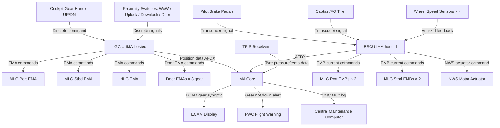
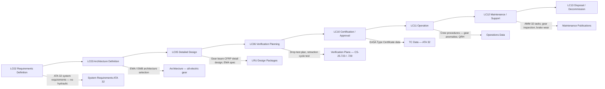

# 032-000 — Landing Gear — General
### [PROGRAMME-AIRCRAFT] [PROGRAMME-VARIANT] · ATA 32 · Q+ATLANTIDE ATLAS Scaffold

---

## §0 Hyperlink Policy

All internal links in this document use relative paths from the current directory. External regulatory and standards references use anchor links defined in [§20 References](#20-references). Links marked **TBD** indicate targets not yet allocated within the CSDB or ATLAS hierarchy. Programme-level links traverse five directory levels (`../../../../../`) to reach the repository root. No absolute URLs are used for internal navigation.

---

## §1 Purpose

This document defines the agnostic ATLAS standard-level architecture context for `032-000 — Landing Gear — General`.

It describes the controlled scope, functions, interfaces, safety considerations, lifecycle traceability, and S1000D/CSDB mapping logic that programme implementations shall instantiate when this node is applicable.

This document is not a programme design baseline. Programme-specific capacities, locations, part numbers, effectivity, operating limits, maintenance references, and data module codes shall be defined only inside the applicable programme implementation branch.
## §2 Applicability

| Applicability Level | Rule |
|---|---|
| Standard taxonomy | Applies to the ATLAS node `<NODE>` |
| Programme implementation | Conditional; determined by programme architecture, trade studies, certification basis, and applicability model |
| Product configuration | Defined in the programme-specific configuration baseline |
| Effectivity | Defined in the programme CSDB / applicability layer |
| Non-applicability | Must be explicitly stated in the programme impact-study branch when excluded |
## §3 System / Function Overview

ATA 32 on the [PROGRAMME-AIRCRAFT] [PROGRAMME-VARIANT] encompasses all systems responsible for supporting the aircraft during ground operations and the take-off and landing phases of flight. The landing gear subsystems provide: structural support on the ground, controlled retraction and extension during flight phase transitions, wheel braking (normal, antiskid, autobrake, and parking), nose-wheel steering, position indication and gear-not-down warnings, shock absorption for landing loads, tyre pressure monitoring, and comprehensive diagnostics via the IMA/CMC.

The LGCIU function (IMA-hosted) is the central controller for gear sequencing logic. It reads proximity switch signals from all gear positions (uplock, downlock, WoW) and all door positions (open, closed), commands EMA actuators for gear travel and door operation, and outputs gear position status to the ECAM system page, the Flight Warning Computer (FWC), and the GPWS/TAWS. The BSCU (IMA-hosted) manages braking and steering functions independently, with inputs from pilot brake pedals, the tiller transducer, and the autobrake panel, commanding EMB actuators on each main wheel.

A key [PROGRAMME-VARIANT] differentiator is that landing gear actuation draws electrical power directly from the aircraft HVDC bus via dedicated Power Drive Units (PDUs) on each EMA. Peak power demand during gear retraction (all three gear simultaneously) is a critical sizing driver for the aircraft Electrical Power System (EPS), covered in ATA 24. The BSCU interfaces with the antiskid function (wheel speed sensors on each main wheel) to prevent wheel locking during braking, an essential safety function formerly delivered by hydraulic pressure-modulating valves.

---

## §4 Scope

### 4.1 Included
- Main Landing Gear (MLG) structural assemblies, shock absorbers, gear doors, EMA actuators, uplocks, downlocks, and wheel-mounted EMBs
- Nose Landing Gear (NLG) structural assembly, shock absorber, steering actuator, torque links, gear doors, and EMA actuators
- Normal and emergency extension and retraction sequences and cockpit controls
- Wheel and tyre assemblies (all gear), Tyre Pressure Indication System (TPIS)
- Electromechanical Brake (EMB) system including antiskid, autobrake, and parking brake functions
- Nose-wheel steering (NWS) system including tiller, rudder pedal interface, and BSCU
- Gear position indication and gear-not-down warning (LGCIU outputs to ECAM/FWC/GPWS)
- Oleo-pneumatic shock absorber assemblies (MLG and NLG) and structural interface fittings
- Landing gear monitoring, diagnostics, and IMA/CMC integration
- S1000D CSDB mapping and publication traceability for ATA 32

### 4.2 Excluded
- Hydraulic power generation and distribution — not applicable ([PROGRAMME-VARIANT] has no hydraulic system; ATA 29 is null)
- Electrical power generation and distribution (HVDC bus, PDUs) — covered by ATA 24
- Aircraft structural design of wing box and fuselage keel beam at gear attachment interfaces — covered by ATA 57 (Wings) and ATA 53 (Fuselage)
- Taxiway and runway design, ground handling equipment
- Tyre procurement specifications (commercial supply item)
- Navigation sensor inputs (radio altimeter to GPWS) — covered by ATA 34
- Central Maintenance System software when classified under ATA 45

---

## §5 Architecture Description

- **No hydraulics**: The [PROGRAMME-VARIANT] has no aircraft hydraulic system. All landing gear actuation uses Electromechanical Actuators (EMAs) powered from the HVDC bus via Power Drive Units (PDUs). This is the fundamental architectural departure from conventional transport-category aircraft.
- **IMA-hosted control**: The LGCIU and BSCU functions are software partitions hosted on the IMA platform, reducing hardware LRU count and providing standard DO-178C certified computing substrate.
- **AFDX / ARINC 429 data interfaces**: LGCIU and BSCU communicate with the rest of the avionics suite via AFDX (ARINC 664 Part 7) and ARINC 429 buses. EMA actuators interface via dedicated CAN bus or discrete wiring per EMA supplier interface (TBD).
- **CFRP gear beam structure (MLG)**: The main gear beam is constructed from Carbon Fibre Reinforced Polymer, reducing mass relative to conventional steel/aluminium forgings at the cost of increased inspection requirements.
- **Oleo-pneumatic shock absorbers**: Both MLG and NLG use conventional oleo-pneumatic shock absorbers; a Magnetorheological (MR) fluid damping option is under evaluation (TBD) for active shock load control.
- **Tricycle gear geometry**: Standard tricycle configuration provides positive directional stability on the ground. Tipping line analysis (per CS-25) is required during detailed design.
- **Dual-redundant EMA per critical function**: Each gear leg uses at minimum one primary EMA; redundancy philosophy (dual EMA or mechanical back-up) is TBD during detailed design.
- **Gravity free-fall emergency extension**: In case of total EMA power loss, all gear extend under gravity assisted by springs; doors latch via passive mechanical uplock release.
- **Integrated TPIS**: Tyre Pressure Indication System transmitters on all wheels broadcast pressure and temperature data wirelessly to a receiver unit; cockpit display and CMC logging.
- **WoW proximity switches**: Each gear leg has a Weight-on-Wheels (WoW) proximity sensor (primary and redundant) providing the ground/air discrete signal used by LGCIU, BSCU, FWC, and multiple other aircraft systems.

---

## §6 Functional Breakdown

| Function ID | Function Title | Description | Applicable Subsystem |
|---|---|---|---|
| F-001 | Main Landing Gear Structure and Actuation | MLG assemblies, CFRP beams, oleo shock absorbers, EMA retraction/extension, gear doors, uplocks, downlocks, WoW switches | 032-010 |
| F-002 | Nose Landing Gear Structure and Actuation | NLG assembly, oleo shock absorber, twin wheels, EMA retraction/extension, steering actuator, gear doors, WoW switch | 032-020 |
| F-003 | Extension and Retraction Control | LGCIU sequencing logic; normal/emergency extension; retraction cycle; cockpit gear handle; door sequencing; uplock/downlock confirmation | 032-030 |
| F-004 | Wheels, Tyres, and Electromechanical Brakes | All wheel/tyre assemblies; EMB actuators; BSCU; antiskid; autobrake; parking brake; TPIS | 032-040 |
| F-005 | Nose-Wheel Steering | Electric NWS actuator; BSCU steering function; tiller transducer; rudder pedal authority; auto-centering; free-castor mode | 032-050 |
| F-006 | Position Indication and Warning | Proximity switch signal processing by LGCIU; cockpit gear position lights; ECAM gear synoptic; FWC gear-not-down warning; GPWS WoW input | 032-060 |
| F-007 | Shock Absorption and Structural Interfaces | MLG and NLG oleo-pneumatic shock absorbers; CS-25.473/.479 load compliance; structural attachment fittings; gear bay provisions; clearance analysis | 032-070 |
| F-008 | Landing Gear Monitoring, Diagnostics, and Control Interfaces | LGCIU/BSCU BITE; EMA health monitoring; brake wear state; gear cycle counting; CMC/OMS reporting; ground test capability | 032-080 |
| F-009 | S1000D CSDB Mapping and Traceability | SNS allocation; DMC codes; DMRL; BREX; publication hierarchy for ATA 32 in [PROGRAMME-VARIANT] CSDB | 032-090 |

---

## §7 System Context Diagram

```mermaid
flowchart LR
    AC[[PROGRAMME-AIRCRAFT] [PROGRAMME-VARIANT] Aircraft] --> ATA32[ATA 32 — Landing Gear]
    ATA32 --> SUB010[032-010 Main Landing Gear]
    ATA32 --> SUB020[032-020 Nose Landing Gear]
    ATA32 --> SUB030[032-030 Extension and Retraction]
    ATA32 --> SUB040[032-040 Wheels Tyres Brakes]
    ATA32 --> SUB050[032-050 Steering]
    ATA32 --> SUB060[032-060 Position Indication]
    ATA32 --> SUB070[032-070 Shock Absorption]
    ATA32 --> SUB080[032-080 Monitoring Diagnostics]
    ATA32 --> SUB090[032-090 S1000D Mapping]
    ATA24[ATA 24 Electrical Power] -->|HVDC bus power for EMAs and EMBs| ATA32
    ATA27[ATA 27 Flight Controls] -->|Rudder pedal steering demand| ATA32
    ATA31[ATA 31 Indicating Systems] -->|ECAM display, FWC alerts| ATA32
    ATA34[ATA 34 Navigation] -->|Radio altimeter, WoW discrete| ATA32
    ATA45[ATA 45 Maintenance] -->|CMC BITE reporting| ATA32
    ATA53[ATA 53 Fuselage] -->|NLG structural attachment| ATA32
    ATA57[ATA 57 Wings] -->|MLG structural attachment| ATA32
    ATA32 -->|WoW ground/air signal| OTHERSYS[Multiple ATA Systems]
```

---

## §8 Internal Functional Architecture



---

## §9 Lifecycle Traceability



---

## §10 Interfaces

| Interface ID | System / Chapter | Interface Type | Data / Signal | Direction | Status |
|---|---|---|---|---|---|
| IF-032-001 | ATA 24 Electrical Power | HVDC bus / PDU | High-voltage DC power for EMA actuators and EMB controllers | ATA24 → ATA32 |  |
| IF-032-002 | ATA 27 Flight Controls | ARINC 429 / discrete | Rudder pedal position for NWS limited authority; speed-brake interlock | ATA27 ↔ ATA32 |  |
| IF-032-003 | ATA 31 Indicating Systems | AFDX | ECAM gear synoptic data; gear position discrete for FWC | ATA32 → ATA31 |  |
| IF-032-004 | ATA 34 Navigation | Discrete / ARINC 429 | Radio altimeter height (GPWS logic); WoW discrete from ATA32 | ATA32 ↔ ATA34 |  |
| IF-032-005 | ATA 45 Maintenance System | AFDX maintenance bus | LGCIU and BSCU BITE data to CMC | ATA32 → ATA45 |  |
| IF-032-006 | ATA 22 Auto-Flight | AFDX | WoW ground discrete for autoland inhibit, AFCS mode logic | ATA32 → ATA22 |  |
| IF-032-007 | ATA 53 Fuselage Structure | Physical / structural | NLG attachment fittings to forward fuselage keel beam | Physical Interface |  |
| IF-032-008 | ATA 57 Wings Structure | Physical / structural | MLG attachment fittings to wing-box rear spar and keel beam | Physical Interface |  |
| IF-032-009 | ATA 21 Air Conditioning | Discrete | Ground/air mode discrete from WoW for cabin pressure scheduling | ATA32 → ATA21 |  |
| IF-032-010 | ATA 36 Pneumatics | N/A | No pneumatic interface (all-electric aircraft — ATA 36 null) | — | N/A |

---

## §11 Operating Modes

| Mode ID | Mode Name | Description | Entry Condition | Exit Condition |
|---|---|---|---|---|
| OM-001 | Ground — Gear Down Locked | Aircraft on ground; all gear down and locked; gear doors closed | WoW active on all gear | Take-off rotation (WoW clears) |
| OM-002 | Retraction In Progress | Gear handle UP selected; LGCIU sequencing retraction; EMAs driving gear and doors | Gear handle UP + airborne (WoW cleared) | All gear uplock confirmed + doors closed |
| OM-003 | Gear Up Locked | All gear retracted and uplocked; gear doors closed; cabin indication blank (up) | Retraction sequence complete | Gear handle DOWN selected |
| OM-004 | Extension In Progress — Normal | Gear handle DOWN selected; LGCIU sequencing extension; EMAs driving gear and doors | Gear handle DOWN in flight | All gear downlock confirmed + doors closed |
| OM-005 | Extension — Emergency Gravity Free-Fall | LGCIU commands EMA power-off; gear free-fall under gravity; door latching passive | Emergency extension selected (or total EMA failure) | All gear downlock confirmed (gravity) |
| OM-006 | Braking — Normal | Pilot pedal input; BSCU commands EMBs; antiskid active | Aircraft on ground + weight on wheels + pedal input | Pedal released / parking brake set |
| OM-007 | Braking — Autobrake Active | BSCU commands pre-selected deceleration level automatically on touchdown | Autobrake armed + touchdown detected by WoW | Target speed reached or pilot pedal override |
| OM-008 | Parking Brake Set | EMBs held at full clamp by BSCU electric latch; aircraft stationary | Parking brake switch set + WoW | Parking brake switch released |
| OM-009 | Steering — Normal | BSCU commands NWS actuator per tiller input (±70°); rudder pedal limited authority (±5°) | WoW + aircraft taxiing | Gear retraction mode (auto-centering) |
| OM-010 | Ground Maintenance / Test | LGCIU commands individual gear sequences at reduced power under maintenance test mode | Ground power + maintenance test mode selected via CMC | Normal power-up |

---

## §12 Monitoring and Diagnostics

All ATA 32 actuators (EMAs and EMBs) incorporate continuous monitoring of motor current, rotor position (via resolver or encoder), and thermal state. The LGCIU (IMA-hosted) monitors all proximity switch states, EMA position feedback, and door position feedback continuously. Any discrepancy between commanded and actual position triggers a fault flag within the LGCIU BITE, which is logged to the CMC.

The BSCU monitors wheel speed on each main wheel via dedicated wheel speed sensors, EMB actuator current and position, brake disc temperature (sensor TBD — thermocouple or infrared), steering actuator current and position, and system power bus health. Antiskid performance is continuously computed by slip ratio algorithms within the BSCU. Brake wear state is tracked cumulatively using an integrated energy model correlated with brake temperature and actuator position data.

The TPIS monitors tyre pressure and temperature on all six wheels, transmitting wirelessly to TPIS receivers. Low-pressure alerts are generated as ECAM cautions. The CMC maintains a trend record of tyre pressure history for maintenance advisory (slow leak detection).

Ground test capability: Under CMC-initiated maintenance test mode (aircraft on ground, maintenance safety interlock confirmed), the LGCIU can command individual gear legs through a partial retraction/extension cycle at reduced EMA power to verify actuator function, proximity switch responses, and door sequencing. This test does not uplift the aircraft.

---

## §13 Maintenance Concept

ATA 32 LRUs are designed for Line Maintenance replacement. EMA actuators are accessible via gear bay access panels on the lower fuselage and wing pods; replacement is an LRU swap requiring disconnection of electrical connector and mechanical attachments. EMB units are wheel-mounted and replaced during tyre/wheel exchange at the line maintenance level.

Shock absorbers (MLG and NLG) require scheduled servicing (nitrogen pressure and hydraulic fluid level checks) at line maintenance. Complete shock absorber replacement is a base maintenance task requiring jacking and gear disassembly.

The TPIS transmitter units on each wheel hub are replaced with wheel/tyre assemblies. TPIS receiver units in the gear bay are LRU items.

Gear bay inspections are defined in the AMM as walk-around and scheduled zonal inspection tasks. The CFRP gear beam structure requires Non-Destructive Testing (NDT) per composite inspection procedures (ultrasonic and thermographic methods, interval TBD per fatigue and damage tolerance analysis).

Scheduled maintenance tasks: gear retraction system check (per AMM interval, TBD per MRB); brake wear measurement (every N cycles TBD); oleo service (per AMM); tyre inspection (turnaround check); NWS actuator lubrication (per AMM). Gear swing test (full retraction on jacks) is required after any LGCIU/EMA replacement and at defined heavy maintenance intervals.

---

## §14 S1000D / CSDB Mapping

### 14.1 SNS to DMC Mapping

| SNS Code | Subsubject Title | DMC Prefix | Info Codes Planned | DMRL Status |
|---|---|---|---|---|
| 032-00 | General | DMC-<PROGRAMME>-<VARIANT>-032-00 | 040, 300, 400 |  |
| 032-10 | Main Landing Gear | DMC-<PROGRAMME>-<VARIANT>-032-10 | 040, 300, 400, 520, 720, 941 |  |
| 032-20 | Nose Landing Gear | DMC-<PROGRAMME>-<VARIANT>-032-20 | 040, 300, 400, 520, 720, 941 |  |
| 032-30 | Extension and Retraction | DMC-<PROGRAMME>-<VARIANT>-032-30 | 040, 300, 400, 520, 720 |  |
| 032-40 | Wheels, Tyres, and Brakes | DMC-<PROGRAMME>-<VARIANT>-032-40 | 040, 300, 400, 520, 720, 941 |  |
| 032-50 | Steering | DMC-<PROGRAMME>-<VARIANT>-032-50 | 040, 300, 400, 520, 720 |  |
| 032-60 | Position Indication and Warning | DMC-<PROGRAMME>-<VARIANT>-032-60 | 040, 300, 400, 520 |  |
| 032-70 | Shock Absorption and Structural Interfaces | DMC-<PROGRAMME>-<VARIANT>-032-70 | 040, 300, 400, 520, 720 |  |
| 032-80 | Monitoring, Diagnostics, and Control Interfaces | DMC-<PROGRAMME>-<VARIANT>-032-80 | 040, 300, 400, 520 |  |
| 032-90 | S1000D CSDB Mapping and Traceability | DMC-<PROGRAMME>-<VARIANT>-032-90 | 040 |  |

### 14.2 Information Code Definitions

| Info Code | Description | Applicable to ATA 32 |
|---|---|---|
| 040 | Description (system description, function) | All SNS |
| 300 | Operation (normal, abnormal, emergency procedures) | 032-10 through 032-60 |
| 400 | Maintenance procedures (inspection, test, adjustment) | All SNS |
| 520 | Troubleshooting (fault isolation) | 032-10 through 032-80 |
| 720 | Removal and installation | 032-10, 032-20, 032-30, 032-40, 032-50, 032-70 |
| 941 | Illustrated Parts Data (IPD) | 032-10, 032-20, 032-40 |

---

## §15 Footprints

### 15.1 Physical Footprint
- MLG assemblies: located in underwing belly pods, port and starboard; pod dimensions and gear bay volume TBD per detailed design
- NLG assembly: forward fuselage bay below and aft of nose radome; bay dimensions TBD
- EMA actuators: integral to each gear leg trunnion; envelope TBD per EMA supplier selection
- EMB units: wheel-mounted, one per main wheel (4 total); envelope per wheel size TBD
- TPIS receivers: gear bay mounted, one per gear station (3 receivers); small envelope
- LGCIU / BSCU: IMA-hosted (software partition) — no additional LRU enclosure required beyond IMA cabinet

### 15.2 Electrical / Data Footprint
- Power: HVDC bus (voltage TBD — 270 VDC or 540 VDC) via PDUs to EMAs; 28 VDC essential bus for LGCIU/BSCU IMA modules, proximity switches, TPIS receivers, and position indication
- Peak EMA power demand during full retraction: TBD (gear-retraction load is a primary EPS sizing driver — see ATA 24)
- Data: AFDX (ARINC 664 Part 7) for LGCIU and BSCU to IMA and avionics suite; ARINC 429 for discrete sensor interfaces; EMA actuator bus protocol TBD (CAN or proprietary per supplier)

### 15.3 Maintenance Footprint
- Line maintenance LRU replacements: EMA units (per gear bay access), EMB units (with wheel change), TPIS transmitters (with wheel change), TPIS receivers (gear bay access)
- Ground support equipment: aircraft jacking system (for gear swing test), portable maintenance terminal (CMC interface), EMA functional test adapter TBD
- Scheduled maintenance intervals: TBD per MRB process; CFRP inspection programme TBD per fatigue/damage tolerance analysis

### 15.4 Data Footprint
- LGCIU BITE fault log: minimum 500 fault entries with flight phase and gear cycle number
- BSCU fault log: minimum 500 fault entries including brake energy data per event
- Gear cycle counter: cumulative count per gear leg; threshold alarms per structural life limit (TBD)
- CMC gear history: tyre pressure trend, brake energy trend, EMA torque trend — retention period TBD per airline requirement

---

## §16 Safety and Certification Considerations

| Requirement | Source | Description | Compliance Approach | Status |
|---|---|---|---|---|
| CS-25.721 | EASA CS-25 | Landing gear general — each gear must be able to withstand loads specified and not collapse under CS-25.473 conditions | FEA structural analysis; proof load test |  |
| CS-25.723 | EASA CS-25 | Shock absorber tests — drop test at limit descent velocity at design landing weight | Full-scale drop test programme |  |
| CS-25.729 | EASA CS-25 | Retracting mechanisms — gear must retract safely; doors must not open or close hazardously | EMA retraction functional test; failure mode analysis |  |
| CS-25.473 | EASA CS-25 | Landing load conditions — design landing weight, sink rate, attitude combinations | Load analysis; structural sizing |  |
| CS-25.479 | EASA CS-25 | Level landing conditions — symmetric and asymmetric load cases | FEA and load spectrum analysis |  |
| CS-25.499 | EASA CS-25 | Nose-wheel yaw and steering — NLG must be designed for specified yaw loads | NLG structural analysis; NWS load case analysis |  |
| CS-25.735 | EASA CS-25 | Brakes — braking system performance; rejected take-off energy requirements | EMB thermal test; RTO brake energy test per AC 25.735-1 |  |
| AC 25.735-1 | FAA AC | Brakes and braking systems — guidance for CS/FAR 25.735 compliance for electric brakes | EMB qualification programme; antiskid test |  |
| SAE AS1290 | SAE | Antiskid systems — performance specification | BSCU antiskid algorithm verification |  |
| DO-178C | RTCA/EUROCAE | Software Considerations — LGCIU and BSCU IMA-hosted functions require DAL assessment | DAL determination per FHA; software development per DO-178C |  |
| DO-254 | RTCA/EUROCAE | Hardware Considerations — EMA motor controllers and EMB controllers | COTS/custom hardware assessment; DO-254 compliance plan TBD |  |

---

## §17 Verification and Validation

| V&V ID | Requirement | Method | Success Criterion | Status |
|---|---|---|---|---|
| VV-032-001 | CS-25.723 — Drop test | Full-scale drop test at limit sink rate (≥3.05 m/s at MLW) | No structural failure; energy absorption within design limits |  |
| VV-032-002 | CS-25.729 — Retraction mechanism | Retraction cycle test on iron-bird rig; 2× life cycles | Correct sequencing each cycle; no EMA fault; door clearances maintained |  |
| VV-032-003 | CS-25.729 — Emergency extension | Gravity free-fall test on jacks with EMA power removed | All three gear extend and lock within specified time; positive downlock indication |  |
| VV-032-004 | CS-25.735 — Brake energy (RTO) | Brake thermal test at maximum RTO energy | Brake temperature within limits; no fire or structural failure; EMB functional post-test |  |
| VV-032-005 | CS-25.735 — Antiskid | Antiskid functional test on wet/contaminated runway | Wheel lock-up prevented; stopping distance within specification |  |
| VV-032-006 | CS-25.499 — NWS steering | Ground steering test on taxiway including max tiller angles | Steering achieved ±70° without actuator fault; adequate ground track control |  |
| VV-032-007 | CS-25.721 — Structural loads | FEA analysis + proof load test at 1.5× limit load | No permanent deformation; no failure; FEA correlation with test |  |
| VV-032-008 | LGCIU BITE / IMA function | Ground integration test + flight test | All proximity switch faults detected; correct ECAM indication; no nuisance warnings |  |
| VV-032-009 | EMB functional test | Bench test + aircraft ground test | Brake application and release within response time spec; parking brake hold per CS-25.735 |  |

---

## §18 Glossary

| Term | Definition |
|---|---|
| Antiskid | A BSCU control function that modulates brake actuator force to prevent wheel lock-up during braking, maintaining wheel rolling and maximising braking efficiency |
| Autobrake | A BSCU function that automatically applies braking on touchdown to achieve a pre-selected deceleration rate, reducing pilot workload during landing and rejected take-off |
| BSCU | Brake and Steering Control Unit — IMA-hosted software function that controls EMB actuators (braking) and the NWS actuator (steering); replaces the hydraulic brake control valve and rudder/aileron steering hydraulic unit |
| CFRP | Carbon Fibre Reinforced Polymer — composite material used for the MLG beam structure, providing high stiffness-to-weight ratio |
| Downlock | A mechanical device that locks the gear in the fully extended (down) position; on [PROGRAMME-VARIANT], downlocking may be achieved by EMA over-centre mechanism or dedicated latch |
| EMA | Electromechanical Actuator — an actuator converting electrical power directly to mechanical force/displacement via an electric motor and gearbox/ball-screw mechanism; replaces hydraulic jacks in [PROGRAMME-VARIANT] |
| EMB | Electromechanical Brake — a braking device where clamping force is generated directly by an electric motor-driven mechanism, replacing hydraulic disc brake actuators |
| Free-castor mode | Nose-wheel steering mode in which the NWS actuator is unpowered and the nose wheel rotates freely about the steering axis; entered on NWS actuator fault |
| LGCIU | Landing Gear Control and Interface Unit — IMA-hosted software function managing gear extension/retraction sequencing, door sequencing, proximity switch processing, and position indication |
| Limit sink rate | The maximum descent velocity at touchdown for which the aircraft structure is designed (CS-25.473); used as the design point for shock absorber and gear structural sizing |
| MLG | Main Landing Gear — the two primary gear assemblies (port and starboard), each with a 2-wheel bogie, located in underwing belly pods |
| NLG | Nose Landing Gear — the single nose gear assembly with twin steerable wheels, located in the forward fuselage bay |
| NWS | Nose-Wheel Steering — the electric actuator-driven system that pivots the NLG about its vertical axis for directional control during taxiing |
| Oleo-pneumatic | A type of shock absorber using compressed gas (nitrogen) and oil to absorb and dissipate landing energy; standard on both MLG and NLG |
| Parking brake | A BSCU function that commands EMBs to apply maximum clamping force and maintain it via electric latch, holding the aircraft stationary without continuous power |
| PDU | Power Drive Unit — the power electronics unit converting HVDC bus power to the appropriate form for EMA motor drives |
| Proximity switch | A non-contact sensor (inductive or magnetic) used to detect the presence of a metallic target without physical contact; used for WoW, uplock, and downlock detection |
| RTO | Rejected Take-Off — an aborted take-off from above V1; the most thermally demanding brake energy condition, defining the worst-case brake sizing requirement per CS-25.735 |
| Shimmy | An oscillatory rotational vibration of the nose gear about its steering axis; suppressed by torque links and/or a dedicated shimmy damper |
| TPIS | Tyre Pressure Indication System — a wireless sensor system on each wheel hub transmitting tyre pressure and temperature data to a receiver for cockpit display and maintenance monitoring |
| Tipping line | The line connecting the outermost ground contact points of the landing gear; the aircraft CG must remain within the tipping polygon during all ground operations per CS-25 requirements |
| Torque link | A scissor-like linkage connecting the outer cylinder of the shock absorber to the inner cylinder; prevents relative rotation while allowing axial travel; provides shimmy damping stiffness |
| Uplock | A mechanical hook or latch that holds the gear in the fully retracted (up) position in flight; on [PROGRAMME-VARIANT], released electrically by the LGCIU as part of the extension sequence |
| WoW | Weight on Wheels — a proximity switch signal (per gear) indicating whether the gear is compressed (aircraft on ground) or extended (aircraft airborne); used by multiple aircraft systems as the primary ground/air mode selector |

---

## §19 Citations

| Citation ID | Reference | Description | Relevance |
|---|---|---|---|
| CIT-032-001 | EASA CS-25 Amendment 27 | Certification Specifications for Large Aeroplanes — Subpart C Ground Loads, Subpart F Equipment | Primary certification basis for ATA 32 |
| CIT-032-002 | FAA AC 25.735-1 | Brakes and Braking Systems Certification Tests and Analysis | Guidance for EMB qualification and antiskid demonstration |
| CIT-032-003 | SAE AS1290 Rev C | Antiskid System Performance Specification | Performance standard for BSCU antiskid algorithm |
| CIT-032-004 | RTCA DO-178C | Software Considerations in Airborne Systems and Equipment Certification | Applies to LGCIU and BSCU IMA-hosted software |
| CIT-032-005 | RTCA DO-254 | Design Assurance Guidance for Airborne Electronic Hardware | Applies to EMA motor controllers and EMB controllers |
| CIT-032-006 | RTCA DO-160G / EUROCAE ED-14G | Environmental Conditions and Test Procedures for Airborne Equipment | LRU environmental qualification |
| CIT-032-007 | SAE ARP 4761 | Guidelines and Methods for Conducting Safety Assessment Process | FHA/FMEA methodology for ATA 32 |
| CIT-032-008 | SAE ARP 4754A | Guidelines for Development of Civil Aircraft and Systems | System development process for ATA 32 |

---

## §20 References

| Ref ID | Title | Document / Standard | Link |
|---|---|---|---|
| REF-032-001 | EASA CS-25 | Certification Specifications for Large Aeroplanes | [https://www.easa.europa.eu/en/document-library/certification-specifications/cs-25-large-aeroplanes](https://www.easa.europa.eu/en/document-library/certification-specifications/cs-25-large-aeroplanes) |
| REF-032-002 | FAA FAR Part 25 | Airworthiness Standards — Transport Category Airplanes | [https://www.ecfr.gov/current/title-14/chapter-I/subchapter-C/part-25](https://www.ecfr.gov/current/title-14/chapter-I/subchapter-C/part-25) |
| REF-032-003 | S1000D Issue 5.0 | International specification for technical publications | [https://s1000d.org/](https://s1000d.org/) |
| REF-032-004 | ATA iSpec 2200 | Information Standards for Aviation Maintenance | [https://www.airlines.org/](https://www.airlines.org/) |
| REF-032-005 | ATA 032-000 General | This document — ATA 32 General overview | [./032-000-Landing-Gear-General.md](./032-000-Landing-Gear-General.md) |
| REF-032-006 | ATA 032-010 MLG | Main Landing Gear subsystem document | [./032-010-Main-Landing-Gear.md](./032-010-Main-Landing-Gear.md) |
| REF-032-007 | ATA 032-020 NLG | Nose Landing Gear subsystem document | [./032-020-Nose-Landing-Gear.md](./032-020-Nose-Landing-Gear.md) |
| REF-032-008 | ATA 032-030 Extension | Extension and Retraction subsystem document | [./032-030-Extension-and-Retraction.md](./032-030-Extension-and-Retraction.md) |
| REF-032-009 | ATA 032-040 Brakes | Wheels, Tyres, and Brakes subsystem document | [./032-040-Wheels-Tires-and-Brakes.md](./032-040-Wheels-Tires-and-Brakes.md) |
| REF-032-010 | ATA 032-050 Steering | Steering subsystem document | [./032-050-Steering.md](./032-050-Steering.md) |

---

## §21 Open Issues

| Issue ID | Description | Owner | Priority | Target Resolution | Status |
|---|---|---|---|---|---|
| OI-032-001 | EMA supplier selection for gear retraction/extension actuators not yet completed; supplier pre-selection required to confirm envelope, power, and interface protocol | Procurement / Systems | High | TBD |  |
| OI-032-002 | EMB supplier selection not yet completed; brake thermal model cannot be validated until EMB actuator thermal characteristics are confirmed | Systems / Thermal | High | TBD |  |
| OI-032-003 | Brake thermal model for RTO condition not yet established; peak disc temperature and heat soak limits are TBD pending EMB supplier data | Thermal / Structures | High | TBD |  |
| OI-032-004 | Gear door aerodynamic loads in retraction/extension not yet computed; CFD analysis required to size door hinges and EMA torque requirements | Aerodynamics / Structures | Medium | TBD |  |
| OI-032-005 | WoW proximity switch qualification standard (DO-160G or MIL-SPEC) not yet confirmed; switch type (inductive or Hall-effect) TBD | Avionics / Systems | Medium | TBD |  |
| OI-032-006 | MR fluid shock absorber option — feasibility study not yet completed; conventional oleo assumed for baseline design | Systems / Structures | Low | TBD |  |
| OI-032-007 | LGCIU / BSCU DAL (Design Assurance Level) not yet formally confirmed by FHA; preliminary assessment is DAL B for gear extension, DAL C for braking | Safety / Systems | High | TBD |  |
| OI-032-008 | HVDC bus voltage level for EMA power supply not yet fixed (270 VDC vs 540 VDC); affects PDU design and EMA motor winding specification | Electrical / Systems | High | TBD |  |

---

## §22 Change Log

| Revision | Date | Author | Description |
|---|---|---|---|
| 0.1.0 | 2026-05-09 | Q+ATLANTIDE Authoring | Initial scaffold creation — all sections populated to template standard; all data values TBD pending programme decisions |
