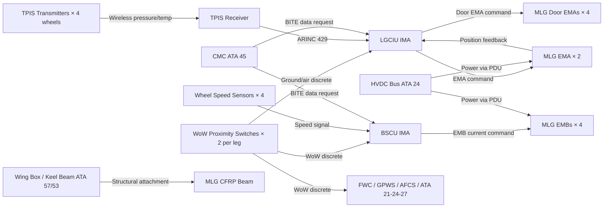
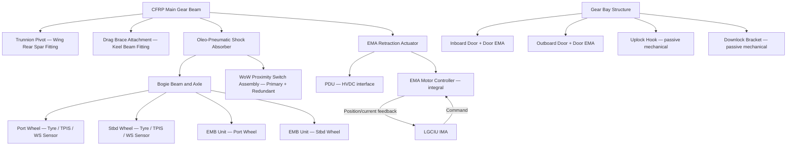
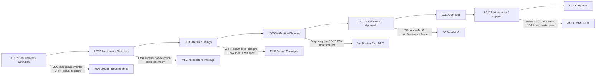

# 032-010 — Main Landing Gear
### AMPEL360e eWTW · ATA 32 · Q+ATLANTIDE ATLAS Scaffold

---

## §0 Hyperlink Policy

All internal links use relative paths. External regulatory references use anchors in [§20 References](#20-references). Links marked **TBD** indicate targets not yet allocated. Programme-level links use five directory levels (`../../../../../`). No absolute URLs are used for internal navigation.

---

## §1 Purpose

This document describes the Main Landing Gear (MLG) assemblies of the AMPEL360e eWTW. Two MLG assemblies — port and starboard — are installed in symmetrical underwing belly pods. Each assembly provides structural ground support, absorbs landing impact energy via an oleo-pneumatic shock absorber, retracts inboard and aft into the gear bay via an Electromechanical Actuator (EMA), and provides braking via two Electromechanical Brakes (EMBs), one per wheel. The MLG is the primary structural element carrying the majority of the aircraft's ground reactions during landing, taxiing, and take-off roll.

The MLG CFRP gear beam is a key eWTW differentiator, offering a mass reduction over conventional steel or aluminium alloy forgings. Each bogie carries two wheels in tandem configuration (dual-wheel bogie). A Weight-on-Wheels (WoW) proximity switch assembly (primary and redundant) is fitted at each MLG leg, providing the critical ground/air discrete used by the LGCIU, BSCU, FWC, GPWS/TAWS, and multiple other aircraft systems.

---

## §2 Applicability

| Attribute | Value |
|---|---|
| Programme | AMPEL360e Wide Tube-and-Wing (eWTW) |
| ATA Subsubject | 032-010 — Main Landing Gear |
| Aircraft Variant | eWTW-100 (baseline), eWTW-100ER |
| MLG Configuration | 2× assemblies (port / starboard); 2-wheel bogie each; CFRP beam |
| Actuation | EMA for retraction/extension; EMBs for braking (2 per bogie) |
| Wheels per MLG | 2 (tandem bogie) |
| Certification Basis | CS-25 (EASA), FAR Part 25 |
| SNS Reference | 032-10 |
| Effectivity | From MSN 001 |

---

## §3 System / Function Overview

Each MLG assembly consists of: (1) a CFRP main gear beam forming the primary structural member; (2) an oleo-pneumatic shock absorber (outer cylinder fixed to beam, inner cylinder carrying the axle/bogie); (3) a two-wheel bogie with two main wheels in tandem; (4) an EMA for gear retraction and extension acting on the gear trunnion mechanism; (5) two EMBs, one per wheel; (6) gear door EMA actuators (inboard and outboard doors); (7) tyre pressure sensors on each wheel hub (TPIS); (8) wheel speed sensors on each wheel (for antiskid); and (9) WoW proximity switches on the shock absorber outer/inner cylinder.

The MLG retracts inboard and aft into the belly pod gear bay. During retraction, the gear door sequence is: inboard door opens → gear unlocks from downlock → EMA drives gear aft and inboard → gear engages uplock → inboard door closes. Extension sequence is reversed. The uplock hook and downlock bracket are passive mechanical devices; the EMA provides the force to disengage them.

Structural attachment of the MLG to the airframe uses primary fittings at the wing-box rear spar (main trunnion pivot) and a secondary drag brace attachment at the keel beam. Fitting detail design is TBD pending detailed structural analysis.

---

## §4 Scope

### 4.1 Included
- MLG main gear beam (CFRP construction), structural fittings, trunnion pivot
- Oleo-pneumatic shock absorber (outer and inner cylinder, nitrogen charge, hydraulic fluid reservoir)
- Bogie beam and axle assembly (both wheels per bogie)
- EMA actuator for gear retraction/extension (primary and redundancy TBD)
- Gear bay door assemblies (inboard and outboard) and their EMA actuators
- Uplock and downlock mechanical devices
- EMB assemblies (2 per MLG) — wheel-mounted
- Wheel speed sensors (2 per MLG) for antiskid
- WoW proximity switches (primary + redundant, per MLG)
- TPIS transmitter on each wheel hub (2 per MLG)
- Gear position harness and electrical connectors

### 4.2 Excluded
- LGCIU and BSCU control logic — covered by 032-030 and 032-040
- EPS / PDU power supply — covered by ATA 24
- Wing-box and keel beam structural design — covered by ATA 57 and ATA 53
- Tyre procurement (commercial supply)
- Wheel bearings (part of wheel assembly / IPD)

---

## §5 Architecture Description

- **CFRP main gear beam**: Replaces conventional titanium or steel forging; primary structural load path; requires composite-specific NDT inspection programme.
- **Oleo-pneumatic shock absorber**: Conventional two-stage oleo design; nitrogen pressure and fluid level serviceable at line maintenance; MR fluid option deferred TBD.
- **Two-wheel tandem bogie**: Provides adequate footprint pressure for runway strength requirements (ACN/PCN assessment TBD); bogie pitch damping by shock absorber design.
- **EMA retraction actuator**: Ball-screw or roller-screw driven by brushless DC motor; gear ratio and output force TBD per kinematic and load analysis. Motor controller integral to EMA unit; interfaces to HVDC bus via PDU; command signal from LGCIU.
- **EMBs (× 2 per MLG)**: Each EMB is an integral unit on the wheel axle; electric motor drives a ball-screw clamp mechanism acting on a carbon or steel brake disc pack. Brake wear indicator integral to EMB or separate sensor TBD.
- **Dual WoW proximity sensors**: Primary and redundant sensors per gear; cross-checked by LGCIU; disagreement triggers a BITE fault and ECAM advisory.
- **Gear bay doors**: Two doors per MLG bay (inboard and outboard); each door independently actuated by dedicated door EMA; passive mechanical latching in open and closed positions.

---

## §6 Functional Breakdown

| Function ID | Function Title | Description | Applicable Subsystem |
|---|---|---|---|
| F-010-001 | MLG Structural Support | Carry ground reactions (static, taxi, landing, RTO) via CFRP beam and fittings to airframe | 032-010 |
| F-010-002 | Shock Absorption | Absorb and dissipate landing impact energy via oleo-pneumatic shock absorber | 032-010 / 032-070 |
| F-010-003 | Gear Retraction | EMA drives gear from down-and-locked to up-and-locked; door EMA sequences doors | 032-010 / 032-030 |
| F-010-004 | Gear Extension (Normal) | EMA drives gear from up-and-locked to down-and-locked; door EMA sequences doors | 032-010 / 032-030 |
| F-010-005 | Gear Extension (Emergency) | Gravity free-fall extension with EMA power removed; passive mechanical downlocking | 032-010 / 032-030 |
| F-010-006 | Wheel Braking | EMBs apply clamping force to brake discs per BSCU command; antiskid modulates force | 032-010 / 032-040 |
| F-010-007 | WoW Signal Generation | Proximity switches detect gear compression state; output to LGCIU as ground/air discrete | 032-010 / 032-060 |
| F-010-008 | Tyre Pressure Monitoring | TPIS transmitters broadcast pressure and temperature; display to crew and CMC | 032-010 / 032-040 |

---

## §7 System Context Diagram

---

## §8 Internal Functional Architecture

---

## §9 Lifecycle Traceability

---

## §10 Interfaces

| Interface ID | System / Chapter | Interface Type | Data / Signal | Direction | Status |
|---|---|---|---|---|---|
| IF-010-001 | ATA 24 Electrical Power | HVDC bus / PDU | Power to MLG EMA actuators and EMB controllers | ATA24 → ATA32-010 |  |
| IF-010-002 | ATA 32-030 Extension/Retraction | AFDX / discrete | EMA command and position feedback; door EMA command | ATA32-030 ↔ ATA32-010 |  |
| IF-010-003 | ATA 32-040 Brakes | EMA/EMB control bus | EMB current command; wheel speed sensor feedback | ATA32-040 ↔ ATA32-010 |  |
| IF-010-004 | ATA 32-060 Position Indication | Discrete | WoW signal (primary and redundant) to LGCIU | ATA32-010 → ATA32-060 |  |
| IF-010-005 | ATA 57 Wings | Physical / structural | MLG trunnion pivot fitting at wing-box rear spar | Structural |  |
| IF-010-006 | ATA 53 Fuselage | Physical / structural | MLG drag brace fitting at keel beam (if applicable) | Structural |  |
| IF-010-007 | ATA 45 Maintenance | AFDX maintenance bus | EMA BITE, EMB wear state, WoW fault to CMC | ATA32-010 → ATA45 |  |

---

## §11 Operating Modes

| Mode ID | Mode Name | Description | Entry Condition | Exit Condition |
|---|---|---|---|---|
| OM-010-001 | Ground — Down Locked | MLG in fully extended position; downlock engaged; WoW active | Aircraft on ground | Take-off rotation / WoW cleared |
| OM-010-002 | Retraction Sequence | LGCIU commanding EMA to retract MLG; doors cycling | Gear handle UP + airborne | Uplock confirmed + doors closed |
| OM-010-003 | Gear Up Locked | MLG retracted and uplocked; EMA at zero power (passive uplock) | Retraction complete | Gear handle DOWN |
| OM-010-004 | Extension Sequence | LGCIU commanding EMA to extend MLG; doors cycling | Gear handle DOWN in flight | Downlock confirmed + doors closed |
| OM-010-005 | Emergency Free-Fall Extension | EMA power removed; gravity extension of MLG | Emergency extension commanded | Downlock confirmed (gravity) |
| OM-010-006 | Braking | BSCU commanding EMBs per pilot pedal / autobrake; antiskid active | WoW + pedal input or autobrake armed | Speed < threshold or pedal released |

---

## §12 Monitoring and Diagnostics

The EMA motor controller (integral to each EMA unit) continuously monitors motor current, winding temperature, rotor position, and bus voltage. Fault conditions are reported to the LGCIU via the EMA interface bus. The LGCIU performs cross-checking of EMA position feedback versus commanded position at defined intervals during the retraction/extension sequence; a timeout or position disagreement generates a BITE fault.

EMB actuator current and position are monitored by the BSCU. Brake disc temperature is monitored via a dedicated sensor (type TBD) per wheel position; an ECAM caution is generated for brake overheat. Wheel speed sensors are self-monitored by the BSCU antiskid function; a sensor open-circuit or short-circuit is flagged and the affected wheel channel is removed from antiskid control.

TPIS transmitters perform self-test at each power-on of the system; a transmitter BITE failure is flagged to the CMC. The CMC maintains a cumulative tyre pressure history for each wheel position, enabling slow leak detection by trend analysis.

---

## §13 Maintenance Concept

MLG maintenance activities at line level include: walk-around inspection of gear legs, tyres, and doors; tyre pressure check (physical or TPIS display); gear bay visual inspection. Brake wear measurement is performed at defined intervals (per AMM, to be determined by MRB process) by inspecting the EMB wear indicator or reading the accumulated brake energy from the BSCU BITE data via CMC.

EMA replacement is an LRU task requiring aircraft jacking (or maintenance on the ground with gear down), disconnection of the electrical connector and mechanical attachments, and LRU swap. An EMA post-replacement functional test (partial gear cycle under maintenance test mode) is required before return to service.

Shock absorber servicing (nitrogen pressure check, fluid level check) is a scheduled line maintenance task. Shock absorber replacement is a base maintenance task requiring gear disassembly.

CFRP gear beam inspection programme: ultrasonic C-scan and/or thermographic inspection at defined intervals (TBD per fatigue and damage tolerance analysis); visual inspection at each heavy maintenance input for impact damage assessment. Any CFRP beam repair must follow approved repair procedure in SRM (Structural Repair Manual).

---

## §14 S1000D / CSDB Mapping

### 14.1 SNS to DMC Mapping

| SNS Code | Subsubject Title | DMC Prefix | Info Codes Planned | DMRL Status |
|---|---|---|---|---|
| 032-10 | Main Landing Gear | DMC-AMPEL360E-EWTW-032-10 | 040, 300, 400, 520, 720, 941 |  |

### 14.2 Information Code Definitions

| Info Code | Description | Applicable |
|---|---|---|
| 040 | Description — MLG assembly, components, construction | Yes |
| 300 | Operation — gear extension/retraction, emergency procedures | Yes |
| 400 | Maintenance — inspection, shock absorber service, brake wear | Yes |
| 520 | Troubleshooting — EMA fault, EMB fault, WoW disagreement | Yes |
| 720 | Removal / installation — EMA, EMB, shock absorber, door | Yes |
| 941 | Illustrated Parts Data — MLG assembly and sub-components | Yes |

---

## §15 Footprints

### 15.1 Physical Footprint
- MLG bay dimensions: TBD per gear geometry and fuselage cross-section analysis
- CFRP gear beam envelope: TBD per detailed design; target mass saving vs steel: TBD %
- Retracted position: gear inboard and aft; no protrusion below fuselage profile
- Bogie footprint: wheel spacing (axle to axle) TBD per ACN/PCN analysis

### 15.2 Electrical / Data Footprint
- EMA power: HVDC bus via dedicated PDU; peak power per EMA TBD kW
- EMB power: 28 VDC or low-voltage supply from BSCU controller; peak clamping current TBD
- Data: EMA interface bus (CAN or proprietary TBD); ARINC 429 for TPIS receiver output; discrete for WoW and proximity switches

### 15.3 Maintenance Footprint
- EMA access: gear bay access panels (lower fuselage); panel size and location TBD
- EMB access: wheel well with bogie accessible on the ground; brake replacement with wheel removal
- Shock absorber: gear bay access; service port for nitrogen and fluid

### 15.4 Data Footprint
- EMA: torque/current history retained in motor controller non-volatile memory; downloadable via CMC
- EMB: accumulated brake energy per wheel position; wear state per wheel; retained in BSCU
- WoW: cycle count per proximity switch; disagreement event log in LGCIU BITE

---

## §16 Safety and Certification Considerations

| Requirement | Source | Description | Compliance Approach | Status |
|---|---|---|---|---|
| CS-25.473 | EASA CS-25 | Landing load conditions — MLG is primary load-bearing element | Load analysis (FEA); compliance by analysis and test |  |
| CS-25.479 | EASA CS-25 | Level landing — symmetric and asymmetric load cases on MLG | Structural sizing; FEA verification |  |
| CS-25.481 | EASA CS-25 | Tail-down landing — MLG structural load case | FEA analysis |  |
| CS-25.721 | EASA CS-25 | Landing gear general — collapse protection; WoW reliability | FHA / FMEA; WoW dual sensor architecture |  |
| CS-25.723 | EASA CS-25 | Shock absorber drop test at limit sink rate | Full-scale drop test campaign |  |
| CS-25.735 | EASA CS-25 | Brakes — EMB performance; brake energy at RTO | EMB thermal test; antiskid demonstration |  |
| Composite Structures | AC 20-107B | CFRP gear beam damage tolerance and inspection programme | Damage tolerance analysis; NDT programme definition |  |

---

## §17 Verification and Validation

| V&V ID | Requirement | Method | Success Criterion | Status |
|---|---|---|---|---|
| VV-010-001 | CS-25.723 — MLG drop test | Full-scale drop test at MTOW and MLW at limit sink rate (3.05 m/s min) | No structural failure; energy absorbed within design limits; WoW switch operation confirmed |  |
| VV-010-002 | CS-25.473 — ground loads | FEA analysis calibrated to drop test | Structural margins positive at 1.5× limit load (ultimate) |  |
| VV-010-003 | EMA retraction cycle | Iron-bird retraction cycle test — 2× design life (N cycles TBD) | No EMA fault; correct sequencing; door clearances maintained throughout |  |
| VV-010-004 | Emergency free-fall — MLG | Jacks test with EMA power removed | MLG extends and locks within required time; positive downlock indication |  |
| VV-010-005 | CS-25.735 — RTO brake energy | Brake thermal test at max RTO energy | Peak disc temperature within limits; no fire; EMB functional after cool-down |  |
| VV-010-006 | WoW proximity switch function | Ground test — aircraft jacked and lowered | Correct ground/air transition detected by both primary and redundant switches |  |
| VV-010-007 | CFRP beam damage tolerance | Analysis + representative coupon tests | Damage tolerance life consistent with structural design service goal (DSG) |  |

---

## §18 Glossary

| Term | Definition |
|---|---|
| ACN/PCN | Aircraft Classification Number / Pavement Classification Number — method to describe aircraft undercarriage loading relative to pavement bearing strength |
| Bogie | The undercarriage beam carrying two or more wheels in tandem; on eWTW MLG, a two-wheel tandem bogie |
| CFRP | Carbon Fibre Reinforced Polymer — composite material used for the MLG beam; high stiffness-to-weight ratio; requires composite-specific NDT |
| Downlock | Passive mechanical device locking the gear in the extended position; disengaged by EMA during retraction |
| DSG | Design Service Goal — the structural design life (in flight cycles and hours) of the aircraft; drives fatigue and damage tolerance programmes |
| EMB | Electromechanical Brake — electric motor-driven clamping mechanism replacing hydraulic disc brakes |
| EMA | Electromechanical Actuator — electric motor and ball-screw replacing hydraulic jack for gear retraction/extension |
| Oleo-pneumatic | Shock absorber type using compressed nitrogen gas and oil (hydraulic fluid) to absorb landing energy |
| PDU | Power Drive Unit — power electronics converting HVDC bus to EMA motor drive supply |
| RTO | Rejected Take-Off — worst-case brake thermal event; defines maximum brake energy design requirement |
| Uplock | Passive mechanical hook holding gear in retracted position; released electrically by LGCIU during extension sequence |
| WoW | Weight on Wheels — proximity switch signal indicating gear compression; primary ground/air discriminator |

---

## §19 Citations

| Citation ID | Reference | Description | Relevance |
|---|---|---|---|
| CIT-010-001 | EASA CS-25 Amdt 27 | CS-25.473, CS-25.479, CS-25.481, CS-25.721, CS-25.723, CS-25.735 | Primary certification basis for MLG structure and function |
| CIT-010-002 | FAA AC 20-107B | Composite Aircraft Structures — damage tolerance and inspection | CFRP gear beam certification approach |
| CIT-010-003 | SAE AS1290 Rev C | Antiskid System Performance Specification | BSCU antiskid algorithm applicable to MLG braking |
| CIT-010-004 | FAA AC 25.735-1 | Brakes and Braking Systems Certification | EMB qualification and RTO brake energy test approach |

---

## §20 References

| Ref ID | Title | Document | Link |
|---|---|---|---|
| REF-010-001 | ATA 32 General | 032-000 Landing Gear General | [./032-000-Landing-Gear-General.md](./032-000-Landing-Gear-General.md) |
| REF-010-002 | Extension and Retraction | 032-030 | [./032-030-Extension-and-Retraction.md](./032-030-Extension-and-Retraction.md) |
| REF-010-003 | Wheels, Tyres, and Brakes | 032-040 | [./032-040-Wheels-Tires-and-Brakes.md](./032-040-Wheels-Tires-and-Brakes.md) |
| REF-010-004 | Shock Absorption | 032-070 | [./032-070-Shock-Absorption-and-Structural-Interfaces.md](./032-070-Shock-Absorption-and-Structural-Interfaces.md) |
| REF-010-005 | EASA CS-25 | Certification Specifications | [https://www.easa.europa.eu](https://www.easa.europa.eu) |

---

## §21 Open Issues

| Issue ID | Description | Owner | Priority | Target Resolution | Status |
|---|---|---|---|---|---|
| OI-010-001 | EMA supplier for MLG retraction not selected; torque, speed, and envelope TBD | Procurement | High | TBD |  |
| OI-010-002 | EMB supplier for MLG not selected; brake disc material (carbon vs steel) TBD | Procurement | High | TBD |  |
| OI-010-003 | CFRP gear beam preliminary design not started; mass target TBD | Structures | High | TBD |  |
| OI-010-004 | MLG bay door aerodynamic load analysis not performed; CFD required | Aerodynamics | Medium | TBD |  |
| OI-010-005 | WoW switch qualification standard not confirmed | Avionics | Medium | TBD |  |
| OI-010-006 | Gear bay structural provisions (uplock hook, downlock bracket) detail design TBD | Structures | Medium | TBD |  |

---

## §22 Change Log

| Revision | Date | Author | Description |
|---|---|---|---|
| 0.1.0 | 2026-05-09 | Q+ATLANTIDE Authoring | Initial scaffold — all sections to template standard; data TBD pending programme decisions |
