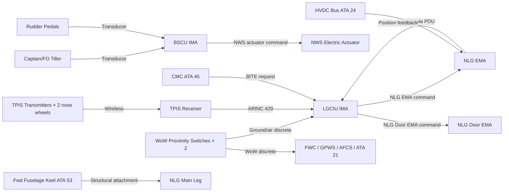
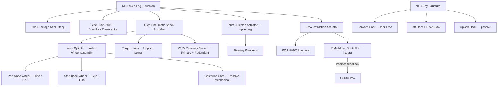
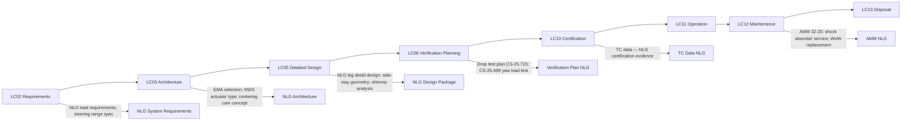

# 032-020 — Nose Landing Gear
### AMPEL360e eWTW · ATA 32 · Q+ATLANTIDE ATLAS Scaffold

---

## §0 Hyperlink Policy

All internal links use relative paths. External regulatory references use anchors in [§20 References](#20-references). Links marked **TBD** indicate targets not yet allocated. Programme-level links use five directory levels (`../../../../../`). No absolute URLs are used for internal navigation.

---

## §1 Purpose

This document describes the Nose Landing Gear (NLG) assembly of the AMPEL360e eWTW. The NLG is a single assembly located in the forward fuselage bay. It carries twin steerable wheels, retracts forward and upward into the nose bay via an Electromechanical Actuator (EMA), provides nose-wheel steering via an electric motor actuator, and incorporates an oleo-pneumatic shock absorber to absorb nose-wheel landing loads.

The NLG is the sole directional control device on the ground during low-speed taxiing, supplemented by differential braking via the BSCU. The steering function is covered in detail by [032-050 Steering](./032-050-Steering.md); this document covers the NLG mechanical assembly and structural elements. The NLG carries a lower percentage of the total aircraft weight than the MLG (typically 8–12% of total), but is subject to significant yaw loads during steering and lateral loads on asymmetric braking.

---

## §2 Applicability

| Attribute | Value |
|---|---|
| Programme | AMPEL360e Wide Tube-and-Wing (eWTW) |
| ATA Subsubject | 032-020 — Nose Landing Gear |
| Aircraft Variant | eWTW-100 (baseline), eWTW-100ER |
| NLG Configuration | Single assembly; twin wheels; steerable via electric actuator |
| Gear Retraction | Forward and upward into forward fuselage nose bay |
| Steering Range | ±70° (tiller, normal); ±5° (rudder pedal limited authority) |
| Certification Basis | CS-25 (EASA), FAR Part 25 |
| SNS Reference | 032-20 |
| Effectivity | From MSN 001 |

---

## §3 System / Function Overview

The NLG assembly consists of: (1) a main gear leg (metallic alloy forging, material TBD); (2) an oleo-pneumatic shock absorber; (3) a twin-wheel axle with two nose wheels in side-by-side configuration; (4) torque links connecting inner and outer shock absorber cylinders to prevent rotation while allowing axial travel; (5) a centering cam mechanism that aligns the nose wheel to the centreline on gear retraction; (6) a nose-wheel steering (NWS) electric actuator integral to the upper gear leg; (7) an EMA for gear retraction/extension acting on the gear trunnion; (8) gear bay doors (two doors — forward and aft, or single bifold door — configuration TBD); (9) uplock and downlock passive mechanical devices; (10) WoW proximity switches (primary and redundant); and (11) TPIS transmitters on each nose wheel.

Shimmy suppression on the NLG is provided by the torque link stiffness and the NWS actuator motor impedance when powered. An active electric shimmy damper is under evaluation as an option (TBD). The centering cam ensures the nose wheels are aligned before gear retraction to prevent contact with the bay structure.

The NLG attaches to the forward fuselage keel beam via a trunnion pivot fitting. A side-stay brace (metallic) provides lateral load restraint during ground operations and locks the gear in the extended position as part of the downlock mechanism.

---

## §4 Scope

### 4.1 Included
- NLG main gear leg, trunnion pivot, and structural fittings at forward fuselage keel
- Oleo-pneumatic shock absorber (outer and inner cylinder)
- Twin nose wheel axle and side-by-side wheel assembly
- Torque links (upper and lower scissors)
- Centering cam assembly
- NWS electric actuator (mechanical interface only; control covered by 032-050)
- EMA for gear retraction/extension
- Gear bay doors and door EMA actuators
- Uplock hook and downlock side-stay mechanism
- WoW proximity switches (primary + redundant)
- TPIS transmitters on both nose wheels

### 4.2 Excluded
- NWS control logic and BSCU interface — covered by 032-050
- LGCIU retraction/extension control logic — covered by 032-030
- Tyre procurement (commercial supply)
- Electrical power supply chain — covered by ATA 24
- Forward fuselage keel beam structural design — covered by ATA 53

---

## §5 Architecture Description

- **Forward-retracting gear**: The NLG retracts forward and upward; this direction is preferred for gravity-assisted extension in the event of EMA failure (aerodynamic drag also assists forward retraction geometry).
- **Twin nose wheels**: Side-by-side twin-wheel configuration increases nose gear load footprint; both wheels are non-braked (braking on MLG only).
- **Electric NWS actuator**: Integral to the upper gear leg structure; driven by the BSCU; provides ±70° steering authority from tiller, ±5° from rudder pedals. Full NWS architecture described in 032-050.
- **Centering cam**: Passive mechanical device in the shock absorber assembly; as the gear is retracted and the inner cylinder compresses under retraction kinematics, the cam rotates the wheel assembly to the centreline. No electrical input required.
- **Torque links**: Upper and lower scissor arms prevent inner cylinder rotation relative to outer cylinder while allowing axial (shock absorber) travel. The torque link joint friction and NWS actuator motor impedance provide shimmy damping.
- **Shock absorber**: Sized for CS-25.479 level landing and CS-25.499 nose-gear yaw loads; nitrogen servicing via standard valve; fluid service via port on outer cylinder.
- **Side-stay downlock**: The side-stay (brace strut between upper gear leg and fuselage) serves as both a structural brace during ground operations and the downlock mechanism; a locking over-centre geometry provides positive lock. Side-stay release is electrically commanded by the LGCIU during retraction.
- **WoW dual sensor**: Primary and redundant proximity switches mounted on outer/inner cylinder; LGCIU cross-checks both; disagreement logged to CMC.

---

## §6 Functional Breakdown

| Function ID | Function Title | Description | Applicable Subsystem |
|---|---|---|---|
| F-020-001 | NLG Structural Support | Carry nose reactions (static, taxi, steering, landing) via gear leg and fittings to fuselage keel | 032-020 |
| F-020-002 | NLG Shock Absorption | Absorb nose-wheel landing and taxi loads via oleo-pneumatic shock absorber | 032-020 / 032-070 |
| F-020-003 | Gear Retraction (NLG) | EMA retracts NLG forward and up; centering cam aligns wheels; uplock engaged | 032-020 / 032-030 |
| F-020-004 | Gear Extension (NLG Normal) | EMA extends NLG down and aft; side-stay downlock engaged | 032-020 / 032-030 |
| F-020-005 | Gear Extension (NLG Emergency) | Gravity extension with EMA power removed; aerodynamic drag assists | 032-020 / 032-030 |
| F-020-006 | Nose-Wheel Steering | NWS actuator pivots NLG per BSCU command from tiller or rudder pedals | 032-020 / 032-050 |
| F-020-007 | Shimmy Suppression | Torque link stiffness and NWS actuator impedance resist nose-wheel oscillation | 032-020 |
| F-020-008 | WoW Signal Generation | Proximity switches detect gear compression; output to LGCIU as ground/air discrete | 032-020 / 032-060 |
| F-020-009 | Tyre Pressure Monitoring | TPIS transmitters on nose wheels broadcast pressure and temperature | 032-020 / 032-040 |

---

## §7 System Context Diagram

---

## §8 Internal Functional Architecture

---

## §9 Lifecycle Traceability

---

## §10 Interfaces

| Interface ID | System / Chapter | Interface Type | Data / Signal | Direction | Status |
|---|---|---|---|---|---|
| IF-020-001 | ATA 24 Electrical Power | HVDC / PDU | Power for NLG EMA retraction actuator | ATA24 → ATA32-020 |  |
| IF-020-002 | ATA 32-030 Extension/Retraction | Discrete / EMA bus | EMA command / position feedback; door EMA command; side-stay release command | ATA32-030 ↔ ATA32-020 |  |
| IF-020-003 | ATA 32-050 Steering | NWS actuator interface | NWS motor command; position feedback to BSCU | ATA32-050 ↔ ATA32-020 |  |
| IF-020-004 | ATA 32-060 Position Indication | Discrete | WoW signal (primary and redundant) to LGCIU | ATA32-020 → ATA32-060 |  |
| IF-020-005 | ATA 53 Fuselage Structure | Physical / structural | NLG trunnion pivot fitting and side-stay attachment at forward fuselage keel | Structural |  |
| IF-020-006 | ATA 45 Maintenance System | AFDX maintenance bus | NLG EMA BITE, WoW fault data to CMC | ATA32-020 → ATA45 |  |
| IF-020-007 | ATA 32-040 TPIS | Wireless / ARINC 429 | Nose wheel tyre pressure and temperature to LGCIU | ATA32-020 → ATA32-040 |  |

---

## §11 Operating Modes

| Mode ID | Mode Name | Description | Entry Condition | Exit Condition |
|---|---|---|---|---|
| OM-020-001 | Ground — Down Locked | NLG extended; side-stay downlock engaged; WoW active | Aircraft on ground | Take-off rotation |
| OM-020-002 | Retraction Sequence | EMA retracting NLG forward/upward; doors cycling; centering cam activating | Gear handle UP + airborne | Uplock confirmed + doors closed |
| OM-020-003 | Gear Up Locked | NLG retracted and uplocked; wheels centred; bay doors closed | Retraction complete | Gear handle DOWN |
| OM-020-004 | Extension Sequence (Normal) | EMA extending NLG; side-stay deploying; downlock engaging | Gear handle DOWN in flight | Downlock confirmed + doors closed |
| OM-020-005 | Emergency Free-Fall Extension | EMA power off; gravity + aerodynamic drag extends NLG forward and down | Emergency extension commanded | Downlock confirmed (gravity) |
| OM-020-006 | Steering Active | NWS actuator commanding nose wheel pivot per tiller or rudder pedal input | WoW active + aircraft taxiing | Gear retraction (auto-centering) or NWS fault |
| OM-020-007 | Free-Castor Mode | NWS actuator unpowered; nose wheel rotates freely about steering axis | NWS fault or BSCU free-castor command | NWS restored or end of operation |

---

## §12 Monitoring and Diagnostics

The NLG EMA motor controller monitors motor current, temperature, rotor position, and bus voltage continuously. Position is compared to LGCIU commanded position; a timeout or disagreement generates a BITE fault. The NWS actuator current and position are monitored by BSCU; a current overload or stall condition causes fault flagging and reversion to free-castor mode.

WoW switch disagreement between primary and redundant sensors on the NLG is detected by LGCIU and flagged as an ECAM advisory. The CMC logs all WoW transition events with flight phase, gear cycle number, and weight.

Centering cam mechanical integrity is checked during the gear retraction cycle test (iron-bird); a misaligned nose wheel on retraction would result in a door contact sensor triggering a fault (sensor TBD). TPIS self-test is performed at system power-on; transmitter BITE faults are logged to CMC.

---

## §13 Maintenance Concept

NLG maintenance activities at line level: walk-around tyre inspection; tyre pressure check; nose gear leg visual inspection; door clearance check. Shock absorber service (nitrogen and fluid checks) is a scheduled task per AMM. NWS actuator lubrication is a scheduled task per AMM interval (TBD by MRB).

EMA replacement on the NLG is an LRU task at line maintenance level, requiring gear bay access from below the nose section. A post-replacement functional test via CMC maintenance test mode is required. WoW switch replacement is an LRU task accessible via the gear bay.

Gear bay structural inspection: visual inspection at every heavy maintenance input; zonal inspection programme per AMM structure section. NLG leg is a metallic forging and is subject to standard metallic NDT requirements (dye penetrant or magnetic particle as appropriate for material). Shimmy damper (if fitted — TBD) is an LRU replacement per AMM.

---

## §14 S1000D / CSDB Mapping

### 14.1 SNS to DMC Mapping

| SNS Code | Subsubject Title | DMC Prefix | Info Codes Planned | DMRL Status |
|---|---|---|---|---|
| 032-20 | Nose Landing Gear | DMC-AMPEL360E-EWTW-032-20 | 040, 300, 400, 520, 720, 941 |  |

### 14.2 Information Code Definitions

| Info Code | Description | Applicable |
|---|---|---|
| 040 | Description — NLG assembly, components | Yes |
| 300 | Operation — steering, extension, emergency procedures | Yes |
| 400 | Maintenance — inspection, oleo service, NWS actuator | Yes |
| 520 | Troubleshooting — EMA fault, NWS fault, WoW disagreement | Yes |
| 720 | Removal / installation — EMA, NWS actuator, shock absorber, doors | Yes |
| 941 | Illustrated Parts Data — NLG assembly | Yes |

---

## §15 Footprints

### 15.1 Physical Footprint
- NLG bay location: forward fuselage below nose radome and aft of nose pressure bulkhead; bay dimensions TBD
- Nose wheel footprint: tyre size TBD; side-by-side twin wheels with track width TBD
- NLG retracted position: forward/upward into nose bay; wheels horizontal in bay
- Steering pivot: centreline of NLG leg (vertical axis through trunnion)

### 15.2 Electrical / Data Footprint
- EMA power: HVDC bus via PDU; peak power per NLG EMA TBD (lower than MLG EMA due to lower NLG weight fraction)
- NWS actuator: 28 VDC or low-voltage supply from BSCU controller (TBD)
- Data: EMA interface bus (CAN TBD); ARINC 429 for TPIS; discrete for WoW

### 15.3 Maintenance Footprint
- EMA access: nose gear bay below forward fuselage; access door dimensions TBD
- Shock absorber service: standard valve access within gear bay
- NWS actuator: accessible within upper gear leg area; gear bay access required

### 15.4 Data Footprint
- EMA torque/current history: in motor controller non-volatile memory; downloadable via CMC
- NWS actuator usage: cycle count and position history in BSCU
- WoW events: logged by LGCIU per cycle number

---

## §16 Safety and Certification Considerations

| Requirement | Source | Description | Compliance Approach | Status |
|---|---|---|---|---|
| CS-25.499 | EASA CS-25 | Nose-wheel yaw and steering — NLG must withstand specified yaw loads | NLG structural analysis for steering load cases |  |
| CS-25.503 | EASA CS-25 | Pivoting — NLG must withstand pivoting (steering) loads | Load analysis; fatigue assessment of NLG leg |  |
| CS-25.721 | EASA CS-25 | Landing gear general — NLG must not collapse; WoW reliability | FHA; dual WoW sensor; NLG drop test |  |
| CS-25.723 | EASA CS-25 | Shock absorber drop test — NLG limit sink rate | NLG drop test at design limit conditions |  |
| CS-25.729 | EASA CS-25 | Retracting mechanisms — NLG retraction | Retraction cycle test; centering cam function verification |  |
| Shimmy | AMC 25.499 | Nose-wheel shimmy demonstration | Ground taxi test including critical shimmy speed range |  |

---

## §17 Verification and Validation

| V&V ID | Requirement | Method | Success Criterion | Status |
|---|---|---|---|---|
| VV-020-001 | CS-25.723 — NLG drop test | Full-scale NLG drop test at limit sink rate and limit nose-down attitude | No structural failure; energy absorption within design limits |  |
| VV-020-002 | CS-25.499 — NLG yaw loads | Static structural test at limit yaw load | No permanent deformation; no failure |  |
| VV-020-003 | EMA retraction cycle — NLG | Iron-bird test — 2× life cycles | Correct centering cam alignment; no door interference; no EMA fault |  |
| VV-020-004 | Emergency free-fall — NLG | Jacks test with EMA power removed | NLG extends and locks under gravity within required time |  |
| VV-020-005 | Shimmy demonstration | Ground taxi test across critical speed range | No sustained shimmy oscillation detected |  |
| VV-020-006 | Centering cam function | Retraction cycle test with wheel angle deliberately offset pre-test | Wheels centred before entering bay; no structural contact |  |

---

## §18 Glossary

| Term | Definition |
|---|---|
| Centering cam | A passive mechanical device in the NLG shock absorber that rotates the nose wheels to the straight-ahead position as the gear retracts, preventing wheel contact with the gear bay structure |
| Free-castor mode | Nose-wheel steering mode where the NWS actuator is unpowered and the wheel rotates freely; entered on NWS fault; aircraft directional control via differential braking |
| NLG | Nose Landing Gear — the single forward gear assembly of the tricycle configuration; carries approximately 8–12% of total aircraft ground load |
| NWS | Nose-Wheel Steering — electric actuator system providing directional control during taxiing |
| Oleo-pneumatic | Shock absorber using compressed nitrogen and hydraulic fluid to absorb landing impact |
| Shimmy | Self-excited oscillation of the nose wheel about the steering axis; suppressed by torque link stiffness and NWS actuator impedance |
| Side-stay | The brace strut providing lateral structural support for the NLG during ground operations; incorporates the downlock mechanism via over-centre geometry |
| Torque links | Scissor-type linkage between inner and outer shock absorber cylinders preventing relative rotation while allowing axial travel |
| WoW | Weight on Wheels — proximity switch signal indicating gear compression |

---

## §19 Citations

| Citation ID | Reference | Description | Relevance |
|---|---|---|---|
| CIT-020-001 | EASA CS-25 Amdt 27 | CS-25.499, CS-25.503, CS-25.721, CS-25.723, CS-25.729 | Primary certification basis for NLG |
| CIT-020-002 | EASA AMC 25.499 | Nose-wheel shimmy — acceptable means of compliance | Shimmy test programme design |
| CIT-020-003 | SAE AS1194 | Landing Gear Systems Design and Test Requirements | NLG design reference |

---

## §20 References

| Ref ID | Title | Document | Link |
|---|---|---|---|
| REF-020-001 | ATA 32 General | 032-000 | [./032-000-Landing-Gear-General.md](./032-000-Landing-Gear-General.md) |
| REF-020-002 | Extension and Retraction | 032-030 | [./032-030-Extension-and-Retraction.md](./032-030-Extension-and-Retraction.md) |
| REF-020-003 | Steering | 032-050 | [./032-050-Steering.md](./032-050-Steering.md) |
| REF-020-004 | Shock Absorption | 032-070 | [./032-070-Shock-Absorption-and-Structural-Interfaces.md](./032-070-Shock-Absorption-and-Structural-Interfaces.md) |
| REF-020-005 | EASA CS-25 | Certification Specifications | [https://www.easa.europa.eu](https://www.easa.europa.eu) |

---

## §21 Open Issues

| Issue ID | Description | Owner | Priority | Target Resolution | Status |
|---|---|---|---|---|---|
| OI-020-001 | NLG EMA supplier not selected | Procurement | High | TBD |  |
| OI-020-002 | NWS actuator type and supplier not confirmed | Procurement | High | TBD |  |
| OI-020-003 | Shimmy damper requirement not yet assessed; conventional torque link may be sufficient | Systems | Medium | TBD |  |
| OI-020-004 | NLG bay door configuration (bifold vs two-door) not confirmed | Systems / Aero | Medium | TBD |  |
| OI-020-005 | Nose wheel tyre size and load rating TBD pending detailed weight and CG analysis | Systems | Medium | TBD |  |

---

## §22 Change Log

| Revision | Date | Author | Description |
|---|---|---|---|
| 0.1.0 | 2026-05-09 | Q+ATLANTIDE Authoring | Initial scaffold — all sections to template standard; data TBD |
