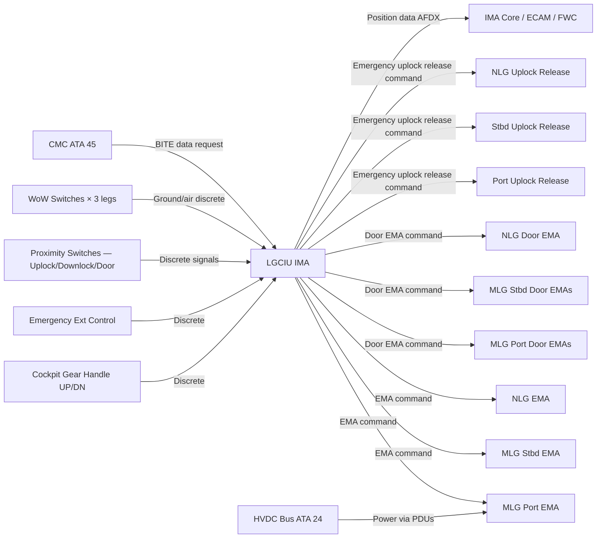
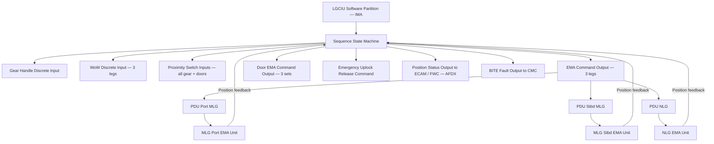
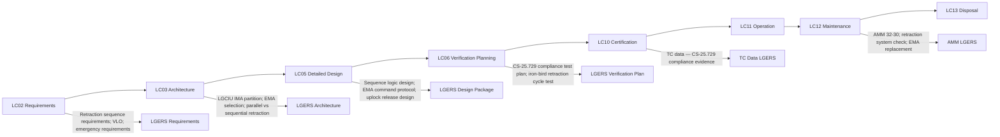

# 032-030 — Extension and Retraction
### AMPEL360e eWTW · ATA 32 · Q+ATLANTIDE ATLAS Scaffold

---

## §0 Hyperlink Policy

All internal links use relative paths. External regulatory references use anchors in [§20 References](#20-references). Links marked **TBD** indicate targets not yet allocated. Programme-level links use five directory levels (`../../../../../`). No absolute URLs are used for internal navigation.

---

## §1 Purpose

This document describes the Landing Gear Extension and Retraction System (LGERS) of the AMPEL360e eWTW. The LGERS encompasses the LGCIU sequencing logic (IMA-hosted), all Electromechanical Actuator (EMA) actuation for gear travel and door operation, the cockpit gear handle, the normal retraction and extension sequences, and the emergency extension provision.

On the eWTW, the complete absence of hydraulic power means all gear and door actuation is electric. The LGCIU function (hosted in the IMA) is the primary sequence controller. It receives the cockpit gear handle position as a discrete input, processes proximity switch signals from all gear and door positions, and commands EMA actuators in the correct sequence for each gear leg and its associated doors. The LGCIU is designed to a Design Assurance Level (DAL) commensurate with the safety assessment outcome (TBD; preliminary assessment DAL B for gear extension function).

Emergency extension is provided by a gravity free-fall system independent of the LGCIU. On selection of the emergency gear extension mode (dedicated cockpit control TBD — guarded switch or separate handle), the LGCIU commands all EMA power supplies off and releases the uplock hooks via dedicated electric releases. Gear and doors then fall under gravity, assisted by aerodynamic drag; downlocks latch passively on reaching the fully extended position.

---

## §2 Applicability

| Attribute | Value |
|---|---|
| Programme | AMPEL360e Wide Tube-and-Wing (eWTW) |
| ATA Subsubject | 032-030 — Extension and Retraction |
| Aircraft Variant | eWTW-100 (baseline), eWTW-100ER |
| Gear Configuration | 3 legs: 2× MLG + 1× NLG; each with EMA and door EMA |
| Normal Actuation | EMA per gear leg + EMA per door assembly |
| Emergency | Gravity free-fall; passive downlocking |
| Controller | LGCIU — IMA-hosted software function |
| Certification Basis | CS-25.729 (retracting mechanisms) |
| SNS Reference | 032-30 |
| Effectivity | From MSN 001 |

---

## §3 System / Function Overview

The LGERS provides two distinct modes of gear operation: Normal and Emergency.

**Normal Mode — Retraction**: Initiated by moving the cockpit gear handle to UP when airborne (WoW cleared on all gear). The LGCIU confirms the aircraft is airborne (all WoW cleared), then executes the retraction sequence: (1) Inboard/forward doors open (door EMAs commanded); (2) Gear downlocks released (LGCIU commands EMA to pull clear of downlock bracket); (3) EMA drives each gear leg toward the retracted position; (4) Centering cam aligns NLG wheels; (5) Each gear leg engages its uplock hook; (6) EMA is de-energised (passive uplock holds gear); (7) Doors close (door EMAs commanded). Sequence timing TBD per detailed kinematic analysis.

**Normal Mode — Extension**: Initiated by moving the cockpit gear handle to DOWN. The LGCIU executes the extension sequence: (1) Doors open; (2) Uplocks released (LGCIU commands EMA to pull clear of uplock hook, or dedicated electric uplock release); (3) EMA drives each gear leg toward the extended position; (4) Each gear leg engages its downlock; (5) Downlock confirmation received from proximity switches; (6) Doors close. The LGCIU waits for confirmation of downlock on all three gear before indicating "gear down and locked" (green light) to the crew.

**Emergency Mode**: Crew selects emergency gear extension. LGCIU removes power from all gear EMA. Dedicated electric releases (separate from the EMA) are commanded to release all uplock hooks simultaneously. Gear and doors fall under gravity; aerodynamic drag assists. Downlocks latch passively. The LGCIU (if still powered) monitors proximity switches and provides cockpit indication. If the LGCIU is not powered, gear position annunciation is provided by a backup indication circuit (TBD).

---

## §4 Scope

### 4.1 Included
- LGCIU sequencing software function (IMA-hosted) — all sequence logic for 3 gear legs and their doors
- Cockpit gear handle (UP/DOWN positions); handle guard or safety latch
- EMA actuators (gear travel) for all three gear legs — command and position feedback interface
- EMA actuators (door operation) for all gear bay doors — command and position feedback interface
- Uplock hooks and release mechanisms (passive mechanical uplock; electric release)
- Downlock devices and confirmation proximity switches
- Emergency gear extension control (cockpit control TBD)
- Emergency uplock release (electric, independent of LGCIU sequencing EMAs)
- Gear handle interconnect logic with BSCU (landing gear lever inhibit during retraction)
- Manual maintenance override for towing (ground maintenance uplock release procedure)

### 4.2 Excluded
- MLG and NLG structural assemblies — covered by 032-010 and 032-020
- EMA mechanical design — covered by 032-010 and 032-020
- Position indication to crew and ECAM — covered by 032-060
- Braking and steering — covered by 032-040 and 032-050
- Electrical power supply — covered by ATA 24

---

## §5 Architecture Description

- **LGCIU IMA-hosted**: The LGCIU is a software partition within the IMA, not a standalone LRU. DAL determination is pending FHA results (preliminary DAL B). LGCIU communicates with EMA actuators via a dedicated bus (CAN or proprietary TBD) and with the avionics suite via AFDX.
- **Parallel door and gear sequencing**: All three gear legs and their doors may sequence simultaneously (parallel retraction) or in a defined sequence; the optimal sequence TBD by kinematic analysis and EPS peak power constraints. Simultaneous retraction of all three gear maximises peak EPS draw; staggered sequencing may be used to reduce peak demand.
- **Passive uplocks and downlocks**: Uplock hooks and downlock brackets are passive mechanical devices; they require no power to maintain gear in position. Power is only required to move the gear, not to hold it. This is an important fail-safe principle.
- **Dedicated emergency uplock release**: The uplock release in emergency mode is provided by a dedicated electric actuator independent of the gear EMA. This ensures that even if the gear EMA has failed (e.g., jammed in retracted position), the uplock can still be released to allow gravity extension.
- **Gear handle design**: The gear handle provides UP/DOWN positions with a WoW inhibit to prevent retraction on the ground (inhibit relay or software interlock). An emergency gear extension control (separate from handle) is provided — configuration TBD.
- **Aerodynamic load consideration**: Gear door aerodynamic loads during extension and retraction are a significant EMA sizing driver; CFD analysis required (TBD — see Open Issues).
- **Retraction speed limit**: A maximum gear retraction/extension airspeed (VLO) is a certification and structural requirement; VLO value TBD.

---

## §6 Functional Breakdown

| Function ID | Function Title | Description | Applicable Subsystem |
|---|---|---|---|
| F-030-001 | Normal Retraction Sequencing | LGCIU commands door open → gear unlock → gear travel → gear lock → door close for all 3 legs | 032-030 |
| F-030-002 | Normal Extension Sequencing | LGCIU commands door open → uplock release → gear travel → downlock → door close for all 3 legs | 032-030 |
| F-030-003 | Emergency Extension | Emergency uplock release; EMA power removed; gravity free-fall; passive downlocking | 032-030 |
| F-030-004 | Cockpit Gear Handle Interface | Handle UP/DOWN discrete to LGCIU; WoW inhibit logic; handle lighting | 032-030 / 032-060 |
| F-030-005 | EMA Command and Monitoring | LGCIU issues EMA position commands; monitors position feedback and fault flags | 032-030 |
| F-030-006 | Door EMA Command and Monitoring | LGCIU issues door EMA commands; monitors door position (open/closed proximity switches) | 032-030 |
| F-030-007 | Uplock / Downlock Management | Monitoring of uplock and downlock proximity switches; confirmation of gear position before door close | 032-030 |
| F-030-008 | Maintenance Ground Override | Procedure for manual uplock engagement for towing; LGCIU maintenance test mode | 032-030 |

---

## §7 System Context Diagram

---

## §8 Internal Functional Architecture

---

## §9 Lifecycle Traceability

---

## §10 Interfaces

| Interface ID | System / Chapter | Interface Type | Data / Signal | Direction | Status |
|---|---|---|---|---|---|
| IF-030-001 | ATA 24 Electrical Power | HVDC bus / PDU | Power to all gear and door EMA actuators | ATA24 → ATA32-030 |  |
| IF-030-002 | ATA 32-010 MLG | EMA bus / discrete | MLG EMA command; MLG door EMA command; MLG proximity switches | ATA32-030 ↔ ATA32-010 |  |
| IF-030-003 | ATA 32-020 NLG | EMA bus / discrete | NLG EMA command; NLG door EMA command; NLG proximity switches | ATA32-030 ↔ ATA32-020 |  |
| IF-030-004 | ATA 32-060 Position Indication | AFDX | Gear position status to ECAM and FWC | ATA32-030 → ATA32-060 |  |
| IF-030-005 | ATA 31 FWC | AFDX | Gear not down alert data | ATA32-030 → ATA31 |  |
| IF-030-006 | ATA 34 GPWS/TAWS | Discrete / AFDX | WoW signal for ground proximity logic | ATA32-030 → ATA34 |  |
| IF-030-007 | ATA 45 Maintenance | AFDX maintenance bus | LGCIU BITE, EMA BITE, sequence fault log to CMC | ATA32-030 → ATA45 |  |
| IF-030-008 | ATA 22 Auto-Flight | AFDX | WoW discrete for AFCS mode; gear retraction speed interlock | ATA32-030 ↔ ATA22 |  |

---

## §11 Operating Modes

| Mode ID | Mode Name | Description | Entry Condition | Exit Condition |
|---|---|---|---|---|
| OM-030-001 | Standby — Gear Down Locked | LGCIU in standby; all gear down and locked; doors closed | All gear downlocked; WoW conditions | Gear handle selected |
| OM-030-002 | Retraction in Progress | LGCIU executing retraction sequence; doors opening, EMAs driving gear aft/upward/forward, uplocks engaging | Handle UP + all WoW cleared | All gear uplocked + doors closed |
| OM-030-003 | Retraction Complete | All gear uplocked; doors closed; LGCIU in standby | Retraction sequence confirmation | Gear handle DOWN |
| OM-030-004 | Extension in Progress (Normal) | LGCIU executing extension sequence; doors opening, uplocks releasing, EMAs extending gear, downlocks engaging | Handle DOWN in flight | All gear downlocked + doors closed |
| OM-030-005 | Extension Complete | All gear downlocked; doors closed; LGCIU in standby | Extension sequence confirmation | Aircraft touch-down or gear handle UP |
| OM-030-006 | Emergency Extension | EMA power removed; uplock releases commanded; gravity extension | Emergency extension selected | All gear downlocked under gravity |
| OM-030-007 | Partial Extension Fault | One or more gear not reaching downlock in sequence time; LGCIU generates warning | Extension timeout on any gear | Fault resolved or emergency procedure applied |
| OM-030-008 | Maintenance Test | LGCIU commands partial retraction cycle at reduced EMA power on ground | CMC maintenance test mode + ground safety interlock | Test complete or abort |

---

## §12 Monitoring and Diagnostics

The LGCIU state machine monitors the elapsed time from each EMA command to the expected proximity switch confirmation. A timeout (time limit TBD per kinematic analysis) generates a BITE fault and, depending on the phase of sequence, either an ECAM caution or warning. An EMA fault signal (from the EMA motor controller) is also monitored; an EMA fault during retraction or extension generates an immediate BITE entry and ECAM message.

Cross-checking of all proximity switches is continuous: uplock, downlock, and door-open/door-closed switches are monitored for consistency with the commanded sequence state. Spurious signals (e.g., uplock switch indicating locked when gear is commanded to extend) are flagged as BITE faults.

Emergency uplock release circuit is monitored for continuity (open circuit indicates a release actuator fault) by the LGCIU BITE function. This monitoring is active whenever the aircraft is powered.

Ground maintenance test mode: the CMC can initiate a partial gear retraction cycle test to verify EMA function, proximity switch responses, and door sequencing without uplifting the aircraft (gear is not fully retracted — only a partial stroke is tested). This test requires a maintenance safety interlock confirmation (aircraft chocked, maintenance personnel clear of gear bay).

---

## §13 Maintenance Concept

Scheduled maintenance tasks for the LGERS: periodic retraction cycle check per AMM (interval TBD by MRB); inspection of uplock and downlock mechanical devices for wear and security; inspection of EMA mechanical attachments and electrical connectors; gear door hinge and actuator inspection.

EMA replacement is an LRU task. Door EMA replacement is an LRU task requiring gear bay access with the aircraft on jacks (for MLG door EMAs) or on the ground (for NLG door EMAs). A post-replacement functional test via CMC is required.

Emergency uplock release actuator is a scheduled replacement item (replacement interval TBD — based on actuator qualification life). Verification of emergency uplock release function is a scheduled test per AMM.

For towing purposes, the ground crew must engage the main gear uplock manually per AMM towing procedure; this involves a maintenance safety override that inhibits LGCIU from commanding gear extension. The override must be removed before flight.

---

## §14 S1000D / CSDB Mapping

### 14.1 SNS to DMC Mapping

| SNS Code | Subsubject Title | DMC Prefix | Info Codes Planned | DMRL Status |
|---|---|---|---|---|
| 032-30 | Extension and Retraction | DMC-AMPEL360E-EWTW-032-30 | 040, 300, 400, 520, 720 |  |

### 14.2 Information Code Definitions

| Info Code | Description | Applicable |
|---|---|---|
| 040 | Description — LGCIU, sequence logic, EMA control | Yes |
| 300 | Operation — normal and emergency retraction/extension procedures | Yes |
| 400 | Maintenance — retraction test, EMA inspection, uplock release check | Yes |
| 520 | Troubleshooting — sequence fault, EMA fault, proximity switch fault | Yes |
| 720 | Removal / installation — EMA units, door EMA units, uplock release actuator | Yes |

---

## §15 Footprints

### 15.1 Physical Footprint
- LGCIU: IMA-hosted — no dedicated LRU enclosure; hosted within IMA cabinet (ATA 24 / ATA 42)
- EMA units: as specified in 032-010 (MLG) and 032-020 (NLG)
- Door EMA units: small envelope within gear bay door structure; dimensions TBD
- Emergency uplock release actuators: one per gear leg; integral to uplock hook structure

### 15.2 Electrical / Data Footprint
- LGCIU power: supplied via IMA cabinet 28 VDC power supply
- EMA power: HVDC bus via PDU; peak demand during full retraction TBD kW (sizing driver for EPS)
- Door EMA power: 28 VDC or HVDC (lower power than gear EMA); TBD
- Data: AFDX for LGCIU to avionics; EMA bus (CAN TBD) for EMA actuator commands; discrete for proximity switches and gear handle

### 15.3 Maintenance Footprint
- LGCIU software update: via ARINC 615A data loader through IMA; part number verification enforced
- EMA replacement: per 032-010 and 032-020 maintenance concept
- Retraction cycle test equipment: CMC maintenance terminal; no external GSE required beyond aircraft jacking for full gear swing

### 15.4 Data Footprint
- LGCIU BITE log: sequence fault history with timestamp, gear cycle number, flight phase; minimum 500 entries
- EMA operational history: in motor controller non-volatile memory per EMA
- Gear cycle counter: cumulative, per gear leg; accessible via CMC; used for life management

---

## §16 Safety and Certification Considerations

| Requirement | Source | Description | Compliance Approach | Status |
|---|---|---|---|---|
| CS-25.729 | EASA CS-25 | Retracting mechanisms — gear must retract safely; doors must not create hazard | Retraction sequence functional test (iron-bird); FHA/FMEA of LGCIU and EMAs |  |
| CS-25.729(e) | EASA CS-25 | Emergency extension — alternative means of extension | Gravity free-fall design; emergency extension flight test |  |
| CS-25.729(f) | EASA CS-25 | Gear-up landing — means to safeguard against inadvertent retraction on ground | WoW inhibit logic; ground test of inhibit |  |
| DO-178C | RTCA | LGCIU software — DAL TBD (preliminary DAL B) | Software development per DO-178C at assigned DAL |  |
| ARP 4761 | SAE | FHA / FMEA for LGCIU and LGERS | Safety assessment: gear not extending is potentially Hazardous |  |
| VLO | CS-25.729 | Maximum gear operation airspeed — structural and aerodynamic requirement | CFD / structural analysis; placarded on gear handle |  |

---

## §17 Verification and Validation

| V&V ID | Requirement | Method | Success Criterion | Status |
|---|---|---|---|---|
| VV-030-001 | CS-25.729 — Retraction sequence | Iron-bird retraction cycle test — 2× design life cycles | Correct sequence each cycle; all uplock/downlock/door confirmations; no EMA fault |  |
| VV-030-002 | CS-25.729(e) — Emergency extension | Aircraft jacks test with EMA power removed and uplock releases commanded | All 3 gear extend and lock within required time (TBD s); green downlock indication |  |
| VV-030-003 | CS-25.729(f) — Ground inhibit | Ground functional test — gear handle UP selected with WoW active | Retraction inhibited; ECAM caution generated |  |
| VV-030-004 | LGCIU BITE | Ground integration test | All EMA timeout faults, proximity switch faults, and sequence faults correctly detected and reported to CMC |  |
| VV-030-005 | VLO — gear operation airspeed | Flight test — gear retraction and extension at VLO | No structural damage; doors and gear operate correctly; no proximity switch faults |  |
| VV-030-006 | EMA peak power demand | Iron-bird power measurement during full retraction | EPS peak demand consistent with ATA 24 load analysis |  |

---

## §18 Glossary

| Term | Definition |
|---|---|
| Downlock | Passive mechanical device locking gear in extended position; releases during retraction via EMA force |
| EMA | Electromechanical Actuator — electric motor and ball-screw providing gear retraction/extension force |
| Emergency extension | Gear extension mode not relying on normal EMAs; uses gravity, aerodynamics, and dedicated electric uplock releases |
| Gravity free-fall | The mechanism by which gear extends under its own weight without powered actuation |
| LGCIU | Landing Gear Control and Interface Unit — IMA-hosted sequence controller for gear retraction/extension |
| Proximity switch | Non-contact sensor detecting metallic target proximity; used for all gear/door position confirmation |
| Retraction sequence | The ordered set of LGCIU commands (door open → gear unlock → gear travel → gear lock → door close) executed during gear retraction |
| Uplock | Passive mechanical hook holding gear retracted in flight; requires electric release for extension |
| VLO | Landing Gear Operation Speed — maximum airspeed at which the landing gear may be operated |
| WoW | Weight on Wheels — ground/air discriminator; inhibits retraction on the ground |

---

## §19 Citations

| Citation ID | Reference | Description | Relevance |
|---|---|---|---|
| CIT-030-001 | EASA CS-25.729 | Retracting mechanisms | Primary requirement for LGERS |
| CIT-030-002 | RTCA DO-178C | Software Considerations | LGCIU software development |
| CIT-030-003 | SAE ARP 4761 | Safety Assessment Guidelines | FHA/FMEA for LGCIU and LGERS |

---

## §20 References

| Ref ID | Title | Document | Link |
|---|---|---|---|
| REF-030-001 | ATA 32 General | 032-000 | [./032-000-Landing-Gear-General.md](./032-000-Landing-Gear-General.md) |
| REF-030-002 | Main Landing Gear | 032-010 | [./032-010-Main-Landing-Gear.md](./032-010-Main-Landing-Gear.md) |
| REF-030-003 | Nose Landing Gear | 032-020 | [./032-020-Nose-Landing-Gear.md](./032-020-Nose-Landing-Gear.md) |
| REF-030-004 | Position Indication | 032-060 | [./032-060-Position-Indication-and-Warning.md](./032-060-Position-Indication-and-Warning.md) |
| REF-030-005 | EASA CS-25 | Certification Specifications | [https://www.easa.europa.eu](https://www.easa.europa.eu) |

---

## §21 Open Issues

| Issue ID | Description | Owner | Priority | Target Resolution | Status |
|---|---|---|---|---|---|
| OI-030-001 | LGCIU DAL not formally confirmed; FHA for gear extension/retraction function not yet complete | Safety / Systems | High | TBD |  |
| OI-030-002 | Parallel vs sequential retraction sequence not determined; peak EPS demand analysis pending EMA power data | Systems / EPS | High | TBD |  |
| OI-030-003 | EMA bus protocol (CAN vs proprietary) not confirmed; depends on EMA supplier selection | Systems / Procurement | High | TBD |  |
| OI-030-004 | VLO value not yet determined; requires aerodynamic and structural analysis of gear and doors | Aerodynamics / Structures | Medium | TBD |  |
| OI-030-005 | Emergency gear extension cockpit control configuration (guarded switch vs separate handle) not decided | Human Factors / Systems | Medium | TBD |  |
| OI-030-006 | Towing uplock maintenance override procedure not yet defined; affects AMM | Maintenance Engineering | Low | TBD |  |

---

## §22 Change Log

| Revision | Date | Author | Description |
|---|---|---|---|
| 0.1.0 | 2026-05-09 | Q+ATLANTIDE Authoring | Initial scaffold — all sections to template standard; data TBD |
