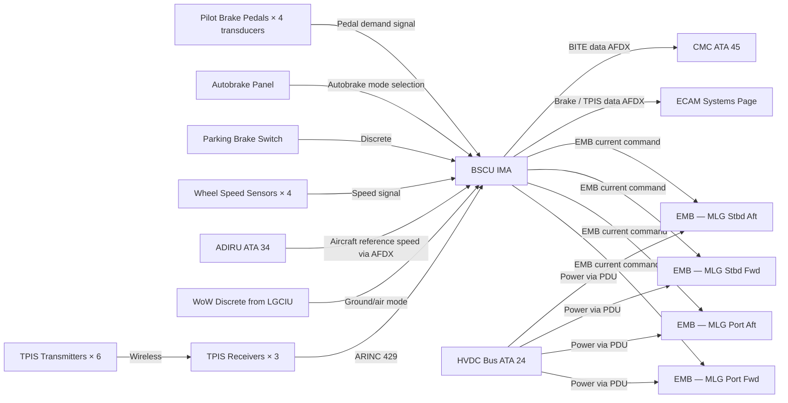
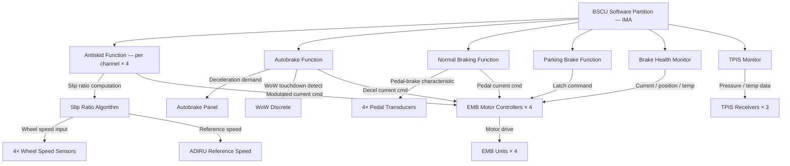
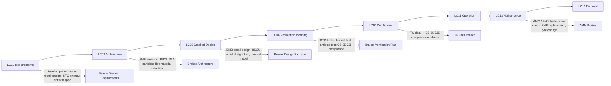

# 032-040 — Wheels, Tires, and Brakes
### [PROGRAMME-AIRCRAFT] [PROGRAMME-VARIANT] · ATA 32 · Q+ATLANTIDE ATLAS Scaffold

---

## §0 Hyperlink Policy

All internal links use relative paths. External regulatory references use anchors in [§20 References](#20-references). Links marked **TBD** indicate targets not yet allocated. Programme-level links use five directory levels (`../../../../../`). No absolute URLs are used for internal navigation.

---

## §1 Purpose

This document defines the agnostic ATLAS standard-level architecture context for `032-040 — Wheels, Tires, and Brakes`.

It describes the controlled scope, functions, interfaces, safety considerations, lifecycle traceability, and S1000D/CSDB mapping logic that programme implementations shall instantiate when this node is applicable.

This document is not a programme design baseline. Programme-specific capacities, locations, part numbers, effectivity, operating limits, maintenance references, and data module codes shall be defined only inside the applicable programme implementation branch.
## §2 Applicability

| Applicability Level | Rule |
|---|---|
| Standard taxonomy | Applies to the ATLAS node `<NODE>` |
| Programme implementation | Conditional; determined by programme architecture, trade studies, certification basis, and applicability model |
| Product configuration | Defined in the programme-specific configuration baseline |
| Effectivity | Defined in the programme CSDB / applicability layer |
| Non-applicability | Must be explicitly stated in the programme impact-study branch when excluded |
## §3 System / Function Overview

The Wheels, Tyres, and Brakes subsystem includes all wheel assemblies, tyre assemblies, EMB actuator units, wheel speed sensors, TPIS transmitters and receivers, the BSCU software function (IMA-hosted), the cockpit brake pedal transducers, the autobrake control panel, and the parking brake switch.

**EMB Operation**: Each EMB converts an electrical current command from the BSCU into a mechanical clamping force applied to the brake disc pack. The actuator consists of a brushless DC motor driving a ball-screw mechanism through a gear reduction; the ball-screw translates rotary motor output into linear clamping force on the brake discs. A position sensor (resolver or encoder) on the motor shaft provides feedback to the BSCU. The EMB is mechanically self-locking when in the parking brake state; a dedicated electric latch (or motor back-driving inhibitor) holds the clamping force without continuous power.

**Antiskid**: The BSCU computes wheel slip ratio from wheel speed sensor data (rotational speed) and aircraft reference speed (from ADIRU via AFDX). When a wheel decelerates faster than the antiskid threshold, the BSCU reduces the EMB current command on that wheel channel to reduce clamping force and allow the wheel to spin back up. This cycle repeats to maintain the wheel in the optimal braking slip range.

**Autobrake**: Pilot selects an autobrake deceleration level (LOW, MED, HIGH, MAX for landing; RTO for take-off). On touchdown detection (WoW signal from LGCIU), the BSCU ramps up EMB current commands to achieve the target deceleration. Antiskid remains active during autobrake. The pilot can override autobrake at any time by applying pedal pressure above the override threshold.

**Parking Brake**: Pilot selects parking brake ON; BSCU commands maximum EMB clamping on all four main wheels and engages the electric latch mechanism. The aircraft can be parked with electrical power off — the mechanical lock retains the clamping force. Parking brake release: pilot selects OFF; BSCU commands motor to retract the ball-screw from the locked position.

---

## §4 Scope

### 4.1 Included
- Main wheel assemblies (4 total — 2 per MLG bogie) including wheel hub, bearings, and heat shields
- Main wheel tyres (4 total) and associated tyre inflation valves
- Nose wheel assemblies (2 total) and tyres — unbraked
- EMB actuator units (4 total — one per main wheel): motor, gear reduction, ball-screw, disc pack, position sensor
- Wheel speed sensors (4 total — one per main wheel)
- TPIS wireless transmitters (6 total — one per wheel hub) and TPIS receivers (3 total — one per gear station)
- BSCU software function (IMA-hosted): antiskid, autobrake, normal braking, parking brake
- Cockpit brake pedal transducers (Captain and FO pedals — 4 transducers total)
- Autobrake control panel (cockpit overhead or central pedestal — location TBD)
- Parking brake switch and indicator
- Brake disc pack (per EMB — carbon or steel, TBD)

### 4.2 Excluded
- MLG structural assembly and shock absorber — covered by 032-010
- NLG structural assembly — covered by 032-020
- Nose-wheel steering (including differential braking as backup) — covered by 032-050
- Electrical power supply (HVDC, PDU) — covered by ATA 24
- Tyre procurement (commercial supply)

---

## §5 Architecture Description

- **BSCU IMA-hosted**: The BSCU is a software partition within IMA; no standalone LRU. DAL TBD pending FHA (braking is safety-critical; preliminary assessment DAL B or C depending on antiskid failure mode effects).
- **Independent channel per wheel**: The BSCU controls each EMB independently. A fault in one EMB or its channel does not affect braking on the other three wheels. The BSCU isolates a faulty channel and continues operation on the remaining wheels.
- **No hydraulic accumulator**: Conventional aircraft use a hydraulic accumulator for brake application in case of hydraulic system failure. On [PROGRAMME-VARIANT], the equivalent is the EMB electric latch (for parking) and dedicated essential bus power for the BSCU (enabling continued braking on essential bus in case of main bus failure).
- **Antiskid wheel-by-wheel**: Each of the four main wheels has an independent antiskid channel. The algorithm uses individual wheel speed sensors compared to aircraft reference speed.
- **Autobrake deceleration targets**: Deceleration levels for landing: typically LOW (≈1.2 m/s²), MED (≈1.7 m/s²), HIGH (≈2.5 m/s²); RTO (maximum) level activates maximum EMB current with antiskid. Exact deceleration values TBD per programme performance analysis.
- **Brake disc material**: Carbon vs steel disc pack — decision TBD. Carbon offers lower mass but requires minimum operating temperature for effectiveness; steel is simpler for first entry into service.
- **Brake energy budget**: The maximum brake energy absorbed at RTO (maximum take-off weight, maximum take-off speed, all brakes applied, no thrust reversal — no thrust reversers on [PROGRAMME-VARIANT] as electric motors can provide regenerative braking — TBD) defines the thermal sizing of each EMB disc pack.
- **Tyre fuse plugs**: Wheel fusible plugs deflate tyres at a set temperature to prevent tyre explosion in the event of brake overheat. Design requirement per CS-25.735.

---

## §6 Functional Breakdown

| Function ID | Function Title | Description | Applicable Subsystem |
|---|---|---|---|
| F-040-001 | Normal Braking | BSCU converts pilot pedal transducer input to EMB current command per pedal-to-brake characteristic | 032-040 |
| F-040-002 | Antiskid Protection | BSCU monitors wheel slip ratio; modulates EMB current to prevent wheel lock-up | 032-040 |
| F-040-003 | Autobrake — Landing | BSCU applies pre-selected deceleration on WoW touchdown; maintains deceleration via closed-loop EMB control | 032-040 |
| F-040-004 | Autobrake — RTO | BSCU applies maximum braking on RTO selection + speed above V1 threshold | 032-040 |
| F-040-005 | Parking Brake | BSCU commands maximum EMB clamp + electric latch; latch holds without power | 032-040 |
| F-040-006 | Brake Health Monitoring | BSCU monitors EMB current, position, temperature, disc wear; reports to CMC | 032-040 |
| F-040-007 | Wheel Speed Acquisition | BSCU reads 4× wheel speed sensors; provides speed data for antiskid and autobrake algorithms | 032-040 |
| F-040-008 | TPIS Monitoring | TPIS receivers acquire pressure and temperature from all 6 wheel transmitters; ECAM display; CMC logging | 032-040 |
| F-040-009 | Brake Energy Accounting | BSCU accumulates brake energy per wheel; triggers ECAM advisory at thermal threshold | 032-040 |

---

## §7 System Context Diagram

---

## §8 Internal Functional Architecture

---

## §9 Lifecycle Traceability

---

## §10 Interfaces

| Interface ID | System / Chapter | Interface Type | Data / Signal | Direction | Status |
|---|---|---|---|---|---|
| IF-040-001 | ATA 24 Electrical Power | HVDC / PDU | Power to EMB motor controllers | ATA24 → ATA32-040 |  |
| IF-040-002 | ATA 34 Navigation (ADIRU) | AFDX / ARINC 429 | Aircraft reference ground speed for antiskid | ATA34 → ATA32-040 |  |
| IF-040-003 | ATA 32-030 LGCIU | Discrete / AFDX | WoW signal for autobrake touchdown detection | ATA32-030 → ATA32-040 |  |
| IF-040-004 | ATA 32-050 Steering | AFDX / discrete | Differential braking demand from BSCU for backup steering | ATA32-040 ↔ ATA32-050 |  |
| IF-040-005 | ATA 31 ECAM | AFDX | Brake status, TPIS data, autobrake mode for ECAM systems page | ATA32-040 → ATA31 |  |
| IF-040-006 | ATA 45 Maintenance | AFDX maintenance bus | BSCU BITE, brake energy log, EMB wear state to CMC | ATA32-040 → ATA45 |  |
| IF-040-007 | ATA 27 Flight Controls | AFDX / discrete | Spoiler extension signal (for autobrake deceleration accounting) | ATA27 → ATA32-040 |  |

---

## §11 Operating Modes

| Mode ID | Mode Name | Description | Entry Condition | Exit Condition |
|---|---|---|---|---|
| OM-040-001 | Braking — Normal | Pilot pedal input; BSCU commands EMBs proportionally; antiskid active | WoW + pedal force applied | Pedal released |
| OM-040-002 | Antiskid Active | BSCU modulating EMB current to prevent wheel lock | Wheel slip ratio exceeds threshold | Slip ratio returns to normal |
| OM-040-003 | Autobrake — Landing Armed | Autobrake deceleration level selected; BSCU armed and waiting for touchdown | Gear down + autobrake level selected | Touchdown detected / autobrake disarmed |
| OM-040-004 | Autobrake — Landing Active | BSCU applying EMBs to achieve target deceleration after touchdown | WoW touchdown detected | Speed below threshold / pilot pedal override / auto disengage |
| OM-040-005 | Autobrake — RTO Armed | RTO autobrake selected; BSCU monitors speed | Gear down + RTO selected + throttle advanced | V1 speed exceeded or throttle reduced |
| OM-040-006 | Autobrake — RTO Active | BSCU applies maximum braking; antiskid active | RTO: V1 exceeded with throttle reducing (or manually armed) | Aircraft stopped |
| OM-040-007 | Parking Brake Set | EMBs at maximum clamp; electric latch engaged; no power required to maintain | Parking brake switch ON + WoW | Parking brake switch OFF |
| OM-040-008 | Brake Fault — Degraded | One EMB channel isolated by BSCU; remaining 3 channels operative; ECAM advisory | EMB fault detected on one channel | Fault cleared or maintenance action |

---

## §12 Monitoring and Diagnostics

The BSCU monitors each EMB channel continuously: motor current (expected vs actual for commanded clamping force), motor position (resolver/encoder feedback vs commanded position), and disc temperature (sensor TBD — thermocouple or infrared on stator). A current discrepancy exceeding the threshold triggers a BITE fault, isolates the affected channel, and generates an ECAM advisory.

Antiskid performance monitoring: the BSCU logs antiskid intervention events (number of cycles, duration, associated wheel speed data) per landing. This data is stored in BSCU non-volatile memory and accessed by CMC for trend analysis (e.g., consistent antiskid on a particular runway friction coefficient).

Brake wear state: the BSCU accumulates a wear index per EMB based on brake energy applied (current × time integral) correlated with disc temperature. When the wear index reaches a maintenance threshold, an ECAM advisory is generated to prompt brake wear physical inspection.

TPIS monitoring: all six wheel pressure and temperature readings are displayed on the ECAM landing gear page. A pressure deviation below the lower limit generates an ECAM caution; a critically low pressure generates an ECAM warning. Temperature exceedance triggers an ECAM caution.

---

## §13 Maintenance Concept

Brake wear inspection: physical measurement of disc pack thickness per AMM procedure (interval TBD by MRB); correlates with BSCU brake wear index. EMB replacement is an LRU task performed with the wheel removed. The EMB unit, including motor and ball-screw, is replaced as an assembly. A post-replacement functional test is required via CMC before return to service.

Tyre change: conventional tyre removal and inflation procedure per AMM. TPIS transmitter unit is typically replaced with the wheel/tyre assembly change (transmitter is mounted in the wheel hub). Tyre pressure is set per AMM inflation schedule after installation.

Wheel bearing: wheel bearings are part of the wheel assembly; replacement is typically at base maintenance input or per bearing condition during wheel inspection.

Wheel speed sensor: LRU replacement accessible with wheel removed.

Periodic BSCU function test: antiskid and autobrake self-test is available via CMC ground test function (aircraft stationary on ground). RTO autobrake logic is verified by simulation test within CMC. Full brake thermal test (physical RTO brake energy test) is a one-time certification test, not a periodic maintenance task.

---

## §14 S1000D / CSDB Mapping

### 14.1 SNS to DMC Mapping

| SNS Code | Subsubject Title | DMC Prefix | Info Codes Planned | DMRL Status |
|---|---|---|---|---|
| 032-40 | Wheels, Tyres, and Brakes | DMC-<PROGRAMME>-<VARIANT>-032-40 | 040, 300, 400, 520, 720, 941 |  |

### 14.2 Information Code Definitions

| Info Code | Description | Applicable |
|---|---|---|
| 040 | Description — BSCU, EMB, antiskid, autobrake, TPIS | Yes |
| 300 | Operation — normal braking, autobrake procedures, parking brake | Yes |
| 400 | Maintenance — brake wear inspection, tyre change, EMB service | Yes |
| 520 | Troubleshooting — EMB fault, antiskid fault, TPIS fault | Yes |
| 720 | Removal / installation — EMB, wheel, tyre, wheel speed sensor | Yes |
| 941 | Illustrated Parts Data — wheel assembly, EMB, TPIS | Yes |

---

## §15 Footprints

### 15.1 Physical Footprint
- EMB: wheel-mounted; envelope per wheel/axle design (TBD per supplier)
- Main wheel: tyre size TBD per loading and ACN/PCN analysis (typically H44×16-15 or similar class)
- Nose wheel: tyre size TBD (smaller than main)
- TPIS transmitters: wheel-hub mounted; small cylinder in valve stem or hub recess
- TPIS receivers: gear bay mounted; one per gear station (3 units)
- BSCU: IMA-hosted software; no additional enclosure

### 15.2 Electrical / Data Footprint
- EMB power: HVDC bus via PDU; peak power per EMB TBD kW (clamping force × ball-screw speed)
- BSCU: 28 VDC essential bus via IMA power supply
- Data: AFDX for BSCU to avionics; ARINC 429 for TPIS receivers; discrete for pedal transducers and parking brake switch

### 15.3 Maintenance Footprint
- EMB: wheel removal required before EMB LRU replacement; wheel change tooling (standard)
- Brake wear inspection: visual or physical measurement per AMM; special gauge TBD
- BSCU test: CMC portable terminal; no additional GSE

### 15.4 Data Footprint
- BSCU: brake energy per wheel per event; antiskid intervention log; wear index history; retained minimum 1000 events
- TPIS: pressure trend history per wheel; minimum 100 samples; accessed via CMC
- EMB: accumulated energy, peak temperature, cycle count in BSCU non-volatile memory

---

## §16 Safety and Certification Considerations

| Requirement | Source | Description | Compliance Approach | Status |
|---|---|---|---|---|
| CS-25.735 | EASA CS-25 | Brakes — braking performance; RTO energy; parking brake; antiskid | EMB RTO thermal test; antiskid functional test; parking brake hold test |  |
| AC 25.735-1 | FAA AC | Brakes and braking systems — EMB-specific guidance | EMB qualification per AC guidance; BSCU antiskid test |  |
| SAE AS1290 | SAE | Antiskid system performance specification | BSCU antiskid algorithm meets AS1290 performance criteria |  |
| CS-25.735(f) | EASA CS-25 | Fusible plugs — tyre pressure relief at brake overheat | Fusible plug design per wheel/tyre specification |  |
| DO-178C | RTCA | BSCU software — DAL TBD (preliminary DAL B/C) | Software development per DO-178C at assigned DAL |  |
| DO-160G | RTCA | EMB environmental qualification | EMB qualification per DO-160G environmental categories |  |

---

## §17 Verification and Validation

| V&V ID | Requirement | Method | Success Criterion | Status |
|---|---|---|---|---|
| VV-040-001 | CS-25.735 — RTO brake energy | Full-scale brake thermal test at maximum RTO energy (MTOW, Vmax, all brakes) | Disc temperature within design limit; no fire; EMB functional after cool-down; fusible plugs not released (unless design requirement) |  |
| VV-040-002 | CS-25.735 — Antiskid | Wet and contaminated runway braking tests | Wheel lock-up prevented; stopping distance within specification |  |
| VV-040-003 | CS-25.735 — Parking brake | Parking brake hold test on gradient | Aircraft remains stationary at required gradient (typically 3° slope per CS-25) for required duration |  |
| VV-040-004 | Autobrake landing | Flight test — multiple landings at each autobrake level | Deceleration achieved within ±10% of target; pilot advisory information correct |  |
| VV-040-005 | EMB functional test | Bench test + ground functional test | EMB applies and releases commanded clamp force within response time; position feedback accurate |  |
| VV-040-006 | TPIS accuracy | Ground calibration test | TPIS pressure reading within ±TBD psi of reference gauge; temperature within ±TBD °C |  |
| VV-040-007 | BSCU BITE | Ground integration test | All EMB faults, antiskid sensor faults, and TPIS faults correctly detected and reported to ECAM and CMC |  |

---

## §18 Glossary

| Term | Definition |
|---|---|
| Antiskid | BSCU function that modulates EMB clamping force to prevent wheel lock-up, maintaining wheel rolling and maximising braking coefficient |
| Autobrake | BSCU function applying pre-set deceleration automatically on touchdown or RTO selection |
| BSCU | Brake and Steering Control Unit — IMA-hosted software controlling EMBs and NWS actuator |
| Brake energy | The kinetic energy absorbed by the brake discs during a braking event; determines disc temperature rise and thermal sizing requirement |
| Disc pack | The set of rotating and stationary discs (rotors and stators) within the EMB that create braking friction when clamped |
| EMB | Electromechanical Brake — electric motor-driven ball-screw clamping mechanism replacing hydraulic disc brakes |
| Fusible plug | A heat-sensitive plug in the wheel rim that melts at a set temperature to deflate the tyre and prevent explosive failure due to brake overheat |
| Parking brake | BSCU function commanding maximum EMB clamp with electric latch; maintains braking without continuous power |
| Regenerative braking | Potential use of electric motor back-EMF to recover kinetic energy during deceleration; applicability on [PROGRAMME-VARIANT] TBD |
| RTO | Rejected Take-Off — aborted take-off from above V1; worst-case brake thermal sizing condition |
| Slip ratio | (Aircraft speed − Wheel peripheral speed) / Aircraft speed; antiskid algorithm maintains slip ratio in optimal braking range |
| TPIS | Tyre Pressure Indication System — wireless sensors on wheel hubs transmitting pressure and temperature to cockpit and CMC |
| Wheel speed sensor | Magnetic pulse or Hall-effect sensor measuring wheel rotation frequency; input to antiskid algorithm |

---

## §19 Citations

| Citation ID | Reference | Description | Relevance |
|---|---|---|---|
| CIT-040-001 | EASA CS-25.735 | Brakes and braking systems | Primary certification requirement |
| CIT-040-002 | FAA AC 25.735-1 | Brakes and braking systems certification | EMB and antiskid certification guidance |
| CIT-040-003 | SAE AS1290 Rev C | Antiskid system performance | BSCU antiskid algorithm performance standard |
| CIT-040-004 | RTCA DO-178C | Software Considerations | BSCU software development |
| CIT-040-005 | RTCA DO-160G | Environmental Conditions | EMB and TPIS environmental qualification |

---

## §20 References

| Ref ID | Title | Document | Link |
|---|---|---|---|
| REF-040-001 | ATA 32 General | 032-000 | [./032-000-Landing-Gear-General.md](./032-000-Landing-Gear-General.md) |
| REF-040-002 | Main Landing Gear | 032-010 | [./032-010-Main-Landing-Gear.md](./032-010-Main-Landing-Gear.md) |
| REF-040-003 | Steering | 032-050 | [./032-050-Steering.md](./032-050-Steering.md) |
| REF-040-004 | Monitoring Diagnostics | 032-080 | [./032-080-Landing-Gear-Monitoring-Diagnostics-and-Control-Interfaces.md](./032-080-Landing-Gear-Monitoring-Diagnostics-and-Control-Interfaces.md) |
| REF-040-005 | EASA CS-25 | Certification Specifications | [https://www.easa.europa.eu](https://www.easa.europa.eu) |

---

## §21 Open Issues

| Issue ID | Description | Owner | Priority | Target Resolution | Status |
|---|---|---|---|---|---|
| OI-040-001 | EMB supplier not selected; thermal model cannot be validated | Procurement | High | TBD |  |
| OI-040-002 | Brake disc material (carbon vs steel) not decided; affects thermal model and maintenance concept | Systems | High | TBD |  |
| OI-040-003 | BSCU DAL not confirmed by FHA; antiskid failure mode effects to be quantified | Safety | High | TBD |  |
| OI-040-004 | Regenerative braking via electric motors — feasibility and safety assessment not performed | Systems | Medium | TBD |  |
| OI-040-005 | Tyre size and load rating TBD pending aircraft weight and CG analysis | Systems | Medium | TBD |  |
| OI-040-006 | Autobrake deceleration level values (m/s²) TBD per performance analysis and airline input | Performance | Low | TBD |  |

---

## §22 Change Log

| Revision | Date | Author | Description |
|---|---|---|---|
| 0.1.0 | 2026-05-09 | Q+ATLANTIDE Authoring | Initial scaffold — all sections to template standard; data TBD |
