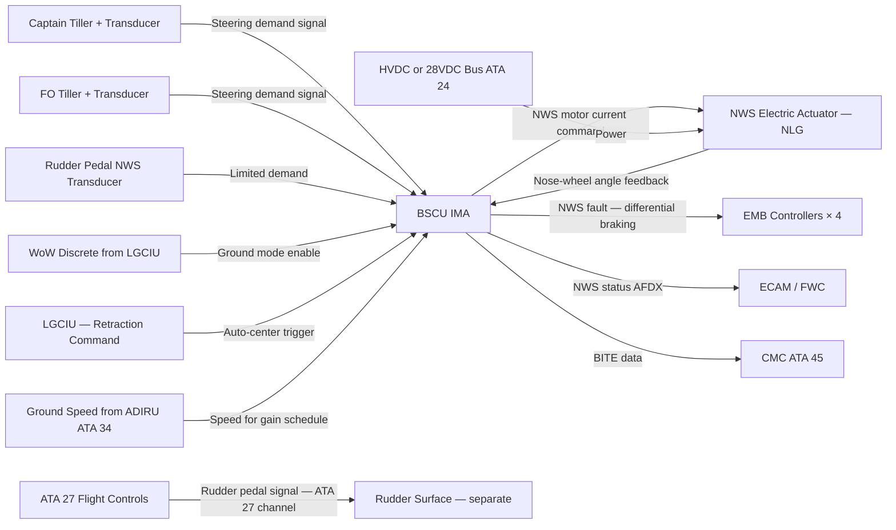
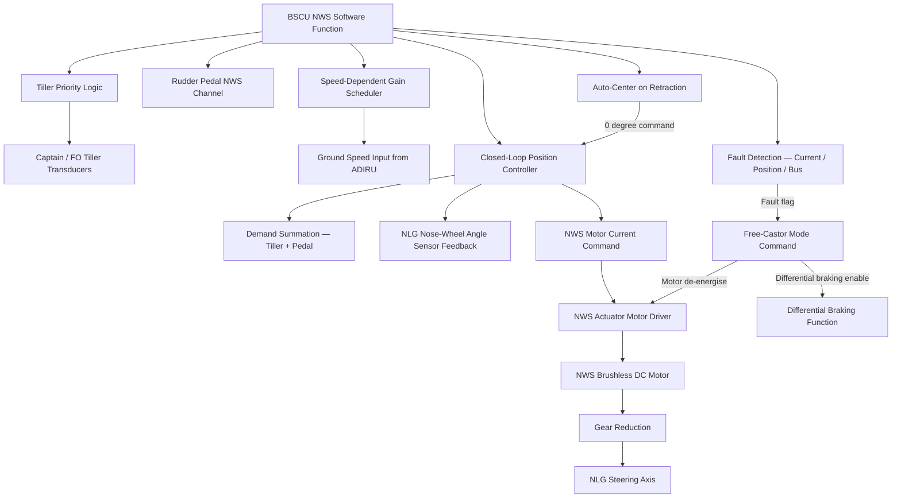
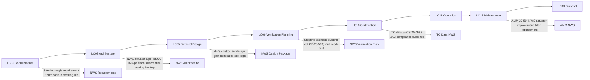

# 032-050 — Steering
### AMPEL360e eWTW · ATA 32 · Q+ATLANTIDE ATLAS Scaffold

---

## §0 Hyperlink Policy

All internal links use relative paths. External regulatory references use anchors in [§20 References](#20-references). Links marked **TBD** indicate targets not yet allocated. Programme-level links use five directory levels (`../../../../../`). No absolute URLs are used for internal navigation.

---

## §1 Purpose

This document describes the Nose-Wheel Steering (NWS) system of the AMPEL360e eWTW. The NWS system provides directional control of the aircraft during ground operations (taxiing, take-off roll, and landing roll). On eWTW, nose-wheel steering is achieved by an electric motor actuator integral to the upper NLG leg, commanded by the BSCU (IMA-hosted). This replaces the hydraulic steering actuator and hydraulic steering metering valve found in conventional transport-category aircraft.

The steering system has two input channels: (1) the tiller, providing full steering authority of ±70° to the pilots (Captain tiller on left side, First Officer tiller on right side — both connected to BSCU, priority logic TBD); and (2) the rudder pedals, providing limited steering authority of ±5° through a separate transducer channel in the BSCU. The rudder pedal channel provides directional control during the take-off and landing rolls at higher speeds where large tiller angles would be dangerous.

On NWS fault, the BSCU commands free-castor mode (NWS motor unpowered). In free-castor mode, directional control is achieved by differential braking via the BSCU, which asymmetrically commands the EMBs on each MLG bogie to yaw the aircraft. The NWS system auto-centres the nose wheel to the straight-ahead position when the NLG is retracted (centering cam, described in 032-020).

---

## §2 Applicability

| Attribute | Value |
|---|---|
| Programme | AMPEL360e Wide Tube-and-Wing (eWTW) |
| ATA Subsubject | 032-050 — Steering |
| Aircraft Variant | eWTW-100 (baseline), eWTW-100ER |
| Steering Type | Electric NWS actuator — brushless DC motor, integral to NLG upper leg |
| Tiller Authority | ±70° nose-wheel angle |
| Rudder Pedal Authority | ±5° nose-wheel angle (limited) |
| Controller | BSCU — IMA-hosted software function |
| Backup Steering | Differential braking (BSCU) on NWS fault |
| Certification Basis | CS-25.499 (EASA), FAR Part 25.499 (FAA) |
| SNS Reference | 032-50 |
| Effectivity | From MSN 001 |

---

## §3 System / Function Overview

The NWS system comprises: (1) the NWS electric actuator (brushless DC motor + gear reduction + torque-limited output shaft integral to NLG upper leg, driving the NLG steering axis); (2) the Captain and FO tiller assemblies (each with a rotary transducer providing electrical steering demand to BSCU); (3) the rudder pedal transducers (dedicated channels in the BSCU for rudder pedal position input, separate from the flight control system rudder channel); (4) the BSCU NWS steering function (closed-loop position control of NWS actuator; tiller-to-pedal priority logic; fault detection; free-castor mode commanding); and (5) the NWS position sensor (on the NLG steering axis, providing actual nose-wheel angle feedback to BSCU).

**Control Law**: In normal operation, the BSCU computes the demanded nose-wheel angle from tiller position (gain = 1 at zero speed, potentially reduced at higher taxi speeds — taxiing speed gain scheduling TBD). Rudder pedal demand is summed with tiller demand but limited to ±5° authority. The BSCU executes a closed-loop position controller commanding the NWS motor current to drive the actual nose-wheel angle to the demanded angle. Motor current and actuator position feedback are monitored continuously.

**Speed-dependent gain**: At higher ground speeds (above a threshold TBD — typically 30 kt), tiller authority may be reduced to prevent excessive nose-wheel angles at speed. Full authority is available only at low taxi speeds. This gain schedule is defined in the BSCU NWS control law (TBD during detailed design).

**Auto-centering**: During gear retraction (commanded by LGCIU), the BSCU commands the NWS actuator to centre the nose wheel (0° position) before the LGCIU removes NWS power. This is followed by the centering cam (mechanical, in the NLG shock absorber) as a back-up alignment mechanism.

**Differential braking backup**: If the NWS actuator fails (BSCU NWS fault), the BSCU generates an ECAM advisory ("NWS FAULT — DIFF BRAKING BACKUP") and begins asymmetric EMB modulation in response to tiller or rudder pedal input, yawing the aircraft via differential ground friction force. The turn radius achievable by differential braking is larger than by NWS; ECAM provides crew advisory.

---

## §4 Scope

### 4.1 Included
- NWS electric actuator assembly (motor, gear reduction, position sensor) integral to NLG upper leg
- Captain tiller assembly and transducer (left side cockpit)
- First Officer tiller assembly and transducer (right side cockpit, authority TBD)
- BSCU NWS software function: steering control law, tiller/pedal priority logic, fault detection, free-castor mode
- Rudder pedal position transducer channel for NWS limited authority (separate from ATA 27 flight control system)
- NLG steering axis position sensor (feedback to BSCU)
- Differential braking backup steering function (within BSCU)
- Auto-centering command during gear retraction

### 4.2 Excluded
- NLG mechanical assembly and centering cam (mechanical backup) — covered by 032-020
- Rudder flight control system — covered by ATA 27
- EMB actuation for differential braking (hardware) — covered by 032-040
- Electrical power for NWS actuator — covered by ATA 24
- Cockpit tiller physical installation (structural mounting) — covered by ATA 25 (Furnishings)

---

## §5 Architecture Description

- **Single NWS actuator**: One electric motor actuator per the NLG steering axis; no hydraulic back-up steering actuator. This is the sole powered steering device; failure leads to free-castor mode with differential braking backup.
- **BSCU position closed-loop control**: The BSCU continuously compares demanded angle (from tiller/pedal) to actual angle (NLG position sensor); commands motor current to minimise error. Response bandwidth TBD.
- **Tiller priority logic**: Captain's tiller takes priority over FO tiller (or last-input-wins with detent logic — TBD). Tiller priority is a human factors and system design decision.
- **Rudder pedal integration**: The BSCU receives a separate signal from the rudder pedal position transducer (not the same signal used by the flight control system in ATA 27). This dedicated channel allows NWS to continue functioning even in degraded avionics states.
- **Free-castor with differential braking**: On NWS actuator fault, motor is de-energised (free-castor). The BSCU re-uses the braking control channels to generate asymmetric braking for differential yaw. The tiller or rudder pedal input is re-mapped to differential braking demand in this mode.
- **Speed limit for large angles**: A software-defined speed threshold limits nose-wheel angle at higher ground speeds to prevent structural overload at CS-25.503 pivoting loads.
- **NWS actuator torque limit**: The NWS actuator motor current is limited to a maximum torque value to prevent overloading the NLG steering mechanism. If a sustained torque limit condition is detected (e.g., obstacle preventing steering), a BITE fault is generated.

---

## §6 Functional Breakdown

| Function ID | Function Title | Description | Applicable Subsystem |
|---|---|---|---|
| F-050-001 | NWS Normal Steering — Tiller | BSCU controls NWS actuator per Captain/FO tiller transducer input at ±70° authority | 032-050 |
| F-050-002 | NWS Limited Steering — Rudder Pedal | BSCU adds rudder pedal input (±5°) to tiller demand for high-speed directional control | 032-050 |
| F-050-003 | NWS Closed-Loop Position Control | BSCU position controller drives NWS motor current to achieve demanded nose-wheel angle | 032-050 |
| F-050-004 | NWS Fault Detection | BSCU monitors motor current, position, bus voltage; fault triggers free-castor command | 032-050 |
| F-050-005 | Free-Castor Mode | BSCU de-energises NWS motor; nose wheel rotates freely; ECAM advisory generated | 032-050 |
| F-050-006 | Differential Braking Backup Steering | BSCU applies asymmetric EMB commands in response to tiller/pedal input when in free-castor | 032-050 / 032-040 |
| F-050-007 | Auto-Centering on Retraction | BSCU commands NWS to 0° before gear retraction; LGCIU de-energises NWS after centering | 032-050 / 032-030 |
| F-050-008 | Speed-Dependent Gain Scheduling | BSCU reduces tiller authority gain above speed threshold (TBD) | 032-050 |

---

## §7 System Context Diagram

---

## §8 Internal Functional Architecture

---

## §9 Lifecycle Traceability

---

## §10 Interfaces

| Interface ID | System / Chapter | Interface Type | Data / Signal | Direction | Status |
|---|---|---|---|---|---|
| IF-050-001 | ATA 24 Electrical Power | 28 VDC or HVDC | Power for NWS motor actuator | ATA24 → ATA32-050 |  |
| IF-050-002 | ATA 27 Flight Controls | Independent transducer channel | Rudder pedal position for NWS limited authority (separate from FCS channel) | ATA27 pedal → ATA32-050 |  |
| IF-050-003 | ATA 32-020 NLG | NWS actuator physical | Motor drive to NLG steering mechanism; angle feedback from NLG position sensor | ATA32-050 ↔ ATA32-020 |  |
| IF-050-004 | ATA 32-030 LGCIU | AFDX / discrete | WoW discrete for steering enable; auto-center trigger on retraction command | ATA32-030 ↔ ATA32-050 |  |
| IF-050-005 | ATA 32-040 Brakes | BSCU internal | Differential braking command in free-castor backup mode | ATA32-050 → ATA32-040 |  |
| IF-050-006 | ATA 34 Navigation (ADIRU) | AFDX / ARINC 429 | Ground speed for NWS gain scheduling | ATA34 → ATA32-050 |  |
| IF-050-007 | ATA 31 ECAM / FWC | AFDX | NWS fault advisory; differential braking mode advisory | ATA32-050 → ATA31 |  |
| IF-050-008 | ATA 45 Maintenance | AFDX maintenance bus | BSCU NWS BITE, actuator usage history to CMC | ATA32-050 → ATA45 |  |

---

## §11 Operating Modes

| Mode ID | Mode Name | Description | Entry Condition | Exit Condition |
|---|---|---|---|---|
| OM-050-001 | NWS — Normal Tiller | BSCU controls NWS per tiller input; full ±70° authority | WoW + NWS system healthy | NWS fault / gear retraction commanded |
| OM-050-002 | NWS — Rudder Pedal | Rudder pedal input adds ±5° to tiller demand; useful on take-off and landing roll | NWS normal + aircraft rolling | Pedal input returns to neutral |
| OM-050-003 | NWS — Speed-Limited | Tiller authority reduced above speed threshold | Ground speed > threshold TBD | Ground speed < threshold |
| OM-050-004 | NWS — Auto-Centering | BSCU drives nose wheel to 0° position before gear retraction | LGCIU retraction command received | 0° confirmed by position sensor |
| OM-050-005 | NWS Fault — Free-Castor | NWS motor de-energised; nose wheel free to rotate | NWS actuator fault detected | NWS restored (maintenance) |
| OM-050-006 | Differential Braking Backup | BSCU applies asymmetric EMB commands per tiller/pedal input to yaw aircraft | Free-castor mode active | End of ground operation / NWS restored |
| OM-050-007 | NWS Inhibited in Flight | NWS function disabled; WoW cleared; actuator centred and locked | All WoW cleared (airborne) | WoW active (touchdown) |

---

## §12 Monitoring and Diagnostics

The BSCU NWS function monitors: NWS motor current (expected vs actual for commanded position); NWS motor and gearbox temperature (TBD sensor type); NLG steering axis position sensor reading vs commanded position; NWS bus voltage from PDU; tiller transducer continuity and range. A position disagreement (actual angle deviates from commanded angle beyond threshold for longer than timeout period) generates a BITE fault and transitions to free-castor mode.

Tiller transducer fault (open circuit, short circuit, or signal out of range) generates a BITE fault. If both tillers are faulty, steering reverts to rudder pedal limited authority. If rudder pedal channel is also faulty, full free-castor with differential braking applies.

Differential braking backup steering is monitored within the BSCU brake function: asymmetric EMB current commands are checked against expected braking response. An EMB fault during differential braking backup mode generates an ECAM caution indicating reduced steering authority.

NWS actuator cycle count and angle history are maintained in BSCU non-volatile memory, downloadable via CMC for predictive maintenance trend analysis.

---

## §13 Maintenance Concept

NWS actuator is an LRU. Replacement requires access to the NLG upper leg (gear bay access with aircraft on ground). Actuator is disconnected electrically and mechanically; new unit installed and functional test performed via CMC ground test mode. Ground test verifies actuator response to BSCU commanded angles, position sensor feedback accuracy, and fault detection.

Tiller assemblies are LRUs accessible in the cockpit. Transducer replacement is part of tiller LRU. Calibration of tiller transducer zero point is performed after replacement per AMM procedure.

Lubrication of NWS actuator gearbox is a scheduled maintenance task (interval TBD per MRB and manufacturer recommendation). Lubrication of the NLG steering axis pivot bearings is also a scheduled task.

NWS actuator performance degradation (increasing position error or current draw) is detectable from BSCU trend data via CMC; this enables predictive replacement before in-service failure.

---

## §14 S1000D / CSDB Mapping

### 14.1 SNS to DMC Mapping

| SNS Code | Subsubject Title | DMC Prefix | Info Codes Planned | DMRL Status |
|---|---|---|---|---|
| 032-50 | Steering | DMC-AMPEL360E-EWTW-032-50 | 040, 300, 400, 520, 720 |  |

### 14.2 Information Code Definitions

| Info Code | Description | Applicable |
|---|---|---|
| 040 | Description — NWS actuator, BSCU control law, tiller, rudder pedal channel | Yes |
| 300 | Operation — normal steering, free-castor, differential braking backup procedures | Yes |
| 400 | Maintenance — actuator check, tiller transducer check, NWS ground test | Yes |
| 520 | Troubleshooting — NWS fault, tiller fault, differential braking steering fault | Yes |
| 720 | Removal / installation — NWS actuator, tiller assembly, transducers | Yes |

---

## §15 Footprints

### 15.1 Physical Footprint
- NWS actuator: integral to NLG upper leg; compact brushless motor + gearbox; envelope TBD per NLG design
- Tiller: cockpit left and right side panels; standard tiller wheel diameter TBD per human factors study
- Rudder pedal transducer: pedal assembly; transducer is a separate channel from flight control system channel

### 15.2 Electrical / Data Footprint
- NWS actuator power: 28 VDC or low-voltage bus (lower power than gear EMA); peak current TBD per actuator torque requirement
- BSCU NWS function: IMA-hosted; no additional hardware footprint
- Data: AFDX for BSCU to avionics; discrete/analogue for tiller transducers and pedal transducers

### 15.3 Maintenance Footprint
- NWS actuator LRU: gear bay access; small actuator unit
- Tiller LRU: cockpit accessible; standard connector
- CMC ground test: standard CMC maintenance terminal

### 15.4 Data Footprint
- BSCU NWS log: actuator cycle count, peak torque, angle command vs actual history; minimum 1000 events
- Tiller events: demand history (statistical, not full trace); accessible via CMC

---

## §16 Safety and Certification Considerations

| Requirement | Source | Description | Compliance Approach | Status |
|---|---|---|---|---|
| CS-25.499 | EASA CS-25 | Nose-wheel yaw and steering — NWS system loads | NWS steering load analysis; NLG structural assessment |  |
| CS-25.503 | EASA CS-25 | Pivoting — loads on NLG at maximum steering angle | Structural analysis for ±70° pivoting load case |  |
| Human Factors | CS-25.771 | Pilot controls — tiller design; priority logic | Human factors assessment; pilot-in-loop simulation |  |
| DO-178C | RTCA | BSCU NWS software — DAL TBD (preliminary DAL C) | Software development per DO-178C at assigned DAL |  |
| Backup steering | CS-25.499 | Differential braking backup — adequate steering authority demonstration | Ground taxi tests; minimum turn radius verification |  |

---

## §17 Verification and Validation

| V&V ID | Requirement | Method | Success Criterion | Status |
|---|---|---|---|---|
| VV-050-001 | CS-25.499 / .503 — Steering loads | Ground taxi test at max steering angles + structural analysis | No structural damage; angles achieved as commanded |  |
| VV-050-002 | NWS normal function | Ground taxi test including minimum turn radius at max tiller angle | Correct tracking; ±70° achieved; smooth control |  |
| VV-050-003 | Rudder pedal NWS | Landing roll flight test | ±5° pedal authority provides adequate directional correction |  |
| VV-050-004 | NWS fault — free-castor | Ground taxi test with NWS manually inhibited | Aircraft controllable by differential braking; ECAM advisory correct |  |
| VV-050-005 | Auto-centering | Retraction cycle test with tiller at ±30° before retraction | Nose wheel centred before bay entry; no door contact |  |
| VV-050-006 | BSCU NWS BITE | Ground integration test | All NWS actuator faults, tiller faults, and pedal transducer faults correctly detected and reported |  |

---

## §18 Glossary

| Term | Definition |
|---|---|
| Auto-centering | BSCU-commanded return of nose wheel to 0° (straight-ahead) position before gear retraction; backed up by mechanical centering cam in NLG shock absorber |
| Differential braking | Asymmetric application of MLG EMBs by BSCU to create a yaw moment about the aircraft vertical axis; used as backup steering when NWS is in free-castor mode |
| Free-castor | NWS mode in which the actuator motor is de-energised and the nose wheel pivots freely about the steering axis under ground friction forces; directional control via differential braking only |
| Gain scheduling | BSCU function reducing tiller-to-nose-wheel-angle gain at higher ground speeds to limit nose-wheel angle and steering loads |
| NWS | Nose-Wheel Steering — electric actuator system providing controlled directional pivoting of the NLG nose wheels |
| Priority logic | BSCU logic determining which tiller input (Captain or FO) takes precedence when both are simultaneously active |
| Tiller | Manual input device (wheel or handle) in the cockpit providing full steering authority demand; separate from the rudder pedals |

---

## §19 Citations

| Citation ID | Reference | Description | Relevance |
|---|---|---|---|
| CIT-050-001 | EASA CS-25.499 | Nose-wheel yaw and steering | Primary NWS certification requirement |
| CIT-050-002 | EASA CS-25.503 | Pivoting — loads | NWS structural load case |
| CIT-050-003 | RTCA DO-178C | Software Considerations | BSCU NWS software DAL |
| CIT-050-004 | SAE ARP 4761 | Safety Assessment | NWS FHA / fault tree analysis |

---

## §20 References

| Ref ID | Title | Document | Link |
|---|---|---|---|
| REF-050-001 | ATA 32 General | 032-000 | [./032-000-Landing-Gear-General.md](./032-000-Landing-Gear-General.md) |
| REF-050-002 | Nose Landing Gear | 032-020 | [./032-020-Nose-Landing-Gear.md](./032-020-Nose-Landing-Gear.md) |
| REF-050-003 | Wheels, Tyres, Brakes | 032-040 | [./032-040-Wheels-Tires-and-Brakes.md](./032-040-Wheels-Tires-and-Brakes.md) |
| REF-050-004 | EASA CS-25 | Certification Specifications | [https://www.easa.europa.eu](https://www.easa.europa.eu) |

---

## §21 Open Issues

| Issue ID | Description | Owner | Priority | Target Resolution | Status |
|---|---|---|---|---|---|
| OI-050-001 | NWS actuator supplier not selected; torque, speed, and envelope TBD | Procurement | High | TBD |  |
| OI-050-002 | Tiller priority logic (Captain priority vs last-input-wins) not decided; human factors study required | Human Factors | Medium | TBD |  |
| OI-050-003 | Speed-dependent gain schedule threshold values not defined; require performance analysis | Systems / Performance | Medium | TBD |  |
| OI-050-004 | FO tiller authority (full vs limited) not confirmed; regulatory and operational requirement TBD | Systems | Medium | TBD |  |
| OI-050-005 | Rudder pedal NWS transducer channel independence from ATA 27 FCS to be confirmed in ICD | Systems / FCS | Medium | TBD |  |

---

## §22 Change Log

| Revision | Date | Author | Description |
|---|---|---|---|
| 0.1.0 | 2026-05-09 | Q+ATLANTIDE Authoring | Initial scaffold — all sections to template standard; data TBD |
