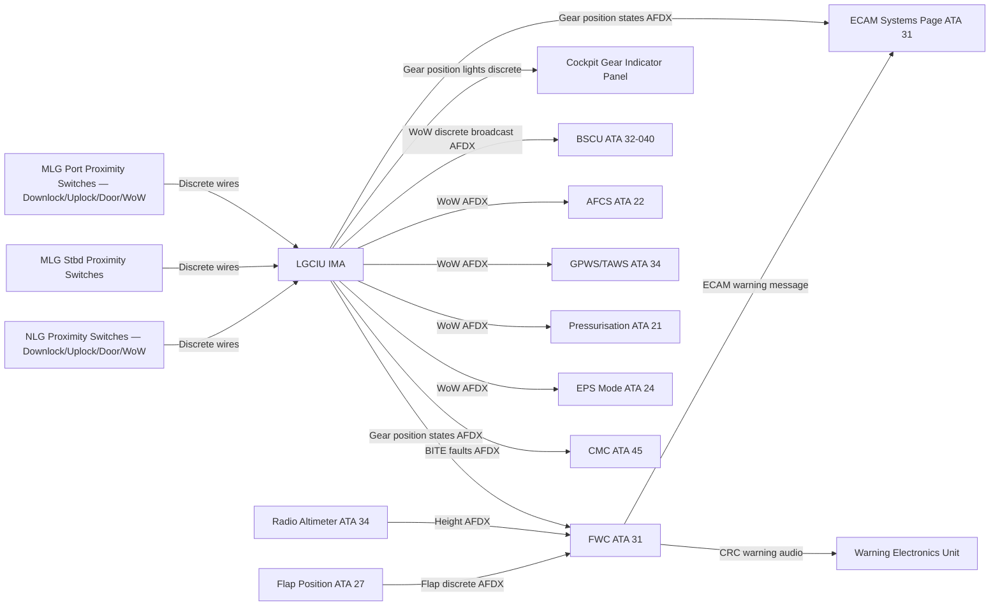
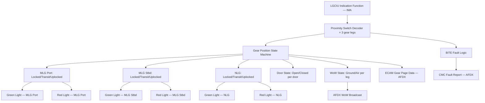

# 032-060 — Position Indication and Warning
### AMPEL360e eWTW · ATA 32 · Q+ATLANTIDE ATLAS Scaffold

---

## §0 Hyperlink Policy

All internal links use relative paths. External regulatory references use anchors in [§20 References](#20-references). Links marked **TBD** indicate targets not yet allocated. Programme-level links use five directory levels (`../../../../../`). No absolute URLs are used for internal navigation.

---

## §1 Purpose

This document describes the Landing Gear Position Indication and Warning system of the AMPEL360e eWTW. The system provides the flight crew with accurate, unambiguous information about the position of each landing gear and its associated doors, and generates appropriate alerts when the landing gear is not in the correct position for the phase of flight.

On eWTW, gear position indication is driven by the LGCIU (IMA-hosted), which processes proximity switch signals from all gear legs and gear bay doors. Position data is output by the LGCIU to the IMA, ECAM, and Flight Warning Computer (FWC) via AFDX. The cockpit gear indicator panel displays the gear handle position and three gear-position lights (one per gear leg: green = down and locked, red = in transit or unsafe, blank = up and locked). An ECAM gear synoptic page provides a graphical representation of each gear leg and door position.

The FWC generates a "GEAR NOT DOWN" aural warning at low altitude (based on radio altimeter input and flap position logic) if any gear is not in the down-and-locked state. The GPWS/TAWS system (ATA 34) uses the WoW discrete from the LGCIU as an input to its ground proximity alerting logic. This document covers the indication and warning elements; proximity switch hardware is covered by 032-010, 032-020, and 032-030.

---

## §2 Applicability

| Attribute | Value |
|---|---|
| Programme | AMPEL360e Wide Tube-and-Wing (eWTW) |
| ATA Subsubject | 032-060 — Position Indication and Warning |
| Aircraft Variant | eWTW-100 (baseline), eWTW-100ER |
| Gear Legs Monitored | 3 (Port MLG, Stbd MLG, NLG) |
| Position States per Leg | Down-and-Locked (green); In-Transit (red); Up-and-Locked (blank) |
| Door Position States | Open; Closed (per door, monitored by LGCIU) |
| Warning Logic | FWC — gear not down at low altitude; GPWS WoW input |
| Controller | LGCIU — IMA-hosted |
| Certification Basis | CS-25.729(d), CS-25.1303, CS-25.1322 |
| SNS Reference | 032-60 |
| Effectivity | From MSN 001 |

---

## §3 System / Function Overview

The position indication system processes signals from proximity switches on each gear leg and gear bay doors. For each gear leg, the proximity switch suite includes: (1) Downlock switch — confirms gear in fully extended and locked position; (2) Uplock switch — confirms gear in fully retracted and locked position; (3) Gear-in-transit inferred state — any condition where neither uplock nor downlock switch is active; (4) Door-open switch; (5) Door-closed switch; and (6) WoW switch (primary and redundant) — confirms weight on wheels. All switch signals are received by the LGCIU, which applies logic to determine the current gear position state.

**Cockpit indication**:
- Gear position indicator panel (on main instrument panel or glareshield — location TBD): three indicator lights (one per gear leg). Each light has three states: GREEN (down and locked), RED (in transit or unsafe configuration), BLANK (up and locked, normal cruise state). The gear handle illuminates when the handle position disagrees with the gear position state.
- ECAM landing gear synoptic page: graphical schematic showing each gear leg with position status, door open/closed status, WoW state, and TPIS pressure for each wheel.

**Aural and visual warnings**:
- "GEAR NOT DOWN" continuous repetitive chime (CRC) generated by FWC when: aircraft below 750 ft radio altitude (TBD) AND flap in landing configuration AND any gear not down-and-locked. Alert classified as WARNING (red).
- "GEAR NOT LOCKED" generated by FWC when gear handle is DOWN but any gear has not reached downlock within the timeout period (sequence fault). Alert classified as WARNING (red).
- ECAM caution for WoW switch disagreement between primary and redundant sensors.

---

## §4 Scope

### 4.1 Included
- LGCIU proximity switch signal processing (downlock, uplock, door-open, door-closed for all 3 gear legs)
- WoW signal processing and cross-checking (primary and redundant per leg)
- Cockpit gear position indicator panel (three lights per gear handle — GREEN/RED/BLANK logic)
- ECAM landing gear synoptic page data provision from LGCIU via AFDX
- FWC "GEAR NOT DOWN" warning logic interface (radio altimeter, flap position, gear position)
- FWC "GEAR NOT LOCKED" warning logic (extension sequence timeout fault)
- WoW discrete output to all other aircraft systems (GPWS, AFCS, BSCU, FWC, ATA 21, ATA 22, ATA 24)
- LGCIU BITE indication for proximity switch faults

### 4.2 Excluded
- Proximity switch hardware — covered by 032-010, 032-020
- LGCIU sequencing logic — covered by 032-030
- GPWS/TAWS system — covered by ATA 34
- Radio altimeter — covered by ATA 34
- Flap position sensing — covered by ATA 27
- ECAM display unit hardware — covered by ATA 31

---

## §5 Architecture Description

- **LGCIU as indication processor**: All proximity switch signals are wired to the LGCIU (IMA module). The LGCIU applies a state machine to determine gear position (down-locked / in-transit / up-locked) and door position (open / closed) for each gear leg.
- **AFDX data output**: LGCIU broadcasts gear position state, door state, WoW state, and any proximity switch fault flags on AFDX. All subscribing systems (ECAM, FWC, GPWS via ATA 34, BSCU, AFCS via ATA 22, ATA 21 pressurisation) receive this data via standard AFDX subscription.
- **Cockpit gear light panel**: Discrete outputs from LGCIU (or directly driven from IMA via discrete output module) drive the three gear position lights. Red light: driven when gear is not up-locked AND not down-locked (in transit, or unsafe). Green light: driven when all proximity switches confirm down-and-locked. Blank: normal condition when gear is up and locked.
- **FWC warning logic**: The FWC (IMA-hosted, ATA 31) receives gear position from LGCIU via AFDX, radio altimeter from ADIRU/ATA 34, and flap position from ATA 27. The FWC executes the gear warning inhibition logic (e.g., warning inhibited during touch-and-go below 200 ft after first touchdown — logic TBD per FWC design standard).
- **WoW broadcast**: WoW discrete (all three legs independently) is broadcast by LGCIU on AFDX. Multiple systems use this discrete to transition between ground and air modes. Loss of WoW from any one leg is handled by majority-vote logic in each receiving system (typically 2-out-of-3 or any-WoW-active).

---

## §6 Functional Breakdown

| Function ID | Function Title | Description | Applicable Subsystem |
|---|---|---|---|
| F-060-001 | Proximity Switch Signal Processing | LGCIU decodes all downlock, uplock, door, and WoW proximity switch signals for 3 gear legs | 032-060 |
| F-060-002 | Gear Position State Determination | LGCIU state machine determines down-locked / in-transit / up-locked per leg from switch combination | 032-060 |
| F-060-003 | WoW Signal Broadcast | LGCIU broadcasts WoW state (all 3 legs, primary and redundant) on AFDX to all subscribing systems | 032-060 |
| F-060-004 | Cockpit Gear Position Lights | LGCIU drives GREEN/RED/BLANK indicator lights per gear leg based on position state | 032-060 |
| F-060-005 | ECAM Gear Synoptic Data | LGCIU outputs gear position, door position, WoW, and TPIS data for ECAM landing gear page | 032-060 |
| F-060-006 | FWC Gear-Not-Down Warning | FWC evaluates gear position vs radio altimeter vs flap position; generates CRC warning if gear not down at low altitude | 032-060 / ATA 31 |
| F-060-007 | Proximity Switch BITE | LGCIU detects open-circuit, short-circuit, or implausible switch state combinations; logs to CMC | 032-060 |

---

## §7 System Context Diagram



---

## §8 Internal Functional Architecture



---

## §9 Lifecycle Traceability

```mermaid
flowchart LR
    LC02[LC02 Requirements] --> LC03[LC03 Architecture]
    LC03 --> LC05[LC05 Detailed Design]
    LC05 --> LC06[LC06 Verification Planning]
    LC06 --> LC10[LC10 Certification]
    LC10 --> LC11[LC11 Operation]
    LC11 --> LC12[LC12 Maintenance]
    LC12 --> LC13[LC13 Disposal]
    LC02 -->|Gear warning requirements; CS-25.729(d); CS-25.1322| REQ[Indication Requirements]
    LC03 -->|LGCIU indication function; FWC gear warning logic| ARCH[Indication Architecture]
    LC05 -->|LGCIU state machine design; FWC gear warning logic detail| DESIGN[Indication Design]
    LC06 -->|Gear light functional test; FWC gear warning flight test| VPLAN[Indication Verification Plan]
    LC10 -->|CS-25.729(d) and CS-25.1322 compliance evidence| TC[TC Data Indication]
    LC12 -->|AMM 32-60; proximity switch replacement; light check| MAINT[AMM Indication]
```

---

## §10 Interfaces

| Interface ID | System / Chapter | Interface Type | Data / Signal | Direction | Status |
|---|---|---|---|---|---|
| IF-060-001 | ATA 32-010 MLG | Discrete wiring | MLG proximity switch signals (downlock, uplock, door, WoW primary + redundant) | ATA32-010 → ATA32-060 |  |
| IF-060-002 | ATA 32-020 NLG | Discrete wiring | NLG proximity switch signals (downlock, uplock, door, WoW primary + redundant) | ATA32-020 → ATA32-060 |  |
| IF-060-003 | ATA 31 ECAM | AFDX | Gear position, door position, WoW, TPIS for ECAM landing gear page | ATA32-060 → ATA31 |  |
| IF-060-004 | ATA 31 FWC | AFDX | Gear position states for FWC gear-not-down warning logic | ATA32-060 → ATA31 FWC |  |
| IF-060-005 | ATA 34 GPWS/TAWS | AFDX | WoW discrete for GPWS ground proximity alerting | ATA32-060 → ATA34 |  |
| IF-060-006 | ATA 34 Navigation | AFDX | Radio altimeter height input to FWC for gear warning altitude threshold | ATA34 → FWC (not directly ATA32-060) |  |
| IF-060-007 | ATA 22 Auto-Flight | AFDX | WoW for AFCS ground/air mode and autoland inhibit | ATA32-060 → ATA22 |  |
| IF-060-008 | ATA 21 Pressurisation | AFDX | WoW for pressurisation mode scheduling | ATA32-060 → ATA21 |  |
| IF-060-009 | ATA 45 Maintenance | AFDX maintenance bus | Proximity switch BITE faults, WoW disagreement events to CMC | ATA32-060 → ATA45 |  |

---

## §11 Operating Modes

| Mode ID | Mode Name | Description | Entry Condition | Exit Condition |
|---|---|---|---|---|
| OM-060-001 | Ground — All Down Locked | All 3 gear legs show GREEN; WoW active on all legs; ECAM page shows all gear locked | All downlock switches active + WoW | Take-off / gear handle UP |
| OM-060-002 | In-Transit | RED light active for any gear leg; ECAM shows gear moving | Gear handle moved / retraction or extension in progress | All gear reach locked state |
| OM-060-003 | All Up Locked | All gear position lights BLANK; ECAM shows gear retracted | All uplock switches active | Gear handle DOWN / extension |
| OM-060-004 | Asymmetric / Unsafe | Mixed indication — one or more gear not in a locked state while others are | Sequence fault / partial extension | Crew action / maintenance |
| OM-060-005 | Gear Not Down Warning | FWC CRC warning active; ECAM WARNING message; GEAR NOT DOWN displayed | Low altitude + flap landing config + any gear not down-locked | Gear down-locked confirmed / crew action |
| OM-060-006 | WoW Disagreement | Primary and redundant WoW switches disagree on one leg | WoW disagreement detected | Maintenance action |

---

## §12 Monitoring and Diagnostics

The LGCIU BITE function monitors all proximity switch signal lines for: open circuit (switch fails open — no signal), short circuit (switch fails closed — signal always active), and implausible combinations (e.g., both uplock and downlock active simultaneously on the same gear leg). Each fault type is flagged individually in the LGCIU BITE log, transmitted to the CMC, and (for in-flight faults) displayed on the ECAM maintenance page.

WoW switch disagreement (primary vs redundant on any leg) generates an ECAM advisory and is logged with flight phase and cycle number. The CMC maintains a trend record of WoW switch events; a high frequency of WoW disagreements on a specific leg indicates a suspect switch requiring replacement.

Cockpit gear position light power supply is monitored: a filament failure (if traditional incandescent lamps are used) or LED driver fault (if LED lights) is detectable as a loss of feedback from the light circuit and generates a BITE fault (lamp monitoring per CS-25.1322 requirements).

---

## §13 Maintenance Concept

Proximity switch replacement is an LRU task; switches are accessible within the gear bay (MLG) or NLG bay. Post-replacement testing: LGCIU functional test via CMC confirms correct switch operation (WoW test by jacking/lowering aircraft; downlock and uplock confirmed by gear swing test or maintenance partial-cycle test).

Cockpit gear position lights (if discrete light units separate from ECAM): replacement is a line maintenance task accessible from the instrument panel. An in-flight light test is available from the cockpit test panel to confirm lamp/LED function.

ECAM gear synoptic page function is verified during the aircraft power-on built-in test; any LGCIU data absence or ECAM formatting fault is reported in the CMC ground test log.

Scheduled maintenance: WoW switch inspection for corrosion and mechanical security (per AMM zonal inspection schedule); proximity switch calibration check not typically required (switches are binary — open/closed) but target distance to trigger flag should be verified if switch replacement history indicates frequent spurious trips.

---

## §14 S1000D / CSDB Mapping

### 14.1 SNS to DMC Mapping

| SNS Code | Subsubject Title | DMC Prefix | Info Codes Planned | DMRL Status |
|---|---|---|---|---|
| 032-60 | Position Indication and Warning | DMC-AMPEL360E-EWTW-032-60 | 040, 300, 400, 520 |  |

### 14.2 Information Code Definitions

| Info Code | Description | Applicable |
|---|---|---|
| 040 | Description — LGCIU indication function, gear light logic, FWC warning | Yes |
| 300 | Operation — reading gear indications; responding to gear not down warning | Yes |
| 400 | Maintenance — proximity switch test, gear light test | Yes |
| 520 | Troubleshooting — spurious red light, missing green, WoW disagreement | Yes |

---

## §15 Footprints

### 15.1 Physical Footprint
- Gear position indicator panel: instrument panel or glareshield area; 3 light clusters (one per leg); location TBD
- LGCIU: IMA-hosted; no dedicated hardware footprint
- Proximity switches: in gear bay and on gear legs (covered by 032-010 and 032-020)

### 15.2 Electrical / Data Footprint
- Proximity switch wiring: low-current 28 VDC excitation circuits from LGCIU discrete I/O module
- Gear indicator lights: 28 VDC essential bus (to ensure display availability with main avionics off)
- AFDX: LGCIU gear position data output to ECAM, FWC, GPWS, AFCS, and other subscribers

### 15.3 Maintenance Footprint
- Proximity switch replacement: gear bay access; standard tooling
- Gear light replacement: instrument panel access; standard lamp/LED module (if discrete lights used)

### 15.4 Data Footprint
- LGCIU BITE log: proximity switch fault history; WoW disagreement log; minimum 500 entries
- CMC: WoW event count per flight per leg; trending for predictive switch replacement

---

## §16 Safety and Certification Considerations

| Requirement | Source | Description | Compliance Approach | Status |
|---|---|---|---|---|
| CS-25.729(d) | EASA CS-25 | Means to indicate gear position to the pilot | Gear position lights (GREEN/RED/BLANK) and ECAM synoptic; dual indication paths |  |
| CS-25.1322 | EASA CS-25 | Warning, caution and advisory lights — colour coding; alert classification | FWC gear-not-down alert classified as WARNING (red/CRC); ECAM colour coding per CS-25.1322 |  |
| CS-25.1303 | EASA CS-25 | Flight and navigation instruments — WoW signal integrity | WoW dual sensor; LGCIU cross-check; broadcast reliability |  |
| ARP 4102/7 | SAE | EICAS/ECAM alert system design | FWC alert priority and inhibition logic per ARP 4102/7 |  |

---

## §17 Verification and Validation

| V&V ID | Requirement | Method | Success Criterion | Status |
|---|---|---|---|---|
| VV-060-001 | CS-25.729(d) — Gear position indication | Ground functional test + flight test | Correct GREEN/RED/BLANK display for all gear states; ECAM page accurate |  |
| VV-060-002 | CS-25.1322 — Gear not down warning | Flight test at low altitude with gear not extended | CRC warning generated at correct altitude threshold; correct ECAM message |  |
| VV-060-003 | WoW broadcast integrity | Ground integration test — all WoW-dependent systems tested | WoW signal received correctly by all subscribing systems; mode transitions correct |  |
| VV-060-004 | LGCIU BITE proximity switch | Ground test — fault injection | Open-circuit and short-circuit faults on each switch detected and correctly reported to CMC |  |
| VV-060-005 | WoW disagreement detection | Ground test — disable one WoW switch | ECAM advisory generated; CMC fault logged |  |

---

## §18 Glossary

| Term | Definition |
|---|---|
| CRC | Continuous Repetitive Chime — aural warning signal repeating continuously until the triggering condition is resolved |
| Downlock switch | Proximity sensor confirming gear is in the fully extended and mechanically locked position |
| ECAM | Electronic Centralised Aircraft Monitor — the aircraft systems monitoring and alerting display system |
| FWC | Flight Warning Computer — IMA-hosted function generating crew alerts based on flight parameter monitoring |
| GPWS | Ground Proximity Warning System — system providing terrain awareness and approach alerts; uses WoW and radio altimeter inputs |
| In-transit | Gear position state when neither uplock nor downlock switches are active; gear is moving between locked positions |
| LGCIU | Landing Gear Control and Interface Unit — IMA-hosted sequence controller and position indication processor |
| Proximity switch | Non-contact sensor detecting metallic target; used for all gear/door position confirmation |
| Uplock switch | Proximity sensor confirming gear is in the fully retracted and mechanically held position |
| WoW | Weight on Wheels — proximity switch indicating gear compression; primary ground/air mode discriminator for many aircraft systems |

---

## §19 Citations

| Citation ID | Reference | Description | Relevance |
|---|---|---|---|
| CIT-060-001 | EASA CS-25.729(d) | Means of gear position indication | Primary indication requirement |
| CIT-060-002 | EASA CS-25.1322 | Warning, caution and advisory lights | Alert colour coding and classification |
| CIT-060-003 | SAE ARP 4102/7 | EICAS/ECAM design guidelines | Alert priority and inhibition design |

---

## §20 References

| Ref ID | Title | Document | Link |
|---|---|---|---|
| REF-060-001 | ATA 32 General | 032-000 | [./032-000-Landing-Gear-General.md](./032-000-Landing-Gear-General.md) |
| REF-060-002 | Extension and Retraction | 032-030 | [./032-030-Extension-and-Retraction.md](./032-030-Extension-and-Retraction.md) |
| REF-060-003 | Monitoring Diagnostics | 032-080 | [./032-080-Landing-Gear-Monitoring-Diagnostics-and-Control-Interfaces.md](./032-080-Landing-Gear-Monitoring-Diagnostics-and-Control-Interfaces.md) |
| REF-060-004 | EASA CS-25 | Certification Specifications | [https://www.easa.europa.eu](https://www.easa.europa.eu) |

---

## §21 Open Issues

| Issue ID | Description | Owner | Priority | Target Resolution | Status |
|---|---|---|---|---|---|
| OI-060-001 | Gear warning altitude threshold (750 ft radio altitude TBD) — exact value to be confirmed during FWC design and flight test | Systems / FWC | Medium | TBD |  |
| OI-060-002 | Gear indicator panel type (discrete lights vs ECAM-only) not decided; cockpit layout not frozen | Human Factors | Medium | TBD |  |
| OI-060-003 | WoW majority-vote logic for 2-of-3 vs any-active not formally defined; needs FHA and system design | Safety / Systems | High | TBD |  |
| OI-060-004 | FWC gear warning inhibition logic (touch-and-go, low altitude manoeuvre) not yet detailed | FWC / Systems | Medium | TBD |  |

---

## §22 Change Log

| Revision | Date | Author | Description |
|---|---|---|---|
| 0.1.0 | 2026-05-09 | Q+ATLANTIDE Authoring | Initial scaffold — all sections to template standard; data TBD |
