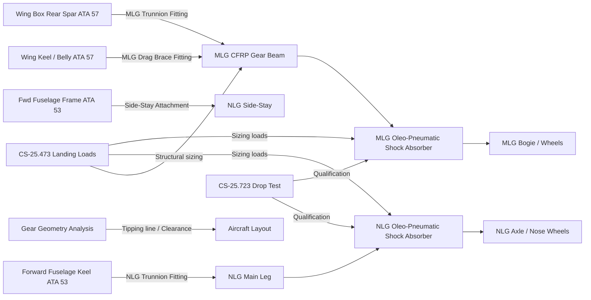
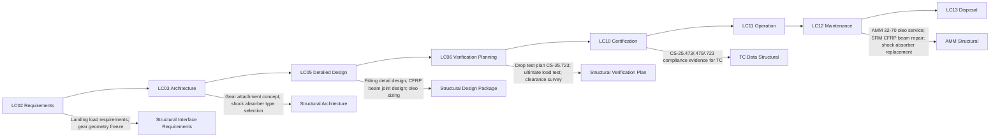

# 032-070 — Shock Absorption and Structural Interfaces
### [PROGRAMME-AIRCRAFT] [PROGRAMME-VARIANT] · ATA 32 · Q+ATLANTIDE ATLAS Scaffold

---

## §0 Hyperlink Policy

All internal links use relative paths. External regulatory references use anchors in [§20 References](#20-references). Links marked **TBD** indicate targets not yet allocated. Programme-level links use five directory levels (`../../../../../`). No absolute URLs are used for internal navigation.

---

## §1 Purpose

This document defines the agnostic ATLAS standard-level architecture context for `032-070 — Shock Absorption and Structural Interfaces`.

It describes the controlled scope, functions, interfaces, safety considerations, lifecycle traceability, and S1000D/CSDB mapping logic that programme implementations shall instantiate when this node is applicable.

This document is not a programme design baseline. Programme-specific capacities, locations, part numbers, effectivity, operating limits, maintenance references, and data module codes shall be defined only inside the applicable programme implementation branch.
## §2 Applicability

| Applicability Level | Rule |
|---|---|
| Standard taxonomy | Applies to the ATLAS node `<NODE>` |
| Programme implementation | Conditional; determined by programme architecture, trade studies, certification basis, and applicability model |
| Product configuration | Defined in the programme-specific configuration baseline |
| Effectivity | Defined in the programme CSDB / applicability layer |
| Non-applicability | Must be explicitly stated in the programme impact-study branch when excluded |
## §3 System / Function Overview

**Shock Absorbers**: Each MLG and the NLG is equipped with an oleo-pneumatic shock absorber. The absorber consists of an outer cylinder (structural member, fixed to the gear beam/leg) and an inner cylinder (translating member, carrying the axle and wheels). The gas (nitrogen) is separated from the hydraulic fluid (MIL-PRF-5606 or equivalent — TBD) by a floating piston or metered orifice. During compression (landing impact), hydraulic fluid is forced through a metered orifice from the inner to the outer cylinder, dissipating energy as heat. The nitrogen gas acts as a spring, absorbing elastic energy. The shock absorber stroke and nitrogen charge pressure are sized per CS-25.473 landing load requirements and CS-25.479 level landing conditions.

A Magnetorheological (MR) fluid option for active shock load control is under feasibility study (TBD). In the baseline design, conventional passive oleo-pneumatic shock absorbers are assumed.

**Structural Interfaces — MLG**: The primary MLG load path is via the CFRP gear beam trunnion pivot to the wing-box rear spar. The trunnion pivot transfers the MLG vertical reaction, drag reaction, and side reaction into the wing box structure. A secondary drag brace transfers fore-aft loads. All fitting designs are TBD pending detailed structural analysis. The gear bay structure incorporates: uplock hook mounting brackets, door hinge fittings (for inboard and outboard doors), door actuator mounting provisions, and proximity switch brackets. The gear bay is unpressurised.

**Structural Interfaces — NLG**: The NLG attaches to the forward fuselage keel beam via a trunnion pivot. A side-stay strut connects the upper NLG leg to a fuselage frame attachment fitting, providing lateral load restraint and serving as the downlock mechanism. All fitting designs TBD. The NLG bay is in the unpressurised nose section.

**Gear Geometry and Clearance**: The gear geometry (wheel track, wheelbase, tipping line, ground clearance, tail strike angle) is critical for CS-25 compliance and operational usability. Ground clearance analysis confirms no propeller/engine ground contact during maximum brake application or maximum structural deflection on the worst-case runway camber (CS-25.925). The tipping line (line between the outermost ground contact points of all gear) must enclose the aircraft CG within the stable polygon under all loading conditions.

---

## §4 Scope

### 4.1 Included
- MLG oleo-pneumatic shock absorber design and sizing (outer cylinder, inner cylinder, floating piston, orifice, nitrogen charge)
- NLG oleo-pneumatic shock absorber design and sizing
- MLG structural attachment fittings (trunnion pivot at wing-box rear spar, drag brace at keel beam)
- NLG structural attachment fittings (trunnion pivot at forward fuselage keel, side-stay strut attachment)
- Gear bay structural provisions (uplock hook mounts, door hinge fittings, door actuator brackets, proximity switch brackets)
- Gear geometry analysis (wheel track, wheelbase, tipping line, ground clearance, tail strike angle)
- CS-25.473 and CS-25.479 landing load analysis
- CS-25.723 drop test compliance
- Clearance analysis per CS-25.925 and taxiway/runway geometry
- CFRP MLG beam composite-metallic interface (bolted joint design TBD)

### 4.2 Excluded
- MLG and NLG assembly components other than shock absorbers and structural fittings — covered by 032-010 and 032-020
- EMA actuators and controls — covered by 032-010, 032-020, 032-030
- Wing box and fuselage structural design (far from gear attachment) — covered by ATA 57 and ATA 53
- Shock absorber servicing procedures (covered in §13 Maintenance Concept of this document and in AMM 32-70)

---

## §5 Architecture Description

- **Passive oleo-pneumatic baseline**: Conventional oleo-pneumatic shock absorbers for both MLG and NLG; passive, no active control. MR fluid option deferred to later programme phase.
- **Two-chamber oleo**: Outer cylinder contains both the nitrogen gas chamber and the hydraulic fluid return space; separated by metered orifice plate; inner cylinder slides in outer; no separate accumulator required.
- **Nitrogen charge pressure**: Initial nitrogen charge set to support the aircraft at static ground weight on each gear. Charge pressure is serviceable at line maintenance. Pressure drop over time requires periodic servicing.
- **CFRP-to-metallic fitting interface**: The CFRP gear beam attaches to metallic (titanium or steel) trunnion fittings via bolted joints with load-spreader plates to manage bearing loads in the CFRP. Joint design must address galvanic compatibility (CFRP/metallic) and fatigue/damage tolerance.
- **Over-centre downlock (NLG side-stay)**: The NLG side-stay uses an over-centre mechanism at its mid-point to lock in the extended position. The over-centre angle and locking force must be sized to maintain positive lock under the design ground loads.
- **Gear geometry freeze**: The wheel track, wheelbase, and all geometry parameters are frozen at aircraft layout level; changes after freeze require re-assessment of tipping line, brake steering geometry, and ACN/PCN compliance.
- **Ground clearance margins**: Clearances between lowest aircraft point (CFRP gear beam, bogie, or engine nacelle) and ground must be demonstrated for all load/attitude combinations per CS-25. Clearance margins are TBD pending final aircraft geometry.

---

## §6 Functional Breakdown

| Function ID | Function Title | Description | Applicable Subsystem |
|---|---|---|---|
| F-070-001 | MLG Shock Absorption | Absorb and dissipate MLG landing energy via oleo-pneumatic shock absorber; limit load transferred to airframe | 032-070 |
| F-070-002 | NLG Shock Absorption | Absorb and dissipate NLG landing/taxi loads; limit nose-wheel load to design values | 032-070 |
| F-070-003 | MLG Structural Load Transfer | Transfer MLG vertical, drag, and side loads to wing-box rear spar and keel beam via fittings | 032-070 |
| F-070-004 | NLG Structural Load Transfer | Transfer NLG vertical and steering loads to forward fuselage keel via trunnion and side-stay fittings | 032-070 |
| F-070-005 | Gear Bay Structural Provisions | Provide mounting structure for uplock hooks, door hinges, door actuators, proximity switches in each gear bay | 032-070 |
| F-070-006 | Gear Geometry Compliance | Define wheel track, wheelbase, tipping line; confirm CS-25 ground clearance and tipping stability | 032-070 |
| F-070-007 | Drop Test Compliance | Size shock absorbers to absorb limit sink rate energy per CS-25.723; validate by drop test | 032-070 |

---

## §7 System Context Diagram

---

## §8 Internal Functional Architecture

```mermaid
flowchart TB
    MLG_OLEO[MLG Oleo-Pneumatic Shock Absorber] --> OUTER_CYL[Outer Cylinder — fixed to CFRP beam]
    MLG_OLEO --> INNER_CYL[Inner Cylinder — carries bogie]
    MLG_OLEO --> ORIFICE[Metered Orifice Plate — energy dissipation]
    MLG_OLEO --> N2GAS[Nitrogen Gas Chamber — spring element]
    MLG_OLEO --> FLUID[Hydraulic Fluid — incompressible medium]
    MLG_OLEO --> FLOATPISTON[Floating Piston — gas/fluid separator]
    MLG_OLEO --> SERVVALVE[Service Valve — nitrogen pressure port]
    MLGBEAM_STR[CFRP Gear Beam Structure] --> TRUNNION_FIT[Trunnion Pivot Fitting — metallic]
    TRUNNION_FIT --> WING_SPAR[Wing-Box Rear Spar Interface]
    MLGBEAM_STR --> DRAG_FIT[Drag Brace Fitting — metallic]
    DRAG_FIT --> KEEL_FIT[Keel Beam Interface]
    GEARBAY[Gear Bay Structure] --> UPLOCKMT[Uplock Hook Mount]
    GEARBAY --> DOORHINGE[Door Hinge Fittings]
    GEARBAY --> DOOREAMMA[Door EMA Mount Brackets]
    GEARBAY --> PROXBKT[Proximity Switch Brackets]
```

---

## §9 Lifecycle Traceability

---

## §10 Interfaces

| Interface ID | System / Chapter | Interface Type | Data / Signal | Direction | Status |
|---|---|---|---|---|---|
| IF-070-001 | ATA 57 Wings | Physical / structural | MLG trunnion pivot fitting at wing-box rear spar; drag brace fitting at keel | Structural load transfer |  |
| IF-070-002 | ATA 53 Fuselage | Physical / structural | NLG trunnion pivot and side-stay attachment at forward fuselage keel and frames | Structural load transfer |  |
| IF-070-003 | ATA 32-010 MLG | Physical | MLG CFRP beam receives loads from shock absorber inner/outer cylinder; transmits to fittings | Internal ATA 32 structural path |  |
| IF-070-004 | ATA 32-020 NLG | Physical | NLG main leg receives loads from shock absorber; transmits to fittings | Internal ATA 32 structural path |  |
| IF-070-005 | Aircraft Loads Model | Analysis | CS-25.473 and CS-25.479 load cases input to structural analysis and shock absorber sizing | Analysis interface |  |
| IF-070-006 | ATA 32-030 Bay Structure | Physical | Gear bay structural provisions accommodate EMA mounts, door hinges, uplock hooks | Physical coordination interface |  |

---

## §11 Operating Modes

| Mode ID | Mode Name | Description | Entry Condition | Exit Condition |
|---|---|---|---|---|
| OM-070-001 | Static Ground — Fully Extended | Shock absorber at static equilibrium extension; nitrogen pressure balanced with aircraft weight | Aircraft stationary on ground | Taxi / landing dynamic |
| OM-070-002 | Taxi Loading | Shock absorber cycling under dynamic taxi loads (runway roughness); within fatigue load spectrum | Aircraft taxiing | Stationary or airborne |
| OM-070-003 | Landing Impact — Compression | Shock absorber rapidly compresses at touchdown; kinetic energy converted to heat and elastic spring energy | Touchdown with sink rate ≤ limit | Rebound phase |
| OM-070-004 | Landing Impact — Rebound | Shock absorber extends after impact; rebound damping prevents gear bounce | After compression | Return to static equilibrium |
| OM-070-005 | Air Extension — In-Flight | Shock absorber fully extended (inner cylinder at maximum travel) due to absence of weight; gear down | Gear extended in flight | Touchdown |
| OM-070-006 | Shock Absorber Servicing | Nitrogen pressure checked or recharged; fluid level checked; via ground service access | Maintenance action | Return to service |

---

## §12 Monitoring and Diagnostics

Shock absorbers are passive mechanical devices with no embedded sensors in the baseline design. Condition is assessed by: (1) visual inspection for fluid leaks (seepage around the outer/inner cylinder interface seal); (2) nitrogen pressure check via the service valve (minimum pressure per AMM; below minimum requires recharging); (3) shock absorber extension measurement (static extension check per AMM — confirms fluid and gas charge are correct); (4) drop test correlation data from qualification testing (used to confirm absorber performance has not degraded).

If an active health monitoring option is fitted (shock absorber load cell or stroke sensor — TBD), data would be transmitted to the CMC via a dedicated sensor interface. In the baseline design, no embedded sensor is assumed.

In the event of a shock absorber fluid leak, the leakage is visible on the gear leg and gear bay structure. An AMM servicing task defines the acceptable leakage rate and the action limit requiring shock absorber replacement.

---

## §13 Maintenance Concept

Shock absorber line maintenance tasks: nitrogen pressure check (every N flights or calendar period TBD by MRB); static extension check (every N flights TBD); visual inspection for leaks (at every walk-around check). Shock absorber servicing (nitrogen recharge or fluid replenishment) is performed via the service valve using standard ground support equipment (nitrogen servicing trolley per AMM).

Shock absorber replacement is a base maintenance task requiring aircraft jacking (for MLG shock absorber) or gear disassembly (NLG shock absorber). Replacement is an LRU swap of the complete shock absorber assembly. A functional check and drop test correlation measurement (static extension) is required before return to service.

CFRP gear beam (MLG) structural inspections: visual inspection for impact damage and disbond at each heavy maintenance input; ultrasonic C-scan or thermographic inspection per NDT programme (interval TBD by damage tolerance analysis). Any impact damage exceeding the allowable defined in the SRM requires engineering disposition.

Metallic fittings (trunnion pivot, drag brace): standard metallic NDT (dye penetrant or magnetic particle) at defined heavy maintenance intervals per AMM.

---

## §14 S1000D / CSDB Mapping

### 14.1 SNS to DMC Mapping

| SNS Code | Subsubject Title | DMC Prefix | Info Codes Planned | DMRL Status |
|---|---|---|---|---|
| 032-70 | Shock Absorption and Structural Interfaces | DMC-<PROGRAMME>-<VARIANT>-032-70 | 040, 300, 400, 520, 720 |  |

### 14.2 Information Code Definitions

| Info Code | Description | Applicable |
|---|---|---|
| 040 | Description — shock absorber design, structural fittings, gear geometry | Yes |
| 300 | Operation — normal landing; hard landing; tail-down landing procedures | Yes |
| 400 | Maintenance — shock absorber service, nitrogen check, NDT inspection | Yes |
| 520 | Troubleshooting — fluid leak, low nitrogen pressure, extended shock absorber | Yes |
| 720 | Removal / installation — shock absorber replacement; fitting replacement | Yes |

---

## §15 Footprints

### 15.1 Physical Footprint
- MLG shock absorber: integral to gear bay (outer cylinder fixed to CFRP beam); stroke TBD per load analysis; typical class 380–430 mm stroke for medium aircraft
- NLG shock absorber: integral to NLG leg; shorter stroke than MLG (NLG lighter load); stroke TBD
- Structural fittings: concentrated at trunnion pivot points; detailed footprint TBD per structural analysis

### 15.2 Electrical / Data Footprint
- Baseline: no electrical components in shock absorbers (passive)
- Option: shock absorber sensors (TBD) — small wiring harness to CMC

### 15.3 Maintenance Footprint
- Nitrogen service: standard nitrogen servicing trolley; access via service valve on shock absorber
- Fluid service: service port on outer cylinder; access via gear bay
- NDT inspection: C-scan or thermographic equipment for CFRP beam; dye penetrant for metallic fittings

### 15.4 Data Footprint
- No embedded data in baseline shock absorbers
- If optional sensors fitted: shock absorber stroke trend in CMC (TBD)

---

## §16 Safety and Certification Considerations

| Requirement | Source | Description | Compliance Approach | Status |
|---|---|---|---|---|
| CS-25.473 | EASA CS-25 | Landing load conditions — design MLW and sink rate combinations | Load analysis; structural sizing; FEA |  |
| CS-25.479 | EASA CS-25 | Level landing — symmetric and asymmetric; span load distributions | Load spectrum analysis; FEA |  |
| CS-25.481 | EASA CS-25 | Tail-down landing — loads on MLG at tail-low attitude | FEA for tail-down load case |  |
| CS-25.723 | EASA CS-25 | Shock absorber drop test — at limit sink rate, MLW | Full-scale drop test campaign (MLG and NLG) |  |
| CS-25.925 | EASA CS-25 | Ground clearance — propeller/engine nacelle; extremities | Ground clearance analysis; runway camber and deflection survey |  |
| Tipping stability | CS-25 static stability | CG within tipping polygon for all operational conditions | Tipping line analysis for all CG / fuel load combinations |  |
| AC 20-107B | FAA AC | Composite structures — CFRP gear beam damage tolerance | Damage tolerance analysis; NDT programme |  |

---

## §17 Verification and Validation

| V&V ID | Requirement | Method | Success Criterion | Status |
|---|---|---|---|---|
| VV-070-001 | CS-25.723 — MLG drop test | Full-scale MLG drop test at MTOW and MLW, limit sink rate (≥3.05 m/s), 0° and tail-down attitude | No structural failure; stroke within design limits; upward load at axle within limits |  |
| VV-070-002 | CS-25.723 — NLG drop test | Full-scale NLG drop test at limit sink rate and nose-down attitude | No structural failure; stroke within design limits |  |
| VV-070-003 | CS-25.473 / .479 — Structural loads | FEA analysis + proof load test at 1.5× limit load (ultimate) | No permanent deformation; no failure; FEA correlation with test data |  |
| VV-070-004 | CS-25.925 — Ground clearance | Ground clearance survey (jacks, rulers, laser measurement) + analysis | Minimum clearance above certified limit at all CG and deflection conditions |  |
| VV-070-005 | Tipping line | Analysis for all CG, payload, and fuel combinations | CG remains within stable polygon; no tip-over risk |  |
| VV-070-006 | CFRP damage tolerance | Representative CFRP coupon fatigue and damage tolerance tests | Damage tolerance life consistent with DSG at required inspection intervals |  |

---

## §18 Glossary

| Term | Definition |
|---|---|
| ACN/PCN | Aircraft Classification Number / Pavement Classification Number — undercarriage load vs pavement capacity assessment |
| Bogie pitch | Rotation of the bogie beam about the bogie pin in the shock absorber inner cylinder; allows both wheels to contact the ground on uneven runways |
| CFRP | Carbon Fibre Reinforced Polymer — composite material used for MLG gear beam |
| Drop test | Full-scale test simulating a landing at limit sink rate; required by CS-25.723 for certification |
| Ground clearance | Minimum distance between the lowest point of the aircraft structure and the ground in the worst-case combination of loading, attitude, and runway camber |
| Limit sink rate | Maximum descent rate at touchdown for which the aircraft structure is designed; per CS-25.473 |
| MLW | Maximum Landing Weight — the maximum certified weight at which the aircraft can be landed |
| MR fluid | Magnetorheological fluid — a smart fluid whose viscosity changes with applied magnetic field; potentially used for active shock absorption (TBD) |
| Oleo-pneumatic | Shock absorber using compressed nitrogen gas and hydraulic fluid for energy absorption |
| Over-centre | Geometric locking mechanism where the load-line passes beyond the pivot centre; provides positive mechanical lock against reversal without active holding force |
| SRM | Structural Repair Manual — document defining approved repair procedures for damaged aircraft structure |
| Tipping line | Line connecting the outermost ground contact points of the landing gear; aircraft must remain stable with CG inside this polygon for all operational conditions |
| Wheel track | Distance between the centrelines of port and starboard MLG wheel contact patches; affects lateral stability and pavement loading |
| Wheelbase | Distance between the centrelines of MLG and NLG wheel contact patches; affects steering geometry and tipping |

---

## §19 Citations

| Citation ID | Reference | Description | Relevance |
|---|---|---|---|
| CIT-070-001 | EASA CS-25.473 | Landing load conditions | Primary structural sizing requirement |
| CIT-070-002 | EASA CS-25.479 | Level landing | MLG load case |
| CIT-070-003 | EASA CS-25.481 | Tail-down landing | MLG load case |
| CIT-070-004 | EASA CS-25.723 | Shock absorber tests | Drop test requirement |
| CIT-070-005 | EASA CS-25.925 | Ground clearance | Clearance requirement |
| CIT-070-006 | FAA AC 20-107B | Composite Aircraft Structures | CFRP gear beam certification |
| CIT-070-007 | SAE AS1194 | Landing Gear Design Guidelines | Shock absorber design reference |

---

## §20 References

| Ref ID | Title | Document | Link |
|---|---|---|---|
| REF-070-001 | ATA 32 General | 032-000 | [./032-000-Landing-Gear-General.md](./032-000-Landing-Gear-General.md) |
| REF-070-002 | Main Landing Gear | 032-010 | [./032-010-Main-Landing-Gear.md](./032-010-Main-Landing-Gear.md) |
| REF-070-003 | Nose Landing Gear | 032-020 | [./032-020-Nose-Landing-Gear.md](./032-020-Nose-Landing-Gear.md) |
| REF-070-004 | EASA CS-25 | Certification Specifications | [https://www.easa.europa.eu](https://www.easa.europa.eu) |

---

## §21 Open Issues

| Issue ID | Description | Owner | Priority | Target Resolution | Status |
|---|---|---|---|---|---|
| OI-070-001 | CFRP gear beam preliminary design not started; structural sizing TBD | Structures | High | TBD |  |
| OI-070-002 | MLG and NLG structural attachment fitting detail design TBD; requires gear geometry freeze | Structures | High | TBD |  |
| OI-070-003 | Gear geometry (wheel track, wheelbase) not frozen at aircraft layout level | Systems / Aero | High | TBD |  |
| OI-070-004 | MR fluid shock absorber option feasibility study not completed | Systems | Low | TBD |  |
| OI-070-005 | Ground clearance analysis cannot proceed until gear geometry and aircraft layout are frozen | Structures / Aero | Medium | TBD |  |
| OI-070-006 | Shock absorber fluid specification (MIL-PRF-5606 or alternative) not confirmed | Systems | Low | TBD |  |

---

## §22 Change Log

| Revision | Date | Author | Description |
|---|---|---|---|
| 0.1.0 | 2026-05-09 | Q+ATLANTIDE Authoring | Initial scaffold — all sections to template standard; data TBD |
