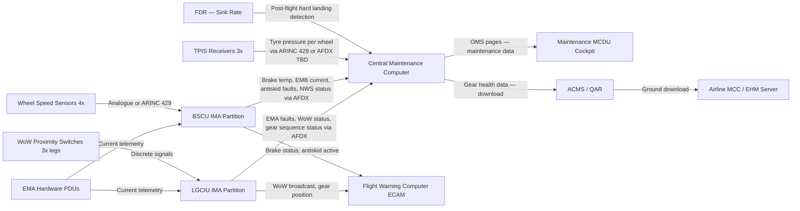
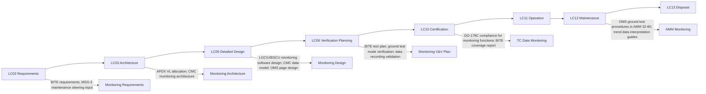

# 032-080 — Landing Gear Monitoring, Diagnostics, and Control Interfaces
### [PROGRAMME-AIRCRAFT] [PROGRAMME-VARIANT] · ATA 32 · Q+ATLANTIDE ATLAS Scaffold

---

## §0 Hyperlink Policy

All internal links use relative paths. External regulatory references use anchors in [§20 References](#20-references). Links marked **TBD** indicate targets not yet allocated. Programme-level links use five directory levels (`../../../../../`). No absolute URLs are used for internal navigation.

---

## §1 Purpose

This document defines the agnostic ATLAS standard-level architecture context for `032-080 — Landing Gear Monitoring, Diagnostics, and Control Interfaces`.

It describes the controlled scope, functions, interfaces, safety considerations, lifecycle traceability, and S1000D/CSDB mapping logic that programme implementations shall instantiate when this node is applicable.

This document is not a programme design baseline. Programme-specific capacities, locations, part numbers, effectivity, operating limits, maintenance references, and data module codes shall be defined only inside the applicable programme implementation branch.
## §2 Applicability

| Applicability Level | Rule |
|---|---|
| Standard taxonomy | Applies to the ATLAS node `<NODE>` |
| Programme implementation | Conditional; determined by programme architecture, trade studies, certification basis, and applicability model |
| Product configuration | Defined in the programme-specific configuration baseline |
| Effectivity | Defined in the programme CSDB / applicability layer |
| Non-applicability | Must be explicitly stated in the programme impact-study branch when excluded |
## §3 System / Function Overview

**LGCIU Monitoring Functions**: The LGCIU monitors the state of all gear sequencing actuators (EMAs — gear retraction/extension, door actuation), proximity switches (position indication per leg), and WoW sensors (weight-on-wheels per leg). For each EMA under LGCIU control, the LGCIU receives: motor drive current (from PDU telemetry), EMA position (from integral LVDT or encoder feedback), and sequence completion signal (from downlock/uplock proximity switch). Abnormal EMA current or failure to reach the commanded position within the timeout window triggers an LGCIU BITE fault. The LGCIU transmits fault data to the CMC over AFDX.

**BSCU Monitoring Functions**: The BSCU monitors the four EMB actuators (one per main wheel), the NWS actuator, and the antiskid/autobrake control loops. For each EMB, the BSCU receives: actuator current, brake application force (via strain gauge — TBD), and brake disc temperature (via thermocouple or wireless sensor — TBD). The brake disc temperature limit is defined per CS-25.735 requirements and the brake qualification test data (Q&T per TSO-C135a or equivalent). Antiskid function monitors wheel speed (from wheel speed sensors) and slip ratio; anomalous slip ratio deviation triggers BITE event.

**CMC / OMS Role**: The CMC collects all landing gear system BITE faults, equipment status words, and performance trend data transmitted by LGCIU and BSCU over AFDX. The CMC aggregates gear cycle count (incremented on each gear up-lock acquisition), EMA torque history (peak current per actuation stored per EMA), brake wear state (total energy absorbed per brake, cumulative since last disc replacement), and TPIS tyre pressure readings. The CMC presents this data to maintenance personnel via the MCDU OMS page (on ground) and uploads to the ACMS data recorder for ground download. The CMC also receives any hard-landing detector exceedance (WoW over-stroke signal from shock absorber sensor — TBD) for post-hard-landing maintenance action triggering.

---

## §4 Scope

### 4.1 Included
- LGCIU monitoring of EMA current, position, sequencing timers, and proximity switch status
- BSCU monitoring of EMB actuator current, brake disc temperature, antiskid slip ratio, autobrake deceleration error
- CMC/OMS: gear cycle count, EMA torque history, brake wear state, TPIS pressure trend, BITE fault log
- Ground test mode (LGCIU commands individual gear sequences at reduced EMA power on ground)
- AFDX (ARINC 664 Part 7) data bus architecture for LGCIU/BSCU to CMC and to ECAM/FWC
- ARINC 429 sensor data buses (if used for individual sensor interfaces — TBD)
- Landing gear system BITE (Level 1 in-flight; Level 2 ground OMS)
- Hard-landing detection and exceedance recording (shock absorber over-stroke — TBD sensor)
- ACMS/QAR data recording of landing gear health parameters

### 4.2 Excluded
- Detailed LGCIU sequencing control logic — covered by 032-030
- Detailed BSCU braking control law — covered by 032-040
- Detailed NWS control law — covered by 032-050
- Gear position indication to the cockpit — covered by 032-060
- TPIS hardware — covered by 032-040 and ATA 12
- Shock absorber health monitoring hardware — covered by 032-070
- AFDX network configuration (VL definitions) — covered by ATA 46 Integrated Avionics

---

## §5 Architecture Description

- **IMA-hosted monitoring software**: LGCIU and BSCU as IMA software partitions transmit health status and BITE fault data over AFDX. No standalone LGCIU/BSCU hardware LRU means no discrete discrete-wire fault reporting; all fault data uses AFDX protocol.
- **Two-level BITE architecture**: Level 1 BITE runs continuously in-flight (LGCIU/BSCU real-time monitoring); Level 2 BITE (OMS ground test) is initiated by maintenance via MCDU — provides extended test coverage including individual EMA commanded/response test and gear cycle simulation on ground.
- **EMA health monitoring via current signature**: Current waveform during EMA operation is a proxy for load (torque) and can detect increasing resistance (bearing wear, ball-screw degradation, seal drag). Long-term torque trend (stored in CMC) enables predictive maintenance scheduling.
- **Brake wear monitoring**: Total energy absorbed per brake disc (Joules, cumulative) is the primary wear indicator for EMB (no conventional wear pin since electromagnetic clamping is adjustable). An energy budget derived from brake qualification testing defines the replacement threshold.
- **Gear cycle count**: Gear cycle count (one increment per gear-up-lock acquisition) is stored in NVM within the LGCIU partition. CMC reads this on each ground connection. Total cycle count drives inspection intervals (see AMM).
- **AFDX as primary data bus**: All LGCIU/BSCU monitoring data published on AFDX Virtual Links to CMC, ECAM/FWC subscribers. AFDX provides deterministic bandwidth and latency guarantees. ARINC 429 retained only if any third-party sensor subsystem (e.g., TPIS receiver) uses legacy bus.
- **Ground test mode security**: Ground test mode (activating gear sequences on ground at reduced EMA power) must be protected by a weight-on-ground interlock (all three WoW signals must confirm ground). Ground test mode is entered only via the OMS test menu; no flight-mode initiation path.
- **Hard landing event recording**: If a shock absorber over-stroke sensor is fitted (TBD), the CMC records the peak stroke value and airframe load proxy for post-hard-landing engineering assessment. Without the sensor, hard landing is detected by exceeding a sink rate threshold via FDR data (post-event analysis).

---

## §6 Functional Breakdown

| Function ID | Function Title | Description | Applicable Subsystem |
|---|---|---|---|
| F-080-001 | LGCIU EMA Health Monitoring | Monitor all LGCIU-controlled EMA current, position, and sequence timing; generate BITE faults on anomaly | 032-080 |
| F-080-002 | LGCIU WoW Monitoring | Cross-check WoW signals from all three gear legs; detect WoW sensor failures | 032-080 |
| F-080-003 | BSCU EMB Health Monitoring | Monitor EMB actuator current, brake disc temperature per wheel; detect overtemperature, actuator failure | 032-080 |
| F-080-004 | BSCU Antiskid Performance Monitoring | Monitor wheel speed sensor health, slip ratio, antiskid control authority; detect sensor or actuator degradation | 032-080 |
| F-080-005 | CMC Gear Cycle Count | Increment and store gear cycle count per gear retraction/extension cycle; export to OMS and ACMS | 032-080 |
| F-080-006 | CMC EMA Torque Trend | Store peak EMA torque proxy (current peak) per gear actuation; display trend in OMS; trigger advisory on trend exceedance | 032-080 |
| F-080-007 | CMC Brake Wear Tracking | Accumulate energy absorbed per brake disc; display brake wear state in OMS; trigger replacement advisory at threshold | 032-080 |
| F-080-008 | TPIS Pressure Trend | Store and trend tyre pressure readings per wheel; alert CMC if pressure below minimum | 032-080 |
| F-080-009 | Ground Test Mode | Allow maintenance personnel to command individual gear and door sequences on ground via OMS MCDU; WoW interlock enforced | 032-080 |
| F-080-010 | Hard Landing Detection | Record shock absorber stroke exceedance (TBD sensor) or FDR sink rate exceedance; trigger post-hard-landing maintenance action | 032-080 |
| F-080-011 | ACMS/QAR Data Recording | Record all landing gear health parameters to ACMS/QAR for airline ground download and analysis | 032-080 |

---

## §7 System Context Diagram

---

## §8 Internal Functional Architecture

```mermaid
flowchart TB
    LGCIU_MON[LGCIU Monitoring Module] --> EMA_MON[EMA Current and Position Monitor]
    LGCIU_MON --> WOW_MON[WoW Cross-Check Monitor]
    LGCIU_MON --> SEQ_TMR[Sequence Timer Monitor — timeout BITE]
    LGCIU_MON --> PROX_MON[Proximity Switch Health Monitor]
    BSCU_MON[BSCU Monitoring Module] --> EMB_MON[EMB Current and Temperature Monitor]
    BSCU_MON --> ANTISKID_MON[Antiskid Slip Ratio Monitor]
    BSCU_MON --> NWS_MON[NWS Actuator Current Monitor]
    BSCU_MON --> WSPD_MON[Wheel Speed Sensor Validity Monitor]
    CMC_GND[CMC Ground Module] --> CYCLECT[Gear Cycle Counter — NVM]
    CMC_GND --> EMATORQ[EMA Torque Trend Storage]
    CMC_GND --> BRKWEAR[Brake Wear Energy Accumulator]
    CMC_GND --> TYREPRES[TPIS Pressure Trend Storage]
    CMC_GND --> HLANDING[Hard Landing Record]
    CMC_GND --> OMSPAGES[OMS MCDU Pages — maintenance display]
    CMC_GND --> ACMEXP[ACMS/QAR Export]
```

---

## §9 Lifecycle Traceability

---

## §10 Interfaces

| Interface ID | System / Chapter | Interface Type | Data / Signal | Direction | Status |
|---|---|---|---|---|---|
| IF-080-001 | ATA 46 IMA / AFDX | Data bus | LGCIU health data, gear sequence faults, WoW status published on AFDX VL | LGCIU → CMC, FWC |  |
| IF-080-002 | ATA 46 IMA / AFDX | Data bus | BSCU health data, brake temperature, antiskid faults published on AFDX VL | BSCU → CMC, FWC |  |
| IF-080-003 | ATA 32-040 TPIS | Data | Tyre pressure per wheel from TPIS receivers; ARINC 429 or AFDX (TBD) | TPIS → CMC |  |
| IF-080-004 | ATA 31 Recording | Data | ACMS/QAR: gear cycle count, EMA torque, brake wear, tyre pressure, hard landing data | CMC → ACMS/QAR |  |
| IF-080-005 | EMA PDUs | Discrete / telemetry | EMA motor drive current telemetry per EMA channel | PDU → LGCIU, BSCU |  |
| IF-080-006 | ATA 22 FMS / MCDU | Display | OMS maintenance pages for gear cycle count, brake wear, EMA torque trend, BITE faults | CMC → Maintenance MCDU |  |
| IF-080-007 | ATA 27 FCS / FWC | Discrete / AFDX | WoW status broadcast from LGCIU to all subscribers; used for inhibit logic in ECAM, EFIS, spoiler, THS | LGCIU → all FWC subscribers |  |
| IF-080-008 | Ground Support Equipment | Physical | Aircraft ground connection for CMC data download to airline MCC server | CMC → GSE downloader |  |

---

## §11 Operating Modes

| Mode ID | Mode Name | Description | Entry Condition | Exit Condition |
|---|---|---|---|---|
| OM-080-001 | In-Flight Monitoring (Level 1 BITE) | LGCIU and BSCU continuous health monitoring during flight; faults recorded to CMC | Gear movement command issued or gear in transit | Gear sequence complete or aircraft stationary |
| OM-080-002 | Normal Ground Operation | Continuous WoW monitoring; gear stationary; TPIS pressure check; brake temperature cooling monitoring | Aircraft on ground, WoW confirmed | Aircraft lifts off |
| OM-080-003 | Ground Test Mode | OMS-initiated; maintenance commands individual gear/door sequences via MCDU at reduced EMA power; WoW interlock active | Maintenance selects ground test mode in OMS; all WoW confirmed ground | Maintenance exits ground test mode; all gear retracted back to ground |
| OM-080-004 | Post-Hard-Landing Mode | CMC records hard landing event; inhibits further gear-up command until engineering inspection complete (TBD policy) | Shock absorber over-stroke signal or FDR sink rate exceedance detected | Engineering authorises continued operation |
| OM-080-005 | Data Download Mode | Airline MCC downloads CMC gear health data via ground connection (ACARS or ground link) | Aircraft on ground; data link connected | Download complete |

---

## §12 Monitoring and Diagnostics

The LGCIU monitoring module performs real-time monitoring of all gear-related EMAs and proximity switches during gear sequences. EMA current waveforms are compared to nominal current envelopes stored in the LGCIU software. An EMA current exceeding the upper envelope (indicating mechanical jam or high load) or failing to reach the lower envelope (indicating electrical failure) within the commanded sequence triggers a Level 1 BITE fault. Sequence timer monitoring detects stalled sequences (EMA fails to move gear from one proximity switch state to the next within timeout).

The BSCU monitoring module continuously monitors brake disc temperature during and after landing rolls. Temperature exceedance above the over-temperature threshold triggers a CMC advisory and may limit autobrake authority in severe cases (TBD control law response). Wheel speed sensor validity is monitored per antiskid channel; a failed wheel speed sensor causes BSCU to inhibit antiskid for the affected wheel and log a BITE fault. Antiskid slip ratio is continuously monitored; if a wheel locks (slip ratio → 1.0) without antiskid intervention, an antiskid performance BITE fault is generated.

BITE coverage analysis (per DO-178C guidance) must demonstrate that the in-flight BITE provides sufficient fault detection probability to support the maintenance interval required by MSG-3 analysis. BITE false alarm rate must be minimised; high false alarm rate drives unscheduled maintenance. BITE design targets and false alarm budget are TBD pending MSG-3 analysis.

---

## §13 Maintenance Concept

Maintenance access to gear monitoring data is via the OMS MCDU (on aircraft) and the ACMS/QAR ground download (ACARS or wired ground connection). The OMS provides: (1) a gear system status page showing current BITE faults; (2) a gear cycle count page per gear; (3) a brake wear state page per brake; (4) an EMA torque trend graph; (5) a tyre pressure trend page; (6) a hard landing event log. All data is timestamped with flight number and MSN.

Scheduled maintenance tasks driven by CMC data include: brake wear inspection/replacement when energy threshold reached; EMA inspection when torque trend triggers advisory; shock absorber nitrogen recharge when pressure below minimum. These tasks are performed at the maintenance base per AMM 32-80 procedures.

Ground test mode allows maintenance engineers to verify gear sequencing after repair without requiring a flight. The ground test mode executes the complete normal extension and retraction sequence at reduced EMA power (to minimise aerodynamic and structural loads with gear exposed on ground). All proximity switch status changes are logged to confirm correct sequence. The ground test mode cannot be exited until all gear is in the extended and locked state (preventing departure with gear retracted after test).

---

## §14 S1000D / CSDB Mapping

### 14.1 SNS to DMC Mapping

| SNS Code | Subsubject Title | DMC Prefix | Info Codes Planned | DMRL Status |
|---|---|---|---|---|
| 032-80 | LG Monitoring, Diagnostics, and Control Interfaces | DMC-<PROGRAMME>-<VARIANT>-032-80 | 040, 300, 400, 520 |  |

### 14.2 Information Code Definitions

| Info Code | Description | Applicable |
|---|---|---|
| 040 | Description — LGCIU/BSCU monitoring architecture; CMC data model; OMS pages | Yes |
| 300 | Operation — accessing OMS monitoring data in flight and on ground | Yes |
| 400 | Maintenance — interpreting CMC data; responding to BITE faults; brake wear check | Yes |
| 520 | Troubleshooting — persistent BITE faults; anomalous EMA torque trend; brake over-temperature | Yes |

---

## §15 Footprints

### 15.1 Physical Footprint
- Monitoring software: IMA-hosted in LGCIU and BSCU partitions — no additional hardware
- CMC: existing aircraft LRU (TBD IMA partition or dedicated CMC hardware)
- OMS: MCDU display existing in cockpit

### 15.2 Electrical / Data Footprint
- AFDX: VLs allocated per LGCIU monitoring data; per BSCU monitoring data; per TPIS (if AFDX-interfaced)
- ARINC 429 (TBD): individual sensor interfaces if required

### 15.3 Maintenance Footprint
- MCDU OMS access: cockpit; no special GSE required for data review
- ACMS/QAR download: standard ground link; airline MCC software required for data interpretation

### 15.4 Data Footprint
- Gear cycle count: NVM in LGCIU partition; backed up to CMC
- EMA torque history: CMC non-volatile storage; size TBD per number of EMAs and storage interval
- Brake wear energy: CMC non-volatile storage
- TPIS pressure trend: CMC non-volatile storage

---

## §16 Safety and Certification Considerations

| Requirement | Source | Description | Compliance Approach | Status |
|---|---|---|---|---|
| DO-178C | RTCA | Monitoring software (LGCIU, BSCU BITE functions) at DAL commensurate with FHA outcome | Software lifecycle and review per DO-178C |  |
| ARP 4761 | SAE | BITE function failures must not create misleading maintenance indications; FTA of BITE | Safety analysis of monitoring functions including false alarm and missed detection paths |  |
| CS-25.1309 | EASA CS-25 | Monitoring system failures must not adversely affect flight safety | FHA/FTA of monitoring function failure effects |  |
| MSG-3 | ATA MSG-3 | BITE coverage must support MSG-3 maintenance intervals | BITE coverage analysis aligned with MSG-3 task development |  |
| WoW reliability | FHA | WoW signal reliability affects many aircraft systems via broadcast — high integrity required | WoW cross-check algorithm in LGCIU; redundant sensors per leg |  |

---

## §17 Verification and Validation

| V&V ID | Requirement | Method | Success Criterion | Status |
|---|---|---|---|---|
| VV-080-001 | EMA BITE coverage | Software test (HIL) — inject EMA current anomalies (over-current, under-current, stall) | LGCIU BITE detects all injected faults within detection time budget; no false alarms during nominal operation |  |
| VV-080-002 | BSCU brake monitoring | HIL test — inject brake over-temperature and antiskid failure | BSCU generates BITE faults; CMC records; advisory displayed on OMS |  |
| VV-080-003 | Gear cycle count accuracy | Functional test — execute N gear cycles; read CMC cycle count | CMC cycle count = N; no missed increments |  |
| VV-080-004 | Ground test mode WoW interlock | Test — attempt ground test mode with simulated WoW = air; attempt with WoW = ground | Ground test mode not selectable when WoW = air; selectable when WoW = ground |  |
| VV-080-005 | AFDX monitoring data latency | Timing analysis and test — measure latency from fault event to CMC receipt | Latency within AFDX VL worst-case latency budget |  |
| VV-080-006 | ACMS data recording | Integration test — fly representative flight profile; download ACMS; verify gear health data in record | All required parameters present; correct values; no data loss |  |

---

## §18 Glossary

| Term | Definition |
|---|---|
| ACMS | Aircraft Condition Monitoring System — collects and records aircraft health data for ground download |
| AFDX | Avionics Full Duplex Switched Ethernet — ARINC 664 Part 7; primary IMA/CMC data bus |
| BITE | Built-In Test Equipment — automated self-test functions within avionics software to detect and report faults |
| CMC | Central Maintenance Computer — collects, stores, and presents aircraft-wide BITE and health data to maintenance |
| DAL | Design Assurance Level — software and hardware criticality classification per DO-178C/DO-254 |
| EMB | Electromechanical Brake — all-electric brake actuator replacing conventional hydraulic brake unit |
| EMA | Electromechanical Actuator — all-electric linear actuator replacing conventional hydraulic actuator |
| FHA | Functional Hazard Assessment — top-level safety analysis establishing DAL requirements per ARP 4761 |
| Ground Test Mode | Special LGCIU operational mode allowing individual gear sequence commands on ground via OMS |
| HIL | Hardware-In-the-Loop — test method connecting real avionics hardware to a simulated aircraft/actuator model |
| LGCIU | Landing Gear Control and Interface Unit — IMA-hosted software controlling gear sequencing |
| MCC | Maintenance Control Centre — airline ground facility receiving health data from aircraft ACMS |
| MSG-3 | Maintenance Steering Group 3 — methodology for deriving aircraft maintenance tasks from failure effects analysis |
| NVM | Non-Volatile Memory — memory retaining data without power; used for gear cycle count and wear data storage |
| OMS | On-board Maintenance System — maintenance data display and test interface, accessed via MCDU |
| QAR | Quick Access Recorder — data recorder optimised for rapid data download after flight |
| TPIS | Tyre Pressure Indicating System — wireless sensors in wheel hubs reporting tyre inflation to cockpit |
| VL | Virtual Link — AFDX concept defining a unidirectional logical channel with guaranteed bandwidth and latency |
| WoW | Weight-on-Wheels — proximity switch signal confirming ground contact; used for mode inhibits throughout avionics |

---

## §19 Citations

| Citation ID | Reference | Description | Relevance |
|---|---|---|---|
| CIT-080-001 | RTCA DO-178C | Software Considerations in Airborne Systems | Software assurance for monitoring functions |
| CIT-080-002 | SAE ARP 4761 | Safety Assessment Process Guidelines | BITE coverage FTA/FHA |
| CIT-080-003 | SAE ARP 4754A | System Development of Civil Aircraft | System-level design assurance for monitoring |
| CIT-080-004 | EASA CS-25.1309 | Systems and Equipment — General | Monitoring system failure effects |
| CIT-080-005 | ARINC 664 Part 7 | Avionics Full Duplex Switched Ethernet | AFDX data bus specification |
| CIT-080-006 | ATA MSG-3 | Maintenance Program Development | MSG-3 maintenance task derivation from BITE |

---

## §20 References

| Ref ID | Title | Document | Link |
|---|---|---|---|
| REF-080-001 | ATA 32 General | 032-000 | [./032-000-Landing-Gear-General.md](./032-000-Landing-Gear-General.md) |
| REF-080-002 | Extension and Retraction | 032-030 | [./032-030-Extension-and-Retraction.md](./032-030-Extension-and-Retraction.md) |
| REF-080-003 | Wheels, Tires, and Brakes | 032-040 | [./032-040-Wheels-Tires-and-Brakes.md](./032-040-Wheels-Tires-and-Brakes.md) |
| REF-080-004 | Position Indication and Warning | 032-060 | [./032-060-Position-Indication-and-Warning.md](./032-060-Position-Indication-and-Warning.md) |
| REF-080-005 | S1000D CSDB Mapping | 032-090 | [./032-090-S1000D-CSDB-Mapping-and-Traceability.md](./032-090-S1000D-CSDB-Mapping-and-Traceability.md) |

---

## §21 Open Issues

| Issue ID | Description | Owner | Priority | Target Resolution | Status |
|---|---|---|---|---|---|
| OI-080-001 | CMC architecture not decided — IMA partition vs dedicated LRU; affects data bus topology and NVM sizing | Avionics | High | TBD |  |
| OI-080-002 | AFDX VL allocation for landing gear monitoring not yet defined; requires IMA communication study | Avionics | High | TBD |  |
| OI-080-003 | Shock absorber over-stroke sensor for hard landing detection — no sensor defined in baseline; TBD if fitted | Systems | Medium | TBD |  |
| OI-080-004 | LGCIU/BSCU DAL for monitoring functions not yet formally confirmed by FHA; preliminary B/C | Safety | High | TBD |  |
| OI-080-005 | Brake disc temperature sensor type not selected (thermocouple vs IR vs wireless) | Systems | Medium | TBD |  |
| OI-080-006 | MSG-3 analysis for ATA 32 not started; BITE coverage targets not yet defined | Maintenance | Medium | TBD |  |
| OI-080-007 | HVDC bus voltage not fixed (270 VDC vs 540 VDC); affects EMA PDU monitoring telemetry design | EPS | High | TBD |  |

---

## §22 Change Log

| Revision | Date | Author | Description |
|---|---|---|---|
| 0.1.0 | 2026-05-09 | Q+ATLANTIDE Authoring | Initial scaffold — all sections to template standard; data TBD |
