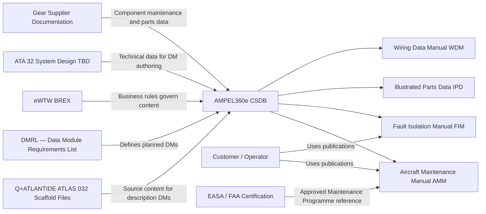
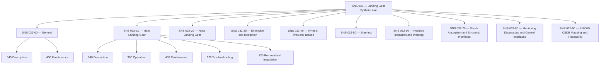
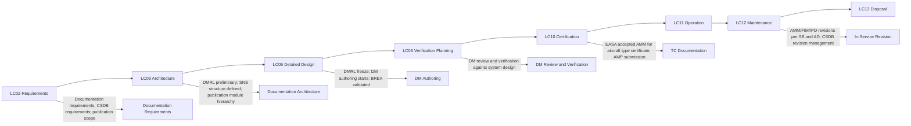

# 032-090 — S1000D CSDB Mapping and Traceability
### AMPEL360e eWTW · ATA 32 · Q+ATLANTIDE ATLAS Scaffold

---

## §0 Hyperlink Policy

All internal links use relative paths. External regulatory references use anchors in [§20 References](#20-references). Links marked **TBD** indicate targets not yet allocated. Programme-level links use five directory levels (`../../../../../`). No absolute URLs are used for internal navigation.

---

## §1 Purpose

This document defines the S1000D Common Source Database (CSDB) structure, SNS-to-DMC mapping, Information Code assignment, Data Module Requirements List (DMRL) planning, Business Rules Exchange (BREX) applicability, and publication module hierarchy for the AMPEL360e eWTW ATA 32 Landing Gear chapter. It serves as the master traceability index linking each ATA 32 subsubject (032-00 through 032-90) to its planned S1000D Data Module Code (DMC) set and to the source documentation in Q+ATLANTIDE ATLAS.

S1000D documentation for the AMPEL360e eWTW programme will be produced in the AMPEL360e CSDB, which is planned as a shared repository for all chapters. ATA 32 landing gear is allocated the SNS prefix 032. Within S1000D, the SNS (System/Subsystem/Sub-subassembly Numbering System) replaces the ATA chapter/section/subsection numbering for DMC construction. The mapping between ATA 32 subsubjects and S1000D SNS codes is defined in this document.

The DMRL for ATA 32 is not yet frozen. Data Module set sizes estimated in this document are preliminary and subject to revision at the DMRL Freeze milestone (TBD). Information Code selection follows S1000D Issue 4.2 (or the issue confirmed by the programme BREX — TBD).

---

## §2 Applicability

| Attribute | Value |
|---|---|
| Programme | AMPEL360e Wide Tube-and-Wing (eWTW) |
| ATA Chapter | ATA 32 — Landing Gear |
| S1000D Issue | Issue 4.2 (or as confirmed by AMPEL360e BREX — TBD) |
| CSDB | AMPEL360e CSDB (TBD — location and management organisation) |
| SNS Prefix | 032 |
| DMC Model Identifier | AMPEL360E-EWTW |
| DMRL Status | Preliminary — not frozen |
| BREX Status | Not yet validated |
| SNS Reference | 032-90 |
| Effectivity | From MSN 001 |

---

## §3 System / Function Overview

**S1000D DMC Structure**: A Data Module Code (DMC) uniquely identifies each Data Module (DM) in the CSDB. For the AMPEL360e eWTW, the DMC structure follows the standard S1000D format:

`DMC-{ModelIdent}-{SNS}-{disassyCode}-{disassyCodeVariant}-{infoCode}-{infoCodeVariant}-{itemLocationCode}`

For ATA 32, the `{ModelIdent}` is `AMPEL360E-EWTW`, the SNS codes are in the range `032-00` through `032-90` (two-digit sub-subassembly). The disassembly code, info code, and item location code are assigned per the DMRL.

**SNS to ATA Mapping**: The ATA 32 subsubject numbering used in Q+ATLANTIDE ATLAS (032-000 through 032-090) maps directly to the S1000D SNS by truncating the trailing zero of the subsubject number. For example, ATA subsubject 032-010 maps to SNS 032-10, and the DMC prefix is `DMC-AMPEL360E-EWTW-032-10`.

**Publication Modules**: The ATA 32 documentation is published in the following S1000D publication modules: Aircraft Maintenance Manual (AMM) — ATA 32 chapters; Fault Isolation Manual (FIM) — ATA 32 chapters; Illustrated Parts Data (IPD) — ATA 32 chapters; Wiring Data Manual (WDM) — ATA 32 landing gear wiring. The AMM is the primary publication module for operational maintenance content.

**BREX**: The eWTW BREX (Business Rules Exchange Object) defines programme-specific deviations from S1000D baseline business rules, including: applicability model; security classification conventions; graphics format; applicability annotation format. The ATA 32 content must comply with the eWTW BREX when the BREX is released. Until then, scaffolding follows default S1000D Issue 4.2 rules.

---

## §4 Scope

### 4.1 Included
- Full SNS-to-DMC mapping for all 10 ATA 32 subsubjects (032-00 through 032-90)
- Recommended Information Code set per SNS (040/300/400/520/720/941)
- DMRL planning notes and estimated DM count per subsubject
- BREX applicability statement and open BREX issues
- Publication module hierarchy for ATA 32 in the AMPEL360e eWTW CSDB
- Cross-reference between Q+ATLANTIDE ATLAS scaffold files and planned S1000D DMCs
- S1000D SNS hierarchy diagram for ATA 32

### 4.2 Excluded
- S1000D authoring (actual DM content authoring) — this document is a mapping/planning document only
- Wiring data content — covered by ATA 92 / WDM
- Parts data content — IPD data authoring not in scope of this document
- CSDB administration (user management, version control) — managed by the AMPEL360e documentation programme office

---

## §5 Architecture Description

- **Two-level SNS structure**: ATA 32 uses a two-level SNS structure — SNS 032 (system level) and SNS 032-xx (subsubject level, mapping one-to-one to ATA subsubjects). No further S1000D sub-subassembly levels are planned at this stage; detail is captured through information codes within each SNS.
- **Info code selection**: Info codes 040 (Description), 300 (Operation), 400 (Maintenance), 520 (Troubleshooting), 720 (Removal/Installation), and 941 (Safety) are planned as the core set per SNS where applicable. Not all info codes apply to all SNS — mapping defined in §14.
- **DMRL-based DM set**: The DMRL will define one row per planned DM, specifying the full DMC, applicable publication, responsible author, and status. Estimated DM counts are preliminary; the DMRL freeze milestone will confirm counts after system design matures.
- **Effectivity model**: Applicability (which MSN/aircraft variant a DM applies to) is managed per the eWTW effectivity annotation model (TBD). Baseline: DMC applies to all eWTW-100/100ER MSNs from MSN 001 unless annotated otherwise.
- **Concurrent access**: Multiple authors may work on different SNS DMCs concurrently in the CSDB. The CMC locking mechanism (TBD — CSDB administration tool) prevents conflicting edits.
- **Cross-reference to ATLAS**: Each ATLAS scaffold file (032-000 through 032-090) is the source of system description content for the corresponding S1000D description DM (Info Code 040). The ATLAS file is the single source of truth at programme level; the S1000D DM is the deliverable to the customer.

---

## §6 Functional Breakdown

| Function ID | Function Title | Description | Applicable Subsystem |
|---|---|---|---|
| F-090-001 | SNS to DMC Mapping | Define and maintain the mapping from each ATA 32 subsubject to its S1000D SNS code and DMC prefix | 032-090 |
| F-090-002 | Information Code Assignment | Assign applicable information codes per SNS; define planned DM set | 032-090 |
| F-090-003 | DMRL Planning | Maintain the DMRL for ATA 32; track DM count, authoring status, review status | 032-090 |
| F-090-004 | BREX Compliance | Confirm eWTW BREX applicability to ATA 32 content; resolve BREX deviations | 032-090 |
| F-090-005 | Publication Module Definition | Define which S1000D publication modules include ATA 32 DMCs; AMM, FIM, IPD, WDM | 032-090 |
| F-090-006 | ATLAS to CSDB Cross-Reference | Maintain cross-reference between Q+ATLANTIDE ATLAS scaffold files and planned S1000D DMCs | 032-090 |

---

## §7 System Context Diagram

---

## §8 Internal Functional Architecture

---

## §9 Lifecycle Traceability

---

## §10 Interfaces

| Interface ID | System / Chapter | Interface Type | Data / Signal | Direction | Status |
|---|---|---|---|---|---|
| IF-090-001 | AMPEL360e CSDB | System / tool | DMC import/export; DM authoring and approval workflow | ATLAS → CSDB |  |
| IF-090-002 | eWTW BREX | Data | Business rule compliance check against BREX object | CSDB ← BREX |  |
| IF-090-003 | Programme DMRL tool | Data | DMRL entries; DM status tracking; DMRL freeze approval | DMRL tool ↔ CSDB |  |
| IF-090-004 | Supplier CMM/IPC | Data | Component maintenance and parts data from gear/brake/EMA/shock absorber suppliers integrated into CSDB | Supplier → CSDB |  |
| IF-090-005 | Certification data | Data | EASA-approved AMM referenced in AFM/MMEL/AMP during certification | CSDB → TC Dossier |  |

---

## §11 Operating Modes

| Mode ID | Mode Name | Description | Entry Condition | Exit Condition |
|---|---|---|---|---|
| OM-090-001 | DMRL Draft | DMRL being built; DM set TBD; SNS mapping preliminary | Programme start | DMRL freeze milestone |
| OM-090-002 | DMRL Frozen | DMRL approved; DM set agreed; DM authoring can begin | DMRL freeze milestone approval | First DM authoring revision complete |
| OM-090-003 | DM Authoring | Individual DMs being authored and reviewed against system design | DMRL frozen; design data available | All DMs at issue level for certification |
| OM-090-004 | Certification Publication | EASA-accepted AMM issue released; AMP approved; operator training enabled | TC issued | Entry into service |
| OM-090-005 | In-Service Revision | AMM/FIM/IPD revised per Service Bulletins and Airworthiness Directives | Aircraft in service | Aircraft type retirement |

---

## §12 Monitoring and Diagnostics

The DMRL tool (TBD — selection pending) tracks each DM entry with authoring status, review status, approval status, and issue number. DMRL health metrics monitored by the programme documentation office include: total DMs planned vs. DMs at draft, at review, and at approved; DMs overdue; DMs with open review comments. A documentation dashboard (TBD) provides visibility to the programme office.

BREX validation is performed automatically by the CSDB authoring tool against the eWTW BREX object. BREX violations are reported per DM; a DM with BREX violations cannot be approved. BREX compliance is monitored as a KPI for the ATA 32 documentation team.

---

## §13 Maintenance Concept

The S1000D CSDB for ATA 32 is maintained under version control in the AMPEL360e CSDB management system (TBD). Revisions to DMCs are controlled by the documentation change process — a change request (CR) is raised for each technical change, the affected DMs are revised, reviewed, and re-approved. In-service revisions driven by Service Bulletins (SBs) must be incorporated into the AMM within the timescale defined by the EASA-approved revision procedure.

The CSDB is backed up per the programme IT infrastructure plan. DM retention follows the programme records retention policy (minimum 25 years post-certificate or aircraft retirement, whichever is later).

---

## §14 S1000D / CSDB Mapping

### 14.1 Full SNS to DMC Mapping — ATA 32 All Subsubjects

| ATA Subsubject | ATLAS File | SNS Code | DMC Prefix | Planned Info Codes | Est. DM Count | DMRL Status |
|---|---|---|---|---|---|---|
| 032-000 — General | 032-000-Landing-Gear-General.md | 032-00 | DMC-AMPEL360E-EWTW-032-00 | 040, 300, 400 | 3 |  |
| 032-010 — Main Landing Gear | 032-010-Main-Landing-Gear.md | 032-10 | DMC-AMPEL360E-EWTW-032-10 | 040, 300, 400, 520, 720 | 5 |  |
| 032-020 — Nose Landing Gear | 032-020-Nose-Landing-Gear.md | 032-20 | DMC-AMPEL360E-EWTW-032-20 | 040, 300, 400, 520, 720 | 5 |  |
| 032-030 — Extension and Retraction | 032-030-Extension-and-Retraction.md | 032-30 | DMC-AMPEL360E-EWTW-032-30 | 040, 300, 400, 520 | 4 |  |
| 032-040 — Wheels, Tires, and Brakes | 032-040-Wheels-Tires-and-Brakes.md | 032-40 | DMC-AMPEL360E-EWTW-032-40 | 040, 300, 400, 520, 720 | 5 |  |
| 032-050 — Steering | 032-050-Steering.md | 032-50 | DMC-AMPEL360E-EWTW-032-50 | 040, 300, 400, 520 | 4 |  |
| 032-060 — Position Indication and Warning | 032-060-Position-Indication-and-Warning.md | 032-60 | DMC-AMPEL360E-EWTW-032-60 | 040, 300, 400, 520 | 4 |  |
| 032-070 — Shock Absorption and Structural Interfaces | 032-070-Shock-Absorption-and-Structural-Interfaces.md | 032-70 | DMC-AMPEL360E-EWTW-032-70 | 040, 300, 400, 520, 720 | 5 |  |
| 032-080 — LG Monitoring, Diagnostics, and Control Interfaces | 032-080-Landing-Gear-Monitoring-Diagnostics-and-Control-Interfaces.md | 032-80 | DMC-AMPEL360E-EWTW-032-80 | 040, 300, 400, 520 | 4 |  |
| 032-090 — S1000D CSDB Mapping and Traceability | 032-090-S1000D-CSDB-Mapping-and-Traceability.md | 032-90 | DMC-AMPEL360E-EWTW-032-90 | 040 | 1 |  |
| **TOTAL** | | | | | **40 est.** | |

### 14.2 Information Code Definitions Applied

| Info Code | S1000D Description | ATA 32 Application |
|---|---|---|
| 040 | Description | System description, architecture, interfaces — primary ATLAS source content |
| 300 | Operation | Normal operations, gear operations, landing, taxiing procedures |
| 400 | Maintenance | Scheduled maintenance tasks; servicing; inspection |
| 520 | Troubleshooting / Fault Isolation | BITE fault responses; isolation procedures; component check |
| 720 | Removal and Installation | Line and base maintenance removal/installation of major components |
| 941 | Safety | Safety precautions for gear operations, EMA safety, brake safety — to be added to applicable DMs |

---

## §15 Footprints

### 15.1 Physical Footprint
- No physical hardware — this is a documentation architecture document

### 15.2 Electrical / Data Footprint
- CSDB storage: estimated 40 DMs for ATA 32 (≤ 100 KB XML per DM average) = < 4 MB storage footprint (minimal)

### 15.3 Maintenance Footprint
- DMRL maintenance: documentation programme office; estimated 1 person-day per month at current stage; increasing at DM authoring phase

### 15.4 Data Footprint
- DMRL: maintained in programme DMRL tool (TBD)
- CSDB: managed in AMPEL360e CSDB (TBD)
- ATLAS cross-reference: maintained in this document (032-090) and in each ATLAS file §14 section

---

## §16 Safety and Certification Considerations

| Requirement | Source | Description | Compliance Approach | Status |
|---|---|---|---|---|
| EASA Part-21 | EASA | AMM must be approved by EASA for type certificate and maintained per Part-21 | CSDB AMM managed under Part-21 document control; revisions approved via EASA accepted process |  |
| CS-25.1529 | EASA CS-25 | Instructions for Continued Airworthiness (ICA) must be provided at type certificate | AMM/FIM/IPD constitute the ICA for ATA 32; submitted with TC dossier |  |
| S1000D Brex | S1000D programme | CSDB content must comply with eWTW BREX | BREX validated against all ATA 32 DMs before approval |  |
| Programme QMS | AMPEL360e | CSDB document control follows programme quality management system | DM approval workflow configured in CSDB tool |  |

---

## §17 Verification and Validation

| V&V ID | Requirement | Method | Success Criterion | Status |
|---|---|---|---|---|
| VV-090-001 | DMRL completeness | Review — compare DMRL DM list against ATA 32 maintenance tasks and system functions | All maintenance tasks traceable to a DM; no orphaned tasks |  |
| VV-090-002 | BREX compliance | Automated BREX validation in CSDB authoring tool | Zero BREX violations across all ATA 32 DMs at approval status |  |
| VV-090-003 | DMC uniqueness | CSDB tool enforces DMC uniqueness; cross-check DMRL for duplicates | No duplicate DMCs in DMRL or CSDB |  |
| VV-090-004 | Publication completeness | Review — verify all DMs in DMRL are included in at least one publication module | Zero orphaned DMs; all planned publications include their required DMs |  |
| VV-090-005 | ATLAS-to-CSDB traceability | Audit — cross-reference each ATLAS §14 section to corresponding DMRL entry | Each ATLAS subsubject maps to at least one planned DM; no unmapped ATLAS files |  |

---

## §18 Glossary

| Term | Definition |
|---|---|
| BREX | Business Rules Exchange — S1000D object defining programme-specific deviations from default business rules |
| CMM | Component Maintenance Manual — supplier-produced manual for maintenance of a line-replaceable unit |
| CSDB | Common Source Database — the S1000D-defined shared repository storing all data modules and publication modules |
| DM | Data Module — the fundamental unit of technical information in S1000D; uniquely identified by a DMC |
| DMC | Data Module Code — the unique identifier for a data module; constructed from SNS, information code, and other fields |
| DMRL | Data Module Requirements List — the master list of all planned DMs, their DMCs, authoring status, and publication mapping |
| ICA | Instructions for Continued Airworthiness — maintenance instructions required by FAR/CS-25.1529 to accompany the type certificate |
| Info Code | Information Code — field in DMC defining the type of information (description, maintenance, troubleshooting, etc.) |
| IPD | Illustrated Parts Data — publication containing parts breakdown and ordering information |
| Publication Module | S1000D container grouping selected DMs into a deliverable publication (e.g., AMM, FIM) |
| SNS | System/Subsystem/Sub-subassembly Numbering System — the S1000D classification hierarchy replacing ATA chapter numbers |
| WDM | Wiring Data Manual — publication containing aircraft wiring data (wire lists, schematics, connector data) |

---

## §19 Citations

| Citation ID | Reference | Description | Relevance |
|---|---|---|---|
| CIT-090-001 | S1000D Issue 4.2 | International specification for technical publications | Governing S1000D standard for AMPEL360e eWTW publications |
| CIT-090-002 | EASA CS-25.1529 | Instructions for Continued Airworthiness | ICA requirement for type certificate |
| CIT-090-003 | ATA iSpec 2200 | Information Standards for Aviation Maintenance | ATA chapter / SNS mapping reference |
| CIT-090-004 | SAE ARP 4754A | System Development of Civil Aircraft | System documentation traceability |

---

## §20 References

| Ref ID | Title | Document | Link |
|---|---|---|---|
| REF-090-001 | ATA 32 General | 032-000 | [./032-000-Landing-Gear-General.md](./032-000-Landing-Gear-General.md) |
| REF-090-002 | Main Landing Gear | 032-010 | [./032-010-Main-Landing-Gear.md](./032-010-Main-Landing-Gear.md) |
| REF-090-003 | Nose Landing Gear | 032-020 | [./032-020-Nose-Landing-Gear.md](./032-020-Nose-Landing-Gear.md) |
| REF-090-004 | Extension and Retraction | 032-030 | [./032-030-Extension-and-Retraction.md](./032-030-Extension-and-Retraction.md) |
| REF-090-005 | Wheels Tires and Brakes | 032-040 | [./032-040-Wheels-Tires-and-Brakes.md](./032-040-Wheels-Tires-and-Brakes.md) |
| REF-090-006 | Steering | 032-050 | [./032-050-Steering.md](./032-050-Steering.md) |
| REF-090-007 | Position Indication and Warning | 032-060 | [./032-060-Position-Indication-and-Warning.md](./032-060-Position-Indication-and-Warning.md) |
| REF-090-008 | Shock Absorption and Structural Interfaces | 032-070 | [./032-070-Shock-Absorption-and-Structural-Interfaces.md](./032-070-Shock-Absorption-and-Structural-Interfaces.md) |
| REF-090-009 | LG Monitoring Diagnostics and Control Interfaces | 032-080 | [./032-080-Landing-Gear-Monitoring-Diagnostics-and-Control-Interfaces.md](./032-080-Landing-Gear-Monitoring-Diagnostics-and-Control-Interfaces.md) |
| REF-090-010 | S1000D International Specification | S1000D Issue 4.2 | [https://s1000d.org](https://s1000d.org) |

---

## §21 Open Issues

| Issue ID | Description | Owner | Priority | Target Resolution | Status |
|---|---|---|---|---|---|
| OI-090-001 | S1000D Issue selection not confirmed — programme may adopt Issue 5.0 rather than 4.2 | Documentation | High | TBD |  |
| OI-090-002 | AMPEL360e CSDB tool not selected — impacts DMRL format, BREX validation method, authoring workflow | Documentation | High | TBD |  |
| OI-090-003 | eWTW BREX not yet produced — all DMs formally non-compliant until BREX released | Documentation | High | TBD |  |
| OI-090-004 | Supplier CMM/IPC provision schedule for gear, EMA, EMB, shock absorber not established | Procurement | Medium | TBD |  |
| OI-090-005 | DM authoring resource allocation for ATA 32 not confirmed | Programme | Medium | TBD |  |
| OI-090-006 | Estimated DM count of 40 is preliminary; final count depends on system design maturity and MSG-3 output | Documentation | Low | TBD |  |

---

## §22 Change Log

| Revision | Date | Author | Description |
|---|---|---|---|
| 0.1.0 | 2026-05-09 | Q+ATLANTIDE Authoring | Initial scaffold — full DMRL mapping table; all sections to template standard |
