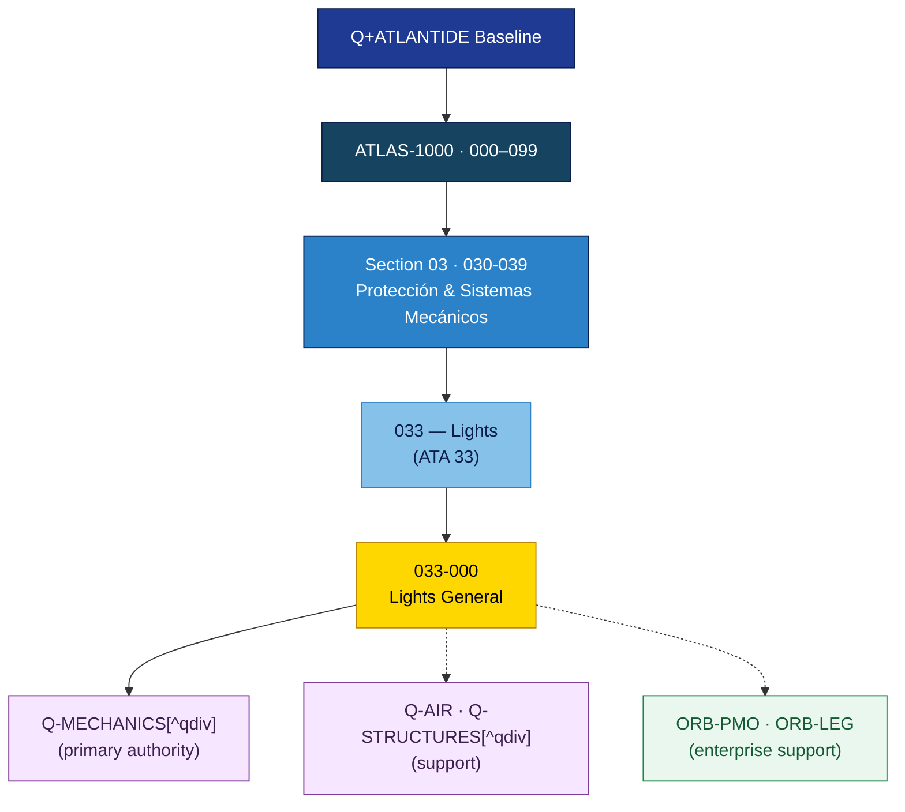

# ATLAS 030-039 · Section 03 · Subsection 033 · 000 — Lights General

## 1. Purpose

Scope and overview of the aircraft lighting chapter per ATA 33. Covers all interior and exterior lighting systems, including control, monitoring, and emergency provisions.

## 2. Scope

- Defines the ATA 33 scope, lighting technology (incandescent, fluorescent, LED), and philosophy.
- Lists applicable certification standards: CS-25.812, CS-25.1381, FAR 25.1381, FAR 25.812.
- Identifies Q-Division authority (Q-MECHANICS) and supporting divisions.
- Not in scope: flight deck instrument back-lighting (ATA 31) or overhead panel lighting beyond ATA 33 boundary.

## 3. Footprint

| Metric | Value |
|---|---|
| Architecture | `ATLAS` — Aircraft Top Level Architecture Schema/System (controlled term) |
| Master range | `000–099` |
| Code range | `030-039` |
| Section | `03` — Protección & Sistemas Mecánicos |
| Subsection | `033` — Lights |
| Subsubject | `000` — Lights General |
| Primary Q-Division | Q-MECHANICS[^qdiv] |
| Support Q-Divisions | Q-AIR, Q-STRUCTURES |
| ORB support | ORB-PMO, ORB-LEG |
| Governance class | `baseline`[^gov] |
| Folder path | `Q+ATLANTIDE/000-099_ATLAS/030-039_Proteccion-y-Sistemas-Mecanicos/033_Lights/` |
| Document | `033-000-Lights-General.md` (this file) |
| Parent subsection | [`README.md`](./README.md) |
| Parent section | [`../../README.md`](../../README.md) |
| Parent architecture | [`../../../README.md`](../../../README.md) |
| Parent baseline | [`organization/Q+ATLANTIDE.md`](../../../../../organization/Q+ATLANTIDE.md) |

> **Footprint Notes**
> - **Architecture**: `ATLAS` is the controlled term for the Aircraft Top-Level Architecture Schema/System within the Q+ATLANTIDE-1000 register.
> - **Primary Q-Division**: Q-MECHANICS holds technical authority for mechanical and electro-mechanical aircraft systems.
> - **Support Q-Divisions**: Q-AIR provides systems integration oversight; Q-STRUCTURES provides structural interface authority.
> - **Governance class**: `baseline` documents are subject to formal change control under the Q+ATLANTIDE Configuration Management Plan.
> - **ORB support**: ORB-PMO coordinates programme management; ORB-LEG provides regulatory and certification support.

## 4. Interfaces Diagram

## 5. References & Citation Map

[^baseline]: **Q+ATLANTIDE controlled baseline (v1.0.0)** — [`organization/Q+ATLANTIDE.md`](../../../../../organization/Q+ATLANTIDE.md). Defines the controlled `000-999` architecture-band taxonomy and the ATLAS-1000 register subpart.

[^qdiv]: **Q-Division authority** — [`organization/Q-Divisions/`](../../../../../organization/Q-Divisions/). Technical-authority units for the Q+ATLANTIDE baseline.

[^gov]: **Governance class** — `baseline` denotes documents under controlled change management within the Q+ATLANTIDE baseline.

[^n001]: **Note N-001** — Q+ATLANTIDE (with its ATLAS-1000 register subpart) is a taxonomy and traceability ecosystem, not an organization chart. See [`organization/Q+ATLANTIDE.md` §4](../../../../../organization/Q+ATLANTIDE.md#4-notes).

### Citation & Traceability Map

| Ref | Target Document | Relationship | Scope |
|---|---|---|---|
| [^baseline] | [`organization/Q+ATLANTIDE.md`](../../../../../organization/Q+ATLANTIDE.md) | Normative baseline | ATLAS-1000 register authority |
| [^qdiv] | [`organization/Q-Divisions/`](../../../../../organization/Q-Divisions/) | Technical authority | Q-Division assignment |
| [^gov] | Q+ATLANTIDE governance class definition | Governance class | Change-management classification |
| [^n001] | [`organization/Q+ATLANTIDE.md §4`](../../../../../organization/Q+ATLANTIDE.md#4-notes) | Taxonomy note | Ecosystem scope clarification |

---

## Glossary

### Common Terms & Acronyms

| Term / Acronym | Expansion | Definition |
|---|---|---|
| **ATA** | Air Transport Association | Industry body that publishes iSpec 2200 (formerly ATA Spec. 100), the standard chapter-numbering scheme for aircraft systems documentation. |
| **ATLAS** | Aircraft Top Level Architecture Schema/System | The controlled architecture taxonomy and documentation framework within the Q+ATLANTIDE-1000 register; governs chapters 000–099. |
| **baseline** | — | A formally approved version of a document or configuration item, subject to formal change control, forming the reference for further development or maintenance. |
| **CSDB** | Common Source Data Base | The central repository defined by S1000D for storing, managing, and exchanging Data Modules and Publication Modules. |
| **DMC** | Data Module Code | Unique alphanumeric identifier for a single S1000D Data Module, encoding model identification, system/sub-system, information code, and variant. |
| **governance\_class** | — | Classification field in Q+ATLANTIDE YAML frontmatter that indicates the change-control regime (`baseline`, `programme-controlled`, `legacy-deprecated`, etc.). |
| **NNN** | — | Three-digit ATA-SNS sub-subject code (e.g., `010`, `020`, …, `090`) used as the local identifier within a subsection folder. |
| **ORB** | Operations Review Board | Enterprise-level governance body within the Q+ATLANTIDE organisational structure, responsible for cross-domain oversight and authorisation. |
| **ORB-LEG** | ORB — Legal & Regulatory | ORB function providing legal compliance, regulatory (EASA/FAA) liaison, and certification boundary advisory services. |
| **ORB-PMO** | ORB — Programme Management Office | ORB function providing programme scheduling, resource, and milestone control across all Q-Division work-packages. |
| **Q+ATLANTIDE** | — | The master controlled documentation baseline and taxonomy ecosystem for the ATLAS-1000 architecture register; versioned governance reference for all architecture bands (000–999). |
| **Q-AIR** | Q-Division — Air Systems | Technical-authority Q-Division responsible for aerodynamics, air-data systems, and systems integration oversight. |
| **Q-DATAGOV** | Q-Division — Data Governance | Technical-authority Q-Division responsible for data standards, traceability, and CSDB publication governance. |
| **Q-GREENTECH** | Q-Division — Green Technologies | Technical-authority Q-Division responsible for sustainable propulsion, energy, and environmental compliance. |
| **Q-GROUND** | Q-Division — Ground Systems | Technical-authority Q-Division responsible for ground handling, servicing interfaces, and airport compatibility. |
| **Q-INDUSTRY** | Q-Division — Industry & Supply Chain | Technical-authority Q-Division responsible for industrial producibility, supplier qualification, and manufacturing interfaces. |
| **Q-MECHANICS** | Q-Division — Mechanical Systems | Technical-authority Q-Division responsible for mechanical and electro-mechanical aircraft systems; primary authority for ATLAS sections 030–039. |
| **Q-STRUCTURES** | Q-Division — Structures | Technical-authority Q-Division responsible for structural interfaces, loads, and airframe integrity. |
| **S1000D** | — | International specification (ASD/AIA/ATA) for the production and procurement of technical publications; defines the Data Module (DM) paradigm and CSDB architecture. |
| **SNS** | Standard Numbering System | The ATA/S1000D hierarchical chapter-section-subject numbering scheme mapping physical/functional aircraft systems to a standardised code space. |
| **YAML** | YAML Ain't Markup Language | Human-readable data-serialisation language used for document frontmatter (metadata header blocks) throughout the Q+ATLANTIDE baseline. |

### Domain-Specific Terms — ATA 33 Lights

| Term / Acronym | Expansion | Definition |
|---|---|---|
| **ACL** | Anti-Collision Light | Rotating beacon or strobe light mounted on the airframe for air/ground collision prevention. |
| **CCR** | Cabin Core Router / Cabin Crew Rest | Context-dependent; in lighting systems, typically refers to cabin control routing for passenger service unit dimming. |
| **EL** | Electroluminescent | Lighting technology emitting light through electroluminescence; used in older signage and exit markings. |
| **ETOPS** | Extended-Range Twin-Engine Operational Performance Standards | Certification allowing twin-engine aircraft to operate routes farther than 60 min from a diversion airport; lighting must meet ETOPS standards for emergency illumination. |
| **LED** | Light-Emitting Diode | Solid-state semiconductor light source; dominates modern aircraft interior and exterior lighting for its long life and low power draw. |
| **NVG** | Night Vision Goggles | Electro-optical devices amplifying ambient light; require NVG-compatible (NVIS-compliant) cockpit and cabin lighting. |
| **NVIS** | Night Vision Imaging System | Aircraft lighting compatibility standard (MIL-L-85762) ensuring cockpit lights do not saturate NVG optics. |
| **PSU** | Passenger Service Unit | Overhead panel in each passenger row providing reading lights, air outlet, oxygen mask access, and attendant call. |
| **TLU** | Tail Logo Unit / Tailplane Lighting Unit | Lighting assembly illuminating the aircraft livery / tail fin for brand and identification purposes. |
