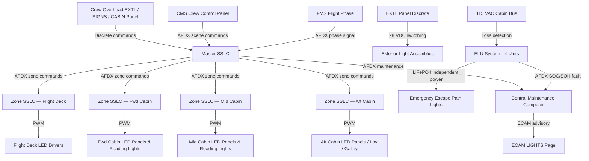
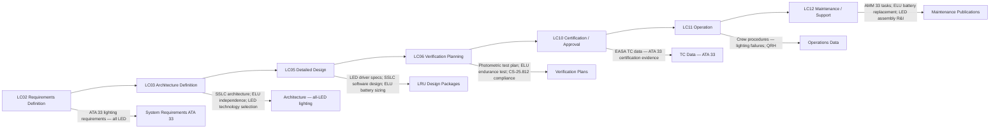

# 033-000 — Lights — General
### [PROGRAMME-AIRCRAFT] [PROGRAMME-VARIANT] · ATA 33 · Q+ATLANTIDE ATLAS Scaffold

---

## §0 Hyperlink Policy

All internal links in this document use relative paths from the current directory. External regulatory and standards references use anchor links defined in [§20 References](#20-references). Links marked **TBD** indicate targets not yet allocated within the CSDB or ATLAS hierarchy. Programme-level links traverse five directory levels (`../../../../../`) to reach the repository root. No absolute URLs are used for internal navigation.

---

## §1 Purpose

This document defines the agnostic ATLAS standard-level architecture context for `033-000 — Lights — General`.

It describes the controlled scope, functions, interfaces, safety considerations, lifecycle traceability, and S1000D/CSDB mapping logic that programme implementations shall instantiate when this node is applicable.

This document is not a programme design baseline. Programme-specific capacities, locations, part numbers, effectivity, operating limits, maintenance references, and data module codes shall be defined only inside the applicable programme implementation branch.
## §2 Applicability

| Applicability Level | Rule |
|---|---|
| Standard taxonomy | Applies to the ATLAS node `<NODE>` |
| Programme implementation | Conditional; determined by programme architecture, trade studies, certification basis, and applicability model |
| Product configuration | Defined in the programme-specific configuration baseline |
| Effectivity | Defined in the programme CSDB / applicability layer |
| Non-applicability | Must be explicitly stated in the programme impact-study branch when excluded |
## §3 System / Function Overview

ATA 33 on the [PROGRAMME-AIRCRAFT] [PROGRAMME-VARIANT] encompasses all systems responsible for illuminating the flight deck, passenger cabin, cargo and service compartments, exterior surfaces and positions, emergency escape paths, and passenger information signage. The lighting system contributes directly to flight safety (exterior visibility lights, emergency lighting), crew situational awareness (flight deck instruments and charts), passenger comfort (cabin mood and reading lights), ground operations (exterior working lights), and regulatory compliance (anti-collision, navigation position, and exit marking).

The SSLC architecture consists of a Master SSLC and up to four Zone SSLCs (flight deck, forward cabin, mid cabin, aft cabin). Each Zone SSLC drives LED dimmer modules in its zone, accepts PWM commands over AFDX from the Cabin Management System (CMS) or crew overhead panel, and reports zone health and fault data back to the Central Maintenance Computer (CMC) over the maintenance AFDX bus.

Exterior lights — navigation/position lights, anti-collision strobes, landing lights, taxi lights, runway turnoff lights, wing inspection lights, and logo lights — are powered from the 28 VDC essential bus and controlled via the overhead EXTL panel in the flight deck. Emergency lighting ELUs are self-contained units powered by their own LiFePO4 batteries; they activate automatically on loss of the 115 VAC cabin bus and can be armed/disarmed by crew via the EMERG LT switch on the overhead panel.

---

## §4 Scope

### 4.1 Included
- Flight deck integral and flood lighting, glareshield lighting, chart and dome lights
- Passenger cabin ceiling LED panels, reading lights, lavatory lighting, galley lighting, and mood/scene preset system
- Cargo hold LED strip lighting (main and bulk holds) with door-interlock logic
- Service and equipment bay lighting (EE bay, avionics bay, gear bays)
- All exterior lights: navigation/position, anti-collision strobe, steady beacon, landing, runway turnoff, taxi, wing inspection, logo, and tail cone service lights
- Emergency lighting: ELUs, floor proximity LED strips, overwing exit lights, exit signs, escape path marking system
- Illuminated passenger information signs: Fasten Seat Belts, No Smoking, Return to Seat
- SSLC architecture, PWM dimming, AFDX/ARINC 429 lighting data bus network
- Lighting power distribution interfaces (28 VDC, 115 VAC conversion to LED drivers, ELU independent supply)
- CMC/OMS monitoring, BITE, ECAM advisory, and ground maintenance test capability for ATA 33
- S1000D CSDB mapping and publication traceability for ATA 33

### 4.2 Excluded
- Electrical power generation and distribution (HVDC, 115 VAC, 28 VDC bus structure) — covered by ATA 24
- Cabin Management System (CMS) host platform and non-lighting CMS functions — covered by ATA 44
- Passenger entertainment displays and screens — covered by ATA 44
- Avionics indicator lights as part of EFIS/instrument display panels — covered by ATA 31
- Fire detection warning lights — covered by ATA 26
- IMA platform hosting SSLC software partitions — covered by ATA 42

---

## §5 Architecture Description

- **100% LED technology**: All lighting units — interior and exterior — use LED light sources. No incandescent, halogen, fluorescent, or high-intensity discharge lamps are used. This reduces power consumption, maintenance burden (no lamp replacement), and thermal load compared to conventional aircraft lighting systems.
- **SSLC-based dimming**: Solid-State Lighting Controllers manage all dimmable zones using PWM signals to LED driver modules. One Master SSLC and four Zone SSLCs (flight deck, fwd cabin, mid cabin, aft cabin) communicate over AFDX.
- **AFDX / ARINC 429 data network**: Lighting commands from CMS, crew overhead panel discrete signals, and SSLC health status all traverse AFDX (ARINC 664 Part 7). Legacy ARINC 429 interfaces provided for specific zone controllers where AFDX sub-networks are not warranted.
- **Emergency lighting independence**: ELUs are powered exclusively from dedicated LiFePO4 battery packs. There is no connection from ELU batteries to aircraft main buses during normal operation. Auto-activation occurs on loss of 115 VAC cabin bus; 10-minute minimum illumination duration per CS-25.812.
- **Floor proximity escape path marking**: Hybrid system (LED strips + photo-luminescent strips) provides escape path lighting along the cabin floor, compliant with CS-25.812(b)(1)(iv). Hybrid solution confirmation is pending (see §21).
- **Exterior lights on 28 VDC essential bus**: All exterior lights draw power from the 28 VDC essential bus (essential bus segment TBD — see ATA 24 interface) to ensure availability after loss of non-essential power.
- **NVIS compatibility (optional)**: Flight deck lighting is designed for potential NVIS (Night Vision Imaging System) compatibility (NVG-compatible mode). Fitment decision is TBD.
- **CMS scene preset integration**: Cabin mood lighting supports pre-programmed scene presets (boarding, cruise, meal, night, emergency) commanded by cabin crew through the CMS crew control panel or automatically by flight phase logic from the FMS.
- **CMC BITE integration**: SSLCs and exterior light controllers report fault data to the CMC over the AFDX maintenance bus. Fault isolation is to LRU level (SSLC, ELU, zone driver, individual light assembly).

---

## §6 Functional Breakdown

| Function ID | Function Title | Description | Applicable Subsystem |
|---|---|---|---|
| F-001 | Flight Deck and Crew Compartment Lighting | Overhead integral panel backlighting, glareshield, chart, dome, flood, and stowage compartment lights; NVIS compatibility TBD; SSLC-driven dimming | 033-010 |
| F-002 | Passenger Cabin Lighting | Addressable LED ceiling panels per zone/row; individual seat reading lights; lavatory and galley lighting; mood scene presets; CMS integration | 033-020 |
| F-003 | Cargo and Service Compartment Lighting | LED strip lighting in main and bulk cargo holds with door-interlock; EE bay, avionics bay, and gear bay service lights | 033-030 |
| F-004 | Exterior Lighting | Navigation/position lights; anti-collision strobes; steady beacon; landing lights (retractable); runway turnoff, taxi, wing inspection, and logo lights; all LED on 28 VDC essential bus | 033-040 |
| F-005 | Emergency Lighting | ELUs with LiFePO4 batteries; floor proximity LED + photo-luminescent strips; overwing exit lights; exit signs; auto-activation on 115 VAC bus loss; ≥10-minute duration | 033-050 |
| F-006 | Signage and Information Lighting | Fasten Seat Belts, No Smoking, Return to Seat signs; LED backlit panels; crew and automatic FMS control; CS-25.791 and ICAO Annex 6 symbology | 033-060 |
| F-007 | Lighting Control, Dimming, and Power Interfaces | Master SSLC and Zone SSLC architecture; PWM dimming 0–100%; AFDX/ARINC 429 bus; 28 VDC and 115 VAC power interfaces; ELU independent supply | 033-070 |
| F-008 | Lights Monitoring, Diagnostics, and Control Interfaces | SSLC BITE; CMC fault reporting; ECAM LIGHTS advisory page; ELU battery SOC/SOH monitoring; ground maintenance test mode | 033-080 |
| F-009 | S1000D CSDB Mapping and Traceability | SNS allocation; DMC codes; DMRL; BREX; publication hierarchy for ATA 33 in [PROGRAMME-VARIANT] CSDB | 033-090 |

---

## §7 System Context Diagram

```mermaid
flowchart LR
    AC[[PROGRAMME-AIRCRAFT] [PROGRAMME-VARIANT] Aircraft] --> ATA33[ATA 33 — Lights]
    ATA33 --> SUB010[033-010 Flight Deck Lighting]
    ATA33 --> SUB020[033-020 Passenger Cabin Lighting]
    ATA33 --> SUB030[033-030 Cargo & Service Lighting]
    ATA33 --> SUB040[033-040 Exterior Lighting]
    ATA33 --> SUB050[033-050 Emergency Lighting]
    ATA33 --> SUB060[033-060 Signage & Information]
    ATA33 --> SUB070[033-070 Control Dimming & Power]
    ATA33 --> SUB080[033-080 Monitoring & Diagnostics]
    ATA33 --> SUB090[033-090 S1000D Mapping]
    ATA24[ATA 24 Electrical Power] -->|28 VDC essential bus; 115 VAC cabin bus| ATA33
    ATA22[ATA 22 Auto-Flight] -->|Flight phase for auto scene change| ATA33
    ATA31[ATA 31 Indicating Systems] -->|ECAM LIGHTS page display| ATA33
    ATA44[ATA 44 Cabin Systems CMS] -->|Cabin scene preset commands| ATA33
    ATA45[ATA 45 Maintenance] -->|CMC BITE reporting| ATA33
    ATA33 -->|ELU auto-activation| EMRG[CS-25.812 Emergency Path]
    ATA33 -->|Exterior visibility| EXTL[Regulatory: CS-25.1383/.1387/.1401]
```

---

## §8 Internal Functional Architecture



---

## §9 Lifecycle Traceability



---

## §10 Interfaces

| Interface ID | System / Chapter | Interface Type | Data / Signal | Direction | Status |
|---|---|---|---|---|---|
| IF-033-001 | ATA 24 Electrical Power | 28 VDC essential bus | Power for exterior lights and flight deck lighting | ATA24 → ATA33 |  |
| IF-033-002 | ATA 24 Electrical Power | 115 VAC cabin bus | Power for cabin LED drivers via local AC/DC conversion | ATA24 → ATA33 |  |
| IF-033-003 | ATA 22 Auto-Flight / FMS | AFDX | Flight phase signal for automatic cabin scene preset change | ATA22 → ATA33 |  |
| IF-033-004 | ATA 44 Cabin Systems (CMS) | AFDX | Scene preset commands and cabin zone control from CMS | ATA44 → ATA33 |  |
| IF-033-005 | ATA 31 Indicating Systems (ECAM) | AFDX | ECAM LIGHTS advisory page data from Master SSLC | ATA33 → ATA31 |  |
| IF-033-006 | ATA 45 Maintenance System (CMC) | AFDX maintenance bus | SSLC and ELU BITE fault data to CMC | ATA33 → ATA45 |  |
| IF-033-007 | ATA 26 Fire Protection | Discrete | Cargo smoke detection interlock for cargo lighting | ATA26 → ATA33 |  |
| IF-033-008 | ATA 32 Landing Gear | Discrete | Nose gear position (WoW) for taxi light automation | ATA32 → ATA33 |  |
| IF-033-009 | ATA 25 Equipment / Furnishings | Physical | Cabin LED panel integration with overhead structure and PSU | Physical Interface |  |
| IF-033-010 | ATA 34 Navigation | ARINC 429 | Anti-collision light status to TCAS and transponder mode S | ATA33 → ATA34 |  |

---

## §11 Operating Modes

| Mode ID | Mode Name | Description | Entry Condition | Exit Condition |
|---|---|---|---|---|
| OM-001 | Normal Operation — Day | All cabin zones at full white light; exterior lights as selected by crew | Crew selection; day flight phase | Night mode or crew change |
| OM-002 | Boarding / Deboarding | Warm-white mood lighting at boarding brightness (TBD lux level); signs illuminated | Gate connection or door open command from CMS | Door closed + push-back |
| OM-003 | Cruise — Day | Cabin at neutral white; reading lights available individually; exterior: navigation + anti-collision only | Cruise phase FMS signal | Descent phase FMS signal |
| OM-004 | Cruise — Night / Dim | Ambient amber/dim cabin; seat reading lights available; exterior: navigation + anti-collision | Crew or FMS night mode command | Crew cancel or descent |
| OM-005 | Landing — Full Bright | Cabin at full white; landing lights on; runway turnoff lights on; seat belt sign on | Below TBD ft RA or gear down | Taxi phase or WoW |
| OM-006 | Taxi | Taxi light on; runway turnoff as selected; logo light as selected | WoW on ground | Take-off power set |
| OM-007 | Emergency | Emergency lighting auto-activates from ELUs; all escape path lights on; exit signs bright | 115 VAC cabin bus loss or crew EMERG LT switch | Bus restored or aircraft evacuated |
| OM-008 | Maintenance / Ground Test | All zones can be commanded individually from CMC; ELU test mode; exterior lights test | Ground power + CMC maintenance mode | CMC test complete |
| OM-009 | Cargo Loading | Cargo bay LED strips on (door-interlock released while door open) | Cargo door open | Cargo door closed |

---

## §12 Monitoring and Diagnostics

All Zone SSLCs perform continuous self-monitoring of LED driver output currents and voltages. A fault flag is raised when an LED string fails above a configurable percentage threshold (TBD — typically >10% of string LEDs per zone). Short-circuit and open-circuit detection are handled by SSLC BITE with a fault isolation to the individual zone driver module. Faults are logged to the CMC over the AFDX maintenance bus, classified by ATA 33 subsubject and LRU identifier.

ELU battery health is monitored by the SSLC system: State of Charge (SOC) and State of Health (SOH) are reported to CMC via AFDX. ELU self-test (capacity verification) can be commanded from CMC or triggered automatically at a configurable interval (TBD). ELU test results (pass/fail, measured duration at rated load) are logged in the CMC maintenance record. Replacement threshold: SOH < TBD%.

Exterior light fault monitoring: each exterior light circuit is monitored for open-circuit condition. A failed navigation light or anti-collision strobe generates an ECAM LIGHTS caution advisory, alerting the crew to a light failure requiring crew action per applicable regulations (some exterior light failures may require immediate dispatch restriction per MEL).

---

## §13 Maintenance Concept

ATA 33 is designed as a near-zero-lamp-change system. LED assemblies (interior and exterior) have a design service life of TBD hours (targeting >50,000 hours MTBF per LED assembly), making scheduled lamp replacement obsolete. Corrective maintenance for LED light assembly failure is LRU swap — plug-and-play replacement at line maintenance level.

SSLC units (Master and Zone) are LRU items installed in the avionics bay; replacement requires AFDX connector disconnection and rack extraction. Each SSLC requires software configuration loading after replacement (TBD — configuration data loaded from CMC or maintenance laptop).

ELU battery packs are line-replaceable items. Replacement interval is conditioned by SOH monitoring data from CMC. Physical battery pack exchange requires access to ELU mounting locations in the cabin ceiling/sidewall panels — a line maintenance task. After ELU replacement, an ELU functional test (self-test from CMC) is required.

Floor proximity LED/photo-luminescent strip inspection is a scheduled cabin interior inspection item. LED strip sections showing degradation or photo-luminescent strip fading (luminance below regulatory minimum) require section replacement.

---

## §14 S1000D / CSDB Mapping

### 14.1 SNS to DMC Mapping

| SNS Code | Subsubject Title | DMC Prefix | Info Codes Planned | DMRL Status |
|---|---|---|---|---|
| 033-00 | General | DMC-<PROGRAMME>-<VARIANT>-033-00 | 040, 300, 400 |  |
| 033-10 | Flight Deck and Crew Compartment Lighting | DMC-<PROGRAMME>-<VARIANT>-033-10 | 040, 300, 400, 520, 720 |  |
| 033-20 | Passenger Cabin Lighting | DMC-<PROGRAMME>-<VARIANT>-033-20 | 040, 300, 400, 520, 720, 941 |  |
| 033-30 | Cargo and Service Compartment Lighting | DMC-<PROGRAMME>-<VARIANT>-033-30 | 040, 300, 400, 520, 720 |  |
| 033-40 | Exterior Lighting | DMC-<PROGRAMME>-<VARIANT>-033-40 | 040, 300, 400, 520, 720, 941 |  |
| 033-50 | Emergency Lighting | DMC-<PROGRAMME>-<VARIANT>-033-50 | 040, 300, 400, 520, 720 |  |
| 033-60 | Signage and Information Lighting | DMC-<PROGRAMME>-<VARIANT>-033-60 | 040, 300, 400, 520, 720 |  |
| 033-70 | Lighting Control, Dimming, and Power Interfaces | DMC-<PROGRAMME>-<VARIANT>-033-70 | 040, 300, 400, 520 |  |
| 033-80 | Lights Monitoring, Diagnostics, and Control Interfaces | DMC-<PROGRAMME>-<VARIANT>-033-80 | 040, 300, 400, 520 |  |
| 033-90 | S1000D CSDB Mapping and Traceability | DMC-<PROGRAMME>-<VARIANT>-033-90 | 040 |  |

### 14.2 Information Code Definitions

| Info Code | Description | Applicable to ATA 33 |
|---|---|---|
| 040 | Description (system description, function) | All SNS |
| 300 | Operation (normal, abnormal, emergency procedures) | 033-10 through 033-70 |
| 400 | Maintenance procedures (inspection, test, adjustment) | All SNS |
| 520 | Troubleshooting (fault isolation) | 033-10 through 033-80 |
| 720 | Removal and installation | 033-10 through 033-60 |
| 941 | Illustrated Parts Data (IPD) | 033-20, 033-40 |

---

## §15 Footprints

### 15.1 Physical Footprint
- Master SSLC: avionics bay — 1 LRU, envelope TBD
- Zone SSLCs (×4): distributed — flight deck overhead, cabin forward/mid/aft zones — envelope TBD
- ELUs (×4 minimum — flight deck + 3 cabin zones): cabin overhead/sidewall mounted — envelope TBD per battery sizing
- Cabin LED ceiling panel arrays: integrated with cabin overhead structure; panel dimensions TBD per aircraft interior layout
- Floor proximity LED/photo-luminescent strips: cabin floor track/threshold locations per emergency exit row layout
- Exterior light assemblies: wingtip (nav lights), tail (nav + strobe), wing root (landing lights, retractable), NLG pod (turnoff + taxi), tail logo — all per airframe interface drawings

### 15.2 Electrical / Data Footprint
- Power: 28 VDC essential bus for exterior lights and flight deck; 115 VAC cabin bus (locally converted) for cabin LED drivers; ELU LiFePO4 independent supply for emergency lighting
- Total lighting power budget (normal cruise): 
- Data: AFDX for SSLC command/status and CMC BITE; ARINC 429 for discrete interfaces; discrete wiring for exterior light switches and ELU activation
- SSLC AFDX bandwidth: 

### 15.3 Maintenance Footprint
- LRU replacements at line: LED light assemblies (all zones and exterior), SSLC units, ELU battery packs, SSLC zone driver modules
- Ground support equipment: maintenance laptop / CMC terminal for SSLC configuration load and ELU test; photometric measurement kit for regulatory compliance checks (TBD)
- Scheduled intervals: LED assembly life TBD; ELU battery replacement per SOH threshold; floor proximity strip inspection per AMM interval TBD

### 15.4 Data Footprint
- SSLC fault log: minimum 500 fault entries per Zone SSLC
- ELU test log: test date, duration at rated load, pass/fail result — retained per AMM
- CMC lighting trend: LED string degradation trend, ELU SOH trend — retention period TBD
- ECAM LIGHTS history: last N caution events TBD

---

## §16 Safety and Certification Considerations

| Requirement | Source | Description | Compliance Approach | Status |
|---|---|---|---|---|
| CS-25.811 | EASA CS-25 | Emergency exit marking — exits must be marked and clearly identifiable | LED illuminated exit signs + markings per approved layout |  |
| CS-25.812 | EASA CS-25 | Emergency lighting — cabin emergency lighting independent of main electrical system; ≥10 min duration | ELU LiFePO4 battery packs; auto-activation on bus loss; endurance test |  |
| CS-25.812(b)(1)(iv) | EASA CS-25 | Floor proximity escape path lighting — low-level lighting along escape path to exits | LED floor proximity strips + photo-luminescent hybrid; layout per approved cabin arrangement |  |
| CS-25.1383 | EASA CS-25 | Landing lights — required for aircraft certified for night operations | LED retractable landing lights on wing root; photometric compliance test |  |
| CS-25.1385 | EASA CS-25 | Position lights — installation requirements (portside red, starboard green, aft white) | LED navigation/position light assemblies at standard locations |  |
| CS-25.1387 | EASA CS-25 | Position lights — colour and intensity; dihedral angles of visibility | LED position lights with DO-293 photometric compliance; angle-of-coverage test |  |
| CS-25.1401 | EASA CS-25 | Anti-collision light system — strobe and steady beacon; flash rate; colour; effective intensity | LED strobe (white) and steady red beacon; DO-293 photometric test |  |
| CS-25.791 | EASA CS-25 | Passenger information signs — Fasten Seat Belts, No Smoking illuminated signs | LED backlit signs; symbology per CS-25.791 and ICAO Annex 6 |  |
| DO-293 | RTCA | Minimum Performance Standard for LED Aircraft Lighting Equipment | All exterior LED light assemblies qualified per DO-293 |  |
| DO-160G | RTCA | Environmental conditions and test procedures for airborne equipment | SSLC and ELU environmental qualification per DO-160G |  |

---

## §17 Verification and Validation

| V&V ID | Requirement | Method | Success Criterion | Status |
|---|---|---|---|---|
| VV-033-001 | CS-25.812 — Emergency lighting endurance | ELU endurance test at rated illumination load | All ELUs sustain rated lux for ≥10 minutes; no flicker or failure |  |
| VV-033-002 | CS-25.812 — Auto-activation | Laboratory test: remove 115 VAC cabin bus power | ELU auto-activates within TBD seconds; all emergency paths illuminated |  |
| VV-033-003 | CS-25.812(b)(1)(iv) — Floor proximity lighting | In-situ cabin photometric measurement | Floor proximity illuminance meets regulatory minimum at each exit aisle |  |
| VV-033-004 | CS-25.1387 — Position light photometrics | DO-293 photometric test per axis and angle | Luminous intensity and colour within DO-293 / CS-25.1387 limits at all coverage angles |  |
| VV-033-005 | CS-25.1401 — Anti-collision strobe | DO-293 effective intensity and flash rate test | Effective intensity and flash rate within CS-25.1401 and DO-293 limits |  |
| VV-033-006 | CS-25.1383 — Landing light illuminance | Ground photometric measurement at 200 ft / 500 ft range TBD | Illuminance meets regulatory minimum for night operations certification |  |
| VV-033-007 | CS-25.791 — Passenger information signs | Visual inspection + photometric measurement | Signs legible at minimum viewing distance; correct symbology |  |
| VV-033-008 | SSLC BITE — fault detection | Lab bench SSLC BITE test; simulate LED string failures | All injected faults correctly detected, reported to CMC, and isolated to LRU |  |
| VV-033-009 | DO-160G — Environmental qualification | DO-160G test suite for SSLC and ELU | Pass all applicable DO-160G test categories |  |
| VV-033-010 | NVIS compatibility (if NVIS fitment confirmed) | NVIS compatibility test per MIL-L-85762A or equivalent | Flight deck lighting does not degrade NVG image quality below threshold |  |

---

## §18 Glossary

| Term | Definition |
|---|---|
| AFDX | Avionics Full-Duplex Switched Ethernet (ARINC 664 Part 7) — the high-speed deterministic data bus used for SSLC command/status and CMC interfaces in ATA 33 |
| CCT | Correlated Colour Temperature — a measure in Kelvin (K) of the warmth or coolness of white light; cabin LEDs target adjustable CCT from approximately 2700K (warm white) to 6500K (cool white) |
| CMS | Cabin Management System — the integrated system controlling cabin functions including lighting scene presets; ATA 44 hosted |
| CRI | Colour Rendering Index — a measure (0–100) of how accurately a light source renders the colours of objects compared to natural daylight; regulatory and comfort minimum for cabin lighting TBD (target Ra > 80) |
| DO-293 | RTCA Minimum Performance Standard for LED Aircraft Lighting Equipment — the primary qualification standard for all exterior LED light assemblies on the [PROGRAMME-VARIANT] |
| ELU | Emergency Lighting Unit — a self-contained unit comprising LiFePO4 battery, charging circuit, LED driver, and auto-activation logic; provides independent emergency illumination per CS-25.812 |
| LED | Light Emitting Diode — a semiconductor light source used exclusively throughout the [PROGRAMME-VARIANT] lighting system; advantages include long service life, low power consumption, and vibration resistance |
| LiFePO4 | Lithium Iron Phosphate — the battery chemistry used in ELU battery packs; chosen for safety (thermal stability), cycle life, and regulatory acceptance |
| LCU | Lighting Control Unit — a zone-level unit (also referred to as SSLC in this document) managing LED drivers and PWM dimming for an assigned lighting zone |
| lux | SI unit of illuminance — lumens per square metre (lm/m²); used to specify minimum and target illuminance levels for cargo holds, work areas, and emergency escape paths |
| NVIS | Night Vision Imaging System — equipment (NVGs — Night Vision Goggles) used by flight crew in some operations; flight deck lighting must be NVIS-compatible to avoid goggles saturation from visible-light sources |
| NVG | Night Vision Goggles — head-mounted image intensification devices; require flight deck lighting in the far-red / near-IR spectrum to avoid washout |
| PWM | Pulse Width Modulation — a dimming technique where LED brightness is controlled by varying the duty cycle (on-time fraction) of a fixed-frequency drive signal; preferred for LED dimming to maintain colour temperature across the dimming range |
| SOC | State of Charge — the remaining capacity of the ELU battery expressed as a percentage of full charge |
| SOH | State of Health — a measure of ELU battery capacity relative to its original rated capacity; used to determine replacement threshold |
| SSLC | Solid-State Lighting Controller — the primary lighting control unit managing PWM dimming commands, AFDX communications, and BITE for an assigned lighting zone on the [PROGRAMME-VARIANT] |

---

## §19 Citations

| Citation ID | Source | Title | Relevance |
|---|---|---|---|
| CIT-033-001 | EASA | CS-25 Airworthiness Standards — Amendment 27 | Primary certification basis for ATA 33 |
| CIT-033-002 | RTCA | DO-293: Minimum Performance Standard for LED Aircraft Lighting Equipment | LED exterior lighting qualification standard |
| CIT-033-003 | RTCA | DO-160G: Environmental Conditions and Test Procedures for Airborne Equipment | Environmental qualification for SSLC and ELU |
| CIT-033-004 | SAE | AS50881: Wiring Aerospace Vehicle | Wiring standards applicable to lighting circuits |
| CIT-033-005 | ICAO | Annex 6 — Operation of Aircraft | Passenger sign symbology and operational requirements |
| CIT-033-006 | MIL | MIL-L-85762A — Lighting, Aircraft Interior, Night Vision Imaging System (NVIS) Compatible | NVIS compatibility reference (if NVIS fitment confirmed) |
| CIT-033-007 | FAA | AC 25.812-2 — Emergency Lighting | FAA advisory circular for CS-25.812 compliance guidance |
| CIT-033-008 | ASD-STAN | S1000D Issue 5.0 — International Specification for Technical Publications | S1000D CSDB mapping for ATA 33 documentation |

---

## §20 References

| Ref ID | Document | Title | Link |
|---|---|---|---|
| REF-033-001 | CS-25.812 | Emergency Lighting | [EASA CS-25](#) |
| REF-033-002 | CS-25.811 | Emergency Exit Marking | [EASA CS-25](#) |
| REF-033-003 | CS-25.1383 | Landing Lights | [EASA CS-25](#) |
| REF-033-004 | CS-25.1385 | Position Lights — Installation | [EASA CS-25](#) |
| REF-033-005 | CS-25.1387 | Position Lights — Colour and Intensity | [EASA CS-25](#) |
| REF-033-006 | CS-25.1401 | Anti-Collision Light System | [EASA CS-25](#) |
| REF-033-007 | CS-25.791 | Passenger Information Signs | [EASA CS-25](#) |
| REF-033-008 | DO-293 | Minimum Performance Standard for LED Aircraft Lighting Equipment | [RTCA](https://www.rtca.org/) |
| REF-033-009 | DO-160G | Environmental Conditions and Test Procedures | [RTCA](https://www.rtca.org/) |
| REF-033-010 | S1000D Issue 5.0 | International Specification for Technical Publications | [s1000d.org](https://s1000d.org/) |
| REF-033-011 | ATA 33 | Airlines for America iSpec 2200 — Lights | [A4A](https://www.airlines.org/) |

---

## §21 Open Issues

| Issue ID | Description | Owner | Priority | Status |
|---|---|---|---|---|
| OI-033-001 | NVIS fitment decision — confirm whether NVIS-compatible flight deck lighting is required for [PROGRAMME-VARIANT] baseline or optional fitment | Q-MECHANICS / Programme | High |  |
| OI-033-002 | ELU battery chemistry confirmation — LiFePO4 baseline assumed; validate against EASA regulatory acceptance, weight budget, and cycle life | Q-MECHANICS / Q-AIR | High |  |
| OI-033-003 | Floor proximity lighting hybrid solution — confirm LED strips + photo-luminescent hybrid vs. pure LED solution; regulatory acceptance from EASA required | Q-MECHANICS / ORB-LEG | High |  |
| OI-033-004 | Cargo hold lux levels — define minimum illuminance targets (lux) for main cargo and bulk cargo holds; align with airline operational requirements | Q-MECHANICS | Medium |  |
| OI-033-005 | SSLC supplier selection — identify and contract SSLC LRU supplier; confirm AFDX interface specification and DO-160G qualification schedule | Q-MECHANICS / ORB-PMO | High |  |
| OI-033-006 | Cabin LED panel CCT range confirmation — confirm 2700K–6500K range is achievable with selected LED panel supplier within cost and weight constraints | Q-MECHANICS / Q-AIR | Medium |  |
| OI-033-007 | Total lighting power budget — complete ATA 33 electrical load analysis to support ATA 24 EPS sizing | Q-MECHANICS / ATA 24 team | High |  |

---

## §22 Change Log

| Revision | Date | Author | Description |
|---|---|---|---|
| 0.1.0 | 2026-05-09 | Q+ATLANTIDE / Q-MECHANICS | Initial scaffold creation — all sections drafted; TBD items identified |
