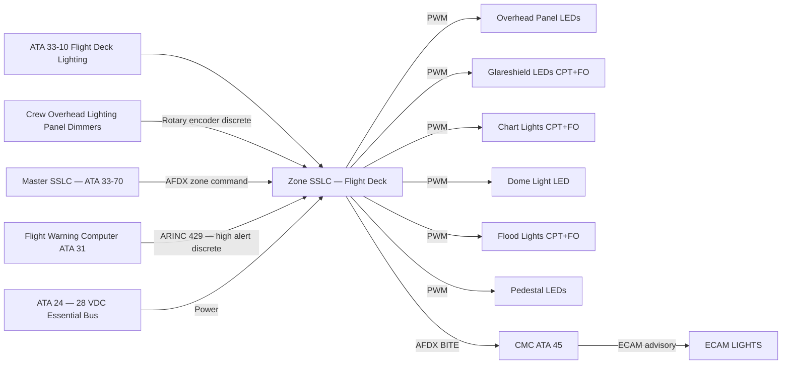
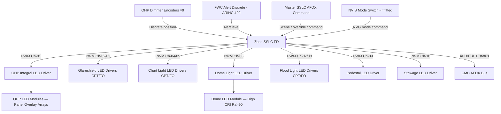
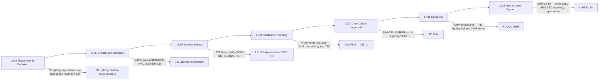

# 033-010 — Flight Deck and Crew Compartment Lighting
### AMPEL360e eWTW · ATA 33 · Q+ATLANTIDE ATLAS Scaffold

---

## §0 Hyperlink Policy

All internal links in this document use relative paths from the current directory. External regulatory and standards references use anchor links defined in [§20 References](#20-references). Links marked **TBD** indicate targets not yet allocated within the CSDB or ATLAS hierarchy. Programme-level links traverse five directory levels (`../../../../../`) to reach the repository root. No absolute URLs are used for internal navigation.

---

## §1 Purpose

This document describes the Flight Deck and Crew Compartment Lighting subsystem (ATA 033-10) of the AMPEL360e eWTW aircraft. It covers all lighting functions within the flight deck envelope: overhead panel integral backlighting, glareshield lighting, chart/map lighting, dome light, flood lighting, stowage compartment illumination, and emergency flashlight provisions. The document also addresses Night Vision Imaging System (NVIS) compatibility requirements, dimming architecture via the Zone SSLC, power interface, and CMC/ECAM integration.

The flight deck lighting system is designed to support pilot visual performance across the full range of ambient light conditions — from bright daylight operations through to dark night approaches — while minimising pilot visual fatigue and supporting optimal EFIS display readability. All flight deck light sources are LED.

---

## §2 Applicability

| Attribute | Value |
|---|---|
| Programme | AMPEL360e Wide Tube-and-Wing (eWTW) |
| ATA Subsubject | 033-10 — Flight Deck and Crew Compartment Lighting |
| Aircraft Variant | eWTW-100 (baseline), eWTW-100ER |
| Lighting Technology | 100% LED — integral panel backlighting, dome, chart, flood |
| Dimming | SSLC Zone — Flight Deck; PWM 0–100% |
| NVIS Compatibility | Optional fitment — TBD (see §21) |
| Colour Temperature | 3000 K – 6500 K adjustable (TBD confirmation) |
| Colour Rendering Index | Ra > 80 target |
| Certification Basis | CS-25 Subpart D; DO-293; MIL-L-85762A (if NVIS) |
| S1000D SNS | 033-10 |
| Applicability Code | ALL |

---

## §3 System / Function Overview

The flight deck lighting system of the AMPEL360e eWTW provides illumination for: (1) the main instrument overhead panel (integral backlighting of all placards and legends), (2) the glareshield, (3) chart/map lighting at each pilot station, (4) a central dome light for general ambient illumination, (5) storm/flood lighting (wide-area illumination for high-workload phases), (6) stowage compartment lighting (crew bags, manuals), and (7) emergency flashlight stowage provisions with pilot-accessible brackets.

All dimming is performed by the Flight Deck Zone SSLC, which receives PWM set-point commands from crew rotary dimmer controls on the overhead lighting panel and from the Master SSLC over AFDX. The Zone SSLC drives individual LED driver circuits for each light group (panel, glareshield, chart, dome, flood). An auto-dim function interfaces with the EFIS/ECAM system: when a high-priority caution or warning message is displayed on the primary flight display (PFD), the SSLC receives a discrete signal from the Flight Warning Computer (FWC) via ARINC 429 and can auto-dim ambient lighting to improve message legibility (TBD — implementation details pending FWC interface definition).

NVIS compatibility: The baseline design reserves the option for NVG-compatible operation mode. In NVG mode, all visible-spectrum white light sources are attenuated or filtered such that NVG image quality (per MIL-L-85762A) is maintained. Fitment is TBD (see §21 Open Issues). If NVIS is not fitted, the NVG mode provision remains dormant.

---

## §4 Scope

### 4.1 Included
- Overhead panel integral LED backlighting (all legends, switches, and placards on main overhead panel and aft overhead panel)
- Glareshield LED lighting (captain and first officer glareshield strips)
- Chart / map lights (one per pilot station, adjustable direction, dimmable)
- Dome light (single central unit, full white / NVG red if NVIS fitted)
- Storm flood lights (one per pilot station — wide-angle white LED)
- Pedestal lighting (centre pedestal integral backlighting)
- Stowage compartment lights (ceiling or door-switched LED strips in crew stowage areas)
- Emergency flashlight brackets and charging provisions (one per pilot station)
- Flight deck Zone SSLC and its LED driver modules
- NVIS-compatible mode hardware provision (TBD fitment)

### 4.2 Excluded
- EFIS display panel luminance management — covered by ATA 31 (Indicating Systems)
- ECAM display panel lighting — covered by ATA 31
- External wing scan lights viewable from flight deck — covered by ATA 033-040 (Exterior Lighting)
- Flight crew emergency lighting (ELU in flight deck zone) — covered by ATA 033-050
- Flight deck ventilation and thermal management — covered by ATA 21

---

## §5 Architecture Description

- **LED throughout**: All flight deck light sources are LED. Panel integral lighting uses surface-mount LED arrays with diffusing optics embedded in the panel overlay. Chart lights use articulated LED spot units. The dome light uses a high-CRI (Ra > 90 target) LED module with uniform diffusion.
- **Zone SSLC — Flight Deck**: A dedicated Zone SSLC controls all flight deck LED drivers. It receives commands from the crew overhead lighting panel (rotary encoders — one per light group) and from the Master SSLC over AFDX. The Zone SSLC reports fault status to the CMC.
- **PWM dimming 0–100%**: All flight deck light groups are independently dimmable from 0% (off) to 100% (maximum brightness). Minimum perceivable level is calibrated to be below the threshold for pilot dark-adaptation disruption during night operations.
- **FWC auto-dim interface**: An ARINC 429 discrete from the FWC signals a high-priority alert condition; the Zone SSLC dims ambient lighting to improve EFIS message contrast (feature TBD — pending FWC ICD).
- **NVIS mode provision**: If NVIS fitment is confirmed, the Zone SSLC will include a mode switch to activate NVIS-compatible output levels (far-red LED drivers replacing or supplementing white sources; white LED sources attenuated below NVG saturation threshold per MIL-L-85762A).
- **Independent dimmer circuits**: Each light group (overhead panel, glareshield, chart ×2, dome, flood ×2, pedestal) has an independent driver circuit within the Zone SSLC to allow individual failure without affecting other groups.
- **Colour temperature adaptability**: LED drivers support mixed CCT LED modules enabling crew selection of CCT between 3000 K (warm white, suited for night) and 6500 K (cool white/daylight, suited for pre-flight). CCT range confirmation is TBD.

---

## §6 Functional Breakdown

| Function ID | Function Title | Description | Control Input | Driver Circuit |
|---|---|---|---|---|
| FD-001 | Overhead Panel Integral Lighting | Backlights all legends and placards on main and aft overhead panels | Crew rotary dimmer OHP INTEG | SSLC-FD Ch-01 |
| FD-002 | Glareshield Lighting | Illuminates glareshield bar — CPT and F/O stations | Crew rotary dimmer GLARE CPT / GLARE FO | SSLC-FD Ch-02 / Ch-03 |
| FD-003 | Chart Light — Captain | Articulated LED spot at CPT station for chart/manual illumination | Crew rotary dimmer CHART CPT | SSLC-FD Ch-04 |
| FD-004 | Chart Light — First Officer | Articulated LED spot at F/O station | Crew rotary dimmer CHART FO | SSLC-FD Ch-05 |
| FD-005 | Dome Light | Central overhead general ambient illumination — white / NVG red (if NVIS) | Crew push-selector DOME | SSLC-FD Ch-06 |
| FD-006 | Storm Flood Light — Captain | Wide-angle white LED flood at CPT station for high-workload / emergency | Crew push-selector FLOOD CPT | SSLC-FD Ch-07 |
| FD-007 | Storm Flood Light — First Officer | Wide-angle white LED flood at F/O station | Crew push-selector FLOOD FO | SSLC-FD Ch-08 |
| FD-008 | Pedestal Lighting | Integral backlighting of centre pedestal controls | Crew rotary dimmer PEDESTAL | SSLC-FD Ch-09 |
| FD-009 | Stowage Compartment Lights | LED strips in crew stowage areas — door-switched | Door microswitch | SSLC-FD Ch-10 |
| FD-010 | NVIS NVG Mode | Switches all white sources to NVG-compatible levels / filters | NVG mode switch (if NVIS fitted) | SSLC-FD NVIS mode |

---

## §7 System Context Diagram

---

## §8 Internal Functional Architecture

---

## §9 Lifecycle Traceability

---

## §10 Interfaces

| Interface ID | System / Chapter | Interface Type | Data / Signal | Direction | Status |
|---|---|---|---|---|---|
| IF-033-10-001 | ATA 24 Electrical Power | 28 VDC essential bus | Power for Zone SSLC-FD and all FD LED drivers | ATA24 → ATA33-10 |  |
| IF-033-10-002 | ATA 33-70 Master SSLC | AFDX | Zone scene commands; override brightness level | ATA33-70 → ATA33-10 |  |
| IF-033-10-003 | ATA 31 FWC | ARINC 429 | High-priority alert discrete for auto-dim function | ATA31 → ATA33-10 |  |
| IF-033-10-004 | ATA 45 CMC | AFDX maintenance bus | Zone SSLC-FD BITE fault data | ATA33-10 → ATA45 |  |
| IF-033-10-005 | ATA 31 ECAM | AFDX | ECAM LIGHTS FD advisory | ATA33-10 → ATA31 |  |
| IF-033-10-006 | Crew Overhead Panel | Discrete / analogue | Rotary dimmer encoder signals per light group | Crew → ATA33-10 |  |
| IF-033-10-007 | ATA 25 Furnishings (stowage) | Physical / discrete | Door microswitch for stowage compartment light activation | ATA25 → ATA33-10 |  |
| IF-033-10-008 | NVIS Mode Switch (if fitted) | Discrete | NVG mode command to Zone SSLC | Crew → ATA33-10 |  |

---

## §11 Operating Modes

| Mode ID | Mode Name | Description | Entry Condition | Exit Condition |
|---|---|---|---|---|
| OM-FD-001 | Normal Day | All FD lights at crew-selected brightness; CCT adjustable; NVIS mode off | Default on power-up | Night mode or crew change |
| OM-FD-002 | Night Dim | All FD groups dimmed to low level; CCT warm (3000 K); dome off or minimum | Crew night mode selection | Day mode |
| OM-FD-003 | Storm / Emergency Bright | All groups at 100%; flood lights on | Crew FLOOD pushbutton press | Crew deselect |
| OM-FD-004 | Auto-Dim Alert | Ambient lighting auto-dimmed upon FWC high-priority alert | FWC alert discrete received | Alert cleared or crew override |
| OM-FD-005 | NVG Mode (if NVIS fitted) | All white sources attenuated below NVG saturation; NVG-compatible illumination | NVG mode switch | NVG mode switch off |
| OM-FD-006 | Pre-Flight / Boarding | All FD lights at moderate brightness; panel lighting full | Ground power connected | Take-off |
| OM-FD-007 | Maintenance | All channels individually commandable from CMC ground test | Ground power + CMC test mode | CMC test complete |

---

## §12 Monitoring and Diagnostics

The Flight Deck Zone SSLC continuously monitors each LED driver channel for output current levels. An open-circuit condition (no current despite PWM drive) or short-circuit condition (over-current protection triggered) on any channel generates a SSLC BITE fault flag. The fault is transmitted to the CMC via the AFDX maintenance bus with the following data: zone identifier (FD), channel number (Ch-01 through Ch-10), fault type (open/short/over-temperature), time stamp, and flight phase.

SSLC self-diagnostics: The Zone SSLC performs power-on self-test (POST) on each PWM output channel at start of every flight day. POST results are logged to CMC. If POST detects a driver module fault, a maintenance advisory is generated (non-dispatch-critical unless the affected channel is a required light per MEL).

Over-temperature protection: Each LED driver module incorporates a thermal sensor. If the module temperature exceeds a threshold (TBD °C), the SSLC reduces PWM duty cycle on the affected channel to prevent LED thermal degradation.

---

## §13 Maintenance Concept

Flight Deck Zone SSLC is an LRU located in the avionics bay; replacement requires AFDX/power connector disconnection and rack extraction — line maintenance task. After SSLC replacement, a software/configuration load from the CMC is required and a POST must be performed.

Individual LED driver modules within the SSLC may be replaceable at module level (TBD — pending SSLC supplier design). If module-level replacement is not supported, the entire Zone SSLC is the replaceable unit.

LED light assemblies (dome module, chart light assemblies, glareshield strip assemblies) are line-replaceable — plug-and-socket connectors enable quick swap. Overhead panel integral LED overlay arrays are expected to require base maintenance access for replacement (OHP panel removal required).

No scheduled lamp replacement is planned. Corrective maintenance is triggered by CMC fault report or crew MEL write-up. SSLC POST results guide proactive maintenance scheduling before flight-day dispatch.

---

## §14 S1000D / CSDB Mapping

### 14.1 SNS to DMC Mapping

| SNS Code | Subsubject Title | DMC Prefix | Info Codes Planned | DMRL Status |
|---|---|---|---|---|
| 033-10 | Flight Deck and Crew Compartment Lighting | DMC-AMPEL360E-EWTW-033-10 | 040, 300, 400, 520, 720 |  |

### 14.2 Planned Data Modules

| Info Code | DM Title | Description |
|---|---|---|
| 040 | FD Lighting System Description | Architecture, components, functional description |
| 300 | FD Lighting — Normal and Abnormal Procedures | Crew use of dimmers; response to lighting failures |
| 400 | FD Lighting Maintenance Procedures | Zone SSLC test; LED assembly inspection and replacement |
| 520 | FD Lighting Fault Isolation | BITE-guided fault isolation to LRU |
| 720 | Zone SSLC-FD Removal and Installation | R&I procedure for avionics bay SSLC unit |

---

## §15 Footprints

### 15.1 Physical Footprint
- Zone SSLC-FD: avionics bay, 1 LRU — envelope TBD per SSLC supplier
- OHP LED overlay arrays: integrated with overhead panel assembly — accessible at base maintenance
- Glareshield LED strips: 2 assemblies (CPT, FO) — forward flight deck glareshield
- Chart lights: 2 articulated LED spot units — side console / pilot stations
- Dome light: 1 central overhead unit — flight deck ceiling
- Flood lights: 2 units (CPT, FO) — flight deck ceiling, forward
- Pedestal LED modules: integrated with centre pedestal panels

### 15.2 Electrical / Data Footprint
- Power: 28 VDC essential bus — total FD lighting power budget TBD (target < TBD W)
- Data: AFDX (Zone SSLC ↔ Master SSLC and CMC); ARINC 429 (FWC auto-dim discrete); discrete wiring (crew rotary encoders, stowage door switches, NVG mode switch)

### 15.3 Maintenance Footprint
- LRU: Zone SSLC-FD (avionics bay); LED assemblies (flight deck access — line maintenance for exposed assemblies)
- Tools: maintenance laptop / CMC terminal; LED photometer (for NVIS verification if fitted)
- Scheduled: none — corrective only (no lamp replacement schedule)

### 15.4 Data Footprint
- Zone SSLC-FD fault log: ≥ 100 fault entries per flight day
- POST results log: retained per AMM interval
- CMC lighting trend: FD LED string current trend vs. baseline — for predictive maintenance

---

## §16 Safety and Certification Considerations

| Requirement | Source | Description | Compliance Approach | Status |
|---|---|---|---|---|
| CS-25.771 | EASA CS-25 | Pilot compartment — adequate illumination for all controls | Photometric survey in darkened cockpit at minimum dimmer level |  |
| CS-25.773 | EASA CS-25 | Pilot compartment view — no internal reflections degrading external view | Anti-reflection analysis of FD LED assemblies and glazing |  |
| DO-293 | RTCA | LED lighting qualification — applicable to FD LED assemblies | All FD LED assemblies qualified per DO-293 environmental and photometric tests |  |
| DO-160G | RTCA | Environmental qualification | Zone SSLC-FD qualified per DO-160G categories |  |
| MIL-L-85762A | MIL-STD | NVIS compatibility (if NVIS fitted) | NVIS compatibility test if NVIS fitment confirmed |  |
| DO-178C | RTCA | Software — Zone SSLC firmware DAL assessment | DAL TBD per FHA; SSLC firmware development per DO-178C |  |

---

## §17 Verification and Validation

| V&V ID | Requirement | Method | Success Criterion | Status |
|---|---|---|---|---|
| VV-033-10-001 | CS-25.771 — Cockpit illumination | Photometric survey — darkened cockpit at min dimmer setting | All controls readable at minimum lux level (TBD lux per standard) |  |
| VV-033-10-002 | CS-25.773 — No internal reflections | Windshield reflection analysis; night flight test observation | No distracting reflections in windshield at any dimmer setting |  |
| VV-033-10-003 | DO-293 — LED qualification | DO-293 photometric and environmental test programme | All FD LED assemblies pass DO-293 qualification |  |
| VV-033-10-004 | NVIS compatibility (if fitted) | MIL-L-85762A test — NVG imagery with FD lighting at all dim levels | NVG image degradation below MIL-L-85762A threshold |  |
| VV-033-10-005 | SSLC BITE — FD zone | Lab SSLC BITE test; inject open/short faults per channel | All injected faults correctly detected and reported to CMC |  |
| VV-033-10-006 | FWC auto-dim function | Integration bench test — apply FWC alert discrete; observe SSLC response | Ambient lighting dims within TBD ms; crew override functional |  |
| VV-033-10-007 | DO-160G environmental | DO-160G test suite for Zone SSLC-FD | Pass all applicable DO-160G categories |  |

---

## §18 Glossary

| Term | Definition |
|---|---|
| CCT | Correlated Colour Temperature — measured in Kelvin (K); describes warmth (low K) or coolness (high K) of white LED light; adjustable range in FD: 3000 K–6500 K (TBD) |
| Chart light | Articulated LED spot luminaire at each pilot station, providing focused illumination for paper charts or EFB documents |
| CRI | Colour Rendering Index (Ra) — measures fidelity of colour rendering versus daylight; dome light target Ra > 90 |
| Dome light | Central overhead LED luminaire providing general ambient illumination in the flight deck |
| FWC | Flight Warning Computer — generates crew alerts and cautions; provides auto-dim discrete to Zone SSLC-FD |
| Flood light | Wide-angle LED luminaire at each pilot station for emergency or high-workload full-bright illumination |
| Glareshield | The horizontal surface at the top of the instrument panel bounding the glareshield bar; illuminated by LED strips for panel readability in low ambient light |
| NVIS | Night Vision Imaging System — NVG (Night Vision Goggles) plus NVIS-compatible lighting system; flight deck lighting must not saturate NVGs |
| NVG | Night Vision Goggles — image intensification devices worn by flight crew in some operations; sensitive to bright white-light sources |
| OHP | Overhead Panel — the overhead control panel in the flight deck containing aircraft system controls; requires integral LED backlighting for all legends |
| POST | Power-On Self-Test — automatic SSLC diagnostic executed at power-up, testing all LED driver channels |
| PWM | Pulse Width Modulation — LED dimming method; SSLC varies duty cycle of drive signal to control perceived brightness without shifting CCT |
| SSLC | Solid-State Lighting Controller — Zone SSLC-FD controls all flight deck LED driver circuits |

---

## §19 Citations

| Citation ID | Source | Title | Relevance |
|---|---|---|---|
| CIT-033-10-001 | EASA | CS-25.771 — Pilot Compartment | Illumination adequacy requirement |
| CIT-033-10-002 | EASA | CS-25.773 — Pilot Compartment View | Anti-reflection requirement |
| CIT-033-10-003 | RTCA | DO-293 — LED Aircraft Lighting | FD LED assembly qualification |
| CIT-033-10-004 | RTCA | DO-160G — Environmental Conditions | SSLC-FD environmental qualification |
| CIT-033-10-005 | MIL-STD | MIL-L-85762A — NVIS Lighting | NVIS compatibility (if fitted) |
| CIT-033-10-006 | RTCA | DO-178C — Software Considerations | SSLC firmware DAL |

---

## §20 References

| Ref ID | Document | Title | Link |
|---|---|---|---|
| REF-033-10-001 | CS-25.771 | Pilot Compartment | [EASA CS-25](#) |
| REF-033-10-002 | CS-25.773 | Pilot Compartment View | [EASA CS-25](#) |
| REF-033-10-003 | DO-293 | Min Performance Standard — LED Aircraft Lighting | [RTCA](https://www.rtca.org/) |
| REF-033-10-004 | DO-160G | Environmental Conditions and Test Procedures | [RTCA](https://www.rtca.org/) |
| REF-033-10-005 | MIL-L-85762A | Lighting — Aircraft Interior — NVIS Compatible | [MIL-STD](#) |
| REF-033-10-006 | S1000D Issue 5.0 | International Specification for Technical Publications | [s1000d.org](https://s1000d.org/) |
| REF-033-10-007 | 033-000 | ATA 33 Lights — General | [033-000-Lights-General.md](./033-000-Lights-General.md) |
| REF-033-10-008 | 033-070 | Lighting Control Dimming and Power Interfaces | [033-070](./033-070-Lighting-Control-Dimming-and-Power-Interfaces.md) |

---

## §21 Open Issues

| Issue ID | Description | Owner | Priority | Status |
|---|---|---|---|---|
| OI-033-10-001 | NVIS fitment decision — confirm whether NVG-compatible mode is required for baseline eWTW; drives Zone SSLC-FD hardware design and MIL-L-85762A test programme | Q-MECHANICS / Programme | High |  |
| OI-033-10-002 | CCT range confirmation — validate 3000 K–6500 K achievable with selected LED module supplier within cost and weight; confirm crew dimmer encoder type (analogue vs. digital) | Q-MECHANICS | Medium |  |
| OI-033-10-003 | FWC auto-dim ICD — define ARINC 429 label/word for FWC alert discrete; confirm implementation with ATA 31 team | Q-MECHANICS / ATA 31 | Medium |  |
| OI-033-10-004 | Minimum lux level at minimum dimmer setting — agree regulatory minimum with EASA per CS-25.771 compliance plan | Q-MECHANICS / ORB-LEG | High |  |
| OI-033-10-005 | Stowage compartment type and quantity — confirm number and location of crew stowage compartments requiring lighting per interior layout | Q-MECHANICS / ATA 25 | Low |  |

---

## §22 Change Log

| Revision | Date | Author | Description |
|---|---|---|---|
| 0.1.0 | 2026-05-09 | Q+ATLANTIDE / Q-MECHANICS | Initial scaffold creation — all sections drafted; TBD items identified |
