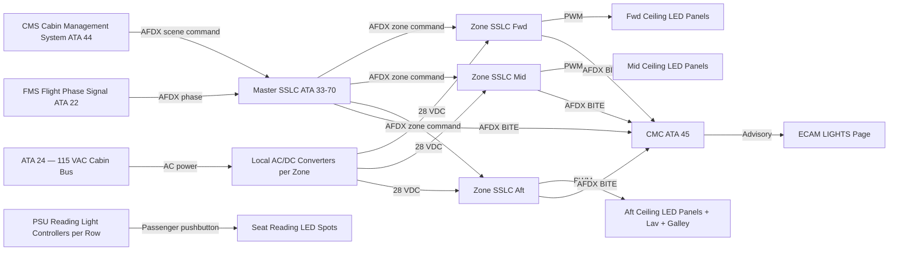
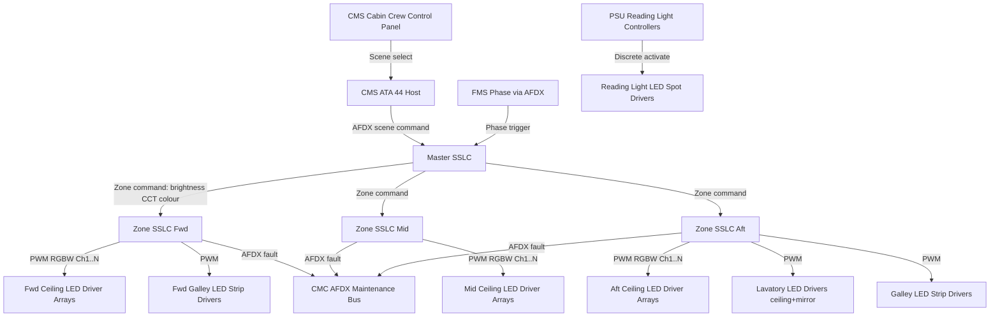
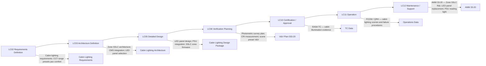

# 033-020 — Passenger Cabin Lighting
### [PROGRAMME-AIRCRAFT] [PROGRAMME-VARIANT] · ATA 33 · Q+ATLANTIDE ATLAS Scaffold

---

## §0 Hyperlink Policy

All internal links in this document use relative paths from the current directory. External regulatory and standards references use anchor links defined in [§20 References](#20-references). Links marked **TBD** indicate targets not yet allocated within the CSDB or ATLAS hierarchy. Programme-level links traverse five directory levels (`../../../../../`) to reach the repository root. No absolute URLs are used for internal navigation.

---

## §1 Purpose

This document defines the agnostic ATLAS standard-level architecture context for `033-020 — Passenger Cabin Lighting`.

It describes the controlled scope, functions, interfaces, safety considerations, lifecycle traceability, and S1000D/CSDB mapping logic that programme implementations shall instantiate when this node is applicable.

This document is not a programme design baseline. Programme-specific capacities, locations, part numbers, effectivity, operating limits, maintenance references, and data module codes shall be defined only inside the applicable programme implementation branch.
## §2 Applicability

| Applicability Level | Rule |
|---|---|
| Standard taxonomy | Applies to the ATLAS node `<NODE>` |
| Programme implementation | Conditional; determined by programme architecture, trade studies, certification basis, and applicability model |
| Product configuration | Defined in the programme-specific configuration baseline |
| Effectivity | Defined in the programme CSDB / applicability layer |
| Non-applicability | Must be explicitly stated in the programme impact-study branch when excluded |
## §3 System / Function Overview

The passenger cabin lighting system provides three levels of illumination management: (1) zone-level ambient lighting via ceiling LED panel arrays dimmable from 0–100% with adjustable CCT, (2) individual seat reading lights activated by passenger touch control or USB-adjacent push-button, and (3) lavatory and galley LED overhead fixtures.

The system is structured around three Zone SSLCs (forward, mid, aft cabin) each serving a longitudinal section of the cabin ceiling panel array. Each Zone SSLC receives scene commands from the Master SSLC over AFDX, which in turn receives commands from the CMS cabin crew panel or from flight phase logic generated by the FMS. Scene presets are stored in the Master SSLC and can be customised by the airline at delivery.

Passenger reading lights are individually activated at the seat level. The reading light controller (integrated in the Passenger Service Unit — PSU — above each seat row or group) responds to passenger pushbutton input and drives a focused LED spot at the selected seat position. Reading light status is optionally reported to the CMS for cabin management awareness (TBD per CMS capability).

Lavatory lighting: each lavatory is equipped with a ceiling LED panel (general illumination) and a mirror LED strip (cosmetic/task illumination). The lavatory light is activated by the door latch (door-closed switch) or a manual push-button. Lavatory No Smoking sign illumination is covered in ATA 033-060.

Galley lighting: overhead LED strip lighting in each galley bay is controlled by a galley local switch and optionally by the CMS zone command. Galley lights remain on during galley service operations and can be individually switched off.

---

## §4 Scope

### 4.1 Included
- Cabin ceiling LED panel arrays (addressable zones — forward, mid, aft), including RGBW or dual-CCT LED modules enabling mood colour and CCT adjustment
- Seat reading lights (LED spot per seat or per seat pair, integrated in PSU) — passenger-controlled
- Lavatory ceiling LED panels and mirror LED strips (all lavatories)
- Galley overhead LED strip lighting (all galley bays)
- Zone SSLCs (fwd, mid, aft cabin) and their LED driver modules
- Scene preset system: storage in Master SSLC; scene commands from CMS; airline customisation capability
- CMS interface via AFDX for scene command and zone status
- Cabin zone fault monitoring: CMC BITE reporting via AFDX

### 4.2 Excluded
- Passenger information signs (Fasten Seat Belts, No Smoking) — covered by ATA 033-060
- Emergency floor proximity lighting — covered by ATA 033-050
- In-flight entertainment screens — covered by ATA 44
- Passenger Service Unit (PSU) attendant call button and oxygen mask drop — covered by ATA 35 and ATA 44
- Lavatory fire detection — covered by ATA 26
- Exterior lighting — covered by ATA 033-040

---

## §5 Architecture Description

- **Addressable LED ceiling panels**: Cabin ceiling panels contain arrays of RGBW or dual-CCT white LEDs (tunable from 2700 K to 6500 K) plus colour channels (R, G, B) for mood colour effects. Addressability is at zone level as baseline; row-level addressability is a growth option pending CMS capability definition.
- **Zone SSLC architecture**: Three Zone SSLCs (fwd, mid, aft) independently control their ceiling panel arrays via PWM drive signals to LED driver modules. Each zone can be commanded independently, enabling cabin lighting gradients (e.g., gradual transition from warm to cool along cabin length for meal service).
- **Scene presets**: Predefined scenes stored in Master SSLC memory include: Boarding (warm white 3000 K, 70% brightness), Cruise-Day (neutral white 4000 K, 80%), Meal (neutral white 4500 K, 100%), Cruise-Night (amber 2700 K, 20%), Landing (cool white 5000 K, 100%), and Emergency (full white 6500 K, 100%). Airlines can customise scene parameters at delivery.
- **CMS integration**: CMS crew control panel sends AFDX scene commands to Master SSLC. Flight phase logic from FMS triggers automatic scene transitions. Cabin crew can override automatic scenes at the CMS panel.
- **Reading lights at seat level**: PSU-integrated LED spot per seat activated by passenger. PSU reading light controller communicates with Zone SSLC for status reporting (TBD). Reading lights are on independent circuit from ceiling ambient panels.
- **Lavatory lights with door interlock**: Lavatory ceiling LEDs activate on door latch (door-closed microswitsch). If door is open (occupied indicator reset), lights can be maintained by manual push-button for cleaning.
- **Fault monitoring and reporting**: Zone SSLCs report failed LED string percentage above threshold (TBD, e.g., >10% of strings in zone) to CMC via AFDX. Non-urgent lighting degradation is advisory level on ECAM; loss of a full zone is a maintenance caution.
- **Power**: 115 VAC cabin bus → local AC/DC converter → 28 VDC → LED drivers within each Zone SSLC enclosure. Reading light PSU controllers powered from 28 VDC seat supply.

---

## §6 Functional Breakdown

| Function ID | Function Title | Description | Zone | Driver |
|---|---|---|---|---|
| CAB-001 | Ceiling Ambient — Forward Zone | Ceiling LED panel array in forward cabin section; full dimming and CCT | Fwd cabin | Zone SSLC Fwd |
| CAB-002 | Ceiling Ambient — Mid Zone | Ceiling LED panel array in mid cabin section | Mid cabin | Zone SSLC Mid |
| CAB-003 | Ceiling Ambient — Aft Zone | Ceiling LED panel array in aft cabin section | Aft cabin | Zone SSLC Aft |
| CAB-004 | Seat Reading Lights | Individual LED spot per seat or seat pair; passenger push-button in PSU | All zones | PSU reading light controllers |
| CAB-005 | Lavatory Ceiling Lighting | General illumination in lavatories — activated by door latch or manual push-button | Lavatory | Zone SSLC Aft (or dedicated) |
| CAB-006 | Lavatory Mirror Lighting | Task lighting — LED strip above mirror in each lavatory | Lavatory | Zone SSLC Aft (or dedicated) |
| CAB-007 | Galley Overhead Lighting | LED strip overhead in each galley bay — local switch and CMS zone control | Galley fwd / aft | Zone SSLC Fwd/Aft |
| CAB-008 | Scene Preset Management | Storage, selection, and transmission of scene presets to Zone SSLCs | All | Master SSLC |
| CAB-009 | CMS Automatic Scene Sequencing | Automatic scene change based on flight phase FMS signal | All | Master SSLC ↔ CMS |

---

## §7 System Context Diagram

---

## §8 Internal Functional Architecture

---

## §9 Lifecycle Traceability

---

## §10 Interfaces

| Interface ID | System / Chapter | Interface Type | Data / Signal | Direction | Status |
|---|---|---|---|---|---|
| IF-033-20-001 | ATA 24 Electrical Power | 115 VAC cabin bus | AC power for cabin LED driver AC/DC converters | ATA24 → ATA33-20 |  |
| IF-033-20-002 | ATA 33-70 Master SSLC | AFDX | Zone scene commands (brightness, CCT, colour) | ATA33-70 → ATA33-20 |  |
| IF-033-20-003 | ATA 44 CMS | AFDX | Scene preset selection; individual zone override from CMS crew panel | ATA44 → ATA33-20 |  |
| IF-033-20-004 | ATA 22 FMS | AFDX | Flight phase signal for automatic scene sequencing | ATA22 → ATA33-20 |  |
| IF-033-20-005 | ATA 45 CMC | AFDX maintenance bus | Zone SSLC BITE fault data — all three cabin zones | ATA33-20 → ATA45 |  |
| IF-033-20-006 | ATA 31 ECAM | AFDX | ECAM LIGHTS cabin advisory | ATA33-20 → ATA31 |  |
| IF-033-20-007 | ATA 25 Furnishings (PSU) | Physical / discrete | PSU reading light pushbutton and driver integration | ATA25 ↔ ATA33-20 |  |
| IF-033-20-008 | ATA 25 Furnishings (lavatories) | Physical / discrete | Lavatory door microswitch for lighting activation | ATA25 → ATA33-20 |  |
| IF-033-20-009 | ATA 44 CMS (galley) | Discrete / AFDX | Galley lighting control from galley local panel and CMS | ATA44 / galley → ATA33-20 |  |

---

## §11 Operating Modes

| Mode ID | Mode Name | CCT | Brightness | Entry Condition | Exit Condition |
|---|---|---|---|---|---|
| OM-CAB-001 | Boarding | 3000 K (warm white) | 70% | Ground, door open / CMS boarding preset | Push-back / door close |
| OM-CAB-002 | Cruise Day | 4000 K (neutral white) | 80% | FMS cruise phase | FMS descent or crew change |
| OM-CAB-003 | Meal Service | 4500 K (neutral white) | 100% | Crew CMS selection | Crew cancel |
| OM-CAB-004 | Cruise Night | 2700 K (amber) | 20% | Crew night selection or FMS night | Crew cancel or descent |
| OM-CAB-005 | Landing Preparation | 5000 K (cool white) | 100% | FMS descent / approach phase | Touchdown + taxi |
| OM-CAB-006 | Deboarding | 3000 K (warm white) | 80% | Arrival at gate, door open | All passengers off |
| OM-CAB-007 | Emergency | 6500 K (full white) | 100% | Crew command or emergency lighting activation | Evacuation complete |
| OM-CAB-008 | Reading Light Only | N/A (per scene) | Cabin ambient at 0–20%; reading lights individual | Night mode with passenger reading light on | Passenger off |
| OM-CAB-009 | Maintenance | All zones independently commandable | CMC/maintenance | Ground power + CMC maintenance mode | CMC test complete |

---

## §12 Monitoring and Diagnostics

Zone SSLCs (Fwd, Mid, Aft) continuously monitor LED driver output currents and voltages on each driver channel. A fault is raised when: (a) an LED string shows open-circuit (driver current = 0 against active PWM command), (b) over-current protection triggers on a driver channel indicating short-circuit, or (c) driver module temperature exceeds threshold (TBD °C) triggering thermal protection.

Fault severity levels for cabin lighting:
- **Advisory**: single LED string failure in a zone below TBD% of zone total — CMC log entry, no ECAM alert; cabin crew notified at CMS panel (LED string indicator)
- **Caution**: LED string failures above TBD% threshold in one zone — ECAM LIGHTS caution advisory; CMC fault entry with zone identifier; cabin crew may select alternative scene
- **Warning**: complete loss of a cabin zone — ECAM LIGHTS warning; MEL check required

Reading light PSU controller faults (if monitored): reported to CMC via AFDX (TBD — depends on PSU integration level with CMS/SSLC).

---

## §13 Maintenance Concept

Zone SSLC units are LRU items in the avionics bay or distributed cabin zone enclosures (TBD per detailed installation design). Replacement is a line maintenance task. After Zone SSLC replacement, configuration data load from CMC is required, followed by a POST verification of all driver channels.

Cabin ceiling LED panel sections: LED panel arrays are integrated with the overhead cabin interior structure. Individual panel sections are replaceable at line maintenance level (snap-fit or screw-retain per supplier design). LED panel replacement does not require cabin structural access.

PSU reading light assemblies: reading light LED spot units are replaceable at the PSU level or individual spot level (TBD per PSU supplier design) — line maintenance task.

Lavatory lighting: lavatory ceiling LED panel and mirror strip are replaceable at section level — line maintenance task. Lavatory door microswitch for light activation is a standard interior furnishing spare.

Galley lighting: galley LED strip sections are replaceable at line maintenance level. Strip replacement requires galley panel access.

No scheduled lamp replacement across all cabin lighting — corrective maintenance only, triggered by CMC fault report or crew observation.

---

## §14 S1000D / CSDB Mapping

### 14.1 SNS to DMC Mapping

| SNS Code | Subsubject Title | DMC Prefix | Info Codes Planned | DMRL Status |
|---|---|---|---|---|
| 033-20 | Passenger Cabin Lighting | DMC-<PROGRAMME>-<VARIANT>-033-20 | 040, 300, 400, 520, 720, 941 |  |

### 14.2 Planned Data Modules

| Info Code | DM Title | Description |
|---|---|---|
| 040 | Cabin Lighting System Description | Architecture, LED panels, scene presets, CMS integration |
| 300 | Cabin Lighting — Normal and Abnormal Procedures | Scene selection; lighting failure crew action |
| 400 | Cabin Lighting Maintenance Procedures | Zone SSLC test; LED panel and reading light R&I; lavatory light R&I |
| 520 | Cabin Lighting Fault Isolation | BITE-guided isolation to zone, driver, or LED panel |
| 720 | Zone SSLC Cabin Removal and Installation | R&I procedure |
| 941 | Cabin LED Panel IPD | Illustrated parts data for ceiling panel assemblies |

---

## §15 Footprints

### 15.1 Physical Footprint
- Zone SSLCs (×3 cabin zones): avionics bay or cabin zone enclosures — envelope TBD
- Cabin ceiling LED panel arrays: full overhead cabin coverage from fwd galley to aft; panel dimensions per interior layout TBD
- PSU reading light spots: one per seat or seat pair, integrated in PSU — per aircraft interior layout
- Lavatory ceiling LED panels + mirror strips: per lavatory count TBD ([PROGRAMME-VARIANT]-100: typically 2 lavatories)
- Galley LED strips: forward galley + aft galley — linear LED strip assemblies

### 15.2 Electrical / Data Footprint
- Power: 115 VAC cabin bus → local AC/DC → 28 VDC per zone; total cabin lighting power budget TBD (target < TBD W normal cruise)
- Data: AFDX (zone SSLCs ↔ Master SSLC and CMC); AFDX (CMS → Master SSLC); discrete wiring (PSU pushbutton, lavatory door switch, galley local switch)

### 15.3 Maintenance Footprint
- LRUs: Zone SSLCs, LED ceiling panel sections, PSU reading light assemblies, lavatory LED panels/strips, galley LED strips
- Tools: maintenance laptop / CMC terminal; LED photometer / colorimeter (for CCT and CRI verification)
- Scheduled: none — corrective only; ELU SOH-conditioned for emergency lighting (ATA 033-050)

### 15.4 Data Footprint
- Zone SSLC fault logs: ≥ 200 fault entries per zone SSLC
- CMC cabin lighting trend: LED string current degradation trend per zone
- Scene preset storage: airline-customisable table in Master SSLC — retained through power cycles

---

## §16 Safety and Certification Considerations

| Requirement | Source | Description | Compliance Approach | Status |
|---|---|---|---|---|
| CS-25.812 | EASA CS-25 | Emergency lighting — cabin must have emergency lighting independent of main system | Emergency lighting covered by ATA 033-050 (ELU system); cabin Zone SSLCs do not contribute to emergency path |  |
| CS-25.785 | EASA CS-25 | Seats, berths, safety belts — associated Fasten Seat Belt sign illumination | Sign illumination covered by ATA 033-060; cabin ambient illumination supports sign readability |  |
| DO-293 | RTCA | LED lighting equipment qualification | All cabin LED panel assemblies qualified per DO-293 |  |
| DO-160G | RTCA | Environmental qualification for Zone SSLCs | Zone SSLCs qualified per DO-160G categories relevant to cabin environment |  |
| AC 25.812-2 | FAA | Emergency lighting guidance | Cabin ambient lighting system is independent of emergency system; this section does not affect AC 25.812-2 compliance | N/A |
| CS-25.791 | EASA CS-25 | Passenger information signs — illuminated | Signs illuminated independently of cabin ambient system; cabin ambient light level must not degrade sign legibility |  |

---

## §17 Verification and Validation

| V&V ID | Requirement | Method | Success Criterion | Status |
|---|---|---|---|---|
| VV-033-20-001 | Cabin illuminance — normal operations | Photometric survey in cabin at each scene preset | Illuminance levels at seat and aisle meet design targets (lux TBD) |  |
| VV-033-20-002 | CCT accuracy | Colorimetric measurement at ceiling panel surface in each scene | CCT within ±TBD K of specified scene value |  |
| VV-033-20-003 | CRI — cabin LED panels | CRI measurement at ceiling panel surface | CRI Ra > 80 at all CCT settings |  |
| VV-033-20-004 | Scene preset transitions | Functional test: initiate each scene preset via CMS panel | Scene activated within TBD seconds; correct CCT and brightness in all zones |  |
| VV-033-20-005 | Dimming range | Functional test: dim each zone from 0% to 100% | Smooth dimming with no flicker; consistent colour at all dim levels |  |
| VV-033-20-006 | SSLC BITE — cabin zones | Lab SSLC BITE test; inject faults on LED driver channels | All injected faults detected, classified, and reported to CMC correctly |  |
| VV-033-20-007 | DO-293 — cabin LED panel qualification | DO-293 photometric and environmental test | Cabin LED panels pass DO-293 |  |
| VV-033-20-008 | DO-160G — Zone SSLC environmental | DO-160G test suite | Pass all applicable DO-160G categories for cabin zone |  |
| VV-033-20-009 | CMS integration | CMS integration bench test and aircraft integration test | Correct scene commands transmitted from CMS to Master SSLC; correct zone response |  |
| VV-033-20-010 | Flight phase automatic scene change | Flight test or FMS simulation bench | Correct scene activates at FMS phase transitions; crew override functional |  |

---

## §18 Glossary

| Term | Definition |
|---|---|
| Addressable LED panel | A ceiling panel whose brightness and CCT can be independently commanded; on [PROGRAMME-VARIANT], addressability is at zone level (baseline); row-level is growth option |
| CCT | Correlated Colour Temperature — measured in Kelvin; cabin range 2700 K (warm amber) to 6500 K (cool white); mood lighting exploits this range for scene differentiation |
| CMS | Cabin Management System — ATA 44 hosted system controlling cabin functions including lighting scene selection from the cabin crew control panel |
| CRI / Ra | Colour Rendering Index — scale 0–100 measuring how well a light source renders object colours; cabin target Ra > 80 ensures natural appearance of passengers and food |
| Dimming | Reduction of LED brightness via PWM duty cycle control; 0–100% range; colour temperature maintained constant across dimming range with tunable LED drivers |
| Galley | The food and beverage preparation area in the aircraft; equipped with overhead LED strip lighting for food preparation and service visibility |
| LED ceiling panel | A flat LED-based lighting panel integrated into the cabin overhead structure; provides primary ambient illumination |
| Mood lighting | Generic term for adjustable-colour cabin lighting allowing CCT and sometimes RGB colour variation; key airline brand differentiator |
| PSU | Passenger Service Unit — the overhead unit above each seat row providing reading light, attendant call button, oxygen mask, and gasper air outlets |
| RGBW LED | Red-Green-Blue-White LED — a multi-chip LED enabling both colour (RGB) and tunable white (W) output from a single unit; used in mood lighting panels |
| Scene preset | A predefined combination of zone brightness levels, CCT, and (if RGBW) colour values stored in Master SSLC and selectable as a single command |
| Zone SSLC | Solid-State Lighting Controller assigned to a cabin zone (fwd, mid, aft); manages all LED driver channels in that zone via PWM commands |

---

## §19 Citations

| Citation ID | Source | Title | Relevance |
|---|---|---|---|
| CIT-033-20-001 | EASA | CS-25.812 — Emergency Lighting | Emergency system independence reference |
| CIT-033-20-002 | EASA | CS-25.791 — Passenger Information Signs | Sign legibility in cabin lighting context |
| CIT-033-20-003 | RTCA | DO-293 — LED Aircraft Lighting | Cabin LED panel qualification |
| CIT-033-20-004 | RTCA | DO-160G | Zone SSLC environmental qualification |
| CIT-033-20-005 | SAE | AS50881 — Wiring Aerospace Vehicle | Cabin lighting wiring standards |
| CIT-033-20-006 | ASD-STAN | S1000D Issue 5.0 | CSDB mapping |

---

## §20 References

| Ref ID | Document | Title | Link |
|---|---|---|---|
| REF-033-20-001 | CS-25.812 | Emergency Lighting | [EASA CS-25](#) |
| REF-033-20-002 | CS-25.791 | Passenger Information Signs | [EASA CS-25](#) |
| REF-033-20-003 | DO-293 | LED Aircraft Lighting | [RTCA](https://www.rtca.org/) |
| REF-033-20-004 | DO-160G | Environmental Conditions | [RTCA](https://www.rtca.org/) |
| REF-033-20-005 | S1000D Issue 5.0 | Technical Publications | [s1000d.org](https://s1000d.org/) |
| REF-033-20-006 | 033-000 | ATA 33 Lights — General | [033-000-Lights-General.md](./033-000-Lights-General.md) |
| REF-033-20-007 | 033-070 | Lighting Control Dimming and Power | [033-070](./033-070-Lighting-Control-Dimming-and-Power-Interfaces.md) |
| REF-033-20-008 | 033-050 | Emergency Lighting | [033-050](./033-050-Emergency-Lighting.md) |

---

## §21 Open Issues

| Issue ID | Description | Owner | Priority | Status |
|---|---|---|---|---|
| OI-033-20-001 | CCT range confirmation — validate 2700 K–6500 K range achievable with selected LED panel supplier; confirm RGBW vs. dual-CCT module approach | Q-MECHANICS | High |  |
| OI-033-20-002 | Row-level addressability — confirm whether CMS and Zone SSLC hardware support row-level (vs. zone-level) dimming command; impacts LED driver module count and AFDX traffic | Q-MECHANICS / ATA 44 | Medium |  |
| OI-033-20-003 | Illuminance targets per scene — define lux values at seat level and aisle for each scene preset to support photometric V&V plan | Q-MECHANICS / Q-AIR | Medium |  |
| OI-033-20-004 | PSU reading light CMC reporting — confirm with ATA 44 / PSU supplier whether individual reading light status is reported to CMS and/or CMC | Q-MECHANICS / ATA 44 | Low |  |
| OI-033-20-005 | Galley lighting local switch type — confirm whether galley lighting is fully CMS-controlled or has local override panel; impacts wiring and control architecture | Q-MECHANICS / ATA 25 | Low |  |

---

## §22 Change Log

| Revision | Date | Author | Description |
|---|---|---|---|
| 0.1.0 | 2026-05-09 | Q+ATLANTIDE / Q-MECHANICS | Initial scaffold creation — all sections drafted; TBD items identified |
