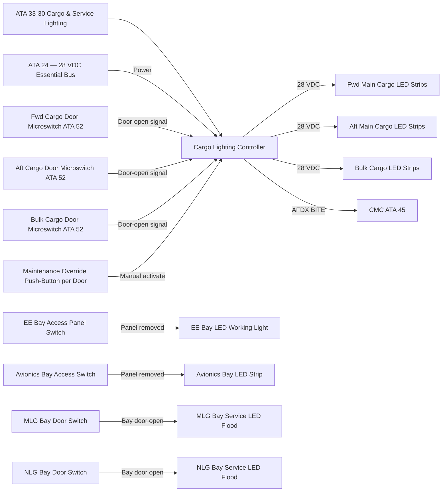
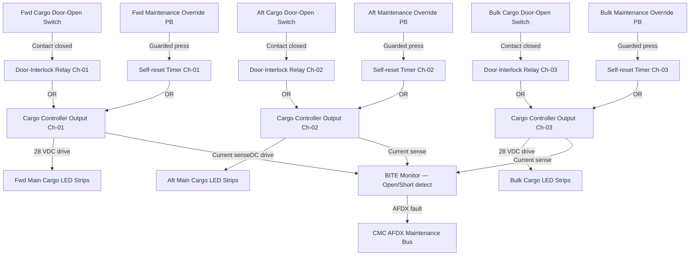
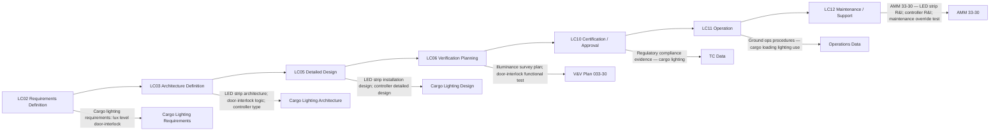

# 033-030 — Cargo and Service Compartment Lighting
### AMPEL360e eWTW · ATA 33 · Q+ATLANTIDE ATLAS Scaffold

---

## §0 Hyperlink Policy

All internal links in this document use relative paths from the current directory. External regulatory and standards references use anchor links defined in [§20 References](#20-references). Links marked **TBD** indicate targets not yet allocated within the CSDB or ATLAS hierarchy. Programme-level links traverse five directory levels (`../../../../../`) to reach the repository root. No absolute URLs are used for internal navigation.

---

## §1 Purpose

This document describes the Cargo and Service Compartment Lighting subsystem (ATA 033-30) of the AMPEL360e eWTW aircraft. It covers all LED lighting functions in cargo-carrying areas (main cargo hold — forward and aft sections, and bulk cargo hold) and in aircraft service and equipment bays (Electronic Equipment (EE) bay, avionics bay, main gear bays, and other service access areas). The document defines the door-interlock logic, illuminance targets, power interface, and CMC fault monitoring strategy.

Cargo and service compartment lighting supports ground operations safety (ensuring adequate illumination during cargo loading/unloading), maintenance access (enabling technicians to safely access and work in equipment bays), and regulatory compliance (cargo smoke detection visibility support).

---

## §2 Applicability

| Attribute | Value |
|---|---|
| Programme | AMPEL360e Wide Tube-and-Wing (eWTW) |
| ATA Subsubject | 033-30 — Cargo and Service Compartment Lighting |
| Aircraft Variant | eWTW-100 (baseline), eWTW-100ER |
| Lighting Technology | 100% LED strip and panel lighting |
| Dimming | Fixed intensity (no dimming in cargo/service areas) |
| Target Illuminance | TBD — typically 50–200 lux at cargo floor level (see §21) |
| Door Interlock | Lights off when cargo door closed; on when door open (with maintenance override) |
| Power | 28 VDC essential bus (cargo areas); 28 VDC essential bus (service bays) |
| S1000D SNS | 033-30 |
| Applicability Code | ALL |

---

## §3 System / Function Overview

Cargo and service compartment lighting on the AMPEL360e eWTW uses LED strip luminaires mounted on the upper sidewall or ceiling structure of each cargo bay and service bay. All lighting operates at fixed intensity (no dimming required in cargo or service areas). The primary control logic is the door-interlock: cargo bay LED lights automatically activate when the cargo door opens (door-open microswitch signal) and de-activate when the door closes, minimising unnecessary power consumption and heat generation in sealed bays.

A maintenance override function allows ground personnel to activate cargo bay lighting with the cargo door closed, for pre-loading inspection or maintenance access without requiring the door to be opened. The maintenance override is activated by a push-button on the cargo door surround panel.

Service and equipment bays (EE bay, avionics bay, nose landing gear bay, main landing gear bays) are equipped with LED strip or panel lights activated by a door-switch interlock (access panel or door open = light on) or by a manual push-button inside the bay. These service lights allow maintenance technicians to work safely in equipment bays with hands-free illumination.

---

## §4 Scope

### 4.1 Included
- Main cargo hold LED strip lighting — forward section (fwd of wing box) and aft section (aft of wing box)
- Bulk cargo hold LED strip lighting (aft belly compartment)
- Cargo bay door-interlock logic (lights on = door open; lights off = door closed)
- Maintenance override push-button per cargo door surround panel
- EE (Electronic Equipment) bay LED working lights — door-switch activated
- Avionics bay LED working lights — access panel switch activated
- Main landing gear bay service lights — door-activated (when gear bay door open for maintenance)
- Nose landing gear bay service light — door-activated
- CMC fault monitoring for all cargo and service bay lighting circuits

### 4.2 Excluded
- Cargo management system (ULD tracking, weight and balance) — covered by ATA 58 (if applicable)
- Cargo smoke detection systems — covered by ATA 26
- Cargo hold fire suppression — covered by ATA 26
- Freight handling equipment lighting (ground equipment)
- Passenger cabin lighting — covered by ATA 033-020
- Exterior belly pod or underbelly inspection lights — covered by ATA 033-040

---

## §5 Architecture Description

- **LED strip technology**: All cargo and service bay lighting uses surface-mount LED strip luminaires mounted to aluminium extrusion carriers on bay walls or ceiling structure. LED strips provide uniform illumination across the cargo floor and sidewalls without shadow zones that could obscure cargo labels or damage detection.
- **Fixed intensity — no dimming**: Cargo and service area lights operate at a single fixed intensity level (100% when active). Variable dimming is not required and not implemented in these areas, simplifying the driver circuit.
- **Door-interlock logic**: Each cargo door microswitch signal drives a relay circuit in the cargo lighting controller (or directly in the aircraft door control wiring — TBD per ICD with ATA 52/door systems). Lights-on signal is active only when the door-open microswitch is closed (door fully open and locked in open position). Closing the door de-activates lighting automatically.
- **Maintenance override**: A guarded push-button on the external cargo door surround panel (or internal door frame) allows ground personnel to activate cargo bay lights with the door closed. Override is self-resetting (timer-based, typically 30 minutes) or reset on door cycle (TBD per detailed design).
- **Service bay lights — access panel switched**: EE bay, avionics bay, and gear bay lights use panel-mount microswitches (access panel or door open = normally-closed contact = light circuit complete). Removing the access panel or opening the bay door automatically activates the light.
- **Power from 28 VDC essential bus**: All cargo and service bay lighting circuits are powered from the 28 VDC essential bus to ensure availability on ground power and during maintenance with aircraft main power off (provided ground power unit is connected).
- **CMC fault monitoring**: Each lighting circuit in cargo and service bays is monitored for open-circuit conditions by the cargo lighting controller. Faults are reported to CMC via AFDX.
- **ATA 26 coordination**: Cargo bay lighting co-exists with smoke detector installations. LED strips are positioned to avoid shadowing smoke detector windows (coordination with ATA 26 required at detailed installation design stage).

---

## §6 Functional Breakdown

| Function ID | Function Title | Description | Activation | Power |
|---|---|---|---|---|
| CGO-001 | Main Cargo Hold — Fwd Section Lighting | LED strip illumination in forward main cargo bay (fwd of wing box) | Door-open microswitch + maintenance override | 28 VDC essential bus |
| CGO-002 | Main Cargo Hold — Aft Section Lighting | LED strip illumination in aft main cargo bay (aft of wing box) | Door-open microswitch + maintenance override | 28 VDC essential bus |
| CGO-003 | Bulk Cargo Hold Lighting | LED strip illumination in aft bulk cargo hold | Bulk door-open microswitch + maintenance override | 28 VDC essential bus |
| CGO-004 | Door-Interlock Logic | Cargo bay lights automatically activate on door-open signal; de-activate on door-closed signal | Cargo door microswitch (per door) | N/A — control logic |
| CGO-005 | Maintenance Override | Activates cargo bay lighting with door closed; self-resetting timer | Guarded push-button on cargo door surround | 28 VDC essential bus |
| SVC-001 | EE Bay Working Light | LED panel or strip in Electronic Equipment bay — activates on access panel removal | Access panel microswitch | 28 VDC essential bus |
| SVC-002 | Avionics Bay Working Light | LED strip in avionics bay — activates on bay access panel removal | Access panel microswitch | 28 VDC essential bus |
| SVC-003 | Main Gear Bay Service Light | LED flood in MLG bay — activates when gear bay door opened for maintenance | Gear bay door position switch | 28 VDC essential bus |
| SVC-004 | Nose Gear Bay Service Light | LED flood in NLG bay — activates when NLG bay door opened for maintenance | NLG bay door position switch | 28 VDC essential bus |

---

## §7 System Context Diagram

---

## §8 Internal Functional Architecture

---

## §9 Lifecycle Traceability

---

## §10 Interfaces

| Interface ID | System / Chapter | Interface Type | Data / Signal | Direction | Status |
|---|---|---|---|---|---|
| IF-033-30-001 | ATA 24 Electrical Power | 28 VDC essential bus | Power for cargo lighting controller and all cargo/service bay LED circuits | ATA24 → ATA33-30 |  |
| IF-033-30-002 | ATA 52 Doors | Discrete (microswitch) | Cargo door open/closed signal for door-interlock logic | ATA52 → ATA33-30 |  |
| IF-033-30-003 | ATA 32 Landing Gear | Discrete | MLG and NLG bay door position for service light activation | ATA32 → ATA33-30 |  |
| IF-033-30-004 | ATA 45 CMC | AFDX maintenance bus | Cargo lighting controller BITE fault data | ATA33-30 → ATA45 |  |
| IF-033-30-005 | ATA 26 Fire Protection | Coordination | Cargo smoke detector positioning relative to LED strip luminaires | ATA26 ↔ ATA33-30 |  |
| IF-033-30-006 | ATA 25 Furnishings | Physical | EE bay and avionics bay access panel microswitches | ATA25 → ATA33-30 |  |

---

## §11 Operating Modes

| Mode ID | Mode Name | Description | Entry Condition | Exit Condition |
|---|---|---|---|---|
| OM-CGO-001 | Cargo Load / Unload — Door Open | All LED strips in open cargo bay at full intensity | Cargo door-open microswitch active | Cargo door closed |
| OM-CGO-002 | Cargo Bay Sealed — Lights Off | LED strips off; bay sealed | Cargo door closed | Cargo door opened |
| OM-CGO-003 | Maintenance Override | Cargo bay lights on with door closed; timer active | Maintenance override push-button pressed | Timer expires (TBD min) or door opened |
| OM-CGO-004 | Service Bay — Access Panel Removed | EE bay / avionics bay LED working lights on | Access panel removed | Panel replaced |
| OM-CGO-005 | Gear Bay Service | MLG/NLG bay service lights on | Gear bay door opened for maintenance | Gear bay door closed |
| OM-CGO-006 | Maintenance / Ground Test | All cargo/service lighting circuits individually commandable from CMC | Ground power + CMC maintenance mode | CMC test complete |

---

## §12 Monitoring and Diagnostics

The cargo lighting controller monitors each LED strip circuit for open-circuit and short-circuit conditions using current sensing on each 28 VDC drive channel. An open-circuit fault (drive active; current = 0) indicates LED strip failure or connector break. A short-circuit fault (drive active; over-current protection triggered) indicates wiring or LED strip short. Both fault conditions are logged to the CMC via AFDX with: circuit identifier (e.g., "FWD CARGO STRIP CH-01"), fault type, time stamp, and door state (open/closed) at time of fault.

Maintenance override timer: the self-reset timer state is monitored. An override that fails to reset (timer hardware fault) is logged as a controller fault.

Service bay lights (EE bay, avionics bay, gear bays): monitored by access panel / door switch state and circuit current. Faults logged as above. Service bay light faults are low-priority maintenance advisories (no operational dispatch impact unless MEL requires a specific bay light).

Ground test: all cargo and service bay lighting circuits can be individually activated and deactivated via CMC maintenance test mode without operating the physical doors. This allows verification of the wiring circuit independently of door-interlock hardware.

---

## §13 Maintenance Concept

Cargo LED strip sections are designed for line maintenance replacement. Strips are attached to aluminium carrier extrusions on cargo bay walls/ceiling and secured with quick-release fasteners or clips. Replacement requires disconnection of strip connector and removal of fasteners — estimated task duration < 30 minutes per section. LED strip sections are modular (e.g., 1-metre sections) so that a partial failure does not require full-bay strip replacement.

Cargo lighting controller: LRU item located in the EE bay or adjacent to cargo door frame (TBD per detailed installation design). Replacement requires connector disconnection and LRU exchange — line maintenance task.

Maintenance override push-button: field-replaceable component on cargo door surround panel — line maintenance task.

Service bay LED working lights (EE bay, avionics bay, gear bays): LED strip or panel is accessible during normal maintenance access to the bay. Replacement is incidental to bay access — line maintenance task.

No scheduled replacement — corrective only, triggered by CMC fault report or ground crew observation.

---

## §14 S1000D / CSDB Mapping

### 14.1 SNS to DMC Mapping

| SNS Code | Subsubject Title | DMC Prefix | Info Codes Planned | DMRL Status |
|---|---|---|---|---|
| 033-30 | Cargo and Service Compartment Lighting | DMC-AMPEL360E-EWTW-033-30 | 040, 300, 400, 520, 720 |  |

### 14.2 Planned Data Modules

| Info Code | DM Title | Description |
|---|---|---|
| 040 | Cargo & Service Lighting System Description | Architecture, LED strips, door-interlock, maintenance override |
| 300 | Cargo & Service Lighting — Normal Procedures | Cargo loading lighting use; service bay light use |
| 400 | Cargo & Service Lighting Maintenance Procedures | LED strip replacement; controller test; maintenance override test |
| 520 | Cargo & Service Lighting Fault Isolation | BITE-guided isolation to circuit, LED strip section, or controller |
| 720 | Cargo Lighting Controller Removal and Installation | R&I procedure |

---

## §15 Footprints

### 15.1 Physical Footprint
- Main cargo hold LED strips (fwd + aft): longitudinal strips on upper sidewall and ceiling of cargo bay — strip length per bay dimensions TBD
- Bulk cargo hold LED strips: sidewall strips — length TBD
- Cargo lighting controller: 1 LRU per aircraft — EE bay or cargo door area — envelope TBD
- Maintenance override push-buttons: 1 per cargo door surround panel
- EE bay working light: 1 LED panel/strip — accessible from EE bay access panel
- Avionics bay working light: 1–2 LED strips — bay ceiling
- MLG bay service lights: 2 LED floods (port and starboard MLG bays)
- NLG bay service light: 1 LED flood

### 15.2 Electrical / Data Footprint
- Power: 28 VDC essential bus for all cargo and service bay circuits
- Total lighting power: cargo hold strips (fwd + aft + bulk) + service bays — total TBD (target < TBD W)
- Data: AFDX (cargo lighting controller ↔ CMC); discrete wiring (door microswitches, maintenance override push-buttons, access panel switches)

### 15.3 Maintenance Footprint
- LRUs: cargo lighting controller; LED strip sections (modular); maintenance override push-buttons; service bay LED assemblies
- Tools: maintenance laptop / CMC terminal; lux meter for cargo floor illuminance verification
- Scheduled: none — corrective only

### 15.4 Data Footprint
- Cargo lighting controller fault log: ≥ 100 fault entries
- CMC cargo lighting history: fault log with door state context
- Maintenance override usage log: timestamp of each override activation (useful for tracking unusual cargo operations)

---

## §16 Safety and Certification Considerations

| Requirement | Source | Description | Compliance Approach | Status |
|---|---|---|---|---|
| CS-25.857 | EASA CS-25 | Cargo compartment classification — Class B/C/E — lighting provisions affect smoke detector visibility | LED strips positioned to not obstruct smoke detector windows; ATA 26 coordination |  |
| CS-25.812 | EASA CS-25 | Emergency lighting — cargo area lighting is not part of emergency lighting system | Confirmed — cargo lighting is not an emergency system; powered from essential bus for normal operations | N/A |
| DO-293 | RTCA | LED lighting equipment qualification | Cargo bay LED strip assemblies qualified per DO-293 environmental categories |  |
| DO-160G | RTCA | Environmental qualification for cargo lighting controller | Cargo lighting controller qualified per DO-160G — cargo hold environment categories |  |
| CS-25.795 | EASA CS-25 | Cargo compartment security — lighting access controls | Maintenance override guarded push-button prevents inadvertent activation |  |

---

## §17 Verification and Validation

| V&V ID | Requirement | Method | Success Criterion | Status |
|---|---|---|---|---|
| VV-033-30-001 | Cargo floor illuminance | Lux meter survey at cargo floor level with all strips active | Illuminance ≥ TBD lux at all points on cargo floor |  |
| VV-033-30-002 | Door-interlock functional test | Functional test: open/close cargo door; observe light activation/deactivation | Light activates within TBD seconds of door open; deactivates on door close |  |
| VV-033-30-003 | Maintenance override functional test | Press maintenance override PB with door closed | Cargo lights activate; timer resets correctly after TBD minutes |  |
| VV-033-30-004 | Service bay lights — access switch test | Remove EE bay / avionics bay access panel; observe light activation | Light activates on panel removal; deactivates on panel reinstallation |  |
| VV-033-30-005 | BITE — open circuit detection | Inject open-circuit fault on cargo LED strip circuit via SSLC test mode | Fault detected, classified, and logged to CMC within TBD seconds |  |
| VV-033-30-006 | DO-293 / DO-160G environmental | DO-293 photometric and DO-160G environmental test programme | LED strips and controller pass all applicable test categories |  |
| VV-033-30-007 | Smoke detector compatibility | Verify LED strip positions do not shadow cargo smoke detectors | No shadowing of smoke detector windows at maximum loading (full ULD/cargo) |  |

---

## §18 Glossary

| Term | Definition |
|---|---|
| Bulk cargo hold | The aft-most underfloor cargo compartment typically used for loose baggage, freight, and odd-size items; not suitable for standard ULD containers |
| Cargo lighting controller | The LRU managing cargo bay LED strip power switching, door-interlock logic, maintenance override timer, and BITE for cargo lighting circuits |
| Door-interlock | A control logic function that couples cargo bay lighting activation to the position of the cargo door — lights on when door is open; off when closed |
| EE bay | Electronic Equipment bay — the dedicated aircraft compartment housing avionics LRUs and electrical distribution equipment; requires LED working lights for maintenance access |
| LED strip | A flexible or rigid printed-circuit board populated with LED packages and a resistor/driver network; used as the primary cargo hold luminaire in a linear format |
| Lux | SI unit of illuminance — lumens per square metre; used to specify cargo hold minimum illuminance at the floor working plane |
| Maintenance override | A guarded push-button that temporarily activates cargo bay lighting with the cargo door closed; typically timer-reset after a defined period |
| ULD | Unit Load Device — a standardised container or pallet used for air freight; defines the cargo bay geometry and loading pattern that affects lighting coverage requirements |

---

## §19 Citations

| Citation ID | Source | Title | Relevance |
|---|---|---|---|
| CIT-033-30-001 | EASA | CS-25.857 — Cargo Compartment Classification | Smoke detector and lighting co-existence |
| CIT-033-30-002 | RTCA | DO-293 — LED Aircraft Lighting | Cargo LED strip qualification |
| CIT-033-30-003 | RTCA | DO-160G — Environmental Conditions | Controller environmental qualification |
| CIT-033-30-004 | ASD-STAN | S1000D Issue 5.0 | CSDB mapping |

---

## §20 References

| Ref ID | Document | Title | Link |
|---|---|---|---|
| REF-033-30-001 | CS-25.857 | Cargo Compartment Classification | [EASA CS-25](#) |
| REF-033-30-002 | DO-293 | LED Aircraft Lighting | [RTCA](https://www.rtca.org/) |
| REF-033-30-003 | DO-160G | Environmental Conditions | [RTCA](https://www.rtca.org/) |
| REF-033-30-004 | S1000D Issue 5.0 | Technical Publications | [s1000d.org](https://s1000d.org/) |
| REF-033-30-005 | 033-000 | ATA 33 Lights — General | [033-000-Lights-General.md](./033-000-Lights-General.md) |
| REF-033-30-006 | ATA 26 | Fire Protection | [ATA 26 ATLAS node](#) |
| REF-033-30-007 | ATA 52 | Doors | [ATA 52 ATLAS node](#) |

---

## §21 Open Issues

| Issue ID | Description | Owner | Priority | Status |
|---|---|---|---|---|
| OI-033-30-001 | Cargo hold lux levels — define minimum illuminance target at cargo floor level for main and bulk holds; align with airline operational requirements and regulatory advisory material | Q-MECHANICS | High |  |
| OI-033-30-002 | Maintenance override timer duration — confirm self-reset timer duration for maintenance override (suggested 30 minutes); assess alternative: reset-on-door-cycle only | Q-MECHANICS / ORB-PMO | Medium |  |
| OI-033-30-003 | Cargo lighting controller location — confirm whether single controller or distributed per door; assess EE bay vs. cargo door frame installation for wiring length optimisation | Q-MECHANICS / ATA 24 | Medium |  |
| OI-033-30-004 | ATA 26 coordination — confirm LED strip positions relative to cargo smoke detector locations in each bay; requires ATA 26 and cargo bay installation design input | Q-MECHANICS / ATA 26 | High |  |
| OI-033-30-005 | MLG/NLG bay door switch type — confirm whether existing landing gear bay door switches (ATA 32 proximity switches) can be shared for service light activation or dedicated switches are required | Q-MECHANICS / ATA 32 | Low |  |

---

## §22 Change Log

| Revision | Date | Author | Description |
|---|---|---|---|
| 0.1.0 | 2026-05-09 | Q+ATLANTIDE / Q-MECHANICS | Initial scaffold creation — all sections drafted; TBD items identified |
