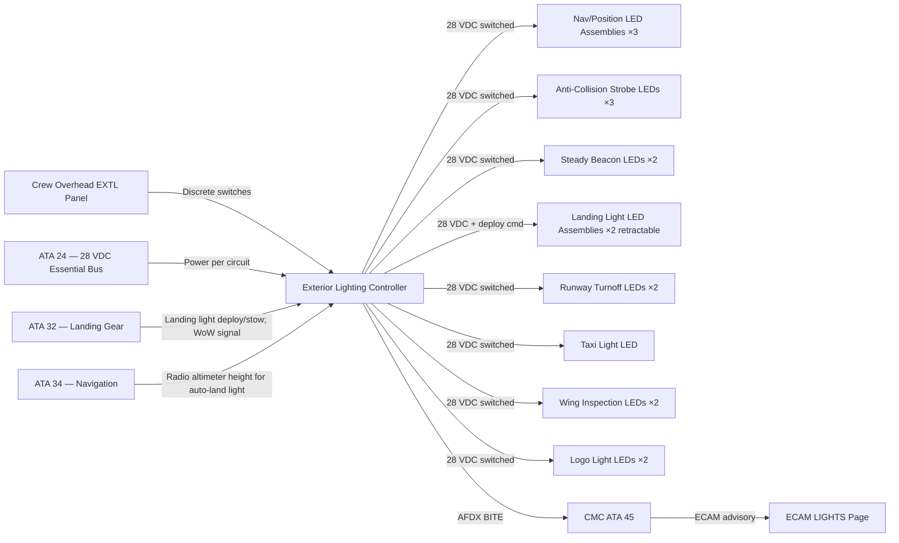
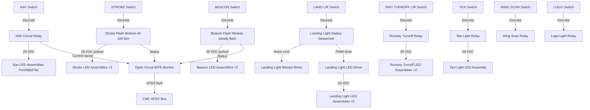
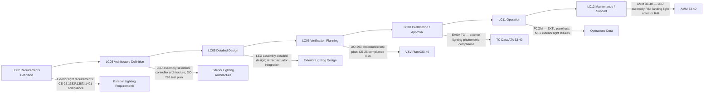

# 033-040 — Exterior Lighting
### [PROGRAMME-AIRCRAFT] [PROGRAMME-VARIANT] · ATA 33 · Q+ATLANTIDE ATLAS Scaffold

---

## §0 Hyperlink Policy

All internal links in this document use relative paths from the current directory. External regulatory and standards references use anchor links defined in [§20 References](#20-references). Links marked **TBD** indicate targets not yet allocated within the CSDB or ATLAS hierarchy. Programme-level links traverse five directory levels (`../../../../../`) to reach the repository root. No absolute URLs are used for internal navigation.

---

## §1 Purpose

This document defines the agnostic ATLAS standard-level architecture context for `033-040 — Exterior Lighting`.

It describes the controlled scope, functions, interfaces, safety considerations, lifecycle traceability, and S1000D/CSDB mapping logic that programme implementations shall instantiate when this node is applicable.

This document is not a programme design baseline. Programme-specific capacities, locations, part numbers, effectivity, operating limits, maintenance references, and data module codes shall be defined only inside the applicable programme implementation branch.
## §2 Applicability

| Applicability Level | Rule |
|---|---|
| Standard taxonomy | Applies to the ATLAS node `<NODE>` |
| Programme implementation | Conditional; determined by programme architecture, trade studies, certification basis, and applicability model |
| Product configuration | Defined in the programme-specific configuration baseline |
| Effectivity | Defined in the programme CSDB / applicability layer |
| Non-applicability | Must be explicitly stated in the programme impact-study branch when excluded |
## §3 System / Function Overview

The exterior lighting system of the [PROGRAMME-AIRCRAFT] [PROGRAMME-VARIANT] provides all lights required for aircraft conspicuity, navigation, and ground manoeuvring illumination. The system is controlled from the crew overhead EXTL (Exterior Lights) panel. Each exterior light group has a dedicated switch or pushbutton on the EXTL panel. Some exterior lights also have automated logic: landing lights arm automatically on gear extension; taxi light activates automatically with WoW on ground and thrust lever above idle (TBD — automation logic pending detailed design review).

Exterior light assemblies are solid-state LED units with no moving parts except for the landing light retraction mechanism (actuated by a small electric motor when the landing light is deployed or stowed). All LED assemblies have a designed service life of TBD hours, targeting >50,000 hours MTBF.

Open-circuit monitoring: each exterior light circuit is monitored for open-circuit condition by the exterior lighting controller (or by discrete sensing on the switching relay output). A failed exterior light generates an ECAM LIGHTS caution advisory and a CMC fault log entry.

---

## §4 Scope

### 4.1 Included
- Navigation / position lights: port wingtip (red), starboard wingtip (green), tail (white) — per CS-25.1385 and CS-25.1387
- Anti-collision strobe lights (white): one per wingtip, one tail — per CS-25.1401
- Steady red anti-collision beacons: top of fuselage + belly — per CS-25.1401
- Landing lights: 2 × retractable LED assemblies at wing root — per CS-25.1383
- Landing light retraction actuators (electric) and position switches
- Runway turnoff lights: 2 × fixed LED in NLG pod (one port, one starboard) — per CS-25.1385
- Taxi light: 1 × LED in NLG pod forward face — crew switched
- Wing inspection lights: 1 per wing (forward fuselage side, illuminating wing leading edge)
- Tail logo lights: 2 × LED (one per side, mounted on horizontal stabiliser tips or fuselage belly) illuminating tail fin logo
- Tail cone service light: 1 × LED in tail cone area for ground servicing illumination
- Exterior lighting controller (relay / solid-state switching module)
- CMC fault monitoring via AFDX for all exterior light circuits

### 4.2 Excluded
- Emergency exit locator lights on fuselage exterior — covered by ATA 033-050
- Interior lighting visible through windows — covered by ATA 033-020
- Ground power / airfield lighting (not aircraft-mounted)
- Radar altimeter height (below which landing lights are activated automatically — logic defined in ATA 34/22)

---

## §5 Architecture Description

- **All LED**: All exterior light assemblies use LED technology. Navigation/position lights use high-intensity LEDs with optical lenses shaped to meet the photometric intensity distribution and colour requirements of CS-25.1387 and DO-293.
- **28 VDC essential bus**: All exterior lights are powered from the 28 VDC essential bus to ensure availability after loss of non-essential power. Individual circuit breakers per light group on the essential bus panel.
- **Crew EXTL panel control**: The overhead EXTL panel in the flight deck contains switches/pushbuttons for: NAV (navigation/position lights), STROBE (anti-collision strobes), BEACON (steady beacon), LAND L/R (landing lights, one per assembly), TAXI (taxi light), RWY TURNOFF L/R (runway turnoff lights), WING SCAN (wing inspection lights), LOGO (logo lights). Switch positions are illuminated to indicate light status.
- **Landing light retraction**: The two landing lights at wing root are retractable (deployed for landing/taxi/inspection; stowed in flight). Retraction is via a small electric motor actuator. Landing light position switches (deployed / stowed) provide feedback to the crew EXTL panel and ECAM.
- **Anti-collision beacon placement**: One upper fuselage (visible from above) and one lower fuselage / belly (visible from below) steady red LED beacons provide 360° anti-collision visibility. Strobe lights at wingtips and tail supplement with high-intensity white flash pattern.
- **Automated logic**: (1) Landing lights: option to auto-deploy on gear extension or below TBD radio altimeter height. (2) Taxi light: option to auto-activate on WoW + ground speed > TBD kts. (3) Logo light: controlled by crew or CMS. Automation logic details pending ICD with ATA 22/34/32.
- **Exterior lighting controller**: A solid-state relay/switching module manages power switching for all exterior light circuits, provides open-circuit sensing, and interfaces with CMC via AFDX. The controller may be integrated with the Master SSLC or a standalone LRU (TBD per detailed design).

---

## §6 Functional Breakdown

| Light Group | CS Requirement | Colour | Location | Control | Status |
|---|---|---|---|---|---|
| Navigation — Port | CS-25.1387 | Red | Port wingtip | EXTL NAV switch |  |
| Navigation — Starboard | CS-25.1387 | Green | Starboard wingtip | EXTL NAV switch |  |
| Navigation — Tail | CS-25.1387 | White | Tail cone | EXTL NAV switch |  |
| Anti-collision Strobe — Port | CS-25.1401 | White | Port wingtip | EXTL STROBE switch |  |
| Anti-collision Strobe — Stbd | CS-25.1401 | White | Stbd wingtip | EXTL STROBE switch |  |
| Anti-collision Strobe — Tail | CS-25.1401 | White | Tail cone | EXTL STROBE switch |  |
| Steady Beacon — Upper | CS-25.1401 | Red | Upper fuselage | EXTL BEACON switch |  |
| Steady Beacon — Lower | CS-25.1401 | Red | Belly fuselage | EXTL BEACON switch |  |
| Landing Light — Port | CS-25.1383 | White | Port wing root (retractable) | EXTL LAND L switch |  |
| Landing Light — Stbd | CS-25.1383 | White | Stbd wing root (retractable) | EXTL LAND R switch |  |
| Runway Turnoff — Port | CS-25.1385 | White | NLG pod — port | EXTL RWY TURNOFF L |  |
| Runway Turnoff — Stbd | CS-25.1385 | White | NLG pod — starboard | EXTL RWY TURNOFF R |  |
| Taxi Light | Operational | White | NLG pod — forward | EXTL TAXI switch |  |
| Wing Inspection — Port | Operational | White | Fwd fuselage side — port | EXTL WING SCAN |  |
| Wing Inspection — Stbd | Operational | White | Fwd fuselage side — stbd | EXTL WING SCAN |  |
| Logo Light — Port | Operational | White | H-stab tip or belly — port | EXTL LOGO |  |
| Logo Light — Stbd | Operational | White | H-stab tip or belly — stbd | EXTL LOGO |  |
| Tail Cone Service Light | Ground ops | White | Tail cone access area | Local push-button |  |

---

## §7 System Context Diagram

---

## §8 Internal Functional Architecture

---

## §9 Lifecycle Traceability

---

## §10 Interfaces

| Interface ID | System / Chapter | Interface Type | Data / Signal | Direction | Status |
|---|---|---|---|---|---|
| IF-033-40-001 | ATA 24 Electrical Power | 28 VDC essential bus | Power for all exterior light circuits; individual circuit breakers | ATA24 → ATA33-40 |  |
| IF-033-40-002 | ATA 32 Landing Gear (LGCIU) | Discrete | Gear-down-locked signal for landing light auto-deploy; WoW for taxi light logic | ATA32 → ATA33-40 |  |
| IF-033-40-003 | ATA 34 Navigation (RA) | ARINC 429 | Radio altimeter height for auto-deploy landing lights below TBD ft | ATA34 → ATA33-40 |  |
| IF-033-40-004 | ATA 45 CMC | AFDX maintenance bus | Exterior lighting controller BITE fault data | ATA33-40 → ATA45 |  |
| IF-033-40-005 | ATA 31 ECAM | AFDX | ECAM LIGHTS EXTL advisory for failed exterior lights | ATA33-40 → ATA31 |  |
| IF-033-40-006 | ATA 34 TCAS / Transponder | ARINC 429 / discrete | Anti-collision light status to transponder Mode S (beacon on/off bit) | ATA33-40 → ATA34 |  |
| IF-033-40-007 | Crew Overhead Panel | Discrete | EXTL panel switch signals per light group | Crew → ATA33-40 |  |

---

## §11 Operating Modes

| Mode ID | Mode Name | Active Lights | Typical Phase |
|---|---|---|---|
| OM-EXT-001 | All Lights Off | None | Aircraft parked, engines off, no beacon |
| OM-EXT-002 | Beacon On | Steady beacons (upper + lower) | Engine start / engines running on ground |
| OM-EXT-003 | Taxi Mode | Beacon; nav; taxi light; RWY turnoff (as selected) | Ground taxi |
| OM-EXT-004 | Take-Off Mode | Beacon; nav; strobe; landing lights deployed + on | Before take-off |
| OM-EXT-005 | Cruise / Climb | Beacon; nav; strobe; landing lights stowed off | Airborne above TBD ft |
| OM-EXT-006 | Approach / Landing | Beacon; nav; strobe; landing lights deployed + on | Below TBD ft RA / gear down |
| OM-EXT-007 | After Landing | Beacon; nav; taxi light; RWY turnoff; landing lights (crew selected off or stowed) | After main gear touchdown |
| OM-EXT-008 | Maintenance / Ramp | Wing inspection; logo; tail cone service (as required) | Ground ops / maintenance |
| OM-EXT-009 | EXTL Fault | One or more exterior lights failed — crew advisory, MEL check | Any phase |

---

## §12 Monitoring and Diagnostics

The exterior lighting controller monitors each switched output circuit for current. An open-circuit on a navigation light, strobe, or beacon circuit triggers an ECAM LIGHTS caution with the specific light identifier (e.g., "NAV PORT FAIL"). The crew must consult the MEL to determine dispatch eligibility for the flight with the affected light inoperative.

Landing light position: the retraction actuator position switches (deployed / stowed) provide feedback. If the landing light fails to deploy within a timeout period (TBD seconds), the exterior lighting controller generates an ECAM caution "LAND LT DEPLOY FAULT" and logs a CMC fault. The crew may continue with the stowed landing light subject to MEL.

Strobe flash rate monitoring: the strobe flash module monitors its own flash rate (target: 40–100 flashes per minute per CS-25.1401). A deviation from the flash rate specification is logged as a fault.

All exterior light faults are reported to CMC with: light identifier, fault type (open/stow fault/flash rate), time stamp, and flight phase.

---

## §13 Maintenance Concept

All exterior LED light assemblies are LRU items. Navigation/position light assemblies are mounted at wingtips and tail cone; replacement requires wingtip panel access or tail cone access — line maintenance task (disconnect connector, remove fasteners, install new assembly).

Landing light assemblies (×2, retractable): the LED module within the landing light housing is replaceable; the retraction actuator motor is a separate LRU. The full landing light assembly (LED module + housing) is replaceable at line maintenance level with landing gear extended/locked. The retraction actuator is a base maintenance replacement (requires gear bay access and actuator disconnection).

Strobe and beacon assemblies: mounted on wingtips and fuselage upper/lower surface; LRU replacement at line maintenance level.

Runway turnoff lights and taxi light: mounted in NLG pod; LRU replacement at line maintenance level with NLG extended.

Wing inspection lights and logo lights: fuselage-mounted; LRU replacement at line maintenance level.

Tail cone service light: accessible at tail cone — LRU replacement at line maintenance.

No scheduled replacement — corrective only based on CMC fault report or crew MEL write-up.

---

## §14 S1000D / CSDB Mapping

### 14.1 SNS to DMC Mapping

| SNS Code | Subsubject Title | DMC Prefix | Info Codes Planned | DMRL Status |
|---|---|---|---|---|
| 033-40 | Exterior Lighting | DMC-<PROGRAMME>-<VARIANT>-033-40 | 040, 300, 400, 520, 720, 941 |  |

### 14.2 Planned Data Modules

| Info Code | DM Title | Description |
|---|---|---|
| 040 | Exterior Lighting System Description | Architecture, light groups, control, monitoring |
| 300 | Exterior Lighting — Normal and Abnormal Procedures | EXTL panel use; MEL guidance for failed lights |
| 400 | Exterior Lighting Maintenance Procedures | LED assembly test; retraction actuator check |
| 520 | Exterior Lighting Fault Isolation | BITE-guided isolation to light assembly, relay, or circuit breaker |
| 720 | Exterior LED Assembly Removal and Installation | R&I procedures per light type |
| 941 | Exterior Lighting IPD | Illustrated parts data for LED assemblies and retract actuator |

---

## §15 Footprints

### 15.1 Physical Footprint
- Navigation/position light assemblies: port wingtip, starboard wingtip, tail cone — 3 assemblies
- Strobe assemblies: port wingtip, starboard wingtip, tail cone — 3 assemblies (may be combined with nav in wingtip unit — TBD)
- Beacon assemblies: upper fuselage crown, belly fuselage — 2 assemblies
- Landing light assemblies: port and starboard wing root — 2 retractable assemblies; envelopes TBD per wing root fairing design
- Runway turnoff lights: NLG pod port and starboard — 2 assemblies
- Taxi light: NLG pod forward — 1 assembly
- Wing inspection lights: fwd fuselage port and starboard — 2 assemblies
- Logo lights: H-stab tip or belly — 2 assemblies
- Tail cone service light: tail cone aft — 1 assembly
- Exterior lighting controller: EE bay — 1 LRU (envelope TBD)

### 15.2 Electrical / Data Footprint
- Power: 28 VDC essential bus — individual circuit breakers per group; total EXTL power TBD (dominated by landing lights)
- Landing lights: highest power consumer — LED assembly power per unit TBD (target < TBD W each)
- Data: AFDX (exterior lighting controller ↔ CMC); ARINC 429 (ATC transponder beacon-on bit); discrete (EXTL panel switches; landing light position switches; WoW; RA)

### 15.3 Maintenance Footprint
- LRUs: all LED assemblies (by light type); landing light retract actuator; exterior lighting controller
- Tools: maintenance laptop / CMC terminal; photometer (for DO-293 photometric verification if required at aircraft level); landing light stow/deploy test fixture (TBD)
- Scheduled: none — corrective only; MEL manages dispatch with inoperative exterior lights

### 15.4 Data Footprint
- Exterior lighting controller fault log: ≥ 200 fault entries
- Landing light deploy/stow cycle counter (for actuator life tracking): TBD
- CMC ECAM history: exterior light caution events log

---

## §16 Safety and Certification Considerations

| Requirement | Source | Description | Compliance Approach | Status |
|---|---|---|---|---|
| CS-25.1383 | EASA CS-25 | Landing lights — required for night operations | DO-293 photometric qualification + night approach illuminance demonstration |  |
| CS-25.1385 | EASA CS-25 | Position lights — installation (port red, stbd green, tail white; correct arc coverage) | LED position light assemblies at wing tips and tail; DO-293 coverage angle compliance |  |
| CS-25.1387 | EASA CS-25 | Position lights — colour and minimum intensity; dihedral angle coverage requirements | DO-293 photometric test — intensity and colour at all coverage angles |  |
| CS-25.1401 | EASA CS-25 | Anti-collision light system — flash rate, colour, effective intensity | DO-293 effective intensity test; strobe flash rate verification (40–100 fpm) |  |
| DO-293 | RTCA | Min Performance Standard — LED Aircraft Lighting | All exterior LED assemblies qualified per DO-293 photometric and environmental sections |  |
| DO-160G | RTCA | Environmental qualification | Exterior LED assemblies and controller qualified per DO-160G — external exposed categories |  |
| CS-25.1309 | EASA CS-25 | Equipment, systems, and installation — failure effects | Failure of individual exterior lights classified per FHA; MEL requirements derived |  |

---

## §17 Verification and Validation

| V&V ID | Requirement | Method | Success Criterion | Status |
|---|---|---|---|---|
| VV-033-40-001 | CS-25.1387 — Position light photometrics | DO-293 photometric test per CS-25.1387 intensity and colour tables | Luminous intensity and colour within limits at all coverage angles |  |
| VV-033-40-002 | CS-25.1401 — Anti-collision strobe | DO-293 effective intensity and flash rate test | Effective intensity ≥ CS-25.1401 minimum; 40–100 fpm flash rate confirmed |  |
| VV-033-40-003 | CS-25.1383 — Landing light illuminance | Ground photometric test at representative slant range | Illuminance meets minimum requirement for obstacle detection at approach speeds |  |
| VV-033-40-004 | Landing light retraction functional test | Lab bench test + aircraft ground test | Landing light deploys and stows within TBD seconds; position switches confirm; no actuator fault |  |
| VV-033-40-005 | Open-circuit BITE test | Inject open-circuit on each exterior light circuit via maintenance test mode | All injected faults detected and ECAM caution generated within TBD seconds |  |
| VV-033-40-006 | DO-160G — exterior LED assemblies | DO-160G external exposed environment test suite | All exterior assemblies pass applicable categories (humidity, salt fog, thermal shock, vibration) |  |
| VV-033-40-007 | Beacon on/off ARINC 429 output | Bench test — switch beacon on/off; verify ARINC 429 output to transponder | Transponder ARINC 429 beacon-on bit correctly set and cleared |  |
| VV-033-40-008 | Night flight — exterior lights visibility | Flight test — night operation observation by chase aircraft or ground observer | All required lights visible at required angles and ranges |  |

---

## §18 Glossary

| Term | Definition |
|---|---|
| Anti-collision light | A light system (strobe + steady beacon) that makes the aircraft conspicuous to other traffic; mandatory by CS-25.1401 for all operations in flight and when engines are running |
| Beacon | Steady-flash red LED on upper and lower fuselage; provides 360° vertical visibility for collision avoidance; must be on whenever engines are running |
| DO-293 | RTCA Minimum Performance Standard for LED Aircraft Lighting Equipment — the qualification standard for all exterior LED light assemblies; defines photometric intensity, colour, and environmental test requirements |
| Effective intensity | A measure of flash lamp conspicuity accounting for flash duration and human visual response; used for strobe light qualification per CS-25.1401 |
| Landing light | High-intensity white LED floodlight providing forward illumination during approach and landing operations; retractable on [PROGRAMME-VARIANT] (wing root location) |
| Logo light | LED luminaire illuminating the airline livery on the tail fin; operational and marketing function; no regulatory requirement |
| Navigation / position light | Red (port), green (starboard), and white (tail) lights indicating the aircraft's orientation and course of travel to other pilots; mandatory per CS-25.1385 |
| Runway turnoff light | Wide-angle forward LED light mounted on the NLG pod illuminating the taxiway path during turns after landing — angled port or starboard relative to aircraft axis |
| Strobe | High-intensity white LED flashing light at wingtips and tail; provides anti-collision conspicuity; flash rate 40–100 flashes per minute per CS-25.1401 |
| Taxi light | Forward-facing LED mounted on NLG pod illuminating the taxiway path directly ahead during taxi operations |
| Wing inspection light | LED luminaire on the forward fuselage illuminating the wing leading edge for crew visual inspection of ice accumulation or foreign object damage |

---

## §19 Citations

| Citation ID | Source | Title | Relevance |
|---|---|---|---|
| CIT-033-40-001 | EASA | CS-25.1383 — Landing Lights | Landing light requirement |
| CIT-033-40-002 | EASA | CS-25.1385 — Position Lights Installation | Position light location |
| CIT-033-40-003 | EASA | CS-25.1387 — Position Lights Colour and Intensity | Position light photometrics |
| CIT-033-40-004 | EASA | CS-25.1401 — Anti-Collision Light System | Anti-collision requirements |
| CIT-033-40-005 | RTCA | DO-293 — LED Aircraft Lighting | Exterior LED qualification |
| CIT-033-40-006 | RTCA | DO-160G — Environmental Conditions | Exterior assembly environmental qualification |
| CIT-033-40-007 | EASA | CS-25.1309 — Equipment and Systems | Failure effects classification |

---

## §20 References

| Ref ID | Document | Title | Link |
|---|---|---|---|
| REF-033-40-001 | CS-25.1383 | Landing Lights | [EASA CS-25](#) |
| REF-033-40-002 | CS-25.1385 | Position Lights Installation | [EASA CS-25](#) |
| REF-033-40-003 | CS-25.1387 | Position Lights Colour and Intensity | [EASA CS-25](#) |
| REF-033-40-004 | CS-25.1401 | Anti-Collision Light System | [EASA CS-25](#) |
| REF-033-40-005 | DO-293 | LED Aircraft Lighting | [RTCA](https://www.rtca.org/) |
| REF-033-40-006 | DO-160G | Environmental Conditions | [RTCA](https://www.rtca.org/) |
| REF-033-40-007 | S1000D Issue 5.0 | Technical Publications | [s1000d.org](https://s1000d.org/) |
| REF-033-40-008 | 033-000 | ATA 33 Lights — General | [033-000-Lights-General.md](./033-000-Lights-General.md) |

---

## §21 Open Issues

| Issue ID | Description | Owner | Priority | Status |
|---|---|---|---|---|
| OI-033-40-001 | Combined wingtip unit — confirm whether nav light and strobe are co-located in a single wingtip LED assembly (reducing drag and connectors) or separate units | Q-MECHANICS | Medium |  |
| OI-033-40-002 | Landing light auto-deploy logic — confirm automation (gear-down or RA-based) and ICD with ATA 32 and ATA 34 | Q-MECHANICS / ATA 32 / ATA 34 | High |  |
| OI-033-40-003 | Logo light location — confirm H-stabiliser tip vs. belly fuselage mounting; assess aerodynamic drag and structural impact | Q-MECHANICS / ATA 55 | Medium |  |
| OI-033-40-004 | Exterior lighting controller as standalone vs. integrated with Master SSLC — assess trade-off; if standalone, define controller LRU envelope and location | Q-MECHANICS | Medium |  |
| OI-033-40-005 | Landing light power budget — confirm LED assembly rated power; largest single exterior light load; drives essential bus CB sizing | Q-MECHANICS / ATA 24 | High |  |

---

## §22 Change Log

| Revision | Date | Author | Description |
|---|---|---|---|
| 0.1.0 | 2026-05-09 | Q+ATLANTIDE / Q-MECHANICS | Initial scaffold creation — all sections drafted; TBD items identified |
