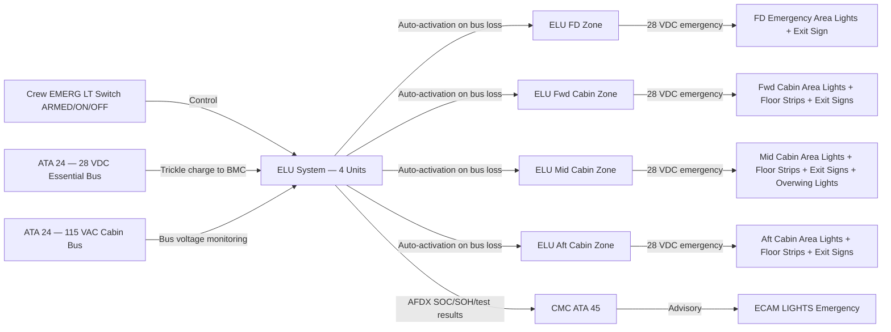
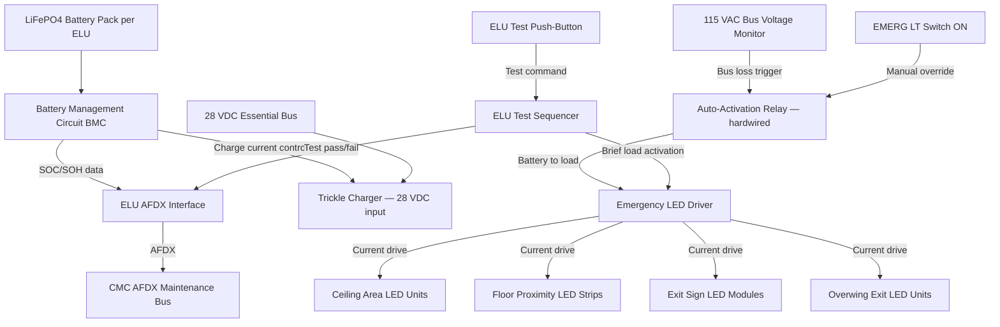
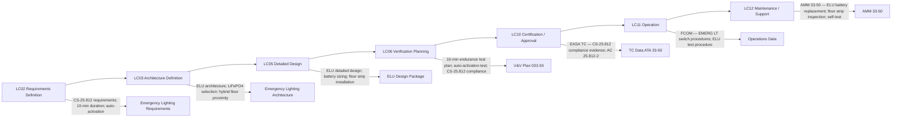

# 033-050 — Emergency Lighting
### [PROGRAMME-AIRCRAFT] [PROGRAMME-VARIANT] · ATA 33 · Q+ATLANTIDE ATLAS Scaffold

---

## §0 Hyperlink Policy

All internal links in this document use relative paths from the current directory. External regulatory and standards references use anchor links defined in [§20 References](#20-references). Links marked **TBD** indicate targets not yet allocated within the CSDB or ATLAS hierarchy. Programme-level links traverse five directory levels (`../../../../../`) to reach the repository root. No absolute URLs are used for internal navigation.

---

## §1 Purpose

This document defines the agnostic ATLAS standard-level architecture context for `033-050 — Emergency Lighting`.

It describes the controlled scope, functions, interfaces, safety considerations, lifecycle traceability, and S1000D/CSDB mapping logic that programme implementations shall instantiate when this node is applicable.

This document is not a programme design baseline. Programme-specific capacities, locations, part numbers, effectivity, operating limits, maintenance references, and data module codes shall be defined only inside the applicable programme implementation branch.
## §2 Applicability

| Applicability Level | Rule |
|---|---|
| Standard taxonomy | Applies to the ATLAS node `<NODE>` |
| Programme implementation | Conditional; determined by programme architecture, trade studies, certification basis, and applicability model |
| Product configuration | Defined in the programme-specific configuration baseline |
| Effectivity | Defined in the programme CSDB / applicability layer |
| Non-applicability | Must be explicitly stated in the programme impact-study branch when excluded |
## §3 System / Function Overview

The emergency lighting system provides illumination of the cabin escape path during emergency evacuation. It consists of four Emergency Lighting Units (ELUs) — one in the flight deck zone and one per cabin zone (forward, mid, aft) — each containing a LiFePO4 battery pack, a battery management circuit (BMC), an LED driver, and an auto-activation relay. ELUs are mounted in the cabin ceiling/sidewall structure, one per zone.

Each ELU powers the emergency lighting loads in its zone: (1) general cabin area lighting (ceiling-mounted LED units that illuminate the cabin at a minimum level during evacuation), (2) floor proximity LED strips along the aisle floor edge/floor track (combined with photo-luminescent strips — hybrid approach TBD), (3) exit signs (at each emergency exit), and (4) overwing exit lights (illuminating the overwing exits and wing surface outside).

Auto-activation: ELUs continuously monitor the 115 VAC cabin bus voltage. On bus loss (below a threshold TBD, e.g., < 50 VAC), the ELU auto-activation relay closes, connecting the LiFePO4 battery to all emergency loads in the zone, without any crew action. Activation time from bus loss to full illumination: < 1 second (TBD per ELU supplier design).

Crew control: the EMERG LT switch on the overhead panel has three positions: ARMED (normal; auto-activation enabled), ON (manual activation — all ELUs activate regardless of bus state), and OFF (ELUs disarmed — used for maintenance only on the ground). The crew should arm emergency lighting before flight.

---

## §4 Scope

### 4.1 Included
- Emergency Lighting Units (ELUs) — 4 units: 1 flight deck zone, 1 fwd cabin, 1 mid cabin, 1 aft cabin
- LiFePO4 battery packs (integrated in ELU) — capacity sized for ≥ 10 minutes at rated illumination load
- Battery Management Circuit (BMC) — SOC/SOH monitoring, charging from aircraft 28 VDC or 115 VAC
- Auto-activation relay and bus voltage monitoring circuit (per ELU)
- ELU general area LED lighting units (ceiling-mounted, per zone)
- Floor proximity LED escape path strips (aisle floor edge, per cabin zone)
- Photo-luminescent escape path strips (hybrid — TBD confirmation)
- Exit signs — illuminated at all emergency exits (always on from ELU battery or main bus charging)
- Overwing exit lights (illuminating overwing exit panel and wing surface escape route)
- Crew EMERG LT overhead panel switch (ARMED / ON / OFF)
- ELU test push-buttons (one per ELU, accessible to cabin crew) and test from CMC
- CMC/OMS monitoring: SOC/SOH, test results, auto-activation events

### 4.2 Excluded
- Exterior emergency locator transmitter (ELT) — covered by ATA 23
- Emergency slide/raft inflation — covered by ATA 25
- Smoke and fire detection in cabin — covered by ATA 26
- Normal cabin ambient lighting (Zone SSLCs) — covered by ATA 033-020
- Ground service lighting — covered by ATA 033-030

---

## §5 Architecture Description

- **ELU per zone — independent isolation**: Each zone ELU is a completely independent unit with its own battery, BMC, and LED driver. A single ELU failure does not affect other zones. The flight deck ELU provides emergency lighting for the flight deck crew during evacuation.
- **LiFePO4 battery chemistry**: LiFePO4 is selected for its thermal stability, long cycle life, and regulatory acceptance. Unlike Li-ion NMC chemistry, LiFePO4 does not undergo thermal runaway propagation in the same manner, reducing fire risk in the confined cabin environment. Battery chemistry confirmation is TBD pending EASA regulatory acceptance review.
- **Auto-activation on 115 VAC bus loss**: The 115 VAC cabin bus voltage is monitored by a simple voltage sensing circuit in each ELU. Loss below threshold triggers immediate activation. This is fully independent of aircraft avionics, SSLC, or CMC — no software path in the activation logic for the safety-critical auto-activation function.
- **Exit signs always illuminated**: Exit signs at all emergency exits (Type I, Type III overwing, and any Type A exits) are powered from the ELU battery continuously when the ELU battery is charged. During normal operations, the ELU battery is charged via a trickle charge from the aircraft 28 VDC bus. Exit signs remain illuminated even when main power is off provided the ELU battery has charge remaining.
- **Floor proximity lighting hybrid**: The floor proximity escape path marking system uses a combination of LED strips (active; powered by ELU) providing minimum lux at floor level, and photo-luminescent strips (passive; glow after being charged by cabin ambient lighting) providing backup visibility if LED strips fail. The hybrid approach aims to satisfy CS-25.812(b)(1)(iv) under all failure scenarios. Confirmation of regulatory acceptance of the hybrid approach is pending (see §21).
- **10-minute endurance**: All ELUs are sized such that, with a fully charged LiFePO4 battery at end-of-life SOH (SOH threshold TBD), the ELU can sustain rated illumination load for ≥ 10 minutes at the aircraft's minimum ambient temperature (TBD °C per airframe environmental specification).
- **Charging system**: Each ELU battery charges from the aircraft 28 VDC essential bus at a trickle charge rate when main power is available. Charging is managed by the BMC within the ELU. The BMC provides SOC and SOH data to CMC via AFDX.

---

## §6 Functional Breakdown

| Function ID | Function Title | Description | Zone | Auto-Activation |
|---|---|---|---|---|
| ELU-001 | ELU — Flight Deck Zone | LiFePO4 battery + BMC + LED driver for FD emergency area lights + exit sign | Flight deck | On FD 115 VAC bus loss |
| ELU-002 | ELU — Forward Cabin Zone | LiFePO4 battery + BMC + LED driver for fwd cabin emergency lights + floor strips + exit signs | Fwd cabin | On 115 VAC cabin bus loss |
| ELU-003 | ELU — Mid Cabin Zone | LiFePO4 battery + BMC + LED driver for mid cabin emergency lights + floor strips + exit signs | Mid cabin | On 115 VAC cabin bus loss |
| ELU-004 | ELU — Aft Cabin Zone | LiFePO4 battery + BMC + LED driver for aft cabin + lav area emergency lights + floor strips + exit signs | Aft cabin | On 115 VAC cabin bus loss |
| EMER-001 | ELU Area LED Ceiling Units | General area LED units providing minimum cabin illuminance per CS-25.812 during emergency | All cabin zones | Via ELU |
| EMER-002 | Floor Proximity LED Strips | LED strips at aisle floor edge providing low-level escape path illumination per CS-25.812(b)(1)(iv) | Cabin aisle | Via ELU |
| EMER-003 | Photo-Luminescent Strips (TBD) | Passive strips charged by cabin ambient light; glow in darkness if LED strips fail | Cabin aisle | Passive — no power required |
| EMER-004 | Exit Signs | Illuminated EXIT signs at all emergency exits — always on from ELU battery | All exits | Via ELU (continuous) |
| EMER-005 | Overwing Exit Lights | LED lights illuminating overwing exit panel and wing surface escape route | Overwing exits | Via ELU |
| EMER-006 | ELU Self-Test Function | Cabin crew or CMC-initiated test: activates ELU load for TBD seconds; verifies illumination and battery capacity | All ELUs | Initiated by crew or CMC |

---

## §7 System Context Diagram

---

## §8 Internal Functional Architecture

---

## §9 Lifecycle Traceability

---

## §10 Interfaces

| Interface ID | System / Chapter | Interface Type | Data / Signal | Direction | Status |
|---|---|---|---|---|---|
| IF-033-50-001 | ATA 24 Electrical Power | 28 VDC essential bus | Trickle charge for ELU LiFePO4 battery packs | ATA24 → ATA33-50 |  |
| IF-033-50-002 | ATA 24 Electrical Power | 115 VAC cabin bus | Bus voltage monitoring input to ELU auto-activation circuit | ATA24 → ATA33-50 (sense only) |  |
| IF-033-50-003 | ATA 45 CMC | AFDX maintenance bus | ELU SOC/SOH, test results, auto-activation event log | ATA33-50 → ATA45 |  |
| IF-033-50-004 | ATA 31 ECAM | AFDX | ECAM LIGHTS emergency advisory — ELU fault, SOH alert | ATA33-50 → ATA31 |  |
| IF-033-50-005 | Crew Overhead Panel | Discrete | EMERG LT switch (ARMED / ON / OFF) | Crew → ATA33-50 |  |
| IF-033-50-006 | ATA 25 Furnishings | Physical | ELU mounting provisions in cabin ceiling/sidewall structure | ATA25 ↔ ATA33-50 |  |
| IF-033-50-007 | ATA 25 Furnishings (floor tracks) | Physical | Floor proximity LED strip integration with cabin floor tracks/threshold strips | ATA25 ↔ ATA33-50 |  |

---

## §11 Operating Modes

| Mode ID | Mode Name | Description | Entry Condition | Exit Condition |
|---|---|---|---|---|
| OM-ELU-001 | Standby Armed | ELU battery trickle-charged; auto-activation enabled; exit signs illuminated | EMERG LT switch ARMED; main power on | 115 VAC bus loss or crew ON |
| OM-ELU-002 | Auto-Activated | 115 VAC cabin bus loss detected; all ELUs activate immediately from battery; all emergency loads illuminated | 115 VAC bus voltage < threshold | Bus restored + crew arms switch |
| OM-ELU-003 | Crew ON — Manual | All ELUs activated by crew EMERG LT switch regardless of bus state | EMERG LT switch to ON | EMERG LT switch to ARMED or OFF |
| OM-ELU-004 | Disarmed / OFF | ELUs disarmed; auto-activation inhibited; exit signs may go dark if battery is isolated | EMERG LT switch to OFF | Switch to ARMED |
| OM-ELU-005 | Self-Test | ELU test initiated: activates load for TBD seconds; measures battery voltage under load; pass/fail to CMC | Crew pushbutton or CMC command | Test complete |
| OM-ELU-006 | Low Battery Advisory | SOH below replacement threshold; ELU generates CMC advisory but remains operational | SOH < TBD% | ELU battery replaced |
| OM-ELU-007 | Maintenance | All ELUs commandable from CMC; bus voltage sense can be inhibited for ground test | Ground power + CMC maintenance mode | CMC test complete |

---

## §12 Monitoring and Diagnostics

ELU Battery Management Circuit (BMC) continuously monitors:
- **SOC**: State of Charge — estimated remaining capacity as percentage of current rated capacity
- **SOH**: State of Health — estimated current rated capacity as percentage of original capacity; used to determine battery replacement requirement
- **Charge current and voltage**: during trickle charge from 28 VDC bus
- **Temperature**: LiFePO4 cell temperature within ELU; over-temperature fault if above threshold

BMC transmits SOC, SOH, temperature, and operational status to CMC via AFDX. CMC maintains an ELU battery history record.

ELU self-test: initiated by cabin crew push-button or CMC command. Self-test activates the emergency load for TBD seconds (long enough to verify illumination and measure battery voltage under load) then de-activates. Test result (pass / fail; measured duration at load; battery SOC before test) is logged to CMC. A failed self-test generates a CMC maintenance fault and an ECAM LIGHTS advisory.

Auto-activation event: each auto-activation is logged to CMC with time, battery SOC at activation, and duration of emergency operation (until bus restoration). This data supports post-event investigation.

---

## §13 Maintenance Concept

ELU battery packs are line-replaceable items. ELU replacement is triggered by: SOH below replacement threshold (CMC advisory), failed self-test, or physical damage. Physical ELU replacement requires: (1) disarm EMERG LT switch, (2) access ELU via cabin ceiling/sidewall panel (tool-free access panel TBD), (3) disconnect electrical connectors and release mechanical retention, (4) install new ELU and reconnect, (5) perform ELU self-test via CMC to confirm new unit is serviceable.

Estimated ELU battery replacement interval: TBD per LiFePO4 cycle life and SOH degradation rate. Expected interval >> conventional NiCd emergency light battery replacement intervals.

Floor proximity LED strip sections: inspected during scheduled cabin interior inspection. Sections showing luminance degradation (from CMC trend monitoring or visual inspection) are replaced. Photo-luminescent strips are inspected for fading per luminance measurement protocol (TBD). Replacement requires floor panel access — base or line maintenance depending on strip location.

Exit sign LED modules: if an exit sign LED fails (detected by ELU LED driver current sense), the sign assembly is replaced at line maintenance. Exit sign failure is a dispatch-critical MEL item.

Overwing exit light assemblies: LRU replacement at line maintenance — accessible from cabin overwing section.

---

## §14 S1000D / CSDB Mapping

### 14.1 SNS to DMC Mapping

| SNS Code | Subsubject Title | DMC Prefix | Info Codes Planned | DMRL Status |
|---|---|---|---|---|
| 033-50 | Emergency Lighting | DMC-<PROGRAMME>-<VARIANT>-033-50 | 040, 300, 400, 520, 720 |  |

### 14.2 Planned Data Modules

| Info Code | DM Title | Description |
|---|---|---|
| 040 | Emergency Lighting System Description | ELU architecture, LiFePO4 battery, auto-activation logic, floor proximity system |
| 300 | Emergency Lighting — Normal and Abnormal Procedures | EMERG LT switch use; ELU self-test; auto-activation response |
| 400 | Emergency Lighting Maintenance Procedures | ELU battery replacement; floor strip inspection; self-test procedure |
| 520 | Emergency Lighting Fault Isolation | BITE-guided isolation to ELU, battery, LED driver, or floor strip |
| 720 | ELU Removal and Installation | R&I procedure for each ELU zone unit |

---

## §15 Footprints

### 15.1 Physical Footprint
- ELUs (×4): cabin ceiling or sidewall mounting — 1 per zone (FD, fwd, mid, aft); envelope TBD per battery sizing
- ELU area LED ceiling units: ceiling-mounted — typically 1–2 per zone; small LED panel
- Floor proximity LED strips: longitudinal strips along cabin aisle floor edge from fwd exit to aft exit — total length per cabin layout TBD
- Photo-luminescent strips (if hybrid confirmed): co-located with LED strips or at threshold locations
- Exit sign assemblies: at each emergency exit — quantity per aircraft exit configuration (typically 6–8 exits)
- Overwing exit light assemblies: at each overwing exit (×2 for [PROGRAMME-VARIANT]-100)

### 15.2 Electrical / Data Footprint
- Emergency power: fully independent from aircraft buses when activated; LiFePO4 battery per ELU; total emergency load per ELU TBD (area lights + floor strips + exit signs + overwing lights)
- Charging power: 28 VDC essential bus → trickle charge; charging current TBD (typically < 2 A per ELU)
- Data: AFDX (ELU BMC → CMC for SOC/SOH/test); discrete (EMERG LT switch; ELU test pushbutton; 115 VAC sense)

### 15.3 Maintenance Footprint
- LRUs: ELU assemblies (×4); exit sign assemblies; overwing exit light assemblies; floor proximity LED strip sections
- Tools: maintenance laptop / CMC terminal; lux meter (floor strip illuminance verification); photo-luminescent luminance meter (if hybrid fitted)
- Scheduled: ELU self-test at defined interval (AMM — TBD); floor strip inspection per cabin interior inspection interval; photo-luminescent luminance measurement per AMM

### 15.4 Data Footprint
- ELU fault/event log per unit: ≥ 200 entries (auto-activation events, self-test results, charging data)
- CMC ELU battery trend: SOH curve per ELU over time — supports predictive battery replacement
- AC 25.812-2 compliance evidence log: test results retained per regulatory record-keeping requirements

---

## §16 Safety and Certification Considerations

| Requirement | Source | Description | Compliance Approach | Status |
|---|---|---|---|---|
| CS-25.812 | EASA CS-25 | Emergency lighting — system independent of main electrical; ≥ 10 min duration; auto-activation | ELU LiFePO4 independent power; endurance test; auto-activation on 115 VAC bus loss |  |
| CS-25.812(b)(1)(iv) | EASA CS-25 | Floor proximity escape path lighting — illuminates path from any seat to exit at low level | LED floor proximity strips + photo-luminescent hybrid; coverage of all cabin aisle positions |  |
| CS-25.811 | EASA CS-25 | Emergency exit marking — exits must be marked and identifiable in all lighting conditions | LED exit signs always illuminated; markings per approved layout |  |
| AC 25.812-2 | FAA | Emergency lighting — guidance for CS-25.812 compliance | Full compliance plan per AC 25.812-2; photometric and endurance evidence |  |
| DO-293 | RTCA | LED aircraft lighting — qualification | ELU LED assemblies and exit signs qualified per DO-293 |  |
| DO-160G | RTCA | Environmental qualification | ELU assemblies qualified per DO-160G — cabin interior environment |  |
| CS-25.1309 | EASA CS-25 | Equipment failure effects — emergency lighting failure DAL | Emergency lighting system FHA; ELU failure classified as Major or Hazardous (TBD per FHA) |  |
| RTCA DO-311A | RTCA | Minimum Operational Performance Standard for Rechargeable Lithium Battery Systems | LiFePO4 battery packs in ELUs may require DO-311A qualification |  |

---

## §17 Verification and Validation

| V&V ID | Requirement | Method | Success Criterion | Status |
|---|---|---|---|---|
| VV-033-50-001 | CS-25.812 — 10-minute endurance | ELU endurance test at rated load; battery at end-of-life SOH threshold | All ELUs sustain rated illumination for ≥ 10 minutes without flicker or failure |  |
| VV-033-50-002 | CS-25.812 — Auto-activation | Laboratory test: remove 115 VAC cabin bus; observe ELU activation | All ELUs activate within TBD ms; all emergency loads illuminated; no crew action required |  |
| VV-033-50-003 | CS-25.812(b)(1)(iv) — Floor proximity illuminance | In-situ cabin photometric measurement along aisle floor strip | Illuminance at floor level meets regulatory minimum at each exit approach position |  |
| VV-033-50-004 | CS-25.811 — Exit sign illuminance | Photometric measurement at exit sign under emergency lighting conditions | Exit signs legible at minimum viewing distance; luminance per regulatory minimum |  |
| VV-033-50-005 | Overwing exit lights — illuminance on wing surface | Photometric measurement on wing surface outside overwing exit | Wing surface illuminated adequately for safe exit under darkness |  |
| VV-033-50-006 | ELU self-test functional verification | CMC-commanded self-test on all 4 ELUs | All ELUs report pass; test duration log correct; CMC records test result |  |
| VV-033-50-007 | Photo-luminescent strip luminance (if hybrid) | Luminance measurement after 30-minute charge under cabin ambient lighting | Luminance meets CS-25.812(b)(1)(iv) backup level for TBD duration |  |
| VV-033-50-008 | Crew EMERG LT switch — ON/OFF/ARMED | Functional bench test of switch discrete circuit | Each switch position correctly controls ELU activation and disarm |  |
| VV-033-50-009 | DO-160G — ELU environmental | DO-160G test suite for ELU assemblies | All ELUs pass applicable DO-160G categories (temperature, humidity, vibration) |  |
| VV-033-50-010 | DO-311A — Battery qualification (if required) | DO-311A or equivalent LiFePO4 battery test | Battery qualification completed; safety aspects verified |  |

---

## §18 Glossary

| Term | Definition |
|---|---|
| AC 25.812-2 | FAA Advisory Circular providing guidance for compliance with FAR 25.812 (equivalent to CS-25.812) emergency lighting requirements; widely used as a compliance reference even for EASA certification |
| BMC | Battery Management Circuit — electronic circuit within each ELU managing LiFePO4 cell charging, SOC/SOH estimation, over-temperature protection, and AFDX data reporting |
| ELU | Emergency Lighting Unit — the self-contained unit comprising LiFePO4 battery, BMC, auto-activation relay, and LED driver; one per aircraft zone; provides ≥ 10-minute emergency illumination |
| Floor proximity lighting | Low-level illumination at floor level (≤ 4 feet above floor) along the cabin aisle escape path; enables passengers to see the floor path to exits in dense smoke conditions where high-level lighting may be obscured |
| LiFePO4 | Lithium Iron Phosphate — battery chemistry selected for ELUs for thermal stability, long cycle life, and safety; positive electrode is lithium iron phosphate (olivine structure); inherently safer than NMC or NCA Li-ion chemistries |
| Photo-luminescent | Material that absorbs and stores light energy (from ambient lighting) and emits it slowly in darkness (glowing); used in escape path marking as a passive backup to LED lighting strips |
| SOC | State of Charge — the remaining energy in the ELU battery expressed as a percentage of current full charge capacity |
| SOH | State of Health — the current rated capacity of the ELU battery expressed as a percentage of the original rated capacity; degrades over charge cycles and calendar life; replacement triggered when below threshold |
| Overwing exit | An emergency exit in the cabin over the wing, typically a Type III exit (hatch type); requires lighting of the exit panel and the wing surface escape route |
| Exit sign | An illuminated sign (LED backlit) at each emergency exit identifying its location; required to be always illuminated per CS-25.811; powered from ELU battery |

---

## §19 Citations

| Citation ID | Source | Title | Relevance |
|---|---|---|---|
| CIT-033-50-001 | EASA | CS-25.812 — Emergency Lighting | Primary certification requirement |
| CIT-033-50-002 | EASA | CS-25.811 — Emergency Exit Marking | Exit sign requirement |
| CIT-033-50-003 | FAA | AC 25.812-2 — Emergency Lighting | Compliance guidance |
| CIT-033-50-004 | RTCA | DO-293 — LED Aircraft Lighting | ELU LED assembly qualification |
| CIT-033-50-005 | RTCA | DO-160G — Environmental Conditions | ELU environmental qualification |
| CIT-033-50-006 | RTCA | DO-311A — Rechargeable Lithium Battery Systems | LiFePO4 battery qualification (if required) |
| CIT-033-50-007 | ASD-STAN | S1000D Issue 5.0 | CSDB mapping |

---

## §20 References

| Ref ID | Document | Title | Link |
|---|---|---|---|
| REF-033-50-001 | CS-25.812 | Emergency Lighting | [EASA CS-25](#) |
| REF-033-50-002 | CS-25.811 | Emergency Exit Marking | [EASA CS-25](#) |
| REF-033-50-003 | AC 25.812-2 | Emergency Lighting — FAA AC | [FAA](https://www.faa.gov/) |
| REF-033-50-004 | DO-293 | LED Aircraft Lighting | [RTCA](https://www.rtca.org/) |
| REF-033-50-005 | DO-160G | Environmental Conditions | [RTCA](https://www.rtca.org/) |
| REF-033-50-006 | DO-311A | Rechargeable Lithium Battery Systems | [RTCA](https://www.rtca.org/) |
| REF-033-50-007 | S1000D Issue 5.0 | Technical Publications | [s1000d.org](https://s1000d.org/) |
| REF-033-50-008 | 033-000 | ATA 33 Lights — General | [033-000-Lights-General.md](./033-000-Lights-General.md) |

---

## §21 Open Issues

| Issue ID | Description | Owner | Priority | Status |
|---|---|---|---|---|
| OI-033-50-001 | ELU battery chemistry confirmation — LiFePO4 is assumed; validate EASA regulatory acceptance, weight budget, volumetric energy density impact on ELU size, and DO-311A qualification requirement | Q-MECHANICS / ORB-LEG | High |  |
| OI-033-50-002 | Floor proximity lighting hybrid solution — confirm LED + photo-luminescent hybrid approach; obtain EASA approval-in-principle; alternative is pure LED solution (eliminates photo-luminescent inspection burden) | Q-MECHANICS / ORB-LEG | High |  |
| OI-033-50-003 | ELU sizing (battery capacity) — complete load analysis for each zone (area lights + floor strips + exit signs + overwing) at minimum temperature; size battery to ≥ 10 min at end-of-life SOH | Q-MECHANICS | High |  |
| OI-033-50-004 | ELU self-test duration — define test activation time (suggested TBD seconds) that adequately verifies battery capacity without unduly discharging the ELU during scheduled maintenance | Q-MECHANICS | Medium |  |
| OI-033-50-005 | SOH replacement threshold — define minimum SOH% below which ELU battery must be replaced; must ensure ≥ 10-minute endurance is maintained at threshold SOH across all temperature conditions | Q-MECHANICS / ORB-LEG | High |  |
| OI-033-50-006 | Exit configuration — confirm number and type of emergency exits (Type I, Type III overwing) for [PROGRAMME-VARIANT]-100; defines quantity and location of exit signs, ELU zones, and floor strip layout | Q-MECHANICS / ATA 25 | Medium |  |

---

## §22 Change Log

| Revision | Date | Author | Description |
|---|---|---|---|
| 0.1.0 | 2026-05-09 | Q+ATLANTIDE / Q-MECHANICS | Initial scaffold creation — all sections drafted; TBD items identified |
