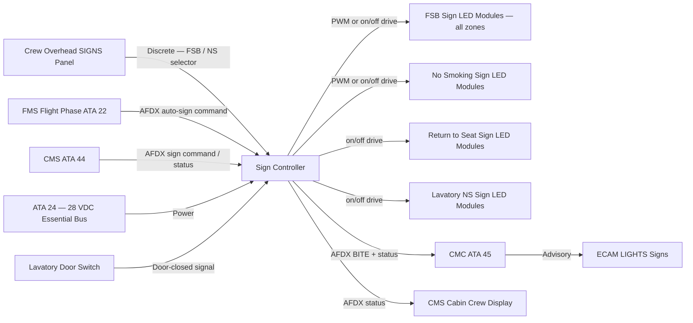
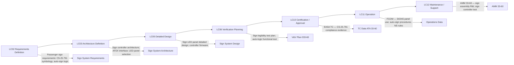

# 033-060 — Signage and Information Lighting
### [PROGRAMME-AIRCRAFT] [PROGRAMME-VARIANT] · ATA 33 · Q+ATLANTIDE ATLAS Scaffold

---

## §0 Hyperlink Policy

All internal links in this document use relative paths from the current directory. External regulatory and standards references use anchor links defined in [§20 References](#20-references). Links marked **TBD** indicate targets not yet allocated within the CSDB or ATLAS hierarchy. Programme-level links traverse five directory levels (`../../../../../`) to reach the repository root. No absolute URLs are used for internal navigation.

---

## §1 Purpose

This document defines the agnostic ATLAS standard-level architecture context for `033-060 — Signage and Information Lighting`.

It describes the controlled scope, functions, interfaces, safety considerations, lifecycle traceability, and S1000D/CSDB mapping logic that programme implementations shall instantiate when this node is applicable.

This document is not a programme design baseline. Programme-specific capacities, locations, part numbers, effectivity, operating limits, maintenance references, and data module codes shall be defined only inside the applicable programme implementation branch.
## §2 Applicability

| Applicability Level | Rule |
|---|---|
| Standard taxonomy | Applies to the ATLAS node `<NODE>` |
| Programme implementation | Conditional; determined by programme architecture, trade studies, certification basis, and applicability model |
| Product configuration | Defined in the programme-specific configuration baseline |
| Effectivity | Defined in the programme CSDB / applicability layer |
| Non-applicability | Must be explicitly stated in the programme impact-study branch when excluded |
## §3 System / Function Overview

Passenger information signs on the [PROGRAMME-AIRCRAFT] [PROGRAMME-VARIANT] are LED backlit panels. Unlike conventional aircraft using incandescent bulb-illuminated sign panels requiring periodic bulb replacement, the [PROGRAMME-VARIANT] signs use LED modules integrated into the sign overlay with an expected service life exceeding TBD hours (targeting bulb-replacement-free operation throughout aircraft service life).

The SIGNS panel on the crew overhead panel provides the primary crew control: a three-position selector for FSB (ON / AUTO / OFF) and a separate NO SMOKING switch. In AUTO mode, the FSB sign is controlled by AFCS/FMS logic — automatically illuminating during take-off, approach, landing, and turbulence encounters (when aircraft accelerometers detect TBD g thresholds — TBD per automation logic definition).

Automatic control logic: the FMS/AFCS system generates a sign command signal over AFDX based on flight phase (on ground: FSB on; take-off: FSB on; climb above TBD ft: FSB AUTO; cruise: FSB AUTO unless turbulence; descent: FSB on; landing: FSB on). The sign controller processes these commands and activates or deactivates the appropriate sign LED driver.

The Master SSLC (ATA 033-70) manages the sign controller, which receives commands from the crew SIGNS panel (discrete) and from the FMS/CMS via AFDX, and drives individual sign LED modules. Sign status (ON/OFF per sign) is reported over AFDX to the CMC and to the CMS for cabin crew awareness.

---

## §4 Scope

### 4.1 Included
- Fasten Seat Belts (FSB) signs: one per seat group or zone — LED backlit; illuminated ON/OFF controlled by crew SIGNS panel or auto-logic
- No Smoking (NS) signs: cabin and lavatory — LED backlit; typically always ON in flight (regulatory requirement for smoke-free aircraft); crew SIGNS switch
- Return to Seat (RTS) signs: typically co-located or combined with NS signs at lavatories — LED backlit
- Lavatory No Smoking signs: one per lavatory; LED; always illuminated when lavatory in use
- Crew SIGNS panel (overhead): FSB selector (ON/AUTO/OFF); NO SMOKING switch
- Sign controller module: receives crew and FMS/CMS commands; drives LED modules per sign
- FMS / AFCS automatic sign logic: flight phase–based FSB activation in AUTO mode
- CMC fault monitoring: open-circuit detection per sign LED circuit; sign status logging
- ECAM / CMS sign status reporting

### 4.2 Excluded
- Emergency exit signs — covered by ATA 033-050 (always illuminated; ELU powered)
- Cabin ambient illumination — covered by ATA 033-020
- ECAM advisory and warning texts — covered by ATA 31
- Lavatory occupied sign (external indicator) — covered by ATA 25
- Safety briefing card dispensers and placard illumination — covered by ATA 25

---

## §5 Architecture Description

- **LED backlit sign panels**: Each sign panel contains a LED backlight array behind a translucent legend overlay. The LED module is sealed and not field-replaceable at the individual LED level; the entire sign assembly is the replaceable LRU. LED service life targets >50,000 hours, eliminating the scheduled bulb replacement task present on conventional sign installations.
- **Sign controller**: A dedicated sign controller module (part of or interfacing with the Master SSLC — TBD per SSLC detailed design) manages the LED drivers for all passenger information signs. It receives sign commands from: (1) crew SIGNS panel discrete switches, (2) FMS/CMS automatic logic over AFDX.
- **Priority logic**: Crew ON/OFF selection on the SIGNS panel takes priority over automatic logic. If the crew selects FSB ON manually, it overrides any AUTO command from the FMS.
- **Automatic logic (AUTO mode)**: In FSB AUTO, the sign controller enables FMS/AFCS to command FSB on/off based on flight phase. If FMS data is unavailable (FMS fault), the sign defaults to FSB ON in AUTO mode (fail-safe).
- **CMS integration**: The CMS can display sign status on the cabin crew control panel. Some airlines may configure the CMS to inhibit certain signs (e.g., NS off for electronic cigarette operator policies — TBD per airline customisation). CMS control is advisory; crew SIGNS panel is authoritative.
- **Power from 28 VDC essential bus**: All passenger information signs are powered from the 28 VDC essential bus ensuring availability during normal and essential-power-only conditions. Sign illumination is not affected by loss of 115 VAC cabin bus.
- **Open-circuit monitoring**: The sign controller monitors each sign LED driver circuit for open-circuit (failed sign LED module). A failed sign generates an ECAM LIGHTS advisory and a CMC fault entry.
- **Lavatory No Smoking**: Always illuminated when lavatory is occupied (lavatory door closed). Powered from 28 VDC essential bus via door-switch interlock (same logic as lavatory lighting). No pilot control of lavatory NS signs.

---

## §6 Functional Breakdown

| Sign ID | Sign Type | Location | Control | Power | Symbology Standard |
|---|---|---|---|---|---|
| SGN-001 | Fasten Seat Belts | Cabin overhead — one per seat zone or row group | Crew SIGNS panel FSB selector / FMS AUTO | 28 VDC essential bus | CS-25.791; ICAO Annex 6 |
| SGN-002 | No Smoking | Cabin overhead — co-located with FSB or separate | Crew SIGNS panel NS switch | 28 VDC essential bus | CS-25.791; ICAO Annex 6 |
| SGN-003 | Return to Seat | Cabin overhead or lavatory area | Crew SIGNS panel NS/RTS switch or automatic | 28 VDC essential bus | CS-25.791; ICAO Annex 6 |
| SGN-004 | Lavatory No Smoking | Each lavatory — internal facing | Door-interlock (on when door closed/occupied) | 28 VDC essential bus | CS-25.791 |
| SGN-005 | Lavatory Return to Seat | Each lavatory — internal facing | Same as SGN-003 control | 28 VDC essential bus | CS-25.791 |

---

## §7 System Context Diagram

---

## §8 Internal Functional Architecture

```mermaid
flowchart TB
    FSBSEL[FSB Selector ON/AUTO/OFF] -->|Discrete| PRIOSEL[Priority Selector Logic]
    NSSWITCH[NS Switch ON/OFF] -->|Discrete| NSDRIVE[NS Sign Driver]
    FMSAUTO[FMS AUTO Command via AFDX] -->|Sign command| PRIOSEL
    CMSOVR[CMS Override via AFDX] -->|Advisory command| PRIOSEL
    PRIOSEL -->|Resolved FSB command| FSBDRV[FSB Sign Driver]
    FSBDRV -->|28 VDC on/off| FSBMOD1[FSB Sign Zone 1]
    FSBDRV -->|28 VDC on/off| FSBMOD2[FSB Sign Zone 2]
    FSBDRV -->|28 VDC on/off| FSBMOD3[FSB Sign Zone 3]
    NSDRIVE -->|28 VDC on/off| NSMOD[NS Sign Modules all zones]
    RTSDRV[RTS Sign Driver] -->|28 VDC on/off| RTSMOD[RTS Sign Modules near lavatories]
    LAVDOOR[Lavatory Door-Closed Microswitch] -->|Contact| LAVDRV[Lavatory NS Sign Driver]
    LAVDRV -->|28 VDC on/off| LAVNSMOD[Lavatory NS Sign Modules]
    FSBDRV -->|Current sense| SIGNBITE[Open Circuit BITE Monitor]
    NSDRIVE -->|Current sense| SIGNBITE
    LAVDRV -->|Current sense| SIGNBITE
    SIGNBITE -->|AFDX fault + status| CMCBUS[CMC AFDX Maintenance Bus]
    SIGNBITE -->|AFDX status| CMSBUS[CMS AFDX Status Bus]
```

---

## §9 Lifecycle Traceability

---

## §10 Interfaces

| Interface ID | System / Chapter | Interface Type | Data / Signal | Direction | Status |
|---|---|---|---|---|---|
| IF-033-60-001 | ATA 24 Electrical Power | 28 VDC essential bus | Power for all sign LED drivers and sign controller | ATA24 → ATA33-60 |  |
| IF-033-60-002 | ATA 22 Auto-Flight / FMS | AFDX | Flight phase–based FSB AUTO sign command | ATA22 → ATA33-60 |  |
| IF-033-60-003 | ATA 44 CMS | AFDX | Sign command (advisory) and sign status display on CMS cabin crew panel | ATA44 ↔ ATA33-60 |  |
| IF-033-60-004 | ATA 45 CMC | AFDX maintenance bus | Sign controller BITE fault data; sign ON/OFF status log | ATA33-60 → ATA45 |  |
| IF-033-60-005 | ATA 31 ECAM | AFDX | ECAM LIGHTS SIGNS advisory for failed sign LED module | ATA33-60 → ATA31 |  |
| IF-033-60-006 | Crew Overhead Panel | Discrete | FSB selector (ON/AUTO/OFF); NS switch (ON/OFF) | Crew → ATA33-60 |  |
| IF-033-60-007 | ATA 25 Furnishings (lavatories) | Physical / discrete | Lavatory door-closed microswitch for lavatory NS sign activation | ATA25 → ATA33-60 |  |
| IF-033-60-008 | ATA 33-70 Master SSLC | Internal AFDX | Sign controller integration with Master SSLC (if co-located) | ATA33-70 ↔ ATA33-60 |  |

---

## §11 Operating Modes

| Mode ID | Mode Name | FSB State | NS State | Entry Condition | Exit Condition |
|---|---|---|---|---|---|
| OM-SGN-001 | Ground — Pre-Flight | ON | ON | Aircraft power on; engines off or starting | Take-off thrust set |
| OM-SGN-002 | Take-Off | ON | ON | Take-off thrust + airborne | Crew AUTO or OFF selection |
| OM-SGN-003 | Climb — Auto Managed | AUTO (FMS manages) | ON | Crew selects AUTO post take-off | Descent or crew manual change |
| OM-SGN-004 | Cruise — Auto Managed | AUTO (FMS managed — OFF in smooth air) | ON | Cruise phase FMS signal | Turbulence or descent |
| OM-SGN-005 | Turbulence | AUTO (FMS commands ON) | ON | Accelerometer threshold exceeded | Smooth air signal from AFCS |
| OM-SGN-006 | Approach / Landing | ON | ON | FMS descent phase or crew ON | Landing rollout |
| OM-SGN-007 | After Landing | ON | ON (until parked) | Touchdown | Parking brake set or gate |
| OM-SGN-008 | NS Regulation Mode | NS always ON | ON | Aircraft policy / CS-25.791 | Never off in flight |
| OM-SGN-009 | Maintenance | All signs individually commandable from CMC | Maintenance | Ground power + CMC maintenance mode | CMC test complete |

---

## §12 Monitoring and Diagnostics

The sign controller monitors each sign LED driver channel for open-circuit conditions using current sensing. An open-circuit on a FSB, NS, or RTS sign circuit generates a CMC fault entry with sign identifier, zone (if applicable), and fault type. The fault also generates an ECAM LIGHTS advisory.

Sign failure severity:
- **FSB sign failure**: A failed FSB sign in a zone means passengers in that zone cannot see the FSB signal. This is a MEL dispatch-critical item — the FSB function must be provided by a placarded notice or an alternative sign.
- **NS sign failure**: A failed NS sign is a MEL advisory item — lavatory NS signs must be operative; cabin NS signs may be deferred per MEL with cabin crew broadcast substitution.
- **Lavatory NS sign failure**: MEL requires operational lavatory NS signs; a failed unit is a MEL item requiring resolution before departure.

Sign status (ON/OFF for each sign group) is continuously broadcast over AFDX to CMC and CMS, enabling the cabin crew to verify sign illumination from the CMS cabin crew panel without walking the cabin.

---

## §13 Maintenance Concept

Passenger information sign assemblies are LED LRU items. Replacement is triggered by CMC fault report or crew visual observation of a failed sign. Replacement procedure: (1) access sign assembly (clip-in or screw-retain to cabin overhead PSU rail or dedicated sign panel — TBD per interior supplier design), (2) disconnect wiring harness connector, (3) install new assembly, (4) verify illumination via CMC sign test command.

Sign assemblies are expected to be maintenance-free for the aircraft service life (LED design life > TBD hours). No scheduled sign bulb replacement task is planned.

Sign controller module (if standalone LRU): located in avionics bay or in Master SSLC enclosure. Replacement is a line maintenance task (connector disconnect; module swap; functional verification via CMC).

Lavatory No Smoking sign assemblies: LRU replacement at line maintenance — lavatory access required. Lavatory door microswitch (for NS sign activation) is an ATA 25 spare item.

---

## §14 S1000D / CSDB Mapping

### 14.1 SNS to DMC Mapping

| SNS Code | Subsubject Title | DMC Prefix | Info Codes Planned | DMRL Status |
|---|---|---|---|---|
| 033-60 | Signage and Information Lighting | DMC-<PROGRAMME>-<VARIANT>-033-60 | 040, 300, 400, 520, 720 |  |

### 14.2 Planned Data Modules

| Info Code | DM Title | Description |
|---|---|---|
| 040 | Passenger Signage System Description | Sign types, LED technology, control architecture, auto-sign logic |
| 300 | Passenger Signage — Normal and Abnormal Procedures | SIGNS panel use; auto-mode; failed sign response |
| 400 | Passenger Signage Maintenance Procedures | Sign assembly R&I; controller test; sign functional verification |
| 520 | Passenger Signage Fault Isolation | BITE isolation to sign assembly, driver circuit, or controller |
| 720 | Sign Assembly Removal and Installation | R&I procedure per sign type |

---

## §15 Footprints

### 15.1 Physical Footprint
- FSB sign assemblies: one per seat zone or row group along cabin overhead; quantity TBD per cabin layout (typically 1 per 3–4 rows)
- NS sign assemblies: co-located with FSB or separate — quantity TBD
- RTS sign assemblies: near lavatories — quantity TBD per lavatory count
- Lavatory NS + RTS signs: inside each lavatory — one set per lavatory ([PROGRAMME-VARIANT]-100: ~2 lavatories)
- Sign controller: integrated in Master SSLC or standalone in avionics bay — envelope TBD

### 15.2 Electrical / Data Footprint
- Power: 28 VDC essential bus; total sign power budget TBD (low — LED signs < TBD W total)
- Data: AFDX (sign controller ↔ CMC; sign controller ↔ CMS; FMS auto-sign command); discrete (SIGNS panel switches; lavatory door microswitch)

### 15.3 Maintenance Footprint
- LRUs: sign assemblies per type; sign controller (if standalone); lavatory door microswitches (ATA 25 spare)
- Tools: maintenance laptop / CMC terminal; optional lux meter for sign luminance verification
- Scheduled: none — corrective only; sign luminance check as part of scheduled cabin inspection (TBD per AMM)

### 15.4 Data Footprint
- Sign controller fault log: ≥ 100 fault entries; sign ON/OFF event log (useful for operations quality monitoring)
- CMC sign history: sign failure log with flight phase context
- ECAM LIGHTS advisory log: sign-related caution history

---

## §16 Safety and Certification Considerations

| Requirement | Source | Description | Compliance Approach | Status |
|---|---|---|---|---|
| CS-25.791 | EASA CS-25 | Passenger information signs — illuminated FSB and NS signs required; colour, shape, and symbology specified | LED backlit sign panels with approved symbology; compliance check against CS-25.791 sign specifications |  |
| ICAO Annex 6 | ICAO | Operation of Aircraft — passenger sign requirements for international operations | Symbology per ICAO Annex 6 compatibility with CS-25.791 |  |
| DO-293 | RTCA | LED lighting equipment qualification | Sign LED panels qualified per DO-293 photometric and environmental sections |  |
| DO-160G | RTCA | Environmental qualification for sign controller | Sign controller qualified per DO-160G |  |
| CS-25.1309 | EASA CS-25 | Equipment failure effects — sign failure analysis | Failed FSB sign classified per FHA; MEL requirements derived from failure effect classification |  |

---

## §17 Verification and Validation

| V&V ID | Requirement | Method | Success Criterion | Status |
|---|---|---|---|---|
| VV-033-60-001 | CS-25.791 — Sign symbology | Visual inspection and regulatory review of sign overlay legends | Symbology matches CS-25.791 approved format for each sign type |  |
| VV-033-60-002 | CS-25.791 — Sign legibility | Photometric measurement and viewing distance test | Signs legible at minimum viewing distance (TBD — typically 30 m for FSB) in all ambient light conditions |  |
| VV-033-60-003 | Auto-sign logic — FSB AUTO mode | FMS integration bench test and flight test (or simulation) | FSB activates/deactivates correctly at each FMS phase transition; turbulence trigger functions correctly |  |
| VV-033-60-004 | Priority logic — crew override | Functional test: select FSB ON while FMS commands OFF; verify priority | Crew ON selection overrides FMS AUTO command; FSB remains ON |  |
| VV-033-60-005 | Open-circuit BITE test | Inject open-circuit fault on each sign type via maintenance test | All injected faults detected; ECAM advisory and CMC log correct |  |
| VV-033-60-006 | Lavatory NS sign door-interlock | Functional test: close lavatory door; observe NS sign activation | NS sign illuminates on door close within TBD seconds |  |
| VV-033-60-007 | DO-293 / DO-160G qualification | Environmental and photometric test programme | Sign LED panels and controller pass applicable test categories |  |

---

## §18 Glossary

| Term | Definition |
|---|---|
| CS-25.791 | EASA Certification Specification 25.791 — Passenger Information Signs; specifies that all transport aircraft must have illuminated Fasten Seat Belts and No Smoking signs with specified symbology and illuminance |
| FSB | Fasten Seat Belts — the passenger information sign that instructs passengers to fasten their seat belts; mandatory per CS-25.791; controlled from crew SIGNS panel |
| ICAO Annex 6 | ICAO Standards and Recommended Practices for Operation of Aircraft; includes requirements for passenger information signs during international commercial air transport operations |
| LED backlit sign | A passenger information sign panel where the legend overlay is illuminated from behind by an LED array, providing uniform illumination without bulbs that require periodic replacement |
| NS | No Smoking — the passenger information sign that prohibits smoking (including electronic cigarettes) on board; typically always illuminated in flight per airline policy and regulation |
| Priority logic | The control logic that determines which input command takes precedence when multiple sources (crew, FMS, CMS) simultaneously command the same sign; crew selection takes highest priority |
| RTS | Return to Seat — a sign (typically combined with the NS sign) instructing passengers who are standing or in the lavatory to return to their seats; used during turbulence or descent |
| SIGNS panel | The crew overhead panel section containing the FSB selector (ON/AUTO/OFF) and NS switch (ON/OFF) used to manually control passenger information signs |

---

## §19 Citations

| Citation ID | Source | Title | Relevance |
|---|---|---|---|
| CIT-033-60-001 | EASA | CS-25.791 — Passenger Information Signs | Primary certification requirement |
| CIT-033-60-002 | ICAO | Annex 6 — Operation of Aircraft | International operations sign requirements |
| CIT-033-60-003 | RTCA | DO-293 — LED Aircraft Lighting | Sign LED panel qualification |
| CIT-033-60-004 | RTCA | DO-160G — Environmental Conditions | Sign controller environmental qualification |
| CIT-033-60-005 | ASD-STAN | S1000D Issue 5.0 | CSDB mapping |

---

## §20 References

| Ref ID | Document | Title | Link |
|---|---|---|---|
| REF-033-60-001 | CS-25.791 | Passenger Information Signs | [EASA CS-25](#) |
| REF-033-60-002 | ICAO Annex 6 | Operation of Aircraft | [ICAO](https://www.icao.int/) |
| REF-033-60-003 | DO-293 | LED Aircraft Lighting | [RTCA](https://www.rtca.org/) |
| REF-033-60-004 | DO-160G | Environmental Conditions | [RTCA](https://www.rtca.org/) |
| REF-033-60-005 | S1000D Issue 5.0 | Technical Publications | [s1000d.org](https://s1000d.org/) |
| REF-033-60-006 | 033-000 | ATA 33 Lights — General | [033-000-Lights-General.md](./033-000-Lights-General.md) |
| REF-033-60-007 | 033-020 | Passenger Cabin Lighting | [033-020](./033-020-Passenger-Cabin-Lighting.md) |
| REF-033-60-008 | 033-050 | Emergency Lighting | [033-050](./033-050-Emergency-Lighting.md) |

---

## §21 Open Issues

| Issue ID | Description | Owner | Priority | Status |
|---|---|---|---|---|
| OI-033-60-001 | Auto-sign turbulence threshold — define g-level threshold for FMS/AFCS to trigger FSB ON in turbulence AUTO mode; coordinate with ATA 22 / AFCS team | Q-MECHANICS / ATA 22 | Medium |  |
| OI-033-60-002 | Sign controller co-location — confirm whether sign controller is integrated within Master SSLC or is a standalone LRU; impacts hardware count and AFDX design | Q-MECHANICS | Medium |  |
| OI-033-60-003 | NS sign always-on policy — confirm airline customisation scope for NS sign; some operators require NS off for electronic cigarette sessions (regulatory question with EASA) | Q-MECHANICS / ORB-LEG | Medium |  |
| OI-033-60-004 | FSB sign quantity and zone layout — define number and location of FSB sign assemblies per cabin row layout (TBD when cabin layout is frozen) | Q-MECHANICS / ATA 25 | Medium |  |

---

## §22 Change Log

| Revision | Date | Author | Description |
|---|---|---|---|
| 0.1.0 | 2026-05-09 | Q+ATLANTIDE / Q-MECHANICS | Initial scaffold creation — all sections drafted; TBD items identified |
