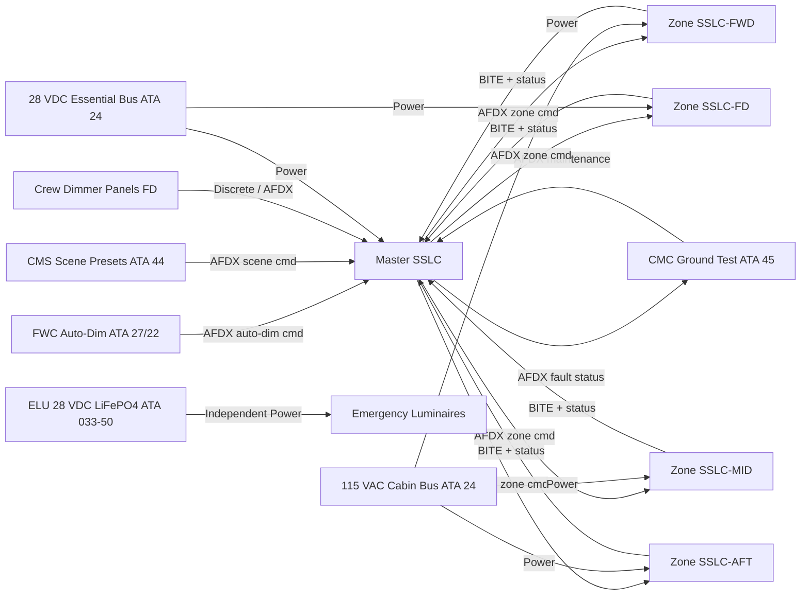
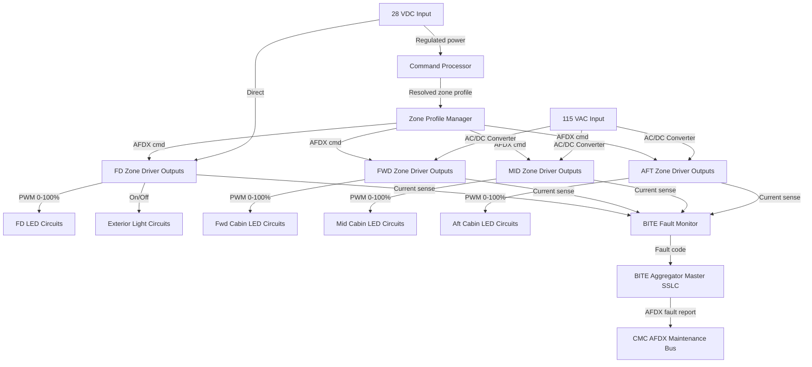
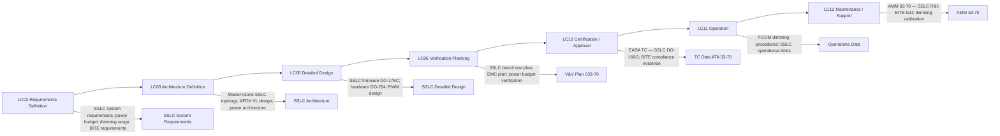

# 033-070 — Lighting Control, Dimming and Power Interfaces
### [PROGRAMME-AIRCRAFT] [PROGRAMME-VARIANT] · ATA 33 · Q+ATLANTIDE ATLAS Scaffold

---

## §0 Hyperlink Policy

All internal links in this document use relative paths from the current directory. External regulatory and standards references use anchor links defined in [§20 References](#20-references). Links marked **TBD** indicate targets not yet allocated within the CSDB or ATLAS hierarchy. Programme-level links traverse five directory levels (`../../../../../`) to reach the repository root. No absolute URLs are used for internal navigation.

---

## §1 Purpose

This document defines the agnostic ATLAS standard-level architecture context for `033-070 — Lighting Control, Dimming and Power Interfaces`.

It describes the controlled scope, functions, interfaces, safety considerations, lifecycle traceability, and S1000D/CSDB mapping logic that programme implementations shall instantiate when this node is applicable.

This document is not a programme design baseline. Programme-specific capacities, locations, part numbers, effectivity, operating limits, maintenance references, and data module codes shall be defined only inside the applicable programme implementation branch.
## §2 Applicability

| Applicability Level | Rule |
|---|---|
| Standard taxonomy | Applies to the ATLAS node `<NODE>` |
| Programme implementation | Conditional; determined by programme architecture, trade studies, certification basis, and applicability model |
| Product configuration | Defined in the programme-specific configuration baseline |
| Effectivity | Defined in the programme CSDB / applicability layer |
| Non-applicability | Must be explicitly stated in the programme impact-study branch when excluded |
## §3 System / Function Overview

The SSLC architecture on the [PROGRAMME-AIRCRAFT] [PROGRAMME-VARIANT] replaces conventional relay-and-rheostat dimmer panels and incandescent light systems. A single Master SSLC (located in the avionics bay — TBD final location) acts as the system manager: it receives high-level lighting commands from the FWC (Flight Warning Computer for auto-dim and flight-phase logic), the CMS (Cabin Management System for cabin scene presets), and the CMC (Central Maintenance Computer for ground test and fault queries). The Master SSLC translates these commands into per-zone lighting profiles and transmits zone commands over AFDX to the four Zone SSLCs.

Zone SSLCs are distributed throughout the aircraft (forward, mid, aft zones for the cabin; one dedicated flight-deck/exterior zone). Each Zone SSLC directly drives the LED loads in its zone using PWM-controlled LED driver circuits (0–100% duty cycle at TBD kHz frequency). Zone SSLCs also perform local current monitoring on each LED driver output for BITE (short-circuit, open-LED-string, over-temperature detection). BITE faults are reported back to the Master SSLC over AFDX and onward to the CMC.

Power architecture: flight-deck and exterior LEDs are powered from the 28 VDC essential bus (always available in flight; critical safety lights). Cabin interior LEDs are powered from the 115 VAC cabin bus via the Zone SSLC internal AC/DC converters (Zone SSLCs step down to appropriate DC voltage for LED drivers). Emergency lighting (ELUs) operates on an independent 28 VDC path derived from LiFePO4 batteries inside each ELU, completely isolated from the aircraft AC bus. This isolation ensures that emergency lighting activates automatically when the 115 VAC bus is lost (ELU auto-activates on bus loss detection).

---

## §4 Scope

### 4.1 Included
- Master SSLC: system-level lighting controller; AFDX interface to FWC, CMS, CMC; zone command generation; BITE aggregation and CMC reporting
- Zone SSLCs (×4): zone-level LED drivers; PWM dimming; per-channel current sensing BITE; AFDX to Master SSLC
  - Zone SSLC-FD: flight deck + exterior lights (28 VDC powered)
  - Zone SSLC-FWD: forward cabin (115 VAC → internal DC)
  - Zone SSLC-MID: mid cabin (115 VAC → internal DC)
  - Zone SSLC-AFT: aft cabin + lavatories (115 VAC → internal DC)
- PWM dimming: 0–100% duty cycle per channel; dimming curve (linear or gamma-corrected — TBD) for perceptually uniform dimming
- Power interfaces: 28 VDC essential bus for Zone SSLC-FD and exterior lights; 115 VAC cabin bus for Zone SSLCs-FWD/MID/AFT; ELU 28 VDC independent (not SSLC-controlled)
- AFDX network integration: SSLC AFDX connections on the aircraft AFDX backbone (or dedicated lighting AFDX virtual links — TBD)
- Lighting power budget: tabulated per zone; total estimated ATA 33 connected load (watts)
- BITE: per-SSLC fault detection; fault code reporting over AFDX to CMC

### 4.2 Excluded
- ELU battery management and charging — ELU internal function (described in 033-050)
- Individual LED light assembly design — covered by respective subsubject files (033-010 through 033-060)
- Sign controller (if standalone from SSLC) — covered by 033-060
- CMC / OMS application software — covered by ATA 45 and 033-080
- AFDX network physical layer and switch design — covered by ATA 46

---

## §5 Architecture Description

- **Master SSLC LRU**: One per aircraft; located in avionics bay (TBD). Connects to AFDX backbone (dual AFDX ports for redundancy — TBD). Manages zone profiles, receives commands from FWC (auto-dim), CMS (scene presets), and CMC (maintenance test). MTBF target: TBD hours. DO-178C DAL TBD (DAL-D proposed — assess per FHA).
- **Zone SSLC-FD LRU**: Located in avionics bay or flight-deck equipment bay. Drives all flight-deck LED circuits (overhead, glareshield, chart, dome, flood) and all exterior lighting circuits. Powered from 28 VDC essential bus. PWM dimming 0–100% for dimmable flight-deck zones; on/off for exterior lights. NVIS compatibility filter provision: TBD.
- **Zone SSLC-FWD LRU**: Located in forward equipment bay or overhead panel in forward cabin section. Drives forward cabin LED ceiling panels, reading lights, PSU lights, forward galley lights. 115 VAC input → internal AC/DC converter → LED driver outputs.
- **Zone SSLC-MID LRU**: Drives mid-cabin LED panels and reading lights. 115 VAC input.
- **Zone SSLC-AFT LRU**: Drives aft cabin, galley, and lavatory LED circuits. 115 VAC input.
- **PWM dimming**: All dimmable LED circuits use PWM at TBD kHz (selected to avoid visible flicker > 60 Hz photosensitive epilepsy threshold per IEC 62031 / IEEE 1789). Dimming range: 0% (off) to 100% (full brightness). Minimum dimming level for occupied-on state: TBD % (maintaining readable illumination at lowest scene preset).
- **Power architecture**: 28 VDC essential bus → Zone SSLC-FD (directly to LED driver outputs) and exterior lighting circuits. 115 VAC cabin bus → Zone SSLC-FWD/MID/AFT (internal PFC + AC/DC converter). ELU 28 VDC (LiFePO4 internal): direct to emergency luminaire drivers — completely independent of SSLCs.
- **AFDX virtual links**: Dedicated AFDX virtual links (VLs) for: Master SSLC → Zone SSLCs (command); Zone SSLCs → Master SSLC (status + BITE); Master SSLC ↔ CMC (maintenance); Master SSLC ↔ FWC (auto-dim); Master SSLC ↔ CMS (scene preset). VL IDs TBD per AFDX network allocation.

---

## §6 Functional Breakdown

| Function ID | Title | Description | Controller | Power |
|---|---|---|---|---|
| CTRL-001 | Zone Profile Management | Master SSLC generates and transmits zone lighting profiles (brightness % per channel) based on crew, FWC, and CMS inputs | Master SSLC | 28 VDC essential bus (Master SSLC) |
| CTRL-002 | Flight-Deck Dimming | Zone SSLC-FD drives FD LED circuits at commanded duty cycle 0–100% | Zone SSLC-FD | 28 VDC essential bus |
| CTRL-003 | Exterior Light Switching | Zone SSLC-FD switches exterior light circuits (on/off only — no dimming for FAR Part 25 required lights) | Zone SSLC-FD | 28 VDC essential bus |
| CTRL-004 | Forward Cabin Scene Control | Zone SSLC-FWD drives forward cabin ceiling, reading, and galley LEDs per scene preset profile | Zone SSLC-FWD | 115 VAC cabin bus |
| CTRL-005 | Mid Cabin Scene Control | Zone SSLC-MID drives mid-cabin LED panels per scene preset | Zone SSLC-MID | 115 VAC cabin bus |
| CTRL-006 | Aft Cabin / Lav Scene Control | Zone SSLC-AFT drives aft cabin, galley, and lavatory LEDs; lavatory door-interlock overrides | Zone SSLC-AFT | 115 VAC cabin bus |
| CTRL-007 | Auto-Dim (FWC Interface) | Master SSLC receives FWC auto-dim command; applies progressive dim to flight-deck zones at night | Master SSLC | — |
| CTRL-008 | BITE Aggregation | Master SSLC collects zone BITE status; formats fault entries; transmits to CMC over AFDX | Master SSLC | — |
| CTRL-009 | Ground Test Control | Master SSLC executes CMC-commanded test sequences: activate all zones at 100%; per-zone lamp test | Master SSLC | — |

---

## §7 System Context Diagram

---

## §8 Internal Functional Architecture

---

## §9 Lifecycle Traceability

---

## §10 Interfaces

| Interface ID | System / Chapter | Interface Type | Data / Signal | Direction | Status |
|---|---|---|---|---|---|
| IF-033-70-001 | ATA 24 — 28 VDC Essential Bus | Power | 28 VDC for Master SSLC and Zone SSLC-FD | ATA24 → ATA33-70 |  |
| IF-033-70-002 | ATA 24 — 115 VAC Cabin Bus | Power | 115 VAC for Zone SSLCs FWD/MID/AFT internal AC/DC | ATA24 → ATA33-70 |  |
| IF-033-70-003 | ATA 22/27 FWC | AFDX | Auto-dim command; night-mode profile; flight-phase lighting trigger | ATA22 → ATA33-70 |  |
| IF-033-70-004 | ATA 44 CMS | AFDX | Cabin scene preset commands; cabin crew dimmer interface | ATA44 ↔ ATA33-70 |  |
| IF-033-70-005 | ATA 45 CMC | AFDX | SSLC BITE fault data; ground test commands; zone status log | ATA33-70 → ATA45 |  |
| IF-033-70-006 | ATA 31 ECAM | AFDX | ECAM LIGHTS advisory for SSLC fault or zone failure above threshold | ATA33-70 → ATA31 |  |
| IF-033-70-007 | ATA 33-010 FD Lighting | Internal wiring | PWM-controlled LED driver outputs from Zone SSLC-FD to FD luminaires | ATA33-70 → ATA33-10 |  |
| IF-033-70-008 | ATA 33-020 Cabin Lighting | Internal wiring | PWM-controlled LED driver outputs from Zone SSLCs to cabin luminaires | ATA33-70 → ATA33-20 |  |
| IF-033-70-009 | ATA 33-040 Exterior Lighting | Internal wiring | On/off switch drive from Zone SSLC-FD to exterior light circuits | ATA33-70 → ATA33-40 |  |
| IF-033-70-010 | ATA 33-050 Emergency Lighting | Independent 28 VDC | ELU power independent from SSLC; SSLC does not control ELUs | Independent |  |
| IF-033-70-011 | ATA 33-060 Sign Controller | Internal AFDX or discrete | Sign commands from Master SSLC or FMS to sign controller (TBD — if sign controller is SSLC-integrated) | ATA33-70 ↔ ATA33-60 |  |
| IF-033-70-012 | Crew Overhead Dimmer Panel | Discrete / potentiometer | FD zone dimmer pots or rotary encoders to Zone SSLC-FD | Crew → ATA33-70 |  |

---

## §11 Operating Modes

| Mode ID | Mode Name | Description | Entry | Exit |
|---|---|---|---|---|
| OM-CTRL-001 | Power-Up Initialization | SSLCs self-test; AFDX link establishment; load default scene profiles | Power applied to SSLCs | Initialization complete (< TBD sec) |
| OM-CTRL-002 | Normal Operation | All SSLCs active; zone profiles commanded from Master SSLC; PWM dimming operative | Init complete; no SSLC fault | SSLC fault or power loss |
| OM-CTRL-003 | FWC Auto-Dim | FD zone dimming automatically adjusted by FWC (night / reduced external luminance) | FWC auto-dim command via AFDX | Crew override or FWC auto-dim disable |
| OM-CTRL-004 | CMS Scene Preset | Cabin zone profiles set by CMS cabin scene preset (boarding, cruise, meal, rest, night) | CMS scene command via AFDX | Crew override or next scene command |
| OM-CTRL-005 | Zone SSLC Degraded | One Zone SSLC BITE fault; affected zone lighting fails; Master SSLC reports fault to CMC | Zone SSLC fault detected | Zone SSLC replacement and reset |
| OM-CTRL-006 | Master SSLC Degraded | Master SSLC fault; Zone SSLCs revert to last-known good profile or safe default | Master SSLC fault | Master SSLC replacement and reset |
| OM-CTRL-007 | Ground Test | CMC commands full activation of all zones at 100%; BITE test sequence | CMC maintenance mode command on ground | CMC test complete |
| OM-CTRL-008 | Essential Power Only | 115 VAC cabin bus lost; Zone SSLCs FWD/MID/AFT lose power; cabin lights off; FD and exterior lights on 28 VDC | 115 VAC bus loss | 115 VAC bus restored |

---

## §12 Monitoring and Diagnostics

Each Zone SSLC monitors all LED driver output channels for:
- **Open-circuit**: No current detected when PWM commanded > 0% (LED string open; LED assembly failed or disconnected)
- **Short-circuit**: Overcurrent detected; driver shut down to protect wiring; fault logged
- **Over-temperature**: Thermal sensor in Zone SSLC enclosure; if SSLC temperature exceeds TBD °C, power is derated or zone is shut down with fault logged
- **AFDX link loss**: If a Zone SSLC loses AFDX connectivity to the Master SSLC, it holds the last commanded profile and logs a communication fault

The Master SSLC aggregates all zone fault data and reports to the CMC over AFDX. A zone health summary is also provided to ECAM. If a Zone SSLC detects a fault affecting more than TBD% of its LED channels, an ECAM LIGHTS advisory is generated.

Power monitoring: Zone SSLCs measure total zone power consumption (sum of channel currents × supply voltage). Power is logged and available to CMC for energy management monitoring.

---

## §13 Maintenance Concept

All SSLCs (Master and Zone) are LRU items. Replacement is triggered by CMC fault isolation. Each SSLC is accessible for line maintenance (TBD access panel location per structural layout freeze). Replacement procedure: (1) isolate power per AMM circuit breaker procedure, (2) disconnect AFDX and power connectors, (3) install replacement SSLC, (4) apply power and perform CMC-commanded SSLC self-test, (5) verify zone lighting function via CMC lamp test.

SSLC software and configuration data: uploaded via AFDX ACMF (Aircraft Condition Monitoring Function — ATA 46 integration TBD) or via AFDX maintenance terminal. Configuration data (zone profiles, dimming curves, scene presets) stored in SSLC non-volatile memory. Configuration backup held in CMC/OMS (TBD per data architecture).

No periodic calibration of SSLC dimming is planned. Should cabin luminance drift from nominal (LED aging > TBD %), the Zone SSLC profile can be recalibrated via CMC maintenance command.

---

## §14 S1000D / CSDB Mapping

### 14.1 SNS to DMC Mapping

| SNS Code | Subsubject Title | DMC Prefix | Info Codes Planned | DMRL Status |
|---|---|---|---|---|
| 033-70 | Lighting Control, Dimming and Power Interfaces | DMC-<PROGRAMME>-<VARIANT>-033-70 | 040, 300, 400, 520, 720 |  |

### 14.2 Planned Data Modules

| Info Code | DM Title | Description |
|---|---|---|
| 040 | SSLC System Description | Master + Zone SSLC architecture; AFDX integration; power architecture; PWM dimming |
| 300 | SSLC Normal and Degraded Operations | Crew procedures for SSLC degraded mode; zone failure response |
| 400 | SSLC Maintenance Procedures | SSLC BITE test; zone lamp test from CMC; dimming calibration |
| 520 | SSLC Fault Isolation | BITE isolation to Master SSLC, Zone SSLC, or specific driver channel |
| 720 | SSLC Removal and Installation | R&I for Master SSLC and each Zone SSLC |

---

## §15 Footprints

### 15.1 Physical Footprint
- Master SSLC: avionics bay — envelope TBD (~2 MCU / 1 ATR half-rack — TBD)
- Zone SSLC-FD: avionics bay or FD equipment bay — envelope TBD
- Zone SSLCs FWD/MID/AFT: overhead equipment bay above cabin — quantity 3 units; envelope TBD per unit
- Total SSLC mass budget: TBD kg

### 15.2 Electrical / Data Footprint
- 28 VDC load: Master SSLC self-power + Zone SSLC-FD driver outputs (FD lights ~TBD W + exterior lights ~TBD W)
- 115 VAC load: Zone SSLCs FWD/MID/AFT (cabin lighting ~TBD W total)
- AFDX: dedicated VLs — 1 per Zone SSLC command channel + 1 per status/BITE; total AFDX bandwidth TBD kbps
- Wiring harness: SSLC output wiring to all LED luminaires — total harness weight TBD kg

### 15.3 Maintenance Footprint
- LRUs: Master SSLC (×1); Zone SSLCs (×4); LED driver connectors (inline spares TBD)
- Tools: maintenance laptop / CMC terminal; multimeter for harness continuity check
- Scheduled: none — corrective on BITE alert; periodic LED energy check at TBD C-check interval

### 15.4 Data Footprint
- SSLC zone health log: per-channel ON/OFF, current, temperature; ring buffer ≥ TBD entries
- AFDX message logs: command + status VL archives; available to CMC OMS via download
- Power consumption log: per-zone real-time and historical; used for electrical load analysis

---

## §16 Safety and Certification Considerations

| Requirement | Source | Description | Compliance Approach | Status |
|---|---|---|---|---|
| DO-160G | RTCA | SSLC environmental qualification — vibration, temperature, humidity, EMC | All SSLCs qualified per DO-160G applicable categories |  |
| DO-178C | RTCA | SSLC firmware qualification — software assurance level | SSLC firmware developed per DO-178C; DAL TBD per FHA |  |
| DO-254 | RTCA | SSLC hardware (FPGA/ASIC) qualification | SSLC hardware developed per DO-254 if applicable |  |
| CS-25.1309 | EASA CS-25 | Equipment failure effects — SSLC failure analysis | FHA for SSLC failure modes; single Zone SSLC failure does not affect safety-critical lighting functions (external lights on independent 28 VDC) |  |
| CS-25.1353 | EASA CS-25 | Electrical equipment and installations | SSLC power installation; circuit protection per CS-25.1353 |  |
| EMC Requirements | CS-25 Subpart F | Electromagnetic compatibility — lighting PWM interference | PWM frequency and shielding design to avoid interference with avionics |  |

---

## §17 Verification and Validation

| V&V ID | Requirement | Method | Success Criterion | Status |
|---|---|---|---|---|
| VV-033-70-001 | SSLC PWM dimming range 0–100% | Bench test: measure PWM duty cycle and luminaire output at 0%, 10%, 50%, 100% | Correct duty cycle at each command level; no flicker above TBD Hz |  |
| VV-033-70-002 | Power architecture — essential bus lighting availability | Power-off test: disable 115 VAC cabin bus; verify FD and exterior lights remain on from 28 VDC | FD and all exterior lights remain on; Zone SSLCs FWD/MID/AFT power off |  |
| VV-033-70-003 | SSLC BITE — open circuit detection | Inject open-circuit on each zone driver channel; verify CMC fault log entry | All injected faults detected; fault code correct; ECAM advisory generated |  |
| VV-033-70-004 | Zone SSLC degraded mode | Force one Zone SSLC offline; verify Master SSLC continues to command remaining zones; fault reported | Unaffected zones remain operational; correct fault reported to CMC |  |
| VV-033-70-005 | AFDX communication integrity | AFDX frame loss injection test; verify SSLC fault-safe behaviour | Zone SSLC holds last profile on AFDX loss; fault logged within TBD ms |  |
| VV-033-70-006 | DO-160G environmental qualification | Environmental test at qualified lab | All SSLCs pass applicable DO-160G categories |  |
| VV-033-70-007 | EMC — PWM interference | EMC test per DO-160G Section 21 | No SSLC PWM interference with avionics in any zone |  |

---

## §18 Glossary

| Term | Definition |
|---|---|
| AFDX VL | AFDX Virtual Link — a defined, bandwidth-allocated, one-to-one or one-to-many communication channel on the AFDX network; each SSLC command and status path uses dedicated VLs |
| DO-254 | RTCA DO-254 — Design Assurance Guidance for Airborne Electronic Hardware; applies to complex electronic hardware (FPGAs, ASICs) used in SSLC if applicable |
| Master SSLC | The top-level Solid-State Lighting Controller LRU; the system manager that translates high-level lighting commands from FWC, CMS, and CMC into per-zone lighting profiles and distributes them to Zone SSLCs |
| PWM | Pulse-Width Modulation — a dimming technique where the LED is switched on and off at high frequency; the duty cycle (% on-time) determines perceived brightness; the [PROGRAMME-AIRCRAFT] uses 0–100% PWM for all dimmable zones |
| SSLC | Solid-State Lighting Controller — an electronic LRU that manages LED lighting circuits using semiconductor drivers (no mechanical relays or rheostats); provides dimming, fault detection, and AFDX connectivity |
| Zone SSLC | A satellite Solid-State Lighting Controller assigned to a specific zone of the aircraft (FD, FWD, MID, AFT); drives the LED loads in its zone per commands received from the Master SSLC over AFDX |

---

## §19 Citations

| Citation ID | Source | Title | Relevance |
|---|---|---|---|
| CIT-033-70-001 | RTCA | DO-160G — Environmental Conditions and Test Procedures | SSLC environmental qualification |
| CIT-033-70-002 | RTCA | DO-178C — Software Considerations in Airborne Systems | SSLC firmware qualification |
| CIT-033-70-003 | RTCA | DO-254 — Design Assurance for Airborne Electronic Hardware | SSLC hardware qualification (if applicable) |
| CIT-033-70-004 | RTCA | DO-293 — LED Aircraft Lighting | LED driver qualification |
| CIT-033-70-005 | EASA | CS-25.1309 | SSLC failure analysis |
| CIT-033-70-006 | ASD-STAN | S1000D Issue 5.0 | CSDB mapping |

---

## §20 References

| Ref ID | Document | Title | Link |
|---|---|---|---|
| REF-033-70-001 | DO-160G | Environmental Conditions | [RTCA](https://www.rtca.org/) |
| REF-033-70-002 | DO-178C | Software Considerations | [RTCA](https://www.rtca.org/) |
| REF-033-70-003 | CS-25 | EASA Certification Specifications | [EASA](https://www.easa.europa.eu/) |
| REF-033-70-004 | DO-293 | LED Aircraft Lighting | [RTCA](https://www.rtca.org/) |
| REF-033-70-005 | S1000D Issue 5.0 | Technical Publications | [s1000d.org](https://s1000d.org/) |
| REF-033-70-006 | 033-000 | ATA 33 Lights — General | [033-000-Lights-General.md](./033-000-Lights-General.md) |
| REF-033-70-007 | 033-080 | Lights Monitoring and Diagnostics | [033-080](./033-080-Lights-Monitoring-Diagnostics-and-Control-Interfaces.md) |

---

## §21 Open Issues

| Issue ID | Description | Owner | Priority | Status |
|---|---|---|---|---|
| OI-033-70-001 | Master SSLC DAL assignment — FHA outcome required to confirm DO-178C DAL (DAL-D proposed; if FHA shows higher failure effect, DAL-C applies) | Q-MECHANICS / Safety | High |  |
| OI-033-70-002 | PWM frequency selection — confirm kHz frequency; validate against IEC 62031 / IEEE 1789 flicker photosensitivity thresholds; EMC assessment | Q-MECHANICS | High |  |
| OI-033-70-003 | Sign controller integration — confirm whether sign controller is embedded in Master SSLC firmware or is a separate LRU; impacts SSLC DO-178C scope | Q-MECHANICS / ATA 33-60 | Medium |  |
| OI-033-70-004 | AFDX VL allocation — coordinate with ATA 46 network design team for VL IDs and bandwidth allocation for all SSLC communication paths | Q-MECHANICS / ATA 46 | Medium |  |
| OI-033-70-005 | Zone SSLC FWD/MID/AFT location — structural layout freeze required to confirm overhead equipment bay positions and harness routing lengths (drives weight estimate) | Q-MECHANICS / ATA 53 | Medium |  |

---

## §22 Change Log

| Revision | Date | Author | Description |
|---|---|---|---|
| 0.1.0 | 2026-05-09 | Q+ATLANTIDE / Q-MECHANICS | Initial scaffold creation — SSLC architecture; power interfaces; all sections drafted; TBD items identified |
