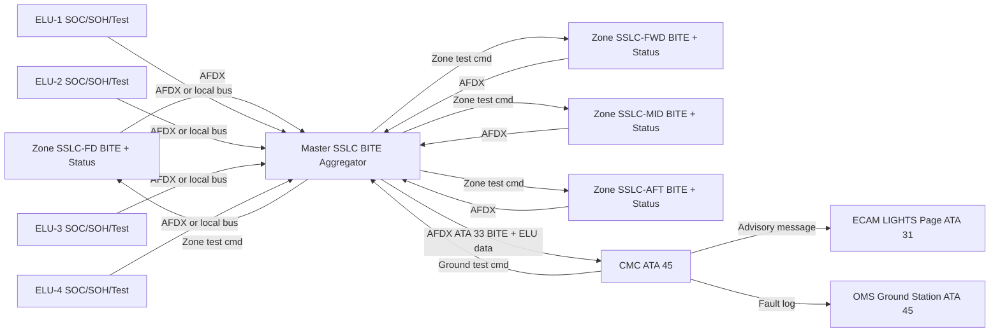
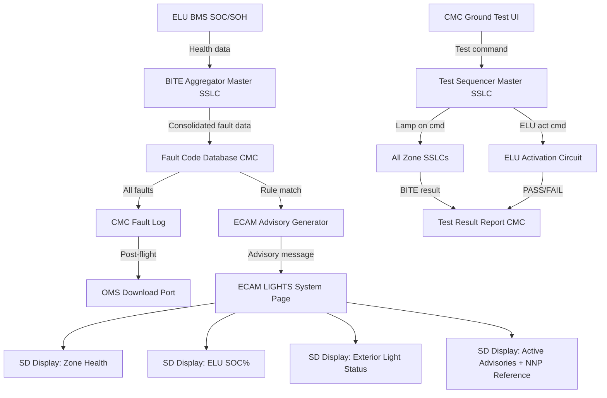
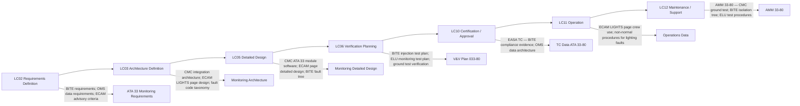

# 033-080 — Lights Monitoring, Diagnostics and Control Interfaces
### AMPEL360e eWTW · ATA 33 · Q+ATLANTIDE ATLAS Scaffold

---

## §0 Hyperlink Policy

All internal links in this document use relative paths from the current directory. External regulatory and standards references use anchor links defined in [§20 References](#20-references). Links marked **TBD** indicate targets not yet allocated within the CSDB or ATLAS hierarchy. Programme-level links traverse five directory levels (`../../../../../`) to reach the repository root. No absolute URLs are used for internal navigation.

---

## §1 Purpose

This document describes the Lights Monitoring, Diagnostics, and Control Interfaces subsystem (ATA 033-80) of the AMPEL360e eWTW aircraft. It covers the complete monitoring and diagnostic architecture for all ATA 33 lighting: collection of zone health data from all SSLCs (ATA 033-70), ECAM LIGHTS page non-normal procedures, ELU battery State of Charge (SOC) and State of Health (SOH) monitoring, CMC-commanded ground test sequences, and BITE fault isolation to LRU level.

This subsystem defines the OMS (On-board Maintenance System) data available for ATA 33 lighting — the interface between the SSLC system and the CMC/OMS that enables both in-flight crew awareness of lighting faults and post-flight maintenance action. All ATA 33 BITE fault data converges here before being distributed to the ECAM (for crew awareness) and to the OMS (for maintenance records).

---

## §2 Applicability

| Attribute | Value |
|---|---|
| Programme | AMPEL360e Wide Tube-and-Wing (eWTW) |
| ATA Subsubject | 033-80 — Lights Monitoring, Diagnostics and Control Interfaces |
| Aircraft Variant | eWTW-100 (baseline), eWTW-100ER |
| Monitoring Source | All SSLCs (ATA 033-70): Master SSLC + 4 Zone SSLCs + ELUs (ATA 033-50) |
| ECAM Display | ECAM LIGHTS page — zone health summary; exterior light status; advisory messages |
| ELU Monitoring | SOC (%), SOH (%), ELU self-test result (PASS/FAIL) |
| Ground Test | CMC-commanded: zone lamp test; ELU activation test; BITE query |
| Fault Isolation | BITE to LRU level: Master SSLC, Zone SSLC, individual LED driver channel, ELU |
| S1000D SNS | 033-80 |
| Applicability Code | ALL |

---

## §3 System / Function Overview

The ATA 033-80 subsystem is the monitoring and diagnostics hub for ATA 33. It aggregates fault data from all lighting LRUs (Master SSLC, four Zone SSLCs, four ELUs) and distributes it to the crew (via ECAM) and to maintenance (via CMC/OMS). It also provides the command interface for ground test of all lighting functions.

In-flight monitoring: the Master SSLC continuously transmits zone health summaries and ELU SOC/SOH data to the CMC over AFDX. The CMC processes this data and generates ECAM advisory messages for lighting conditions requiring crew attention (failed exterior lights with non-normal procedure implications; Zone SSLC fault; ELU low SOC). Non-critical faults (individual interior LED string failure below MEL threshold) are recorded in the CMC fault log for maintenance action but do not generate ECAM advisories.

Ground test: the CMC maintenance mode provides ground test commands to the Master SSLC over AFDX. Ground test sequences include: (1) full zone lamp test — all zones activated to 100% brightness sequentially; (2) ELU activation test — ELU forced on for TBD seconds to verify luminaire function and battery discharge capability; (3) per-channel BITE query — SSLC reports all detected faults.

BITE isolation: the SSLC BITE system provides fault codes identifying the LRU (Master SSLC vs. Zone SSLC-FD/FWD/MID/AFT), the driver channel (which LED string or circuit), and the fault type (open-circuit, short-circuit, over-temperature, AFDX loss). This data enables line maintenance to replace the correct LRU without diagnostic bench testing.

---

## §4 Scope

### 4.1 Included
- CMC/OMS integration: receiving, storing, and displaying SSLC zone health data and ELU data
- ECAM LIGHTS page: zone summary display, exterior light status, non-normal procedure references
- ECAM advisory generation rules: which fault conditions generate crew-visible advisory messages (MEL-critical faults only)
- ELU SOC monitoring: % state of charge per ELU; low-SOC advisory to CMC (ELU battery not fully charged)
- ELU SOH monitoring: battery health indicator (capacity fade); alert when ELU capacity below TBD % of rated
- ELU self-test result: PASS/FAIL per ELU (triggered by automatic 30-day self-test or CMC ground test)
- CMC ground test commands: zone lamp test, ELU activation test, per-channel BITE query
- BITE fault isolation: fault code taxonomy for all ATA 33 LRUs; fault → LRU replacement action mapping
- ACMF (Aircraft Condition Monitoring Function) data: ATA 33 lighting data available for download by airline OMS

### 4.2 Excluded
- SSLC hardware BITE circuitry — defined in ATA 033-70
- ELU battery hardware monitoring circuitry — defined in ATA 033-50
- ECAM system architecture — covered by ATA 31
- CMC system architecture — covered by ATA 45
- OMS ground station software — airline-specific
- AFDX network architecture — covered by ATA 46

---

## §5 Architecture Description

- **Master SSLC as BITE aggregator**: The Master SSLC is the primary source of all ATA 33 BITE data. It aggregates zone health reports from the four Zone SSLCs and ELU health data from each ELU, and transmits consolidated ATA 33 BITE data to the CMC over AFDX maintenance bus.
- **CMC fault processing**: The CMC receives ATA 33 BITE data, cross-references against the CMC fault isolation logic, and generates: (a) ECAM advisory messages for crew-visible faults, (b) CMC fault log entries for all faults, (c) OMS maintenance messages for post-flight download.
- **ECAM LIGHTS page**: A dedicated ECAM SD (System Display) page shows: zone SSLC health (green/amber per zone); exterior light status (on/off/fault per light type); ELU SOC (% per ELU); active ATA 33 advisories. Non-normal procedure reference (ECAM action items) for exterior light failures with operational implications (e.g., failed landing lights — reduced approach lighting).
- **ELU monitoring**: Each ELU transmits SOC (%) and SOH (%) data to the Master SSLC over AFDX (TBD — or direct from ELU to CMC if ELU has AFDX; or via 1-Wire / SMBUS local to ELU with Master SSLC as gateway — TBD per ELU detailed design). ELU self-test: every 30 days automatically (or CMC-commanded on ground), each ELU activates for TBD seconds and reports PASS/FAIL to CMC.
- **Ground test sequence**: CMC sends lighting test command to Master SSLC → Master SSLC broadcasts zone test activation to all Zone SSLCs → each Zone SSLC activates all channels at 100% and reports BITE result to Master SSLC → Master SSLC reports aggregate test result to CMC. Duration: TBD minutes per full lamp test. ELU activation test: CMC commands ELU test; Master SSLC relays to ELU activation circuit (if applicable); ELU activates emergency luminaires for TBD seconds; PASS/FAIL result logged.
- **BITE fault code taxonomy**: A standardised fault code structure: [System: 033] – [LRU: M (Master SSLC) / FD / FWD / MID / AFT / ELU-1 to ELU-4] – [Channel: 01–NN] – [Type: OC (open-circuit) / SC (short-circuit) / OT (over-temperature) / COMM (AFDX loss)]. Example: 033-FWD-07-OC = Zone SSLC-FWD, channel 7, open-circuit.

---

## §6 Functional Breakdown

| Function ID | Title | Description | Data Source | Data Consumer |
|---|---|---|---|---|
| MON-001 | Zone Health Monitoring | Continuous per-channel current sense and SSLC status from all Zone SSLCs; health aggregated by Master SSLC | Zone SSLCs | Master SSLC → CMC |
| MON-002 | ELU SOC Monitoring | ELU battery SOC (%) per ELU; low-SOC alert at TBD% | ELU internal BMS | Master SSLC → CMC → ECAM |
| MON-003 | ELU SOH Monitoring | ELU battery SOH (capacity %) per ELU; replacement alert at TBD% | ELU internal BMS | Master SSLC → CMC → OMS |
| MON-004 | ELU Self-Test | 30-day auto-test or CMC-commanded ground test; ELU PASS/FAIL | ELU hardware | CMC fault log |
| MON-005 | ECAM Advisory Generation | Rules engine: generate advisory for MEL-critical faults (exterior lights, SSLC fault, ELU low SOC) | CMC fault processing | ECAM LIGHTS page |
| MON-006 | ECAM LIGHTS Page Display | Real-time display of zone health, exterior light status, ELU SOC, active advisories | CMC / Master SSLC | ECAM SD page |
| MON-007 | CMC Fault Log | All ATA 33 faults logged with flight phase, timestamp, fault code | CMC | OMS post-flight download |
| MON-008 | Ground Lamp Test | CMC-commanded full zone activation; per-zone sequential activation and BITE query | CMC → Master SSLC → Zone SSLCs | CMC test result report |
| MON-009 | BITE Isolation Reporting | Fault code per LRU/channel/type; isolation to replaceable LRU | Master SSLC BITE aggregator | CMC → AMM fault isolation tree |

---

## §7 System Context Diagram

---

## §8 Internal Functional Architecture

---

## §9 Lifecycle Traceability

---

## §10 Interfaces

| Interface ID | System / Chapter | Interface Type | Data / Signal | Direction | Status |
|---|---|---|---|---|---|
| IF-033-80-001 | ATA 33-70 Master SSLC | AFDX | ATA 33 BITE fault codes; zone health summary; ELU SOC/SOH data | ATA33-70 → ATA33-80 |  |
| IF-033-80-002 | ATA 45 CMC | AFDX maintenance bus | ATA 33 fault processing; fault log storage; ECAM advisory generation; ground test commands | ATA33-80 ↔ ATA45 |  |
| IF-033-80-003 | ATA 31 ECAM | AFDX | ECAM LIGHTS page data; ATA 33 advisory messages | ATA33-80 → ATA31 |  |
| IF-033-80-004 | ATA 33-50 ELUs | AFDX or local bus | ELU SOC (%), SOH (%), self-test PASS/FAIL, activation status | ATA33-50 → ATA33-80 |  |
| IF-033-80-005 | OMS Ground Station | ACMF / Wireless or wired download | ATA 33 fault log; ELU SOC/SOH history; lighting event log | ATA33-80 → OMS |  |
| IF-033-80-006 | ATA 33-40 Exterior Lights (via SSLC) | AFDX | Exterior light on/off status; failed exterior light fault codes | ATA33-80 → ATA31 (via ECAM) |  |
| IF-033-80-007 | Maintenance Terminal | Wired (AFDX ground port) | CMC ground test commands; BITE query; ELU manual test trigger | Maintenance → ATA33-80 |  |

---

## §11 Operating Modes

| Mode ID | Mode Name | Description | Entry | Exit |
|---|---|---|---|---|
| OM-MON-001 | Normal In-Flight Monitoring | Continuous BITE data collection; zone health broadcast to CMC; ECAM advisory generation if fault above threshold | Normal flight | Fault detected or power loss |
| OM-MON-002 | ECAM Advisory Active | Active ECAM LIGHTS advisory displayed; non-normal procedure active for crew | Fault generating advisory detected | Fault cleared or maintenance action taken |
| OM-MON-003 | ELU Low-SOC Alert | ELU SOC below TBD % threshold; ECAM EMER LIGHTS BATT LOW advisory; no operational impact if above minimum | ELU SOC < TBD % | ELU SOC restored after recharge |
| OM-MON-004 | ELU Test In Progress | ELU self-test or CMC-commanded test active; ELU activates luminaires for TBD seconds | 30-day auto-trigger or CMC command on ground | Test complete; PASS/FAIL result logged |
| OM-MON-005 | Ground Test — Full Lamp | CMC-commanded full zone lamp test on ground; all zones activated sequentially at 100% | CMC maintenance mode | Test complete |
| OM-MON-006 | Ground Test — BITE Query | CMC queries all SSLC and ELU BITE data; generates fault report | CMC maintenance mode | BITE report generated |
| OM-MON-007 | OMS Download | ATA 33 fault log and ACMF data downloaded to airline OMS ground station | Aircraft on ground; OMS connection active | Download complete |

---

## §12 Monitoring and Diagnostics

**ECAM Advisory Criteria (ATA 33)**: The CMC generates ECAM LIGHTS advisories under the following conditions:

| Advisory | Trigger | Crew Action | MEL Impact |
|---|---|---|---|
| LIGHTS — EXTERIOR FAULT | Exterior light fault (landing, nav, strobe, beacon) | Check ECAM LIGHTS page; apply non-normal procedure | MEL: landing lights (dispatch with one per side); strobe/nav — go/no-go per MEL |
| LIGHTS — ZONE SSLC FAULT | Zone SSLC failure above fault threshold | Check ECAM LIGHTS page; apply MEL | Zone lighting inoperative; MEL per zone |
| LIGHTS — ELU LOW SOC | ELU SOC < TBD % | Note for maintenance; no immediate crew action; confirm ELU SOC before flight | Pre-flight check: ELU must be above minimum SOC for dispatch |
| LIGHTS — ELU FAULT | ELU BITE fault or ELU self-test FAIL | Check ECAM; notify maintenance; apply emergency lighting MEL | Emergency lighting MEL — dispatch only if backup luminaires confirmed |

Non-ECAM faults (below advisory threshold): individual interior LED string failures, cabin reading light failures — logged to CMC fault log for maintenance action; not displayed on ECAM.

**ELU Monitoring Detail**:
- SOC monitoring: ELU internal BMS reports SOC to Master SSLC (or CMC directly — TBD per ELU data interface) at TBD Hz. SOC logging enables trend analysis (battery degradation over time).
- SOH monitoring: ELU BMS tracks cell capacity vs. rated capacity. SOH < TBD % triggers CMC replacement advisory (not an ECAM advisory — maintenance action only).
- 30-day auto-test: ELU self-tests by activating the emergency luminaires for TBD seconds (sufficient to verify function without significant battery drain). PASS/FAIL logged. If FAIL, CMC generates a maintenance advisory.

---

## §13 Maintenance Concept

Ground maintenance diagnostic workflow for ATA 33:
1. Access CMC maintenance terminal (AFDX ground port or laptop with CMC interface software)
2. Query ATA 33 BITE status — CMC displays consolidated fault log with fault codes in [LRU]-[Channel]-[Type] format
3. Execute ground lamp test — verify all zones illuminate; BITE query confirms no open-circuit or short-circuit faults
4. Execute ELU test — CMC commands ELU activation; ELU activates luminaires; PASS/FAIL result displayed
5. If fault detected: BITE code isolates fault to Zone SSLC or specific driver channel → replace Zone SSLC LRU or LED luminaire assembly
6. Post-repair: re-run lamp test and BITE query; confirm PASS; clear fault log entry

MEL troubleshooting aids: the AMM 33-80 section provides a fault isolation tree referenced from ECAM advisory procedures. Each ECAM advisory links to the applicable AMM 33-80 fault isolation procedure. Fault isolation tree is also reproduced in S1000D DM 033-80-400.

---

## §14 S1000D / CSDB Mapping

### 14.1 SNS to DMC Mapping

| SNS Code | Subsubject Title | DMC Prefix | Info Codes Planned | DMRL Status |
|---|---|---|---|---|
| 033-80 | Lights Monitoring, Diagnostics and Control Interfaces | DMC-AMPEL360E-EWTW-033-80 | 040, 300, 400, 520 |  |

### 14.2 Planned Data Modules

| Info Code | DM Title | Description |
|---|---|---|
| 040 | ATA 33 Monitoring System Description | BITE architecture; ECAM LIGHTS page; ELU monitoring; CMC integration |
| 300 | ECAM LIGHTS Non-Normal Procedures | Crew response to each ECAM LIGHTS advisory; ECAM action items |
| 400 | ATA 33 Diagnostic and Ground Test Procedures | CMC lamp test; ELU test; BITE query; fault interpretation |
| 520 | ATA 33 Fault Isolation | BITE fault code taxonomy; isolation tree from ECAM advisory to LRU replacement |

---

## §15 Footprints

### 15.1 Physical Footprint
- ATA 033-80 is primarily a software/data architecture subsystem; no dedicated hardware LRU unique to this subsubject
- Hardware involved: Master SSLC (ATA 033-70), CMC (ATA 45), ECAM SD (ATA 31) — covered by respective ATA chapters
- ECAM LIGHTS page definition: display logic hosted on ECAM/CMC software; no additional hardware

### 15.2 Electrical / Data Footprint
- Data: AFDX — Master SSLC → CMC maintenance bus; CMC → ECAM; CMC → OMS download port
- ELU data path: ELU → Master SSLC → CMC (TBD — or ELU direct AFDX if ELU has AFDX capability)
- ACMF data: ATA 33 data included in ACMF download schedule; download rate TBD

### 15.3 Maintenance Footprint
- Tools: CMC maintenance terminal (AFDX ground port laptop with CMC access); no special ATA 33-specific tools
- Scheduled: 30-day ELU auto-test (automatic — no maintenance action unless FAIL); periodic CMC fault log review per AMM task card (TBD at C-check)
- Corrective: ECAM advisory → AMM 33-80 fault isolation → LRU replacement → lamp test verification

### 15.4 Data Footprint
- CMC ATA 33 fault log: ≥ 500 fault entries; ring buffer; timestamp + flight phase per entry
- ELU SOC/SOH log: per ELU; 30-day history minimum; available for OMS trend analysis
- ACMF ATA 33 dataset: zone health, ELU SOC trend, lamp test history; downloadable by airline OMS

---

## §16 Safety and Certification Considerations

| Requirement | Source | Description | Compliance Approach | Status |
|---|---|---|---|---|
| CS-25.1309 | EASA CS-25 | Equipment failure analysis — BITE/monitoring failure not to mask safety-critical lighting faults | BITE failure analysis; BITE self-monitoring (watchdog); safety assessment |  |
| CS-25.812 (ELU monitoring) | EASA CS-25 | Emergency lighting — ELU must be in serviceable state for dispatch; SOC monitoring supports pre-flight check | ELU SOC pre-flight check procedure defined in FCOM/QRH; SOC data accessible via CMC |  |
| AMC 25.1309 | EASA AMC | Guidance on BITE design — BITE coverage targets | BITE architecture designed per AMC 25.1309 guidance; BITE coverage TBD % |  |
| MSG-3 | Airlines for America | Maintenance Steering Group — BITE-based maintenance logic | ATA 33 BITE data feeds MSG-3 on-condition maintenance tasks for lighting LRUs |  |

---

## §17 Verification and Validation

| V&V ID | Requirement | Method | Success Criterion | Status |
|---|---|---|---|---|
| VV-033-80-001 | BITE fault detection coverage | BITE injection test: inject each fault type (OC, SC, OT, COMM loss) on each SSLC and ELU | All injected faults detected; correct fault code generated; CMC fault log entry correct |  |
| VV-033-80-002 | ECAM advisory generation | Inject MEL-critical faults; verify ECAM advisory appears with correct message and NNP reference | Each MEL-critical fault generates correct ECAM advisory within TBD seconds |  |
| VV-033-80-003 | ELU SOC monitoring accuracy | Bench test: discharge ELU to TBD%; compare BMS SOC report to measured SOC | BMS SOC within TBD % of measured SOC |  |
| VV-033-80-004 | ELU self-test — PASS reporting | Bench test: run ELU self-test on healthy ELU; verify PASS result reported to CMC | PASS result within TBD seconds; logged to CMC fault log |  |
| VV-033-80-005 | ELU self-test — FAIL reporting | Bench test: run ELU self-test on degraded or disconnected ELU; verify FAIL reported | FAIL result and fault code correct; CMC maintenance advisory generated |  |
| VV-033-80-006 | CMC ground lamp test | CMC-commanded ground lamp test; verify all zone luminaires activate and deactivate in correct sequence | All zones activate at 100% in correct sequence; BITE PASS for all channels |  |
| VV-033-80-007 | Fault isolation to LRU | Each fault code uniquely maps to one replaceable LRU; verify fault isolation tree coverage | 100% of fault codes traceable to specific LRU without ambiguity for all ATA 33 LRUs |  |

---

## §18 Glossary

| Term | Definition |
|---|---|
| ACMF | Aircraft Condition Monitoring Function — the airborne function that collects, stores, and transmits aircraft health monitoring data to the ground; ATA 33 BITE data is part of the ACMF dataset |
| ECAM LIGHTS page | The ECAM System Display (SD) page dedicated to ATA 33 lighting; displays zone SSLC health, exterior light status, ELU SOC, and active lighting advisories |
| OMS | On-board Maintenance System — the airborne system that stores and processes maintenance data; CMC is the core of OMS; ATA 33 fault data is stored in the OMS and downloadable to the airline ground station |
| SOC | State of Charge — the instantaneous charge level of an ELU battery expressed as a percentage of full capacity (0% = fully discharged; 100% = fully charged) |
| SOH | State of Health — a measure of the ELU battery's current capacity relative to its rated new capacity, expressed as a percentage; SOH decreases over time due to charge cycling; replacement recommended below TBD % SOH |
| BITE coverage | The percentage of possible fault conditions that the BITE system can detect; higher BITE coverage means fewer undetected faults and reduced in-service troubleshooting time |
| Non-normal procedure (NNP) | A crew procedure performed in response to an abnormal or emergency condition displayed on ECAM; the ECAM LIGHTS page provides NNP references for lighting faults requiring crew action |

---

## §19 Citations

| Citation ID | Source | Title | Relevance |
|---|---|---|---|
| CIT-033-80-001 | EASA | CS-25.1309 | BITE and monitoring failure analysis |
| CIT-033-80-002 | EASA | CS-25.812 | ELU serviceability monitoring |
| CIT-033-80-003 | EASA | AMC 25.1309 | BITE design guidance |
| CIT-033-80-004 | Airlines for America | MSG-3 Rev 2015.1 | Maintenance Steering Group logic |
| CIT-033-80-005 | ASD-STAN | S1000D Issue 5.0 | CSDB mapping |

---

## §20 References

| Ref ID | Document | Title | Link |
|---|---|---|---|
| REF-033-80-001 | CS-25 | EASA Certification Specifications | [EASA](https://www.easa.europa.eu/) |
| REF-033-80-002 | AMC 25.1309 | Equipment BITE Guidance | [EASA](https://www.easa.europa.eu/) |
| REF-033-80-003 | MSG-3 | Maintenance Steering Group Rev 2015.1 | [A4A](https://www.airlines.org/) |
| REF-033-80-004 | S1000D Issue 5.0 | Technical Publications | [s1000d.org](https://s1000d.org/) |
| REF-033-80-005 | 033-000 | ATA 33 Lights — General | [033-000-Lights-General.md](./033-000-Lights-General.md) |
| REF-033-80-006 | 033-050 | Emergency Lighting | [033-050](./033-050-Emergency-Lighting.md) |
| REF-033-80-007 | 033-070 | Lighting Control, Dimming and Power Interfaces | [033-070](./033-070-Lighting-Control-Dimming-and-Power-Interfaces.md) |

---

## §21 Open Issues

| Issue ID | Description | Owner | Priority | Status |
|---|---|---|---|---|
| OI-033-80-001 | ELU data interface to CMC — confirm whether ELU SOC/SOH data routes through Master SSLC via AFDX or via ELU direct AFDX port; impacts ELU hardware and SSLC software design | Q-MECHANICS / ATA 33-50 | High |  |
| OI-033-80-002 | ECAM LIGHTS page detailed content — coordinate with ATA 31 ECAM team to define exact page layout, advisory text, and NNP reference formatting | Q-MECHANICS / ATA 31 | Medium |  |
| OI-033-80-003 | BITE coverage target — define minimum % BITE coverage required for ATA 33 per CS-25.1309 / AMC 25.1309 analysis; allocate to SSLC and ELU BITE design | Q-MECHANICS / Safety | Medium |  |
| OI-033-80-004 | ELU SOC minimum for dispatch — define minimum pre-flight ELU SOC % for dispatch; coordinate with safety / CS-25.812 compliance substantiation | Q-MECHANICS / ORB-LEG | High |  |

---

## §22 Change Log

| Revision | Date | Author | Description |
|---|---|---|---|
| 0.1.0 | 2026-05-09 | Q+ATLANTIDE / Q-MECHANICS | Initial scaffold creation — monitoring and diagnostics architecture; ECAM LIGHTS page; ELU monitoring; all sections drafted; TBD items identified |
