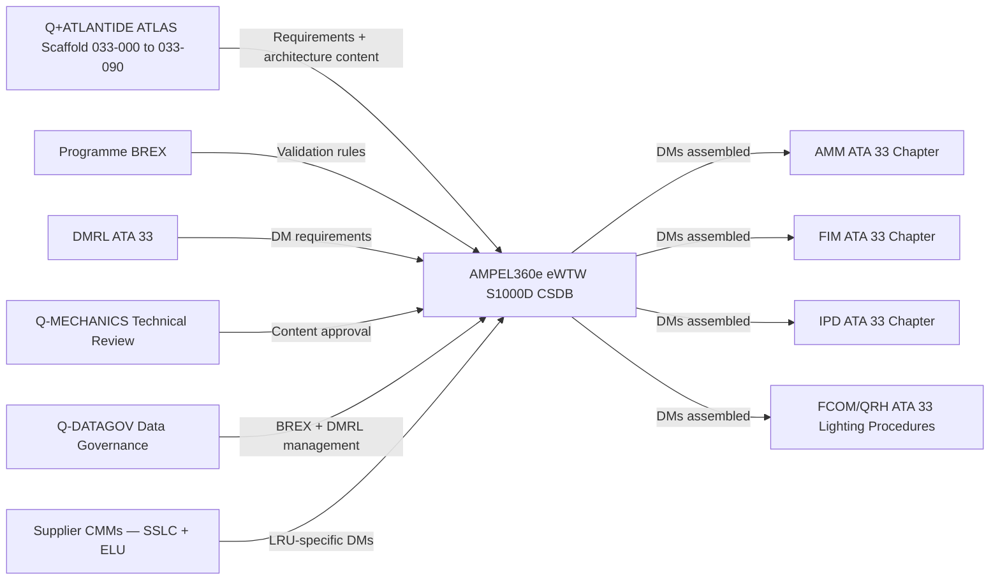
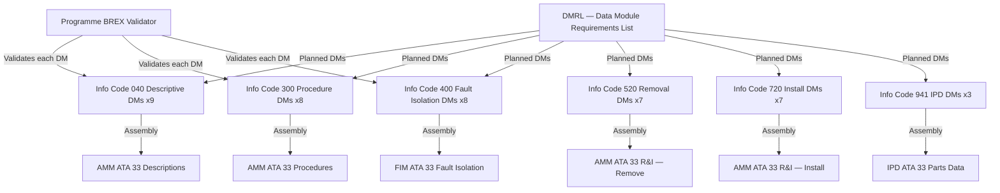
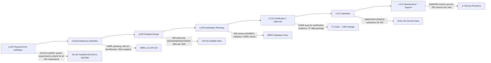

# 033-090 — S1000D CSDB Mapping and Traceability
### AMPEL360e eWTW · ATA 33 · Q+ATLANTIDE ATLAS Scaffold

---

## §0 Hyperlink Policy

All internal links in this document use relative paths from the current directory. External regulatory and standards references use anchor links defined in [§20 References](#20-references). Links marked **TBD** indicate targets not yet allocated within the CSDB or ATLAS hierarchy. Programme-level links traverse five directory levels (`../../../../../`) to reach the repository root. No absolute URLs are used for internal navigation.

---

## §1 Purpose

This document defines the S1000D Common Source Data Base (CSDB) mapping and traceability architecture for ATA 33 Lights on the AMPEL360e eWTW aircraft. It provides the authoritative SNS-to-DMC code mapping, the planned Data Module (DM) set for each ATA 33 subsubject (033-00 through 033-80), the Data Module Requirements List (DMRL) planning status, Business Rules Exchange (BREX) applicability, and the ATA 33 publication hierarchy within the AMPEL360e eWTW S1000D CSDB.

This document is primarily authored and maintained by Q-DATAGOV (the data governance Q-Division) in coordination with Q-MECHANICS (the system engineering Q-Division for ATA 33). It serves as the technical data architecture reference for the ATLAS scaffold-to-CSDB mapping and for programme traceability across the full ATA 33 data set.

---

## §2 Applicability

| Attribute | Value |
|---|---|
| Programme | AMPEL360e Wide Tube-and-Wing (eWTW) |
| ATA Subsubject | 033-90 — S1000D CSDB Mapping and Traceability |
| Aircraft Variant | eWTW-100 (baseline), eWTW-100ER |
| S1000D Issue | Issue 5.0 (target; Issue 4.2 as fallback — TBD per programme BREX) |
| CSDB | AMPEL360e eWTW CSDB — TBD hosting and toolchain |
| SNS Codes Mapped | 033-00 through 033-80 (9 subsubjects) |
| DM Info Codes | 040, 300, 400, 520, 720, 941 (planned — see §6) |
| BREX | AMPEL360e eWTW programme BREX (TBD) |
| DMRL Status | Not yet frozen — planning phase |
| S1000D SNS | 033-90 |
| Applicability Code | ALL |

---

## §3 System / Function Overview

The S1000D CSDB for the AMPEL360e eWTW programme is the single source of truth for all aircraft technical publications, from the Aircraft Maintenance Manual (AMM) through Illustrated Parts Data (IPD), Flight Operations publications, and Wiring Manual (WM). ATA 33 Lights contributes a data module set covering descriptions, procedures, fault isolation, removal/installation, and parts data for all lighting subsystems.

The ATLAS scaffold files (033-000 through 033-090) represent the architecture and requirements phase of technical documentation (lifecycle phases LC02–LC06). During detailed design (LC05), the ATLAS scaffold content is translated into formal S1000D Data Modules with all CSDB-required attributes: DMC (Data Module Code), applicable effectivity, issue/inwork status, BREX-validated content.

The Q-DATAGOV division maintains the programme BREX, manages the DMRL, and coordinates with supplier technical authors (for LRU-specific DMs, if applicable) and airline technical services (for customisation requirements). Q-MECHANICS provides the technical content review and approval for all ATA 33 DMs.

---

## §4 Scope

### 4.1 Included
- SNS-to-DMC mapping table: complete mapping for all 9 ATA 33 subsubjects (033-00 through 033-80)
- Planned DM set per subsubject: info codes and DM titles
- DMRL planning: status of each planned DM (not started / in work / complete / approved)
- BREX applicability: which BREX rules apply to ATA 33 DMs; any ATA 33-specific BREX additions
- Publication hierarchy: how ATA 33 DMs are assembled into publications (AMM, IPD, Operations, etc.)
- Traceability: ATLAS scaffold file → CSDB DM → programme requirement

### 4.2 Excluded
- CSDB toolchain implementation — covered by programme IT / Q-DATAGOV infrastructure
- Airline-customisation CSDB layers — covered by programme customer services
- S1000D training data modules — not planned for ATA 33 at this stage
- IETP (Interactive Electronic Technical Publication) rendering — downstream from CSDB; out of scope for this scaffold

---

## §5 Architecture Description

- **DMC structure for ATA 33**: `DMC-AMPEL360E-EWTW-{SNS}-{disassembly}-{disassembly variant}-{info code}-{info code variant}-{language}-{issue}`. Example: `DMC-AMPEL360E-EWTW-033-00-00-040-A-EN-US-00A`.
- **SNS coding**: SNS = `033-{NN}` where NN is the two-digit subsubject code (00, 10, 20, 30, 40, 50, 60, 70, 80). Note: there is no 033-90 as a separate system subject in S1000D (this file is an ATLAS scaffold meta-document, not a CSDB DM itself).
- **Info code taxonomy for ATA 33**: 040 = Descriptive (system description); 300 = Procedures (normal operations and abnormal); 400 = Fault Isolation (BITE and troubleshooting); 520 = Remove (R&I remove step); 720 = Install (R&I install step); 941 = Illustrated Parts Data (IPD / IPL per LRU).
- **BREX**: The programme BREX (Business Rules Exchange Object) defines the allowed element/attribute combinations, data module content rules, and programme-specific additions. ATA 33 DMs must pass BREX validation before entry into the CSDB. ATA 33-specific BREX rules to be identified during DMRL planning phase (e.g., handling of TBD content during design freeze).
- **DMRL**: The Data Module Requirements List is the controlled planning document listing every planned DM for ATA 33. DMRL records: DM title, DMC, responsible author, planned delivery date, current status, and approval status.
- **Publication assembly**: ATA 33 DMs are assembled into the following publications per programme publication architecture: (a) AMM — ATA 33 chapter; (b) FIM (Fault Isolation Manual) — ATA 33 troubleshooting section; (c) IPD — ATA 33 illustrated parts data; (d) FCOM/QRH — crew procedures (non-normal); (e) CMM (Component Maintenance Manual) — supplier-provided for SSLC and ELU LRUs (TBD supplier).

---

## §6 Functional Breakdown — SNS to DMC Mapping

### 6.1 Complete SNS to DMC Mapping Table

| SNS Code | Subsubject Title | ATLAS Scaffold File | DMC Prefix | Planned Info Codes | DMRL Status |
|---|---|---|---|---|---|
| 033-00 | Lights — General | 033-000-Lights-General.md | DMC-AMPEL360E-EWTW-033-00 | 040 |  |
| 033-10 | Flight Deck and Crew Compartment Lighting | 033-010-Flight-Deck-and-Crew-Compartment-Lighting.md | DMC-AMPEL360E-EWTW-033-10 | 040, 300, 400, 520, 720 |  |
| 033-20 | Passenger Cabin Lighting | 033-020-Passenger-Cabin-Lighting.md | DMC-AMPEL360E-EWTW-033-20 | 040, 300, 400, 520, 720, 941 |  |
| 033-30 | Cargo and Service Compartment Lighting | 033-030-Cargo-and-Service-Compartment-Lighting.md | DMC-AMPEL360E-EWTW-033-30 | 040, 300, 400, 520, 720 |  |
| 033-40 | Exterior Lighting | 033-040-Exterior-Lighting.md | DMC-AMPEL360E-EWTW-033-40 | 040, 300, 400, 520, 720, 941 |  |
| 033-50 | Emergency Lighting | 033-050-Emergency-Lighting.md | DMC-AMPEL360E-EWTW-033-50 | 040, 300, 400, 520, 720, 941 |  |
| 033-60 | Signage and Information Lighting | 033-060-Signage-and-Information-Lighting.md | DMC-AMPEL360E-EWTW-033-60 | 040, 300, 400, 520, 720 |  |
| 033-70 | Lighting Control, Dimming and Power Interfaces | 033-070-Lighting-Control-Dimming-and-Power-Interfaces.md | DMC-AMPEL360E-EWTW-033-70 | 040, 300, 400, 520, 720 |  |
| 033-80 | Lights Monitoring, Diagnostics and Control Interfaces | 033-080-Lights-Monitoring-Diagnostics-and-Control-Interfaces.md | DMC-AMPEL360E-EWTW-033-80 | 040, 300, 400, 520 |  |

### 6.2 Planned DM Set — Info Code Detail

| Info Code | Full Title | Description | Applicable SNS |
|---|---|---|---|
| 040 | Descriptive — System/Subsystem Description | System description, operating principles, architectural overview | All (033-00 through 033-80) |
| 300 | Procedures — Normal and Non-Normal | Crew/ground operational procedures; normal operations; non-normal / abnormal procedures | 033-10, 033-20, 033-30, 033-40, 033-50, 033-60, 033-70, 033-80 |
| 400 | Fault Isolation | BITE-based troubleshooting; fault isolation trees; ECAM advisory → corrective action | 033-10, 033-20, 033-30, 033-40, 033-50, 033-60, 033-70, 033-80 |
| 520 | Removal | Removal procedures for LRU replacement; circuit breaker isolation; connector disconnection | 033-10, 033-20, 033-30, 033-40, 033-50, 033-60, 033-70 |
| 720 | Installation | Installation procedures for LRU replacement; torque values; connector reconnection; post-installation test | 033-10, 033-20, 033-30, 033-40, 033-50, 033-60, 033-70 |
| 941 | Illustrated Parts Data (IPD) | Parts breakdown with part numbers, quantities, effectivity, and inter-changeability; one IPD DM per major assembly | 033-20, 033-40, 033-50 |

---

## §7 System Context Diagram

---

## §8 Internal Functional Architecture

---

## §9 Lifecycle Traceability

---

## §10 Interfaces

| Interface ID | System / Chapter | Interface Type | Data / Signal | Direction | Status |
|---|---|---|---|---|---|
| IF-033-90-001 | Q+ATLANTIDE ATLAS repository | Document content | ATLAS scaffold file content → CSDB DM authoring source | ATLAS → CSDB |  |
| IF-033-90-002 | Programme BREX | CSDB validation | BREX XML ruleset; ATA 33 DMs validated against BREX before entry | BREX → CSDB |  |
| IF-033-90-003 | DMRL database | Data management | DMRL records DM requirement, DMC, author, status, delivery date | DMRL ↔ CSDB |  |
| IF-033-90-004 | Supplier CMMs (SSLC, ELU) | CSDB contribution | Supplier provides LRU-specific DMs (CMM-level) for SSLC and ELU; integrated into eWTW CSDB per agreement | Supplier → CSDB |  |
| IF-033-90-005 | ATA 33-80 CMC/OMS | Technical content | Monitoring and diagnostics DMs (Info Code 400) reference CMC fault codes defined in ATA 033-80 | ATA33-80 → DM400 |  |
| IF-033-90-006 | Publication assembly engine | CSDB output | AMM / FIM / IPD assembled from CSDB DMs; publication management by Q-DATAGOV | CSDB → Publications |  |
| IF-033-90-007 | Airline customer services | CSDB customisation layer | Airline-specific effectivity and customisation applied as CSDB layer; ATA 33 customer data items TBD | CSDB → Airline CSDB |  |

---

## §11 Operating Modes

| Mode ID | Mode Name | Description | Entry | Exit |
|---|---|---|---|---|
| OM-CSDB-001 | DMRL Planning | DMRL under active planning; SNS→DMC mapping defined; DM titles and info codes confirmed; DMs not yet authored | ATLAS scaffold approved | DMRL frozen (version-controlled) |
| OM-CSDB-002 | DM Authoring | Technical authors drafting DM content from ATLAS scaffold; BREX validation ongoing | DMRL frozen | All DMs at "inwork" status |
| OM-CSDB-003 | DM Review and BREX Validation | Q-MECHANICS technical review; Q-DATAGOV BREX validation; DMs iterated to approval | DM authoring complete | All DMs BREX-valid and approved |
| OM-CSDB-004 | TC Data Issue | Snapshot of CSDB issued as TC evidence package; DMs at approved status | TC submission | TC certificate issued |
| OM-CSDB-005 | EIS Publication | AMM/FIM/FCOM/IPD published from CSDB for Entry into Service | TC issued | First aircraft delivery |
| OM-CSDB-006 | In-Service Revision | DMs revised per service bulletin, AD, or mod; DMRL updated; publications re-issued | Mod / SB issued | Revised publication issued |

---

## §12 Monitoring and Diagnostics

This subsystem is a data governance and traceability document, not a flight system. Monitoring in this context refers to DMRL progress tracking and BREX compliance:

- **DMRL progress tracking**: Q-DATAGOV tracks each DM in the DMRL across statuses: Planned → In Work → Under Review → BREX Valid → Approved. A DMRL dashboard (TBD toolchain) provides programme-level visibility of ATA 33 documentation progress.
- **BREX compliance**: Each DM is validated against the programme BREX before entry into the CSDB. BREX errors are tracked as open issues and resolved before DM approval. BREX validation is automated (CSDB toolchain) and manual (content rule check).
- **Traceability gap monitoring**: The mapping between ATLAS scaffold requirements and planned DMs is tracked. Gaps (ATLAS scaffold requirement without a corresponding DM, or DMs without traceability to a requirement) are flagged as open issues.

---

## §13 Maintenance Concept

This document is updated by Q-DATAGOV when:
- New ATA 33 LRUs are added or removed (changing DM requirements)
- Programme BREX is updated (changing validation rules)
- DMRL is revised (adding, removing, or re-titling DMs)
- S1000D issue is updated (e.g., Issue 5.0 to a later issue)
- Airline-specific customisation requirements are received

Revision control: this ATLAS scaffold file follows the repository revision process (git-based). The corresponding DMRL document is version-controlled separately in the programme DMRL database (TBD toolchain). At each DMRL version freeze, this scaffold should be updated to reflect the frozen DMRL status.

---

## §14 S1000D / CSDB Mapping

This document is itself the CSDB mapping reference for ATA 33. The mapping is defined in §6 above. There are no sub-DMs planned for SNS 033-90 (this is an ATLAS meta-document, not a system subject in S1000D).

### 14.1 Programme CSDB Hierarchy for ATA 33

| Level | Item | Description |
|---|---|---|
| Programme | AMPEL360e-EWTW | Top-level model identifier in all DMCs |
| System | 033 | ATA 33 Lights |
| Subsubject | 00 – 80 | Nine subsubjects per ATLAS scaffold |
| Disassembly code | 00 | Standard (no disassembly breakdown required for most lighting DMs) |
| Disassembly variant | A | Standard variant |
| Info code | 040 / 300 / 400 / 520 / 720 / 941 | DM type |
| Language | EN-US | Initial language; FR-FR, PT-BR for airline customisation TBD |

### 14.2 ATA 33 Publication Map

| Publication | Applicable Info Codes | ATA 33 Content |
|---|---|---|
| AMM — Aircraft Maintenance Manual | 040, 300, 400, 520, 720 | System descriptions; procedures; fault isolation; R&I |
| FIM — Fault Isolation Manual | 400 | BITE fault codes; isolation trees; corrective actions |
| IPD — Illustrated Parts Data | 941 | Parts breakdown: exterior light assemblies, ELUs, SSLC LRUs |
| FCOM / QRH — Flight Crew Operating Manual | 300 (operations subset) | Non-normal lighting procedures; ECAM LIGHTS non-normal procedures |
| CMM — Component Maintenance Manual | Supplier-provided | SSLC and ELU shop maintenance; TBD supplier scope |

---

## §15 Footprints

### 15.1 Physical Footprint
- No physical hardware — this is a data architecture document
- CSDB server hosting: programme IT infrastructure (TBD — cloud-hosted or on-premises per programme decision)

### 15.2 Electrical / Data Footprint
- CSDB storage: estimated ATA 33 DM set (42 DMs planned) × average DM size (TBD MB with graphics) = total CSDB contribution TBD MB
- DMRL database: lightweight (< 1 MB); stored in programme DMRL toolchain

### 15.3 Maintenance Footprint
- Q-DATAGOV resources: CSDB administrator, BREX manager, DMRL coordinator
- DM authors: Q-MECHANICS system engineers provide technical review; external tech-pubs authors TBD
- Toolchain: S1000D authoring tool (TBD — Arbortext, Oxygen XML, or equivalent); CSDB (TBD — S1000D-compatible CSDB software)

### 15.4 Data Footprint
- DMRL: 42 planned DMs for ATA 33 (9 SNS × ~4.7 DMs average per SNS); DMRL record per DM
- BREX log: per-DM BREX validation results; archived per DMRL revision

---

## §16 Safety and Certification Considerations

| Requirement | Source | Description | Compliance Approach | Status |
|---|---|---|---|---|
| CS-25 Subpart H Appendix H | EASA CS-25 | ICA (Instructions for Continued Airworthiness) — ATA 33 maintenance documentation must be provided at TC; AMM and FIM are part of ICA | ATA 33 AMM (DM 040/400/520/720) and FIM (DM 400) provided at TC as ICA deliverables |  |
| S1000D Issue 5.0 | ASD-STAN | S1000D compliance — DMs must conform to S1000D schema and programme BREX | All ATA 33 DMs authored and validated per S1000D Issue 5.0 and programme BREX |  |
| ATA iSpec 2200 | ATA | ATA chapter structure — ATA 33 chapter in AMM follows iSpec 2200 structure | SNS coding aligned with ATA iSpec 2200 ATA 33 structure; DMC references ATA chapter convention |  |
| MSG-3 | Airlines for America | Maintenance task generation — ATA 33 on-condition maintenance tasks derived from MSG-3 analysis | MSG-3 ATA 33 task data incorporated into AMM DMs (info code 300 / 400 as applicable) |  |

---

## §17 Verification and Validation

| V&V ID | Requirement | Method | Success Criterion | Status |
|---|---|---|---|---|
| VV-033-90-001 | DMRL completeness — all ATA 33 requirements mapped to DMs | DMRL cross-check against ATLAS scaffold §6 functional breakdown for each subsubject | 100% of ATLAS scaffold requirements mapped to at least one DM; no gaps |  |
| VV-033-90-002 | BREX validation — all ATA 33 DMs pass BREX | CSDB toolchain BREX validation for each submitted DM | All 42 planned DMs pass BREX validation; zero BREX errors on final submission |  |
| VV-033-90-003 | ICA deliverable completeness — AMM and FIM for ATA 33 complete at TC | Publication assembly check: all ICA-required DMs assembled in AMM and FIM; TC data package review | AMM ATA 33 chapter and FIM ATA 33 section complete with zero outstanding DMs |  |
| VV-033-90-004 | DMC uniqueness — no duplicate DMC codes in CSDB | CSDB toolchain uniqueness check | Zero duplicate DMCs in CSDB for ATA 33 |  |
| VV-033-90-005 | Supplier CMM integration — SSLC and ELU CMMs available and integrated | CMM receipt and CSDB integration check | SSLC and ELU CMMs received from supplier; integrated in CSDB before EIS |  |

---

## §18 Glossary

| Term | Definition |
|---|---|
| BREX | Business Rules Exchange — an S1000D XML document that defines the programme-specific business rules for data module content; all DMs must pass BREX validation before entry into the CSDB |
| CSDB | Common Source Data Base — the S1000D repository storing all data modules for a programme; the single source of truth for technical publications |
| DM | Data Module — the fundamental unit of information in S1000D; an XML document containing one coherent piece of technical content (e.g., one system description, one removal procedure) |
| DMC | Data Module Code — the unique identifier for a DM in S1000D format; encodes model identification, SNS, info code, and language |
| DMRL | Data Module Requirements List — the controlled planning document listing all planned DMs for a programme or chapter; records author, status, and delivery date |
| ICA | Instructions for Continued Airworthiness — the maintenance documentation (AMM, FIM, IPD, etc.) required by CS-25 Appendix H to be provided at TC; ATA 33 AMM and FIM are part of ICA |
| Info code | A numeric code in the DMC that identifies the type of DM content: 040 = descriptive; 300 = procedure; 400 = fault isolation; 520 = remove; 720 = install; 941 = IPD |
| SNS | Standard Numbering System — the S1000D hierarchical numbering scheme mapping to ATA chapter/section/subject structure; ATA 33 = SNS 033 |

---

## §19 Citations

| Citation ID | Source | Title | Relevance |
|---|---|---|---|
| CIT-033-90-001 | ASD-STAN | S1000D Issue 5.0 — International specification for technical publications | Governing specification for ATA 33 CSDB DM production |
| CIT-033-90-002 | ATA | iSpec 2200 — Information Standards for Aviation Maintenance | ATA chapter structure and SNS alignment for ATA 33 |
| CIT-033-90-003 | Airlines for America | MSG-3 Rev 2015.1 — Airline/Manufacturer Maintenance Program Development Document | ATA 33 on-condition maintenance task development |
| CIT-033-90-004 | EASA | CS-25 Appendix H — Instructions for Continued Airworthiness | ICA deliverable requirements for ATA 33 |

---

## §20 References

| Ref ID | Document | Title | Link |
|---|---|---|---|
| REF-033-90-001 | S1000D Issue 5.0 | International Spec for Technical Publications | [s1000d.org](https://s1000d.org/) |
| REF-033-90-002 | ATA iSpec 2200 | Aviation Maintenance Information Standards | [ATA](https://www.ata.org/) |
| REF-033-90-003 | MSG-3 Rev 2015.1 | Maintenance Program Development | [A4A](https://www.airlines.org/) |
| REF-033-90-004 | CS-25 Appendix H | Instructions for Continued Airworthiness | [EASA](https://www.easa.europa.eu/) |
| REF-033-90-005 | 033-000 | ATA 33 Lights — General | [033-000-Lights-General.md](./033-000-Lights-General.md) |
| REF-033-90-006 | 033-070 | Lighting Control, Dimming and Power Interfaces | [033-070](./033-070-Lighting-Control-Dimming-and-Power-Interfaces.md) |
| REF-033-90-007 | 033-080 | Lights Monitoring, Diagnostics and Control Interfaces | [033-080](./033-080-Lights-Monitoring-Diagnostics-and-Control-Interfaces.md) |

---

## §21 Open Issues

| Issue ID | Description | Owner | Priority | Status |
|---|---|---|---|---|
| OI-033-90-001 | S1000D issue version — confirm whether programme adopts Issue 5.0 or Issue 4.2 as primary; affects BREX schema version and DMC format | Q-DATAGOV | High |  |
| OI-033-90-002 | CSDB toolchain selection — programme has not yet selected the CSDB and authoring tool; affects BREX implementation and DM authoring workflow | Q-DATAGOV / ORB-PMO | High |  |
| OI-033-90-003 | Supplier CMM scope — confirm which LRUs (SSLC, ELU) have supplier-furnished CMMs vs. programme-produced maintenance DMs; impacts DMRL DM count and authoring responsibility | Q-DATAGOV / Q-MECHANICS | Medium |  |
| OI-033-90-004 | Airline customisation language requirement — confirm which languages (FR-FR, PT-BR, etc.) require translated ATA 33 DMs; impacts DMRL total DM count (×languages) | Q-DATAGOV / Customer Services | Medium |  |
| OI-033-90-005 | DM 941 IPD scope — confirm whether IPD is programme-produced or supplier-furnished for SSLC (complex LRU); ELU IPD typically supplier-furnished | Q-DATAGOV / Q-MECHANICS | Medium |  |

---

## §22 Change Log

| Revision | Date | Author | Description |
|---|---|---|---|
| 0.1.0 | 2026-05-09 | Q+ATLANTIDE / Q-DATAGOV | Initial scaffold creation — complete SNS→DMC mapping; DMRL planning; BREX and publication hierarchy; all sections drafted; TBD items identified |
