# ATLAS 030-039 · Section 03 · Subsection 033 — Lights

## 1. Purpose

Subsection-level index for *Lights* (`033`) within ATLAS `030-039` — *Protección & Sistemas Mecánicos* — ATA 33.

This subsection is part of the **ATLAS-1000** register, a subpart of the controlled **Q+ATLANTIDE** baseline[^baseline][^n001].

## 2. Scope

- Reserves the subsubject namespace `00`–`99` of subsection `033` *Lights*.
- Inherits Q-Division authority and ORB support from the parent row in [`../../README.md` §3](../../README.md#3-architecture-table)[^archtable] and the section index in [`../README.md`](../README.md).
- The Overview and detailed subsubjects (`00`–`99`) will be populated in subsequent baseline releases per the parent section's authorisation.

## 3. Subsubject Index

| NNN | Title | Document | Status |
|---:|---|---|---|
| `000` | Lights General | [`033-000-Lights-General.md`](./033-000-Lights-General.md) | active |
| `010` | Flight Deck and Crew Compartment Lighting | [`033-010-Flight-Deck-and-Crew-Compartment-Lighting.md`](./033-010-Flight-Deck-and-Crew-Compartment-Lighting.md) | active |
| `020` | Passenger Cabin Lighting | [`033-020-Passenger-Cabin-Lighting.md`](./033-020-Passenger-Cabin-Lighting.md) | active |
| `030` | Cargo and Service Compartment Lighting | [`033-030-Cargo-and-Service-Compartment-Lighting.md`](./033-030-Cargo-and-Service-Compartment-Lighting.md) | active |
| `040` | Exterior Lighting | [`033-040-Exterior-Lighting.md`](./033-040-Exterior-Lighting.md) | active |
| `050` | Emergency Lighting | [`033-050-Emergency-Lighting.md`](./033-050-Emergency-Lighting.md) | active |
| `060` | Signage and Information Lighting | [`033-060-Signage-and-Information-Lighting.md`](./033-060-Signage-and-Information-Lighting.md) | active |
| `070` | Lighting Control, Dimming and Power Interfaces | [`033-070-Lighting-Control-Dimming-and-Power-Interfaces.md`](./033-070-Lighting-Control-Dimming-and-Power-Interfaces.md) | active |
| `080` | Lights Monitoring, Diagnostics and Control Interfaces | [`033-080-Lights-Monitoring-Diagnostics-and-Control-Interfaces.md`](./033-080-Lights-Monitoring-Diagnostics-and-Control-Interfaces.md) | active |
| `090` | S1000D CSDB Mapping and Traceability | [`033-090-S1000D-CSDB-Mapping-and-Traceability.md`](./033-090-S1000D-CSDB-Mapping-and-Traceability.md) | active |

## 4. Footprint

| Metric | Value |
|---|---|
| Architecture | `ATLAS` — Aircraft Top Level Architecture Schema/System (controlled term) |
| Master range | `000–099` |
| Code range | `030-039` |
| Section | `03` — Protección & Sistemas Mecánicos |
| Subsection | `033` — Lights |
| Subsubject namespace | `00`–`99` (reserved) |
| Primary Q-Division | Q-MECHANICS[^qdiv] |
| Support Q-Divisions | Q-AIR, Q-STRUCTURES |
| ORB support | ORB-PMO, ORB-LEG |
| Governance class | `baseline`[^gov] |
| Folder path | `Q+ATLANTIDE/000-099_ATLAS/030-039_Proteccion-y-Sistemas-Mecanicos/033_Lights/` |
| Document | `README.md` (this file) |
| Parent section | [`../README.md`](../README.md) |
| Parent architecture | [`../../README.md`](../../README.md) |
| Parent baseline | [`organization/Q+ATLANTIDE.md`](../../../../organization/Q+ATLANTIDE.md) |

> **Footprint Notes**
> - **Architecture**: `ATLAS` is the controlled term for the Aircraft Top-Level Architecture Schema/System within the Q+ATLANTIDE-1000 register.
> - **Primary Q-Division**: Q-MECHANICS holds technical authority for mechanical and electro-mechanical aircraft systems.
> - **Support Q-Divisions**: Q-AIR provides systems integration oversight; Q-STRUCTURES provides structural interface authority.
> - **Governance class**: `baseline` documents are subject to formal change control under the Q+ATLANTIDE Configuration Management Plan.
> - **ORB support**: ORB-PMO coordinates programme management; ORB-LEG provides regulatory and certification support.

## Governance

Governed by [`organization/Q+ATLANTIDE.md`](../../../../organization/Q+ATLANTIDE.md)[^baseline]. All subsubjects under this subsection inherit `architecture_code = ATLAS`, `primary_q_division = Q-MECHANICS` and `governance_class = baseline` from the parent ATLAS section. Extensions added under `00`–`99` shall preserve those header fields and reuse the footnote set declared here.

## 4b. Interfaces Diagram

```mermaid
flowchart TB
    SEC["Section 03 · 030-039<br/>Protección &amp; Sistemas Mecánicos"]:::section
    SUB["033 — Lights<br/>(ATA 33)"]:::subsection
    SEC --> SUB

    subgraph SUBS["Subsubjects (033-000 … 033-090)"]
        direction LR
        SS_000["033-000<br/>Lights General"]:::document
        SS_010["033-010<br/>Flight Deck and Crew Comp…"]:::document
        SS_020["033-020<br/>Passenger Cabin Lighting"]:::document
        SS_030["033-030<br/>Cargo and Service Compart…"]:::document
        SS_040["033-040<br/>Exterior Lighting"]:::document
        SS_050["033-050<br/>Emergency Lighting"]:::document
        SS_060["033-060<br/>Signage and Information L…"]:::document
        SS_070["033-070<br/>Lighting Control Dimming …"]:::document
        SS_080["033-080<br/>Lights Monitoring Diagnos…"]:::document
        SS_090["033-090<br/>S1000D CSDB Mapping and T…"]:::document
    end
    SUB --> SUBS

    QPRIM["Q-MECHANICS[^qdiv]<br/>(primary authority)"]:::qdiv
    QSUPP["Q-AIR · Q-STRUCTURES<br/>(support)"]:::qdiv
    ORB["ORB-PMO · ORB-LEG<br/>(enterprise support)"]:::orb

    SUB --> QPRIM
    SUB -.-> QSUPP
    SUB -.-> ORB

    SUBS --> SS_000
    SUBS --> SS_010
    SUBS --> SS_020
    SUBS --> SS_030
    SUBS --> SS_040
    SUBS --> SS_050
    SUBS --> SS_060
    SUBS --> SS_070
    SUBS --> SS_080
    SUBS --> SS_090

    classDef baseline fill:#1f3a93,stroke:#0b1d4a,color:#fff
    classDef atlas fill:#154360,stroke:#0b1d4a,color:#fff
    classDef section fill:#2c82c9,stroke:#0b1d4a,color:#fff
    classDef subsection fill:#85c1e9,stroke:#2c82c9,color:#0b1d4a
    classDef document fill:#ffd700,stroke:#b8860b,color:#000
    classDef qdiv fill:#f6e6ff,stroke:#7d3c98,color:#3b1f4d
    classDef orb fill:#e9f7ef,stroke:#1e8449,color:#145a32
```

## 5. References & Citations

[^baseline]: **Q+ATLANTIDE controlled baseline (v1.0.0)** — [`organization/Q+ATLANTIDE.md`](../../../../organization/Q+ATLANTIDE.md).

[^archtable]: **§3 — Architecture Table (parent)** — [`../../README.md` §3](../../README.md#3-architecture-table).

[^qdiv]: **Q-Division authority** — [`organization/Q-Divisions/`](../../../../organization/Q-Divisions/).

[^gov]: **Governance class** — `baseline` denotes documents under controlled change management within the Q+ATLANTIDE baseline.

[^n001]: **Note N-001** — Q+ATLANTIDE (with its ATLAS-1000 register subpart) is a taxonomy and traceability ecosystem, not an organization chart. See [`organization/Q+ATLANTIDE.md` §4](../../../../organization/Q+ATLANTIDE.md#4-notes).

### Citation & Traceability Map

| Ref | Target Document | Relationship | Scope |
|---|---|---|---|
| [^baseline] | [`organization/Q+ATLANTIDE.md`](../../../../organization/Q+ATLANTIDE.md) | Normative baseline | ATLAS-1000 register authority |
| [^archtable] | [`../../README.md §3`](../../README.md#3-architecture-table) | Parent architecture table | Inherited Q-Division and ORB support |
| [^qdiv] | [`organization/Q-Divisions/`](../../../../organization/Q-Divisions/) | Technical authority | Q-Division assignment |
| [^gov] | Q+ATLANTIDE governance class definition | Governance class | Change-management classification |
| [^n001] | [`organization/Q+ATLANTIDE.md §4`](../../../../organization/Q+ATLANTIDE.md#4-notes) | Taxonomy note | Ecosystem scope clarification |
