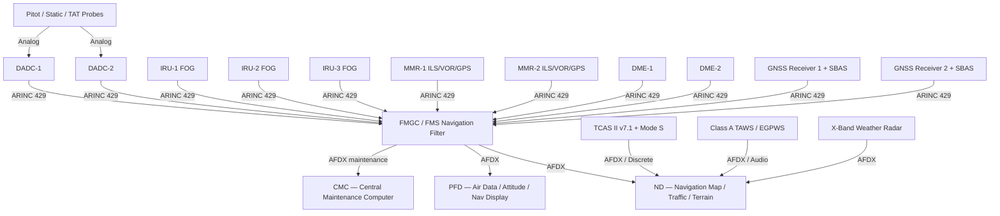
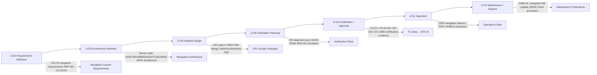

# 034-000 — Navigation — General
### [PROGRAMME-AIRCRAFT] [PROGRAMME-VARIANT] · ATA 34 · Q+ATLANTIDE ATLAS Scaffold

---

## §0 Hyperlink Policy

All internal links in this document use relative paths from the current directory. External regulatory and standards references use anchor links defined in [§20 References](#20-references). Links marked **TBD** indicate targets not yet allocated within the CSDB or ATLAS hierarchy. Programme-level links traverse five directory levels (`../../../../../`) to reach the repository root. No absolute URLs are used for internal navigation.

---

## §1 Purpose

This document defines the agnostic ATLAS standard-level architecture context for `034-000 — Navigation — General`.

It describes the controlled scope, functions, interfaces, safety considerations, lifecycle traceability, and S1000D/CSDB mapping logic that programme implementations shall instantiate when this node is applicable.

This document is not a programme design baseline. Programme-specific capacities, locations, part numbers, effectivity, operating limits, maintenance references, and data module codes shall be defined only inside the applicable programme implementation branch.
## §2 Applicability

| Applicability Level | Rule |
|---|---|
| Standard taxonomy | Applies to the ATLAS node `<NODE>` |
| Programme implementation | Conditional; determined by programme architecture, trade studies, certification basis, and applicability model |
| Product configuration | Defined in the programme-specific configuration baseline |
| Effectivity | Defined in the programme CSDB / applicability layer |
| Non-applicability | Must be explicitly stated in the programme impact-study branch when excluded |
## §3 System / Function Overview

ATA 34 on the [PROGRAMME-AIRCRAFT] [PROGRAMME-VARIANT] encompasses all systems responsible for determining the aircraft's position, attitude, and velocity; providing situational awareness of the flight environment (air data, weather, terrain, traffic); and delivering navigation data to the Flight Management and Guidance Computer (FMGC) and cockpit displays.

The architecture is stratified into six functional layers:

1. **Air Environment Sensing**: DADCs process pitot/static and temperature probe inputs to deliver calibrated airspeed, Mach, altitude, and temperature data.
2. **Inertial Reference**: Three IRUs provide autonomous position, velocity, and attitude data independent of external radio signals.
3. **Radio Navigation**: MMRs (dual) decode VOR bearing, DME slant range, and ILS localizer/glideslope to support approach and en-route operations.
4. **Satellite Navigation**: Dual GNSS receivers with SBAS augmentation provide precision global positioning and RAIM integrity monitoring.
5. **Traffic and Terrain Surveillance**: TCAS II provides collision avoidance; Class A TAWS provides terrain and obstacle alerting.
6. **Navigation Fusion**: The FMS/FMGC navigation filter fuses IRS, GNSS, DME-DME, and VOR-DME data to provide the best position estimate for flight guidance and RNP/RNAV operations.

The composite fuselage of the [PROGRAMME-VARIANT] introduces unique challenges for antenna installation (RF transparency TBD) and magnetic heading sensing (ferromagnetic interference from carbon fibre reinforced polymer, TBD). These are identified as open issues.

---

## §4 Scope

### 4.1 Included
- Dual DADC with pitot/static probes, AOA sensors, TAT probes (electrically heated)
- Triple IRU (FOG-based, GPS-aided alignment)
- AHRS function (attitude and heading reference, including magnetic heading via flux valve / magnetometer TBD)
- Dual MMR: ILS (Cat I; Cat II/III TBD), VOR, GPS approach modes
- DME (distance measuring equipment) — dual
- Marker beacon (TBD — may be suppressed as legacy)
- ADF (TBD — may be suppressed on [PROGRAMME-VARIANT])
- Dual GNSS receivers with L1 (L5 TBD) and SBAS (WAAS/EGNOS) augmentation
- GBAS approach capability (TBD — optional fitment)
- TCAS II version 7.1 with Mode S transponder and ADS-B Out (1090ES)
- ADS-B In (TIS-B/FIS-B) — TBD optional equipment
- Class A TAWS / EGPWS with synthetic terrain and predictive alerting
- X-band forward-looking weather radar (turbulence, predictive windshear)
- FMS/FMGC navigation sensor fusion filter (IRS + GNSS + DME-DME + VOR-DME)
- RNP/RNAV airspace qualification (RAIM / ARAIM integrity monitoring TBD)
- Navigation database management (ARINC 615A data loading)
- AFDX + ARINC 429 navigation data bus network
- CMC/OMS monitoring, BITE, ECAM navigation page, MCDU navigation pages
- S1000D CSDB mapping and traceability for ATA 34

### 4.2 Excluded
- Flight Management System (FMS) host platform and non-navigation FMS functions — ATA 22
- Autopilot and flight director — ATA 22
- ACARS / CPDLC datalink for ATC communication — ATA 23
- Electrical power generation and distribution — ATA 24
- IMA platform hosting navigation software partitions — ATA 42
- CMC host platform — ATA 45
- Cockpit display system (PFD, ND, ECAM) hardware — ATA 31

---

## §5 Architecture Description

- **Dual DADC architecture**: Two independent DADCs (DADC-1 and DADC-2) each process their own pitot/static probe set and TAT probe. Outputs are cross-compared; disagreement generates a PFD amber advisory. Electrically heated probes replace bleed-air heated probes — consistent with the all-electric architecture.
- **Triple IRU / FOG technology**: Three IRUs provide fault tolerance: triple-redundant for attitude/heading; voting logic in the FMGC navigation filter detects IRU drift or failure. GPS-aided rapid alignment reduces alignment time below 5 minutes (TBD target). FOG technology (ring laser or MEMS TBD) provides high accuracy without moving parts.
- **Dual MMR (Multi-Mode Receiver)**: A single LRU per side integrates ILS + VOR + GPS approach modes, reducing weight and LRU count compared to separate ILS, VOR, and GPS approach receivers. Frequency and mode selection via MCDU/FMS.
- **Dual GNSS + SBAS**: Two independent GNSS receivers (GPS; Galileo TBD) with SBAS augmentation (WAAS / EGNOS selectable by region) provide RNP-AR approach precision. RAIM provides GPS integrity monitoring; ARAIM is a planned future upgrade.
- **TCAS II v7.1 + Mode S / ADS-B Out**: TCAS II version 7.1 (DO-185B) provides collision avoidance RA and TA. Mode S transponder integrates ADS-B Out (1090ES) per CS-ACNS.D.ADS-B mandatory requirements. Top and bottom antennas for TCAS.
- **Class A TAWS (EGPWS)**: Class A system per DO-161A includes all seven GPWS modes plus predictive terrain look-ahead using a worldwide terrain/obstacle database. Interfaces with radio altimeter (0–2500 ft range).
- **X-band weather radar**: Forward-looking radar in composite CFRP nose radome provides weather depiction, turbulence detection, and predictive windshear alerting. Radome RF performance (composite CFRP vs. conventional fibreglass TBD) is an open issue.
- **FMS Navigation Filter**: The FMGC hosts a Kalman-filter-based navigation estimator fusing IRS, GNSS, DME-DME, and VOR-DME. Outputs best-estimate position, velocity, and RNP integrity values (cross-track error, alert limit) to the PFD/ND and FMS trajectory engine.
- **AFDX + ARINC 429 data network**: AFDX (ARINC 664 Part 7) carries sensor-to-display and sensor-to-FMS data. ARINC 429 retained for individual LRU I/O (legacy sensor compatibility).

---

## §6 Functional Breakdown

| Function ID | Function Title | Description | Applicable Subsystem |
|---|---|---|---|
| F-001 | Air Data and Flight Environment | DADC processing of pitot/static/temperature probes; CAS, EAS, TAS, Mach, altitude, temperature, AOA output | 034-010 |
| F-002 | Inertial Reference and Attitude Heading | Triple IRU FOG; GPS-aided alignment; position, velocity, attitude, heading, angular rates; AHRS degraded mode; magnetic heading TBD | 034-020 |
| F-003 | Radio Navigation | MMR (ILS + VOR + GPS approach); DME; marker beacon TBD; ADF TBD; ARINC 429 output; MCDU frequency management | 034-030 |
| F-004 | Satellite Navigation and Augmentation | Dual GNSS; SBAS (WAAS/EGNOS); GBAS TBD; TSO-C145/C146; DO-229; RAIM; RNP-AR capability | 034-040 |
| F-005 | Traffic Surveillance and Collision Avoidance | TCAS II v7.1; Mode S transponder; ADS-B Out 1090ES; RA/TA logic; traffic display on ND | 034-050 |
| F-006 | Terrain Awareness and Proximity Warning | Class A TAWS / EGPWS; GPWS modes 1–7; predictive terrain alerting; radio altimeter interface; windshear alert | 034-060 |
| F-007 | Weather Radar and Navigation Sensor Fusion | X-band weather radar; turbulence; predictive windshear; FMS/FMGC navigation filter; IRS+GNSS+DME fusion; RNP integrity | 034-070 |
| F-008 | Navigation Monitoring, Diagnostics, and Control Interfaces | CMC BITE; ECAM navigation page; MCDU navigation pages; crew alerts; navigation database update (ARINC 615A) | 034-080 |
| F-009 | S1000D CSDB Mapping and Traceability | SNS allocation; DMC codes; DMRL; BREX; publication hierarchy for ATA 34 | 034-090 |

---

## §7 System Context Diagram

```mermaid
flowchart LR
    AC[[PROGRAMME-AIRCRAFT] [PROGRAMME-VARIANT] Aircraft] --> ATA34[ATA 34 — Navigation]
    ATA34 --> SUB010[034-010 Air Data & Flight Environment]
    ATA34 --> SUB020[034-020 Inertial Reference & AHRS]
    ATA34 --> SUB030[034-030 Radio Navigation]
    ATA34 --> SUB040[034-040 Satellite Navigation]
    ATA34 --> SUB050[034-050 Traffic Surveillance & TCAS]
    ATA34 --> SUB060[034-060 Terrain Awareness & GPWS]
    ATA34 --> SUB070[034-070 Weather Radar & Sensor Fusion]
    ATA34 --> SUB080[034-080 Monitoring & Diagnostics]
    ATA34 --> SUB090[034-090 S1000D Mapping]
    ATA22[ATA 22 Auto-Flight / FMS / FMGC] -->|Navigation solution consumer| ATA34
    ATA23[ATA 23 Communications] -->|ACARS / CPDLC datalink ref| ATA34
    ATA24[ATA 24 Electrical Power] -->|Essential bus power for sensors| ATA34
    ATA31[ATA 31 Indicating — PFD/ND/ECAM] -->|Navigation display data| ATA34
    ATA45[ATA 45 Maintenance — CMC] -->|BITE data / nav DB update| ATA34
    ATA34 -->|Terrain DB / RAIM| CERT[CS-25 / CS-ACNS / DO-229 / DO-185B / DO-161A]
```

---

## §8 Internal Functional Architecture



---

## §9 Lifecycle Traceability



---

## §10 Interfaces

| Interface ID | System / Chapter | Interface Type | Data / Signal | Direction | Status |
|---|---|---|---|---|---|
| IF-034-001 | ATA 22 Auto-Flight / FMGC | AFDX | Best-estimate position, velocity, RNP integrity, RNP UNABLE flag | ATA34 → ATA22 |  |
| IF-034-002 | ATA 22 FMGC | ARINC 429 | Air data (CAS, Mach, altitude, TAS) from DADC | ATA34 → ATA22 |  |
| IF-034-003 | ATA 22 FMGC | ARINC 429 | IRU position, velocity, attitude, heading from IRU 1/2/3 | ATA34 → ATA22 |  |
| IF-034-004 | ATA 31 Indicating / PFD | AFDX | Air data parameters, attitude, heading, altitude for PFD display | ATA34 → ATA31 |  |
| IF-034-005 | ATA 31 Indicating / ND | AFDX | Navigation map data, traffic (TCAS), terrain (TAWS), weather radar overlay | ATA34 → ATA31 |  |
| IF-034-006 | ATA 23 Communications | ARINC 429 | Mode S transponder code and squawk from ATC | ATA23 → ATA34 |  |
| IF-034-007 | ATA 24 Electrical Power | 28 VDC essential bus | Power for navigation LRUs (DADC, IRU, MMR, GNSS, TCAS, TAWS) | ATA24 → ATA34 |  |
| IF-034-008 | ATA 45 Maintenance (CMC) | AFDX maintenance bus | Navigation sensor BITE faults; navigation DB currency status | ATA34 → ATA45 |  |
| IF-034-009 | ATA 45 Maintenance (CMC) | ARINC 615A | Navigation database update data loading | ATA45 → ATA34 |  |
| IF-034-010 | ATA 30 Ice and Rain Protection | Discrete | Pitot/static probe heat monitoring (probe heat OFF warning) | ATA34 → ATA30 |  |

---

## §11 Operating Modes

| Mode ID | Mode Name | Description | Entry Condition | Exit Condition |
|---|---|---|---|---|
| OM-001 | IRU Alignment | Triple IRU in alignment phase; GNSS-aided rapid alignment; aircraft stationary | Crew IRS ON selection on overhead panel | Alignment complete (< 5 min TBD) or ALIGN annunciation cleared |
| OM-002 | Normal Navigation | All sensors active; FMS filter providing best-estimate position; RNP monitoring active | Alignment complete; all sensors valid | Sensor failure or degraded mode |
| OM-003 | Degraded Navigation — IRS Only | One GNSS failed; FMS uses IRS + DME-DME / VOR-DME; RNP degraded | GNSS RAIM failure or receiver failure | GNSS restored |
| OM-004 | RNP-AR Approach | High-precision GNSS-based approach; RNP < 0.1 NM TBD; RAIM monitoring required | FMS approach mode armed; GNSS RAIM available | Go-around or landing |
| OM-005 | ILS Approach | MMR tuned to ILS localizer/glideslope; RA (resolution advisory inhibited below TBD ft) | MMR ILS frequency selected; LOC capture | Go-around or landing |
| OM-006 | TCAS RA Active | TCAS generates Resolution Advisory; crew must follow RA immediately | TCAS detects intruder within RA threshold | RA CLEAR OF CONFLICT advisory |
| OM-007 | TAWS Alert — Caution | Amber terrain caution audio + visual; reduced alerting time (terrain awareness reduced) | TAWS terrain caution threshold exceeded | TAWS caution cleared |
| OM-008 | TAWS Alert — Warning | Red terrain warning audio (PULL UP / TERRAIN) + visual; immediate evasive action required | TAWS terrain warning threshold exceeded | TAWS warning cleared |
| OM-009 | Weather Radar Operation | X-band radar active; weather, turbulence, or windshear mode selected | Crew radar ON selection | Radar OFF or inoperative |
| OM-010 | Ground Maintenance / Test | All navigation LRUs testable via CMC; IRS alignment test; TCAS antenna test; navigation DB check | Ground power + CMC maintenance mode | Test complete |

---

## §12 Monitoring and Diagnostics

Navigation system health monitoring is distributed across the CMC/OMS, ECAM navigation page, MCDU status pages, and individual sensor BITE:

- **DADC cross-comparison**: DADC-1 and DADC-2 outputs are compared continuously by the FMGC. Disagreement above threshold (CAS delta > TBD kt; altitude delta > TBD ft) generates an ECAM amber advisory and PFD red X on the affected source. Probe heat monitoring generates a separate PROBE HEAT FAULT advisory.
- **IRS drift monitoring**: FMGC monitors IRS position divergence over time. IRS drift exceeding a time-dependent threshold (TBD — based on FOG drift specification) generates a CMC fault entry and an ECAM IRS advisory.
- **GNSS RAIM monitoring**: GNSS receivers perform autonomous RAIM computation and report RAIM availability and alert flags to FMGC. Loss of RAIM in RNP-AR approach generates an RNP UNABLE flag on the PFD and MCDU.
- **TCAS self-test**: TCAS computer performs continuous self-monitoring. TCAS FAIL annunciation on ND and CMC fault logging on transponder or TCAS computer failure.
- **TAWS terrain database currency**: CMC monitors navigation database expiry date. Expired database generates an ECAM advisory (NAV DB OUTDATED) and CMC fault entry.
- **Weather radar self-test**: Radar performs power-on self-test. Radar FAIL advisory on ND if self-test fails.

---

## §13 Maintenance Concept

ATA 34 LRUs are designed for line maintenance replacement without special tooling:

- **DADC units**: Installed in the avionics bay (EE bay). Replacement is a line maintenance task — LRU swap with ARINC 429 connector disconnection. Post-replacement functional test via CMC (cross-comparison check). No bench calibration required if replacement LRU is pre-calibrated from manufacturer.
- **IRU units**: Installed in the avionics bay. LRU replacement followed by an IRS alignment test (GPS-aided, < 5 min TBD). FMGC voting logic verifies restored IRU.
- **MMR units**: Installed in the avionics bay. LRU replacement; post-replacement ILS/VOR functional test via CMC or dedicated Nav test set.
- **GNSS receivers**: Installed in the avionics bay. LRU replacement; RAIM verification required post-replacement.
- **TCAS computer**: LRU replacement; post-replacement TCAS antenna self-test via CMC and transponder functional check.
- **TAWS computer**: LRU replacement; terrain DB load verification post-replacement.
- **Weather radar**: Radar transceiver/antenna assembly in nose radome. Radome removal required for transceiver replacement — base maintenance task. Radome reinstallation requires RF performance check (TBD test procedure for composite CFRP radome).
- **Navigation database updates**: Performed at scheduled AIRAC cycle (28-day interval) via ARINC 615A data loader connected to CMC maintenance port. Update procedure covered in AMM 34.

---

## §14 S1000D / CSDB Mapping

### 14.1 SNS to DMC Mapping

| SNS Code | Subsubject Title | DMC Prefix | Info Codes Planned | DMRL Status |
|---|---|---|---|---|
| 034-00 | Navigation — General | DMC-<PROGRAMME>-<VARIANT>-034-00 | 040, 300, 400 |  |
| 034-10 | Flight Environment Data and Air Data Interfaces | DMC-<PROGRAMME>-<VARIANT>-034-10 | 040, 300, 400, 520, 720 |  |
| 034-20 | Inertial Reference and Attitude Heading Systems | DMC-<PROGRAMME>-<VARIANT>-034-20 | 040, 300, 400, 520, 720 |  |
| 034-30 | Radio Navigation | DMC-<PROGRAMME>-<VARIANT>-034-30 | 040, 300, 400, 520, 720, 941 |  |
| 034-40 | Satellite Navigation and Augmentation | DMC-<PROGRAMME>-<VARIANT>-034-40 | 040, 300, 400, 520, 720 |  |
| 034-50 | Traffic Surveillance and Collision Avoidance | DMC-<PROGRAMME>-<VARIANT>-034-50 | 040, 300, 400, 520, 720 |  |
| 034-60 | Terrain Awareness and Proximity Warning | DMC-<PROGRAMME>-<VARIANT>-034-60 | 040, 300, 400, 520, 720 |  |
| 034-70 | Weather Radar and Navigation Sensor Fusion | DMC-<PROGRAMME>-<VARIANT>-034-70 | 040, 300, 400, 520, 720, 941 |  |
| 034-80 | Navigation Monitoring, Diagnostics, and Control Interfaces | DMC-<PROGRAMME>-<VARIANT>-034-80 | 040, 300, 400, 520 |  |
| 034-90 | S1000D CSDB Mapping and Traceability | DMC-<PROGRAMME>-<VARIANT>-034-90 | 040 |  |

### 14.2 Information Code Definitions

| Info Code | Description | Applicable to ATA 34 |
|---|---|---|
| 040 | Description (system description, function) | All SNS |
| 300 | Operation (normal, abnormal, emergency procedures) | 034-10 through 034-80 |
| 400 | Maintenance procedures (inspection, test, adjustment) | All SNS |
| 520 | Troubleshooting (fault isolation) | 034-10 through 034-80 |
| 720 | Removal and installation | 034-10 through 034-70 |
| 941 | Illustrated Parts Data (IPD) | 034-30, 034-70 |

---

## §15 Footprints

### 15.1 Physical Footprint
- DADC-1 and DADC-2: avionics bay (EE bay) — LRU envelope TBD
- IRU-1, IRU-2, IRU-3: avionics bay — LRU envelope TBD; mounting orientation (axis alignment) critical
- MMR-1 and MMR-2: avionics bay — LRU envelope TBD
- DME-1 and DME-2: avionics bay — LRU envelope TBD
- GNSS receiver 1 and 2: avionics bay — LRU envelope TBD; antenna on top fuselage crown (×2)
- TCAS computer: avionics bay — top and bottom TCAS antennas on fuselage
- TAWS computer: avionics bay — interfaces with radio altimeter antennas (forward fuselage underside TBD)
- Weather radar transceiver: nose radome area — composite CFRP radome RF performance TBD
- Navigation antennas: composite fuselage RF transparency assessment TBD for all RF antennas (VOR, ILS, DME, GNSS, TCAS, radio altimeter)

### 15.2 Electrical / Data Footprint
- Power: 28 VDC essential bus for all navigation LRUs; specific bus assignment TBD per ATA 24
- Total ATA 34 electrical load (normal operation): 
- Data: AFDX (ARINC 664 Part 7) for sensor-to-FMS and sensor-to-display; ARINC 429 for LRU I/O
- AFDX navigation network bandwidth: 

### 15.3 Maintenance Footprint
- LRU replacements at line maintenance: DADC, IRU, MMR, DME, GNSS receiver, TCAS computer, TAWS computer
- Weather radar transceiver replacement: base maintenance (radome removal required)
- Navigation database update: ARINC 615A data loader — line maintenance, AIRAC 28-day cycle
- Ground support equipment: Nav test set (ILS/VOR functional test); CMC maintenance terminal; GNSS test simulator TBD

### 15.4 Data Footprint
- CMC navigation fault log: minimum 500 fault entries per sensor type
- Navigation DB update log: AIRAC cycle, effective date, part number — retained per AMM
- GNSS RAIM prediction log: TBD retention period
- TCAS event log: RA event records (time, intruder identity, RA sense, crew response TBD) — TBD retention

---

## §16 Safety and Certification Considerations

| Requirement | Source | Description | Compliance Approach | Status |
|---|---|---|---|---|
| CS-25.1301 | EASA CS-25 | Equipment function and installation — each item of installed equipment must function properly | System-level and LRU qualification; DO-160G environmental testing |  |
| CS-25.1309 | EASA CS-25 | Equipment systems and installations — failure conditions analysis (FHA, FMEA, FTA) | System safety assessment per ARP4761; DO-178C for software; DO-254 for hardware |  |
| CS-25.1323 | EASA CS-25 | Airspeed indicating system — calibration, accuracy, and marking | DADC calibration and accuracy testing; pitot-static calibration flight test |  |
| CS-25.1325 | EASA CS-25 | Static pressure systems — source position error, leakage | Static port position error calibration; leak test |  |
| CS-25.1326 | EASA CS-25 | Pitot heat indication system — required if pitot heat system installed | Probe heat monitoring BITE; ECAM PROBE HEAT advisory |  |
| CS-25.1203 | EASA CS-25 | ILS — must meet minimum performance for ILS approach | MMR ILS qualification per DO-195; Cat I compliance; Cat II/III TBD |  |
| CS-ACNS | EASA | Communications, Navigation, and Surveillance airspace compliance | RNAV/RNP operations; ADS-B Out per CS-ACNS.D.ADS-B |  |
| AMC 20-28 | EASA AMC | GNSS / SBAS augmentation airworthiness approval | Dual GNSS + SBAS; RAIM; DO-229 compliance; RNP-AR AMC 20-26 |  |
| AMC 20-4 | EASA AMC | Airworthiness approval of IRS | IRU qualification; alignment test; FOG drift specification |  |
| DO-229 | RTCA | MOPS for GPS / SBAS airborne equipment | GNSS receiver and SBAS qualification; TSO-C145e / C146e |  |
| DO-185B | RTCA | MOPS for TCAS II version 7.1 | TCAS II computer and transponder qualification; TSO-C119e |  |
| DO-161A | RTCA | MOPS for TAWS / GPWS | Class A TAWS qualification; TSO-C151c |  |
| DO-178C | RTCA | Software considerations in airborne systems | All navigation software (DADC, FMGC filter, TCAS, TAWS) DAL qualification |  |
| DO-254 | RTCA | Design assurance guidance for airborne electronic hardware | Complex hardware DAL qualification for navigation LRUs |  |
| DO-160G | RTCA | Environmental conditions and test procedures | All navigation LRU environmental qualification |  |

---

## §17 Verification and Validation

| V&V ID | Requirement | Method | Success Criterion | Status |
|---|---|---|---|---|
| VV-034-001 | IRS alignment accuracy — CS-25 / AMC 20-4 | GPS-aided alignment test; static ground test | IRS position error < TBD NM after 5-minute GPS-aided alignment |  |
| VV-034-002 | GNSS RAIM prediction — DO-229 | RAIM availability simulation; GNSS constellation mask | RAIM available >99.9% for all planned RNP-AR approaches (TBD route set) |  |
| VV-034-003 | RNP-AR approach simulation — CS-ACNS / AMC 20-26 | Flight simulation with FMS RNP-AR; injected GNSS errors | Cross-track error < RNP value (0.1 NM TBD); no false RNP UNABLE |  |
| VV-034-004 | TAWS alert envelope — DO-161A / TSO-C151c | Alert envelope test (terrain scenario injection) | Correct caution / warning generated at all DO-161A test scenarios |  |
| VV-034-005 | TCAS RA generation — DO-185B / TSO-C119e | TCAS encounter scenario test (intruder injection) | RA generated correctly per DO-185B encounter logic; correct RA sense |  |
| VV-034-006 | Weather radar performance — manufacturer MPS | Radar reflectivity and range test; ground clutter suppression | Minimum detectable reflectivity at TBD range; predictive windshear detection TBD |  |
| VV-034-007 | DADC airspeed accuracy — CS-25.1323 | Pitot-static flight calibration; trailing cone method | CAS error < ±TBD kt across Vmin to Vmo |  |
| VV-034-008 | ADS-B Out performance — CS-ACNS.D.ADS-B / DO-260B | ADS-B Out signal validation; NIC/NAC verification | ADS-B Out transmitting correct position and identity; NIC ≥ 7 TBD |  |
| VV-034-009 | Navigation sensor fusion accuracy | Iron bird / HIL simulation; sensor failure injection | FMS best-estimate position error < TBD NM with one GNSS failed |  |
| VV-034-010 | DO-160G environmental qualification | DO-160G test suite for all navigation LRUs | Pass all applicable DO-160G categories for each LRU |  |

---

## §18 Glossary

| Term | Definition |
|---|---|
| AFDX | Avionics Full-Duplex Switched Ethernet (ARINC 664 Part 7) — deterministic high-speed data bus used for sensor-to-display and sensor-to-FMS navigation data |
| AHRS | Attitude and Heading Reference System — provides aircraft attitude (pitch, roll) and magnetic/true heading; degraded IRS mode or dedicated unit |
| AOA | Angle of Attack — the angle between the chord line of the wing and the relative wind; measured by AOA vane sensors interfaced to DADCs |
| ARAIM | Advanced Receiver Autonomous Integrity Monitoring — next-generation GNSS integrity monitoring using multiple constellations; planned future upgrade |
| ARINC 429 | Aeronautical Radio Inc. data bus standard — one-way, point-to-point, 100 kbps (high speed); used for individual navigation LRU I/O |
| CAS | Calibrated Airspeed — indicated airspeed corrected for instrument and position error |
| CPDLC | Controller-Pilot Datalink Communications — text-based ATC communications over datalink (ACARS/ATN); ATA 23 interface |
| DADC | Digital Air Data Computer — processes pitot/static probe and temperature inputs to compute air data parameters (CAS, TAS, Mach, altitude, temperature) |
| DME | Distance Measuring Equipment — VHF/UHF radio navigation system providing slant range from an aircraft to a ground transponder station |
| EAS | Equivalent Airspeed — CAS corrected for compressibility effects |
| EGNOS | European Geostationary Navigation Overlay Service — SBAS system for Europe, providing GNSS differential corrections and integrity |
| EGPWS | Enhanced Ground Proximity Warning System — predictive GPWS using terrain database look-ahead; also called TAWS |
| FMS | Flight Management System — the onboard computer system managing flight planning, navigation, performance, and guidance |
| FMGC | Flight Management and Guidance Computer — the LRU hosting FMS functions and autopilot guidance |
| FOG | Fiber Optic Gyro — a gyroscope using the Sagnac effect in optical fibre to measure rotation rate; used in IRUs |
| GBAS | Ground-Based Augmentation System — local GNSS augmentation using VHF data broadcast from ground station; provides CAT I/II/III precision approach |
| GNSS | Global Navigation Satellite System — generic term for satellite navigation systems (GPS, Galileo, GLONASS, BeiDou) |
| GPWS | Ground Proximity Warning System — system providing audio/visual alerts for terrain proximity (modes 1–7) |
| ILS | Instrument Landing System — radio navigation system providing precision approach guidance (localizer for lateral, glideslope for vertical) |
| IRU | Inertial Reference Unit — a navigation sensor providing autonomous position, velocity, attitude, and heading using accelerometers and gyroscopes |
| Kalman Filter | A recursive optimal estimation algorithm used in navigation sensor fusion to combine IRS, GNSS, and radio nav data |
| Mach | Mach number — ratio of true airspeed to local speed of sound; computed by DADC from pitot-static inputs |
| MCDU | Multifunction Control and Display Unit — the crew interface for FMS programming, navigation database, and sensor status pages |
| MMR | Multi-Mode Receiver — a single LRU integrating ILS (localizer/glideslope), VOR, and GPS approach receiving functions |
| ND | Navigation Display — one of the primary cockpit displays showing navigation map, traffic (TCAS), terrain (TAWS), and weather radar overlay |
| PFD | Primary Flight Display — shows attitude, airspeed, altitude, vertical speed, heading, and navigation deviations |
| RA | Resolution Advisory — a TCAS II command instructing the flight crew to manoeuvre vertically to avoid a collision |
| RAIM | Receiver Autonomous Integrity Monitoring — a GNSS receiver function computing satellite geometry availability for required navigation accuracy |
| RNP | Required Navigation Performance — a navigation specification requiring on-board monitoring and alerting of navigation accuracy |
| RNAV | Area Navigation — a method allowing aircraft to fly any desired flight path within coverage of navigation aids |
| SAT | Static Air Temperature — outside air temperature measured without ram rise effect; computed from TAT by DADC |
| SBAS | Satellite-Based Augmentation System — wide-area differential GNSS augmentation (WAAS in North America; EGNOS in Europe) |
| TA | Traffic Advisory — a TCAS II alert indicating a proximate intruder aircraft requiring crew awareness |
| TAS | True Airspeed — calibrated airspeed corrected for air density (altitude and temperature); computed by DADC |
| TAT | Total Air Temperature — stagnation temperature measured by the TAT probe; includes ram rise |
| TAWS | Terrain Awareness and Warning System — Class A system providing terrain alerting using look-ahead terrain database plus GPWS modes |
| TCAS | Traffic Alert and Collision Avoidance System — onboard avionics providing RA and TA for collision avoidance |
| VOR | VHF Omnidirectional Range — a VHF radio navigation system providing magnetic bearing from a ground station |
| WAAS | Wide Area Augmentation System — SBAS system for North America |

---

## §19 Citations

| Citation ID | Source | Title | Relevance |
|---|---|---|---|
| CIT-034-001 | EASA | CS-25 Airworthiness Standards — Amendment 27 | Primary certification basis for ATA 34 |
| CIT-034-002 | RTCA | DO-229F: MOPS for GPS/WAAS Airborne Equipment | GNSS and SBAS qualification standard |
| CIT-034-003 | RTCA | DO-185B: MOPS for TCAS II version 7.1 | TCAS II qualification standard |
| CIT-034-004 | RTCA | DO-161A: MOPS for TAWS/GPWS | TAWS Class A qualification standard |
| CIT-034-005 | RTCA | DO-178C: Software Considerations in Airborne Systems | Navigation software DAL qualification |
| CIT-034-006 | RTCA | DO-254: Design Assurance for Airborne Electronic Hardware | Navigation complex hardware DAL qualification |
| CIT-034-007 | RTCA | DO-160G: Environmental Conditions and Test Procedures | Navigation LRU environmental qualification |
| CIT-034-008 | EUROCAE | ED-102A / DO-260B: MOPS for ADS-B (1090ES) | ADS-B Out qualification standard |
| CIT-034-009 | EASA | AMC 20-28: GNSS/SBAS Airworthiness Approval | SBAS / RNP-AR approval guidance |
| CIT-034-010 | EASA | AMC 20-4: Airworthiness Approval of IRS | IRU / AHRS qualification guidance |
| CIT-034-011 | EASA | CS-ACNS: CNS Airspace Requirements | RNAV/RNP / ADS-B compliance |
| CIT-034-012 | ASD-STAN | S1000D Issue 5.0 | S1000D CSDB mapping for ATA 34 |

---

## §20 References

| Ref ID | Document | Title | Link |
|---|---|---|---|
| REF-034-001 | CS-25.1301 | Equipment Function and Installation | [EASA CS-25](#) |
| REF-034-002 | CS-25.1309 | Equipment Systems and Installations | [EASA CS-25](#) |
| REF-034-003 | CS-25.1323 | Airspeed Indicating System | [EASA CS-25](#) |
| REF-034-004 | CS-25.1325 | Static Pressure Systems | [EASA CS-25](#) |
| REF-034-005 | CS-25.1326 | Pitot Heat Indication System | [EASA CS-25](#) |
| REF-034-006 | CS-25.1203 | Instrument Landing System (ILS) | [EASA CS-25](#) |
| REF-034-007 | CS-ACNS | Communications, Navigation, Surveillance | [EASA CS-ACNS](#) |
| REF-034-008 | DO-229F | MOPS for GPS/WAAS Airborne Equipment | [RTCA](https://www.rtca.org/) |
| REF-034-009 | DO-185B | MOPS for TCAS II v7.1 | [RTCA](https://www.rtca.org/) |
| REF-034-010 | DO-161A | MOPS for TAWS | [RTCA](https://www.rtca.org/) |
| REF-034-011 | DO-178C | Software Considerations in Airborne Systems | [RTCA](https://www.rtca.org/) |
| REF-034-012 | DO-254 | Design Assurance for Airborne Electronic Hardware | [RTCA](https://www.rtca.org/) |
| REF-034-013 | DO-160G | Environmental Conditions and Test Procedures | [RTCA](https://www.rtca.org/) |
| REF-034-014 | AMC 20-28 | GNSS/SBAS Airworthiness | [EASA AMC](#) |
| REF-034-015 | AMC 20-4 | Airworthiness Approval of IRS | [EASA AMC](#) |
| REF-034-016 | S1000D Issue 5.0 | International Specification for Technical Publications | [s1000d.org](https://s1000d.org/) |

---

## §21 Open Issues

| Issue ID | Description | Owner | Priority | Status |
|---|---|---|---|---|
| OI-034-001 | Composite fuselage RF transparency — assess RF performance of CFRP fuselage for all navigation antenna installations (VOR, ILS, DME, GNSS, TCAS, radio altimeter); groundplane effects TBD | Q-MECHANICS / Q-AIR | High |  |
| OI-034-002 | MEMS vs. FOG IRS technology decision — confirm FOG (ring laser or MEMS) technology for IRU; impact on drift specification, cost, weight, and DO-254 DAL | Q-AIR / ORB-PMO | High |  |
| OI-034-003 | GBAS fitment decision — confirm GBAS (ground-based augmentation) as standard or optional equipment for RNP-AR approach below CAT I minima | Q-AIR / ORB-PMO | Medium |  |
| OI-034-004 | ADS-B In (TIS-B/FIS-B) fitment — confirm whether ADS-B In is standard or optional equipment for [PROGRAMME-VARIANT] baseline; CS-ACNS applicability | Q-AIR / ORB-LEG | Medium |  |
| OI-034-005 | GNSS L5 frequency capability — confirm dual-frequency (L1/L5) GNSS receiver fitment; ARAIM compliance benefit; TSO-C145e/C146e scope | Q-AIR | Medium |  |
| OI-034-006 | Cat II / Cat III ILS decision — confirm MMR qualification level (Cat I baseline; Cat II/III as option or standard); implications for autopilot (ATA 22) and ground infrastructure | Q-AIR / ORB-PMO | High |  |
| OI-034-007 | Nose radome RF performance — validate X-band weather radar RF transmission through composite CFRP nose radome; fibreglass insert or full dielectric replacement TBD | Q-MECHANICS / Q-AIR | High |  |
| OI-034-008 | Magnetic heading in composite fuselage — assess flux valve / magnetometer placement for absence of magnetic interference from CFRP; alternative: GPS-derived heading as primary TBD | Q-AIR / Q-MECHANICS | High |  |
| OI-034-009 | ARAIM future upgrade path — define when ARAIM replaces RAIM as integrity method; dependency on ICAO standards maturation and dual-constellation receiver fitment | Q-AIR / Q-DATAGOV | Low |  |

---

## §22 Change Log

| Revision | Date | Author | Description |
|---|---|---|---|
| 0.1.0 | 2026-05-10 | Q+ATLANTIDE / Q-AIR | Initial full-template creation — all §0–§22 sections drafted; TBD items identified; open issues registered |
