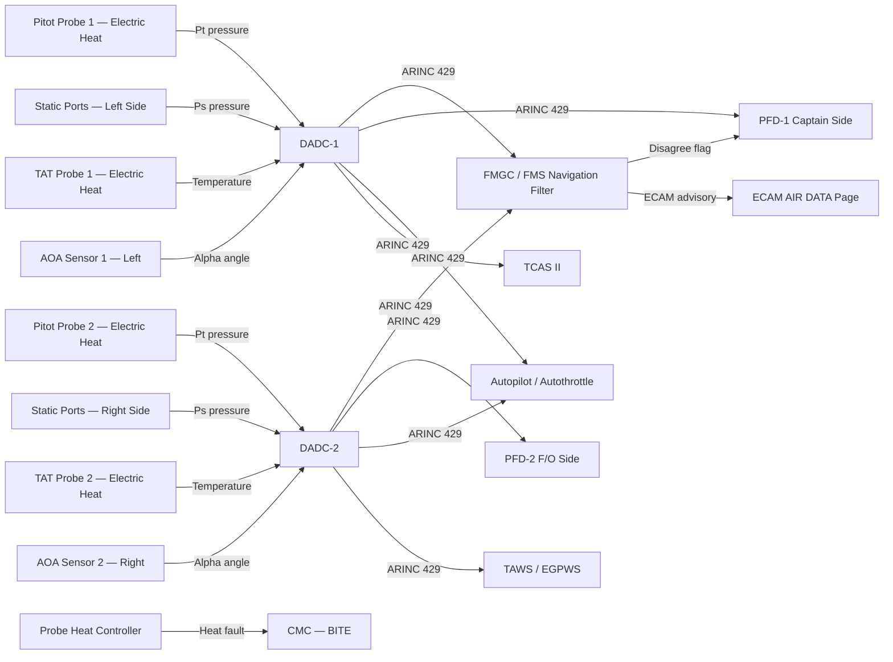
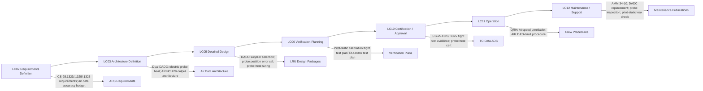

# 034-010 — Flight Environment Data and Air Data Interfaces
### [PROGRAMME-AIRCRAFT] [PROGRAMME-VARIANT] · ATA 34 · Q+ATLANTIDE ATLAS Scaffold

---

## §0 Hyperlink Policy

All internal links in this document use relative paths from the current directory. External regulatory and standards references use anchor links defined in [§20 References](#20-references). Links marked **TBD** indicate targets not yet allocated within the CSDB or ATLAS hierarchy. Programme-level links traverse five directory levels (`../../../../../`) to reach the repository root. No absolute URLs are used for internal navigation.

---

## §1 Purpose

This document defines the agnostic ATLAS standard-level architecture context for `034-010 — Flight Environment Data and Air Data Interfaces`.

It describes the controlled scope, functions, interfaces, safety considerations, lifecycle traceability, and S1000D/CSDB mapping logic that programme implementations shall instantiate when this node is applicable.

This document is not a programme design baseline. Programme-specific capacities, locations, part numbers, effectivity, operating limits, maintenance references, and data module codes shall be defined only inside the applicable programme implementation branch.
## §2 Applicability

| Applicability Level | Rule |
|---|---|
| Standard taxonomy | Applies to the ATLAS node `<NODE>` |
| Programme implementation | Conditional; determined by programme architecture, trade studies, certification basis, and applicability model |
| Product configuration | Defined in the programme-specific configuration baseline |
| Effectivity | Defined in the programme CSDB / applicability layer |
| Non-applicability | Must be explicitly stated in the programme impact-study branch when excluded |
## §3 System / Function Overview

The Air Data subsystem provides the [PROGRAMME-AIRCRAFT] [PROGRAMME-VARIANT] with accurate measurements of the surrounding flight environment — the quantities needed to determine the aircraft's airspeed state, altitude, and air temperature. These measurements are fundamental to flight safety, structural integrity, autopilot operation, and performance management.

Each DADC (DADC-1 and DADC-2) receives:
- **Pitot pressure (Pt)**: Measured by a forward-facing pitot probe. Stagnation pressure of the moving air mass.
- **Static pressure (Ps)**: Measured by flush static ports on the fuselage sides. Ambient atmospheric pressure.
- **Total Air Temperature (TAT)**: Measured by a probe mounted on the fuselage exposed to the airstream. Includes ram rise.
- **Angle of Attack (AOA)**: Measured by a vane sensor (alpha probe) on each side of the forward fuselage.

From these inputs, each DADC independently computes:
- **CAS** (Calibrated Airspeed): from differential pressure (Pt − Ps) corrected for position error
- **EAS** (Equivalent Airspeed): CAS corrected for compressibility
- **TAS** (True Airspeed): EAS corrected for air density (function of pressure altitude and SAT)
- **Mach number**: ratio of TAS to local speed of sound
- **Baro Altitude**: from Ps and barometric reference (QNH/QFE/STD selectable by crew)
- **Altitude Rate** (vertical speed proxy from d(Ps)/dt)
- **SAT** (Static Air Temperature): TAT corrected for ram rise as a function of Mach
- **OAT** (Outside Air Temperature): approximation for ground use (ram correction = 0)
- **AOA**: direct pass-through of AOA vane signal, filtered and validated

All parameters are output on ARINC 429 high-speed buses to FMGC, PFD, autopilot, TCAS, TAWS, weather radar, and FMS performance module.

---

## §4 Scope

### 4.1 Included
- DADC-1 and DADC-2 (LRUs in avionics bay)
- Pitot probe assemblies (×2 operational + TBD standby), electrically heated
- Static port assemblies (×4 minimum, fuselage flush ports, electrically heated TBD)
- TAT probe assemblies (×2), electrically heated
- AOA sensor/vane assemblies (×2), one per side, electrically heated TBD
- Probe and port heat monitoring and control (probe heat BITE)
- ARINC 429 output interfaces from DADC to all consumers
- Barometric altitude reference selector (QNH / QFE / STD) from crew baro set
- Cross-comparison logic (FMGC-hosted): DADC-1 vs. DADC-2 disagreement detection
- PFD red X and ECAM advisory generation for DADC and probe faults
- DADC BITE and CMC fault reporting
- Standby air data capability (TBD — dedicated standby ADI or DADC-3 TBD)

### 4.2 Excluded
- Flight Management System performance computation using air data — ATA 22
- Autopilot autothrottle commands using TAS/Mach — ATA 22
- Ice and rain protection (probe heat power supply) — ATA 30
- Electrical power distribution (essential bus) — ATA 24
- Standby attitude indicator (ISIS) — ATA 31
- Engine inlet air data (if separate) — ATA 71–80

---

## §5 Architecture Description

- **Dual DADC architecture**: DADC-1 serves the Captain's side (PFD-1, ADC-1 inputs). DADC-2 serves the First Officer's side (PFD-2, ADC-2 inputs). Each is fully independent — separate probe sets, separate power supply connections, separate ARINC 429 output buses.
- **Electrically heated probes**: All pitot, static, AOA, and TAT probes use embedded electrical resistance heaters powered from the electrical essential bus. No engine bleed air is used for probe heating. Heating is automatic when the aircraft is powered and weight-off-wheels condition is detected (or manually selectable by crew).
- **ARINC 429 output**: Each DADC outputs a full set of air data parameters on multiple ARINC 429 high-speed (100 kbps) buses. Bus recipients include: FMGC (1 and 2), autopilot, PFD-1, PFD-2, TCAS, TAWS, FMS performance module, and CMC.
- **Baro reference**: Crew selects barometric reference (QNH in hPa or inHg; QFE; STD = 1013.25 hPa) via dedicated baro knob on the PFD bezel or via MCDU. The selection is sent from the PFD/MCDU to the DADC over ARINC 429 or discrete input (TBD interface definition).
- **Cross-comparison**: The FMGC continuously compares DADC-1 and DADC-2 outputs. Thresholds for disagreement: CAS delta > TBD kt; altitude delta > TBD ft; Mach delta > TBD; SAT delta > TBD °C. On disagreement, the affected side PFD shows a red X on the conflicting parameter and an ECAM amber AIR DATA advisory is generated.
- **Probe heat monitoring**: Probe heat current is monitored by the probe heat controller. Loss of heat current (open circuit heater) generates a PROBE HEAT FAULT advisory on ECAM. At low temperatures, a PROBE HEAT OFF (probe heat not selected) advisory is generated per CS-25.1326.
- **Standby air data (TBD)**: A dedicated standby air data indicator (ISIS or equivalent) is planned to provide crew with independent airspeed, altitude, and attitude in the event of loss of both DADCs. LRU identity and interface TBD.

---

## §6 Functional Breakdown

| Function ID | Function Title | Description | LRU |
|---|---|---|---|
| F-010-001 | Pitot Pressure Measurement | Forward-facing probe measures stagnation pressure (Pt) | Pitot Probe 1/2 |
| F-010-002 | Static Pressure Measurement | Flush fuselage ports measure ambient pressure (Ps) | Static Port Assembly |
| F-010-003 | TAT Measurement | Fuselage-mounted probe measures total air temperature | TAT Probe 1/2 |
| F-010-004 | AOA Measurement | Vane sensor measures angle of attack | AOA Sensor 1/2 |
| F-010-005 | Air Data Computation — CAS/EAS | Compute CAS and EAS from (Pt − Ps) with position error correction | DADC-1 / DADC-2 |
| F-010-006 | Air Data Computation — TAS | Compute TAS from EAS, altitude, and SAT | DADC-1 / DADC-2 |
| F-010-007 | Air Data Computation — Mach | Compute Mach from pitot-static differential | DADC-1 / DADC-2 |
| F-010-008 | Barometric Altitude Computation | Compute pressure altitude from Ps; apply QNH/QFE/STD reference | DADC-1 / DADC-2 |
| F-010-009 | Temperature Computation — SAT/OAT | Compute SAT from TAT corrected for Mach ram rise | DADC-1 / DADC-2 |
| F-010-010 | Probe Heat Control and Monitoring | Control and monitor probe heater current; fault detection | Probe Heat Controller |
| F-010-011 | Cross-Comparison and Fault Annunciation | FMGC compares DADC-1 vs. DADC-2; flags disagree; PFD/ECAM annunciation | FMGC |
| F-010-012 | ARINC 429 Output | Transmit all air data parameters to consumers on ARINC 429 buses | DADC-1 / DADC-2 |

---

## §7 System Context Diagram



---

## §8 Internal Functional Architecture

```mermaid
flowchart TB
    PITOTPRESS[Pt — Pitot Pressure Input] -->|Pneumatic line| ADC_XDCR[Pressure Transducer — Pt]
    STATICPRESS[Ps — Static Pressure Input] -->|Pneumatic line| ADC_SXDCR[Pressure Transducer — Ps]
    ADC_XDCR --> DIFFPRESS[Differential Pressure Qc = Pt - Ps]
    ADC_SXDCR --> ALTCOMP[Barometric Altitude Computation]
    DIFFPRESS -->|CAS formula| CASCALC[CAS / EAS Calculation]
    DIFFPRESS -->|Mach formula| MACCALC[Mach Number Calculation]
    TEMPINPUT[TAT Probe Input] -->|Temperature signal| SATCOMP[SAT / OAT Computation]
    SATCOMP --> TASCOMP[TAS = EAS * sqrt(rho0/rho)]
    CASCALC --> ARINC429TX[ARINC 429 Transmitter — Air Data Labels]
    MACCALC --> ARINC429TX
    ALTCOMP --> ARINC429TX
    TASCOMP --> ARINC429TX
    SATCOMP --> ARINC429TX
    AOA_INPUT[AOA Vane Signal] -->|Filtered angle| ARINC429TX
    BITE[DADC Internal BITE] -->|Fault word| ARINC429TX
    BAROSET[Baro Reference Input — QNH/STD/QFE] --> ALTCOMP
```

---

## §9 Lifecycle Traceability



---

## §10 Interfaces

| Interface ID | System / Chapter | Interface Type | Data / Signal | Direction | Status |
|---|---|---|---|---|---|
| IF-010-001 | ATA 22 FMGC | ARINC 429 | CAS, EAS, TAS, Mach, baro altitude, altitude rate, SAT, OAT, AOA, data validity | DADC → FMGC |  |
| IF-010-002 | ATA 31 PFD-1 | ARINC 429 | Full air data set for PFD display (airspeed tape, altitude tape, Mach) — DADC-1 | DADC1 → PFD1 |  |
| IF-010-003 | ATA 31 PFD-2 | ARINC 429 | Full air data set for PFD display — DADC-2 | DADC2 → PFD2 |  |
| IF-010-004 | ATA 22 Autopilot / Autothrottle | ARINC 429 | CAS, Mach, altitude, altitude rate for AP/AT control laws | DADC → AP |  |
| IF-010-005 | ATA 34 TCAS | ARINC 429 | Baro altitude, altitude rate — used by TCAS for threat assessment | DADC → TCAS |  |
| IF-010-006 | ATA 34 TAWS | ARINC 429 | Baro altitude, CAS, Mach — used by TAWS for terrain alert algorithms | DADC → TAWS |  |
| IF-010-007 | ATA 30 Ice Protection | Discrete / ARINC 429 | Probe heat control commands and heat fault status | ATA30 ↔ ATA34 |  |
| IF-010-008 | ATA 24 Electrical Power | 28 VDC essential bus | Power for DADC-1, DADC-2, probe heaters | ATA24 → ATA34 |  |
| IF-010-009 | ATA 45 CMC | ARINC 429 / AFDX | DADC BITE fault words; probe heat fault; cross-comparison results | ATA34 → CMC |  |
| IF-010-010 | ATA 31 ECAM | AFDX | AIR DATA caution advisory; PROBE HEAT advisory | ATA34 → ECAM |  |

---

## §11 Operating Modes

| Mode ID | Mode Name | Description | Entry Condition | Exit Condition |
|---|---|---|---|---|
| OM-010-001 | Normal Dual DADC | Both DADCs operative; all probes heated; outputs valid; cross-comparison nominal | Aircraft powered; probe heat selected | DADC or probe fault |
| OM-010-002 | Single DADC Operation | DADC-1 or DADC-2 failed; remaining DADC provides all air data; crew informed by ECAM | DADC fault confirmed | Both DADCs operative |
| OM-010-003 | Airspeed Unreliable | Cross-comparison disagree; no valid source identified; crew uses unreliable airspeed procedure | CAS disagree above threshold; both sides flagged | Source resolved or standby ADI used |
| OM-010-004 | Probe Heat — OFF (Ground) | Probe heat selected OFF; normal on ground to prevent overheating TBD | WoW = ground + probe heat not selected | Probe heat selected ON or airborne |
| OM-010-005 | Probe Heat — FAULT | One or more probe heaters show open-circuit or over-temperature; ECAM PROBE HEAT advisory | Probe heat current monitor detects fault | Probe replaced or fault cleared |
| OM-010-006 | Ground Test Mode | All DADC functions testable from CMC; static test of pneumatic system | Ground power + CMC test mode | Test complete |

---

## §12 Monitoring and Diagnostics

- **DADC BITE**: Each DADC performs continuous internal self-monitoring including transducer validity, computation integrity, ARINC 429 output bus status, and probe heat heater current monitoring. DADC BITE fault words are transmitted on the ARINC 429 maintenance label and logged by CMC.
- **Cross-comparison (FMGC-hosted)**: FMGC compares DADC-1 and DADC-2 outputs every TBD ms. Parameters compared: CAS, altitude, Mach, SAT, AOA. Threshold values (TBD): CAS ±TBD kt; altitude ±TBD ft; Mach ±TBD; SAT ±TBD °C. On comparison failure, the affected PFD parameter shows a red X and ECAM generates an AIR DATA amber advisory.
- **Probe heat monitoring**: The probe heat controller (ATA 30 interface) monitors heater current for each probe. An open-circuit (failed heater) generates a PROBE HEAT FAULT advisory. On ground with probe heat not selected (manual or auto), a PROBE HEAT OFF flag is generated per CS-25.1326 if icing conditions are detected (TAT below TBD °C).
- **Altitude alert monitoring**: DADC-derived baro altitude is used by the altimeter alert function (altitude deviation from selected altitude). Alert threshold: TBD ft.

---

## §13 Maintenance Concept

- **DADC replacement**: Line maintenance task. DADC is installed in the avionics bay (EE bay) in a standard 3/4 ATR rack. Replacement requires ARINC 429 connector disconnection, pneumatic line disconnection (pitot/static lines to DADC), and LRU extraction. Post-replacement: pitot-static leak test; cross-comparison functional check via CMC.
- **Probe replacement**: Pitot probe, static port plate, TAT probe, and AOA vane replacement are line maintenance tasks. Each probe/sensor is connected by pneumatic plumbing (pitot/static) or wiring (TAT, AOA, heat). Pitot probe replacement requires pitot-static system leak test after reassembly. AOA sensor replacement requires rigging/calibration check per AMM.
- **Pitot-static system leak test**: Performed after any pitot-static plumbing disturbance. Uses ground-based pitot-static tester connected to probe/port test adapters. Test procedure: pressurize to TBD altitude equivalent; check for leakage below threshold per AMM 34-10.
- **Calibration**: DADCs are factory-calibrated; no in-service recalibration of DADC computation required. Position error correction (PEC) for pitot/static ports is embedded in DADC software as a fixed coefficient set from flight calibration. Flight recalibration is required only if probe locations change.

---

## §14 S1000D / CSDB Mapping

### 14.1 SNS to DMC Mapping

| SNS Code | Subsubject Title | DMC Prefix | Info Codes Planned | DMRL Status |
|---|---|---|---|---|
| 034-10 | Flight Environment Data and Air Data Interfaces | DMC-<PROGRAMME>-<VARIANT>-034-10 | 040, 300, 400, 520, 720 |  |

### 14.2 Recommended DM Set for 034-10

| Info Code | DM Title | Description |
|---|---|---|
| 040 | Air Data System Description | System description: DADC, probes, ARINC 429 outputs |
| 300 | Air Data Normal / Abnormal Procedures | Unreliable airspeed procedure; probe heat abnormal |
| 400 | Air Data Inspection and Test | Pitot-static leak test; probe heat test; cross-comparison check |
| 520 | Air Data Fault Isolation | DADC fault; airspeed disagree; probe heat fault isolation |
| 720 | DADC / Probe Removal and Installation | DADC R&I; pitot probe R&I; TAT probe R&I; AOA sensor R&I |

---

## §15 Footprints

### 15.1 Physical Footprint
- DADC-1 and DADC-2: avionics bay — standard 3/4 ATR LRU; envelope TBD; weight TBD kg each
- Pitot probes (×2+): forward upper fuselage — probe positions TBD (composite fuselage attachment TBD)
- Static ports (×4): fuselage sides — flush mount positions TBD; RF interaction with composite skin TBD
- TAT probes (×2): forward fuselage — positions TBD
- AOA sensors (×2): forward fuselage sides — vane assembly mounting TBD

### 15.2 Electrical / Data Footprint
- DADC power: 28 VDC essential bus; power per DADC TBD W
- Probe heat power: electric resistance heaters; total probe heat load TBD W (from ATA 30 / ATA 24)
- ARINC 429 output buses per DADC: TBD buses (each 100 kbps, max 20 labels per bus)

### 15.3 Maintenance Footprint
- DADC R&I interval: on condition (BITE-driven); no scheduled replacement
- Pitot probe inspection: per AMM visual inspection interval TBD
- Pitot-static system leak test: after any plumbing disturbance; leak rate threshold TBD

### 15.4 Data Footprint
- DADC BITE fault log: TBD entries per DADC, logged in CMC
- Cross-comparison exceedance log: time, parameter, delta — retained per CMC
- Probe heat fault log: logged in CMC

---

## §16 Safety and Certification Considerations

| Requirement | Source | Description | Compliance Approach | Status |
|---|---|---|---|---|
| CS-25.1301 | EASA CS-25 | Equipment function and installation | DADC and probe qualification; DO-160G |  |
| CS-25.1309 | EASA CS-25 | Failure condition analysis | DADC dual redundancy; FHA/FMEA; DAL per DO-178C |  |
| CS-25.1323 | EASA CS-25 | Airspeed indicating system — calibration and accuracy | Pitot-static flight calibration (trailing cone or GPS method); PEC in DADC software |  |
| CS-25.1325 | EASA CS-25 | Static pressure systems — position error and leakage | Static port position error correction; system leak test |  |
| CS-25.1326 | EASA CS-25 | Pitot heat indication — crew warning of pitot heat off | PROBE HEAT advisory on ECAM; automatic activation logic |  |
| AMC 25.1323 | EASA AMC | Acceptable means of compliance for airspeed indicating | Calibration flight test methods; position error correction table |  |
| DO-160G | RTCA | Environmental qualification | DADC and probe environmental testing |  |
| DO-178C | RTCA | Software DAL qualification | DADC computation software DAL — TBD (likely DAL B/C) |  |

---

## §17 Verification and Validation

| V&V ID | Requirement | Method | Success Criterion | Status |
|---|---|---|---|---|
| VV-010-001 | CS-25.1323 — Airspeed accuracy | Pitot-static flight calibration (trailing cone or GPS speed) | CAS position error < ±TBD kt across Vmin to Vmo |  |
| VV-010-002 | CS-25.1325 — Static pressure leak | Ground pitot-static leak test | Leak rate < TBD per minute at TBD altitude equivalent pressure |  |
| VV-010-003 | CS-25.1326 — Probe heat indication | Lab test: disable probe heat; verify ECAM advisory | PROBE HEAT advisory generated within TBD seconds of heat loss |  |
| VV-010-004 | Cross-comparison logic | Lab bench: inject DADC-1 / DADC-2 disagreement above threshold | PFD red X and ECAM AIR DATA advisory generated correctly |  |
| VV-010-005 | IRS alignment accuracy test | GPS-aided DADC alignment check | DADC altitude agrees with GPS pressure altitude within TBD ft |  |
| VV-010-006 | AOA sensor accuracy | Ground calibration and tunnel test TBD | AOA output error < TBD degrees across alpha range |  |
| VV-010-007 | DO-160G — Environmental qualification | Full DO-160G test suite for DADC | Pass all applicable DO-160G categories |  |

---

## §18 Glossary

| Term | Definition |
|---|---|
| AOA | Angle of Attack — the angle between the aircraft's chord line and the incoming airflow; measured by vane sensors on the forward fuselage |
| ARINC 429 | Aeronautical Radio Inc. 429 — one-way, point-to-point aircraft data bus; 100 kbps high-speed used for air data output |
| Baro Altitude | Barometric altitude — pressure altitude corrected for a local barometric reference (QNH / QFE / STD 1013.25 hPa) |
| CAS | Calibrated Airspeed — indicated airspeed corrected for instrument and position error; primary airspeed reference for flight |
| DADC | Digital Air Data Computer — LRU computing air data parameters from pitot/static pressure and temperature inputs |
| EAS | Equivalent Airspeed — CAS corrected for compressibility; equal to CAS at sea level standard conditions |
| Mach | Mach number — ratio of TAS to local speed of sound; critical for high-speed flight regime |
| OAT | Outside Air Temperature — static air temperature at rest (zero ram rise); approximately equals SAT on ground |
| PEC | Position Error Correction — correction applied to raw pitot-static measurements to account for local flow disturbance at probe/port location |
| Ps | Static Pressure — ambient atmospheric pressure measured by flush fuselage static ports |
| Pt | Total (Pitot) Pressure — stagnation pressure measured by forward-facing pitot probe |
| Qc | Impact Pressure — differential pressure (Pt − Ps); used to compute CAS and Mach |
| SAT | Static Air Temperature — true ambient air temperature corrected for ram rise; computed from TAT and Mach |
| TAT | Total Air Temperature — stagnation temperature measured by the TAT probe; includes kinetic heating (ram rise) |
| TAS | True Airspeed — aircraft speed relative to the airmass corrected for air density; used by FMS and navigation filter |

---

## §19 Citations

| Citation ID | Source | Title | Relevance |
|---|---|---|---|
| CIT-010-001 | EASA | CS-25 Amendment 27 — §25.1323, §25.1325, §25.1326 | Primary certification basis for air data |
| CIT-010-002 | EASA | AMC 25.1323 — Airspeed Indicating System | Calibration and position error compliance guidance |
| CIT-010-003 | RTCA | DO-160G — Environmental Conditions and Test Procedures | DADC and probe environmental qualification |
| CIT-010-004 | RTCA | DO-178C — Software Considerations | DADC computation software qualification |
| CIT-010-005 | ARINC | ARINC 429 Part 1 — Mark 33 Digital Information Transfer System | Air data output bus standard |
| CIT-010-006 | ASD-STAN | S1000D Issue 5.0 | Technical publication CSDB mapping |

---

## §20 References

| Ref ID | Document | Title | Link |
|---|---|---|---|
| REF-010-001 | CS-25.1323 | Airspeed Indicating System | [EASA CS-25](#) |
| REF-010-002 | CS-25.1325 | Static Pressure Systems | [EASA CS-25](#) |
| REF-010-003 | CS-25.1326 | Pitot Heat Indication System | [EASA CS-25](#) |
| REF-010-004 | CS-25.1309 | Equipment Systems and Installations | [EASA CS-25](#) |
| REF-010-005 | AMC 25.1323 | Acceptable Means of Compliance — Airspeed | [EASA AMC](#) |
| REF-010-006 | DO-160G | Environmental Conditions and Test Procedures | [RTCA](https://www.rtca.org/) |
| REF-010-007 | DO-178C | Software Considerations in Airborne Systems | [RTCA](https://www.rtca.org/) |
| REF-010-008 | ARINC 429 | Mark 33 Digital Information Transfer System | [ARINC](https://www.aviation-ia.com/) |
| REF-010-009 | S1000D Issue 5.0 | International Specification for Technical Publications | [s1000d.org](https://s1000d.org/) |

---

## §21 Open Issues

| Issue ID | Description | Owner | Priority | Status |
|---|---|---|---|---|
| OI-010-001 | Composite fuselage static port installation — assess impact of CFRP skin on static pressure measurement and position error; standard aluminium interface plate or full composite static port TBD | Q-MECHANICS / Q-AIR | High |  |
| OI-010-002 | Standby air data indicator (ISIS or equivalent) — confirm standby air data LRU identity, supplier, and interface for [PROGRAMME-VARIANT]; DADC-3 or dedicated ISIS TBD | Q-AIR / ORB-PMO | High |  |
| OI-010-003 | Pitot probe standby (third probe) — confirm whether a third (standby) pitot probe is required on [PROGRAMME-VARIANT] baseline or optional | Q-AIR / ORB-LEG | Medium |  |
| OI-010-004 | AOA sensor heating — confirm whether AOA vane heaters are electric resistance or require alternate approach; icing certification of AOA vanes required | Q-MECHANICS / Q-AIR | High |  |
| OI-010-005 | Probe heat power budget — complete electrical load analysis for all probe heaters; interface with ATA 24 and ATA 30 for essential bus sizing | Q-MECHANICS / ATA 24 team | High |  |
| OI-010-006 | Baro reference interface (QNH input to DADC) — define interface: dedicated ARINC 429 label from PFD bezel encoder or discrete signal TBD | Q-AIR | Medium |  |
| OI-010-007 | MEMS vs. FOG IRS decision | Q-AIR / ORB-PMO | High |  |
| OI-010-008 | Composite fuselage RF transparency for navigation antennas | Q-MECHANICS / Q-AIR | High |  |

---

## §22 Change Log

| Revision | Date | Author | Description |
|---|---|---|---|
| 0.1.0 | 2026-05-10 | Q+ATLANTIDE / Q-AIR | Initial full-template creation — all §0–§22 sections drafted; TBD items and open issues identified |
