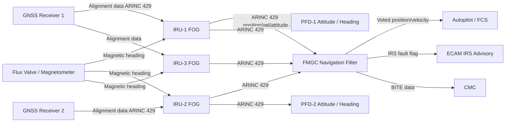
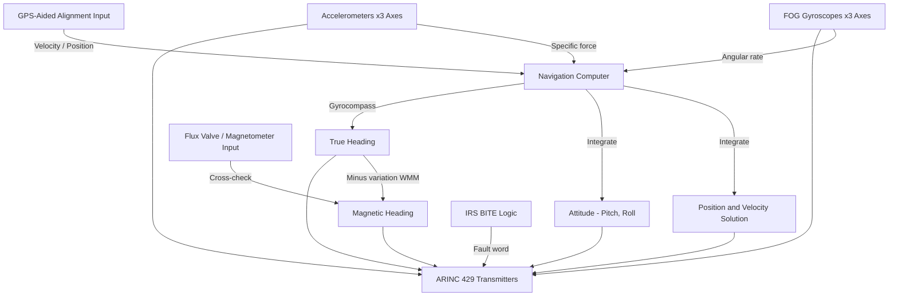
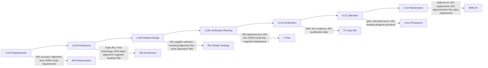

# 034-020 — Inertial Reference and Attitude Heading Systems
### AMPEL360e eWTW · ATA 34 · Q+ATLANTIDE ATLAS Scaffold

---

## §0 Hyperlink Policy

All internal links use relative paths from the current directory. External regulatory and standards references use anchor links in [§20 References](#20-references). Links marked **TBD** indicate unallocated targets. Programme-level links traverse five levels (`../../../../../`). No absolute URLs used for internal navigation.

---

## §1 Purpose

This document describes the Inertial Reference and Attitude Heading subsystem (ATA 034-020) of the AMPEL360e eWTW aircraft. It covers the triple Inertial Reference Unit (IRU) configuration, Fiber Optic Gyro (FOG) sensor technology, GPS-aided alignment, the Attitude and Heading Reference System (AHRS) function, magnetic heading sensing challenges specific to the all-composite CFRP fuselage, and the ARINC 429 data output architecture.

The AMPEL360e eWTW uses three IRUs (IRU-1, IRU-2, IRU-3) for fault tolerance and voting logic in the FMGC navigation filter. All three IRUs use FOG technology (ring laser or MEMS TBD). GPS-aided rapid alignment reduces in-gate alignment time to below 5 minutes (TBD). The AHRS function provides attitude and heading references; magnetic heading is provided via a flux valve or magnetometer whose placement in the composite fuselage is a significant open issue due to CFRP magnetic interference characteristics.

Key applicable standard: EASA AMC 20-4 (Airworthiness Approval of Inertial Navigation and Reference Systems).

---

## §2 Applicability

| Attribute | Value |
|---|---|
| Programme | AMPEL360e Wide Tube-and-Wing (eWTW) |
| ATA Subsubject | 034-020 — Inertial Reference and Attitude Heading Systems |
| Aircraft Variant | eWTW-100 (baseline), eWTW-100ER |
| Number of IRUs | 3 (triple redundant — IRU-1, IRU-2, IRU-3) |
| IRU Technology | Fiber Optic Gyro (FOG) — ring laser or MEMS TBD |
| GPS-Aided Alignment | Yes — target < 5 min (TBD) |
| AHRS Mode | Degraded IRS mode (attitude + heading without full IRS navigation) |
| Magnetic Heading | Flux valve (primary) or magnetometer TBD — composite fuselage interference TBD |
| Output Bus | ARINC 429 (high speed — 100 kbps) |
| S1000D Issue | 5.0 |
| SNS Reference | 034-20 |
| Applicability Code | ALL |
| Effectivity | From MSN 001 |

---

## §3 System / Function Overview

The Inertial Reference subsystem provides the AMPEL360e eWTW with autonomous, self-contained navigation data independent of external radio signals. Three IRUs (IRU-1, IRU-2, IRU-3) are mounted in the avionics bay in precision-aligned orientations relative to the aircraft reference axes.

Each IRU contains:
- **Three-axis FOG gyroscopes**: measure angular rates about aircraft roll, pitch, and yaw axes
- **Three-axis accelerometers**: measure specific force (linear acceleration minus gravity) along aircraft x, y, z axes
- **Navigation computer**: integrates gyro and accelerometer data to compute position, velocity, and attitude

Outputs from each IRU (on ARINC 429):
- **Position**: latitude and longitude (degrees, minutes, seconds)
- **Velocity**: north velocity, east velocity, down velocity (knots or m/s)
- **Attitude**: pitch angle, roll angle (degrees)
- **True Heading**: true north heading derived from gyrocompassing or GPS-aided alignment
- **Magnetic Heading**: computed from true heading plus magnetic variation model (or from flux valve/magnetometer direct measurement)
- **Angular Rates**: roll rate, pitch rate, yaw rate (degrees/second)
- **Linear Accelerations**: longitudinal, lateral, normal acceleration (g or m/s²)
- **IRS Status / BITE word**: alignment status, fault codes

The FMGC navigation filter receives all three IRU outputs and performs triple-redundancy voting. A single IRU failure (position or attitude divergence) is detected and the failed IRU is flagged; the filter uses the two remaining IRUs as primary inputs. A second failure degrades the navigation mode.

The AHRS mode is a reduced-capability mode where the IRU provides attitude and heading only (no position/velocity computation), operating without a valid GPS-aided alignment or when the IRS navigation solution has degraded.

---

## §4 Scope

### 4.1 Included
- IRU-1, IRU-2, IRU-3 (LRUs — FOG-based, avionics bay)
- FOG gyroscope and accelerometer sensor technology (ring laser vs MEMS TBD)
- GPS-aided rapid alignment (alignment data from GNSS receiver via ARINC 429)
- Initial alignment logic (stationary ground alignment; in-flight alignment TBD)
- Position, velocity, attitude, heading, angular rate, and linear acceleration output (ARINC 429)
- AHRS degraded mode (attitude and heading reference without full navigation)
- Magnetic heading sensing: flux valve (primary candidate) or magnetometer (TBD for composite fuselage)
- Magnetic variation model (WMM — World Magnetic Model) hosted in IRU or FMGC TBD
- IRS drift monitoring (FMGC) and fault isolation logic
- IRS BITE and CMC fault reporting
- IRU mounting and alignment fixture interfaces (avionics bay — axis alignment critical)

### 4.2 Excluded
- GNSS receiver hardware — covered by 034-040
- FMGC navigation filter software — covered by 034-070
- FMS flight planning using IRS position — covered by ATA 22
- Autopilot using IRU attitude and rates — covered by ATA 22
- Air data (DADC) — covered by 034-010

---

## §5 Architecture Description

- **Triple IRU configuration**: Three independent IRUs provide triple-redundant inertial navigation. Triple redundancy enables detection and isolation of a single failed IRU (by voting against the other two) with no loss of navigation capability. The second IRU failure degrades to a dual-comparison (unable to identify the failed unit) — crew and ECAM notification.
- **FOG technology**: Fiber Optic Gyros use the Sagnac effect in coiled optical fibre to measure rotation rate. FOG provides high accuracy, long service life (no moving parts), and resistance to vibration and shock compared to electromechanical gyros. Ring Laser Gyro (RLG) and MEMS alternatives are under evaluation (TBD).
- **GPS-aided rapid alignment**: On power-up, the IRU performs a coarse self-alignment using gravity levelling. Fine heading alignment (gyrocompassing) typically requires ~10 minutes for conventional IRS. GPS-aided alignment uses the GNSS receiver position and velocity to reduce alignment to <5 minutes (TBD target), avoiding extended gate delays.
- **In-flight alignment (TBD)**: If the aircraft must be powered off and restarted in flight (air restart), an in-flight alignment mode using GNSS velocity is planned (TBD — specification and test method TBD).
- **AHRS mode**: When the IRS navigation solution is invalid (alignment not complete, or navigation computer failure) but gyro and accelerometer data are valid, the IRU outputs attitude and heading only (AHRS mode). This mode is sufficient to support continued flight with degraded navigation capability.
- **Magnetic heading**: True heading is computed by gyrocompassing or GPS-aided alignment. Magnetic heading is derived by subtracting magnetic variation (WMM model) from true heading. A physical flux valve or magnetometer provides an independent cross-check of magnetic heading. Placement of the magnetic sensor in the composite CFRP fuselage requires careful evaluation to avoid interference from carbon fibre and electric currents (open issue).
- **ARINC 429 outputs**: Each IRU transmits full navigation data on ARINC 429 high-speed (100 kbps) buses. Each IRU outputs on multiple buses to supply FMGC, PFD-1, PFD-2, autopilot, weather radar, TCAS, and CMC independently.
- **Avionics bay alignment**: IRU mounting in the avionics bay must align the sensor axes to the aircraft reference axes within a specified angular tolerance (TBD). Misalignment introduces navigation errors. Aircraft-level IRS alignment verification is required after initial installation (compass swing equivalent for IRS).

---

## §6 Functional Breakdown

| Function ID | Function Title | Description | LRU |
|---|---|---|---|
| F-020-001 | Angular Rate Measurement | FOG gyros measure roll, pitch, yaw rates about aircraft axes | IRU-1/2/3 |
| F-020-002 | Specific Force Measurement | Accelerometers measure longitudinal, lateral, normal accelerations | IRU-1/2/3 |
| F-020-003 | Navigation Solution Computation | Integrate angular rates and accelerations to compute position and velocity | IRU-1/2/3 |
| F-020-004 | Attitude Computation | Compute pitch and roll angles from accelerometer and gyro data | IRU-1/2/3 |
| F-020-005 | True Heading Computation | Gyrocompassing or GPS-aided heading determination | IRU-1/2/3 |
| F-020-006 | Magnetic Heading Output | True heading minus magnetic variation; flux valve / magnetometer cross-check | IRU-1/2/3 + Flux Valve |
| F-020-007 | GPS-Aided Rapid Alignment | Use GNSS position/velocity to accelerate IRS alignment | IRU-1/2/3 + GNSS |
| F-020-008 | AHRS Degraded Mode | Attitude and heading reference without full navigation solution | IRU-1/2/3 |
| F-020-009 | IRS Drift Monitoring | FMGC compares three IRU positions over time; flags diverging IRU | FMGC |
| F-020-010 | ARINC 429 Output | Transmit all IRS parameters to FMGC, PFDs, autopilot, and CMC | IRU-1/2/3 |

---

## §7 System Context Diagram

---

## §8 Internal Functional Architecture

---

## §9 Lifecycle Traceability

---

## §10 Interfaces

| Interface ID | System / Chapter | Interface Type | Data / Signal | Direction | Status |
|---|---|---|---|---|---|
| IF-020-001 | ATA 34 GNSS (034-040) | ARINC 429 | GPS position and velocity for IRS alignment | GNSS → IRU |  |
| IF-020-002 | ATA 22 FMGC | ARINC 429 | Position, velocity, attitude, heading, angular rates, accelerations | IRU → FMGC |  |
| IF-020-003 | ATA 31 PFD-1 | ARINC 429 | Pitch, roll, true heading, magnetic heading — IRU-1 primary | IRU1 → PFD1 |  |
| IF-020-004 | ATA 31 PFD-2 | ARINC 429 | Pitch, roll, true heading, magnetic heading — IRU-2 primary | IRU2 → PFD2 |  |
| IF-020-005 | ATA 22 Autopilot | ARINC 429 | Pitch, roll, angular rates, accelerations for autopilot control law | IRU → AP |  |
| IF-020-006 | ATA 34 TAWS | ARINC 429 | Attitude, heading, vertical velocity for TAWS alerting | IRU → TAWS |  |
| IF-020-007 | ATA 34 Weather Radar | ARINC 429 | Attitude and heading for radar antenna stabilisation | IRU → WXR |  |
| IF-020-008 | ATA 24 Electrical Power | 28 VDC essential bus | Power for IRU-1, IRU-2, IRU-3 | ATA24 → IRU |  |
| IF-020-009 | ATA 45 CMC | ARINC 429 / AFDX | IRU BITE fault words; IRS drift flag; alignment status | IRU → CMC |  |
| IF-020-010 | ATA 31 ECAM | AFDX | IRS advisory — NAV; IRS advisory — ATT; heading disagree | FMGC → ECAM |  |

---

## §11 Operating Modes

| Mode ID | Mode Name | Description | Entry Condition | Exit Condition |
|---|---|---|---|---|
| OM-020-001 | IRS Alignment — Gyrocompass | Classic gyrocompassing; aircraft stationary; takes ~10 min | IRS ON; GPS unavailable or alignment mode = NORMAL | Alignment complete |
| OM-020-002 | IRS Alignment — GPS-Aided | GPS position and velocity used to speed up alignment; target < 5 min | IRS ON; GPS valid | Alignment complete (NAV annunciation) |
| OM-020-003 | IRS NAV Mode | Full navigation output: position, velocity, attitude, heading, rates | Alignment complete | IRS failure or crew OFF selection |
| OM-020-004 | AHRS Mode | Attitude and heading reference only (no position/velocity); degraded IRS | NAV computation failed or not converged; attitude and heading valid | NAV mode restored or IRS OFF |
| OM-020-005 | IRS Triple-Redundant Voting | FMGC voting across IRU-1/2/3; drift monitoring | NAV mode all three IRUs active | Single IRU failure detected |
| OM-020-006 | IRS Single Failure | One IRU flagged failed; two IRU navigation continues; ECAM IRS advisory | IRU divergence threshold exceeded in FMGC voting | Failed IRU replaced |
| OM-020-007 | IRS Dual Failure | Two IRUs failed or diverged; navigation highly degraded; ECAM IRS WARNING | Second IRU failure | IRU restoration or aircraft landing |
| OM-020-008 | Ground Maintenance / Alignment Test | IRS alignment test from CMC; IRS BITE test | Ground power + CMC maintenance mode | Test complete |

---

## §12 Monitoring and Diagnostics

- **IRU BITE**: Each IRU performs continuous internal self-monitoring: gyro bias stability, accelerometer health, navigation computation validity, ARINC 429 output bus status, and temperature. BITE fault words are transmitted on ARINC 429 and logged by CMC.
- **FMGC drift monitoring**: FMGC compares the three IRU position outputs. When the aircraft is in known-position operation (GPS available), IRS position drift is computed as (IRS position − GPS position). Drift exceeding a time-dependent threshold (e.g., >TBD NM per hour at >TBD hours since alignment) generates a CMC drift fault log entry and an ECAM IRS advisory.
- **Triple voting**: FMGC continuously evaluates the three IRU position and attitude outputs. A diverging IRU (position delta > TBD NM; attitude delta > TBD degrees vs. the other two) is flagged and isolated. The remaining two IRUs are used for navigation. The crew is informed via ECAM IRS advisory.
- **Magnetic heading disagree**: FMGC or PFD compares IRU-1 and IRU-2 magnetic heading. A disagreement > TBD degrees generates an ECAM HDG DISAGREE advisory.

---

## §13 Maintenance Concept

- **IRU replacement**: Line maintenance task. IRU is mounted in the avionics bay on a precision alignment fixture. Replacement requires ARINC 429 connector disconnection and LRU extraction. Critical: replacement IRU must be mounted in correct axis orientation. Post-replacement: IRS alignment test (GPS-aided, verify NAV mode achieved within target time); FMGC voting verification via CMC.
- **Flux valve / magnetometer replacement**: If magnetic heading sensor is accessible (location TBD), replacement is a line maintenance task. Post-replacement: magnetic heading cross-check against IRS computed heading and external compass reference.
- **IRU mounting alignment verification**: On first installation (or after any structural disturbance to the avionics bay mounting structure), an IRU axis alignment check is required using aircraft coordinate measurement system (TBD tool specification).
- **No scheduled overhaul**: FOG IRUs are designed as on-condition LRUs with MTBF > TBD hours. No scheduled disassembly or overhaul — fault-driven replacement only.

---

## §14 S1000D / CSDB Mapping

### 14.1 SNS to DMC Mapping

| SNS Code | Subsubject Title | DMC Prefix | Info Codes Planned | DMRL Status |
|---|---|---|---|---|
| 034-20 | Inertial Reference and Attitude Heading Systems | DMC-AMPEL360E-EWTW-034-20 | 040, 300, 400, 520, 720 |  |

### 14.2 Recommended DM Set for 034-20

| Info Code | DM Title | Description |
|---|---|---|
| 040 | IRS System Description | IRU architecture, FOG technology, GPS-aided alignment, AHRS mode |
| 300 | IRS Normal / Abnormal Procedures | IRS alignment procedure; IRS NAV FAULT; HDG DISAGREE |
| 400 | IRS Inspection and Test | IRS alignment test; axis alignment check; magnetic heading test |
| 520 | IRS Fault Isolation | IRU fault; IRS drift; heading disagree fault isolation |
| 720 | IRU Removal and Installation | IRU R&I; flux valve R&I |

---

## §15 Footprints

### 15.1 Physical Footprint
- IRU-1, IRU-2, IRU-3: avionics bay — precision alignment mounts; LRU envelope TBD; weight TBD kg each
- Flux valve / magnetometer: fuselage location TBD (composite CFRP interference assessment required)
- Mounting alignment accuracy requirement: TBD degrees per axis

### 15.2 Electrical / Data Footprint
- IRU power: 28 VDC essential bus; power per IRU TBD W; total ATA 34 IRS power TBD W
- ARINC 429 output buses per IRU: TBD buses (each 100 kbps)

### 15.3 Maintenance Footprint
- IRU R&I interval: on condition (BITE-driven)
- IRU alignment test duration: <5 min (GPS-aided target)
- Magnetic heading check interval: per AMM TBD

### 15.4 Data Footprint
- IRU BITE fault log: TBD entries per IRU, logged in CMC
- IRS drift trend log: GPS vs. IRS position delta — retained per CMC
- Alignment event log: time, alignment method, duration

---

## §16 Safety and Certification Considerations

| Requirement | Source | Description | Compliance Approach | Status |
|---|---|---|---|---|
| CS-25.1301 | EASA CS-25 | Equipment function and installation | IRU qualification; DO-160G; axis alignment |  |
| CS-25.1309 | EASA CS-25 | System safety — failure analysis | Triple IRU; FHA/FMEA; DAL per DO-178C |  |
| AMC 20-4 | EASA AMC | Airworthiness approval of IRS | IRU qualification per AMC 20-4; drift specification; alignment test |  |
| CS-ACNS | EASA | RNAV/RNP — IRS contribution to navigation accuracy | IRS position accuracy sufficient for RNP 1 without GPS TBD |  |
| DO-160G | RTCA | Environmental qualification | IRU environmental testing per DO-160G |  |
| DO-178C | RTCA | Software DAL | IRU navigation computer software DAL — TBD (likely DAL B) |  |
| DO-254 | RTCA | Hardware DAL | IRU complex hardware DAL — TBD |  |

---

## §17 Verification and Validation

| V&V ID | Requirement | Method | Success Criterion | Status |
|---|---|---|---|---|
| VV-020-001 | IRS alignment accuracy — AMC 20-4 | GPS-aided ground alignment; compare IRS vs. GPS position | IRS position error < TBD NM after alignment; heading error < TBD degrees |  |
| VV-020-002 | IRS drift rate — AMC 20-4 | Long-duration flight test; compare IRS position vs. GPS truth | IRS drift < TBD NM/hour after 10-hour flight TBD |  |
| VV-020-003 | GPS-aided rapid alignment — target < 5 min | Ground test with GPS available; measure time to NAV mode | IRS achieves NAV mode in < 5 minutes with GPS valid |  |
| VV-020-004 | Triple IRU voting and fault isolation | Lab bench: inject diverging data on one IRU; verify FMGC isolation | Failed IRU flagged; ECAM IRS advisory generated; navigation continues on two IRUs |  |
| VV-020-005 | AHRS mode — attitude accuracy | Flight test in AHRS mode (GPS and NAV inactive) | Pitch and roll error < TBD degrees during manoeuvres |  |
| VV-020-006 | Magnetic heading accuracy | Compass swing test; compare IRS magnetic heading vs. reference | Magnetic heading error < TBD degrees across all headings |  |
| VV-020-007 | DO-160G environmental qualification | Full DO-160G test suite for IRU | Pass all applicable DO-160G categories |  |

---

## §18 Glossary

| Term | Definition |
|---|---|
| AHRS | Attitude and Heading Reference System — a degraded IRS mode providing attitude (pitch/roll) and heading reference without full navigation (position/velocity) |
| ARAIM | Advanced RAIM — integrity monitoring using multiple GNSS constellations; future complement to IRS-only navigation integrity |
| FOG | Fiber Optic Gyro — rotation-rate sensor using the Sagnac effect in optical fibre; no moving parts; immune to vibration |
| Gyrocompassing | The process of determining true north heading from the earth's rotation rate using gyroscopes; requires aircraft to be stationary |
| IRS | Inertial Reference System — the complete system of IRUs and their associated alignment, monitoring, and output functions |
| IRU | Inertial Reference Unit — the LRU containing FOG gyroscopes, accelerometers, and navigation computer |
| Kalman Filter | Recursive estimation algorithm used in FMGC to fuse IRS, GNSS, and radio nav data into a best-estimate navigation solution |
| MEMS | Micro-Electro-Mechanical Systems — miniaturised gyroscope and accelerometer technology using silicon micro-machining; potential alternative to FOG |
| RLG | Ring Laser Gyro — a gyroscope using laser light in a closed ring path to measure rotation; alternative to FOG |
| Sagnac Effect | The phase shift of light beams in a closed optical path caused by rotation; the physical basis for FOG and RLG measurement |
| WMM | World Magnetic Model — a mathematical model of Earth's magnetic field published by NOAA and BGS; used in IRU to convert true heading to magnetic heading |

---

## §19 Citations

| Citation ID | Source | Title | Relevance |
|---|---|---|---|
| CIT-020-001 | EASA | AMC 20-4 — Airworthiness Approval of Inertial Navigation and Reference Systems | Primary IRS qualification guidance |
| CIT-020-002 | EASA | CS-25 Amendment 27 — §25.1301, §25.1309 | Certification basis |
| CIT-020-003 | RTCA | DO-178C — Software Considerations in Airborne Systems | Navigation computer software DAL |
| CIT-020-004 | RTCA | DO-254 — Design Assurance for Airborne Electronic Hardware | IRU complex hardware DAL |
| CIT-020-005 | RTCA | DO-160G — Environmental Conditions | IRU environmental qualification |
| CIT-020-006 | ARINC | ARINC 429 Part 1 | IRS data output bus |
| CIT-020-007 | ASD-STAN | S1000D Issue 5.0 | CSDB publication mapping |

---

## §20 References

| Ref ID | Document | Title | Link |
|---|---|---|---|
| REF-020-001 | AMC 20-4 | Airworthiness Approval of Inertial Navigation and Reference Systems | [EASA AMC](#) |
| REF-020-002 | CS-25.1301 | Equipment Function and Installation | [EASA CS-25](#) |
| REF-020-003 | CS-25.1309 | Equipment Systems and Installations | [EASA CS-25](#) |
| REF-020-004 | CS-ACNS | Communications, Navigation, and Surveillance | [EASA CS-ACNS](#) |
| REF-020-005 | DO-160G | Environmental Conditions and Test Procedures | [RTCA](https://www.rtca.org/) |
| REF-020-006 | DO-178C | Software Considerations | [RTCA](https://www.rtca.org/) |
| REF-020-007 | DO-254 | Design Assurance for Airborne Electronic Hardware | [RTCA](https://www.rtca.org/) |
| REF-020-008 | ARINC 429 | Mark 33 Digital Information Transfer System | [ARINC](https://www.aviation-ia.com/) |
| REF-020-009 | S1000D Issue 5.0 | International Specification for Technical Publications | [s1000d.org](https://s1000d.org/) |

---

## §21 Open Issues

| Issue ID | Description | Owner | Priority | Status |
|---|---|---|---|---|
| OI-020-001 | MEMS vs. FOG IRS technology decision — confirm whether ring laser FOG or MEMS-based technology is selected for eWTW IRU; impact on drift, cost, weight, DO-254 DAL level, and supplier availability | Q-AIR / ORB-PMO | High |  |
| OI-020-002 | Magnetic heading in composite fuselage — flux valve placement and CFRP interference assessment; GPS-derived heading as magnetic heading backup TBD | Q-MECHANICS / Q-AIR | High |  |
| OI-020-003 | GPS-aided alignment time target — confirm < 5 min target with selected IRU supplier; flight test data required | Q-AIR | High |  |
| OI-020-004 | In-flight alignment capability — define requirement and test method for in-flight IRS realignment after air restart | Q-AIR | Medium |  |
| OI-020-005 | IRU axis alignment accuracy — define angular alignment tolerance for avionics bay mounting; alignment fixture design TBD | Q-MECHANICS | Medium |  |
| OI-020-006 | ARAIM upgrade path — define when ARAIM replaces RAIM; dependency on dual-constellation receiver (L5 decision) | Q-AIR / Q-DATAGOV | Low |  |
| OI-020-007 | Composite fuselage RF transparency for navigation antennas | Q-MECHANICS / Q-AIR | High |  |

---

## §22 Change Log

| Revision | Date | Author | Description |
|---|---|---|---|
| 0.1.0 | 2026-05-10 | Q+ATLANTIDE / Q-AIR | Initial full-template creation — all §0–§22 sections drafted; TBD items and open issues identified |
