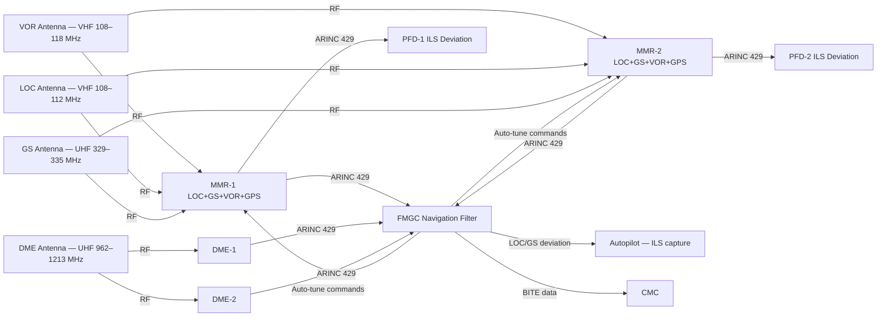
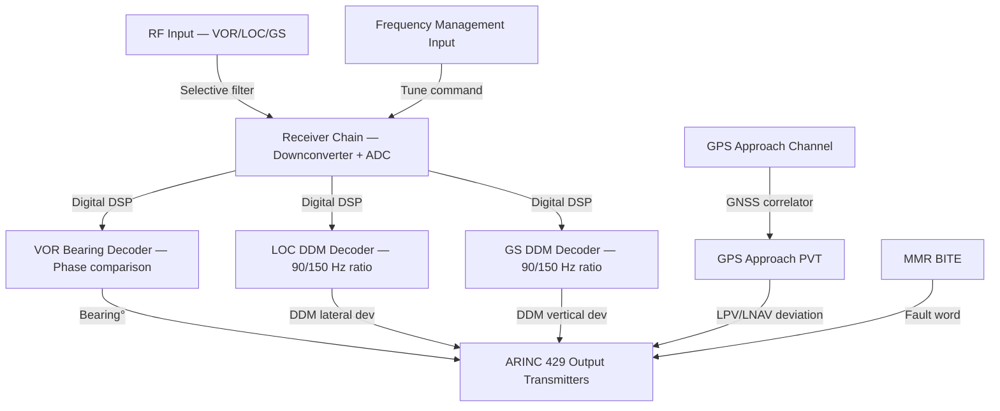
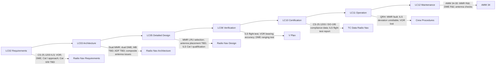

# 034-030 — Radio Navigation
### AMPEL360e eWTW · ATA 34 · Q+ATLANTIDE ATLAS Scaffold

---

## §0 Hyperlink Policy

All internal links use relative paths from the current directory. External regulatory and standards references use anchor links in [§20 References](#20-references). Links marked **TBD** indicate unallocated targets. Programme-level links traverse five levels (`../../../../../`). No absolute URLs used for internal navigation.

---

## §1 Purpose

This document describes the Radio Navigation subsystem (ATA 034-030) of the AMPEL360e eWTW aircraft. It covers the dual Multi-Mode Receivers (MMRs) integrating ILS, VOR, and GPS approach modes; the dual Distance Measuring Equipment (DME) receivers; the Marker Beacon receiver (TBD — possibly suppressed as legacy equipment); and the Automatic Direction Finder (ADF — TBD on eWTW).

The AMPEL360e eWTW uses dual MMR units (MMR-1 and MMR-2), each a single LRU integrating ILS Localizer, ILS Glideslope, VOR, and GPS approach receiving functions. This integration reduces weight and LRU count compared to separate ILS, VOR, and GPS approach receivers while maintaining dual-channel redundancy. DME receivers (dual) provide slant range to ground DME stations used by the FMS for DME-DME position updating. Frequency management and mode selection are performed from the MCDU/FMS.

Key applicable regulations: CS-25.1203 (Instrument Landing System), CS-25.1205 (VOR Indicator), DO-195 (ILS), EUROCAE ED-22B (VOR/ILS).

---

## §2 Applicability

| Attribute | Value |
|---|---|
| Programme | AMPEL360e Wide Tube-and-Wing (eWTW) |
| ATA Subsubject | 034-030 — Radio Navigation |
| Aircraft Variant | eWTW-100 (baseline), eWTW-100ER |
| MMR Units | 2 (dual — MMR-1 and MMR-2); each integrates ILS + VOR + GPS approach |
| DME Units | 2 (dual — DME-1 and DME-2) |
| Marker Beacon | TBD — legacy; may be suppressed on eWTW |
| ADF | TBD — may be suppressed on eWTW |
| ILS Category | Cat I (baseline); Cat II/III TBD |
| Output Bus | ARINC 429 (high speed) |
| Frequency Management | Via MCDU / FMS (automatic or manual tuning) |
| S1000D Issue | 5.0 |
| SNS Reference | 034-30 |
| Applicability Code | ALL |
| Effectivity | From MSN 001 |

---

## §3 System / Function Overview

The Radio Navigation subsystem provides the AMPEL360e eWTW with ground-based radio navigation capability for en-route navigation (VOR bearing, DME slant range) and precision approach (ILS localizer and glideslope). These radio navigation sources are fed to the FMGC navigation filter alongside IRS and GNSS data to provide a robust, multi-sensor navigation solution with continuity even during GNSS outages.

**VOR (VHF Omnidirectional Range)**: Provides magnetic bearing TO/FROM a VOR ground station. Each MMR receives VOR signals in the VHF band (108.0–117.95 MHz) and decodes the bearing using the 30 Hz AM/FM reference and variable phase comparison. VOR bearing is used by the FMS for VOR-DME position updates and for display on the Navigation Display (ND).

**DME (Distance Measuring Equipment)**: Each DME unit interrogates a ground DME transponder and measures the slant range based on round-trip signal time-of-flight. DME operates in the UHF band (962–1213 MHz). DME-DME position fixing (using bearings from two DME stations) is the primary radio navigation position update method in the FMS navigation filter during GNSS outages.

**ILS (Instrument Landing System)**: ILS provides precision lateral (Localizer) and vertical (Glideslope) guidance for precision approaches. Localizer operates in the VHF band (108.1–111.95 MHz, odd tenths); Glideslope operates in the UHF band (329.15–335.0 MHz, paired with LOC frequency). The MMR receives both and outputs DDM (Difference in Depth of Modulation) signals to the FMS and autopilot for approach guidance. Cat I ILS is baseline; Cat II/III are TBD based on autopilot certification level.

**GPS Approach mode in MMR**: The MMR includes an internal GNSS receiver channel for GPS approach operations (LNAV, LNAV/VNAV, LPV). This supplements the standalone GNSS receivers (034-040) with an approach-dedicated channel.

**Marker Beacon (TBD)**: The 75 MHz outer, middle, and inner marker beacons provide fixed-point crossing alerts during ILS approaches. This is a legacy system being phased out; fitment on eWTW is TBD.

**ADF (TBD)**: The Automatic Direction Finder provides relative bearing to NDB (Non-Directional Beacon) ground stations. ADF is legacy equipment being phased out of modern airspace; fitment on eWTW is TBD.

---

## §4 Scope

### 4.1 Included
- MMR-1 and MMR-2 (LRUs: ILS LOC + GS + VOR + GPS approach)
- DME-1 and DME-2 (LRUs: DME ranging)
- Marker Beacon receiver (TBD — legacy)
- ADF (TBD — legacy)
- VOR/LOC antenna (composite fuselage RF performance TBD)
- Glideslope antenna (composite fuselage RF performance TBD)
- DME antenna (composite fuselage RF performance TBD)
- ADF antenna (TBD — loop + sense; composite fuselage TBD)
- Marker Beacon antenna (TBD)
- MCDU / FMS frequency management and mode selection interface
- ARINC 429 output from MMR and DME to FMGC, PFD, ND, and autopilot
- MMR/DME BITE and CMC fault reporting

### 4.2 Excluded
- Standalone GNSS receivers (primary) — 034-040
- FMS trajectory guidance using radio navigation data — ATA 22
- Autopilot LOC/GS capture laws — ATA 22
- ATC transponder — 034-050
- Antenna installation and maintenance — partially 034-030 (functional) / ATA 53 (structure)

---

## §5 Architecture Description

- **Dual MMR (Multi-Mode Receiver)**: MMR-1 serves the Captain's side; MMR-2 serves the First Officer's side. Each MMR is a single LRU integrating: (1) VOR receiver; (2) ILS Localizer receiver; (3) ILS Glideslope receiver; (4) GPS approach receiver channel. Integration in a single LRU reduces rack space and weight. Both MMRs operate simultaneously; FMGC selects the primary source (normally matched to autopilot side) and uses the other as monitor/standby.
- **Dual DME**: DME-1 and DME-2 are independent LRUs. Each interrogates ground stations autonomously. The FMS selects the DME station pair that provides the best geometry for DME-DME position fix based on crossing angle criteria (optimum 90° crossing angle). Both DME units feed the FMGC navigation filter.
- **Automatic frequency management**: The FMS manages VOR, ILS, and DME frequency tuning automatically based on the active flight plan route, approach selected in the FMS, and geographic position. Manual override is available via MCDU. This automatic tuning reduces crew workload significantly compared to manual radio navigation procedures.
- **ILS Category I baseline**: The MMR ILS function is qualified for Cat I ILS approaches (DH ≥ 200 ft, RVR ≥ 550 m). Cat II (DH ≥ 100 ft) and Cat III (DH < 100 ft or no DH) capability depends on autopilot certification level (ATA 22) — TBD.
- **Composite fuselage RF antennas**: The all-CFRP composite fuselage presents challenges for antenna installation. VOR, ILS, and DME antennas are typically installed in or on the fuselage. RF transparency of the CFRP skin must be evaluated for each antenna position (open issue). Alternative: antenna ground plane inserts or discrete dielectric panels.
- **Marker Beacon decision**: Marker beacons are legacy ICAO SARPs infrastructure being progressively decommissioned. The eWTW Marker Beacon receiver fitment decision depends on airline customer requirements and route network regulatory requirements (TBD).
- **ADF decision**: Non-Directional Beacon (NDB) / ADF infrastructure is being decommissioned globally. eWTW ADF fitment is TBD.

---

## §6 Functional Breakdown

| Function ID | Function Title | Description | LRU |
|---|---|---|---|
| F-030-001 | VOR Bearing Reception | Decode VHF VOR signal; compute magnetic bearing TO/FROM station | MMR-1 / MMR-2 |
| F-030-002 | ILS Localizer Reception | Decode LOC DDM (90/150 Hz modulation); output lateral deviation | MMR-1 / MMR-2 |
| F-030-003 | ILS Glideslope Reception | Decode GS DDM; output vertical deviation from glidepath | MMR-1 / MMR-2 |
| F-030-004 | GPS Approach Mode (MMR internal) | GNSS approach channel for LNAV / LNAV+V / LPV approaches | MMR-1 / MMR-2 |
| F-030-005 | DME Slant Range Measurement | Interrogate ground DME; measure slant range; output distance | DME-1 / DME-2 |
| F-030-006 | DME-DME Position Fix | FMGC computes position fix from two DME slant ranges | FMGC |
| F-030-007 | Marker Beacon Reception | Receive 75 MHz OM/MM/IM signals; annunciate on PFD | MB Receiver (TBD) |
| F-030-008 | ADF Bearing Reception | Decode NDB signal; output relative bearing | ADF (TBD) |
| F-030-009 | Frequency Management (Auto/Manual) | FMS auto-tunes VOR/ILS/DME; manual override via MCDU | FMGC / MCDU |
| F-030-010 | ARINC 429 Output | Transmit VOR bearing, ILS deviation, DME range to FMGC, PFD, AP | MMR / DME |

---

## §7 System Context Diagram

---

## §8 Internal Functional Architecture

---

## §9 Lifecycle Traceability

---

## §10 Interfaces

| Interface ID | System / Chapter | Interface Type | Data / Signal | Direction | Status |
|---|---|---|---|---|---|
| IF-030-001 | ATA 22 FMGC | ARINC 429 | VOR bearing, ILS LOC/GS deviation, DME range, validity flags | MMR/DME → FMGC |  |
| IF-030-002 | ATA 31 PFD-1 | ARINC 429 | ILS LOC and GS deviation, VOR bearing, DME distance for PFD display | MMR1/DME1 → PFD1 |  |
| IF-030-003 | ATA 31 PFD-2 | ARINC 429 | ILS LOC and GS deviation, VOR bearing for PFD display | MMR2/DME2 → PFD2 |  |
| IF-030-004 | ATA 22 Autopilot | ARINC 429 | ILS LOC and GS deviation for AP LOC/GS capture | MMR → AP |  |
| IF-030-005 | ATA 31 ND | AFDX / ARINC 429 | VOR bearing for ND rose display; DME distance for ND annotation | MMR/DME → ND |  |
| IF-030-006 | ATA 22 MCDU | ARINC 429 | Frequency management commands from FMS; manual frequency entry | FMGC/MCDU → MMR/DME |  |
| IF-030-007 | ATA 24 Electrical Power | 28 VDC essential bus | Power for MMR-1, MMR-2, DME-1, DME-2 | ATA24 → Radio Nav |  |
| IF-030-008 | ATA 45 CMC | ARINC 429 / AFDX | MMR and DME BITE fault words; frequency management status | Radio Nav → CMC |  |

---

## §11 Operating Modes

| Mode ID | Mode Name | Description | Entry Condition | Exit Condition |
|---|---|---|---|---|
| OM-030-001 | Normal Dual MMR — En Route | Both MMRs active; VOR/DME tuned by FMS auto-tune; ILS standby; DME-DME available | Normal flight, FMGC in NAV mode | MMR fault or approach phase |
| OM-030-002 | ILS Approach — Cat I | MMR tuned to ILS LOC and GS; deviation signals to AP and PFD; LOC and GS captured | FMGC approach mode armed; ILS frequency selected | Go-around or landing |
| OM-030-003 | ILS Approach — Cat II/III (TBD) | Enhanced Cat II or Cat III ILS; requires AP redundancy and ground equipment; TBD | Cat II/III approach selected (TBD) | Landing or go-around |
| OM-030-004 | VOR Approach | VOR bearing used for non-precision approach guidance; VOR raw data on PFD | VOR approach selected in FMS | Go-around or landing |
| OM-030-005 | Single MMR Operation | MMR-1 or MMR-2 failed; remaining MMR provides VOR/ILS; crew notified | MMR fault confirmed by BITE | Replacement or dispatch with MEL |
| OM-030-006 | DME-DME Position Update | FMGC using two DME ranges for position fix; GNSS unavailable or supplementing | FMGC navigation filter in DME-DME mode | GNSS restored |
| OM-030-007 | Ground Maintenance Test | MMR and DME function test from CMC; ILS/VOR signal injection TBD | CMC maintenance mode | Test complete |

---

## §12 Monitoring and Diagnostics

- **MMR BITE**: Each MMR performs continuous internal self-monitoring — receiver chain, DSP processing, output bus status. BITE fault words on ARINC 429 to CMC. A failed MMR generates an ECAM NAV MMR FAULT advisory. The other MMR continues providing navigation data.
- **ILS validity monitoring**: The MMR continuously monitors ILS localizer and glideslope signal validity (signal strength, flag status per ICAO Annex 10). An invalid ILS signal generates a flag on the ARINC 429 output (LOC/GS data NCD — No Computed Data) and a red X on the PFD ILS deviation indicator.
- **VOR quality monitoring**: MMR monitors VOR signal strength and bearing computation validity. Low-quality VOR data is flagged and excluded from FMS navigation filter.
- **DME validity**: DME unit monitors interrogation/reply integrity. No valid DME reply generates an NCD flag on ARINC 429. The FMS excludes invalid DME ranges from the position filter.
- **Frequency management BITE**: CMC monitors that MMR and DME are tuned to FMS-commanded frequencies; a frequency management discrepancy generates a CMC maintenance record.

---

## §13 Maintenance Concept

- **MMR replacement**: Line maintenance. MMR is in the avionics bay. Replacement requires ARINC 429 connector and RF coaxial connector disconnection. Post-replacement: ILS/VOR functional test using ground navigation test set (signal injection); CMC cross-comparison check.
- **DME replacement**: Line maintenance. Same procedure as MMR but without RF antenna coaxial connections at the unit (DME antenna shared or routed via coax). Post-replacement: DME ranging test (ground transponder required or test set injection).
- **Antenna maintenance**: VOR, LOC, GS, and DME antennas require periodic inspection for physical condition (corrosion, damage, torque check). RF coaxial cables require continuity and insertion loss check (TBD interval per AMM). Composite fuselage attachment requires inspection for delamination around antenna mount inserts (TBD inspection method).
- **ILS flight check**: After MMR replacement or major maintenance, an ILS flight check (regulatory flight inspection) may be required per national authority requirements (country-specific). This is an airspace infrastructure check, not an aircraft airworthiness requirement per se, but is coordinated with airport operations.

---

## §14 S1000D / CSDB Mapping

### 14.1 SNS to DMC Mapping

| SNS Code | Subsubject Title | DMC Prefix | Info Codes Planned | DMRL Status |
|---|---|---|---|---|
| 034-30 | Radio Navigation | DMC-AMPEL360E-EWTW-034-30 | 040, 300, 400, 520, 720, 941 |  |

### 14.2 Recommended DM Set for 034-30

| Info Code | DM Title | Description |
|---|---|---|
| 040 | Radio Navigation System Description | MMR, DME, ILS, VOR, Marker Beacon, ADF architecture |
| 300 | Radio Navigation Procedures | ILS approach; VOR approach; MMR fault procedure |
| 400 | Radio Navigation Inspection and Test | MMR functional test; DME test; antenna check |
| 520 | Radio Navigation Fault Isolation | MMR fault; ILS invalid; VOR lost; DME no reply |
| 720 | MMR / DME Removal and Installation | MMR R&I; DME R&I; antenna R&I |
| 941 | MMR / DME Illustrated Parts Data | MMR and DME LRU IPD |

---

## §15 Footprints

### 15.1 Physical Footprint
- MMR-1 and MMR-2: avionics bay — LRU envelope TBD; weight TBD kg
- DME-1 and DME-2: avionics bay — LRU envelope TBD; weight TBD kg
- VOR antenna: top fuselage (typical blade antenna); position TBD for composite fuselage
- LOC antenna: nose or lower fuselage; position TBD
- GS antenna: nose or lower fuselage; position TBD
- DME antenna: fuselage underside; position TBD
- Marker Beacon antenna: belly; TBD if fitted
- ADF antenna: TBD if fitted

### 15.2 Electrical / Data Footprint
- MMR power: 28 VDC essential bus; TBD W per MMR
- DME power: 28 VDC essential bus; TBD W per DME
- ARINC 429 output buses per MMR: TBD

### 15.3 Maintenance Footprint
- MMR/DME R&I: line maintenance; no special tooling except coax torque wrench
- Antenna inspection: visual; RF insertion loss test (TBD interval)
- ILS flight check: coordinate with airport / regulatory authority; not routine AMM task

### 15.4 Data Footprint
- MMR BITE fault log: TBD entries per MMR, in CMC
- Frequency management event log: tuning commands and responses — TBD retention
- ILS validity event log: invalid ILS events by approach phase

---

## §16 Safety and Certification Considerations

| Requirement | Source | Description | Compliance Approach | Status |
|---|---|---|---|---|
| CS-25.1203 | EASA CS-25 | ILS — must meet ICAO Annex 10 performance for ILS approach | MMR qualification per DO-195; ILS flight test; Cat I certification |  |
| CS-25.1205 | EASA CS-25 | VOR — VOR indicator accuracy requirements | MMR VOR bearing accuracy test per ED-22B |  |
| CS-25.1301 | EASA CS-25 | Equipment function and installation | MMR/DME qualification; DO-160G |  |
| CS-25.1309 | EASA CS-25 | System safety | Dual MMR/DME; FHA/FMEA; DAL per DO-178C |  |
| CS-ACNS | EASA | RNAV/RNP airspace — DME-DME and VOR-DME capability | DME-DME position fix via FMGC; RNAV 1/2 compliance |  |
| DO-195 | RTCA | MOPS for ILS airborne equipment | MMR ILS function qualification per DO-195 |  |
| ED-22B | EUROCAE | MOPS for VOR airborne equipment | MMR VOR function qualification per ED-22B |  |
| DO-160G | RTCA | Environmental qualification | MMR and DME environmental testing |  |
| DO-178C | RTCA | Software DAL | MMR receiver software and DME software DAL — TBD |  |
| AMC 20-28 | EASA AMC | GPS approach within MMR | MMR GPS approach channel qualification for LPV |  |

---

## §17 Verification and Validation

| V&V ID | Requirement | Method | Success Criterion | Status |
|---|---|---|---|---|
| VV-030-001 | ILS LOC/GS accuracy — DO-195 / CS-25.1203 | Lab bench signal injection; ILS DDM accuracy test | LOC and GS deviation error within DO-195 limits |  |
| VV-030-002 | VOR bearing accuracy — ED-22B / CS-25.1205 | Lab bench VOR signal injection; bearing accuracy test | VOR bearing error < ±TBD degrees |  |
| VV-030-003 | DME ranging accuracy | Ground DME transponder range measurement | DME range error < ±TBD NM |  |
| VV-030-004 | ILS approach flight test — Cat I | Flight test ILS approaches at certified ILS facility | Aircraft captures LOC and GS correctly; deviations within limits |  |
| VV-030-005 | IRS alignment accuracy test — GPS-aided | Alignment test during flight preparation | Alignment complete <5 min with GPS; navigation valid |  |
| VV-030-006 | Frequency auto-management verification | FMS auto-tune simulation; verify correct frequencies tuned by route | All FMS auto-tune commands result in correct frequency on MMR/DME |  |
| VV-030-007 | MMR BITE fault detection | Lab bench: inject MMR internal failures; verify BITE response | All injected MMR faults detected and reported to CMC within TBD seconds |  |
| VV-030-008 | DO-160G — Environmental qualification | Full DO-160G test suite for MMR and DME | Pass all applicable DO-160G categories |  |

---

## §18 Glossary

| Term | Definition |
|---|---|
| ADF | Automatic Direction Finder — airborne receiver providing relative bearing to an NDB (Non-Directional Beacon) ground station; legacy equipment, fitment TBD |
| DDM | Difference in Depth of Modulation — the ILS signal parameter indicating lateral or vertical deviation from the localizer/glideslope centreline |
| DME | Distance Measuring Equipment — radio navigation system measuring slant range from aircraft to ground DME transponder; used for DME-DME position updates |
| GS | Glideslope — the ILS vertical guidance element; operates in UHF band (329–335 MHz); provides descent path angle (typically 3°) guidance |
| ILS | Instrument Landing System — precision radio navigation system providing lateral (LOC) and vertical (GS) approach guidance to runway threshold |
| LOC | Localizer — the ILS lateral guidance element; operates in VHF band (108.1–111.95 MHz); provides runway centreline alignment |
| Marker Beacon | Ground transmitter (75 MHz) indicating fixed distance from runway threshold: Outer Marker (OM), Middle Marker (MM), Inner Marker (IM); legacy, TBD on eWTW |
| MMR | Multi-Mode Receiver — a single LRU integrating ILS Localizer, ILS Glideslope, VOR, and GPS approach receiving functions |
| NDB | Non-Directional Beacon — a ground navigation aid transmitting an omnidirectional radio signal for ADF bearing; legacy infrastructure |
| VOR | VHF Omnidirectional Range — a VHF radio navigation system providing magnetic bearing from the aircraft to the VOR ground station |

---

## §19 Citations

| Citation ID | Source | Title | Relevance |
|---|---|---|---|
| CIT-030-001 | EASA | CS-25 §25.1203, §25.1205 | ILS and VOR certification requirements |
| CIT-030-002 | RTCA | DO-195 — MOPS for ILS Airborne Equipment | ILS qualification standard |
| CIT-030-003 | EUROCAE | ED-22B — MOPS for VOR Airborne Equipment | VOR qualification standard |
| CIT-030-004 | EASA | AMC 20-28 | GPS approach in MMR |
| CIT-030-005 | RTCA | DO-160G | MMR/DME environmental qualification |
| CIT-030-006 | RTCA | DO-178C | MMR software qualification |
| CIT-030-007 | ARINC | ARINC 429 Part 1 | Navigation data bus |
| CIT-030-008 | ASD-STAN | S1000D Issue 5.0 | CSDB mapping |

---

## §20 References

| Ref ID | Document | Title | Link |
|---|---|---|---|
| REF-030-001 | CS-25.1203 | Instrument Landing System | [EASA CS-25](#) |
| REF-030-002 | CS-25.1205 | VOR Indicator | [EASA CS-25](#) |
| REF-030-003 | DO-195 | MOPS for ILS Airborne Equipment | [RTCA](https://www.rtca.org/) |
| REF-030-004 | ED-22B | MOPS for VOR Airborne Equipment | [EUROCAE](https://www.eurocae.eu/) |
| REF-030-005 | CS-ACNS | Communications, Navigation, Surveillance | [EASA CS-ACNS](#) |
| REF-030-006 | AMC 20-28 | GNSS/SBAS Airworthiness Approval | [EASA AMC](#) |
| REF-030-007 | DO-160G | Environmental Conditions and Test Procedures | [RTCA](https://www.rtca.org/) |
| REF-030-008 | DO-178C | Software Considerations | [RTCA](https://www.rtca.org/) |
| REF-030-009 | ARINC 429 | Mark 33 Digital Information Transfer System | [ARINC](https://www.aviation-ia.com/) |
| REF-030-010 | S1000D Issue 5.0 | International Specification for Technical Publications | [s1000d.org](https://s1000d.org/) |

---

## §21 Open Issues

| Issue ID | Description | Owner | Priority | Status |
|---|---|---|---|---|
| OI-030-001 | Composite fuselage RF transparency — VOR, LOC, GS, DME antenna performance on CFRP fuselage; groundplane and insertion loss assessment required | Q-MECHANICS / Q-AIR | High |  |
| OI-030-002 | Cat II / Cat III ILS decision — confirm MMR qualification level for Cat II/III; dependency on autopilot certification (ATA 22) and ground facility availability | Q-AIR / ORB-PMO | High |  |
| OI-030-003 | Marker Beacon fitment — confirm whether MB receiver and antenna are required on eWTW baseline given global MB decommissioning trend; airline customer survey needed | Q-AIR / ORB-LEG | Medium |  |
| OI-030-004 | ADF fitment — confirm whether ADF is required on eWTW; majority of modern airspace no longer requires ADF; regulatory survey needed | Q-AIR / ORB-LEG | Medium |  |
| OI-030-005 | MEMS vs. FOG IRS technology decision | Q-AIR / ORB-PMO | High |  |
| OI-030-006 | GBAS fitment decision | Q-AIR / ORB-PMO | Medium |  |
| OI-030-007 | ADS-B In fitment decision | Q-AIR / ORB-LEG | Medium |  |
| OI-030-008 | L5 GNSS frequency decision | Q-AIR | Medium |  |

---

## §22 Change Log

| Revision | Date | Author | Description |
|---|---|---|---|
| 0.1.0 | 2026-05-10 | Q+ATLANTIDE / Q-AIR | Initial full-template creation — all §0–§22 sections drafted; TBD items identified |
