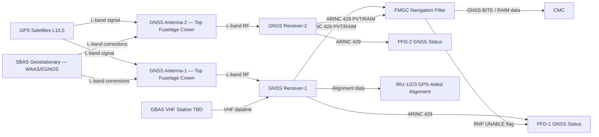
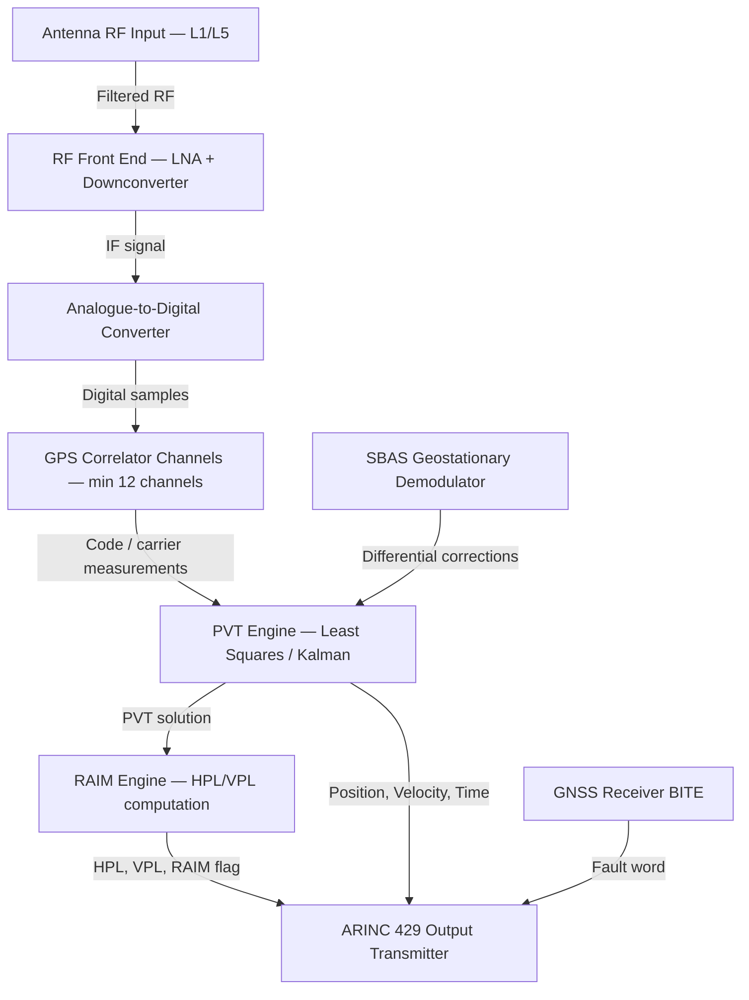
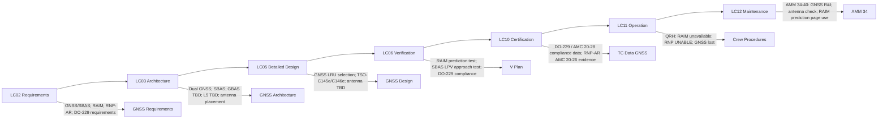

# 034-040 — Satellite Navigation and Augmentation
### [PROGRAMME-AIRCRAFT] [PROGRAMME-VARIANT] · ATA 34 · Q+ATLANTIDE ATLAS Scaffold

---

## §0 Hyperlink Policy

All internal links use relative paths from the current directory. External regulatory and standards references use anchor links in [§20 References](#20-references). Links marked **TBD** indicate unallocated targets. Programme-level links traverse five levels (`../../../../../`). No absolute URLs used for internal navigation.

---

## §1 Purpose

This document defines the agnostic ATLAS standard-level architecture context for `034-040 — Satellite Navigation and Augmentation`.

It describes the controlled scope, functions, interfaces, safety considerations, lifecycle traceability, and S1000D/CSDB mapping logic that programme implementations shall instantiate when this node is applicable.

This document is not a programme design baseline. Programme-specific capacities, locations, part numbers, effectivity, operating limits, maintenance references, and data module codes shall be defined only inside the applicable programme implementation branch.
## §2 Applicability

| Applicability Level | Rule |
|---|---|
| Standard taxonomy | Applies to the ATLAS node `<NODE>` |
| Programme implementation | Conditional; determined by programme architecture, trade studies, certification basis, and applicability model |
| Product configuration | Defined in the programme-specific configuration baseline |
| Effectivity | Defined in the programme CSDB / applicability layer |
| Non-applicability | Must be explicitly stated in the programme impact-study branch when excluded |
## §3 System / Function Overview

The Satellite Navigation subsystem provides the primary precision positioning capability for the [PROGRAMME-AIRCRAFT] [PROGRAMME-VARIANT]. Two independent GNSS receivers (GNSS-1 and GNSS-2) receive satellite signals, compute position, velocity, and time (PVT) solutions, perform RAIM integrity monitoring, and output data on ARINC 429 to the FMGC navigation filter.

**GNSS Receiver function**: Each receiver tracks GPS satellites (L1 C/A code baseline; L5 TBD), Galileo satellites (TBD), and SBAS geostationary satellites (WAAS PRN 135/138; EGNOS PRN 120/124/126). The SBAS differential corrections and integrity data received from geostationary satellites are applied to improve position accuracy to < 3 m (H, 95%) and provide signal-in-space integrity (SISA) for LPV-200 approach operations.

**RAIM (Receiver Autonomous Integrity Monitoring)**: Each GNSS receiver computes a self-contained integrity check using satellite redundancy (Horizontal Protection Level, HPL; Vertical Protection Level, VPL). If the Protection Level exceeds the Alert Limit for the selected operation (e.g., HPL > 0.3 NM for en-route; HPL > 40 m for LNAV approach), the receiver generates a RAIM FAIL flag and the FMS generates an RNP UNABLE alert.

**SBAS LPV approach**: With EGNOS/WAAS augmentation, the GNSS receiver supports Localizer Performance with Vertical guidance (LPV) approaches to minima as low as 200 ft DH (LPV-200). LPV approaches are defined in the FMS navigation database and displayed on the PFD as a virtual ILS.

**RNP-AR**: Required Navigation Performance — Authorization Required approach operations require lateral accuracy (RNP) < 0.1 NM (TBD), continuous RAIM monitoring, and FMS trajectory with radius-to-fix (RF) legs. Authorisation Required from the competent authority.

**GBAS (TBD)**: If fitted, the GNSS receiver would also receive VHF data broadcasts from a GBAS ground station, applying local differential corrections for Cat I (and potentially Cat II/III with SCAT-I GBAS) approach operations at GBAS-equipped airports. GBAS receiver function may be integrated in the standalone GNSS LRU or in the MMR TBD.

---

## §4 Scope

### 4.1 Included
- GNSS Receiver-1 and GNSS Receiver-2 (LRUs — avionics bay)
- GPS L1 C/A signal reception and processing
- GPS L5 signal reception (TBD — dual frequency upgrade)
- Galileo signal reception (TBD)
- SBAS signal reception and processing (WAAS / EGNOS geostationary PRNs)
- GBAS VHF datalink reception (TBD — optional fitment)
- PVT (Position, Velocity, Time) solution computation
- RAIM computation (HPL/VPL vs. alert limits)
- SBAS differential correction application (LPV approach accuracy)
- ARAIM integrity monitoring (TBD — future upgrade)
- RNP-AR approach support (FMS filter integration)
- GNSS antenna-1 and antenna-2 (top fuselage crown mounting, TBD)
- ARINC 429 output to FMGC, PFD, and CMC
- GNSS BITE and CMC fault reporting

### 4.2 Excluded
- IRS integration and navigation filter (FMGC-hosted) — 034-070
- MMR GPS approach channel (separate GNSS channel within MMR) — 034-030
- FMS flight planning using GNSS — ATA 22
- IRS alignment using GNSS — 034-020

---

## §5 Architecture Description

- **Dual independent GNSS receivers**: GNSS-1 and GNSS-2 are independent LRUs, each with its own antenna, power supply, and ARINC 429 output. This provides redundancy: failure of one receiver does not affect the other. Both receivers feed the FMGC simultaneously.
- **SBAS regional selection**: The FMS or crew selects the SBAS region (WAAS for North America, EGNOS for Europe, MSAS for Japan, etc.) based on geographic position. The GNSS receivers automatically track the appropriate geostationary SBAS satellites for the selected region.
- **L1 baseline, L5 TBD**: The baseline GNSS receiver tracks GPS L1 (1575.42 MHz). L5 (1176.45 MHz) dual-frequency tracking eliminates ionospheric delay error (the largest ranging error source), enabling ARAIM and potentially reducing the SBAS requirement. The L5 decision depends on receiver supplier capability and TSO-C145e/C146e scope (TBD).
- **RAIM operation**: Each GNSS receiver performs RAIM using a minimum of 5 GPS satellites (for Fault Detection) or 6 satellites (for Fault Detection and Exclusion — FDE). The FMGC monitors the RAIM availability outputs from both receivers and generates an RNP UNABLE flag if RAIM is unavailable for the required operation.
- **GNSS antenna installation on composite fuselage**: GNSS antennas (L-band patch antennas) are mounted on the top fuselage crown. The CFRP composite structure is non-conductive (beneficial for GNSS — no groundplane required in the traditional sense), but structural attachment and environmental sealing of antenna mounts in CFRP skin requires careful engineering (TBD).
- **Navigation filter integration**: The FMGC navigation filter (034-070) fuses GNSS-1 and GNSS-2 position/velocity with IRS and DME/VOR data in a Kalman filter. The GNSS data dominates the position solution under normal conditions; IRS provides continuity during GNSS outages; DME-DME provides a radio navigation backup.
- **ARAIM future upgrade**: When ICAO Navigation System Panel standards for ARAIM are finalised and dual-constellation receivers (GPS + Galileo) are mature, the FMGC navigation filter is planned to be upgraded to support ARAIM for oceanic/continental operations without SBAS (TBD upgrade path).

---

## §6 Functional Breakdown

| Function ID | Function Title | Description | LRU |
|---|---|---|---|
| F-040-001 | GPS L1 Signal Acquisition and Tracking | Acquire and track GPS L1 C/A code signals from ≥4 satellites | GNSS-1 / GNSS-2 |
| F-040-002 | GPS L5 Signal Tracking (TBD) | Track GPS L5 signals for dual-frequency ionosphere-free solution | GNSS-1 / GNSS-2 (TBD) |
| F-040-003 | Galileo Signal Tracking (TBD) | Track Galileo E1 / E5a signals for multi-constellation | GNSS-1 / GNSS-2 (TBD) |
| F-040-004 | SBAS Signal Reception | Receive WAAS / EGNOS geostationary satellite signal; decode corrections and integrity | GNSS-1 / GNSS-2 |
| F-040-005 | PVT Solution Computation | Compute position (lat/lon/alt), velocity, and time from satellite measurements | GNSS-1 / GNSS-2 |
| F-040-006 | SBAS Differential Correction Application | Apply SBAS differential corrections to GPS pseudoranges for LPV accuracy | GNSS-1 / GNSS-2 |
| F-040-007 | RAIM Computation | Compute HPL / VPL; compare with alert limits; output RAIM flag | GNSS-1 / GNSS-2 |
| F-040-008 | GBAS Differential Processing (TBD) | Receive and apply GBAS VHF differential corrections for Cat I/II approach | GNSS-1 / GNSS-2 (TBD) |
| F-040-009 | ARAIM Integrity Monitoring (TBD) | Multi-constellation integrity monitoring for ARAIM operations | GNSS-1 / GNSS-2 + FMGC (TBD) |
| F-040-010 | ARINC 429 Output | Transmit GNSS PVT, RAIM status, protection levels to FMGC and PFD | GNSS-1 / GNSS-2 |

---

## §7 System Context Diagram

---

## §8 Internal Functional Architecture

---

## §9 Lifecycle Traceability

---

## §10 Interfaces

| Interface ID | System / Chapter | Interface Type | Data / Signal | Direction | Status |
|---|---|---|---|---|---|
| IF-040-001 | ATA 22 FMGC | ARINC 429 | GNSS position (lat/lon/alt), velocity, HPL/VPL, RAIM flag, SBAS mode | GNSS → FMGC |  |
| IF-040-002 | ATA 34 IRU (034-020) | ARINC 429 | GPS position and velocity for IRS GPS-aided alignment | GNSS → IRU |  |
| IF-040-003 | ATA 31 PFD | ARINC 429 | GNSS status (mode, number of satellites, RAIM available) for PFD display | GNSS → PFD |  |
| IF-040-004 | ATA 31 MCDU | ARINC 429 | GNSS status and RAIM prediction data for MCDU GNSS STATUS page | GNSS → MCDU |  |
| IF-040-005 | ATA 24 Electrical Power | 28 VDC essential bus | Power for GNSS-1 and GNSS-2 | ATA24 → GNSS |  |
| IF-040-006 | ATA 45 CMC | ARINC 429 / AFDX | GNSS BITE fault words; RAIM alert events; navigation DB currency | GNSS → CMC |  |
| IF-040-007 | ATA 31 ECAM | AFDX | GNSS RAIM advisory; GNSS FAIL advisory | FMGC → ECAM |  |

---

## §11 Operating Modes

| Mode ID | Mode Name | Description | Entry Condition | Exit Condition |
|---|---|---|---|---|
| OM-040-001 | GNSS Acquisition | Receiver acquiring satellite signals post power-on; computing initial PVT | Power-on or signal loss recovery | PVT valid (≥4 satellites) |
| OM-040-002 | GNSS Navigation — GPS only | PVT from GPS L1 only; no SBAS correction; RAIM available | GPS PVT valid; SBAS unavailable or not selected | SBAS available |
| OM-040-003 | GNSS Navigation — GPS + SBAS | PVT with SBAS differential corrections applied; LPV accuracy available | SBAS signal valid; differential corrections applied | SBAS signal lost |
| OM-040-004 | LPV Approach — SBAS | SBAS-augmented LPV approach; VPL < VAL (Vertical Alert Limit); HPL < HAL | FMS LPV approach selected; SBAS RAIM available for approach | Go-around or landing |
| OM-040-005 | RNP-AR Approach — GNSS | High-precision GNSS approach; HPL < RNP (0.1 NM TBD); FMS RF legs | FMS RNP-AR approach selected; RAIM available | Go-around or landing |
| OM-040-006 | RAIM Unavailable | GNSS RAIM not available for required operation; RNP UNABLE on PFD | HPL or VPL exceeds alert limit | Sufficient satellite geometry restored |
| OM-040-007 | GNSS Failure | One or both GNSS receivers failed; IRS + DME navigation continues | GNSS receiver BITE fail or no PVT | GNSS receiver replaced |
| OM-040-008 | GBAS Approach (TBD) | GBAS differential corrections applied from VHF datalink; Cat I approach TBD | GBAS receiver fitted and GBAS station in range (TBD) | Landing or go-around |

---

## §12 Monitoring and Diagnostics

- **GNSS BITE**: Each GNSS receiver performs continuous self-monitoring: RF front end, correlator channels, PVT computation, SBAS demodulator, RAIM engine. BITE fault words on ARINC 429 logged by CMC. A GNSS receiver failure generates a GNSS FAIL advisory and CMC fault log entry.
- **RAIM monitoring**: The FMGC monitors RAIM availability from both receivers. Loss of RAIM for the current operation generates an RNP UNABLE alert on the PFD. Crew action: revert to alternate navigation source (IRS + DME) or change to a route/approach not requiring GNSS RAIM.
- **SBAS integrity monitoring**: SBAS provides signal-in-space integrity data (UDRE, GIVE parameters) for each satellite. The GNSS receiver uses this data to compute the HPL/VPL for SBAS-aided operations. If SBAS integrity data is flagged (DNU — Do Not Use), the receiver reverts to GPS-only operation.
- **Navigation database currency**: The FMGC monitors the navigation database expiry date (AIRAC cycle). An expired database generates a NAV DB OUTDATED advisory via the CMC and ECAM (NAV DB EXPIRED). Use of an expired database may be restricted to specific operations per regulatory authority.
- **Satellite geometry prediction (RAIM prediction)**: The MCDU GNSS STATUS / RAIM PREDICTION page allows pre-flight prediction of RAIM availability for the planned route and approach time window. This uses the GPS satellite almanac stored in the receiver. Crew checks RAIM availability before departure for planned RNP-AR approaches.

---

## §13 Maintenance Concept

- **GNSS receiver replacement**: Line maintenance. GNSS receiver in avionics bay. Replacement: ARINC 429 connector disconnection; RF coaxial antenna cable disconnection; LRU extraction. Post-replacement: verify PVT acquisition and RAIM status on CMC or MCDU GNSS STATUS page. No bench calibration required.
- **GNSS antenna replacement**: GNSS patch antenna on top fuselage crown requires physical access to upper fuselage exterior. Antenna removal: disconnect coaxial cable; remove fasteners. Antenna is flush with the fuselage skin profile. Composite CFRP fuselage attachment: check for delamination or water ingress at antenna mount after replacement. Post-replacement: verify GNSS signal acquisition (≥TBD satellites in TBD minutes on ground).
- **Navigation database update**: AIRAC 28-day cycle update via ARINC 615A data loader. Loaded via CMC maintenance port. Both GNSS receivers receive navigation database update data for RAIM prediction almanac and approach procedure waypoints. Post-update: verify database effective date on MCDU.
- **No overhaul**: GNSS receivers are on-condition LRUs. No scheduled overhaul interval.

---

## §14 S1000D / CSDB Mapping

### 14.1 SNS to DMC Mapping

| SNS Code | Subsubject Title | DMC Prefix | Info Codes Planned | DMRL Status |
|---|---|---|---|---|
| 034-40 | Satellite Navigation and Augmentation | DMC-<PROGRAMME>-<VARIANT>-034-40 | 040, 300, 400, 520, 720 |  |

### 14.2 Recommended DM Set for 034-40

| Info Code | DM Title | Description |
|---|---|---|
| 040 | GNSS System Description | Dual GNSS, SBAS, RAIM, RNP-AR architecture |
| 300 | GNSS Normal / Abnormal Procedures | RAIM unavailable; RNP UNABLE; GNSS lost; navigation DB expired |
| 400 | GNSS Inspection and Test | GNSS signal acquisition test; RAIM prediction check; nav DB update |
| 520 | GNSS Fault Isolation | GNSS receiver fault; antenna fault; RAIM permanent fail |
| 720 | GNSS Receiver and Antenna R&I | GNSS receiver R&I; GNSS antenna R&I |

---

## §15 Footprints

### 15.1 Physical Footprint
- GNSS Receiver-1 and GNSS Receiver-2: avionics bay — LRU envelope TBD; weight TBD kg
- GNSS Antenna-1 and GNSS Antenna-2: top fuselage crown — patch antenna, flush profile; positions TBD

### 15.2 Electrical / Data Footprint
- GNSS receiver power: 28 VDC essential bus; TBD W per receiver
- ARINC 429 output buses per GNSS receiver: TBD (FMGC, PFD, MCDU, CMC)

### 15.3 Maintenance Footprint
- GNSS receiver R&I: line maintenance; no special tooling
- GNSS antenna R&I: exterior fuselage access; composite CFRP attachment check
- Navigation DB update: AIRAC 28-day cycle; ARINC 615A data loader

### 15.4 Data Footprint
- GNSS BITE fault log: TBD entries per receiver, in CMC
- RAIM prediction log: pre-flight check records — TBD retention
- Navigation DB update log: cycle, effective date — per AMM retention

---

## §16 Safety and Certification Considerations

| Requirement | Source | Description | Compliance Approach | Status |
|---|---|---|---|---|
| CS-25.1301 | EASA CS-25 | Equipment function and installation | GNSS qualification; DO-160G |  |
| CS-25.1309 | EASA CS-25 | System safety | Dual GNSS; RAIM; FHA/FMEA |  |
| CS-ACNS | EASA | RNAV/RNP airspace compliance | GNSS-based RNAV/RNP; CS-ACNS.B.RNAV; CS-ACNS.B.RNP |  |
| AMC 20-28 | EASA AMC | GNSS / SBAS airworthiness approval | Dual GNSS + SBAS; DO-229 compliance; RAIM; SBAS LPV |  |
| AMC 20-26 | EASA AMC | RNP-AR approach approval | RNP-AR capability; FMS RF legs; RAIM for RNP-AR |  |
| DO-229F | RTCA | MOPS for GPS/WAAS | GNSS receiver qualification; TSO-C145e / C146e |  |
| TSO-C145e | FAA | Airborne Navigation Sensors Using GPS + SBAS | GNSS receiver TSO qualification |  |
| TSO-C146e | FAA | Stand-Alone Airborne Navigation Equipment Using GPS + SBAS | GNSS receiver TSO qualification |  |
| DO-178C | RTCA | Software DAL | GNSS receiver software DAL — TBD (likely DAL B) |  |
| DO-160G | RTCA | Environmental qualification | GNSS receiver and antenna environmental testing |  |

---

## §17 Verification and Validation

| V&V ID | Requirement | Method | Success Criterion | Status |
|---|---|---|---|---|
| VV-040-001 | GNSS RAIM prediction — DO-229 | RAIM availability simulation for planned route set | RAIM available > TBD% for all planned RNP-AR approaches |  |
| VV-040-002 | RNP-AR approach simulation | FMS RNP-AR flight simulation; injected GNSS errors | Cross-track error < RNP value; no false RNP UNABLE during nominal operation |  |
| VV-040-003 | SBAS LPV approach accuracy — DO-229 | Ground test with GNSS simulator; SBAS signal injection | Position error < 3 m (H, 95%); HPL < 40 m; VPL < 50 m |  |
| VV-040-004 | RAIM fail alert — DO-229 | GNSS simulator: remove satellites below RAIM threshold | RAIM FAIL flag generated; RNP UNABLE on PFD within TBD seconds |  |
| VV-040-005 | GPS acquisition time | Power-on test: time to first fix with cold start | First fix in < TBD minutes (cold start); < TBD seconds (warm start) |  |
| VV-040-006 | Navigation DB update process | ARINC 615A data load test | Successful database load; correct effective date on MCDU; RAIM prediction uses new almanac |  |
| VV-040-007 | IRS alignment accuracy test using GNSS | GPS-aided IRS alignment test | IRS achieves NAV mode in < 5 min with GPS; position error < TBD NM |  |
| VV-040-008 | DO-160G — Environmental qualification | Full DO-160G test suite for GNSS receiver | Pass all applicable DO-160G categories |  |

---

## §18 Glossary

| Term | Definition |
|---|---|
| ARAIM | Advanced Receiver Autonomous Integrity Monitoring — next-generation GNSS integrity using multiple constellations (GPS + Galileo); future upgrade to RAIM |
| EGNOS | European Geostationary Navigation Overlay Service — SBAS for Europe; provides GPS differential corrections and integrity from geostationary satellites |
| Galileo | European GNSS constellation providing L1/E1 and E5a signals; multi-constellation capability TBD |
| GBAS | Ground-Based Augmentation System — local differential GNSS using VHF data broadcast; supports Cat I/II/III precision approaches; fitment TBD |
| GNSS | Global Navigation Satellite System — generic term for all satellite navigation systems (GPS, Galileo, GLONASS, BeiDou, QZSS) |
| GPS | Global Positioning System — US Department of Defense satellite navigation system; primary GNSS constellation for [PROGRAMME-VARIANT] |
| HPL | Horizontal Protection Level — a RAIM-computed bound on horizontal position error; compared with Horizontal Alert Limit (HAL) |
| L1 | GPS frequency band 1 at 1575.42 MHz; carries GPS L1 C/A and L1C signals |
| L5 | GPS frequency band 5 at 1176.45 MHz; carries GPS L5 signal; dual-frequency with L1 eliminates ionospheric delay; TBD on [PROGRAMME-VARIANT] |
| LPV | Localizer Performance with Vertical Guidance — a SBAS-based precision approach providing lateral and vertical guidance similar to ILS; minimum DH 200 ft |
| LNAV | Lateral Navigation — non-precision GPS approach using horizontal GNSS guidance only |
| MSAS | MTSAT Satellite Augmentation System — SBAS for Japan; compatible with EGNOS/WAAS architecture |
| PVT | Position, Velocity, Time — the primary output solution of a GNSS receiver |
| RAIM | Receiver Autonomous Integrity Monitoring — integrity monitoring using redundant satellite geometry; provides HPL/VPL computation |
| RF Leg | Radius-to-Fix — a curved FMS path segment used in RNP-AR approaches; requires continuous RAIM monitoring |
| RNP | Required Navigation Performance — navigation specification with on-board monitoring (HPL < RNP value) and alerting capability |
| RNP-AR | RNP — Authorization Required — the most demanding RNP specification; requires authorisation from competent authority; lateral accuracy < 0.1 NM TBD |
| SBAS | Satellite-Based Augmentation System — wide-area GNSS differential correction system (WAAS, EGNOS, MSAS) |
| SISA | Signal-In-Space Accuracy — Galileo integrity parameter; equivalent to SBAS UDRE for GPS |
| VPL | Vertical Protection Level — RAIM-computed bound on vertical position error; compared with Vertical Alert Limit (VAL) |
| WAAS | Wide Area Augmentation System — SBAS for North America operated by the FAA |

---

## §19 Citations

| Citation ID | Source | Title | Relevance |
|---|---|---|---|
| CIT-040-001 | EASA | AMC 20-28 — GNSS/SBAS Airworthiness Approval | SBAS and GNSS approval guidance |
| CIT-040-002 | EASA | AMC 20-26 — Airworthiness Approval of RNP-AR | RNP-AR approach approval |
| CIT-040-003 | RTCA | DO-229F — MOPS for GPS/WAAS | GNSS/SBAS qualification standard |
| CIT-040-004 | FAA | TSO-C145e / C146e | GNSS TSO qualification |
| CIT-040-005 | EASA | CS-ACNS — CNS Airspace Requirements | RNAV/RNP compliance |
| CIT-040-006 | RTCA | DO-178C — Software Considerations | GNSS software DAL |
| CIT-040-007 | RTCA | DO-160G | GNSS environmental qualification |
| CIT-040-008 | ARINC | ARINC 615A — Data Loading | Navigation database update |
| CIT-040-009 | ASD-STAN | S1000D Issue 5.0 | CSDB mapping |

---

## §20 References

| Ref ID | Document | Title | Link |
|---|---|---|---|
| REF-040-001 | DO-229F | MOPS for GPS/WAAS Airborne Equipment | [RTCA](https://www.rtca.org/) |
| REF-040-002 | TSO-C145e | Airborne Navigation Sensors Using GPS+SBAS | [FAA TSO](#) |
| REF-040-003 | TSO-C146e | Stand-Alone Airborne Navigation Equipment Using GPS+SBAS | [FAA TSO](#) |
| REF-040-004 | AMC 20-28 | GNSS/SBAS Airworthiness Approval | [EASA AMC](#) |
| REF-040-005 | AMC 20-26 | RNP-AR Airworthiness Approval | [EASA AMC](#) |
| REF-040-006 | CS-ACNS | Communications, Navigation, Surveillance | [EASA CS-ACNS](#) |
| REF-040-007 | DO-160G | Environmental Conditions and Test Procedures | [RTCA](https://www.rtca.org/) |
| REF-040-008 | DO-178C | Software Considerations | [RTCA](https://www.rtca.org/) |
| REF-040-009 | ARINC 615A | Data Loading | [ARINC](https://www.aviation-ia.com/) |
| REF-040-010 | S1000D Issue 5.0 | International Specification for Technical Publications | [s1000d.org](https://s1000d.org/) |

---

## §21 Open Issues

| Issue ID | Description | Owner | Priority | Status |
|---|---|---|---|---|
| OI-040-001 | GNSS L5 dual-frequency decision — confirm whether L5 is required for ARAIM; impact on receiver selection and TSO scope | Q-AIR | Medium |  |
| OI-040-002 | Galileo multi-constellation — confirm Galileo receiver integration; dependency on ARAIM standards maturation | Q-AIR / Q-DATAGOV | Low |  |
| OI-040-003 | GBAS fitment decision — Cat I/II GBAS as standard or optional equipment | Q-AIR / ORB-PMO | Medium |  |
| OI-040-004 | GNSS antenna installation on CFRP — composite fuselage attachment engineering; delamination risk; RF coax routing through CFRP structure | Q-MECHANICS / Q-AIR | High |  |
| OI-040-005 | ARAIM upgrade path — define certification programme for ARAIM when ICAO NSP standards finalised | Q-AIR / Q-DATAGOV | Low |  |
| OI-040-006 | RNP-AR approval — confirm <0.1 NM lateral accuracy target and RAIM availability requirements for planned route network | Q-AIR / ORB-LEG | High |  |
| OI-040-007 | Cat II / Cat III ILS decision (cross-reference 034-030) | Q-AIR / ORB-PMO | High |  |
| OI-040-008 | MEMS vs. FOG IRS technology decision (cross-reference 034-020) | Q-AIR / ORB-PMO | High |  |

---

## §22 Change Log

| Revision | Date | Author | Description |
|---|---|---|---|
| 0.1.0 | 2026-05-10 | Q+ATLANTIDE / Q-AIR | Initial full-template creation — all §0–§22 sections drafted; TBD items identified |
