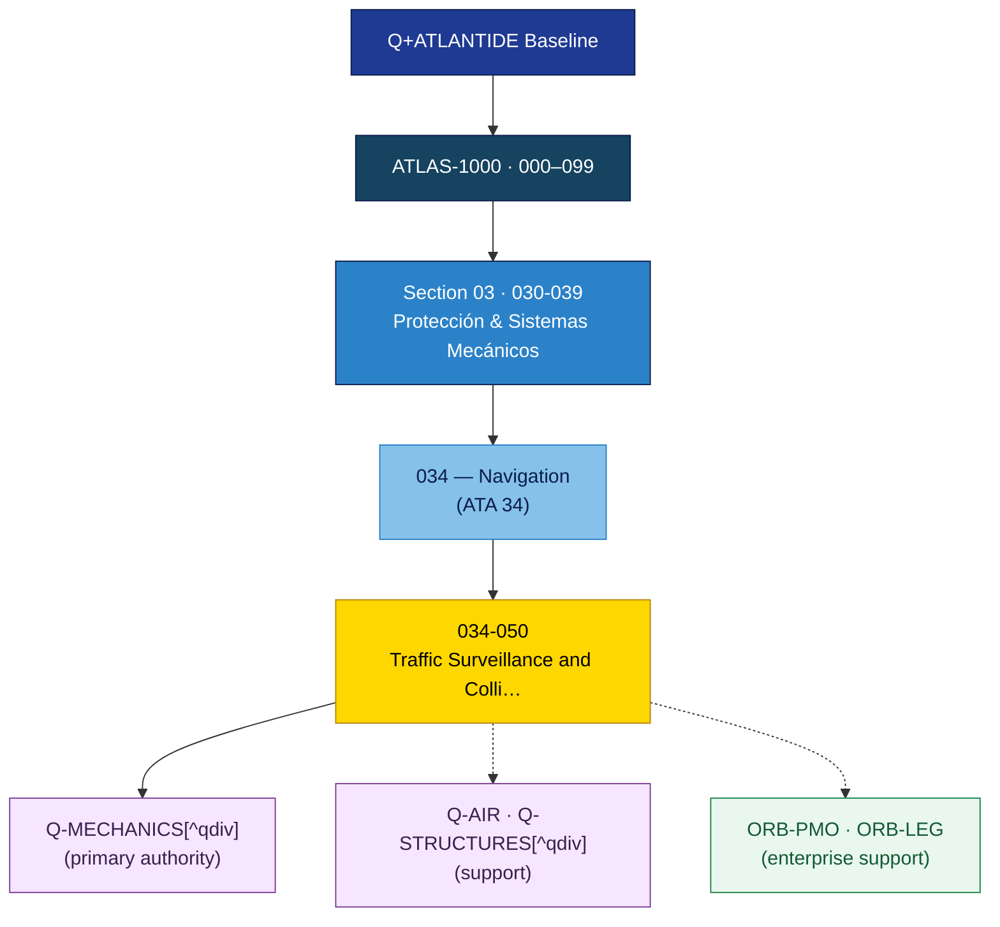

# ATLAS 030-039 · Section 03 · Subsection 034 · 050 — Traffic Surveillance and Collision Avoidance

## 1. Purpose

Documents TCAS II (v7.1) / ACAS X, ADS-B In/Out (1090 ES), ATCRBS/Mode-S transponder, and Traffic Advisory System (TAS) installations and data bus interfaces.

## 2. Scope

- Mode-S transponder: Extended Squitter (ES) 1090 MHz, ARINC 718A interface.
- ADS-B Out: DO-260B / ED-102A compliance, SIL/SDA levels, and position source requirements.
- ADS-B In: traffic display integration with ND/MFD.
- TCAS II v7.1 / ACAS Xa: hybrid surveillance, RA generation, and RA downlink.
- ARINC 429 label assignments for traffic, RA commands, and transponder status.
- Not in scope: traffic display symbology (ATA 31) or ATC voice communication (ATA 23).

## 3. Footprint

| Metric | Value |
|---|---|
| Architecture | `ATLAS` — Aircraft Top Level Architecture Schema/System (controlled term) |
| Master range | `000–099` |
| Code range | `030-039` |
| Section | `03` — Protección & Sistemas Mecánicos |
| Subsection | `034` — Navigation |
| Subsubject | `050` — Traffic Surveillance and Collision Avoidance |
| Primary Q-Division | Q-MECHANICS[^qdiv] |
| Support Q-Divisions | Q-AIR, Q-STRUCTURES |
| ORB support | ORB-PMO, ORB-LEG |
| Governance class | `baseline`[^gov] |
| Folder path | `Q+ATLANTIDE/000-099_ATLAS/030-039_Proteccion-y-Sistemas-Mecanicos/034_Navigation/` |
| Document | `034-050-Traffic-Surveillance-and-Collision-Avoidance.md` (this file) |
| Parent subsection | [`README.md`](./README.md) |
| Parent section | [`../../README.md`](../../README.md) |
| Parent architecture | [`../../../README.md`](../../../README.md) |
| Parent baseline | [`organization/Q+ATLANTIDE.md`](../../../../../organization/Q+ATLANTIDE.md) |

> **Footprint Notes**
> - **Architecture**: `ATLAS` is the controlled term for the Aircraft Top-Level Architecture Schema/System within the Q+ATLANTIDE-1000 register.
> - **Primary Q-Division**: Q-MECHANICS holds technical authority for mechanical and electro-mechanical aircraft systems.
> - **Support Q-Divisions**: Q-AIR provides systems integration oversight; Q-STRUCTURES provides structural interface authority.
> - **Governance class**: `baseline` documents are subject to formal change control under the Q+ATLANTIDE Configuration Management Plan.
> - **ORB support**: ORB-PMO coordinates programme management; ORB-LEG provides regulatory and certification support.

## 4. Interfaces Diagram

## 5. References & Citation Map

[^baseline]: **Q+ATLANTIDE controlled baseline (v1.0.0)** — [`organization/Q+ATLANTIDE.md`](../../../../../organization/Q+ATLANTIDE.md). Defines the controlled `000-999` architecture-band taxonomy and the ATLAS-1000 register subpart.

[^qdiv]: **Q-Division authority** — [`organization/Q-Divisions/`](../../../../../organization/Q-Divisions/). Technical-authority units for the Q+ATLANTIDE baseline.

[^gov]: **Governance class** — `baseline` denotes documents under controlled change management within the Q+ATLANTIDE baseline.

[^n001]: **Note N-001** — Q+ATLANTIDE (with its ATLAS-1000 register subpart) is a taxonomy and traceability ecosystem, not an organization chart. See [`organization/Q+ATLANTIDE.md` §4](../../../../../organization/Q+ATLANTIDE.md#4-notes).

### Citation & Traceability Map

| Ref | Target Document | Relationship | Scope |
|---|---|---|---|
| [^baseline] | [`organization/Q+ATLANTIDE.md`](../../../../../organization/Q+ATLANTIDE.md) | Normative baseline | ATLAS-1000 register authority |
| [^qdiv] | [`organization/Q-Divisions/`](../../../../../organization/Q-Divisions/) | Technical authority | Q-Division assignment |
| [^gov] | Q+ATLANTIDE governance class definition | Governance class | Change-management classification |
| [^n001] | [`organization/Q+ATLANTIDE.md §4`](../../../../../organization/Q+ATLANTIDE.md#4-notes) | Taxonomy note | Ecosystem scope clarification |
