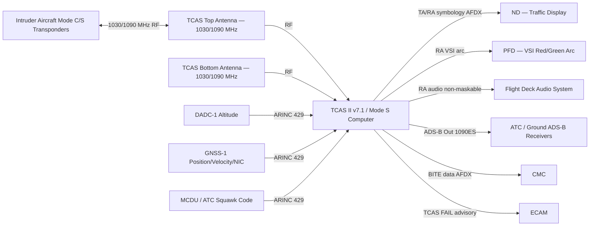
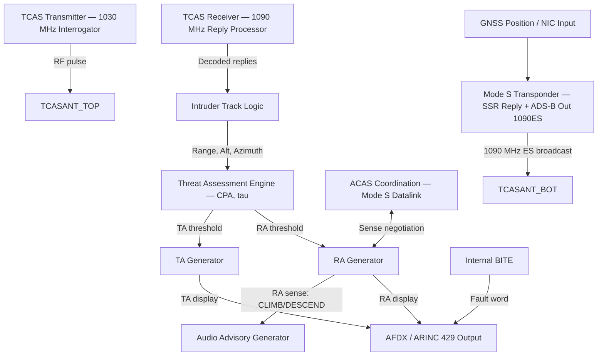
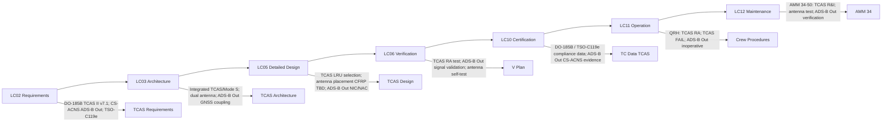

# 034-050 — Traffic Surveillance and Collision Avoidance
### [PROGRAMME-AIRCRAFT] [PROGRAMME-VARIANT] · ATA 34 · Q+ATLANTIDE ATLAS Scaffold

---

## §0 Hyperlink Policy

All internal links use relative paths from the current directory. External regulatory and standards references use anchor links in [§20 References](#20-references). Links marked **TBD** indicate unallocated targets. Programme-level links traverse five levels (`../../../../../`). No absolute URLs used for internal navigation.

---

## §1 Purpose

This document defines the agnostic ATLAS standard-level architecture context for `034-050 — Traffic Surveillance and Collision Avoidance`.

It describes the controlled scope, functions, interfaces, safety considerations, lifecycle traceability, and S1000D/CSDB mapping logic that programme implementations shall instantiate when this node is applicable.

This document is not a programme design baseline. Programme-specific capacities, locations, part numbers, effectivity, operating limits, maintenance references, and data module codes shall be defined only inside the applicable programme implementation branch.
## §2 Applicability

| Applicability Level | Rule |
|---|---|
| Standard taxonomy | Applies to the ATLAS node `<NODE>` |
| Programme implementation | Conditional; determined by programme architecture, trade studies, certification basis, and applicability model |
| Product configuration | Defined in the programme-specific configuration baseline |
| Effectivity | Defined in the programme CSDB / applicability layer |
| Non-applicability | Must be explicitly stated in the programme impact-study branch when excluded |
## §3 System / Function Overview

The Traffic Surveillance and Collision Avoidance subsystem provides the [PROGRAMME-AIRCRAFT] [PROGRAMME-VARIANT] crew with awareness of other aircraft in the vicinity and, when a collision threat is detected, generates mandatory vertical evasion guidance (Resolution Advisories — RA) to be followed immediately by the crew.

**TCAS II version 7.1**: The TCAS computer interrogates other aircraft (equipped with Mode C or Mode S transponders) using 1030 MHz interrogations. It receives 1090 MHz transponder replies containing altitude information. From the relative position (bearing estimated from directional antennas, range from time-of-flight) and altitude of each tracked aircraft, the TCAS threat assessment logic determines:
- **Traffic Advisory (TA)**: An intruder aircraft within 20–48 seconds of closest approach. Displayed on ND as solid amber circle (or filled yellow diamond). No required crew action other than visual search.
- **Resolution Advisory (RA)**: An intruder aircraft within 15–35 seconds of closest approach. Displayed on ND as solid red square (or filled red diamond). Audio: "CLIMB CLIMB" / "DESCEND DESCEND" / "MONITOR VERTICAL SPEED" etc. **Crew must comply immediately without ATC clearance.** The RA is coordinated between both aircraft via TCAS-to-TCAS Mode S communication (ACAS coordination) to ensure complementary vertical sense.

**Mode S Transponder (integrated)**: The Mode S transponder responds to SSR (Secondary Surveillance Radar) interrogations from ATC ground radar and TCAS interrogations from other aircraft. Mode S replies contain: aircraft identity (ICAO 24-bit address), aircraft identification (callsign), barometric altitude, and — for ADS-B Out — extended squitter (1090ES) broadcast with GNSS position, velocity, and integrity data.

**ADS-B Out (1090ES)**: The transponder broadcasts ADS-B Out (Automatic Dependent Surveillance — Broadcast) messages on 1090 MHz using extended squitter (ES). These include: GNSS position (NIC, NAC), altitude, velocity, identification. Mandatory per CS-ACNS.D.ADS-B in EASA airspace and equivalent FAR requirements. Provides ATC and ground systems with aircraft state data without active interrogation.

**ADS-B In (TBD)**: ADS-B In receives 1090ES broadcasts from other aircraft for traffic situational awareness (TIS-B) and receives weather and NOTAMs from ground stations (FIS-B). ADS-B In capability is TBD as optional fitment on [PROGRAMME-VARIANT].

---

## §4 Scope

### 4.1 Included
- TCAS II version 7.1 computer LRU (includes Mode S transponder function)
- TCAS top antenna and bottom antenna (fuselage — positions TBD, composite CFRP RF TBD)
- Mode S transponder function (24-bit ICAO address, callsign, ADS-B Out 1090ES)
- TCAS threat assessment logic (TA and RA generation per DO-185B)
- RA audio output (TCAS audio warnings to cockpit speakers / headsets)
- RA visual display on ND (traffic symbology: proximate, TA, RA)
- TCAS vertical speed command output to PFD (red/green arc on VSI)
- Mode S ADS-B Out broadcast (position NIC/NAC from GNSS, altitude, velocity, callsign)
- TCAS-to-TCAS coordination (ACAS-ACAS coordination via Mode S)
- ADS-B In TIS-B / FIS-B (TBD — optional)
- TCAS BITE and CMC fault reporting

### 4.2 Excluded
- ATC voice communication — ATA 23
- CPDLC / ACARS datalink — ATA 23
- Secondary Surveillance Radar (SSR) ground infrastructure — external
- UAT (978 MHz) ADS-B — not applicable
- FMS trajectory adjustment in response to RA — ATA 22 (note: TCAS RA overrides AP)

---

## §5 Architecture Description

- **Integrated TCAS/Mode S computer**: A single LRU combines the TCAS II processing unit and Mode S transponder, reducing weight and LRU count. The unit performs both active TCAS surveillance (interrogate-and-track) and passive Mode S transponder functions simultaneously.
- **Dual antenna configuration**: TCAS uses a top antenna (above fuselage) and a bottom antenna (below fuselage). The directional antenna system (4-element or phased array TBD) estimates azimuth bearing of intruder aircraft for ND display. The bearing accuracy is lower than range accuracy (range from time-of-flight is precise; bearing from antenna directionality is approximate). Composite CFRP fuselage RF transparency at 1030/1090 MHz TBD.
- **TCAS RA execution**: When TCAS generates an RA, the crew must comply immediately. The autopilot does not automatically respond to RA — the crew must disconnect autopilot (if in AP-managed mode) and execute the RA manually. Post-RA clear of conflict: autopilot can be re-engaged. Note: future autopilot integration with TCAS RA (automatic RA response) is not included in baseline [PROGRAMME-VARIANT]; TBD for future enhancement.
- **ADS-B Out GNSS coupling**: ADS-B Out position data is derived from the GNSS receivers (GNSS-1 and GNSS-2). The NIC (Navigation Integrity Category) and NAC (Navigation Accuracy Category) in the ADS-B Out message reflect the GNSS/SBAS integrity and accuracy. NIC ≥ 7 (HPL < 0.1 NM) is the minimum for CS-ACNS ADS-B Out requirements.
- **TCAS audio system**: TCAS audio alerts use a dedicated audio controller or the aircraft audio management system (ATA 23 interface). RA audio is non-maskable by crew: TCAS RA audio cannot be silenced by volume controls. The audio advisory set is per TCAS II version 7.1 (DO-185B Appendix C): "CLIMB", "DESCEND", "MONITOR VERTICAL SPEED", "LEVEL OFF", "INCREASE DESCENT", etc.
- **TCAS inhibit logic**: TCAS RA is inhibited below approximately 1000 ft RA (radio altitude) to prevent RA commands near ground. Specific inhibit thresholds are per DO-185B.

---

## §6 Functional Breakdown

| Function ID | Function Title | Description | LRU |
|---|---|---|---|
| F-050-001 | TCAS Surveillance — Interrogation | Transmit 1030 MHz interrogations (Mode C/S); receive 1090 MHz replies | TCAS/Mode S Computer |
| F-050-002 | Intruder Track Management | Maintain tracks on all proximate aircraft; compute CPA (Closest Point of Approach) | TCAS/Mode S Computer |
| F-050-003 | Traffic Advisory (TA) Generation | Issue TA when intruder within TA threshold; amber display on ND | TCAS/Mode S Computer |
| F-050-004 | Resolution Advisory (RA) Generation | Issue RA when intruder within RA threshold; audio + ND display + PFD VSI arc | TCAS/Mode S Computer |
| F-050-005 | ACAS-ACAS Coordination | Coordinate RA sense with other TCAS-equipped aircraft via Mode S | TCAS/Mode S Computer |
| F-050-006 | Mode S Transponder | Reply to ATC SSR interrogations; provide altitude, ID, callsign | TCAS/Mode S Computer |
| F-050-007 | ADS-B Out — 1090ES | Broadcast GNSS position, velocity, altitude, identity on 1090 MHz ES | TCAS/Mode S Computer |
| F-050-008 | ADS-B In — TIS-B (TBD) | Receive 1090ES broadcasts from other aircraft; display on ND | TCAS/Mode S Computer (TBD) |
| F-050-009 | RA Audio Output | Issue mandatory TCAS audio advisories to flight deck | TCAS/Mode S Computer + Audio System |
| F-050-010 | TCAS BITE and Fault Reporting | Self-test; CMC fault reporting; TCAS FAIL advisory | TCAS/Mode S Computer |

---

## §7 System Context Diagram

---

## §8 Internal Functional Architecture

---

## §9 Lifecycle Traceability

---

## §10 Interfaces

| Interface ID | System / Chapter | Interface Type | Data / Signal | Direction | Status |
|---|---|---|---|---|---|
| IF-050-001 | ATA 34 DADC (034-010) | ARINC 429 | Barometric altitude for TCAS threat assessment | DADC → TCAS |  |
| IF-050-002 | ATA 34 GNSS (034-040) | ARINC 429 | GNSS position, velocity, NIC/NAC for ADS-B Out 1090ES | GNSS → TCAS |  |
| IF-050-003 | ATA 31 ND | AFDX | Traffic symbology (proximate, TA, RA) for ND display | TCAS → ND |  |
| IF-050-004 | ATA 31 PFD | AFDX / ARINC 429 | RA vertical speed target arc (green / red) on PFD VSI | TCAS → PFD |  |
| IF-050-005 | ATA 23 Audio Management | Discrete / Audio | TCAS RA audio (non-maskable): CLIMB, DESCEND, etc. | TCAS → Audio |  |
| IF-050-006 | ATA 23 Communications | ARINC 429 | Mode S squawk code, callsign from ATC/MCDU | ATC → TCAS |  |
| IF-050-007 | ATA 24 Electrical Power | 28 VDC essential bus | Power for TCAS/Mode S computer | ATA24 → TCAS |  |
| IF-050-008 | ATA 45 CMC | AFDX | TCAS BITE fault data; RA event log | TCAS → CMC |  |
| IF-050-009 | ATA 31 ECAM | AFDX | TCAS FAIL advisory; ADS-B OUT advisory | TCAS → ECAM |  |

---

## §11 Operating Modes

| Mode ID | Mode Name | Description | Entry Condition | Exit Condition |
|---|---|---|---|---|
| OM-050-001 | TCAS Standby | TCAS powered but not interrogating; used on ground to prevent interference | WoW = ground (or crew selection) | Airborne or crew TCAS ON |
| OM-050-002 | TCAS TA Only | TCAS generating TA alerts only; RA inhibited; used at pilot discretion or below inhibit altitude | Crew selection TA only; or automatic below RA inhibit altitude (~1000 ft RA TBD) | Crew selection TCAS or altitude above inhibit |
| OM-050-003 | TCAS Normal (TA+RA) | Full TCAS II v7.1 operation; TA and RA enabled; ADS-B Out broadcasting | Airborne above inhibit altitude; TCAS operating normally | TCAS fault or mode change |
| OM-050-004 | RA Active | TCAS RA issued; audio and visual advisory active; crew must comply | CPA within RA threshold; RA logic triggered | TCAS CLEAR OF CONFLICT advisory |
| OM-050-005 | ADS-B Out Active | Continuous 1090ES ADS-B Out broadcast from Mode S transponder | Mode S transponder powered; GNSS valid | Mode S power off or ADS-B fault |
| OM-050-006 | ADS-B In Active (TBD) | Receiving TIS-B traffic from other aircraft and ground stations (if ADS-B In fitted) | ADS-B In receiver active (TBD fitment) | Receiver fault or coverage loss |
| OM-050-007 | TCAS Fault | TCAS inoperative; TCAS FAIL on ND; ECAM advisory; MEL TBD | TCAS BITE fault | TCAS replaced |

---

## §12 Monitoring and Diagnostics

- **TCAS BITE**: The TCAS computer performs continuous self-monitoring: transmitter power, receiver sensitivity, antenna VSWR monitoring, threat assessment computation, Mode S reply processing. BITE fault words transmitted via AFDX to CMC. A TCAS FAIL generates an amber ND annunciation (TCAS FAIL) and an ECAM advisory.
- **ADS-B Out monitoring**: The TCAS computer monitors the ADS-B Out transmission (1090ES broadcast integrity, GNSS position NIC/NAC input validity). If GNSS data is invalid or NIC < minimum threshold, the ADS-B Out message is modified (position data flagged as not available). An ADS-B OUT DEGRADED advisory is generated.
- **Mode S transponder test**: TCAS self-test includes Mode S transponder loop-back test. Post-replacement: CMC-initiated TCAS antenna test verifying top and bottom antenna path integrity.
- **RA event logging**: All RA events (time, intruder Mode S address, RA sense, altitude at RA, crew response indicator TBD) are logged in CMC for post-flight analysis. RA event records are used in safety investigations.
- **TCAS inhibit monitoring**: BITE monitors that TCAS RA inhibit logic activates correctly at the radio altitude threshold. Inhibit logic failure (RA below TBD ft RA) is a potential safety issue and is logged.

---

## §13 Maintenance Concept

- **TCAS computer replacement**: Line maintenance. TCAS/Mode S computer in avionics bay. Replacement requires ARINC 429, AFDX, and RF coaxial (antenna) connector disconnection. Post-replacement: TCAS antenna self-test via CMC; ADS-B Out signal verification (NIC/NAC check); TCAS operational test (TA/RA simulation using CMC test mode).
- **Antenna replacement**: Top and bottom TCAS antennas on fuselage. Antenna replacement requires exterior access. For composite CFRP fuselage: RF coaxial cable routing through fuselage structure TBD; antenna mount attachment (blind insert or composite bonding TBD). Post-replacement: antenna VSWR check; TCAS self-test.
- **ADS-B Out verification**: After any TCAS computer or GNSS receiver replacement, verify ADS-B Out NIC/NAC and position data on CMC ADS-B diagnostic page. External ADS-B signal monitor or ground-based decoder TBD for independent verification.
- **No overhaul**: TCAS computer is on-condition; no scheduled overhaul. RA event log reviewed post-flight by safety team.

---

## §14 S1000D / CSDB Mapping

### 14.1 SNS to DMC Mapping

| SNS Code | Subsubject Title | DMC Prefix | Info Codes Planned | DMRL Status |
|---|---|---|---|---|
| 034-50 | Traffic Surveillance and Collision Avoidance | DMC-<PROGRAMME>-<VARIANT>-034-50 | 040, 300, 400, 520, 720 |  |

### 14.2 Recommended DM Set for 034-50

| Info Code | DM Title | Description |
|---|---|---|
| 040 | TCAS System Description | TCAS II v7.1, Mode S, ADS-B Out, ADS-B In (TBD) |
| 300 | TCAS Procedures | RA compliance; TCAS FAIL; ADS-B Out inoperative |
| 400 | TCAS Inspection and Test | TCAS self-test; antenna test; ADS-B Out verification |
| 520 | TCAS Fault Isolation | TCAS FAIL; ADS-B Out degraded; antenna fault |
| 720 | TCAS Computer and Antenna R&I | TCAS/Mode S computer R&I; antenna R&I |

---

## §15 Footprints

### 15.1 Physical Footprint
- TCAS / Mode S computer: avionics bay — LRU envelope TBD; weight TBD kg
- Top antenna: upper fuselage — blade or directional; position TBD (CFRP RF assessment required)
- Bottom antenna: lower fuselage — blade or directional; position TBD (CFRP RF assessment required)

### 15.2 Electrical / Data Footprint
- TCAS power: 28 VDC essential bus; TBD W
- AFDX interfaces: traffic display to ND; BITE to CMC; advisory to ECAM
- ARINC 429 interfaces: altitude from DADC; GNSS from GNSS receiver; squawk from ATC

### 15.3 Maintenance Footprint
- TCAS R&I: line maintenance; RF coax torque wrench required
- Antenna R&I: exterior access; composite attachment inspection
- TCAS self-test duration: TBD minutes via CMC

### 15.4 Data Footprint
- TCAS RA event log: all RA events with intruder data — retained per AMM / safety programme
- TCAS BITE fault log: TBD entries in CMC
- ADS-B Out transmission log: TBD

---

## §16 Safety and Certification Considerations

| Requirement | Source | Description | Compliance Approach | Status |
|---|---|---|---|---|
| CS-25.1301 | EASA CS-25 | Equipment function and installation | TCAS qualification; DO-160G |  |
| CS-25.1309 | EASA CS-25 | System safety — TCAS failure | TCAS BITE; dual antenna; FHA/FMEA |  |
| CS-ACNS.D.ADS-B | EASA CS-ACNS | ADS-B Out mandatory in EASA airspace | ADS-B Out 1090ES from Mode S; NIC/NAC from GNSS/SBAS |  |
| DO-185B | RTCA | MOPS for TCAS II version 7.1 | TCAS computer qualification per DO-185B |  |
| DO-260B / ED-102A | RTCA / EUROCAE | MOPS for ADS-B (1090ES) | ADS-B Out qualification per DO-260B |  |
| TSO-C119e | FAA | TCAS II version 7.1 TSO | TCAS TSO qualification |  |
| TSO-C112 | FAA | Mode S Transponder TSO | Mode S transponder TSO qualification |  |
| ICAO Annex 10 | ICAO | ADS-B performance standards | ADS-B Out NIC/NAC minimum levels for ICAO airspace |  |
| DO-178C | RTCA | Software DAL | TCAS threat assessment software DAL — TBD (likely DAL A/B) |  |
| DO-160G | RTCA | Environmental qualification | TCAS computer and antenna environmental testing |  |

---

## §17 Verification and Validation

| V&V ID | Requirement | Method | Success Criterion | Status |
|---|---|---|---|---|
| VV-050-001 | TCAS RA generation — DO-185B | TCAS encounter scenario test (intruder injection via test set) | RA generated at correct CPA; correct RA sense; audio advisory per DO-185B Appendix C |  |
| VV-050-002 | TCAS TA generation — DO-185B | TA scenario injection | TA displayed on ND at correct range/altitude; amber symbology |  |
| VV-050-003 | ADS-B Out signal validation — DO-260B | ADS-B Out signal monitor; decode 1090ES message | ADS-B Out position, altitude, velocity, identity correctly encoded; NIC ≥ 7 TBD |  |
| VV-050-004 | TCAS antenna self-test — top and bottom | CMC TCAS antenna test command | Both top and bottom antenna paths pass VSWR check; TCAS self-test PASS |  |
| VV-050-005 | TCAS RA inhibit — altitude threshold | RA inhibit test: generate RA scenario below inhibit altitude | RA inhibited below TBD ft radio altitude; TA only above ground threshold |  |
| VV-050-006 | IRS alignment accuracy test | GPS-aided IRS alignment | IRS alignment < 5 min; TCAS baro altitude coherent with DADC altitude |  |
| VV-050-007 | TCAS BITE fault detection | Lab bench: inject TCAS internal failures | All injected faults detected; TCAS FAIL advisory on ND and CMC |  |
| VV-050-008 | DO-160G — Environmental qualification | Full DO-160G test for TCAS computer | Pass all applicable DO-160G categories |  |

---

## §18 Glossary

| Term | Definition |
|---|---|
| ACAS | Airborne Collision Avoidance System — ICAO generic term for the class of systems equivalent to TCAS II |
| ADS-B | Automatic Dependent Surveillance — Broadcast; aircraft broadcasts its own position, velocity, and identity on 1090 MHz |
| ADS-B In | Receiving ADS-B broadcasts from other aircraft (TIS-B) and ground stations (FIS-B) for situational awareness |
| ADS-B Out | Transmitting ADS-B broadcasts; mandatory per CS-ACNS.D.ADS-B and FAR 91.225 |
| CPA | Closest Point of Approach — the minimum separation predicted between own aircraft and an intruder |
| ES | Extended Squitter — the ADS-B message format on 1090 MHz; uses the Mode S datalink long message (56-bit data block) |
| FIS-B | Flight Information Services Broadcast — ground-to-air broadcast of weather and aeronautical information via ADS-B ground stations |
| ICAO Address | 24-bit unique aircraft identity code assigned by ICAO member state; used in Mode S and ADS-B |
| Mode C | Secondary Surveillance Radar transponder mode providing barometric altitude to ATC radar |
| Mode S | Secondary Surveillance Radar transponder mode providing selective addressing, altitude, identity, and datalink capability |
| NAC | Navigation Accuracy Category — ADS-B parameter indicating position accuracy of GNSS-derived position |
| NIC | Navigation Integrity Category — ADS-B parameter indicating integrity of GNSS-derived position (HPL bound) |
| RA | Resolution Advisory — TCAS II mandatory vertical evasion command to flight crew; crew must comply immediately |
| SSR | Secondary Surveillance Radar — ATC ground radar system interrogating aircraft transponders to determine identity and altitude |
| TA | Traffic Advisory — TCAS II non-mandatory alert indicating an intruder requiring crew awareness and visual search |
| tau | TCAS closure time parameter — time to closest approach (seconds) used in TA/RA threshold calculation |
| TCAS | Traffic Alert and Collision Avoidance System — onboard avionics providing RA and TA for collision avoidance |
| TIS-B | Traffic Information Service Broadcast — ground-to-air broadcast of ATC radar track data for aircraft equipped with ADS-B In |

---

## §19 Citations

| Citation ID | Source | Title | Relevance |
|---|---|---|---|
| CIT-050-001 | RTCA | DO-185B — MOPS for TCAS II version 7.1 | TCAS II qualification standard |
| CIT-050-002 | RTCA / EUROCAE | DO-260B / ED-102A — MOPS for ADS-B (1090ES) | ADS-B Out qualification standard |
| CIT-050-003 | EASA | CS-ACNS — CNS Airspace Requirements (D.ADS-B section) | ADS-B Out mandatory requirement |
| CIT-050-004 | FAA | TSO-C119e | TCAS II TSO |
| CIT-050-005 | FAA | TSO-C112 | Mode S Transponder TSO |
| CIT-050-006 | ICAO | Annex 10 — Aeronautical Telecommunications, Vol IV | ADS-B performance standards |
| CIT-050-007 | RTCA | DO-178C | TCAS software DAL |
| CIT-050-008 | RTCA | DO-160G | Environmental qualification |
| CIT-050-009 | ASD-STAN | S1000D Issue 5.0 | CSDB mapping |

---

## §20 References

| Ref ID | Document | Title | Link |
|---|---|---|---|
| REF-050-001 | DO-185B | MOPS for TCAS II version 7.1 | [RTCA](https://www.rtca.org/) |
| REF-050-002 | DO-260B | MOPS for ADS-B (1090ES) | [RTCA](https://www.rtca.org/) |
| REF-050-003 | ED-102A | MOPS for ADS-B (EUROCAE) | [EUROCAE](https://www.eurocae.eu/) |
| REF-050-004 | CS-ACNS | Communications, Navigation, Surveillance | [EASA CS-ACNS](#) |
| REF-050-005 | TSO-C119e | TCAS II version 7.1 | [FAA TSO](#) |
| REF-050-006 | TSO-C112 | Mode S Transponder | [FAA TSO](#) |
| REF-050-007 | DO-160G | Environmental Conditions and Test Procedures | [RTCA](https://www.rtca.org/) |
| REF-050-008 | DO-178C | Software Considerations | [RTCA](https://www.rtca.org/) |
| REF-050-009 | S1000D Issue 5.0 | International Specification for Technical Publications | [s1000d.org](https://s1000d.org/) |

---

## §21 Open Issues

| Issue ID | Description | Owner | Priority | Status |
|---|---|---|---|---|
| OI-050-001 | Composite fuselage RF transparency — TCAS top and bottom antenna performance on CFRP fuselage; groundplane, VSWR, and radiation pattern assessment at 1030/1090 MHz | Q-MECHANICS / Q-AIR | High |  |
| OI-050-002 | ADS-B In fitment decision — confirm TIS-B / FIS-B capability as standard or optional; ECAM/ND display integration required if fitted | Q-AIR / ORB-LEG | Medium |  |
| OI-050-003 | Automatic TCAS RA response (future) — define requirement and timeline for automatic autopilot RA response (beyond baseline [PROGRAMME-VARIANT]); CS-25 / DO-185B implications | Q-AIR / ATA 22 team | Low |  |
| OI-050-004 | ADS-B Out NIC/NAC target — confirm minimum NIC/NAC achievable with baseline GNSS/SBAS; EGNOS SISA limits; RNP level required | Q-AIR / Q-DATAGOV | High |  |
| OI-050-005 | TCAS RA event log retention — define retention period and access for safety investigation; interface with flight data recorder (ATA 31 FDR) | Q-AIR / ORB-LEG | Medium |  |
| OI-050-006 | L5 GNSS frequency decision (cross-reference 034-040) | Q-AIR | Medium |  |
| OI-050-007 | GBAS fitment decision (cross-reference 034-040) | Q-AIR / ORB-PMO | Medium |  |
| OI-050-008 | MEMS vs. FOG IRS technology decision (cross-reference 034-020) | Q-AIR / ORB-PMO | High |  |

---

## §22 Change Log

| Revision | Date | Author | Description |
|---|---|---|---|
| 0.1.0 | 2026-05-10 | Q+ATLANTIDE / Q-AIR | Initial full-template creation — all §0–§22 sections drafted; TBD items identified |
