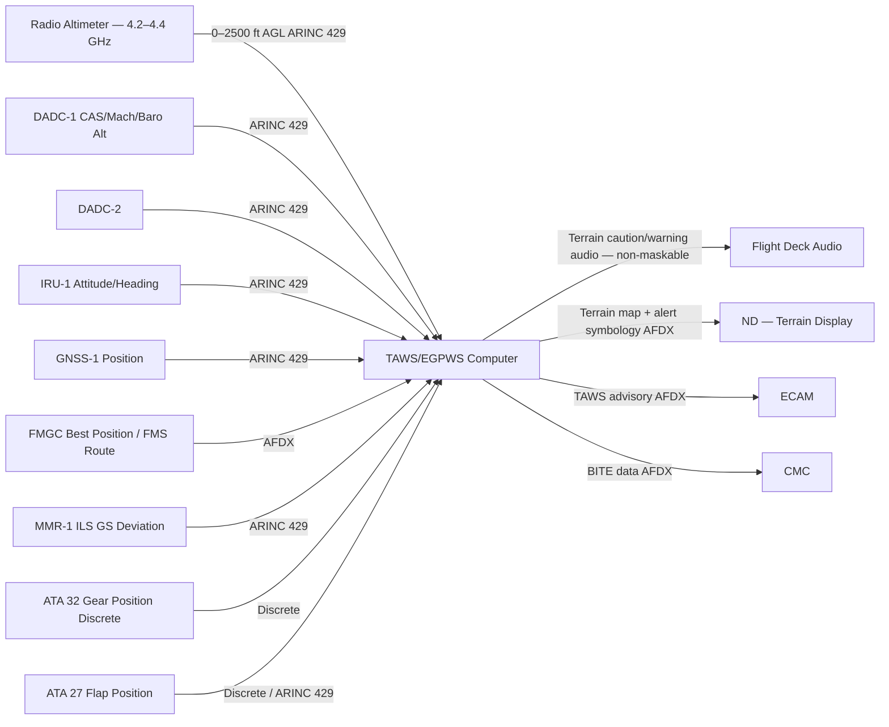
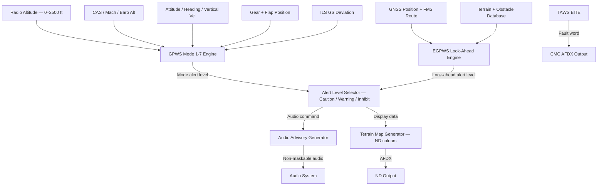
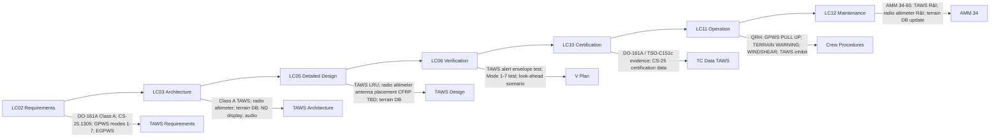

# 034-060 — Terrain Awareness and Proximity Warning
### AMPEL360e eWTW · ATA 34 · Q+ATLANTIDE ATLAS Scaffold

---

## §0 Hyperlink Policy

All internal links use relative paths from the current directory. External regulatory and standards references use anchor links in [§20 References](#20-references). Links marked **TBD** indicate unallocated targets. Programme-level links traverse five levels (`../../../../../`). No absolute URLs used for internal navigation.

---

## §1 Purpose

This document describes the Terrain Awareness and Proximity Warning subsystem (ATA 034-060) of the AMPEL360e eWTW aircraft. It covers the Class A TAWS (EGPWS), GPWS modes 1–7, predictive terrain alerting using the terrain/obstacle database, radio altimeter interface, reactive and predictive windshear alerting, and alert inhibit logic.

The eWTW is equipped with a Class A TAWS system per DO-161A rev C (TSO-C151c). The system includes all seven traditional GPWS modes plus Enhanced GPWS (EGPWS) functions: a look-ahead terrain/obstacle alerting function using a worldwide terrain database and the aircraft's GNSS/FMS position. The TAWS issues Caution (amber audio + amber ND display) and Warning (red audio + red ND display) alerts. The radio altimeter provides the 0–2500 ft above ground level (AGL) measurement critical for GPWS Mode 1–6 computations. Installation of the radio altimeter antennas on the composite CFRP fuselage is an open issue.

---

## §2 Applicability

| Attribute | Value |
|---|---|
| Programme | AMPEL360e Wide Tube-and-Wing (eWTW) |
| ATA Subsubject | 034-060 — Terrain Awareness and Proximity Warning |
| Aircraft Variant | eWTW-100 (baseline), eWTW-100ER |
| TAWS Class | Class A (full TAWS per DO-161A) |
| GPWS Modes | Modes 1–7 (all seven standard GPWS modes) |
| EGPWS | Predictive terrain look-ahead using worldwide terrain/obstacle DB |
| Terrain DB | Worldwide terrain and obstacle database — coverage TBD |
| Radio Altimeter | 0–2500 ft AGL; antenna positions TBD (CFRP fuselage) |
| Windshear | Reactive (Mode 7) + Predictive windshear TBD |
| Look-Ahead Range | 500 NM forward TBD |
| Qualification | TSO-C151c; DO-161A rev C |
| Output Bus | AFDX / ARINC 429 |
| S1000D Issue | 5.0 |
| SNS Reference | 034-60 |
| Applicability Code | ALL |
| Effectivity | From MSN 001 |

---

## §3 System / Function Overview

The Terrain Awareness and Warning System (TAWS) — also known as Enhanced Ground Proximity Warning System (EGPWS) — is a Class A system providing two complementary functions:

**1. Classic GPWS (Modes 1–7)**: Reactive terrain proximity alerting based on current flight parameters (radio altitude, barometric altitude rate, airspeed, gear position, flap position). These modes detect when the aircraft is in an unsafe proximity to terrain or approaching at an unsafe rate.

| Mode | Description | Alert |
|---|---|---|
| Mode 1 | Excessive descent rate | "SINK RATE" (caution) / "PULL UP" (warning) |
| Mode 2 | Excessive terrain closure rate | "TERRAIN" (caution) / "PULL UP" (warning) |
| Mode 3 | Altitude loss after takeoff or go-around | "DON'T SINK" (caution) |
| Mode 4 | Unsafe terrain clearance (not in landing config) | "TOO LOW TERRAIN" / "TOO LOW GEAR" / "TOO LOW FLAPS" |
| Mode 5 | Excessive descent below ILS glidepath | "GLIDESLOPE" (caution) |
| Mode 6 | Callouts — altitude below decision altitude | "MINIMUMS" / "CALLOUTS TBD" |
| Mode 7 | Reactive windshear detection | "WINDSHEAR" (warning) |

**2. Enhanced GPWS — Look-Ahead Terrain Alerting (EGPWS/TAWS Class A)**: Using the FMS/GNSS position and the onboard worldwide terrain and obstacle database, the TAWS system predicts future aircraft trajectory and checks for terrain penetration up to TBD seconds ahead. This provides early warning for CFIT (Controlled Flight Into Terrain) threats that the classic reactive GPWS modes cannot detect (e.g., shear terrain ahead at cruise level).

Two alert levels:
- **Terrain Caution (amber)**: Terrain within amber threshold ahead; audio "CAUTION TERRAIN" + amber ND terrain display; crew should begin obstacle/terrain avoidance.
- **Terrain Warning (red)**: Terrain within red threshold; audio "TERRAIN TERRAIN PULL UP" or "PULL UP"; crew must execute immediate maximum performance escape manoeuvre.

**Radio Altimeter**: The TAWS computer receives radio altitude (0–2500 ft AGL) from the radio altimeter system. Radio altitude is critical for GPWS Modes 1, 2, 3, 4, and 5. The radio altimeter transmits and receives a frequency-modulated CW signal from antennas on the fuselage underside. On the composite CFRP fuselage, antenna installation and performance (groundplane, RF reflection) are open issues.

**Windshear Alerting**: Mode 7 provides reactive windshear detection from airspeed rate and inertial acceleration. Predictive windshear (forward-looking) is TBD — potentially provided by the weather radar (034-070).

---

## §4 Scope

### 4.1 Included
- TAWS / EGPWS computer LRU (Class A — avionics bay)
- GPWS Modes 1–7 reactive alerting
- EGPWS predictive terrain look-ahead alerting (worldwide terrain/obstacle database)
- Radio altimeter system (transmitter/receiver LRU + antennas): 0–2500 ft AGL range
- Terrain and obstacle database (worldwide coverage TBD — AIRAC cycle update)
- Terrain display on ND (amber/red terrain colours; terrain clearance mode)
- Terrain Caution and Warning audio alerts (non-maskable)
- GPWS alert inhibit logic (gear down + flap approach — Mode 4/5 inhibit TBD)
- Windshear alert — reactive Mode 7; predictive TBD (weather radar interface)
- Interface with FMS terrain database (for database consistency)
- TAWS BITE and CMC fault reporting

### 4.2 Excluded
- Terrain database content and authoring — Q-DATAGOV / ATA 22 data management
- Weather radar predictive windshear function — 034-070
- FMS terrain-constrained routing — ATA 22
- Flight data recorder (FDR) GPWS event recording — ATA 31

---

## §5 Architecture Description

- **Class A TAWS**: Class A TAWS requires all seven GPWS modes plus the forward-looking terrain alerting function (EGPWS). Class B TAWS (no look-ahead) is not sufficient for CS-25 large transport aircraft. RTCA DO-161A rev C defines the Class A TAWS MOPS.
- **Terrain database**: The worldwide terrain and obstacle database is stored in the TAWS computer non-volatile memory. The terrain database is updated via the ARINC 615A data loader (same update cycle as the navigation database — AIRAC 28-day cycle or longer TBD). Database coverage: global terrain to TBD resolution (typically 30 arc-second or 100 m resolution worldwide; 3 arc-second in approach corridors TBD). Obstacle database: aviation obstacles (towers, cranes, wind turbines TBD) to a defined minimum height.
- **Radio altimeter**: Frequency-modulated continuous-wave (FMCW) radar, 4.2–4.4 GHz. The transmit antenna radiates downward; the receive antenna captures the reflected signal from the ground. Range is measured from the frequency difference (Doppler / FM ranging). Output: radio altitude (0–2500 ft) on ARINC 429. Two antennas (transmit and receive) are installed on the lower fuselage. The composite CFRP fuselage is transparent to the 4.3 GHz radio altimeter signal (CFRP is non-conductive) but local ground-plane effects and antenna mounting inserts require engineering assessment.
- **Alert inhibit logic**: GPWS Mode 4 (unsafe terrain clearance) and Mode 5 (glideslope) alerts are inhibited when the aircraft is in approach configuration (gear down + flaps in approach or landing setting). This prevents nuisance alerts during normal approaches. Mode 1 (excessive sink rate) is not inhibitable (except below TBD ft RA). Alert inhibit logic receives gear and flap position from ATA 32 and ATA 27 respectively.
- **Non-maskable audio**: TAWS audio alerts (PULL UP, TERRAIN, GLIDESLOPE, WINDSHEAR) are non-maskable — they cannot be silenced by crew volume controls. The priority of TAWS audio is the highest in the audio management system hierarchy.
- **Terrain display on ND**: The ND shows a colour-coded terrain elevation display relative to the aircraft altitude. Terrain colours: green (terrain significantly below aircraft), yellow/amber (terrain within caution range), red (terrain within warning range), magenta (terrain above aircraft). The crew can select terrain display on/off independently from TAWS alerting.

---

## §6 Functional Breakdown

| Function ID | Function Title | Description | LRU |
|---|---|---|---|
| F-060-001 | GPWS Mode 1 — Excessive Sink Rate | Monitor radio altitude and sink rate; alert if closure rate excessive | TAWS Computer |
| F-060-002 | GPWS Mode 2 — Terrain Closure Rate | Monitor terrain closure rate; alert if terrain approach rate excessive | TAWS Computer |
| F-060-003 | GPWS Mode 3 — Altitude Loss After T/O or G/A | Monitor altitude loss post-takeoff or go-around | TAWS Computer |
| F-060-004 | GPWS Mode 4 — Unsafe Terrain Clearance | Monitor gear/flap/speed vs. radio altitude; alert if config-speed-altitude unsafe | TAWS Computer |
| F-060-005 | GPWS Mode 5 — Excessive ILS Glideslope Descent | Monitor ILS GS deviation vs. radio altitude; alert if below glidepath | TAWS Computer |
| F-060-006 | GPWS Mode 6 — Altitude Callouts | Altitude-based audio callouts (minimums, altitude, etc.) | TAWS Computer |
| F-060-007 | GPWS Mode 7 — Reactive Windshear | Detect windshear from airspeed rate and inertial velocity; "WINDSHEAR" alert | TAWS Computer |
| F-060-008 | EGPWS Predictive Terrain Look-Ahead | Use FMS position + terrain DB to predict terrain penetration up to 500 NM ahead TBD | TAWS Computer |
| F-060-009 | Terrain Display on ND | Generate colour terrain map for ND display overlay | TAWS Computer |
| F-060-010 | Radio Altitude Measurement | FMCW radar measurement of height above ground (0–2500 ft) | Radio Altimeter |
| F-060-011 | Alert Inhibit Logic | Inhibit Mode 4/5 in approach config; Mode 6 callout management | TAWS Computer |
| F-060-012 | TAWS BITE and CMC Reporting | Self-monitoring; CMC fault reporting; terrain DB currency check | TAWS Computer |

---

## §7 System Context Diagram

---

## §8 Internal Functional Architecture

---

## §9 Lifecycle Traceability

---

## §10 Interfaces

| Interface ID | System / Chapter | Interface Type | Data / Signal | Direction | Status |
|---|---|---|---|---|---|
| IF-060-001 | ATA 34 Radio Altimeter | ARINC 429 | Radio altitude 0–2500 ft AGL; validity flag | RA → TAWS |  |
| IF-060-002 | ATA 34 DADC (034-010) | ARINC 429 | CAS, Mach, baro altitude, altitude rate | DADC → TAWS |  |
| IF-060-003 | ATA 34 IRU (034-020) | ARINC 429 | Attitude, heading, vertical velocity, angular rates | IRU → TAWS |  |
| IF-060-004 | ATA 34 GNSS (034-040) | ARINC 429 | GNSS position for EGPWS look-ahead | GNSS → TAWS |  |
| IF-060-005 | ATA 22 FMGC | AFDX | Best-estimate position; FMS route for look-ahead | FMGC → TAWS |  |
| IF-060-006 | ATA 34 MMR (034-030) | ARINC 429 | ILS Glideslope deviation for Mode 5 | MMR → TAWS |  |
| IF-060-007 | ATA 32 Landing Gear | Discrete | Gear position (up/down/in-transit) | ATA32 → TAWS |  |
| IF-060-008 | ATA 27 Flight Controls | Discrete / ARINC 429 | Flap position | ATA27 → TAWS |  |
| IF-060-009 | ATA 31 ND | AFDX | Terrain map display (amber/red) and alert symbology | TAWS → ND |  |
| IF-060-010 | ATA 23 Audio Management | Discrete / Audio | PULL UP / TERRAIN / GLIDESLOPE / WINDSHEAR audio (non-maskable) | TAWS → Audio |  |
| IF-060-011 | ATA 31 ECAM | AFDX | TAWS advisory (TAWS FAULT; terrain DB expired) | TAWS → ECAM |  |
| IF-060-012 | ATA 45 CMC | AFDX | TAWS BITE fault data; terrain DB currency status | TAWS → CMC |  |

---

## §11 Operating Modes

| Mode ID | Mode Name | Description | Entry Condition | Exit Condition |
|---|---|---|---|---|
| OM-060-001 | TAWS Normal — All Modes Active | All GPWS modes 1–7 and EGPWS look-ahead active; terrain display available on ND | Airborne; all inputs valid | TAWS fault or ground mode |
| OM-060-002 | TAWS Caution — Amber Alert Active | Terrain caution threshold exceeded; amber audio and ND display | EGPWS or Mode alert threshold (caution level) | Aircraft clears terrain threshold |
| OM-060-003 | TAWS Warning — Red Alert Active | Terrain warning threshold exceeded; PULL UP audio and ND red display | EGPWS or Mode alert threshold (warning level) | Aircraft clears terrain; PULL UP executed |
| OM-060-004 | GPWS Mode Inhibited | Mode 4/5 inhibited in approach configuration (gear+flap); reduces nuisance alerts on approach | Gear down AND flap in approach or landing setting | Gear/flap config changed |
| OM-060-005 | Windshear Alert Active | Mode 7 reactive windshear detected; WINDSHEAR audio | CAS rate + inertial deceleration exceeds windshear threshold | Aircraft clears windshear |
| OM-060-006 | Terrain DB Expired | Terrain database AIRAC cycle expired; TAWS alerting degraded (look-ahead unreliable) | Database expiry date exceeded | Database updated via ARINC 615A |
| OM-060-007 | TAWS Fault | TAWS computer inoperative; TAWS INOP advisory; all TAWS functions lost | TAWS BITE fault | TAWS computer replaced |
| OM-060-008 | Ground Maintenance Test | TAWS self-test; GPWS mode simulation; terrain display check | CMC maintenance mode | Test complete |

---

## §12 Monitoring and Diagnostics

- **TAWS BITE**: Continuous self-monitoring of all TAWS functions: mode computations, look-ahead engine, terrain database integrity, radio altimeter input validity, audio output path, ND display path. BITE fault words on AFDX to CMC.
- **Terrain database integrity check**: TAWS verifies the terrain database checksum at startup and periodically. A corrupted database generates a TAWS TERRAIN DB FAULT advisory and disables the look-ahead function (classic GPWS modes remain active).
- **Terrain database currency monitoring**: CMC monitors the terrain database expiry date. An expired database generates an ECAM NAV TERRAIN DB advisory. The TAWS look-ahead function continues operating with the expired database, but the crew is informed.
- **Radio altimeter monitoring**: TAWS monitors radio altitude input validity. Loss of radio altitude generates a RADIO ALT FAIL advisory and disables GPWS Modes 1, 2, 3, 4, and 5 (which are radio altitude-dependent). Only Mode 6 (callouts from baro altitude) and EGPWS look-ahead (from GNSS) continue operating.
- **Alert inhibit monitoring**: BITE monitors that alert inhibit logic is not permanently stuck (which would prevent GPWS alerting). An inhibit logic failure is logged by CMC.

---

## §13 Maintenance Concept

- **TAWS computer replacement**: Line maintenance. LRU in avionics bay. Post-replacement: TAWS self-test via CMC; terrain database load verification; radio altimeter interface check; audio path test.
- **Radio altimeter LRU replacement**: Line maintenance. Radio altimeter transceiver in avionics bay. Antenna disconnection (coaxial cables to fuselage underside antennas). Post-replacement: radio altimeter functional test (RF signal loop-back TBD; ground test using RA test set TBD).
- **Radio altimeter antenna replacement**: Access to fuselage underside. Composite CFRP fuselage antenna mount inspection post-replacement (delamination, seal integrity). Post-replacement: radio altimeter operational check.
- **Terrain database update**: AIRAC cycle or as required. ARINC 615A data load via CMC. Post-update: verify database effective date in TAWS; EGPWS test scenario if significant database update.
- **Windshear detection verification**: TAWS Mode 7 windshear detection can be verified on bench using air data simulator injecting windshear profile (CAS rate + inertial deceleration). Aircraft-level test: flight test in windshear conditions (TBD — may be evaluated via simulation/analysis only for certification).

---

## §14 S1000D / CSDB Mapping

### 14.1 SNS to DMC Mapping

| SNS Code | Subsubject Title | DMC Prefix | Info Codes Planned | DMRL Status |
|---|---|---|---|---|
| 034-60 | Terrain Awareness and Proximity Warning | DMC-AMPEL360E-EWTW-034-60 | 040, 300, 400, 520, 720 |  |

### 14.2 Recommended DM Set for 034-60

| Info Code | DM Title | Description |
|---|---|---|
| 040 | TAWS System Description | Class A TAWS, GPWS modes 1–7, EGPWS, radio altimeter |
| 300 | TAWS Procedures | PULL UP execution; terrain caution procedure; TAWS INOP; terrain DB expired |
| 400 | TAWS Inspection and Test | TAWS self-test; radio altimeter test; terrain display check; DB update |
| 520 | TAWS Fault Isolation | TAWS INOP; RA FAIL; terrain DB fault; alert inhibit fault |
| 720 | TAWS / Radio Altimeter R&I | TAWS computer R&I; radio altimeter R&I; RA antenna R&I |

---

## §15 Footprints

### 15.1 Physical Footprint
- TAWS/EGPWS computer: avionics bay — LRU envelope TBD; weight TBD kg
- Radio altimeter transceiver: avionics bay — LRU envelope TBD
- Radio altimeter transmit antenna: lower forward fuselage — position TBD (CFRP RF assessment required)
- Radio altimeter receive antenna: lower forward fuselage — position TBD (separation from transmit antenna TBD)

### 15.2 Electrical / Data Footprint
- TAWS computer power: 28 VDC essential bus; TBD W
- Radio altimeter power: 28 VDC essential bus; TBD W
- AFDX interfaces: terrain display to ND; advisory to ECAM; BITE to CMC
- ARINC 429 inputs: DADC ×2, IRU ×1 (minimum), GNSS ×1, MMR ×1, radio altimeter

### 15.3 Maintenance Footprint
- TAWS R&I: line maintenance; no special tooling
- Radio altimeter R&I: line maintenance; coax torque wrench required for antenna
- Terrain DB update: AIRAC cycle; ARINC 615A data loader; duration TBD minutes

### 15.4 Data Footprint
- TAWS BITE fault log: TBD entries in CMC
- GPWS alert event log: all caution/warning events with time and flight phase — retained per AMM / safety data programme
- Terrain DB update log: cycle, effective date — per AMM

---

## §16 Safety and Certification Considerations

| Requirement | Source | Description | Compliance Approach | Status |
|---|---|---|---|---|
| CS-25.1301 | EASA CS-25 | Equipment function and installation | TAWS qualification; DO-160G |  |
| CS-25.1309 | EASA CS-25 | System safety | TAWS failure analysis; DAL per DO-178C |  |
| DO-161A rev C | RTCA | MOPS for TAWS/GPWS — Class A | TAWS computer qualification; all modes; EGPWS look-ahead |  |
| TSO-C151c | FAA | TAWS TSO — Class A | TAWS TSO qualification |  |
| CS-25.1323 | EASA CS-25 | Airspeed (used in GPWS modes) | DADC airspeed accuracy referenced by TAWS |  |
| ICAO Annex 6 | ICAO | GPWS / TAWS carriage requirements for large commercial transport | Class A TAWS required for large jet aircraft |  |
| DO-178C | RTCA | Software DAL | TAWS software DAL — TBD (likely DAL A/B for warning functions) |  |
| DO-254 | RTCA | Hardware DAL | TAWS complex hardware DAL |  |
| DO-160G | RTCA | Environmental qualification | TAWS and radio altimeter environmental testing |  |

---

## §17 Verification and Validation

| V&V ID | Requirement | Method | Success Criterion | Status |
|---|---|---|---|---|
| VV-060-001 | TAWS alert envelope — DO-161A modes 1–7 | Alert envelope test (bench — scenario injection) | Correct caution / warning generated at all DO-161A test scenarios; no false alerts |  |
| VV-060-002 | EGPWS look-ahead terrain alerting | HIL simulation with terrain DB injection; CFIT scenario | Caution and warning generated at correct range ahead; terrain display correct |  |
| VV-060-003 | Radio altimeter accuracy | Ground calibration; compare RA vs. GPS altitude AGL | RA error < ±TBD ft at 0–2500 ft AGL |  |
| VV-060-004 | GPWS Mode 5 — ILS glideslope alert | Bench test: inject LOC/GS deviation below glidepath at low RA | GLIDESLOPE audio at correct RA/deviation combination |  |
| VV-060-005 | Alert inhibit logic | Bench test: inject Mode 4 scenario with gear/flap in approach config | Mode 4 inhibited in approach config; active when not in approach config |  |
| VV-060-006 | TAWS BITE fault detection | Bench: inject internal TAWS failures | All faults detected; TAWS INOP advisory; CMC fault log entry |  |
| VV-060-007 | Terrain DB currency monitoring | CMC test: set DB expiry to yesterday | ECAM NAV TERRAIN DB advisory generated |  |
| VV-060-008 | DO-160G — Environmental qualification | Full DO-160G test for TAWS computer and radio altimeter | Pass all applicable DO-160G categories |  |

---

## §18 Glossary

| Term | Definition |
|---|---|
| AGL | Above Ground Level — height of the aircraft above the terrain directly below; measured by radio altimeter |
| CFIT | Controlled Flight Into Terrain — an accident where an airworthy aircraft is inadvertently flown into terrain or obstacles while under crew control |
| EGPWS | Enhanced Ground Proximity Warning System — a GPWS with predictive look-ahead terrain alerting using terrain database and GNSS position |
| FMCW | Frequency-Modulated Continuous Wave — the radio altimeter waveform type; range is computed from the frequency difference between transmitted and received signals |
| GPWS | Ground Proximity Warning System — system providing audio/visual alerts for terrain proximity based on flight parameter monitoring (Modes 1–7) |
| RA | Radio Altimeter (or Radio Altitude) — a sensor measuring aircraft height above ground (0–2500 ft) using FMCW radar |
| TAWS | Terrain Awareness and Warning System — Class A TAWS per DO-161A includes GPWS Modes 1–7 plus EGPWS look-ahead terrain alerting |
| TERRAIN CAUTION | Amber-level TAWS alert; terrain within caution threshold; crew should commence terrain avoidance |
| TERRAIN WARNING | Red-level TAWS alert; audio "PULL UP / TERRAIN"; crew must execute immediate maximum performance escape |
| WINDSHEAR | A sudden change in wind speed and/or direction over a short horizontal or vertical distance; detected by GPWS Mode 7 and potentially weather radar (predictive) |

---

## §19 Citations

| Citation ID | Source | Title | Relevance |
|---|---|---|---|
| CIT-060-001 | RTCA | DO-161A rev C — MOPS for TAWS | Class A TAWS qualification standard |
| CIT-060-002 | FAA | TSO-C151c — TAWS Class A | TAWS TSO |
| CIT-060-003 | EASA | CS-25 §25.1301, §25.1309 | Certification basis |
| CIT-060-004 | ICAO | Annex 6 | GPWS carriage requirements |
| CIT-060-005 | RTCA | DO-178C | TAWS software DAL |
| CIT-060-006 | RTCA | DO-254 | TAWS hardware DAL |
| CIT-060-007 | RTCA | DO-160G | TAWS environmental qualification |
| CIT-060-008 | ASD-STAN | S1000D Issue 5.0 | CSDB mapping |

---

## §20 References

| Ref ID | Document | Title | Link |
|---|---|---|---|
| REF-060-001 | DO-161A rev C | MOPS for TAWS | [RTCA](https://www.rtca.org/) |
| REF-060-002 | TSO-C151c | TAWS Class A | [FAA TSO](#) |
| REF-060-003 | CS-25.1301 | Equipment Function and Installation | [EASA CS-25](#) |
| REF-060-004 | CS-25.1309 | Equipment Systems and Installations | [EASA CS-25](#) |
| REF-060-005 | DO-178C | Software Considerations | [RTCA](https://www.rtca.org/) |
| REF-060-006 | DO-254 | Design Assurance for Airborne Hardware | [RTCA](https://www.rtca.org/) |
| REF-060-007 | DO-160G | Environmental Conditions and Test Procedures | [RTCA](https://www.rtca.org/) |
| REF-060-008 | ICAO Annex 6 | Operation of Aircraft | [ICAO](https://www.icao.int/) |
| REF-060-009 | S1000D Issue 5.0 | International Specification for Technical Publications | [s1000d.org](https://s1000d.org/) |

---

## §21 Open Issues

| Issue ID | Description | Owner | Priority | Status |
|---|---|---|---|---|
| OI-060-001 | Radio altimeter antenna installation on CFRP fuselage — lower fuselage CFRP RF transparency at 4.3 GHz; groundplane effects; antenna mount insert design | Q-MECHANICS / Q-AIR | High |  |
| OI-060-002 | Predictive windshear — define whether predictive windshear is provided by weather radar (034-070) or by a standalone TAWS predictive windshear function; interface definition required | Q-AIR | Medium |  |
| OI-060-003 | Terrain DB look-ahead range — confirm 500 NM forward look-ahead target; resolution requirements for approach corridors; worldwide obstacle DB coverage TBD | Q-AIR / Q-DATAGOV | Medium |  |
| OI-060-004 | GPWS Mode 6 callout set — define specific altitude callout set for eWTW operations; align with airline customer preferences and regulatory requirements | Q-AIR / ORB-LEG | Low |  |
| OI-060-005 | Composite fuselage RF transparency for navigation antennas (cross-reference 034-000) | Q-MECHANICS / Q-AIR | High |  |
| OI-060-006 | MEMS vs. FOG IRS technology decision (cross-reference 034-020) | Q-AIR / ORB-PMO | High |  |
| OI-060-007 | GBAS fitment decision (cross-reference 034-040) | Q-AIR / ORB-PMO | Medium |  |
| OI-060-008 | Cat II / III ILS decision — impacts GPWS Mode 5 glideslope deviation threshold | Q-AIR / ORB-PMO | High |  |

---

## §22 Change Log

| Revision | Date | Author | Description |
|---|---|---|---|
| 0.1.0 | 2026-05-10 | Q+ATLANTIDE / Q-AIR | Initial full-template creation — all §0–§22 sections drafted; TBD items identified |
