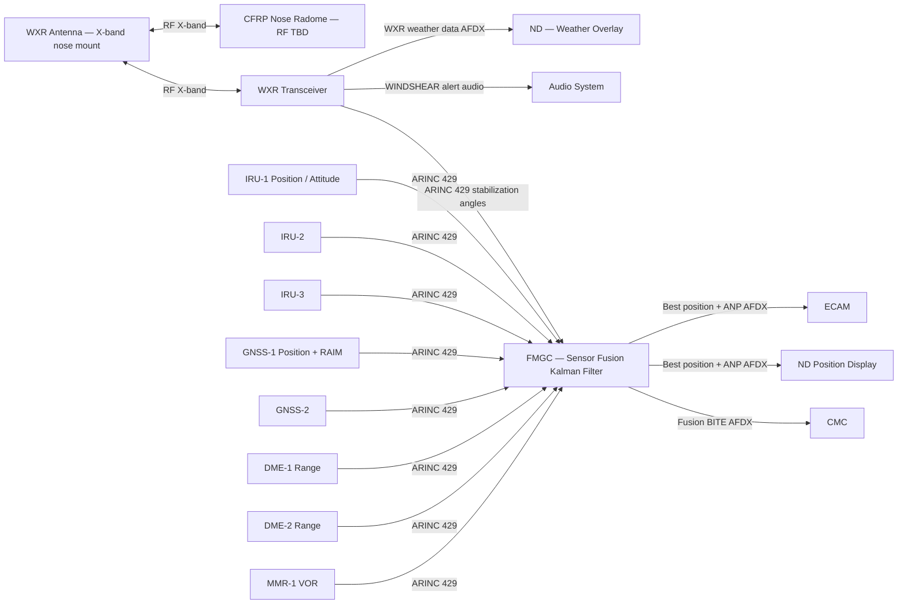
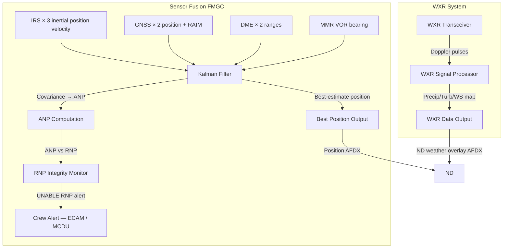
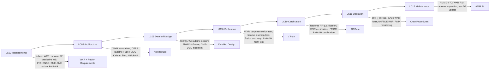

# 034-070 — Weather Radar and Navigation Sensor Fusion
### [PROGRAMME-AIRCRAFT] [PROGRAMME-VARIANT] · ATA 34 · Q+ATLANTIDE ATLAS Scaffold

---

## §0 Hyperlink Policy

All internal links use relative paths from the current directory. External regulatory and standards references use anchor links in [§20 References](#20-references). Links marked **TBD** indicate unallocated targets. Programme-level links traverse five levels (`../../../../../`). No absolute URLs used for internal navigation.

---

## §1 Purpose

This document defines the agnostic ATLAS standard-level architecture context for `034-070 — Weather Radar and Navigation Sensor Fusion`.

It describes the controlled scope, functions, interfaces, safety considerations, lifecycle traceability, and S1000D/CSDB mapping logic that programme implementations shall instantiate when this node is applicable.

This document is not a programme design baseline. Programme-specific capacities, locations, part numbers, effectivity, operating limits, maintenance references, and data module codes shall be defined only inside the applicable programme implementation branch.
## §2 Applicability

| Applicability Level | Rule |
|---|---|
| Standard taxonomy | Applies to the ATLAS node `<NODE>` |
| Programme implementation | Conditional; determined by programme architecture, trade studies, certification basis, and applicability model |
| Product configuration | Defined in the programme-specific configuration baseline |
| Effectivity | Defined in the programme CSDB / applicability layer |
| Non-applicability | Must be explicitly stated in the programme impact-study branch when excluded |
## §3 System / Function Overview

### Weather Radar

The weather radar system provides the crew with a forward-looking view of precipitation, turbulence, and windshear hazards. The X-band radar antenna is mounted in the nose, behind the CFRP nose radome. The antenna scans in azimuth (±90° TBD) and can be tilted in elevation by the crew (or automatically). The radar signal is attenuated by the radome material; CFRP has higher RF attenuation than fibreglass, making the radome design and RF performance a critical open issue.

**Key WXR functions**:
- **Precipitation mapping**: Detects rain, snow, hail at ranges up to 320 NM TBD. Intensity coded in ND overlay colours (black/green/yellow/amber/red/magenta per standard WXR colour convention).
- **Turbulence detection**: Doppler turbulence mode detects rapid droplet velocity fluctuations associated with severe turbulence (clear-air turbulence detection is NOT standard WXR capability; TBD).
- **Predictive windshear detection**: Forward-looking windshear alerting using Doppler signatures of low-altitude windshear (microburst downdrafts) at ranges up to TBD NM (typically 3 NM forward). Complements the reactive TAWS Mode 7 windshear detection (034-060).
- **Ground mapping**: Radar can switch to ground-mapping mode for situational awareness near terrain (not a primary navigation function).

### Navigation Sensor Fusion

The FMGC position computation system integrates multiple navigation sensor inputs using a Kalman filter architecture:

| Sensor | Contribution to Fusion |
|---|---|
| 3× IRS (IRU) | Inertial position, velocity, attitude (short-term accurate; long-term drifts) |
| 2× GNSS | Absolute position (long-term accurate; subject to integrity failure modes) |
| DME-DME ranging | Range from two or more DME stations (ρ-ρ position fix; good accuracy near high-density DME coverage) |
| VOR-DME ranging | VOR bearing + DME range (ρ-θ position fix; lower accuracy than DME-DME) |

The Kalman filter weights each sensor's contribution based on the estimated sensor accuracy, geometry, and data availability. The filter output is the **best-estimate position** used by the FMGC for flight plan tracking, PBN operations, and RNP computations.

**RNP / ANP output**: The fusion filter computes the Actual Navigation Performance (ANP) — an estimate of the 95th percentile position error. For RNP operations (including RNP-AR approach), the FMGC must demonstrate that the ANP is less than the Required Navigation Performance (RNP) value at all times. If ANP exceeds RNP, the FMGC declares an RNP integrity failure and alerts the crew.

**RAIM**: Receiver Autonomous Integrity Monitoring is performed in the GNSS receiver (034-040). The FMGC also performs flight-technical-error monitoring. The eventual integration of ARAIM (Advanced RAIM — supporting precision approach integrity using dual-constellation GNSS) is a TBD growth capability.

---

## §4 Scope

### 4.1 Included
- Weather radar transceiver LRU
- Weather radar antenna (±90° azimuth scan; tilt control TBD)
- CFRP nose radome — WXR RF performance interface (radome insertion loss TBD)
- WXR weather display overlay on ND (all modes: weather, turbulence, windshear)
- Predictive windshear alerting from WXR Doppler (audio alert and ND display)
- FMGC Kalman filter — IRS+GNSS+DME-DME+VOR-DME sensor fusion
- Actual Navigation Performance (ANP) computation
- RNP integrity monitoring (ANP vs. RNP threshold) — crew alert on RNP integrity failure
- RAIM interface from GNSS receivers (034-040) used as fusion input
- ARAIM growth accommodation (TBD — hardware/software provision)
- WXR BITE and CMC fault reporting
- Sensor fusion diagnostics and CMC reporting (sensor availability, filter health)

### 4.2 Excluded
- GNSS receiver RAIM computation — 034-040
- IRS inertial computation — 034-020
- DME ranging measurement — 034-030
- TAWS reactive windshear (Mode 7) — 034-060
- FMS route management and performance calculations — ATA 22
- Navigation database content — ATA 22 / Q-DATAGOV

---

## §5 Architecture Description

- **WXR radome interface**: The nose radome must be transparent to X-band (9.3–9.5 GHz). Traditional fibreglass radomes have excellent X-band RF transparency (insertion loss < 1 dB). CFRP (carbon fibre reinforced polymer) is conductive at RF frequencies and exhibits high X-band insertion loss. The [PROGRAMME-VARIANT] nose radome must therefore be manufactured from a non-conductive material (fibreglass, quartz, or hybrid CFRP/glass layup TBD) to achieve adequate WXR performance. This is a critical open issue.
- **WXR antenna stabilization**: The WXR antenna is gyro-stabilized (using attitude reference from IRS) to maintain horizontal scanning despite aircraft pitch and roll. Stabilization accuracy: TBD degrees.
- **Sensor fusion — architecture**: The FMGC hosts the Kalman filter position estimator. The filter is a multi-sensor blended navigation algorithm that ingests inertial, GNSS, and radio-navigation measurements and produces a fused position estimate with associated uncertainty (covariance) at the FMGC computation rate (TBD Hz). The filter uses known sensor error models (IRU drift, GNSS ionosphere TBD, DME transponder delay, VOR site bearing error) to weight the measurements optimally.
- **Sensor fusion — DME-DME**: When two or more DME stations are in range, the FMGC computes a DME-DME position fix using the time-distance geometry. DME-DME is the most accurate radio navigation positioning method in the absence of GNSS. The FMGC uses the navigation database (AIRAC) to identify available DME stations and compute geometry factors (GDOP TBD).
- **Sensor fusion — VOR-DME**: When a co-located VOR/DME is in range, the FMGC uses the VOR bearing and DME range to compute a VOR-DME position fix (lower accuracy than DME-DME due to VOR bearing error).
- **RNP integrity**: The FMGC continuously compares the ANP to the applicable RNP value. RNP values used: RNP 10 (oceanic); RNP 4 (oceanic/remote); RNP 2; RNP 1; RNP 0.3 (approach); RNP-AR (down to RNP 0.1 TBD). If ANP exceeds RNP, an UNABLE RNP alert is generated on ECAM and MCDU.

---

## §6 Functional Breakdown

| Function ID | Function Title | Description | Owner LRU |
|---|---|---|---|
| F-070-001 | Weather Radar — Precipitation Mapping | X-band pulse radar — precipitation detection and ND weather overlay | WXR Transceiver |
| F-070-002 | Weather Radar — Turbulence Detection | Doppler turbulence mode; intensity on ND | WXR Transceiver |
| F-070-003 | Predictive Windshear Alerting | Forward-looking Doppler windshear detection; WINDSHEAR audio/ND alert | WXR Transceiver |
| F-070-004 | WXR Antenna Stabilization | Gyro-stabilize WXR antenna using IRS attitude; maintain horizontal scan | WXR Antenna / FMGC |
| F-070-005 | WXR Display Output — ND Overlay | Weather / turbulence / windshear display on ND in colour convention | WXR → ADIRU / FMGC → ND |
| F-070-006 | Navigation Sensor Fusion — Kalman Filter | Fuse IRS+GNSS+DME-DME+VOR-DME using Kalman filter; produce best-estimate position | FMGC |
| F-070-007 | ANP / RNP Computation | Compute Actual Navigation Performance (ANP) from filter covariance; compare to RNP | FMGC |
| F-070-008 | RNP Integrity Monitoring | Alert crew when ANP > RNP threshold (UNABLE RNP); manage RNP-AR operations | FMGC |
| F-070-009 | DME-DME Position Fix | Compute position from ≥2 DME ranges using FMGC and navigation DB | FMGC |
| F-070-010 | VOR-DME Position Fix | Compute position from VOR bearing + DME range | FMGC |
| F-070-011 | ARAIM Growth Provision | Software/hardware hooks for future ARAIM capability (TBD) | FMGC |
| F-070-012 | WXR and Fusion BITE / CMC Reporting | WXR self-test; fusion filter health; CMC fault reporting | WXR / FMGC |

---

## §7 System Context Diagram

---

## §8 Internal Functional Architecture

---

## §9 Lifecycle Traceability

---

## §10 Interfaces

| Interface ID | System / Chapter | Interface Type | Data / Signal | Direction | Status |
|---|---|---|---|---|---|
| IF-070-001 | Nose Radome (ATA 53) | RF — X-band 9.3–9.5 GHz | WXR RF signal (transmit + receive) | Bi-directional |  |
| IF-070-002 | ATA 34 IRS ×3 (034-020) | ARINC 429 | Inertial position, velocity, attitude | IRU → FMGC |  |
| IF-070-003 | ATA 34 GNSS ×2 (034-040) | ARINC 429 | GNSS position, RAIM flag, figure of merit | GNSS → FMGC |  |
| IF-070-004 | ATA 34 DME ×2 (034-030) | ARINC 429 | DME range measurement | DME → FMGC |  |
| IF-070-005 | ATA 34 MMR VOR ×2 (034-030) | ARINC 429 | VOR bearing | MMR → FMGC |  |
| IF-070-006 | ATA 22 Navigation Database | Internal FMGC | AIRAC navigation DB (DME/VOR station coordinates, frequencies) | DB → FMGC |  |
| IF-070-007 | ATA 34 IRS attitude (034-020) | ARINC 429 | IRS attitude for WXR antenna stabilization | IRU → WXR |  |
| IF-070-008 | ATA 31 ND | AFDX | WXR weather overlay (precipitation/turb/WS) + best position | WXR+FMGC → ND |  |
| IF-070-009 | ATA 23 Audio | Discrete / Audio | WINDSHEAR audio alert (predictive) | WXR → Audio |  |
| IF-070-010 | ATA 31 ECAM | AFDX | UNABLE RNP; WXR fault; sensor fusion degraded | FMGC+WXR → ECAM |  |
| IF-070-011 | ATA 45 CMC | AFDX | WXR BITE; sensor fusion health; RAIM availability | FMGC+WXR → CMC |  |

---

## §11 Operating Modes

| Mode ID | Mode Name | Description | Entry Condition | Exit Condition |
|---|---|---|---|---|
| OM-070-001 | WXR — Weather Mode | Standard precipitation mapping and ND weather display | WXR on; crew selected WX mode | Crew mode change or WXR off |
| OM-070-002 | WXR — Turbulence Mode | Doppler turbulence detection overlaid on weather map | Crew selects TURB mode; or auto-turb TBD | Crew mode change |
| OM-070-003 | WXR — Windshear Alert Active | Predictive windshear detected; WINDSHEAR audio + ND alert | Forward-looking WS Doppler threshold exceeded | Aircraft clears windshear area |
| OM-070-004 | WXR — STBY / Off | WXR in standby (magnetron warming / no RF emission) or off | Ground operations; or crew selected off | Crew selects on |
| OM-070-005 | Fusion — GNSS+IRS+DME-DME | Full sensor fusion — all sensors available; best ANP | All sensors in range and valid | Sensor degradation |
| OM-070-006 | Fusion — IRS+DME-DME (GNSS unavailable) | GPS outage; fusion from IRS + DME-DME or VOR-DME | GNSS RAIM failure or signal loss | GNSS restored |
| OM-070-007 | Fusion — IRS+GNSS only | DME-DME not in range (oceanic); ANP higher | No DME in range; IRS+GNSS only | DME-DME back in range |
| OM-070-008 | Fusion — IRS only (Dead Reckoning) | All radio navigation lost; pure inertial dead reckoning | GNSS + DME-DME both unavailable | Radio navigation restored |
| OM-070-009 | RNP Integrity Failure — UNABLE RNP | ANP exceeds RNP threshold; UNABLE RNP advisory | ANP > RNP for current operation | ANP returns below RNP |

---

## §12 Monitoring and Diagnostics

- **WXR BITE**: Continuous internal monitoring of WXR transceiver (RF output power, receiver sensitivity, antenna drive, signal processor). BITE fault word to CMC via AFDX. WXR FAULT advisory on ECAM on transceiver failure.
- **WXR radome monitoring**: No active monitoring of radome insertion loss in flight (TBD — future radome health monitoring via embedded sensors). Ground-based radome inspection per AMM (water ingress, delamination) is the primary maintenance method.
- **Sensor fusion health monitoring**: FMGC monitors the Kalman filter innovation sequences (residuals). Anomalous residuals indicate sensor measurement errors; the filter can flag and exclude a misbehaving sensor (sensor validation / exclusion logic). CMC receives sensor fusion health data (which sensors active; filter divergence status; last position fix time per sensor).
- **RAIM monitoring**: GNSS RAIM status from each GNSS receiver is used as a filter input. If GNSS RAIM is flagged as failed by the GNSS receiver, the FMGC reduces the weight of that GNSS measurement or excludes it from the filter.
- **RNP monitoring**: Continuous comparison of ANP to RNP. The FMGC can predict future RNP availability (RAIM prediction function — TBD) to allow dispatch assessment of RNP operations.

---

## §13 Maintenance Concept

- **WXR transceiver replacement**: Line maintenance; avionics bay. Post-replacement: WXR self-test; ND weather display functional check; predictive windshear audio test TBD.
- **WXR antenna replacement**: Access to nose section. Antenna alignment check required post-replacement (azimuth boresight vs. aircraft centreline). Co-boresight alignment procedure: TBD (ground target or laser alignment TBD).
- **Nose radome inspection**: Periodic visual inspection for cracks, chips, erosion (erosion protection coating — TBD). ND/paint erosion may affect RF performance. Radio frequency inspection of radome insertion loss: TBD (ground RF test set or return-to-shop measurement).
- **FMGC replacement**: FMGC replacement is a line maintenance task (avionics bay). Post-replacement: FMGC initialisation (position entry, navigation DB verification); sensor fusion functional test; RNP prediction test via CMC.
- **Navigation database update**: AIRAC 28-day cycle via ARINC 615A. Includes DME/VOR station database used by FMGC fusion algorithm. Post-update: verify FMGC uses new database (effective date check); verify DME-DME available for departure airport as appropriate.

---

## §14 S1000D / CSDB Mapping

### 14.1 SNS to DMC Mapping

| SNS Code | Subsubject Title | DMC Prefix | Info Codes Planned | DMRL Status |
|---|---|---|---|---|
| 034-70 | Weather Radar and Navigation Sensor Fusion | DMC-<PROGRAMME>-<VARIANT>-034-70 | 040, 300, 400, 520, 720 |  |

### 14.2 Recommended DM Set for 034-70

| Info Code | DM Title | Description |
|---|---|---|
| 040 | WXR and Sensor Fusion System Description | WXR transceiver, radome, FMGC Kalman filter, ANP/RNP |
| 300 | WXR and Fusion Procedures | WXR on/off; WINDSHEAR response; UNABLE RNP procedure |
| 400 | WXR and Fusion Inspection and Test | WXR self-test; radome inspection; fusion health CMC page |
| 520 | WXR and Fusion Fault Isolation | WXR FAULT; UNABLE RNP; DME-DME unavailable; sensor exclusion |
| 720 | WXR and FMGC R&I | WXR transceiver R&I; antenna R&I; radome R&I |

---

## §15 Footprints

### 15.1 Physical Footprint
- WXR transceiver: avionics bay — LRU envelope TBD; weight TBD kg
- WXR antenna: nose section, forward of pressure bulkhead — antenna aperture TBD mm; weight TBD kg
- CFRP nose radome: nose section — material TBD (fibreglass / quartz / hybrid); weight TBD kg
- FMGC: avionics bay (also covers ATA 22 functions — weight counted in ATA 22)

### 15.2 Electrical / Data Footprint
- WXR transceiver power: 28 VDC essential bus TBD; high-power RF transmit during operation (TBD W RF; TBD W prime power)
- FMGC power: 28 VDC essential bus; TBD W
- AFDX interfaces: WXR weather data to ND; fusion position to ND+ECAM; BITE to CMC
- ARINC 429 inputs: IRU ×3; GNSS ×2; DME ×2; MMR VOR ×2

### 15.3 Maintenance Footprint
- WXR R&I: line maintenance; RF-transparent tooling required near antenna (no metallic tools in beam path during test)
- Radome inspection: per AMM; possible return-to-shop for RF loss measurement
- Nav DB update: AIRAC 28-day; ARINC 615A data loader; duration TBD minutes

### 15.4 Data Footprint
- WXR BITE fault log: TBD entries in CMC
- Sensor fusion log: sensor availability, ANP history per flight — CMC retained log
- RAIM prediction data: pre-flight dispatch data — TBD format

---

## §16 Safety and Certification Considerations

| Requirement | Source | Description | Compliance Approach | Status |
|---|---|---|---|---|
| CS-25.1301 | EASA CS-25 | Equipment function and installation | WXR and FMGC qualification; DO-160G |  |
| CS-25.1309 | EASA CS-25 | System safety | Fusion failure analysis; WXR DAL |  |
| AMC 20-28 | EASA | MOPS for RNAV / RNP | FMGC fusion and RNP compliance |  |
| AMC 20-4 | EASA | Acceptance of navigation systems in European airspace | VOR-DME, DME-DME navigation acceptance |  |
| DO-229 | RTCA | MOPS for GNSS airborne equipment | GNSS contribution to fusion |  |
| EUROCAE ED-75 / DO-236 | RTCA / EUROCAE | MOPS for RNAV | RNAV/RNP compliance |  |
| DO-178C | RTCA | Software DAL | FMGC fusion software DAL TBD |  |
| DO-254 | RTCA | Hardware DAL | FMGC complex hardware DAL |  |
| DO-160G | RTCA | Environmental qualification | WXR transceiver environmental testing |  |
| CS-25.1203 | EASA CS-25 | Weather radar requirements | WXR installation and qualification |  |

---

## §17 Verification and Validation

| V&V ID | Requirement | Method | Success Criterion | Status |
|---|---|---|---|---|
| VV-070-001 | WXR precipitation detection range | Ground-range test vs. weather cell of known range | Detection at ≥TBD NM; correct colour coding per intensity |  |
| VV-070-002 | WXR predictive windshear detection | Bench test: inject Doppler windshear signature; verify WINDSHEAR audio+ND alert | Alert generated at correct Doppler threshold |  |
| VV-070-003 | CFRP radome RF insertion loss | Ground RF measurement of radome (two-path attenuation) | Insertion loss ≤ TBD dB at X-band |  |
| VV-070-004 | Sensor fusion accuracy — DME-DME | HIL simulation with simulated DME range inputs; verify position error | Position error ≤ ANP at 95th percentile |  |
| VV-070-005 | ANP vs. RNP monitoring | HIL: degrade simulated sensor inputs to force ANP > RNP; verify UNABLE RNP alert | UNABLE RNP alert within TBD seconds; crew notified |  |
| VV-070-006 | Fusion — GNSS outage fallback | Disconnect simulated GNSS; verify DME-DME or IRS fallback | ANP remains below RNP at TBD level for TBD minutes after GNSS outage |  |
| VV-070-007 | WXR antenna stabilization | Flight test: WXR scan in turbulence; verify weather display stability | Weather display stable within TBD degrees through aircraft roll/pitch excursions |  |
| VV-070-008 | DO-160G WXR environmental | Full DO-160G test for WXR transceiver | Pass all applicable DO-160G categories |  |

---

## §18 Glossary

| Term | Definition |
|---|---|
| ANP | Actual Navigation Performance — the estimated 95th percentile position error as computed by the FMGC sensor fusion filter |
| ARAIM | Advanced Receiver Autonomous Integrity Monitoring — dual-constellation GNSS integrity monitoring for approach operations; TBD for [PROGRAMME-VARIANT] |
| CFRP | Carbon Fibre Reinforced Polymer — the composite material used extensively in [PROGRAMME-VARIANT] structure, including the nose radome TBD |
| DME-DME | Positioning using two or more DME ranges (ρ-ρ); typically the most accurate radio-navigation positioning method in high-density DME environments |
| FMGC | Flight Management and Guidance Computer — hosts the Kalman filter navigation sensor fusion algorithm for the [PROGRAMME-VARIANT] |
| Kalman Filter | A recursive state estimation algorithm that optimally fuses multiple sensor measurements with different error characteristics and noise models |
| Predictive Windshear | Forward-looking windshear detection using WXR Doppler signatures; provides alerting before aircraft enters the windshear region |
| RAIM | Receiver Autonomous Integrity Monitoring — GNSS receiver-based integrity method using redundant satellite geometry to detect position errors |
| RNP | Required Navigation Performance — a navigation specification that requires onboard performance monitoring and alerting (ANP ≤ RNP value) |
| RNP-AR | RNP Authorization Required — the most demanding RNP specification (curved approach paths; RNP as low as 0.1 NM) |
| VOR-DME | Positioning using VOR bearing and co-located DME range (ρ-θ); lower accuracy than DME-DME due to VOR bearing error |
| WXR | Weather Radar — an airborne X-band radar system for detecting precipitation, turbulence, and windshear |

---

## §19 Citations

| Citation ID | Source | Title | Relevance |
|---|---|---|---|
| CIT-070-001 | RTCA | DO-229 — MOPS for GNSS | GNSS fusion input |
| CIT-070-002 | EASA | AMC 20-28 | RNAV/RNP compliance |
| CIT-070-003 | EASA | AMC 20-4 | VOR-DME/DME-DME navigation acceptance |
| CIT-070-004 | RTCA | DO-236 | MOPS for RNAV |
| CIT-070-005 | EASA | CS-25 §25.1309 | System safety |
| CIT-070-006 | EASA | CS-25 §25.1203 | WXR requirements |
| CIT-070-007 | RTCA | DO-178C | Software DAL |
| CIT-070-008 | RTCA | DO-254 | Hardware DAL |
| CIT-070-009 | RTCA | DO-160G | Environmental qualification |
| CIT-070-010 | ASD-STAN | S1000D Issue 5.0 | CSDB mapping |

---

## §20 References

| Ref ID | Document | Title | Link |
|---|---|---|---|
| REF-070-001 | DO-229 | MOPS for GNSS Airborne Equipment | [RTCA](https://www.rtca.org/) |
| REF-070-002 | AMC 20-28 | MOPS for RNAV / RNP | [EASA](https://www.easa.europa.eu/) |
| REF-070-003 | AMC 20-4 | Navigation Systems in European Airspace | [EASA](https://www.easa.europa.eu/) |
| REF-070-004 | DO-236 | MOPS for RNAV | [RTCA](https://www.rtca.org/) |
| REF-070-005 | CS-25.1203 | Weather Radar — Aircraft Equipment | [EASA CS-25](#) |
| REF-070-006 | CS-25.1309 | Equipment Systems and Installations | [EASA CS-25](#) |
| REF-070-007 | DO-178C | Software Considerations | [RTCA](https://www.rtca.org/) |
| REF-070-008 | DO-254 | Design Assurance for Airborne Hardware | [RTCA](https://www.rtca.org/) |
| REF-070-009 | DO-160G | Environmental Conditions and Test Procedures | [RTCA](https://www.rtca.org/) |
| REF-070-010 | S1000D Issue 5.0 | International Specification for Technical Publications | [s1000d.org](https://s1000d.org/) |

---

## §21 Open Issues

| Issue ID | Description | Owner | Priority | Status |
|---|---|---|---|---|
| OI-070-001 | CFRP nose radome RF performance at X-band — insertion loss, attenuation, beam pattern distortion; radome material selection (fibreglass / quartz / CFRP hybrid TBD) | Q-MECHANICS / Q-AIR | Critical |  |
| OI-070-002 | Predictive windshear — define interface between WXR Doppler windshear and TAWS Mode 7 reactive windshear; dual alert management TBD | Q-AIR | High |  |
| OI-070-003 | ARAIM readiness — define ETA and architecture for ARAIM capability provision in FMGC software; link to GNSS L5 decision | Q-AIR / Q-HPC | Medium |  |
| OI-070-004 | GNSS L5 frequency decision — dual-frequency L1/L5 GNSS improves ionospheric correction; feeds ARAIM capability; affects FMGC fusion architecture | Q-AIR / ORB-PMO | High |  |
| OI-070-005 | MEMS vs. FOG IRS technology decision (cross-reference 034-020) — affects IRS error model used in Kalman filter; FOG and MEMS have different drift characteristics | Q-AIR / ORB-PMO | High |  |
| OI-070-006 | Composite fuselage RF transparency for navigation antennas (cross-reference 034-000) — CFRP radome is the primary WXR concern | Q-MECHANICS / Q-AIR | Critical |  |
| OI-070-007 | GBAS fitment decision (cross-reference 034-040) — GBAS position data could be integrated into fusion filter; impacts FMGC design TBD | Q-AIR / ORB-PMO | Medium |  |
| OI-070-008 | Cat II / III ILS decision — affects required ANP for CAT III approach; FMGC RNP-AR threshold for CAT III | Q-AIR / ORB-PMO | High |  |

---

## §22 Change Log

| Revision | Date | Author | Description |
|---|---|---|---|
| 0.1.0 | 2026-05-10 | Q+ATLANTIDE / Q-AIR | Initial full-template creation — all §0–§22 sections drafted; TBD items identified |
