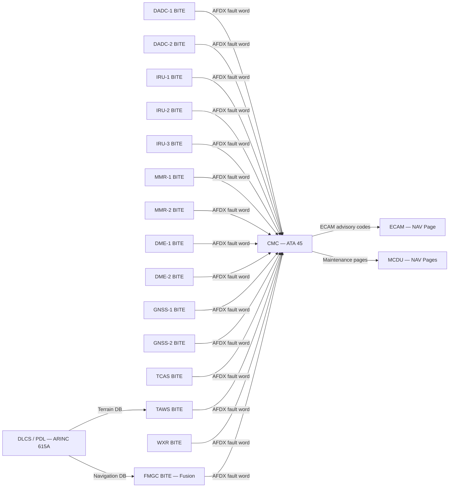
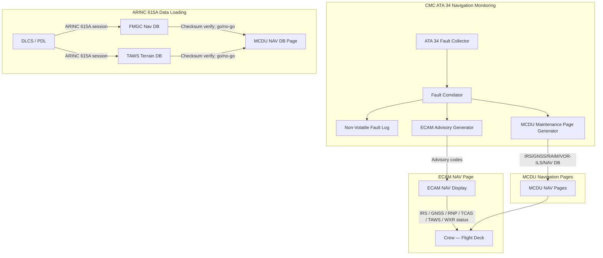

# 034-080 — Navigation Monitoring, Diagnostics and Control Interfaces
### AMPEL360e eWTW · ATA 34 · Q+ATLANTIDE ATLAS Scaffold

---

## §0 Hyperlink Policy

All internal links use relative paths from the current directory. External regulatory and standards references use anchor links in [§20 References](#20-references). Links marked **TBD** indicate unallocated targets. Programme-level links traverse five levels (`../../../../../`). No absolute URLs used for internal navigation.

---

## §1 Purpose

This document describes the Navigation System monitoring, diagnostics, and control interface subsystem (ATA 034-080) for the AMPEL360e eWTW aircraft. It covers:

1. **Centralized Maintenance Computer (CMC) / On-Board Maintenance System (OMS) integration**: All ATA 34 navigation LRUs report BITE fault data to the CMC. This section defines the consolidated CMC navigation fault reporting architecture, including IRU drift faults, DADC cross-compare faults, GNSS RAIM alerts, TCAS fault status, TAWS database currency, and WXR transceiver faults.

2. **ECAM Navigation Page and Crew Alerts**: The Electronic Centralized Aircraft Monitoring (ECAM) provides the crew with real-time navigation system status, cautions, and warnings. The navigation-specific ECAM page and the crew alert hierarchy for all ATA 34 abnormal conditions are defined here.

3. **MCDU Navigation Control Pages**: The Multipurpose Control and Display Unit (MCDU) provides crew access to IRS position displays, GNSS status, RAIM prediction, VOR/ILS tuning, and other navigation configuration functions. The MCDU page set for navigation monitoring is defined here.

4. **Ground Maintenance Test**: The ground-selectable navigation system test via CMC (including BITE self-test, DADC comparison test, IRS alignment confirmation, GNSS cold-start test, TCAS test, and TAWS scenario test).

5. **ARINC 615A Navigation Database Update**: The data loading process for the AIRAC navigation database (FMS, GNSS approaches, TAWS terrain database) via the ARINC 615A data loading protocol.

---

## §2 Applicability

| Attribute | Value |
|---|---|
| Programme | AMPEL360e Wide Tube-and-Wing (eWTW) |
| ATA Subsubject | 034-080 — Navigation Monitoring, Diagnostics and Control Interfaces |
| Aircraft Variant | eWTW-100 (baseline), eWTW-100ER |
| CMC / OMS | Centralized Maintenance Computer — ATA 45; OMS per DO-297 TBD |
| ECAM | Electronic Centralized Aircraft Monitoring — ATA 31 |
| MCDU | Multipurpose Control and Display Unit — ATA 22 / ATA 34 navigation pages |
| BITE Coverage | All ATA 34 LRUs: DADC ×2, IRU ×3, MMR ×2, DME ×2, GNSS ×2, TCAS, TAWS, WXR, FMGC |
| Data Loading | ARINC 615A — navigation DB, GNSS approach DB, TAWS terrain DB |
| AIRAC Cycle | 28-day standard; ±1 day tolerance per airline TBD |
| Databus | AFDX (ARINC 664 Pt 7); ARINC 429 |
| S1000D Issue | 5.0 |
| SNS Reference | 034-80 |
| Applicability Code | ALL |
| Effectivity | From MSN 001 |

---

## §3 System / Function Overview

### CMC / OMS Navigation Fault Reporting

All ATA 34 LRUs are connected to the CMC via AFDX. Each LRU transmits a standardised BITE fault word containing: LRU identity, fault code, fault class (warning / caution / advisory / status), fault time-stamp (GPS time or flight hour), flight phase, and fault persistence (transient / confirmed / latent). The CMC stores all fault messages in the non-volatile flight fault log.

**Key navigation fault categories reported to CMC**:
- **IRU drift fault**: An IRU that exceeds its position drift specification (TBD NM/hr) is flagged. The CMC logs the IRU identity, drift magnitude, and time-to-fault. Crew advisory: IRS FAULT.
- **DADC cross-compare fault**: The two DADCs continuously compare their CAS, Mach, baro altitude, and TAT outputs. A discrepancy exceeding the cross-compare threshold generates a DADC DISAGREE advisory and is logged in CMC.
- **GNSS RAIM alert**: If a GNSS receiver declares RAIM failure (integrity unavailable), the CMC logs the event with the GNSS constellation status (number of satellites, HDOP, VDOP) at time of failure.
- **TCAS fault**: TCAS II computer self-test failure; transponder failure; TCAS antenna failure. CMC fault log with TCAS FAIL advisory.
- **TAWS database currency**: CMC monitors the TAWS terrain database effective date. An expired database generates a NAV TERRAIN DB advisory.
- **WXR transceiver fault**: WXR BITE failure logged in CMC; WXR FAULT advisory on ECAM.

### ECAM Navigation Page

The ECAM Navigation page (accessible via the ECAM control panel — NAV page selection) provides:
- IRS status (three IRUs): mode (NAV / ATT / ALIGN / FAULT); position source indicator
- GNSS status: GNSS-1 / GNSS-2 status (AVAIL / RAIM FAIL / FAULT); satellite count
- Radio navigation status: VOR/ILS tuning (frequency; ident; deviation); DME range
- RNP/ANP: current ANP vs. required RNP; UNABLE RNP advisory
- TCAS status: mode (TA/RA or STBY); traffic count; TCAS fault flag
- TAWS status: armed/active; terrain DB status (current / expired); TAWS INOP
- WXR status: mode (WX / TURB / STBY / OFF); WXR FAULT flag

### MCDU Navigation Pages

| MCDU Page | Description | Access |
|---|---|---|
| IRS MONITOR | IRS-1/2/3 position, velocity, attitude; drift estimate; time since last GPS update | MCDU NAV → IRS MON |
| GNSS STATUS | GNSS-1/2 position, satellite count, HDOP/VDOP, RAIM status, figure of merit | MCDU NAV → GPS MONITOR |
| RAIM PREDICTION | RAIM availability prediction for planned route and destination (pre-departure dispatch tool) | MCDU NAV → RAIM PRED |
| VOR/ILS MONITOR | Manual VOR/ILS frequency selection; ident decode; deviation display | MCDU NAV → VOR/ILS |
| DME MONITOR | DME station list; auto-tuned or manual DME; range displayed | MCDU NAV → DME |
| TCAS STATUS | TCAS mode; traffic list; RA advisory history | MCDU SURV → TCAS |
| TAWS STATUS | TAWS armed/inhibited; terrain DB cycle and effective date; EGPWS mode | MCDU NAV → TAWS |
| WXR CONTROL | WXR mode (WX/TURB/GND MAP); tilt; range; gain | MCDU WXR |
| NAV DB UPDATE | Navigation database cycle; effective date; update status (ARINC 615A) | MCDU NAV → NAV DB |

### ARINC 615A Navigation Database Update

The navigation database update process uses the ARINC 615A data loading protocol over the AFDX network (or via a dedicated data loading connector on the avionics bay — TBD). The data loader (DLCS — Data Loading and Configuration System, or portable data loader — PDL TBD) initiates an ARINC 615A session with the FMGC and TAWS computer. The databases loaded include:
- FMGC navigation database (AIRAC cycle: airways, waypoints, airports, procedures, approaches, SIDs, STARs, VORs, NDBs, DMEs)
- TAWS terrain and obstacle database (worldwide terrain grid; obstacle database; AIRAC or fixed update cycle TBD)
- GNSS approach database (TBD — part of FMGC navigation DB or separate)

Post-update verification: The MCDU NAV DB page confirms the new database effective date. An automated checksum verification is performed by the FMGC and TAWS after data loading; a failed checksum rejects the database and retains the previous database (go / no-go status displayed on MCDU).

---

## §4 Scope

### 4.1 Included
- CMC ATA 34 navigation fault reporting architecture (all LRUs)
- DADC cross-compare fault detection and CMC reporting
- IRU drift monitoring and CMC reporting
- GNSS RAIM failure logging
- TCAS fault reporting
- TAWS terrain database currency monitoring
- WXR fault reporting
- ECAM Navigation page (content definition)
- MCDU navigation pages (IRS, GNSS, RAIM prediction, VOR/ILS, DME, TCAS, TAWS, WXR, NAV DB)
- Ground maintenance test procedure (CMC-initiated BITE; all ATA 34 LRUs)
- ARINC 615A navigation database update (FMGC nav DB; TAWS terrain DB)
- Data loading session management (checksum; go/no-go; version management)

### 4.2 Excluded
- CMC architecture and hardware — ATA 45
- ECAM hardware and display processing — ATA 31
- MCDU hardware and general FMGC function — ATA 22
- Navigation database content and AIRAC authoring — ATA 22 / Q-DATAGOV
- Individual LRU BITE design (each covered in respective 034-0x0 document)
- Airline operational customization of MCDU pages — TBD / airline option

---

## §5 Architecture Description

- **CMC architecture**: The CMC is the central repository for all maintenance data. ATA 34 LRUs transmit BITE fault words to the CMC over AFDX. The CMC aggregates, correlates, and archives fault data. The CMC generates the post-flight maintenance report listing all ATA 34 faults detected during the flight.
- **ECAM / CMC boundary**: The ECAM provides real-time crew-visible status (navigation normal / degraded / failed). The CMC provides maintenance-level diagnostic data (fault code; LRU identity; troubleshooting link). ECAM advisory codes link to CMC fault codes via a cross-reference table (TBD — CMC message catalog).
- **MCDU navigation pages**: The MCDU is the primary crew interface for navigation system configuration and monitoring (as opposed to ECAM which provides alerting). MCDU navigation pages allow the crew to monitor IRS alignment, verify GNSS status, check RAIM, and manage WXR settings.
- **ARINC 615A data loading**: ARINC 615A defines the protocol for aircraft data loading. The eWTW uses AFDX as the high-speed data loading network. An airline ground data loading system (GSE laptop or airline server via ACARS / ATSU TBD) connects to the aircraft ARINC 615A server (hosted in CMC or dedicated DLCS — TBD). Database loading is inhibited in flight (or restricted to non-essential databases TBD).
- **RAIM prediction**: The FMGC RAIM prediction function (MCDU RAIM PRED page) allows the crew or dispatcher to predict GNSS RAIM availability at the destination airport, at the expected arrival time, for the applicable approach procedure. RAIM prediction is a pre-flight dispatch tool required for certain GNSS-only approaches.

---

## §6 Functional Breakdown

| Function ID | Function Title | Description | Owner LRU |
|---|---|---|---|
| F-080-001 | CMC ATA 34 Fault Aggregation | Collect, correlate, archive all ATA 34 LRU BITE fault words | CMC (ATA 45) |
| F-080-002 | DADC Cross-Compare Monitoring | Compare DADC-1 vs. DADC-2 outputs; flag DADC DISAGREE | DADC / CMC |
| F-080-003 | IRU Drift Monitoring | Monitor IRU position drift vs. GNSS; flag excessive drift | FMGC / CMC |
| F-080-004 | GNSS RAIM Failure Logging | Log GNSS RAIM failure events in CMC; ECAM advisory | GNSS / CMC |
| F-080-005 | TCAS Fault Reporting | TCAS BITE fault word to CMC; TCAS FAIL advisory | TCAS / CMC |
| F-080-006 | TAWS Database Currency Monitor | Check TAWS terrain DB expiry vs. current date; CMC/ECAM advisory | TAWS / CMC |
| F-080-007 | WXR Fault Reporting | WXR BITE fault word to CMC; WXR FAULT advisory | WXR / CMC |
| F-080-008 | ECAM Navigation Page | Real-time display of ATA 34 status on ECAM NAV page | ECAM (ATA 31) |
| F-080-009 | MCDU IRS Monitor Page | IRS-1/2/3 position, drift, time since GPS update | MCDU / FMGC |
| F-080-010 | MCDU GNSS Status Page | GNSS-1/2 position, satellites, RAIM, FOM | MCDU / FMGC |
| F-080-011 | MCDU RAIM Prediction Page | Pre-departure RAIM prediction at destination for planned approach | MCDU / FMGC |
| F-080-012 | Ground Maintenance Test | CMC-initiated ATA 34 full system test (BITE + functional check) | CMC (ATA 45) |
| F-080-013 | ARINC 615A Nav DB Update — FMGC | FMGC navigation database update (AIRAC cycle) via ARINC 615A | FMGC / DLCS |
| F-080-014 | ARINC 615A Nav DB Update — TAWS | TAWS terrain and obstacle database update via ARINC 615A | TAWS / DLCS |

---

## §7 System Context Diagram



---

## §8 Internal Functional Architecture



---

## §9 Lifecycle Traceability

```mermaid
flowchart LR
    LC02[LC02 Requirements] --> LC03[LC03 Architecture]
    LC03 --> LC05[LC05 Detailed Design]
    LC05 --> LC06[LC06 Verification]
    LC06 --> LC10[LC10 Certification]
    LC10 --> LC11[LC11 Operation]
    LC11 --> LC12[LC12 Maintenance]
    LC02 -->|CMC nav monitoring; ECAM nav page; MCDU nav pages; ARINC 615A| REQ[Nav Monitoring Requirements]
    LC03 -->|CMC fault architecture; ECAM page spec; MCDU page set; ARINC 615A DB update| ARCH[Architecture]
    LC05 -->|CMC message catalog; ECAM message coding; MCDU page logic; ARINC 615A server| DESIGN[Detailed Design]
    LC06 -->|CMC fault injection test; ECAM advisory test; MCDU page function test; ARINC 615A DB load test| VPLAN[V Plan]
    LC10 -->|CMC certification (ATA 45); ECAM advisory certification; nav DB update qualification| TC[TC Data]
    LC11 -->|QRH: IRS FAULT; GNSS RAIM FAIL; TCAS FAIL; TAWS DB; UNABLE RNP; NAV DB update procedure| OPS[Crew Procedures]
    LC12 -->|AMM 34-80: CMC ATA 34 pages; BITE test; ARINC 615A DB update; nav system ground test| MAINT[AMM 34]
```

---

## §10 Interfaces

| Interface ID | System / Chapter | Interface Type | Data / Signal | Direction | Status |
|---|---|---|---|---|---|
| IF-080-001 | ATA 34 all LRUs → CMC | AFDX | BITE fault words (DADC, IRU, MMR, DME, GNSS, TCAS, TAWS, WXR, FMGC) | LRUs → CMC |  |
| IF-080-002 | CMC → ECAM (ATA 31) | AFDX | ECAM advisory codes for ATA 34 navigation faults | CMC → ECAM |  |
| IF-080-003 | CMC / FMGC → MCDU (ATA 22) | AFDX | MCDU navigation page data (IRS, GNSS, RAIM, VOR, TAWS, WXR, NAV DB) | FMGC+CMC → MCDU |  |
| IF-080-004 | DLCS / PDL → FMGC | ARINC 615A over AFDX | FMGC navigation database (AIRAC) | DLCS → FMGC |  |
| IF-080-005 | DLCS / PDL → TAWS | ARINC 615A over AFDX | TAWS terrain and obstacle database | DLCS → TAWS |  |
| IF-080-006 | DLCS external connector | Ethernet / AFDX ground port | External airline data loading ground system | Ground → DLCS |  |
| IF-080-007 | FMGC → MCDU | Internal FMGC | RAIM prediction results for destination approach | FMGC → MCDU |  |
| IF-080-008 | CMC → Airline Ground System | ACARS / ATSU TBD | Post-flight maintenance report (ATA 34 faults) | CMC → Ground |  |

---

## §11 Operating Modes

| Mode ID | Mode Name | Description | Entry Condition | Exit Condition |
|---|---|---|---|---|
| OM-080-001 | Normal Monitoring — All Systems OK | All ATA 34 LRUs healthy; ECAM NAV page green; no active advisories | All LRU BITE healthy | Any LRU fault |
| OM-080-002 | DADC Disagree — Cross-Compare Fault | DADC-1 vs. DADC-2 discrepancy exceeds threshold; ECAM AIR DATA DISAGREE advisory | DADC cross-compare threshold exceeded | DADC replaced or fault transient clears |
| OM-080-003 | IRS Fault | One or more IRUs failed; IRS FAULT advisory; navigation performance degraded | IRU BITE fault declared | IRU replaced |
| OM-080-004 | GNSS RAIM Failure — Navigation Degraded | GNSS RAIM flag raised; GNSS contribution excluded from fusion; UNABLE RNP possible | GNSS RAIM failure | RAIM restored; GNSS valid |
| OM-080-005 | TCAS Fail | TCAS computer / transponder fault; TCAS FAIL advisory; TCAS surveillance lost | TCAS BITE failure | TCAS replaced |
| OM-080-006 | TAWS Database Expired | Terrain database AIRAC cycle expired; NAV TERRAIN DB advisory; look-ahead function unreliable | DB effective date exceeded | DB updated via ARINC 615A |
| OM-080-007 | ARINC 615A DB Load In Progress | Navigation DB or terrain DB being loaded; aircraft on ground; loading inhibited in flight TBD | DLCS initiates ARINC 615A session | Load complete (go) or failed (no-go) |
| OM-080-008 | Ground Maintenance Test | CMC-initiated full ATA 34 BITE test; GPWS scenario test; TCAS self-test | CMC maintenance mode selection | Test complete |

---

## §12 Monitoring and Diagnostics

- **DADC cross-compare**: DADC-1 and DADC-2 continuously exchange their computed CAS, Mach, baro altitude, and TAT values. Any parameter divergence exceeding the cross-compare threshold (TBD per CS-25 guidance) for more than TBD seconds triggers an AIR DATA DISAGREE ECAM advisory and a CMC fault entry. The FMGC voter logic determines which DADC to use for navigation if one is suspect.
- **IRU drift monitoring**: The FMGC compares each IRU position to the best-estimate GNSS/fusion position. An IRU whose position diverges beyond the drift limit is flagged by CMC. The fault log records the IRU identity and drift magnitude.
- **CMC fault log retention**: All ATA 34 BITE faults are retained in CMC non-volatile memory for at least TBD flights (typically 64 or 128 flights per CMC capacity). Fault logs are exported to the airline OMS/MIS system via ACARS or ground download (ARINC 615A or Ethernet TBD).
- **BITE coverage matrix**: Each ATA 34 LRU has defined BITE fault categories: detected faults (no monitoring gap), undetected faults (safety analysis required), and latent faults (periodic functional check interval defined per MSG-3 analysis). The CMC maintenance coverage is assessed against the ATA 34 fault tree (per CS-25.1309 analysis).
- **Maintenance report generation**: At the end of each flight, the CMC generates a post-flight maintenance report (PFMR) listing all ATA 34 faults by ATA chapter, LRU, fault code, fault class (warning/caution/advisory), and on-condition maintenance action. The PFMR is transmitted to the airline maintenance control via ACARS (TBD).

---

## §13 Maintenance Concept

- **Ground maintenance test**: Via the CMC maintenance page (MCDU format or dedicated CMC display unit TBD), the technician can initiate a full ATA 34 ground test. The test sequence: (1) All LRU BITE self-test; (2) DADC cross-compare functional test (inject known values TBD or verify comparison logic); (3) IRS alignment check (verify all three IRUs aligned and position agreed); (4) GNSS functional test (cold start or RAIM check); (5) TCAS self-test (audio advisory + transponder interrogation simulation TBD); (6) TAWS self-test (GPWS audio — PULL UP, TERRAIN, GLIDESLOPE, WINDSHEAR — from test mode); (7) WXR BITE; (8) Terrain DB currency check.
- **ARINC 615A database update procedure**: (1) Aircraft on ground; (2) Connect DLCS or PDL to aircraft data loading port; (3) Initiate ARINC 615A session from DLCS; (4) Select target LRU (FMGC nav DB or TAWS terrain DB); (5) Transfer database file; (6) FMGC / TAWS perform checksum verification; (7) Go = new DB accepted, MCDU NAV DB page shows new effective date; (8) No-Go = load failed, previous DB retained, retry or return to shop; (9) Confirm new DB on MCDU before flight (dispatcher confirmation TBD).
- **Post-fault maintenance**: When a CMC fault is reported, the technician accesses the CMC ATA 34 fault summary page. The CMC links each fault to the AMM 34 fault isolation page (chapter reference and FIM procedure TBD). The AMM 34 FIM provides step-by-step fault isolation, LRU replacement, and functional test procedures.

---

## §14 S1000D / CSDB Mapping

### 14.1 SNS to DMC Mapping

| SNS Code | Subsubject Title | DMC Prefix | Info Codes Planned | DMRL Status |
|---|---|---|---|---|
| 034-80 | Navigation Monitoring, Diagnostics and Control Interfaces | DMC-AMPEL360E-EWTW-034-80 | 040, 300, 400, 520, 720 |  |

### 14.2 Recommended DM Set for 034-80

| Info Code | DM Title | Description |
|---|---|---|
| 040 | Navigation Monitoring System Description | CMC integration, ECAM NAV page, MCDU pages, ARINC 615A DB update architecture |
| 300 | Navigation Monitoring Procedures | IRS FAULT response; GNSS RAIM FAIL response; TCAS FAIL; TAWS DB update procedure |
| 400 | Navigation System Ground Maintenance Test | Full ATA 34 ground test via CMC; BITE test; DB currency check |
| 520 | Navigation Monitoring Fault Isolation | DADC DISAGREE; IRS FAULT; GNSS RAIM FAIL; TCAS FAIL; TAWS DB EXPIRED; UNABLE RNP |
| 720 | Navigation DB Update — ARINC 615A | FMGC nav DB load; TAWS terrain DB load; go/no-go; version management |

---

## §15 Footprints

### 15.1 Physical Footprint
- No dedicated ATA 34-80 hardware; functions distributed across CMC (ATA 45), ECAM (ATA 31), MCDU (ATA 22), and DLCS/PDL (TBD)
- DLCS ground connector: position on aircraft fuselage (avionics bay access panel) — TBD

### 15.2 Electrical / Data Footprint
- AFDX: CMC fault collection from all ATA 34 LRUs; ECAM advisory; MCDU page data
- ARINC 615A: data loading sessions over AFDX (high-speed transfer for terrain DB — TBD MB)
- CMC non-volatile memory: ATA 34 fault log size — TBD MB for TBD flights

### 15.3 Maintenance Footprint
- Ground maintenance test duration: TBD minutes (all ATA 34 LRUs sequential BITE)
- Nav DB update (FMGC): transfer time TBD minutes per AIRAC cycle
- TAWS terrain DB update: transfer time TBD minutes per update cycle (terrain DB size TBD GB)

### 15.4 Data Footprint
- CMC ATA 34 fault log: TBD faults per flight; TBD flights retained
- Post-flight maintenance report: PFMR format TBD (ATA MSG-3 / airline standard)
- AIRAC DB version tracking: maintained by CMC and MCDU; version history TBD cycles retained

---

## §16 Safety and Certification Considerations

| Requirement | Source | Description | Compliance Approach | Status |
|---|---|---|---|---|
| CS-25.1309 | EASA CS-25 | System safety — monitoring and BITE coverage | BITE coverage analysis; latent fault assessment per MSG-3 |  |
| AMC 25.1309 | EASA | Guidance on system safety assessment | CMC navigation monitoring coverage |  |
| DO-160G | RTCA | Environmental qualification | CMC qualification (ATA 45 — reference) |  |
| DO-178C | RTCA | Software DAL | FMGC navigation monitoring software; CMC software |  |
| ARINC 615A | ARINC | Data Loading Protocol | ARINC 615A compliance for navigation DB update |  |
| ARINC 664 Pt 7 | ARINC | AFDX network | AFDX for CMC fault collection; ARINC 615A over AFDX |  |
| MSG-3 | ATA / IATA | Maintenance programme analysis | Latent fault intervals for all ATA 34 monitoring functions |  |
| CS-ACNS | EASA | Communication, Navigation, Surveillance | ADS-B Out fault reporting via CMC |  |

---

## §17 Verification and Validation

| V&V ID | Requirement | Method | Success Criterion | Status |
|---|---|---|---|---|
| VV-080-001 | DADC cross-compare fault detection | Bench: inject DADC-1 vs. DADC-2 discrepancy exceeding threshold | DADC DISAGREE advisory generated; CMC fault logged within TBD seconds |  |
| VV-080-002 | IRU drift fault detection | HIL: inject IRU position drift exceeding limit | IRS FAULT advisory; CMC fault logged; IRU identity correct |  |
| VV-080-003 | GNSS RAIM failure logging | Bench: command GNSS receiver to declare RAIM failure | CMC GNSS RAIM FAIL entry; ECAM NAV GNSS advisory |  |
| VV-080-004 | TAWS DB currency check | CMC test: set TAWS terrain DB to expired | NAV TERRAIN DB advisory on ECAM; CMC log entry |  |
| VV-080-005 | ARINC 615A nav DB load — FMGC | Load a test AIRAC DB via ARINC 615A session | Database accepted (go); new effective date on MCDU NAV DB page |  |
| VV-080-006 | ARINC 615A — checksum failure | Inject a corrupted database file | Database rejected (no-go); previous DB retained; MCDU no-go message |  |
| VV-080-007 | MCDU RAIM prediction | MCDU: enter planned approach; verify RAIM prediction against known satellite geometry | RAIM prediction matches satellite geometry simulation; AVAIL or NOT AVAIL correct |  |
| VV-080-008 | Ground maintenance test — full ATA 34 | Execute CMC ground test on integrated rig | All LRU BITE pass; GPWS audio verified; TCAS self-test complete; DB check complete |  |

---

## §18 Glossary

| Term | Definition |
|---|---|
| AIRAC | Aeronautical Information Regulation and Control — the ICAO standardised system for regular update of aeronautical data; standard cycle is 28 days |
| ARINC 615A | An ARINC standard for the protocol used to load software and databases into airborne LRUs |
| BITE | Built-In Test Equipment — self-test logic within each LRU that detects, identifies, and reports internal faults |
| CMC | Centralized Maintenance Computer — the avionics system that collects, correlates, stores, and presents all LRU BITE fault data; ATA 45 |
| DADC | Digital Air Data Computer — computes CAS, Mach, baro altitude, TAT, SAT, AOA from pitot/static/temperature inputs |
| DLCS | Data Loading and Configuration System — the aircraft-resident ARINC 615A server and data loading infrastructure |
| ECAM | Electronic Centralized Aircraft Monitoring — the flight deck system that presents crew-relevant aircraft status, cautions, and warnings on upper ECAM and lower ECAM (or equivalent system displays) |
| FIM | Fault Isolation Manual — the maintenance documentation providing step-by-step LRU fault isolation procedures |
| MCDU | Multipurpose Control and Display Unit — the primary crew interface for FMS, navigation monitoring, and maintenance display access |
| PFMR | Post-Flight Maintenance Report — the CMC-generated summary of all LRU faults detected during a flight, transmitted to airline maintenance control |
| PDL | Portable Data Loader — a laptop-based ARINC 615A data loading device used by maintenance technicians at the aircraft |
| RAIM | Receiver Autonomous Integrity Monitoring — GNSS integrity checking using redundant satellite geometry |

---

## §19 Citations

| Citation ID | Source | Title | Relevance |
|---|---|---|---|
| CIT-080-001 | ARINC | ARINC 615A — Data Loading | Navigation DB update protocol |
| CIT-080-002 | ARINC | ARINC 664 Pt 7 — AFDX | AFDX for CMC fault collection |
| CIT-080-003 | EASA | CS-25 §25.1309 | System safety — monitoring coverage |
| CIT-080-004 | EASA | AMC 25.1309 | System safety guidance |
| CIT-080-005 | RTCA | DO-178C | Software DAL |
| CIT-080-006 | ATA / IATA | MSG-3 | Maintenance programme analysis |
| CIT-080-007 | EASA | CS-ACNS | CNS requirements |
| CIT-080-008 | ASD-STAN | S1000D Issue 5.0 | CSDB mapping |

---

## §20 References

| Ref ID | Document | Title | Link |
|---|---|---|---|
| REF-080-001 | ARINC 615A | Data Loading | [ARINC](https://www.aviation-ia.com/) |
| REF-080-002 | ARINC 664 Pt 7 | AFDX Network Standard | [ARINC](https://www.aviation-ia.com/) |
| REF-080-003 | CS-25.1309 | Equipment Systems and Installations | [EASA CS-25](#) |
| REF-080-004 | AMC 25.1309 | System Safety Assessment | [EASA](#) |
| REF-080-005 | DO-178C | Software Considerations | [RTCA](https://www.rtca.org/) |
| REF-080-006 | MSG-3 | Maintenance Programme Analysis | [ATA](#) |
| REF-080-007 | CS-ACNS | Airborne Communication Navigation Surveillance | [EASA](#) |
| REF-080-008 | S1000D Issue 5.0 | International Specification for Technical Publications | [s1000d.org](https://s1000d.org/) |

---

## §21 Open Issues

| Issue ID | Description | Owner | Priority | Status |
|---|---|---|---|---|
| OI-080-001 | DLCS architecture — define whether a dedicated DLCS LRU is used or ARINC 615A is hosted in the CMC; ground connector position on aircraft | Q-AIR / ATA 45 | High |  |
| OI-080-002 | TAWS terrain DB size and update time — worldwide terrain DB at full coverage is TBD GB; ARINC 615A transfer time over AFDX vs. dedicated ground connector; airline turn-around time impact | Q-AIR / Q-DATAGOV | Medium |  |
| OI-080-003 | RAIM prediction accuracy and tool qualification — FMGC RAIM prediction must be qualified against actual satellite availability within TBD tolerance; software qualification TBD | Q-AIR | Medium |  |
| OI-080-004 | CMC message catalog — full ATA 34 ECAM message coding and CMC-to-AMM cross-reference to be defined; alignment with ECAM design team (ATA 31) | Q-AIR / ATA 31 | High |  |
| OI-080-005 | Composite fuselage RF transparency for navigation antennas (cross-reference 034-000) | Q-MECHANICS / Q-AIR | High |  |
| OI-080-006 | MEMS vs. FOG IRS technology decision (cross-reference 034-020) — affects IRU drift monitoring thresholds used in CMC | Q-AIR / ORB-PMO | High |  |
| OI-080-007 | GBAS fitment decision (cross-reference 034-040) — would add GBAS DB to ARINC 615A update scope | Q-AIR / ORB-PMO | Medium |  |
| OI-080-008 | ADS-B In fitment decision (cross-reference 034-050) — would add ADS-B In status to ECAM NAV page and CMC monitoring | Q-AIR / ORB-PMO | Medium |  |

---

## §22 Change Log

| Revision | Date | Author | Description |
|---|---|---|---|
| 0.1.0 | 2026-05-10 | Q+ATLANTIDE / Q-AIR | Initial full-template creation — all §0–§22 sections drafted; TBD items identified |
