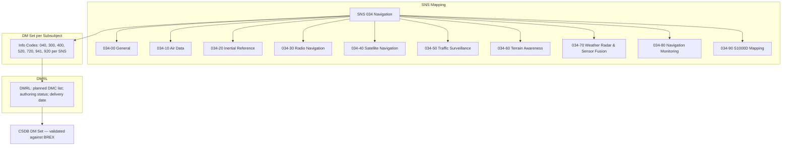
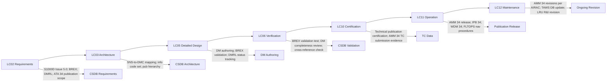

# 034-090 — S1000D CSDB Mapping and Traceability
### [PROGRAMME-AIRCRAFT] [PROGRAMME-VARIANT] · ATA 34 · Q+ATLANTIDE ATLAS Scaffold

---

## §0 Hyperlink Policy

All internal links use relative paths from the current directory. External regulatory and standards references use anchor links in [§20 References](#20-references). Links marked **TBD** indicate unallocated targets. Programme-level links traverse five levels (`../../../../../`). No absolute URLs used for internal navigation.

---

## §1 Purpose

This document defines the agnostic ATLAS standard-level architecture context for `034-090 — S1000D CSDB Mapping and Traceability`.

It describes the controlled scope, functions, interfaces, safety considerations, lifecycle traceability, and S1000D/CSDB mapping logic that programme implementations shall instantiate when this node is applicable.

This document is not a programme design baseline. Programme-specific capacities, locations, part numbers, effectivity, operating limits, maintenance references, and data module codes shall be defined only inside the applicable programme implementation branch.

## §2 Applicability

| Applicability Level | Rule |
|---|---|
| Standard taxonomy | Applies to the ATLAS node `<NODE>` |
| Programme implementation | Conditional; determined by programme architecture, trade studies, certification basis, and applicability model |
| Product configuration | Defined in the programme-specific configuration baseline |
| Effectivity | Defined in the programme CSDB / applicability layer |
| Non-applicability | Must be explicitly stated in the programme impact-study branch when excluded |

## §3 System / Function Overview

### S1000D CSDB Architecture for ATA 34

The S1000D CSDB for the [PROGRAMME-VARIANT] ATA 34 Navigation chapter comprises a set of Data Modules (DMs) that collectively describe and support all navigation subsystems. Each DM has a unique Data Module Code (DMC) that encodes the system address (ATA 34), the subsubject, the data type (info code), and the item location.

**CSDB structure for ATA 34**:
```
ATA 34 Navigation (SNS 034-00 through 034-90)
├── 034-00  Navigation — General              (DMC-<PROGRAMME>-<VARIANT>-034-00-...)
├── 034-10  Air Data                          (DMC-<PROGRAMME>-<VARIANT>-034-10-...)
├── 034-20  Inertial Reference                (DMC-<PROGRAMME>-<VARIANT>-034-20-...)
├── 034-30  Radio Navigation                  (DMC-<PROGRAMME>-<VARIANT>-034-30-...)
├── 034-40  Satellite Navigation              (DMC-<PROGRAMME>-<VARIANT>-034-40-...)
├── 034-50  Traffic Surveillance              (DMC-<PROGRAMME>-<VARIANT>-034-50-...)
├── 034-60  Terrain Awareness                 (DMC-<PROGRAMME>-<VARIANT>-034-60-...)
├── 034-70  Weather Radar & Sensor Fusion     (DMC-<PROGRAMME>-<VARIANT>-034-70-...)
├── 034-80  Navigation Monitoring             (DMC-<PROGRAMME>-<VARIANT>-034-80-...)
└── 034-90  S1000D CSDB Mapping              (DMC-<PROGRAMME>-<VARIANT>-034-90-...)
```

**BREX (Business Rules Exchange)**: The BREX document ([PROGRAMME-VARIANT]-BREX-034-001 TBD) defines programme-specific rules for the ATA 34 CSDB: allowed info codes, mandatory metadata fields, prohibited markup, applicability annotation conventions, and cross-reference rules. All ATA 34 DMs must validate against the [PROGRAMME-VARIANT] BREX before publication.

**DMRL (Data Module Requirements List)**: The DMRL is the master list of all planned DMs for the ATA 34 CSDB. It tracks: DMC (planned); DM title; information type; authoring status (not started / in work / review / approved); applicability code; planned delivery date. The DMRL is the configuration management tool for the technical publication deliverables.

---

## §4 Scope

### 4.1 Included
- Comprehensive SNS-to-DMC mapping for all ten ATA 34 subsubjects (034-00 to 034-90)
- DMRL planning status for all subsubjects
- Recommended DM set (info codes 040, 300, 400, 520, 720, 941 and others) per subsubject
- BREX constraints for ATA 34 CSDB (summary — full BREX is a separate CSDB document)
- ARINC 615A navigation database update procedures (cross-reference to 034-080)
- ATA 34 publication hierarchy (AMM, CMM, IPB, WDM, flight manual, operations manual)
- CSDB applicability management (variant coding: [PROGRAMME-VARIANT]-100 vs. [PROGRAMME-VARIANT]-100ER)
- DMRL status tracking conventions

### 4.2 Excluded
- Full BREX document content — separate CSDB BREX DM ([PROGRAMME-VARIANT]-BREX-034-001)
- Navigation database content — ATA 22 / Q-DATAGOV
- S1000D DM authoring (XML markup) — performed in CSDB authoring tools
- Publication compilation (Interactive Electronic Technical Manual — IETM TBD) — separate programme activity
- Individual LRU Component Maintenance Manuals (CMM) — supplier deliverables

---

## §5 Architecture Description

### S1000D Data Module Code Structure for [PROGRAMME-VARIANT] ATA 34

The [PROGRAMME-VARIANT] DMC format for ATA 34 navigation DMs is:

```
DMC-<PROGRAMME>-<VARIANT>-034-{SS}-{SSS}-{AC}-{DC}{DCV}-{IC}{ICV}-{ILC}

Where:
  [PROGRAMME-AIRCRAFT]      = Model Identifier Code
  [PROGRAMME-VARIANT]           = System Differentiator Code
  034            = ATA Chapter (Navigation)
  {SS}           = Sub-System Code (00, 10, 20, 30, 40, 50, 60, 70, 80, 90)
  {SSS}          = Sub-Sub-System Code (default 00 unless further breakdown required)
  {AC}           = Assembly Code (default 00)
  {DC}{DCV}      = Disassembly Code and Variant (default 00A)
  {IC}{ICV}      = Information Code and Variant (e.g., 040A, 300A, 400A)
  {ILC}          = Item Location Code (A = airborne, D = ground)
```

**Example**: `DMC-<PROGRAMME>-<VARIANT>-034-10-00-00-00A-040A-A` = Air Data System Description DM for [PROGRAMME-VARIANT].

### Information Code Coverage for ATA 34

| Info Code | Information Type | Description | Typical ATA 34 Application |
|---|---|---|---|
| 040 | Description | System description and operation | All subsubjects — primary system description DM |
| 041 | Description variant | Supplementary system description | As required |
| 300 | Procedure — Crew | Normal and abnormal procedures for crew | All subsubjects — crew procedures |
| 301 | Procedure — Crew variant | Supplementary crew procedure | TCAS RA procedures; TAWS PULL UP |
| 400 | Inspection / Check | Functional check and inspection procedures | All subsubjects — functional test and inspection |
| 401 | Inspection / Check variant | Supplementary inspection | As required |
| 520 | Fault Isolation | Fault isolation and troubleshooting | All subsubjects — AMM FIM chapter |
| 720 | Remove and Install | LRU R&I procedures | All subsubjects — AMM R&I chapter |
| 941 | Parts List | Illustrated Parts Catalogue reference | All subsubjects — IPB chapter |
| 920 | Wiring Diagram | Wiring and interconnect diagram | As required per LRU |

---

## §6 Functional Breakdown

| Function ID | Function Title | Description | Owner |
|---|---|---|---|
| F-090-001 | CSDB SNS-to-DMC Mapping — All Subsubjects | Define DMC for every planned DM across 034-00 to 034-80 | Q-DATAGOV / Q-AIR |
| F-090-002 | DMRL Planning and Status Tracking | Maintain the DMRL for all ATA 34 DMs; authoring status; delivery dates | Q-DATAGOV |
| F-090-003 | BREX Definition — ATA 34 | Define programme BREX rules for ATA 34 DM set | Q-DATAGOV / Q-AIR |
| F-090-004 | Applicability Management — Variant Coding | Manage [PROGRAMME-VARIANT]-100 vs. [PROGRAMME-VARIANT]-100ER applicability codes across all ATA 34 DMs | Q-DATAGOV |
| F-090-005 | ARINC 615A DB Update — Procedure Documentation | Documenting FMGC nav DB update and TAWS terrain DB update as S1000D DMs | Q-DATAGOV / Q-AIR |
| F-090-006 | Publication Hierarchy Definition | Define AMM / CMM / IPB / WDM structure for ATA 34 | Q-DATAGOV |
| F-090-007 | CSDB Validation — BREX Check | Validate all ATA 34 DMs against [PROGRAMME-VARIANT] BREX before publication | Q-DATAGOV |

---

## §7 System Context Diagram

```mermaid
flowchart LR
    ATLAS034[Q+ATLANTIDE ATLAS 034 Navigation — 10 Markdown Scaffold Files] -->|SNS mapping| CSDB[S1000D CSDB — ATA 34 DM Set]
    CSDB --> AMM34[AMM Chapter 34]
    CSDB --> CMM34[CMM — LRU Component Manuals]
    CSDB --> IPB34[IPB — Illustrated Parts Catalogue]
    CSDB --> WDM34[WDM — Wiring Diagram Manual]
    CSDB --> FLTOPS34[Flight Operations Manual — Nav Procedures]
    BREX[[PROGRAMME-VARIANT] BREX-034-001] -->|Business Rules Validation| CSDB
    DMRL[DMRL — ATA 34 DM List] -->|Authoring Control| CSDB
    AIRAC[AIRAC Navigation DB] -->|ARINC 615A| FMGC[FMGC Nav DB]
    AIRAC -->|ARINC 615A| TAWS[TAWS Terrain DB]
    CSDB -->|IETM TBD| IETM[Interactive Electronic Technical Manual]
```

---

## §8 Internal Functional Architecture



---

## §9 Lifecycle Traceability



---

## §10 Interfaces

| Interface ID | System / Chapter | Interface Type | Data / Signal | Direction | Status |
|---|---|---|---|---|---|
| IF-090-001 | ATA 22 FMGC / Navigation DB | Publication | FMS navigation procedure documentation; AIRAC data | ATA 22 → CSDB |  |
| IF-090-002 | ATA 31 ECAM / CMC Displays | Publication | ECAM navigation message catalogue | ATA 31+45 → CSDB |  |
| IF-090-003 | ATA 45 CMC | Publication | CMC maintenance page documentation; fault code cross-reference | ATA 45 → CSDB |  |
| IF-090-004 | ARINC 615A Nav DB Update | Publication | AMM data loading procedure | CSDB → AMM 34 |  |
| IF-090-005 | Supplier CMM (LRU vendors) | Publication | Vendor-supplied Component Maintenance Manuals; integration into IPB | Vendors → CSDB |  |
| IF-090-006 | BREX Document | CSDB rule set | Programme BREX for all [PROGRAMME-VARIANT] DMs | BREX → CSDB |  |
| IF-090-007 | IETM platform (TBD) | Digital publication | CSDB DM set compiled into IETM for airline MRO | CSDB → IETM |  |

---

## §11 Operating Modes

| Mode ID | Mode Name | Description | Entry Condition | Exit Condition |
|---|---|---|---|---|
| OM-090-001 | DMRL — Draft | All ATA 34 DMs in planning / draft status; DMRL not frozen | Initial programme phase | DMRL freeze at CDR TBD |
| OM-090-002 | DMRL — Frozen | DMRL approved; all planned DMs have fixed DMC; authoring in progress | CDR / DMRL approval | Revision post-CDR |
| OM-090-003 | DM Authoring — In Work | Individual DMs being authored in CSDB authoring tool | Author allocation | DM review submission |
| OM-090-004 | DM Review | DM submitted for technical review; BREX validation pending | Author submits DM | Review complete; DM approved or returned |
| OM-090-005 | DM Approved | DM approved; BREX validated; in CSDB baseline | Review complete | Publication or revision trigger |
| OM-090-006 | AIRAC Publication Update | AMM ARINC 615A DB update section revised for new AIRAC DB content | AIRAC cycle change | Revision published |

---

## §12 Monitoring and Diagnostics

- **DMRL status dashboard**: Q-DATAGOV maintains a DMRL status dashboard tracking authoring progress for all ATA 34 DMs. Metrics: number of DMs planned, in work, in review, approved, total CSDB baseline size. Progress is reported at programme milestones (PDR, CDR, First Flight readiness).
- **BREX validation**: All DMs are validated against the [PROGRAMME-VARIANT] BREX (TBD) prior to inclusion in the CSDB baseline. BREX validation is automated in the CSDB authoring tool. Validation failures are reported to the DM author for correction.
- **Cross-reference integrity**: Internal CSDB cross-references (applicRefs, dmRef links between DMs) are checked for broken references after any DMRL revision. The CSDB tool performs automatic cross-reference integrity checking.
- **Effectivity coverage**: All DMs are tagged with applicability codes ([PROGRAMME-VARIANT]-100 and/or [PROGRAMME-VARIANT]-100ER). Coverage analysis ensures all aircraft variants have complete DM coverage.

---

## §13 Maintenance Concept

- **DMRL revision process**: DMRL revisions are controlled by Q-DATAGOV. Changes to the ATA 34 DM set (adding, removing, or retitling DMs) require a DMRL change notice (DCN TBD). All DCNs are tracked in the programme change management system.
- **AMM ATA 34 revision cycle**: After initial TC release, the AMM ATA 34 chapter is revised on a cycle defined by the airline customer requirements and regulatory feedback. AIRAC-driven revisions (navigation database update procedure) may require bi-monthly or monthly updates TBD.
- **TAWS terrain DB update documentation**: The ARINC 615A TAWS terrain DB update procedure (AMM 34-60-00-xxx) is revised when the terrain or obstacle database content changes (significant obstacle database updates, terrain database resolution changes TBD). Q-DATAGOV manages the AMM revision in coordination with the TAWS DB supplier.
- **Supplier CMM integration**: LRU vendor CMMs (DADC, IRU, MMR, DME, GNSS, TCAS, TAWS, WXR) are reviewed and referenced in the [PROGRAMME-VARIANT] IPB and AMM. Vendor CMM revision tracking is maintained by Q-DATAGOV in the CSDB supplier DM tracking system (TBD).

---

## §14 S1000D / CSDB Mapping — Comprehensive ATA 34 DMRL

### 14.1 Full SNS to DMC Mapping — All ATA 34 Subsubjects

| SNS Code | Subsubject Title | DMC Prefix | Applicability Code | DMRL Status | ATLAS Scaffold File |
|---|---|---|---|---|---|
| 034-00 | Navigation — General | DMC-<PROGRAMME>-<VARIANT>-034-00 | ALL |  | 034-000-Navigation-General.md |
| 034-10 | Air Data and Flight Environment | DMC-<PROGRAMME>-<VARIANT>-034-10 | ALL |  | 034-010-Flight-Environment-Data-and-Air-Data-Interfaces.md |
| 034-20 | Inertial Reference and AHRS | DMC-<PROGRAMME>-<VARIANT>-034-20 | ALL |  | 034-020-Inertial-Reference-and-Attitude-Heading-Systems.md |
| 034-30 | Radio Navigation | DMC-<PROGRAMME>-<VARIANT>-034-30 | ALL |  | 034-030-Radio-Navigation.md |
| 034-40 | Satellite Navigation | DMC-<PROGRAMME>-<VARIANT>-034-40 | ALL |  | 034-040-Satellite-Navigation-and-Augmentation.md |
| 034-50 | Traffic Surveillance | DMC-<PROGRAMME>-<VARIANT>-034-50 | ALL |  | 034-050-Traffic-Surveillance-and-Collision-Avoidance.md |
| 034-60 | Terrain Awareness | DMC-<PROGRAMME>-<VARIANT>-034-60 | ALL |  | 034-060-Terrain-Awareness-and-Proximity-Warning.md |
| 034-70 | Weather Radar & Sensor Fusion | DMC-<PROGRAMME>-<VARIANT>-034-70 | ALL |  | 034-070-Weather-Radar-and-Navigation-Sensor-Fusion.md |
| 034-80 | Navigation Monitoring | DMC-<PROGRAMME>-<VARIANT>-034-80 | ALL |  | 034-080-Navigation-Monitoring-Diagnostics-and-Control-Interfaces.md |
| 034-90 | S1000D CSDB Mapping | DMC-<PROGRAMME>-<VARIANT>-034-90 | ALL |  | 034-090-S1000D-CSDB-Mapping-and-Traceability.md |

### 14.2 Recommended Full DM Set Matrix — ATA 34 (All Subsubjects × All Info Codes)

| SNS | 040 Description | 300 Crew Proc | 400 Insp/Test | 520 Fault ISO | 720 R&I | 941 Parts | 920 Wiring | DMRL Freeze |
|---|---|---|---|---|---|---|---|---|
| 034-00 | Planned | Planned | Planned | Planned | N/A | N/A | N/A |  |
| 034-10 | Planned | Planned | Planned | Planned | Planned | Planned | Planned |  |
| 034-20 | Planned | Planned | Planned | Planned | Planned | Planned | Planned |  |
| 034-30 | Planned | Planned | Planned | Planned | Planned | Planned | Planned |  |
| 034-40 | Planned | Planned | Planned | Planned | Planned | Planned | Planned |  |
| 034-50 | Planned | Planned | Planned | Planned | Planned | Planned | Planned |  |
| 034-60 | Planned | Planned | Planned | Planned | Planned | Planned | Planned |  |
| 034-70 | Planned | Planned | Planned | Planned | Planned | Planned | Planned |  |
| 034-80 | Planned | Planned | Planned | Planned | N/A | N/A | N/A |  |
| 034-90 | Planned | N/A | N/A | N/A | N/A | N/A | N/A |  |

### 14.3 BREX Constraints Summary — ATA 34

| BREX Rule ID | Rule Description | Applicability |
|---|---|---|
| BREX-034-001 | All ATA 34 DMs must include the `applicCrossRefTable` for [PROGRAMME-VARIANT]-100 and [PROGRAMME-VARIANT]-100ER | All DMs |
| BREX-034-002 | Info code 040 (description) is mandatory for every SNS code | All SNS codes |
| BREX-034-003 | Info code 520 (fault isolation) DMs must reference the AMM 34 fault code table | All SNS codes with LRUs |
| BREX-034-004 | Info code 720 (R&I) DMs must specify torque values and special tool references per AMM standard | All LRU SNS codes |
| BREX-034-005 | All DMs must specify the `reasonForUpdate` element on each revision | All DMs |
| BREX-034-006 | TAWS terrain DB update procedure must reference AIRAC cycle and ARINC 615A go/no-go criteria | SNS 034-60, 034-80 |
| BREX-034-007 | GNSS approach procedure DMs must include RAIM prediction requirement and limitation | SNS 034-40, 034-80 |
| BREX-034-008 | Prohibited: hardcoded DMC references; all cross-references must use `<dmRef>` with `referredFragment` | All DMs |

---

## §15 Footprints

### 15.1 Physical Footprint
- No dedicated hardware for 034-90 (this is a publication management subsubject)
- CSDB server: hosted in Q-DATAGOV infrastructure (ground-based; not airborne)

### 15.2 Electrical / Data Footprint
- CSDB database size for ATA 34: TBD MB (estimated based on ~70 DMs per subsubject × 10 subsubjects × average DM size TBD)
- CSDB backup and version management: per Q-DATAGOV IT policy

### 15.3 Maintenance Footprint
- DMRL review frequency: programme milestones (PDR, CDR, TRR, FF, TC)
- AIRAC-driven AMM revision: up to 13 revisions per year (28-day cycle) for data loading procedures
- Full AMM ATA 34 major revision: per programme change management TBD

### 15.4 Data Footprint
- DMRL spreadsheet: TBD (Q-DATAGOV PLM system TBD)
- BREX document: 1 CSDB DM ([PROGRAMME-VARIANT]-BREX-034-001) — TBD pages
- Applicability code database: aircraft variant configuration for effectivity coding

---

## §16 Safety and Certification Considerations

| Requirement | Source | Description | Compliance Approach | Status |
|---|---|---|---|---|
| CS-25 §25.1529 | EASA CS-25 | Instructions for Continued Airworthiness (ICA) | AMM ATA 34 must meet ICA requirements |  |
| S1000D Issue 5.0 | ASD-STAN | International specification for technical publications | All DMs authored per S1000D Issue 5.0 |  |
| ATA iSpec 2200 | ATA | Information Standards for Aviation Maintenance | Navigation chapter structure per iSpec 2200 |  |
| DO-297 | RTCA | Integrated Modular Avionics (IMA) development | If applicable — IMA navigation processor documentation requirements |  |
| AMC 20-29 | EASA | Integrated Modular Avionics | IMA navigation documentation |  |
| ARINC 615A | ARINC | Data Loading | ARINC 615A update procedure documentation in AMM |  |

---

## §17 Verification and Validation

| V&V ID | Requirement | Method | Success Criterion | Status |
|---|---|---|---|---|
| VV-090-001 | DMRL completeness — all ATA 34 LRUs covered | DMRL review against ATA 34 system definition | All LRUs have info codes 040, 520, 720, 941 planned |  |
| VV-090-002 | BREX validation — all DMs | CSDB authoring tool BREX validation | Zero BREX failures in CSDB baseline |  |
| VV-090-003 | Cross-reference integrity | CSDB tool cross-reference check | Zero broken DM references |  |
| VV-090-004 | Applicability coverage — [PROGRAMME-VARIANT]-100 and [PROGRAMME-VARIANT]-100ER | Effectivity coverage analysis | All DMs have correct applicability coding for both variants |  |
| VV-090-005 | AMM ATA 34 ICA completeness | Review against CS-25 §25.1529 ICA requirements | All maintenance tasks documented; special tool requirements listed |  |
| VV-090-006 | ARINC 615A update procedure — documentation review | Technical review of AMM 34-60, 34-80 DB update DMs | Procedure covers AIRAC go/no-go; BREX rule BREX-034-006 satisfied |  |

---

## §18 Glossary

| Term | Definition |
|---|---|
| AIRAC | Aeronautical Information Regulation and Control — 28-day cycle for aeronautical data publication |
| ARINC 615A | ARINC standard for airborne data loading protocol |
| BREX | Business Rules Exchange — an S1000D document defining programme-specific CSDB rules |
| CMM | Component Maintenance Manual — maintenance documentation for an individual LRU/component |
| CSDB | Common Source Database — the S1000D repository of all Data Modules for a programme |
| DCN | Document Change Notice — a formal change request to the DMRL or CSDB content |
| DM | Data Module — the atomic unit of S1000D technical content; identified by a unique DMC |
| DMC | Data Module Code — the unique structured identifier of a Data Module (encodes system address, info type, etc.) |
| DMRL | Data Module Requirements List — the master list of all planned DMs for a programme; used for authoring progress tracking |
| ICA | Instructions for Continued Airworthiness — the maintenance documentation required by CS-25 §25.1529 |
| IETM | Interactive Electronic Technical Manual — a digital, interactive publication compiled from CSDB DMs |
| Info Code | The field in a DMC that identifies the information type of a DM (040 = description; 300 = procedure; 520 = fault isolation; 720 = R&I; etc.) |
| IPB | Illustrated Parts Catalogue — the parts breakdown and part numbers publication |
| SNS | System/Sub-system/Sub-sub-system — the S1000D numbering scheme that maps to ATA chapter/section/subject |
| WDM | Wiring Diagram Manual — the aircraft wiring and interconnect diagrams publication |

---

## §19 Citations

| Citation ID | Source | Title | Relevance |
|---|---|---|---|
| CIT-090-001 | ASD-STAN | S1000D Issue 5.0 | Primary CSDB standard |
| CIT-090-002 | ATA | iSpec 2200 | Aviation maintenance information standards |
| CIT-090-003 | EASA | CS-25 §25.1529 | ICA requirements |
| CIT-090-004 | RTCA | DO-297 | IMA development guidance |
| CIT-090-005 | EASA | AMC 20-29 | IMA documentation |
| CIT-090-006 | ARINC | ARINC 615A | Data loading protocol |
| CIT-090-007 | RTCA | DO-178C | Software documentation requirements |
| CIT-090-008 | RTCA | DO-160G | Environmental qualification documentation |

---

## §20 References

| Ref ID | Document | Title | Link |
|---|---|---|---|
| REF-090-001 | S1000D Issue 5.0 | International Specification for Technical Publications | [s1000d.org](https://s1000d.org/) |
| REF-090-002 | ATA iSpec 2200 | Information Standards for Aviation Maintenance | [ATA](https://www.airlines.org/) |
| REF-090-003 | CS-25 §25.1529 | Instructions for Continued Airworthiness | [EASA CS-25](#) |
| REF-090-004 | DO-297 | IMA Development Guidance | [RTCA](https://www.rtca.org/) |
| REF-090-005 | AMC 20-29 | IMA — Acceptable Means of Compliance | [EASA](https://www.easa.europa.eu/) |
| REF-090-006 | ARINC 615A | Data Loading | [ARINC](https://www.aviation-ia.com/) |
| REF-090-007 | ARINC 664 Pt 7 | AFDX Network Standard | [ARINC](https://www.aviation-ia.com/) |

---

## §21 Open Issues

| Issue ID | Description | Owner | Priority | Status |
|---|---|---|---|---|
| OI-090-001 | DMRL freeze milestone — define CDR date at which the ATA 34 DMRL is frozen; pre-CDR DMRL changes are frequent; post-CDR changes require DCN | Q-DATAGOV / ORB-PMO | High |  |
| OI-090-002 | BREX document — [PROGRAMME-VARIANT]-BREX-034-001 — not yet authored; programme BREX to be defined including all [PROGRAMME-VARIANT]-specific rules for navigation chapter | Q-DATAGOV | High |  |
| OI-090-003 | IETM platform selection — define IETM delivery format for airlines (S1000D IETM Type 5 TBD; PDF TBD; web-based TBD); affects DM markup requirements | Q-DATAGOV / ORB-PMO | Medium |  |
| OI-090-004 | Composite fuselage RF transparency — publication impact: AMM maintenance procedures for radio altimeter antennas and navigation antennas on CFRP fuselage require specialist inspection and repair procedures TBD | Q-MECHANICS / Q-DATAGOV | High |  |
| OI-090-005 | MEMS vs. FOG IRS decision (cross-reference 034-020) — affects IRU R&I DM (720) content; torque specifications and alignment procedures differ | Q-AIR / Q-DATAGOV | High |  |
| OI-090-006 | GBAS fitment decision (cross-reference 034-040) — if GBAS fitted, a new SNS code (034-45 TBD) may be required in the DMRL | Q-AIR / Q-DATAGOV | Medium |  |
| OI-090-007 | ADS-B In fitment decision (cross-reference 034-050) — if ADS-B In fitted, TCAS/ADS-B DM set (SNS 034-50) is extended; DMRL update required | Q-AIR / Q-DATAGOV | Medium |  |
| OI-090-008 | GNSS L5 frequency decision (cross-reference 034-040) — affects GNSS receiver DM content; L1/L5 dual-frequency receiver has different specification and qualification | Q-AIR / Q-DATAGOV | High |  |

---

## §22 Change Log

| Revision | Date | Author | Description |
|---|---|---|---|
| 0.1.0 | 2026-05-10 | Q+ATLANTIDE / Q-DATAGOV | Initial full-template creation — comprehensive ATA 34 DMRL planning; all §0–§22 sections drafted; BREX and DMRL freeze TBD |
