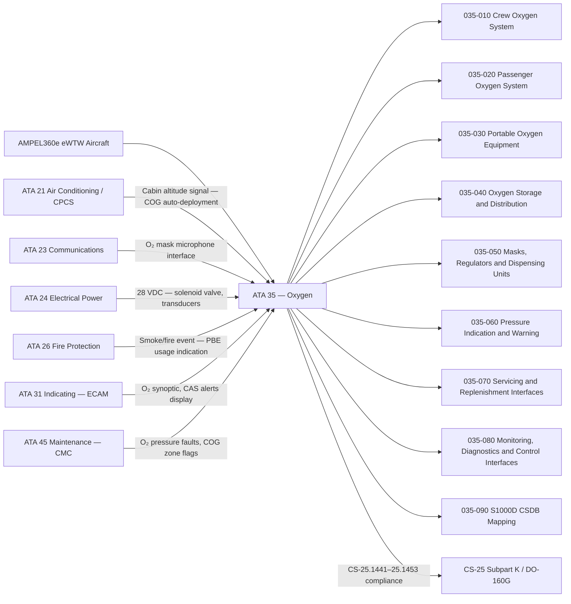
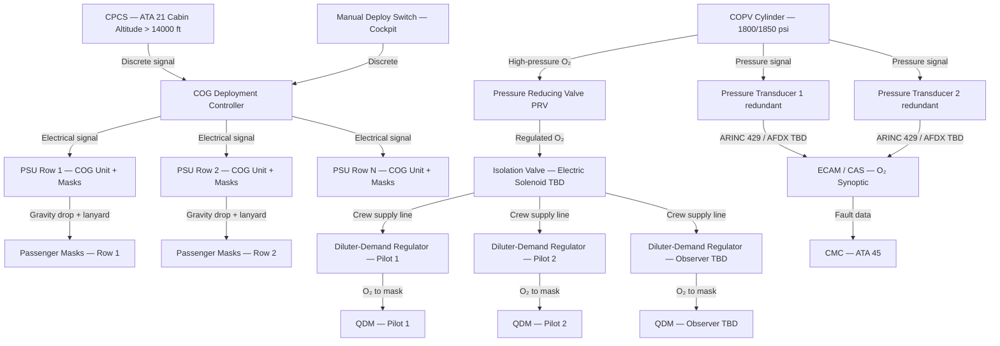
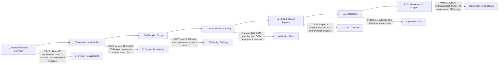

# 035-000 — Oxygen — General
### AMPEL360e eWTW · ATA 35 · Q+ATLANTIDE ATLAS Scaffold

---

## §0 Hyperlink Policy

All internal links in this document use relative paths from the current directory. External regulatory and standards references use anchor links defined in [§20 References](#20-references). Links marked **TBD** indicate targets not yet allocated within the CSDB or ATLAS hierarchy. Programme-level links traverse five directory levels (`../../../../../`) to reach the repository root. No absolute URLs are used for internal navigation.

---

## §1 Purpose

This document provides the top-level general description of ATA 35 — Oxygen — as implemented on the AMPEL360e Wide Tube-and-Wing (eWTW) fully electric aircraft. It establishes the scope, architectural philosophy, and functional decomposition of all oxygen systems across nine subsubjects (035-010 through 035-090).

The AMPEL360e eWTW oxygen architecture comprises two primary subsystems and one ancillary category: (A) **Crew High-Pressure Gaseous Oxygen System** — high-pressure cylinder(s) with quick-donning masks (QDM) and diluter-demand regulators for the flight deck crew; (B) **Passenger Chemical Oxygen Generator (COG) System** — chemical oxygen generators pre-loaded in each passenger service unit (PSU) overhead panel, deployed automatically at cabin altitude > 14,000 ft or manually by the crew; and (C) **Portable Breathing Equipment (PBE)** — self-contained chemical PBE units and medical supplemental oxygen for cabin crew and first aid. There is no liquid oxygen (LOX) system on the AMPEL360e eWTW.

The fully electric architecture introduces specific design considerations: no bleed air is available for pressurisation, eliminating one cross-contamination failure mode; crew oxygen shutoff valve design (electric solenoid versus manual, TBD) must integrate with ECS/CPCS failure logic; and composite overwrap pressure vessel (COPV) compatibility with the CFRP fuselage structural integration requires engineering assessment. Primary Q-Division is Q-AIR; supporting Q-Divisions are Q-MECHANICS (mechanical installation), Q-DATAGOV (CSDB publication), and Q-GREENTECH (environmental compliance).

---

## §2 Applicability

| Attribute | Value |
|---|---|
| Programme | AMPEL360e Wide Tube-and-Wing (eWTW) |
| ATA Chapter | 35 — Oxygen |
| Aircraft Variant | eWTW-100 (baseline) |
| Propulsion | Full-electric (no bleed air; no hydraulic actuation) |
| Crew Oxygen | High-pressure gaseous O₂, COPV cylinder(s) TBD, 1800/1850 psi nominal |
| Passenger Oxygen | Chemical oxygen generators (COG) in PSU overhead panels |
| Portable Oxygen | PBE (protective breathing equipment) + medical O₂ cylinder |
| LOX System | None — not applicable to commercial transport |
| Certification Basis | CS-25 Subpart K §25.1441–§25.1453; DO-160G |
| S1000D Issue | 5.0 |
| SNS Reference | 035-00 |
| Applicability Code | ALL (all eWTW aircraft in programme) |
| Effectivity | From MSN 001 |

---

## §3 System / Function Overview

ATA 35 on the AMPEL360e eWTW encompasses all systems providing supplemental and emergency oxygen to the flight crew, passengers, and cabin crew. The architecture is stratified into three functional subsystems:

1. **Crew Oxygen System**: High-pressure gaseous oxygen stored in one or more COPV cylinders in the avionics bay / flight deck area. Distributed via stainless or titanium tubing through a pressure reducing valve (PRV) to diluter-demand regulators at each flight deck station. Quick-donning masks (QDM) enable one-handed donning within 5 seconds (CS-25.1447). Emergency 100% oxygen mode and pressure-demand mode available.

2. **Passenger Oxygen System**: Chemical oxygen generators (COG) pre-installed in each PSU overhead panel, one unit per seat row grouping. Deployment is automatic (cabin altitude signal from CPCS/ATA 21 > 14,000 ft) or manual (cockpit switch). Continuous-flow oro-nasal masks drop from PSU bag on COG activation via lanyard pull. Duration: 12–15 min per CS-25.1443.

3. **Portable Oxygen Equipment**: Self-contained chemical PBE units for cabin crew for smoke/fire scenarios; medical supplemental oxygen cylinder for first-aid. Quantity and stowage locations per CS-25.1441 and authority requirements (TBD).

eWTW-specific design considerations include: COPV cylinder structural integration with composite fuselage frames (TBD); COG thermal protection within composite PSU panels (TBD); electric solenoid crew O₂ shutoff valve integration with ECS/CPCS logic; no LOX and no OBOGS.

---

## §4 Scope

### 4.1 Included
- Crew high-pressure gaseous oxygen cylinder(s) — COPV (TBD vs. steel/aluminium), 1800/1850 psi
- Crew pressure reducing valve (PRV), fill valve, isolation valve (electric solenoid TBD)
- Crew distribution tubing (stainless/titanium) to flight deck stations
- Crew quick-donning masks (QDM) and diluter-demand regulators
- Passenger chemical oxygen generators (COG) pre-loaded in PSU panels
- Passenger continuous-flow oro-nasal masks, tubing, and PSU dispensing units
- COG auto-deployment logic interface with CPCS (ATA 21) and manual cockpit switch
- Portable breathing equipment (PBE) — self-contained chemical units for cabin crew
- Medical supplemental oxygen portable cylinder for first aid
- Crew oxygen cylinder pressure transducers (redundant) and pressure indication
- Cockpit CAS alerts: "O2 LO PR CREW" amber, "O2 CREW OFF" red
- COG deployed status indication (per zone, if sensor wired — TBD)
- Crew cylinder exterior filler valve (servicing port on fuselage exterior)
- S1000D CSDB mapping for ATA 35 (035-090)

### 4.2 Excluded
- Cabin pressurisation and pressure control system — ATA 21 (provides cabin altitude signal to COG deployment logic; interface only)
- Fire detection and extinguishing — ATA 26 (PBE usage triggered by smoke/fire events; interface only)
- Cockpit display system hardware (ECAM, PFD, systems display) — ATA 31
- Crew communication systems (oxygen mask microphone) — ATA 23 (interface only)
- Central maintenance computer (CMC) host platform — ATA 45
- Electrical power distribution — ATA 24

---

## §5 Architecture Description

- **Crew oxygen architecture**: One (or two — TBD) high-pressure COPV cylinder(s) stowed in avionics bay or behind flight deck rear panel. Cylinder feeds a PRV that reduces system pressure to regulator supply pressure. Electric solenoid isolation valve (TBD vs. manual) allows crew shutoff. Distribution tubing routes to diluter-demand regulator at each crew station (2 pilots + 1 observer TBD). Regulator provides normal diluted O₂ / 100% O₂ / emergency pressure-demand modes. QDM enables 5-second one-handed donning per CS-25.1447.
- **Passenger COG architecture**: COG units are self-contained line-replaceable units (LRU) pre-installed in PSU overhead panels at manufacture or before flight. No high-pressure oxygen distribution lines in cabin. Auto-deployment signal from CPCS (ATA 21) cabin altitude output. Lanyard pull on mask donning mechanically activates COG chlorate candle reaction. Heat shield required in composite PSU panel (TBD design).
- **Portable oxygen**: PBE units stowed at cabin crew stations (forward, aft) and galley positions. Medical O₂ cylinder stowed per authority requirement (location TBD). All portable units are self-contained — no interface to fixed oxygen distribution.
- **No LOX, no OBOGS**: The eWTW does not carry liquid oxygen or an on-board oxygen generation system. Gaseous O₂ and chemical COG are the sole oxygen sources.
- **Monitoring and diagnostics**: Crew cylinder pressure monitored by redundant pressure transducers. Data transmitted via ARINC 429 or AFDX (TBD) to ECAM/CAS. COG deployment flags per zone (if wired — TBD) transmitted to CMC. Ground maintenance via CMC maintenance terminal.

---

## §6 Functional Breakdown

| Function ID | Function Title | Description | Applicable Subsystem |
|---|---|---|---|
| F-001 | Crew Oxygen Supply | High-pressure COPV cylinder, PRV, isolation valve, distribution tubing; supply to flight deck regulators | 035-010 |
| F-002 | Passenger Oxygen Deployment | COG units in PSU; auto/manual deployment; continuous-flow mask dispensing; COG activation via lanyard | 035-020 |
| F-003 | Portable Breathing Equipment | Self-contained chemical PBE for cabin crew smoke/fire response; medical O₂ cylinder; portable oxygen management | 035-030 |
| F-004 | Oxygen Storage and Distribution | COPV cylinder specification, stowage, structural interface; anti-static tubing routing; filler valve; no LOX | 035-040 |
| F-005 | Masks, Regulators, and Dispensing | Crew QDM, diluter-demand regulators, pressure-demand mode; passenger dispensing units, mask stowage, tubing | 035-050 |
| F-006 | Pressure Indication and Warning | Redundant pressure transducers; ECAM O₂ synoptic; CAS amber/red alerts; COG deployed zone indication | 035-060 |
| F-007 | Servicing and Replenishment | Exterior filler valve, GSE interface, cylinder hydrostatic test; COG LRU replacement; PBE shelf-life management | 035-070 |
| F-008 | Monitoring, Diagnostics, and Control Interfaces | CMC/OMS data; ECAM O₂ page; ground maintenance tests; ATA 21/23/26/31 interfaces | 035-080 |
| F-009 | S1000D CSDB Mapping and Traceability | SNS allocation; DMC codes; DMRL; BREX; publication hierarchy for ATA 35 | 035-090 |

---

## §7 System Context Diagram

---

## §8 Internal Functional Architecture

---

## §9 Lifecycle Traceability

---

## §10 Interfaces

| Interface ID | System / Chapter | Interface Type | Data / Signal | Direction | Status |
|---|---|---|---|---|---|
| IF-035-001 | ATA 21 Air Conditioning / CPCS | Discrete (28 VDC) | Cabin altitude > 14,000 ft signal — COG auto-deployment trigger | ATA21 → ATA35 |  |
| IF-035-002 | ATA 23 Communications | Analog / Discrete | Oxygen mask microphone — crew voice via mask mic to audio management unit | ATA35 → ATA23 |  |
| IF-035-003 | ATA 24 Electrical Power | 28 VDC essential bus | Power for crew O₂ solenoid isolation valve and pressure transducers | ATA24 → ATA35 |  |
| IF-035-004 | ATA 26 Fire Protection | Discrete | Smoke/fire detection event — crew awareness for PBE usage; no automated PBE deployment | ATA26 → ATA35 |  |
| IF-035-005 | ATA 31 Indicating / ECAM | ARINC 429 / AFDX TBD | Crew O₂ cylinder pressure, low-pressure flag, COG deployed zone flags | ATA35 → ATA31 |  |
| IF-035-006 | ATA 45 Maintenance (CMC) | AFDX maintenance bus | Crew O₂ pressure faults, COG deployed status, isolation valve position | ATA35 → ATA45 |  |
| IF-035-007 | Cockpit crew controls | 28 VDC discrete | Manual COG deploy switch; crew O₂ isolation valve control | Crew → ATA35 |  |
| IF-035-008 | GSE — High-pressure O₂ servicing cart | High-pressure quick-connect | Crew cylinder replenishment via exterior filler valve (1800/1850 psi) | GSE → ATA35 |  |

---

## §11 Operating Modes

| Mode ID | Mode Name | Description | Entry Condition | Exit Condition |
|---|---|---|---|---|
| OM-001 | Normal — Standby | Crew O₂ cylinder pressurised and ready; COG units armed and ready; PBE stowed | Aircraft powered; O₂ system serviceable | O₂ system failure or activation |
| OM-002 | Crew O₂ Active — Normal Dilution | Crew donning QDM masks; diluter-demand regulator in normal dilution mode (O₂ / air mix) | Crew manually dons mask | Masks removed |
| OM-003 | Crew O₂ Active — 100% O₂ | Crew regulator switched to 100% O₂ mode | Manual 100% selection by crew | Selection restored to normal |
| OM-004 | Crew O₂ Active — Pressure Demand | Emergency mode; positive pressure O₂ delivered at all times (smoke ingestion protection) | Manual emergency selection or pressure < TBD psi | Mask removed or mode reset |
| OM-005 | Passenger COG Auto-Deploy | COG units activated automatically; masks drop from PSU; continuous-flow O₂ delivered | Cabin altitude > 14,000 ft signal from CPCS | COG exhausted (~12–15 min) |
| OM-006 | Passenger COG Manual Deploy | COG units activated by cockpit manual switch | Crew manual deploy selection | COG exhausted |
| OM-007 | PBE Active | Cabin crew donning PBE; self-contained chemical O₂ supply for smoke/fire response | Smoke/fire event; cabin crew decision | PBE exhausted (~15 min) |
| OM-008 | Crew O₂ Isolated | Isolation valve closed (electric solenoid or manual) — no crew O₂ flow | Crew isolation selection or valve failure | Valve reopened |
| OM-009 | Ground Maintenance / Test | O₂ pressure check; system leak test; isolation valve function test; COG zone status readout | Ground power + CMC maintenance mode | Test complete |

---

## §12 Monitoring and Diagnostics

Oxygen system health monitoring is distributed across the CMC/OMS, ECAM O₂ systems page, and cockpit CAS:

- **Crew O₂ pressure monitoring**: Dual redundant pressure transducers on crew cylinder continuously monitor cylinder pressure. FWCU/CAS processes transducer signals. Low-pressure amber alert "O2 LO PR CREW" generated at < 50% nominal pressure (threshold TBD). Red "O2 CREW OFF" alert if isolation valve closed or pressure loss detected below minimum.
- **Pressure transducer cross-check**: Two transducers compared continuously; disagreement beyond tolerance generates CMC fault entry and ECAM advisory. Gas-law quantity computation uses pressure and temperature (temperature sensor TBD).
- **COG deployment monitoring**: If wired (TBD), each PSU zone provides a discrete signal confirming COG deployment. Deployed flags appear on ECAM O₂ page and CMC maintenance log per zone.
- **Isolation valve position**: Electric solenoid valve position (open/closed) monitored. Valve-closed state with no crew O₂ selection generates CMC fault.
- **Ground maintenance**: CMC maintenance terminal provides O₂ pressure readout, system leak test trigger, isolation valve function test (OPEN/CLOSE command), and COG zone status.
- **Inhibit logic**: On-ground inhibit of low-pressure warnings if aircraft is in servicing mode (TBD — avoid nuisance alerts during cylinder replenishment).

---

## §13 Maintenance Concept

ATA 35 LRUs are designed for efficient line and base maintenance:

- **Crew O₂ cylinder**: Line maintenance — replenishment via exterior filler valve. Cylinder removal/installation is base maintenance (avionics bay / flight deck rear panel access required). Hydrostatic test interval TBD (typically 5 years per regulatory requirement). Post-reinstallation: pressure check and system leak test.
- **COG units**: LRU replacement — cabin crew station / PSU access. Replacement required after each activation or at chemical expiry (shelf life per manufacturer specification). Armed/safe pin verification before installation. Lanyard pull check. Expiry label inspection.
- **QDM masks and regulators**: Inspection at each A-check interval (TBD). Replace at regulator overhaul interval or upon physical damage. Mask seal check and donning time verification.
- **Portable PBE units**: Inspect at each A-check. Replace at shelf life expiry (typically 15 years) or after use. Serviceability label verification.
- **Medical O₂ cylinder**: Pressure check and expiry inspection at scheduled intervals (TBD). Replacement as required.
- **Pressure transducers**: LRU replacement in avionics bay. Post-replacement: pressure check and cross-comparison verification via CMC.
- **Ground support equipment (GSE)**: High-pressure O₂ servicing cart with quick-connect adapter for filler valve. GSE qualification and calibration per maintenance programme (TBD).

---

## §14 S1000D / CSDB Mapping

### 14.1 SNS to DMC Mapping

| SNS Code | Subsubject Title | DMC Prefix | Info Codes Planned | DMRL Status |
|---|---|---|---|---|
| 035-00 | Oxygen — General | DMC-AMPEL360E-EWTW-035-00 | 040, 300, 400 |  |
| 035-10 | Crew Oxygen System | DMC-AMPEL360E-EWTW-035-10 | 040, 300, 400, 520, 720 |  |
| 035-20 | Passenger Oxygen System | DMC-AMPEL360E-EWTW-035-20 | 040, 300, 400, 520, 720, 941 |  |
| 035-30 | Portable Oxygen Equipment | DMC-AMPEL360E-EWTW-035-30 | 040, 300, 400, 520, 720, 941 |  |
| 035-40 | Oxygen Storage and Distribution | DMC-AMPEL360E-EWTW-035-40 | 040, 300, 400, 520, 720 |  |
| 035-50 | Masks, Regulators, and Dispensing Units | DMC-AMPEL360E-EWTW-035-50 | 040, 300, 400, 520, 720, 941 |  |
| 035-60 | Oxygen Pressure Indication and Warning | DMC-AMPEL360E-EWTW-035-60 | 040, 300, 400, 520 |  |
| 035-70 | Oxygen Servicing and Replenishment Interfaces | DMC-AMPEL360E-EWTW-035-70 | 040, 400, 520, 720 |  |
| 035-80 | Oxygen Monitoring, Diagnostics, and Control Interfaces | DMC-AMPEL360E-EWTW-035-80 | 040, 300, 400, 520 |  |
| 035-90 | S1000D CSDB Mapping and Traceability | DMC-AMPEL360E-EWTW-035-90 | 040 |  |

### 14.2 Information Code Definitions

| Info Code | Description | Applicable to ATA 35 |
|---|---|---|
| 040 | Description (system description, function) | All SNS |
| 300 | Operation (normal, abnormal, emergency procedures) | 035-10 through 035-80 |
| 400 | Maintenance procedures (inspection, test, adjustment) | All SNS |
| 520 | Troubleshooting (fault isolation) | 035-10 through 035-80 |
| 720 | Removal and installation | 035-10 through 035-50 |
| 941 | Illustrated Parts Data (IPD) | 035-20, 035-30, 035-50 |

---

## §15 Footprints

### 15.1 Physical Footprint
- Crew O₂ cylinder(s): avionics bay or flight deck rear area — COPV envelope TBD; mounting orientation TBD
- Crew PRV and isolation valve: avionics bay / cockpit — location TBD
- Crew distribution tubing: routed from avionics bay to each flight deck station — routing TBD
- Crew QDM masks and regulators: stowed at each flight deck station (pilot 1, pilot 2, observer TBD)
- Exterior filler valve: fuselage exterior servicing port — location TBD (forward fuselage lower panel)
- COG units: installed in PSU overhead panels throughout passenger cabin — one per row grouping
- PBE units: galley, forward cabin crew station, aft cabin crew station — quantity TBD
- Medical O₂ cylinder: stowage location TBD

### 15.2 Electrical / Data Footprint
- Power: 28 VDC essential bus for solenoid isolation valve, pressure transducers, COG deployment controller
- Total ATA 35 electrical load (normal operation): 
- Data: ARINC 429 / AFDX TBD for pressure transducer data to ECAM and CMC
- COG zone wiring: discrete signals per PSU zone (if fitted — TBD)

### 15.3 Maintenance Footprint
- Crew cylinder replenishment: exterior filler valve — line maintenance, high-pressure GSE cart
- Crew cylinder removal / hydrostatic test: base maintenance — avionics bay access
- COG LRU replacement: line maintenance — PSU panel access, no special tools
- PBE replacement: line maintenance — stowage location access, shelf-life check
- Pressure transducer replacement: line maintenance — avionics bay access
- Ground support equipment: high-pressure O₂ cart; CMC maintenance terminal; O₂ leak test equipment

### 15.4 Data Footprint
- CMC fault log: crew O₂ pressure history, low-pressure events, isolation valve position faults
- COG deployment log: per-zone deployment records, timestamps (if zone wiring fitted — TBD)
- Cylinder hydrostatic test record: date, pressure, result — retained per AMM
- PBE and COG expiry tracking: shelf-life management per maintenance programme

---

## §16 Safety and Certification Considerations

| Requirement | Source | Description | Compliance Approach | Status |
|---|---|---|---|---|
| CS-25.1441 | EASA CS-25 Subpart K | Oxygen equipment and supply — minimum supply requirements for crew and passengers | System architecture, duration analysis, quantity calculation per altitude profile |  |
| CS-25.1443 | EASA CS-25 Subpart K | Minimum mass flow of supplemental oxygen — continuous flow and diluter-demand requirements | Regulator and COG flow rate qualification; duration test |  |
| CS-25.1445 | EASA CS-25 Subpart K | Equipment standards — oxygen equipment must meet applicable TSO | COG TSO qualification (TSO-C78); regulator TSO (TSO-C89); mask qualification |  |
| CS-25.1447 | EASA CS-25 Subpart K | Equipment standards — crew quick-donning mask; 5-second one-handed donning requirement | QDM qualification test; 5-second donning demonstration by crew |  |
| CS-25.1449 | EASA CS-25 Subpart K | Means for determining supply quantity — pressure gauges or other approved means | Redundant pressure transducers; gas-law quantity indication on ECAM |  |
| CS-25.1451 | EASA CS-25 Subpart K | Fire protection for oxygen equipment — materials; oxygen system fire resistance | Material qualification; fire resistance testing of tubing and fittings |  |
| CS-25.1453 | EASA CS-25 Subpart K | Protection of oxygen equipment from damage — routing, protection from fuel, hydraulic, heat | Segregated routing; no hydraulic lines near O₂ tubing (eWTW: no hydraulics — verify) |  |
| DO-160G | RTCA | Environmental conditions and test procedures for airborne equipment | All O₂ system LRUs environmental qualification |  |
| CS-25.858 | EASA CS-25 | Cargo compartment smoke detection — cross-reference for PBE requirement | PBE quantity and location per smoke detection zones; CS-25.858 compliance |  |

---

## §17 Verification and Validation

| V&V ID | Requirement | Method | Success Criterion | Status |
|---|---|---|---|---|
| VV-035-001 | Crew O₂ pressure test — CS-25.1449 | Ground test: fill cylinder, verify transducer readings vs. reference gauge | Pressure reading within ±TBD psi of reference; redundant sensors within tolerance |  |
| VV-035-002 | QDM 5-second donning time — CS-25.1447 | Crew representative donning demonstration, timed one-handed | Donning complete (mask sealed, O₂ flowing) within 5 seconds, one-handed |  |
| VV-035-003 | COG auto-deployment test — CS-25.1441 | Simulated cabin altitude > 14,000 ft signal; verify mask drop and COG activation | All PSU masks deploy; COG activates (heat + O₂ flow confirmed); duration ≥ 12 min |  |
| VV-035-004 | Passenger mask drop test — CS-25.1447 | COG deployment test: confirm mask reaches seated passenger position | Mask tubing length sufficient for seated adult; mask accessible within TBD sec |  |
| VV-035-005 | PBE donning and duration test — CS-25.1441 | PBE donning demonstration; timed O₂ flow duration test | PBE donning within TBD sec; O₂ supply ≥ 15 min at rated flow |  |
| VV-035-006 | System leak test — CS-25.1453 | Pressurised crew O₂ distribution system; sniffer / pressure decay method | No detectable O₂ leak at any fitting or connection over TBD min test period |  |
| VV-035-007 | Warning system test — CS-25.1449 | Inject low-pressure signal; verify CAS alert generation and ECAM display | "O2 LO PR CREW" amber CAS displayed within TBD sec; ECAM O₂ page shows correct status |  |
| VV-035-008 | Cylinder hydrostatic test — regulatory | Hydrostatic pressure test to 1.5× working pressure per applicable DOT/EN standard | No deformation, leakage, or rupture at test pressure; test record accepted by authority |  |
| VV-035-009 | DO-160G environmental qualification | DO-160G test suite for all O₂ system LRUs (transducers, solenoid valve, COG, regulators) | Pass all applicable DO-160G categories per LRU specification |  |
| VV-035-010 | Crew O₂ supply duration — CS-25.1441/1443 | Flow rate measurement at regulator output; duration calculation at 12 km cruise altitude | Minimum 15–20 min supply per crew member at CS-25-required flow rate |  |

---

## §18 Glossary

| Term | Definition |
|---|---|
| CAS | Crew Alerting System — the cockpit alerting function providing amber/red/advisory messages for abnormal system states |
| COG | Chemical Oxygen Generator — a self-contained device that produces oxygen by a chemical reaction (sodium chlorate candle); used in passenger PSU units |
| COPV | Composite Overwrap Pressure Vessel — a high-pressure cylinder with a metallic liner overwrapped with carbon or aramid fibre composite; lighter than equivalent all-metal cylinders |
| CPCS | Cabin Pressure Control System — part of ATA 21; monitors and controls cabin differential pressure; provides cabin altitude signal to COG auto-deployment logic |
| CS-25 | Certification Specifications for Large Aeroplanes — EASA primary certification standard; Subpart K (§25.1441–§25.1453) covers oxygen equipment requirements |
| diluter-demand regulator | An oxygen regulator that delivers a mixture of oxygen and cabin air (diluted) at normal altitudes, and 100% oxygen at high altitudes or on crew selection; reduces oxygen consumption compared to continuous-flow |
| continuous-flow mask | An oxygen mask that delivers a continuous stream of oxygen regardless of breathing cycle; used in passenger COG systems |
| DO-160G | RTCA document: Environmental Conditions and Test Procedures for Airborne Equipment — qualification standard for temperature, vibration, humidity, EMC, etc. |
| ECAM | Electronic Centralised Aircraft Monitor — the aircraft systems monitoring and alerting display system (ATA 31 interface) |
| LOX | Liquid Oxygen — cryogenically stored oxygen; not used on the AMPEL360e eWTW or on modern commercial transport aircraft |
| LRU | Line Replaceable Unit — a component designed for rapid replacement at line maintenance without special workshop facilities |
| PBE | Portable Breathing Equipment — a self-contained smoke hood / chemical oxygen unit used by cabin crew during smoke or toxic fume events; minimum 15 min duration |
| PRV | Pressure Reducing Valve — reduces high-pressure cylinder output to regulator supply pressure |
| pressure-demand regulator | An oxygen regulator that delivers oxygen at positive pressure relative to the mask, preventing inhalation of ambient air; used in crew emergency mode for smoke/fume protection |
| PSU | Passenger Service Unit — the overhead panel above each seat row incorporating reading lights, call button, and oxygen mask dispensing unit with COG |
| QDM | Quick-Donning Mask — a crew oxygen mask designed for one-handed donning within 5 seconds (CS-25.1447 requirement) |
| S1000D | International specification for production and procurement of technical publications; defines the Data Module (DM) paradigm and CSDB architecture |

---

## §19 Citations

| Citation ID | Source | Title | Relevance |
|---|---|---|---|
| CIT-035-001 | EASA | CS-25 Amendment 27 — Subpart K §25.1441–§25.1453 | Primary certification basis for ATA 35 oxygen equipment |
| CIT-035-002 | RTCA | DO-160G: Environmental Conditions and Test Procedures for Airborne Equipment | Environmental qualification for all O₂ system LRUs |
| CIT-035-003 | EASA | CS-25 §25.858 — Cargo compartment smoke detection | Cross-reference for PBE quantity and location requirements |
| CIT-035-004 | ASD-STAN | S1000D Issue 5.0 | S1000D CSDB mapping standard for ATA 35 |
| CIT-035-005 | FAA | TSO-C78 — Chemical Oxygen Generators | COG qualification standard (FAA reference for CS-25.1445) |
| CIT-035-006 | FAA | TSO-C89 — Oxygen Regulators (demand) | Diluter-demand regulator qualification standard |
| CIT-035-007 | FAA | TSO-C99 — Portable Oxygen Concentrators | Reference — not applicable (no POC on eWTW) |
| CIT-035-008 | EASA | AMC 25.1441 — Oxygen system general requirements | Advisory material for oxygen system design and certification |

---

## §20 References

| Ref ID | Document | Title | Link |
|---|---|---|---|
| REF-035-001 | CS-25.1441 | Oxygen equipment and supply — general requirements | [EASA CS-25](#) |
| REF-035-002 | CS-25.1443 | Minimum mass flow of supplemental oxygen | [EASA CS-25](#) |
| REF-035-003 | CS-25.1445 | Equipment standards — oxygen system TSO requirements | [EASA CS-25](#) |
| REF-035-004 | CS-25.1447 | Equipment standards — crew QDM; 5-second donning | [EASA CS-25](#) |
| REF-035-005 | CS-25.1449 | Means for determining supply quantity | [EASA CS-25](#) |
| REF-035-006 | CS-25.1451 | Fire protection for oxygen equipment | [EASA CS-25](#) |
| REF-035-007 | CS-25.1453 | Protection of oxygen equipment from damage | [EASA CS-25](#) |
| REF-035-008 | CS-25.858 | Cargo compartment smoke detection — PBE cross-reference | [EASA CS-25](#) |
| REF-035-009 | DO-160G | Environmental Conditions and Test Procedures | [RTCA](https://www.rtca.org/) |
| REF-035-010 | S1000D Issue 5.0 | International Specification for Technical Publications | [s1000d.org](https://s1000d.org/) |
| REF-035-011 | TSO-C78 | Chemical Oxygen Generators | [FAA](https://www.faa.gov/) |
| REF-035-012 | TSO-C89 | Oxygen Regulators (demand type) | [FAA](https://www.faa.gov/) |

---

## §21 Open Issues

| Issue ID | Description | Owner | Priority | Status |
|---|---|---|---|---|
| OI-035-001 | COPV vs. steel/aluminium cylinder decision — confirm composite overwrap pressure vessel material, liner type, and weight vs. cost trade-off for crew O₂ cylinder(s) | Q-MECHANICS / ORB-PMO | High |  |
| OI-035-002 | Electric solenoid vs. manual crew O₂ shutoff valve — confirm valve type, failure mode analysis (fail-open vs. fail-closed), and integration with CPCS/ECS failure logic | Q-AIR / Q-MECHANICS | High |  |
| OI-035-003 | COG heat shield in composite PSU panels — assess thermal load from COG chlorate candle reaction on CFRP PSU panel structure; define heat shield design | Q-MECHANICS / Q-STRUCTURES | High |  |
| OI-035-004 | Number of PBE units per aisle — determine quantity of portable PBE units based on passenger count, route length, and authority requirements (CS-25 and operational regulations) | Q-AIR / ORB-LEG | Medium |  |
| OI-035-005 | Medical O₂ quantity and stowage — define number of medical O₂ cylinders and stowage locations based on route, authority requirement, and operator policy | Q-AIR / ORB-LEG | Medium |  |
| OI-035-006 | COG deployed sensor wiring — confirm whether COG deployment is detected per individual PSU zone (discrete wiring) or by zonal aggregate; impact on ECAM display granularity | Q-AIR / Q-DATAGOV | Medium |  |
| OI-035-007 | QDM mask model selection — confirm crew mask type: full-face QDM or oro-nasal QDM; microphone integration; diluter-demand regulator model and supplier | Q-AIR / ORB-PMO | High |  |
| OI-035-008 | COPV structural integration with CFRP fuselage — assess mounting interface between COPV cylinder bracket and CFRP fuselage frames; vibration and fatigue requirements | Q-MECHANICS / Q-STRUCTURES | High |  |
| OI-035-009 | Crew O₂ supply duration vs. altitude — confirm minimum supply duration requirement (15 or 20 min) at design cruise altitude (12 km) and cylinder sizing | Q-AIR / ORB-LEG | High |  |

---

## §22 Change Log

| Revision | Date | Author | Description |
|---|---|---|---|
| 0.1.0 | 2026-05-10 | Q+ATLANTIDE / Q-AIR | Initial full-template creation — all §0–§22 sections drafted; TBD items identified; open issues registered |
