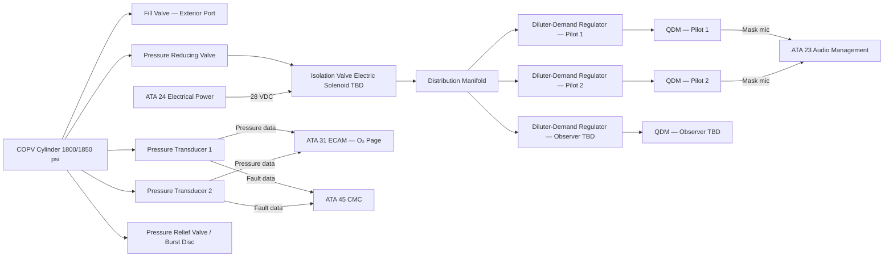
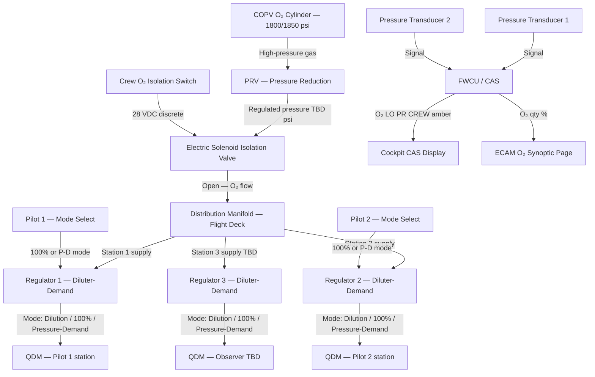
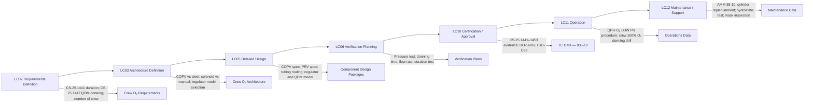

# 035-010 — Crew Oxygen System
### AMPEL360e eWTW · ATA 35 · Q+ATLANTIDE ATLAS Scaffold

---

## §0 Hyperlink Policy

All internal links in this document use relative paths from the current directory. External regulatory and standards references use anchor links defined in [§20 References](#20-references). Links marked **TBD** indicate targets not yet allocated within the CSDB or ATLAS hierarchy. Programme-level links traverse five directory levels (`../../../../../`) to reach the repository root. No absolute URLs are used for internal navigation.

---

## §1 Purpose

This document describes the Crew Oxygen System (ATA 35-10) as implemented on the AMPEL360e Wide Tube-and-Wing (eWTW) fully electric aircraft. It defines the architecture, components, functional operation, interfaces, certification compliance, and maintenance concept of the high-pressure gaseous oxygen system providing supplemental and emergency breathing oxygen to the flight deck crew (2 pilots and 1 observer, TBD).

The crew oxygen system must supply sufficient oxygen to allow the flight crew to maintain normal cognitive and physical function during any depressurisation event or emergency descent, and to perform smoke/fume protection during in-flight fire or fume events. The system must meet CS-25.1441 supply duration requirements, CS-25.1443 flow rate requirements, and CS-25.1447 quick-donning mask donning time requirements (one-handed within 5 seconds).

---

## §2 Applicability

| Attribute | Value |
|---|---|
| Programme | AMPEL360e Wide Tube-and-Wing (eWTW) |
| ATA Subsubject | 035-10 — Crew Oxygen System |
| Crew Positions | Pilot 1 (Captain), Pilot 2 (First Officer), Observer TBD |
| Cylinder Type | COPV (Composite Overwrap Pressure Vessel) TBD vs. steel/aluminium |
| Cylinder Pressure | 1800 psi or 1850 psi nominal (TBD) |
| Regulator Type | Diluter-demand with 100% O₂ and pressure-demand emergency modes |
| Mask Type | Quick-Donning Mask (QDM) — full-face or oro-nasal (TBD) |
| Supply Duration | 15–20 min at 12 km cruise altitude (TBD) |
| Isolation Valve | Electric solenoid TBD vs. manual |
| Certification Basis | CS-25.1441, CS-25.1443, CS-25.1447, CS-25.1449, CS-25.1451, CS-25.1453 |
| S1000D SNS | 035-10 |
| Applicability Code | ALL (all eWTW aircraft in programme) |
| Effectivity | From MSN 001 |

---

## §3 System / Function Overview

The crew oxygen system provides high-pressure gaseous oxygen stored in one or more COPV cylinders in the avionics bay or flight deck rear area. Oxygen flows from the cylinder(s) through a pressure reducing valve (PRV), an electric solenoid isolation valve (TBD), and stainless or titanium anti-static distribution tubing to diluter-demand regulators at each flight deck crew station.

Each crew station is equipped with a quick-donning mask (QDM) that can be donned one-handed within 5 seconds. The regulator provides three operating modes: (1) normal dilution — oxygen mixed with cabin air at proportional altitude-compensated ratio; (2) 100% oxygen — pure oxygen at cabin pressure; (3) pressure-demand emergency — positive-pressure oxygen preventing any cabin air inhalation (used during smoke or fume events). Mask microphones integrate with the aircraft communications system (ATA 23).

Cylinder pressure is monitored by dual redundant pressure transducers. Crew O₂ quantity (as percentage of full charge) is displayed on the ECAM O₂ systems page, computed from pressure and temperature using the ideal gas law. Low-pressure amber CAS alert is generated when quantity falls below 50% (threshold TBD). The exterior filler valve (on the fuselage outer skin) allows ground servicing of the cylinder to operating pressure.

---

## §4 Scope

### 4.1 Included
- Crew oxygen COPV cylinder(s) — quantity, material, volume, working pressure TBD
- Fill valve (exterior fuselage filler port — see 035-070)
- Pressure reducing valve (PRV) — cylinder pressure to distribution pressure
- Electric solenoid isolation valve (TBD vs. manual) with position monitoring
- Anti-static stainless / titanium distribution tubing from avionics bay to flight deck
- Diluter-demand regulators — one per crew station (Pilot 1, Pilot 2, Observer TBD)
- Quick-donning masks (QDM) at each crew station
- Dual redundant pressure transducers (cylinder pressure monitoring)
- Crew O₂ quantity display and CAS alert (ECAM interface — see 035-060 and 035-080)
- Cylinder pressure relief valve / burst disc

### 4.2 Excluded
- Passenger oxygen system (COG) — 035-020
- Portable breathing equipment (PBE) — 035-030
- COPV structural mounting interface (covered in 035-040)
- ECAM display hardware — ATA 31
- CMC host platform — ATA 45
- Exterior filler valve servicing procedures — 035-070

---

## §5 Architecture Description

- **Single-point supply architecture**: One primary COPV cylinder (with provision for a second cylinder TBD) supplies all crew stations via a common distribution manifold after the PRV. Both pilots and the observer (TBD) draw from the same supply; cylinder sizing must account for simultaneous maximum flow from all stations.
- **Pressure reducing valve (PRV)**: Reduces nominal cylinder pressure (1800/1850 psi) to regulator inlet pressure (TBD psi). PRV is a passive, spring-loaded mechanical device — no electrical interface.
- **Electric solenoid isolation valve**: Normally open (fail-open TBD) electric solenoid valve allows crew or automated system to isolate crew oxygen supply. Integration with CPCS/ECS failure logic TBD. Manual override capability required.
- **Diluter-demand regulators**: One per crew station. Regulator automatically adjusts O₂/air ratio as a function of cabin altitude. Crew selects 100% or emergency pressure-demand mode via regulator-mounted selector. Regulator outlet connects to QDM mask via quick-disconnect coupling.
- **QDM masks**: Stored in stowage box at each crew station. One-handed donning within 5 seconds. Full-face or oro-nasal type (TBD). Integrated microphone for ATA 23 voice communications. Mask harness (net type) for secure fit.
- **eWTW-specific considerations**: No hydraulic lines adjacent to O₂ tubing (fully electric architecture eliminates hydraulic fire risk near O₂ system). COPV structural bracket interface with CFRP fuselage TBD. Electric solenoid valve failure mode analysis (fail-open preferred for crew safety — TBD).

---

## §6 Functional Breakdown

| Function ID | Function Title | Description | Component |
|---|---|---|---|
| F-010-001 | Oxygen Storage | Store high-pressure gaseous O₂ at 1800/1850 psi in COPV cylinder | COPV cylinder(s) |
| F-010-002 | Pressure Regulation | Reduce cylinder pressure to regulator supply pressure via PRV | Pressure reducing valve |
| F-010-003 | Supply Isolation | Isolate crew O₂ supply via electric solenoid valve; manual override | Isolation valve |
| F-010-004 | Distribution | Route regulated O₂ from avionics bay to each crew station via anti-static tubing | Distribution tubing, manifold |
| F-010-005 | Flow Regulation — Dilution | Deliver altitude-compensated O₂ / air mixture to crew mask | Diluter-demand regulator |
| F-010-006 | Flow Regulation — 100% O₂ | Deliver 100% oxygen at cabin pressure on crew selection | Diluter-demand regulator (100% mode) |
| F-010-007 | Pressure Demand — Emergency | Deliver positive-pressure oxygen; prevents smoke/fume inhalation | Diluter-demand regulator (pressure-demand mode) |
| F-010-008 | Mask Delivery | QDM quick-donning, sealed oxygen delivery with integrated microphone | Quick-donning mask (QDM) |
| F-010-009 | Pressure Monitoring | Monitor cylinder pressure via dual redundant transducers; gas-law quantity | Pressure transducers |
| F-010-010 | Overpressure Protection | Vent cylinder in overpressure event via pressure relief device | Pressure relief valve / burst disc |

---

## §7 System Context Diagram

---

## §8 Internal Functional Architecture

---

## §9 Lifecycle Traceability

---

## §10 Interfaces

| Interface ID | System / Chapter | Interface Type | Data / Signal | Direction | Status |
|---|---|---|---|---|---|
| IF-035-10-001 | ATA 24 Electrical Power | 28 VDC essential bus | Power for solenoid isolation valve and pressure transducers | ATA24 → ATA35 |  |
| IF-035-10-002 | ATA 23 Communications | Analog / discrete | Oxygen mask microphone — crew voice to audio management unit | ATA35 → ATA23 |  |
| IF-035-10-003 | ATA 31 ECAM / Systems Display | ARINC 429 / AFDX TBD | Crew O₂ pressure, qty %, low-pressure flag for ECAM O₂ page | ATA35 → ATA31 |  |
| IF-035-10-004 | ATA 31 CAS | Discrete / bus | "O2 LO PR CREW" amber CAS; "O2 CREW OFF" red CAS | ATA35 → ATA31 |  |
| IF-035-10-005 | ATA 45 CMC | AFDX maintenance bus | Pressure faults, isolation valve position fault, transducer disagreement | ATA35 → ATA45 |  |
| IF-035-10-006 | Cockpit overhead / side panel | Discrete 28 VDC | Crew O₂ isolation valve switch (OPEN/CLOSE) | Crew → ATA35 |  |
| IF-035-10-007 | GSE high-pressure O₂ cart | High-pressure quick-connect | Cylinder replenishment via exterior filler valve | GSE → ATA35 |  |
| IF-035-10-008 | ATA 035-040 (Storage/Distribution) | Physical | COPV cylinder, PRV, tubing — physical architecture cross-reference | Internal |  |

---

## §11 Operating Modes

| Mode ID | Mode Name | Description | Entry Condition | Exit Condition |
|---|---|---|---|---|
| OM-010-001 | Standby / Ready | Cylinder charged; isolation valve open; regulators at stations; masks stowed | Aircraft powered; system serviceable | Crew donning or system failure |
| OM-010-002 | Diluter-Demand — Normal | Regulator delivers altitude-compensated O₂/air mix; normal flight operations | Crew dons mask; regulator at NORMAL | Mask removed |
| OM-010-003 | 100% Oxygen Mode | Regulator delivers 100% oxygen at cabin pressure; increased consumption rate | Crew selects 100% on regulator; smoke/contamination warning | Selection returned to NORMAL |
| OM-010-004 | Pressure-Demand Mode | Positive pressure oxygen — prevents all inhalation of cabin air | Crew selects EMERGENCY on regulator | Mode reset by crew |
| OM-010-005 | Crew O₂ Isolated | Isolation valve closed; no O₂ flow to any crew station | Manual isolation switch or automated signal | Valve reopened by crew or maintenance |
| OM-010-006 | Low Pressure — Degraded | Cylinder pressure below low-pressure threshold; amber CAS active | Cylinder pressure < 50% TBD | System serviced to full pressure |
| OM-010-007 | Ground Maintenance | Cylinder pressure check; leak test; isolation valve function test | Ground power + CMC maintenance mode | Test complete |

---

## §12 Monitoring and Diagnostics

- **Dual pressure transducer monitoring**: Both transducers sampled continuously. Cross-comparison performed by FWCU/ECAM logic. If transducers agree: quantity % displayed on ECAM. If transducers disagree (delta > TBD psi): CMC fault entry, ECAM advisory "O2 PR DISAGREE" TBD.
- **Low-pressure warning**: Amber CAS "O2 LO PR CREW" at < 50% nominal charge (threshold TBD per CS-25.1449 intent). Inhibited on ground in servicing mode.
- **Isolation valve position monitoring**: Position feedback from solenoid valve. Valve closed with no crew isolation selection: CMC fault and "O2 CREW OFF" red CAS alert.
- **Overpressure / burst disc event**: Burst disc activation vents cylinder contents overboard. Detected by total pressure loss; generates CMC fault. Cylinder must be replaced.
- **CMC ground readout**: Cylinder pressure history, low-pressure events (timestamp, pressure value), isolation valve open/close events — minimum 500 entries (TBD).
- **Inhibit logic**: Ground mode inhibit of low-pressure CAS when servicing mode is active on maintenance panel (TBD — prevent nuisance alert during replenishment).

---

## §13 Maintenance Concept

- **Cylinder replenishment (line maintenance)**: Access exterior filler valve on fuselage skin. Connect high-pressure O₂ GSE cart. Fill to 1800/1850 psi (TBD). Verify pressure on cockpit ECAM after service. No special tooling beyond GSE quick-connect adapter.
- **Cylinder removal / installation (base maintenance)**: Access avionics bay or flight deck rear panel. Disconnect fill valve, PRV, distribution tubing. Remove cylinder bracket (TBD fastener type). Installation reversal. Post-installation: pressure check, leak test (AMM 35-10 task TBD).
- **Hydrostatic test**: At interval TBD (typically 5 years per DOT/EN regulation). Cylinder removed to workshop. Test at 1.5× working pressure. Pass criteria: no deformation, no leakage. Re-stamp and return to service.
- **PRV inspection**: At cylinder removal interval. Functional flow-through test. Replace if flow characteristics outside specification.
- **Isolation valve function test (line maintenance)**: CMC-commanded OPEN/CLOSE cycle. Verify position feedback. Test performed at each A-check or on CAS alert.
- **QDM mask inspection**: At each A-check. Inspect seal, harness, microphone lead. Replace at TBD interval or physical damage.
- **Regulator overhaul**: At TBD interval per manufacturer schedule. Remove and bench test (flow rate, dilution ratio, pressure-demand mode). Replace if outside limits.

---

## §14 S1000D / CSDB Mapping

### 14.1 SNS to DMC Mapping

| SNS Code | Subsubject Title | DMC Prefix | Info Codes Planned | DMRL Status |
|---|---|---|---|---|
| 035-10 | Crew Oxygen System | DMC-AMPEL360E-EWTW-035-10 | 040, 300, 400, 520, 720 |  |

### 14.2 Data Module Breakdown — 035-10

| DM Code Suffix | Info Code | Data Module Title | Priority |
|---|---|---|---|
| -035-10-00-040A | 040 | Crew Oxygen System — System Description | High |
| -035-10-00-300A | 300 | Crew Oxygen System — Normal and Emergency Procedures | High |
| -035-10-00-400A | 400 | Crew Oxygen System — Maintenance Procedures (Inspection, Test) | High |
| -035-10-00-520A | 520 | Crew Oxygen System — Fault Isolation | Medium |
| -035-10-00-720A | 720 | Crew O₂ Cylinder — Removal and Installation | High |
| -035-10-00-720B | 720 | Crew Diluter-Demand Regulator — Removal and Installation | Medium |
| -035-10-00-720C | 720 | Crew QDM Mask — Removal and Installation | Low |

---

## §15 Footprints

### 15.1 Physical Footprint
- COPV cylinder(s): avionics bay or flight deck rear compartment — envelope TBD; mass TBD (typically 5–12 kg per cylinder)
- PRV and isolation valve: avionics bay — physical envelope TBD
- Distribution tubing: routed from avionics bay to flight deck — length TBD; diameter TBD
- QDM mask stowage: each flight deck station — stowage box envelope TBD
- Exterior filler valve: fuselage outer skin — location TBD (forward lower fuselage)

### 15.2 Electrical / Data Footprint
- Isolation valve power: 28 VDC essential bus — current draw TBD
- Pressure transducers ×2: 28 VDC — current draw TBD
- Data interface: ARINC 429 / AFDX TBD — label definition TBD per avionics ICD

### 15.3 Maintenance Footprint
- Replenishment: line maintenance — exterior filler valve, high-pressure GSE cart
- Cylinder removal: base maintenance — avionics bay access, TBD tooling
- Hydrostatic test: shop — 5-year interval TBD
- Mask inspection: line maintenance — each A-check

### 15.4 Data Footprint
- CMC fault log: pressure history, low-pressure events, valve events — 500 entries min TBD
- Cylinder test record: hydrostatic test date, pressure, result — retained per AMM

---

## §16 Safety and Certification Considerations

| Requirement | Source | Description | Compliance Approach | Status |
|---|---|---|---|---|
| CS-25.1441 | EASA CS-25 Subpart K | Minimum supply duration for crew at cruise altitude | Duration analysis; cylinder sizing; flow rate qualification |  |
| CS-25.1443 | EASA CS-25 Subpart K | Minimum mass flow — diluter-demand regulator output per crew member per altitude | Regulator flow rate test; qualification per TSO-C89 |  |
| CS-25.1445 | EASA CS-25 Subpart K | Equipment standards — TSO qualification required | Regulator TSO-C89; mask qualification |  |
| CS-25.1447 | EASA CS-25 Subpart K | Crew QDM donning — one-handed within 5 seconds | QDM donning time test demonstration with crew representative |  |
| CS-25.1449 | EASA CS-25 Subpart K | Means for determining O₂ supply quantity | Dual pressure transducers; gas-law quantity on ECAM |  |
| CS-25.1451 | EASA CS-25 Subpart K | Fire protection — O₂ system materials | Fire-resistant tubing and fittings qualification |  |
| CS-25.1453 | EASA CS-25 Subpart K | Protection from damage — no fuel/hydraulic proximity | eWTW: no hydraulics — verify O₂ tubing routing segregation from fuel lines |  |
| DO-160G | RTCA | Environmental qualification | All crew O₂ LRUs (transducers, solenoid valve, regulators) |  |
| CS-25.858 | EASA CS-25 | Smoke detection cross-reference — PBE and crew O₂ coordination | Emergency smoke procedure uses crew O₂ pressure-demand mode |  |

---

## §17 Verification and Validation

| V&V ID | Requirement | Method | Success Criterion | Status |
|---|---|---|---|---|
| VV-035-10-001 | Crew O₂ pressure accuracy — CS-25.1449 | Ground test: fill cylinder; verify transducer vs. calibrated reference gauge | Both transducers within ±TBD psi of reference gauge |  |
| VV-035-10-002 | QDM 5-second donning — CS-25.1447 | Crew representative donning demonstration, timed one-handed | Donning complete (mask sealed, O₂ flowing) ≤ 5 seconds one-handed |  |
| VV-035-10-003 | Regulator flow rate — CS-25.1443 | Bench test: flow rate at each altitude setting | Flow ≥ CS-25.1443 minimum at each altitude (8 km, 10 km, 12 km TBD) |  |
| VV-035-10-004 | Supply duration — CS-25.1441 | Computed duration from cylinder volume, flow rate, altitude profile | Duration ≥ 15 min (or 20 min TBD) at 12 km cruise for all crew positions simultaneously |  |
| VV-035-10-005 | System leak test | Pressurised system; pressure decay or sniffer method | No detectable O₂ leak at any fitting or connection over TBD minutes |  |
| VV-035-10-006 | Isolation valve function — CS-25 | CMC OPEN/CLOSE command; position feedback verification | Valve opens/closes on command; position feedback correct within TBD sec |  |
| VV-035-10-007 | Low-pressure CAS alert — CS-25.1449 | Inject low-pressure signal; verify CAS amber | "O2 LO PR CREW" amber displayed; ECAM qty updated within TBD sec |  |
| VV-035-10-008 | Pressure-demand mode — CS-25 | Regulator bench test: positive pressure at mask connector in emergency mode | Positive mask pressure ≥ TBD mmH₂O above ambient |  |
| VV-035-10-009 | Cylinder hydrostatic test | Hydrostatic pressure test per applicable standard | No deformation/leakage at 1.5× working pressure |  |
| VV-035-10-010 | DO-160G environmental | DO-160G test suite for O₂ system LRUs | All applicable categories passed |  |

---

## §18 Glossary

| Term | Definition |
|---|---|
| CAS | Crew Alerting System — provides amber/red/advisory messages for abnormal system states in cockpit |
| COPV | Composite Overwrap Pressure Vessel — lightweight high-pressure cylinder with composite fibre winding over metallic liner |
| diluter-demand regulator | Regulator delivering altitude-compensated O₂/air mixture; selectable 100% O₂ and pressure-demand emergency modes |
| ECAM | Electronic Centralised Aircraft Monitor — aircraft systems monitoring display (ATA 31 interface) |
| fill valve | One-way high-pressure valve on fuselage exterior for ground servicing of O₂ cylinder |
| FWCU | Flight Warning Computer Unit — processes sensor data to generate CAS alerts and ECAM messages |
| hydrostatic test | Pressure test of cylinder at 1.5× working pressure with liquid medium to verify structural integrity |
| isolation valve | Valve that can shut off crew O₂ supply — electric solenoid type (TBD) with crew control and position monitoring |
| LRU | Line Replaceable Unit — component designed for rapid replacement at line maintenance |
| PRV | Pressure Reducing Valve — passive mechanical device reducing high-pressure cylinder output to regulator supply level |
| pressure-demand regulator | Regulator in emergency mode — delivers oxygen at positive pressure above cabin ambient; no cabin air can be inhaled |
| QDM | Quick-Donning Mask — flight crew oxygen mask designed for one-handed donning within 5 seconds (CS-25.1447) |
| TSO-C89 | FAA Technical Standard Order for demand oxygen regulators — qualification standard |

---

## §19 Citations

| Citation ID | Source | Title | Relevance |
|---|---|---|---|
| CIT-035-10-001 | EASA | CS-25 Subpart K §25.1441–§25.1453 | Primary certification basis for crew oxygen system |
| CIT-035-10-002 | RTCA | DO-160G Environmental Conditions and Test Procedures | LRU environmental qualification |
| CIT-035-10-003 | FAA | TSO-C89 — Oxygen Regulators (demand type) | Diluter-demand regulator qualification |
| CIT-035-10-004 | FAA | TSO-C78 — Crew Oxygen Masks | Crew mask qualification reference |
| CIT-035-10-005 | ASD-STAN | S1000D Issue 5.0 | CSDB mapping for ATA 35-10 |

---

## §20 References

| Ref ID | Document | Title | Link |
|---|---|---|---|
| REF-035-10-001 | CS-25.1441 | Oxygen equipment and supply — general | [EASA CS-25](#) |
| REF-035-10-002 | CS-25.1443 | Minimum mass flow of supplemental oxygen | [EASA CS-25](#) |
| REF-035-10-003 | CS-25.1445 | Equipment standards — TSO requirements | [EASA CS-25](#) |
| REF-035-10-004 | CS-25.1447 | Quick-donning mask — 5-second requirement | [EASA CS-25](#) |
| REF-035-10-005 | CS-25.1449 | Means for determining supply quantity | [EASA CS-25](#) |
| REF-035-10-006 | CS-25.1451 | Fire protection for oxygen equipment | [EASA CS-25](#) |
| REF-035-10-007 | CS-25.1453 | Protection from damage | [EASA CS-25](#) |
| REF-035-10-008 | DO-160G | Environmental Conditions and Test Procedures | [RTCA](https://www.rtca.org/) |
| REF-035-10-009 | TSO-C89 | Oxygen Regulators (demand type) | [FAA](https://www.faa.gov/) |
| REF-035-10-010 | S1000D Issue 5.0 | International Specification for Technical Publications | [s1000d.org](https://s1000d.org/) |

---

## §21 Open Issues

| Issue ID | Description | Owner | Priority | Status |
|---|---|---|---|---|
| OI-035-10-001 | COPV vs. steel/aluminium cylinder material — confirm composite overwrap specification, liner material, and mass/cost trade | Q-MECHANICS / ORB-PMO | High |  |
| OI-035-10-002 | Electric solenoid vs. manual isolation valve — failure mode (fail-open vs. fail-closed); integration with CPCS failure logic; manual override design | Q-AIR / Q-MECHANICS | High |  |
| OI-035-10-003 | QDM mask model — full-face vs. oro-nasal type; microphone integration model; supplier selection | Q-AIR / ORB-PMO | High |  |
| OI-035-10-004 | Observer station — confirm whether 3rd crew station (observer) requires O₂ supply; regulatory requirement per route | Q-AIR / ORB-LEG | Medium |  |
| OI-035-10-005 | Supply duration requirement — confirm 15 vs. 20 min at 12 km altitude; impact on cylinder size and weight | Q-AIR / ORB-LEG | High |  |
| OI-035-10-006 | COPV bracket structural interface with CFRP fuselage — mounting design, vibration fatigue, CFRP frame load distribution | Q-MECHANICS / Q-STRUCTURES | High |  |
| OI-035-10-007 | Cylinder count — single cylinder vs. dual-cylinder redundancy for crew supply; impact on system architecture and certification | Q-AIR / ORB-PMO | Medium |  |

---

## §22 Change Log

| Revision | Date | Author | Description |
|---|---|---|---|
| 0.1.0 | 2026-05-10 | Q+ATLANTIDE / Q-AIR | Initial full-template creation — all §0–§22 sections drafted; TBD items identified; open issues registered |
