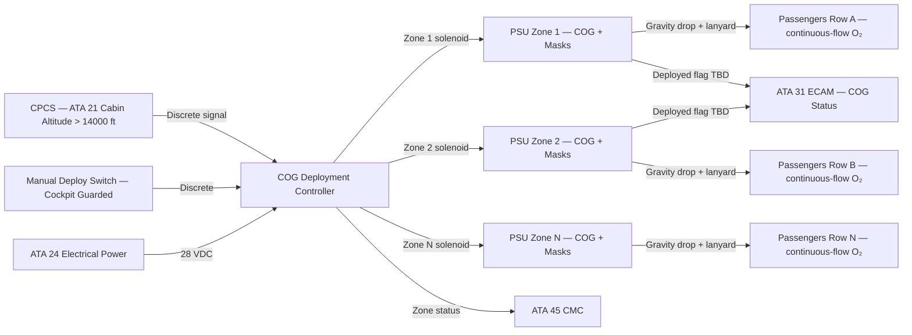
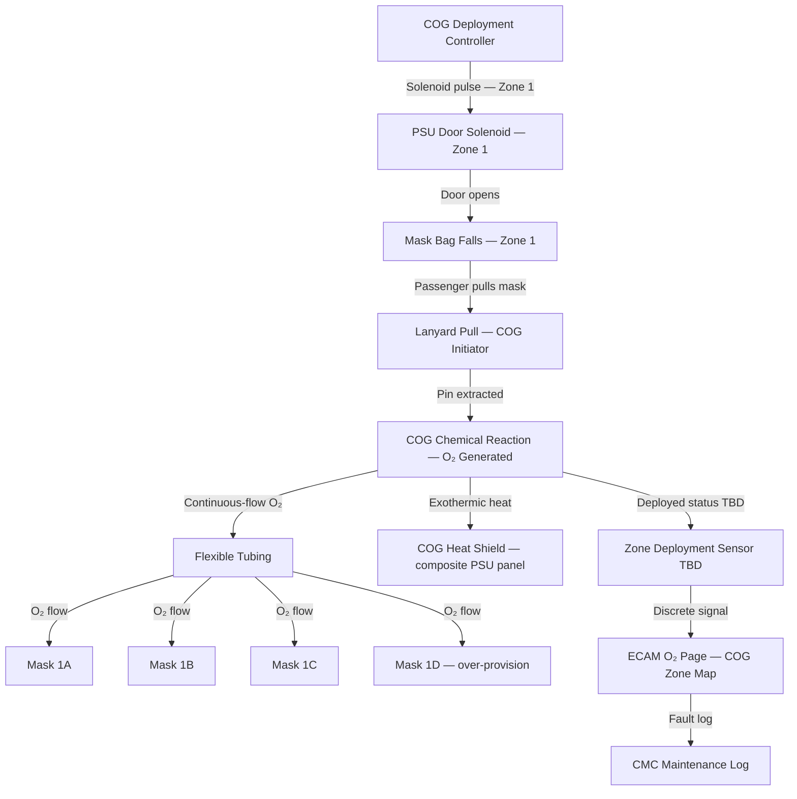

# 035-020 — Passenger Oxygen System
### [PROGRAMME-AIRCRAFT] [PROGRAMME-VARIANT] · ATA 35 · Q+ATLANTIDE ATLAS Scaffold

---

## §0 Hyperlink Policy

All internal links in this document use relative paths from the current directory. External regulatory and standards references use anchor links defined in [§20 References](#20-references). Links marked **TBD** indicate targets not yet allocated within the CSDB or ATLAS hierarchy. Programme-level links traverse five directory levels (`../../../../../`) to reach the repository root. No absolute URLs are used for internal navigation.

---

## §1 Purpose

This document defines the agnostic ATLAS standard-level architecture context for `035-020 — Passenger Oxygen System`.

It describes the controlled scope, functions, interfaces, safety considerations, lifecycle traceability, and S1000D/CSDB mapping logic that programme implementations shall instantiate when this node is applicable.

This document is not a programme design baseline. Programme-specific capacities, locations, part numbers, effectivity, operating limits, maintenance references, and data module codes shall be defined only inside the applicable programme implementation branch.
## §2 Applicability

| Applicability Level | Rule |
|---|---|
| Standard taxonomy | Applies to the ATLAS node `<NODE>` |
| Programme implementation | Conditional; determined by programme architecture, trade studies, certification basis, and applicability model |
| Product configuration | Defined in the programme-specific configuration baseline |
| Effectivity | Defined in the programme CSDB / applicability layer |
| Non-applicability | Must be explicitly stated in the programme impact-study branch when excluded |
## §3 System / Function Overview

The passenger oxygen system uses chemical oxygen generators (COG) — self-contained sodium chlorate candle devices — pre-installed in PSU overhead panels above each seat row. No high-pressure oxygen distribution lines are routed through the passenger cabin; each COG is a fully self-contained LRU.

On auto or manual deployment, an electrical signal releases the PSU door, allowing continuous-flow oro-nasal masks to fall from their stowed position. The passenger pulls the mask toward their face; the lanyard pull mechanically fires the COG initiator pin, starting the exothermic chlorate candle reaction and generating oxygen. Oxygen flows at continuous-flow rate through flexible tubing to the mask. The COG produces significant heat during the reaction; a heat shield around the COG unit is required within the composite PSU panel (TBD design).

Each PSU unit provides masks for 3 to 4 seat positions (over-provision ensures masks for all occupants including lap-held infants). COG duration: 12–15 minutes at rated flow (CS-25.1443). The cabin crew section PSU may use the same COG type (TBD) or may be served by portable PBE (035-030).

---

## §4 Scope

### 4.1 Included
- Chemical oxygen generators (COG) — one LRU per PSU row grouping
- PSU overhead panel door mechanism (spring/gravity drop door for mask deployment)
- Continuous-flow oro-nasal masks — 3–4 per COG unit
- Flexible oxygen tubing (mask to COG outlet)
- COG initiator / lanyard pull mechanism
- COG heat shield (within composite PSU panel — TBD design)
- Auto-deployment electrical circuit (COG solenoid trigger per zone)
- Manual deployment cockpit switch (with guard)
- COG deployment status indication (per zone or zonal aggregate — TBD)
- Cabin crew PSU oxygen provision (TBD — same COG type or PBE)

### 4.2 Excluded
- CPCS cabin altitude signal (ATA 21 — provides trigger only)
- PSU reading lights, call button, and ventilation — ATA 33 / ATA 21
- Portable breathing equipment (PBE) for cabin crew — 035-030
- ECAM display hardware — ATA 31
- CMC host platform — ATA 45
- Cabin structure and overhead panel structure — ATA 25

---

## §5 Architecture Description

- **Self-contained COG architecture**: Each COG unit is a self-contained LRU requiring no external high-pressure supply. The COG is pre-installed in the PSU panel with a shelf life defined by the manufacturer (typically 10–15 years for the chemical charge). COG units are replaced after each activation or at expiry.
- **Auto-deployment pathway**: CPCS (ATA 21) monitors cabin differential pressure and computes cabin altitude. When cabin altitude exceeds 14,000 ft, CPCS outputs a discrete signal to the COG deployment controller. The controller sends an electrical signal to all PSU zone solenoid release mechanisms simultaneously, opening all PSU doors. Mask bags containing continuous-flow masks fall by gravity/spring ejection.
- **Manual deployment pathway**: A guarded cockpit switch (location: overhead panel TBD) sends a direct discrete signal to the COG deployment controller, bypassing CPCS. Manual deployment is irreversible — all COG zones activated simultaneously. Individual zone selection not provided (TBD).
- **Lanyard activation**: Mask bags fall from the open PSU door. The passenger grabs the mask and pulls it toward their face. The pulling action draws the lanyard, which pulls the initiator pin from the COG, starting the chemical reaction. The reaction is irreversible; oxygen flows within TBD seconds of pin pull.
- **Heat management**: The sodium chlorate candle reaction generates significant heat (surface temperature may exceed 200°C TBD). A heat shield is required around each COG unit to prevent heat damage to composite CFRP PSU panel structure and overhead cabin lining. Heat shield design TBD (metallic baffle, thermal insulation blanket, or combination).
- **Over-provision**: CS-25.1447 requires masks for 10% more than the number of passenger seats. Each COG unit supplies 3–4 masks (row configuration TBD) to ensure coverage including lap-held infants and any additional occupant.

---

## §6 Functional Breakdown

| Function ID | Function Title | Description | Component |
|---|---|---|---|
| F-020-001 | Chemical O₂ Generation | Sodium chlorate candle produces O₂ via exothermic reaction; triggered by lanyard pin pull | COG unit (LRU) |
| F-020-002 | Auto-Deployment Trigger | Receive cabin altitude > 14,000 ft signal from CPCS; activate PSU door solenoids | COG deployment controller |
| F-020-003 | Manual Deployment Trigger | Cockpit switch sends deploy signal to controller | Manual deploy switch (guarded) |
| F-020-004 | PSU Door Release | Release PSU door on electrical signal; gravity / spring-eject mask bags | PSU door mechanism and solenoid |
| F-020-005 | Mask Dispensing | Continuous-flow masks in bag fall to accessible position for seated passenger | Mask bag and drop mechanism |
| F-020-006 | COG Initiation | Lanyard pull extracts initiator pin; starts COG reaction; O₂ flows within TBD sec | COG initiator / lanyard |
| F-020-007 | Continuous-Flow O₂ Delivery | Oxygen delivered at continuous-flow rate via flexible tubing to oro-nasal mask | COG outlet, flexible tubing, mask |
| F-020-008 | Heat Containment | Shield COG thermal energy from composite PSU panel structure and cabin lining | COG heat shield (TBD design) |
| F-020-009 | Deployment Status Indication | Signal to ECAM/CMC confirming PSU zone deployed (per zone or aggregate — TBD) | Zone deployment sensor (TBD) |
| F-020-010 | COG LRU Management | Replace COG unit after activation or at chemical expiry; expiry label management | COG LRU (maintenance function) |

---

## §7 System Context Diagram



---

## §8 Internal Functional Architecture



---

## §9 Lifecycle Traceability

```mermaid
flowchart LR
    LC02[LC02 Requirements Definition] --> LC03[LC03 Architecture Definition]
    LC03 --> LC05[LC05 Detailed Design]
    LC05 --> LC06[LC06 Verification Planning]
    LC06 --> LC10[LC10 Certification / Approval]
    LC10 --> LC11[LC11 Operation]
    LC11 --> LC12[LC12 Maintenance / Support]
    LC02 -->|CS-25.1441–1447; cabin altitude trigger; mask count over-provision| REQ[Pax O₂ Requirements]
    LC03 -->|COG type selection; PSU layout; zone wiring architecture| ARCH[Pax O₂ Architecture]
    LC05 -->|COG LRU spec; PSU panel heat shield design; deployment controller| DESIGN[Component Design Packages]
    LC06 -->|COG deployment test; mask drop test; duration test| VPLAN[Verification Plans]
    LC10 -->|CS-25.1441–1447 evidence; DO-160G; TSO-C78 (COG)| TC[TC Data — 035-20]
    LC11 -->|PAX O₂ deployment procedure; cabin crew PA script| OPS[Operations Data]
    LC12 -->|AMM 35-20; COG LRU replacement; expiry inspection| MAINT[Maintenance Data]
```

---

## §10 Interfaces

| Interface ID | System / Chapter | Interface Type | Data / Signal | Direction | Status |
|---|---|---|---|---|---|
| IF-035-20-001 | ATA 21 CPCS | Discrete (28 VDC) | Cabin altitude > 14,000 ft auto-deploy signal | ATA21 → ATA35 |  |
| IF-035-20-002 | ATA 24 Electrical Power | 28 VDC essential bus | Power for COG deployment controller and zone solenoids | ATA24 → ATA35 |  |
| IF-035-20-003 | ATA 31 ECAM | Discrete / bus TBD | COG deployed zone flags — ECAM O₂ page display | ATA35 → ATA31 |  |
| IF-035-20-004 | ATA 45 CMC | AFDX maintenance bus | COG zone deployment log, controller fault status | ATA35 → ATA45 |  |
| IF-035-20-005 | Cockpit overhead panel | Discrete 28 VDC | Manual COG deploy switch (guarded) | Crew → ATA35 |  |
| IF-035-20-006 | ATA 25 Cabin Interior | Physical | PSU panel integration — door mechanism, heat shield, structural interface | ATA35 / ATA25 |  |

---

## §11 Operating Modes

| Mode ID | Mode Name | Description | Entry Condition | Exit Condition |
|---|---|---|---|---|
| OM-020-001 | Armed / Standby | COG units installed and armed in PSU panels; PSU doors closed | Aircraft serviceable; COG in-date | Deployment signal or maintenance |
| OM-020-002 | Auto-Deploy | Deployment triggered by CPCS cabin altitude > 14,000 ft; all PSU doors open | CPCS auto signal | COG exhausted (~12–15 min) |
| OM-020-003 | Manual Deploy | Deployment triggered by crew cockpit switch; all PSU doors open | Crew manual switch activation | COG exhausted |
| OM-020-004 | COG Active | Chemical reaction ongoing; continuous-flow O₂ to all masks in activated zone(s) | COG initiator pin pulled by passenger | COG chemistry exhausted |
| OM-020-005 | COG Exhausted | COG chemical charge depleted; O₂ flow stops; unit must be replaced | ~12–15 min after initiation | COG LRU replaced before next flight |
| OM-020-006 | Ground Maintenance | COG zone status check; PSU door function test; COG expiry inspection | Ground power + maintenance access | Inspection/replacement complete |

---

## §12 Monitoring and Diagnostics

- **COG deployment status**: If zone deployment sensors are wired (TBD), a discrete signal per PSU zone confirms COG door open and/or COG initiated. Zone map displayed on ECAM O₂ page (crew facing). CMC log records deployment events with timestamp.
- **Controller integrity**: COG deployment controller performs power-on self-test. Controller fault generates CMC entry and ECAM advisory (TBD message text).
- **Expiry monitoring**: COG chemical shelf life typically 10–15 years (manufacturer specification). Maintenance programme tracks individual COG LRU expiry dates. CMC-based expiry tracking TBD (requires individual LRU serialisation and tracking in maintenance management system).
- **PSU door test**: Ground test (with COG safe pin installed) can verify PSU door solenoid function without activating COG. Test procedure TBD in AMM 35-20.
- **Manual deploy switch guard**: Physical guard on cockpit switch prevents inadvertent activation. Switch state monitored; inadvertent activation generates CMC advisory.
- **Post-deployment inspection**: After any COG activation, all activated PSU zones must have COG LRUs replaced before aircraft return to service. Heat shield inspection required.

---

## §13 Maintenance Concept

- **COG LRU replacement (line maintenance)**: After each activation or at expiry. Access PSU panel overhead (cabin interior). Remove spent COG unit (armed/safe pin verification — confirm safe before handling). Install new COG unit: verify expiry date, install safe pin, connect electrical trigger connector, close PSU door. Perform PSU door solenoid test (with safe pin). Update maintenance record with new COG serial number and expiry date.
- **Expiry inspection (scheduled)**: At each A-check or per maintenance programme interval. Inspect expiry label on each COG unit. Replace any COG at or approaching expiry.
- **PSU door mechanism inspection**: Inspect door hinge, spring, and solenoid mechanism at each C-check interval TBD. Replace damaged components.
- **Heat shield inspection**: After each COG activation and at scheduled interval. Inspect heat shield for deformation, burn-through, or delamination. Replace if damaged.
- **COG deployment circuit test**: Periodic test of deployment controller and solenoid continuity via CMC maintenance terminal. COG safe pin must be installed before any electrical activation test.
- **Record-keeping**: Each COG unit tracked by serial number. Activation events, replacement dates, and expiry dates recorded per aircraft maintenance management system.

---

## §14 S1000D / CSDB Mapping

### 14.1 SNS to DMC Mapping

| SNS Code | Subsubject Title | DMC Prefix | Info Codes Planned | DMRL Status |
|---|---|---|---|---|
| 035-20 | Passenger Oxygen System | DMC-<PROGRAMME>-<VARIANT>-035-20 | 040, 300, 400, 520, 720, 941 |  |

### 14.2 Data Module Breakdown — 035-20

| DM Code Suffix | Info Code | Data Module Title | Priority |
|---|---|---|---|
| -035-20-00-040A | 040 | Passenger Oxygen System — System Description | High |
| -035-20-00-300A | 300 | Passenger O₂ Deployment — Normal and Abnormal Procedures | High |
| -035-20-00-400A | 400 | Passenger Oxygen System — Maintenance Procedures | High |
| -035-20-00-520A | 520 | Passenger Oxygen System — Fault Isolation | Medium |
| -035-20-00-720A | 720 | COG LRU — Removal and Installation | High |
| -035-20-00-720B | 720 | PSU Door Mechanism — Removal and Installation | Medium |
| -035-20-00-941A | 941 | Passenger Oxygen System — Illustrated Parts Data | Medium |

---

## §15 Footprints

### 15.1 Physical Footprint
- COG units: installed in each PSU overhead panel throughout passenger cabin — one COG LRU per seat row group; total count TBD (function of cabin layout and seat rows)
- PSU panel door mechanism: integrated in cabin overhead panel structure — ATA 25 interface
- Continuous-flow masks: 3–4 per COG unit, stored in mask bag within PSU panel
- COG heat shield: metallic or composite thermal baffle within PSU panel — size and mass TBD
- COG deployment controller: location TBD (avionics bay or cabin overhead)

### 15.2 Electrical / Data Footprint
- COG deployment controller power: 28 VDC essential bus — current TBD
- Zone solenoid power: 28 VDC per zone solenoid — current per solenoid TBD; total inrush current at simultaneous all-zone activation TBD
- Zone deployment sensor wiring: discrete per zone if wired — TBD wire count

### 15.3 Maintenance Footprint
- COG replacement: line maintenance — cabin interior overhead access, no special tools
- PSU door mechanism replacement: line maintenance — cabin interior access
- Heat shield replacement: base maintenance if integral to PSU panel structure
- Ground test: CMC maintenance terminal — solenoid continuity test with safe pin installed

### 15.4 Data Footprint
- CMC deployment log: zone deployment events, timestamps, controller faults — TBD retention
- COG LRU tracking: serial numbers, expiry dates, installation dates — per aircraft maintenance management system

---

## §16 Safety and Certification Considerations

| Requirement | Source | Description | Compliance Approach | Status |
|---|---|---|---|---|
| CS-25.1441 | EASA CS-25 Subpart K | Oxygen for all passengers; supply requirements | COG quantity per seat; over-provision; duration qualification |  |
| CS-25.1443 | EASA CS-25 Subpart K | Minimum continuous-flow rate per passenger per altitude | COG flow rate qualification; 12–15 min duration test |  |
| CS-25.1445 | EASA CS-25 Subpart K | Equipment standards — TSO qualification | COG TSO-C78 qualification |  |
| CS-25.1447 | EASA CS-25 Subpart K | Mask over-provision (10% excess); mask accessibility | 3–4 masks per COG; mask reach verified for seated adult |  |
| CS-25.1451 | EASA CS-25 Subpart K | Fire protection — O₂ system materials | COG heat shield; mask and tubing material qualification |  |
| DO-160G | RTCA | Environmental qualification | COG deployment controller; zone solenoids |  |
| CS-25.858 | EASA CS-25 | Smoke detection cross-reference | PSU O₂ system not a fire ignition risk (COG heat shield required) |  |

---

## §17 Verification and Validation

| V&V ID | Requirement | Method | Success Criterion | Status |
|---|---|---|---|---|
| VV-035-20-001 | COG auto-deployment — CS-25.1441 | Simulate cabin altitude > 14,000 ft signal; verify all PSU zones activate | All PSU doors open; all mask bags deploy; COG initiates on lanyard pull |  |
| VV-035-20-002 | COG manual deployment — CS-25.1441 | Cockpit manual switch activation; verify all zones | Same as auto; manual switch bypass of CPCS verified |  |
| VV-035-20-003 | Passenger mask drop test — CS-25.1447 | Full cabin rig test: masks drop and reach seated adult position | Mask reaches seated adult position; tubing length sufficient |  |
| VV-035-20-004 | COG duration test — CS-25.1443 | Flow rate measurement over time; duration computation | O₂ flow ≥ minimum flow rate for ≥ 12 min (or 15 min TBD) |  |
| VV-035-20-005 | Mask over-provision count — CS-25.1447 | Count masks per COG unit per seat row | Masks ≥ 110% of maximum seat occupants in row |  |
| VV-035-20-006 | COG heat test | Measure PSU panel temperature during COG activation | Panel temperature below CFRP material limit at heat shield outer surface |  |
| VV-035-20-007 | Deployment status indication | Zone sensor monitoring during COG activation | Zone deployed flag appears on ECAM and CMC within TBD sec (if wired) |  |
| VV-035-20-008 | DO-160G environmental | DO-160G test suite for deployment controller and solenoids | All applicable categories passed |  |
| VV-035-20-009 | Cylinder hydrostatic test | Not applicable — no pressure cylinders in pax system | N/A — COG is self-contained chemical unit | N/A |
| VV-035-20-010 | COG shelf life qualification | COG supplier qualification data for chemical shelf life | COG functional after storage at TBD years per manufacturer data |  |

---

## §18 Glossary

| Term | Definition |
|---|---|
| COG | Chemical Oxygen Generator — a self-contained device producing oxygen by an exothermic chemical reaction (sodium chlorate candle); used in passenger PSU units |
| CPCS | Cabin Pressure Control System (ATA 21) — monitors cabin differential pressure and computes cabin altitude; provides auto-deploy signal to COG system at > 14,000 ft |
| continuous-flow mask | Oro-nasal oxygen mask receiving a constant flow of oxygen regardless of breathing cycle; used in passenger COG systems |
| deployment controller | Electronic unit receiving auto/manual deploy signals and controlling zone solenoids for PSU door release |
| heat shield | Thermal barrier (metallic or insulation blanket) surrounding COG unit to prevent heat damage to composite PSU panel and cabin structure |
| lanyard | A pull cord connecting the passenger mask to the COG initiator pin; pulling the mask extracts the pin and initiates the COG reaction |
| LRU | Line Replaceable Unit — component designed for rapid line-maintenance replacement without special workshop facilities |
| over-provision | Requirement of CS-25.1447 for 10% more masks than the number of passenger seats per oxygen unit; implemented as 3–4 masks per COG on [PROGRAMME-VARIANT] |
| PSU | Passenger Service Unit — overhead cabin panel above seat rows containing reading light, call button, ventilation outlet, and oxygen mask dispensing unit with COG |
| safe pin | A physical pin installed in the COG initiator before handling to prevent inadvertent activation during maintenance |
| sodium chlorate candle | The chemical compound used in COG units; when ignited, decomposes to produce oxygen and heat |
| TSO-C78 | FAA Technical Standard Order for chemical oxygen generators — qualification standard applicable per CS-25.1445 |
| zone | A group of PSU panels connected to a common deployment circuit; the granularity of deployment control and status monitoring |

---

## §19 Citations

| Citation ID | Source | Title | Relevance |
|---|---|---|---|
| CIT-035-20-001 | EASA | CS-25 Subpart K §25.1441–§25.1447 | Primary certification basis for passenger oxygen system |
| CIT-035-20-002 | RTCA | DO-160G Environmental Conditions and Test Procedures | Deployment controller and solenoid environmental qualification |
| CIT-035-20-003 | FAA | TSO-C78 — Chemical Oxygen Generators | COG unit qualification standard |
| CIT-035-20-004 | ASD-STAN | S1000D Issue 5.0 | CSDB mapping for ATA 35-20 |
| CIT-035-20-005 | EASA | CS-25.858 — Cargo compartment smoke detection | Cross-reference: COG heat shield requirement in composite structure |

---

## §20 References

| Ref ID | Document | Title | Link |
|---|---|---|---|
| REF-035-20-001 | CS-25.1441 | Oxygen equipment and supply — general | [EASA CS-25](#) |
| REF-035-20-002 | CS-25.1443 | Minimum mass flow — continuous-flow | [EASA CS-25](#) |
| REF-035-20-003 | CS-25.1445 | Equipment standards — TSO requirements | [EASA CS-25](#) |
| REF-035-20-004 | CS-25.1447 | Passenger mask over-provision | [EASA CS-25](#) |
| REF-035-20-005 | CS-25.1451 | Fire protection for oxygen equipment | [EASA CS-25](#) |
| REF-035-20-006 | CS-25.858 | Cargo compartment smoke detection | [EASA CS-25](#) |
| REF-035-20-007 | DO-160G | Environmental Conditions and Test Procedures | [RTCA](https://www.rtca.org/) |
| REF-035-20-008 | TSO-C78 | Chemical Oxygen Generators | [FAA](https://www.faa.gov/) |
| REF-035-20-009 | S1000D Issue 5.0 | International Specification for Technical Publications | [s1000d.org](https://s1000d.org/) |

---

## §21 Open Issues

| Issue ID | Description | Owner | Priority | Status |
|---|---|---|---|---|
| OI-035-20-001 | COG heat shield design in composite PSU panel — define heat shield material, geometry, and thermal analysis; confirm CFRP panel temperature remains below material limit during COG activation | Q-MECHANICS / Q-STRUCTURES | High |  |
| OI-035-20-002 | COG deployed sensor wiring per zone vs. zonal aggregate — confirm granularity of deployment monitoring; impact on wiring mass and ECAM display | Q-AIR / Q-DATAGOV | Medium |  |
| OI-035-20-003 | Number of PSU zones and masks per row — confirm cabin layout (seat rows, seat pitch, aisle count) and resulting COG unit count and mask count | Q-AIR / ORB-PMO | High |  |
| OI-035-20-004 | COG duration — confirm 12 or 15 min requirement per CS-25.1443 at cruise altitude; impact on COG chemical charge size | Q-AIR / ORB-LEG | High |  |
| OI-035-20-005 | Individual zone vs. all-zone manual deploy — evaluate whether partial manual zone deployment (e.g., first class only) is feasible or desirable; regulatory discussion required | Q-AIR / ORB-LEG | Low |  |
| OI-035-20-006 | Cabin crew PSU oxygen provision — confirm whether cabin crew stations use same COG type as passenger PSU or are covered exclusively by PBE (035-030) | Q-AIR / ORB-LEG | Medium |  |

---

## §22 Change Log

| Revision | Date | Author | Description |
|---|---|---|---|
| 0.1.0 | 2026-05-10 | Q+ATLANTIDE / Q-AIR | Initial full-template creation — all §0–§22 sections drafted; TBD items identified; open issues registered |
