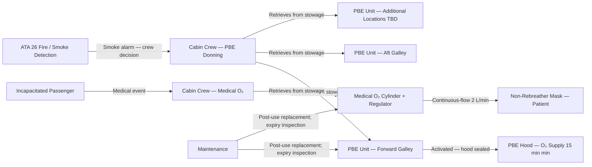
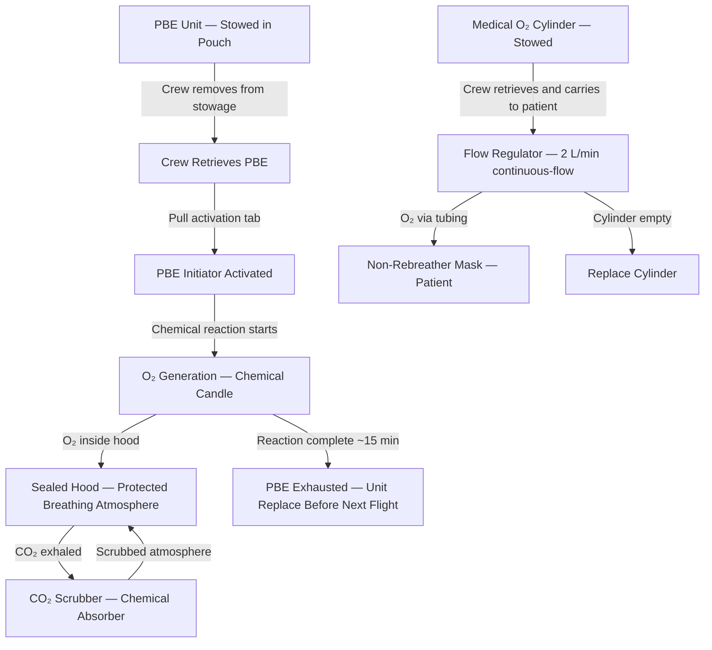
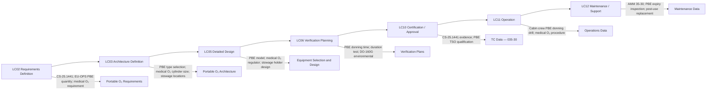

# 035-030 — Portable Oxygen Equipment
### AMPEL360e eWTW · ATA 35 · Q+ATLANTIDE ATLAS Scaffold

---

## §0 Hyperlink Policy

All internal links in this document use relative paths from the current directory. External regulatory and standards references use anchor links defined in [§20 References](#20-references). Links marked **TBD** indicate targets not yet allocated within the CSDB or ATLAS hierarchy. Programme-level links traverse five directory levels (`../../../../../`) to reach the repository root. No absolute URLs are used for internal navigation.

---

## §1 Purpose

This document describes the Portable Oxygen Equipment (ATA 35-30) as implemented on the AMPEL360e Wide Tube-and-Wing (eWTW) fully electric aircraft. It defines the types, quantities, locations, maintenance concept, and certification compliance of all portable oxygen equipment carried on board, including portable breathing equipment (PBE) for cabin crew response to smoke/fire events and medical supplemental oxygen for first-aid use.

Portable oxygen equipment is independent of the fixed crew and passenger oxygen systems. PBE units are self-contained chemical oxygen devices providing protective breathing for cabin crew during smoke or toxic fume events (minimum 15 minutes duration). Medical oxygen cylinders provide supplemental oxygen for incapacitated passengers. Quantities and stowage locations are determined by aircraft type, route, operator policy, and regulatory requirements (CS-25.1441 and applicable operational regulations).

---

## §2 Applicability

| Attribute | Value |
|---|---|
| Programme | AMPEL360e Wide Tube-and-Wing (eWTW) |
| ATA Subsubject | 035-30 — Portable Oxygen Equipment |
| PBE Type | Self-contained chemical PBE (smoke hood with O₂ supply) |
| PBE Duration | Minimum 15 min |
| Medical O₂ Type | Portable cylinder — 2 L/min flow rate; 24–36 min duration TBD |
| PBE Quantity | TBD (function of cabin crew count, route, authority requirement) |
| Medical O₂ Quantity | TBD (function of route, operator policy) |
| PBE Shelf Life | Typically 15 years (chemical shelf life — manufacturer specification) |
| Stowage Locations | Galley, forward cabin crew station, aft cabin crew station — TBD |
| Certification Basis | CS-25.1441; operational regulations (EU-OPS / FAR 121) |
| DO-160G | Environmental qualification — TBD applicability per unit type |
| S1000D SNS | 035-30 |
| Applicability Code | ALL (all eWTW aircraft in programme) |
| Effectivity | From MSN 001 |

---

## §3 System / Function Overview

Portable oxygen equipment on the AMPEL360e eWTW consists of two categories:

**Category A — Protective Breathing Equipment (PBE)**: Chemical PBE smoke hoods (self-contained chemical oxygen generator integrated with a hood that covers the head and provides protection against smoke, toxic fumes, and heat). Each PBE unit is a single-use device. When activated, the chemical reaction produces oxygen for a minimum of 15 minutes. Cabin crew don PBE units when responding to a fire, smoke, or toxic fume event. PBE quantity is determined by the number of cabin crew members plus regulatory requirements for concurrent use scenarios (CS-25.1441, EU-OPS/FAR 121 operational regulations — quantity TBD).

**Category B — Medical Supplemental Oxygen**: A portable gaseous oxygen cylinder with a continuous-flow mask and flow regulator for medical first-aid use. Provides supplemental oxygen to incapacitated passengers at 2 L/min (TBD flow rate). Duration: 24–36 minutes (TBD based on cylinder size). Quantity: TBD (typically 1–2 units per aircraft for ~100-seat configuration). Stowage location TBD (accessible to cabin crew).

All portable units are fully self-contained and have no interface with the fixed aircraft oxygen distribution system. Units are identified by serviceability labels and tracked in the maintenance programme.

---

## §4 Scope

### 4.1 Included
- Portable breathing equipment (PBE) — self-contained chemical smoke hoods, quantity TBD
- PBE stowage pouches/holders at designated cabin locations
- Medical supplemental oxygen cylinder(s), quantity TBD
- Medical O₂ continuous-flow mask and regulator (2 L/min flow — TBD)
- Serviceability labels and expiry tracking for all portable units
- Maintenance procedures for PBE and medical O₂ inspection, replacement, and record-keeping

### 4.2 Excluded
- Crew fixed oxygen system (high-pressure cylinder, QDM) — 035-010
- Passenger COG system — 035-020
- Fire detection and extinguishing — ATA 26 (triggers PBE use; interface is procedural only)
- Cabin crew station structure — ATA 25
- Pharmaceutical / first aid equipment (other than O₂ delivery) — outside ATA 35

---

## §5 Architecture Description

- **PBE independence**: PBE units have no electrical, pneumatic, or mechanical interface with aircraft systems. Each unit is a standalone self-contained device carried in a designated stowage pouch or holder. No installation wiring, connectors, or plumbing is required.
- **PBE chemical principle**: PBE units contain a chemical oxygen candle (sodium chlorate or potassium superoxide TBD) that generates oxygen on activation. Activation is by a mechanical initiator (pull-tab or squeeze-to-activate mechanism). The hood seals around the user's head, providing eye, face, and respiratory protection. Generated O₂ is breathed within the hood atmosphere; CO₂ is scrubbed by a chemical absorber.
- **Medical O₂ portability**: The medical oxygen cylinder is a small high-pressure cylinder (TBD material — aluminium or composite) with a built-in or attached demand/continuous-flow regulator. The continuous-flow regulator delivers oxygen via a non-rebreather mask to the patient. The cylinder is carried by cabin crew to the patient's seat.
- **Stowage architecture**: PBE units stowed at accessible locations near cabin crew work areas: forward galley, aft galley, and cabin crew rest area (if applicable — TBD). Medical O₂ cylinder stowed in a designated accessible location (TBD — typically forward galley or adjacent to first aid kit).
- **eWTW-specific notes**: No OBOGS or fixed portable O₂ panel is planned. PBE compatibility with DO-160G environmental conditions must be verified for altitude, temperature, and humidity categories applicable to on-board stowage.

---

## §6 Functional Breakdown

| Function ID | Function Title | Description | Unit |
|---|---|---|---|
| F-030-001 | Smoke / Fume Crew Protection | PBE provides head/respiratory protection in smoke or toxic fume event; minimum 15 min O₂ | Chemical PBE unit |
| F-030-002 | PBE O₂ Generation | Chemical reaction generates O₂ on PBE activation; provides breathing gas within sealed hood | PBE chemical generator |
| F-030-003 | CO₂ Scrubbing | Chemical absorber within PBE hood removes exhaled CO₂ from hood atmosphere | PBE internal scrubber |
| F-030-004 | Medical O₂ Supply | Supplemental O₂ for incapacitated or hypoxic passengers; continuous-flow via non-rebreather mask | Medical O₂ cylinder + regulator |
| F-030-005 | PBE Stowage | Pre-positioned PBE units at designated cabin crew stations | PBE stowage pouch/holder |
| F-030-006 | Medical O₂ Stowage | Pre-positioned medical O₂ cylinder at accessible cabin location | Medical O₂ stowage cradle/holder |
| F-030-007 | Serviceability Management | Expiry tracking, inspection, replacement of all portable units | Maintenance programme |
| F-030-008 | Usage Record | Post-event record of PBE activation, medical O₂ use — unit replacement before next flight | Maintenance record |

---

## §7 System Context Diagram

---

## §8 Internal Functional Architecture

---

## §9 Lifecycle Traceability

---

## §10 Interfaces

| Interface ID | System / Chapter | Interface Type | Data / Signal | Direction | Status |
|---|---|---|---|---|---|
| IF-035-30-001 | ATA 26 Fire Protection | Procedural | Smoke/fire detection alarm — crew decision to don PBE; no automated interface | ATA26 → Crew |  |
| IF-035-30-002 | ATA 25 Cabin Interior / Furnishings | Physical | PBE stowage pouches and medical O₂ holders mounted to cabin structure | ATA35 / ATA25 |  |
| IF-035-30-003 | Crew training (ops procedure) | Procedural | PBE donning drills; medical O₂ use procedures — no aircraft system interface | Operational | N/A |

---

## §11 Operating Modes

| Mode ID | Mode Name | Description | Entry Condition | Exit Condition |
|---|---|---|---|---|
| OM-030-001 | Stowed / Ready | PBE and medical O₂ stowed in designated locations; serviceability labels current | Aircraft serviceable; units in-date | Crew retrieval or maintenance |
| OM-030-002 | PBE Donned — Active | Cabin crew wearing activated PBE hood; chemical O₂ being produced; smoke/fire response | Crew activates PBE by pull-tab | PBE chemical exhausted (~15 min) |
| OM-030-003 | PBE Exhausted | PBE chemical reaction complete; unit must be replaced before next flight | ~15 min after activation | Replacement PBE installed |
| OM-030-004 | Medical O₂ Active | Cabin crew administering O₂ to patient; cylinder valve open; continuous-flow via mask | Crew opens cylinder valve | Cylinder empty or medical event resolved |
| OM-030-005 | Medical O₂ Empty | Cylinder depleted; unit must be replaced before next flight | Cylinder pressure at zero | Replacement cylinder installed |
| OM-030-006 | Ground Inspection | Periodic serviceability check; expiry label inspection; pressure check (medical O₂) | Scheduled maintenance | Inspection complete |

---

## §12 Monitoring and Diagnostics

- **No aircraft-integrated monitoring**: Portable equipment has no electrical interface with aircraft monitoring systems. All serviceability checks are visual inspections by maintenance or cabin crew.
- **PBE serviceability label**: Each PBE unit carries a serviceability label showing expiry date, serial number, and inspection status. Cabin crew perform a pre-flight check of each PBE label.
- **Medical O₂ pressure check**: Medical O₂ cylinder has an integrated pressure gauge. Pre-flight check by cabin crew or maintenance confirms cylinder is charged to operating pressure. Minimum pressure for continued service: TBD (typically > 50% of full charge).
- **Activation detection**: No automated detection of PBE activation. Post-event: cabin crew reports PBE use. Maintenance replaces unit and logs replacement.
- **Maintenance tracking**: Each PBE serial number and expiry date recorded in aircraft maintenance management system. Batch replacements managed as LRU consumable.
- **DO-160G stowage environment**: PBE stowage locations subject to aircraft vibration, temperature, and humidity cycles. PBE environmental qualification must cover on-board stowage conditions over the 15-year shelf life (TBD qualification evidence).

---

## §13 Maintenance Concept

- **PBE expiry inspection (pre-flight / scheduled)**: Visual check of expiry label. Replace any unit at or within TBD days of expiry. Log replacement in maintenance record with old unit serial number, new unit serial number, and expiry date.
- **PBE replacement after use**: After any PBE activation, replace that unit before next flight. Inspect stowage holder for damage. Log replacement.
- **Medical O₂ pressure check (pre-flight / scheduled)**: Read integrated gauge. Replace or refill cylinder if pressure < TBD. Regulator function check TBD.
- **Medical O₂ cylinder replacement / refill**: Replace cylinder unit (if disposable) or refill via certified O₂ filling station (TBD — disposable vs. refillable cylinder decision). Log replacement.
- **PBE stowage holder inspection**: Inspect at each A-check for damage, secure mounting, and accessibility. Replace if damaged.
- **DO-160G re-qualification**: If PBE model changes during programme, new unit requires DO-160G environmental qualification for on-board stowage conditions.

---

## §14 S1000D / CSDB Mapping

### 14.1 SNS to DMC Mapping

| SNS Code | Subsubject Title | DMC Prefix | Info Codes Planned | DMRL Status |
|---|---|---|---|---|
| 035-30 | Portable Oxygen Equipment | DMC-AMPEL360E-EWTW-035-30 | 040, 300, 400, 520, 720, 941 |  |

### 14.2 Data Module Breakdown — 035-30

| DM Code Suffix | Info Code | Data Module Title | Priority |
|---|---|---|---|
| -035-30-00-040A | 040 | Portable Oxygen Equipment — System Description | High |
| -035-30-00-300A | 300 | PBE — Donning and Operating Procedures | High |
| -035-30-00-300B | 300 | Medical Oxygen Cylinder — Operating Procedure | High |
| -035-30-00-400A | 400 | Portable O₂ Equipment — Inspection and Replacement | High |
| -035-30-00-520A | 520 | Portable O₂ Equipment — Fault Isolation (serviceability) | Low |
| -035-30-00-720A | 720 | PBE — Removal and Installation (stowage holder) | Medium |
| -035-30-00-720B | 720 | Medical O₂ Cylinder — Removal and Installation | Medium |
| -035-30-00-941A | 941 | Portable O₂ Equipment — Illustrated Parts Data | Medium |

---

## §15 Footprints

### 15.1 Physical Footprint
- PBE units: stowed at forward galley, aft galley, additional locations TBD — quantity TBD
- PBE stowage holders: wall-mounted brackets or integrated in galley panel — ATA 25 interface
- Medical O₂ cylinder: stowed at designated accessible location — TBD (typically forward galley)
- Mass: PBE unit typically 0.8–1.2 kg each; medical O₂ cylinder typically 1–3 kg — TBD per selected model

### 15.2 Electrical / Data Footprint
- No electrical interface for portable units
- No data bus connection
- Aircraft system impact: nil (portable, self-contained)

### 15.3 Maintenance Footprint
- PBE replacement: line maintenance — visual inspection, swap unit, log serial number
- Medical O₂ replacement: line maintenance — pressure check, swap cylinder
- No special tooling required for any portable O₂ unit
- Maintenance interval: pre-flight check (visual); scheduled replacement at expiry

### 15.4 Data Footprint
- Maintenance management system: PBE serial number, expiry date, installation date per stowage location
- Medical O₂ cylinder: serial number, fill date, pressure check record
- Activation log: post-event replacement records

---

## §16 Safety and Certification Considerations

| Requirement | Source | Description | Compliance Approach | Status |
|---|---|---|---|---|
| CS-25.1441 | EASA CS-25 Subpart K | Minimum portable O₂ equipment and PBE quantities | PBE quantity per CS-25.1441(d) and operational rules; TSO-qualified units |  |
| CS-25.1445 | EASA CS-25 Subpart K | Equipment standards — TSO qualification | PBE TSO-C116 (or equivalent); medical O₂ TSO-C105 or TSO-C89 |  |
| CS-25.858 | EASA CS-25 | Smoke detection — PBE required for cargo area response | Cargo area PBE provision per CS-25.858 (if applicable — eWTW cargo hold TBD) |  |
| DO-160G | RTCA | Environmental qualification — on-board stowage | PBE and medical O₂ environmental qualification for aircraft stowage conditions |  |
| EU-OPS / FAR 121 | EASA / FAA | Operational regulations — PBE quantity for cabin crew | PBE quantity per operational rules (TBD quantity determination) |  |

---

## §17 Verification and Validation

| V&V ID | Requirement | Method | Success Criterion | Status |
|---|---|---|---|---|
| VV-035-30-001 | PBE donning time | Cabin crew representative donning demonstration | PBE donned (hood sealed) within TBD sec; O₂ flow confirmed |  |
| VV-035-30-002 | PBE duration test — CS-25.1441 | Flow rate measurement; duration computation | O₂ supply ≥ 15 min at rated flow |  |
| VV-035-30-003 | PBE CO₂ scrubbing | CO₂ concentration measurement in hood during test | CO₂ < TBD % in hood during 15-min activation |  |
| VV-035-30-004 | Medical O₂ flow rate | Flow meter measurement at regulator outlet | Flow ≥ 2 L/min TBD at rated setting |  |
| VV-035-30-005 | Medical O₂ duration | Cylinder volume and flow rate calculation | Duration ≥ 24 min at 2 L/min (TBD) |  |
| VV-035-30-006 | PBE stowage accessibility | Physical demonstration: cabin crew retrieves PBE from stowage within TBD sec | Accessible without obstruction; label readable; holder releases correctly |  |
| VV-035-30-007 | DO-160G environmental | DO-160G categories applicable to on-board stowage | PBE and medical O₂ function correctly after environmental test |  |
| VV-035-30-008 | PBE shelf life qualification | Supplier qualification data; ageing test | PBE functional at end of stated shelf life (15 years TBD) |  |
| VV-035-30-009 | Cylinder hydrostatic test | Not applicable to medical O₂ (disposable or pre-qualified cylinder) | N/A per cylinder type (TBD) |  |

---

## §18 Glossary

| Term | Definition |
|---|---|
| CO₂ scrubber | Chemical absorber within PBE hood that removes exhaled carbon dioxide from the breathing atmosphere |
| continuous-flow mask | Non-rebreather oro-nasal mask delivering a constant oxygen flow; used with medical O₂ cylinder |
| DO-160G | RTCA environmental conditions and test procedures — applicable to on-board stowage conditions |
| EU-OPS | European Operations regulations for commercial air transport — specifies cabin crew PBE requirements |
| FAR 121 | US Federal Aviation Regulations Part 121 — commercial air operations; specifies PBE quantity requirements |
| LRU | Line Replaceable Unit — a component replaced at line maintenance; applicable to PBE and medical O₂ as consumable LRUs |
| PBE | Portable Breathing Equipment — self-contained chemical smoke hood providing head and respiratory protection plus O₂ supply for cabin crew; minimum 15 min duration |
| serviceability label | Label attached to each portable unit showing serial number, expiry date, and last inspection date |
| shelf life | The maximum storage period during which a chemical unit (PBE or COG) remains functional; typically 15 years for PBE chemical charge |
| TSO-C116 | FAA Technical Standard Order for crewmember protective breathing equipment (PBE) |

---

## §19 Citations

| Citation ID | Source | Title | Relevance |
|---|---|---|---|
| CIT-035-30-001 | EASA | CS-25 Subpart K §25.1441, §25.1445 | Portable O₂ and PBE certification requirements |
| CIT-035-30-002 | RTCA | DO-160G Environmental Conditions and Test Procedures | PBE on-board stowage environmental qualification |
| CIT-035-30-003 | FAA | TSO-C116 — Crewmember Protective Breathing Equipment | PBE qualification standard |
| CIT-035-30-004 | EASA | CS-25.858 — Cargo compartment smoke detection | PBE requirement cross-reference |
| CIT-035-30-005 | ASD-STAN | S1000D Issue 5.0 | CSDB mapping for ATA 35-30 |

---

## §20 References

| Ref ID | Document | Title | Link |
|---|---|---|---|
| REF-035-30-001 | CS-25.1441 | Oxygen equipment and supply — portable O₂ | [EASA CS-25](#) |
| REF-035-30-002 | CS-25.1445 | Equipment standards — TSO requirements | [EASA CS-25](#) |
| REF-035-30-003 | CS-25.858 | Cargo compartment smoke detection | [EASA CS-25](#) |
| REF-035-30-004 | DO-160G | Environmental Conditions and Test Procedures | [RTCA](https://www.rtca.org/) |
| REF-035-30-005 | TSO-C116 | Crewmember Protective Breathing Equipment | [FAA](https://www.faa.gov/) |
| REF-035-30-006 | TSO-C105 | Portable Oxygen Concentrators | [FAA](https://www.faa.gov/) |
| REF-035-30-007 | S1000D Issue 5.0 | International Specification for Technical Publications | [s1000d.org](https://s1000d.org/) |

---

## §21 Open Issues

| Issue ID | Description | Owner | Priority | Status |
|---|---|---|---|---|
| OI-035-30-001 | PBE quantity per aisle — determine required number of PBE units per CS-25.1441 and applicable operational rules (EU-OPS / FAR 121) for ~100-seat configuration | Q-AIR / ORB-LEG | Medium |  |
| OI-035-30-002 | Medical O₂ quantity and cylinder size — define number of medical O₂ cylinders; determine cylinder volume for 24–36 min duration at 2 L/min | Q-AIR / ORB-LEG | Medium |  |
| OI-035-30-003 | PBE model selection — confirm PBE type (chemical vs. compressed gas); TSO-C116 qualification; CO₂ scrubber performance; shelf-life specification | Q-AIR / ORB-PMO | High |  |
| OI-035-30-004 | Medical O₂ cylinder type — disposable vs. refillable; composite vs. aluminium cylinder; regulator type (continuous-flow vs. demand) | Q-MECHANICS / Q-AIR | Medium |  |
| OI-035-30-005 | Cargo hold PBE — confirm whether eWTW cargo hold access requires PBE per CS-25.858; cargo hold access procedure TBD | Q-AIR / ORB-LEG | Low |  |
| OI-035-30-006 | PBE stowage locations — finalise number and positions (forward galley, aft galley, over-wing TBD, jumpseats TBD) per cabin layout | Q-AIR / Q-MECHANICS | Medium |  |

---

## §22 Change Log

| Revision | Date | Author | Description |
|---|---|---|---|
| 0.1.0 | 2026-05-10 | Q+ATLANTIDE / Q-AIR | Initial full-template creation — all §0–§22 sections drafted; TBD items identified; open issues registered |
