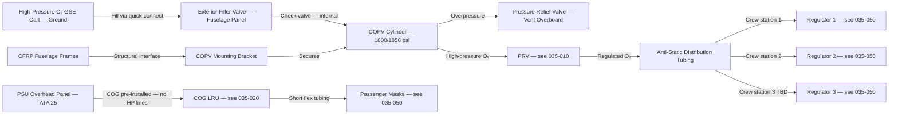
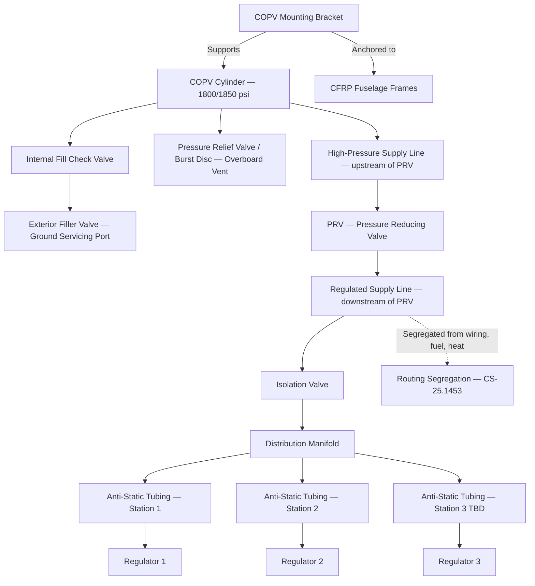
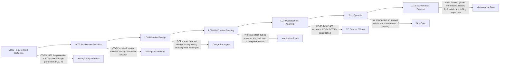

# 035-040 — Oxygen Storage and Distribution
### [PROGRAMME-AIRCRAFT] [PROGRAMME-VARIANT] · ATA 35 · Q+ATLANTIDE ATLAS Scaffold

---

## §0 Hyperlink Policy

All internal links in this document use relative paths from the current directory. External regulatory and standards references use anchor links defined in [§20 References](#20-references). Links marked **TBD** indicate targets not yet allocated within the CSDB or ATLAS hierarchy. Programme-level links traverse five directory levels (`../../../../../`) to reach the repository root. No absolute URLs are used for internal navigation.

---

## §1 Purpose

This document defines the agnostic ATLAS standard-level architecture context for `035-040 — Oxygen Storage and Distribution`.

It describes the controlled scope, functions, interfaces, safety considerations, lifecycle traceability, and S1000D/CSDB mapping logic that programme implementations shall instantiate when this node is applicable.

This document is not a programme design baseline. Programme-specific capacities, locations, part numbers, effectivity, operating limits, maintenance references, and data module codes shall be defined only inside the applicable programme implementation branch.
## §2 Applicability

| Applicability Level | Rule |
|---|---|
| Standard taxonomy | Applies to the ATLAS node `<NODE>` |
| Programme implementation | Conditional; determined by programme architecture, trade studies, certification basis, and applicability model |
| Product configuration | Defined in the programme-specific configuration baseline |
| Effectivity | Defined in the programme CSDB / applicability layer |
| Non-applicability | Must be explicitly stated in the programme impact-study branch when excluded |
## §3 System / Function Overview

Oxygen storage and distribution on the [PROGRAMME-AIRCRAFT] [PROGRAMME-VARIANT] comprises two architecturally distinct subsystems:

**Crew high-pressure storage and distribution**: One or more COPV cylinders store gaseous oxygen at 1800–1850 psi. The cylinder is stowed in the avionics bay or behind the flight deck rear bulkhead. Anti-static stainless or titanium tubing distributes oxygen from the cylinder through a pressure reducing valve and isolation valve to crew regulators at each flight deck station. The filler valve on the fuselage exterior allows ground servicing. A pressure relief valve vents the cylinder in the event of overpressure.

**Passenger COG storage (self-contained)**: Chemical oxygen generators (COG) are pre-installed in PSU overhead panels. No high-pressure oxygen lines are routed through the passenger cabin or overhead structure for the passenger system. Each COG is a self-contained chemical unit requiring only electrical wiring for deployment triggering (and optional status sensing). Distribution of oxygen from COG to passenger masks is via short flexible tubing within each PSU unit.

The absence of hydraulic systems on the [PROGRAMME-VARIANT] removes one of the primary fire risk scenarios (hydraulic fluid leak near oxygen tubing). However, routing segregation from electrical power wiring and fuel system components remains a CS-25.1453 compliance requirement.

---

## §4 Scope

### 4.1 Included
- COPV crew cylinder specification (material, liner, working pressure, volume, mass — TBD)
- Cylinder stowage location and structural mounting bracket (CFRP fuselage interface)
- Anti-static distribution tubing (material, diameter, routing, fittings)
- Distribution tubing supports and clamps
- Cylinder filler valve (exterior port) and internal fill check valve
- Pressure relief valve / burst disc specification
- Cylinder isolation and PRV (physical description; functional description in 035-010)
- Fuselage penetration for filler valve and tubing routing
- Stowage and distribution for no-LOX architecture
- COG stowage in PSU panels (physical integration with PSU structure — ATA 25 interface)

### 4.2 Excluded
- Crew system functional description and operation — 035-010
- Passenger COG deployment system — 035-020
- Portable equipment stowage — 035-030
- Exterior filler valve servicing procedures — 035-070
- Masks and regulators — 035-050
- Pressure indication and warning electronics — 035-060

---

## §5 Architecture Description

- **COPV cylinder design**: COPV consists of a metallic liner (aluminium or stainless TBD) overwrapped with carbon or aramid fibre composite. This provides a higher specific strength than all-metal cylinders — lighter weight for the same stored energy. Design and test per DOT or EN regulation for COPV pressure vessels. Hydrostatic test: 1.5× working pressure. Burst pressure: ≥ 2.0× working pressure (TBD per standard). Cylinder volume sized for minimum duration requirement at all crew positions simultaneously.
- **Structural mounting**: COPV cylinder mounted to a metallic bracket anchored to CFRP fuselage frames. Bracket material and attachment hardware TBD. Vibration and fatigue analysis required for composite fuselage interface. Axis orientation of COPV consistent with CG and structural load requirements.
- **Anti-static tubing**: Distribution tubing uses anti-static stainless steel or titanium to prevent static charge buildup in pure oxygen environment. Tubing fittings: AN or MS aerospace standard fittings. Pressure rating: ≥ 1.5× working pressure at all tubing sections upstream of PRV. Downstream sections (PRV to regulator): rated at regulated pressure + margin TBD. Tubing routing segregated from electrical wiring, fuel lines, and heat sources per CS-25.1453.
- **Filler valve architecture**: Single exterior filler valve on fuselage skin in a recessed ground servicing panel (location TBD — typically forward lower fuselage, accessible from ground). One-way (check valve function) prevents reverse flow. High-pressure quick-connect per GSE standard (TBD). Fill rate limited by fill valve orifice and GSE supply pressure.
- **Pressure relief**: Cylinder equipped with a pressure relief valve or burst disc rated to vent at a pressure above the maximum operating pressure but below the cylinder burst pressure. Vent routed overboard via fuselage penetration. Relief activation is a single-use irreversible event; cylinder must be removed from service.
- **Passenger COG architecture**: COG units are structural components of the PSU panels (ATA 25). No high-pressure lines enter the cabin. Each COG is mechanically connected to the mask dispensing bag. COG electrical trigger is a low-current solenoid signal. COG outlet is connected to short flexible tubing branches to each mask.
- **No LOX**: Liquid oxygen is not carried on the [PROGRAMME-VARIANT]. All stored oxygen is in gaseous form (high-pressure cylinders or self-contained chemical generators). No LOX-related cryogenic systems, insulated lines, or LOX servicing equipment.

---

## §6 Functional Breakdown

| Function ID | Function Title | Description | Component |
|---|---|---|---|
| F-040-001 | Crew O₂ Storage | Store high-pressure gaseous O₂ in COPV cylinder at 1800/1850 psi | COPV cylinder |
| F-040-002 | COPV Structural Integration | Mount COPV in aircraft structure via metallic bracket to CFRP fuselage frames | Mounting bracket, fasteners |
| F-040-003 | Cylinder Filling | Fill COPV via exterior filler valve from high-pressure GSE cart | Filler valve (exterior port) |
| F-040-004 | Overpressure Relief | Vent cylinder contents overboard in overpressure event | Pressure relief valve / burst disc |
| F-040-005 | Distribution Routing | Route regulated O₂ from PRV through anti-static tubing to crew stations | Distribution tubing, fittings, supports |
| F-040-006 | Tubing Structural Support | Support and secure distribution tubing against vibration and fatigue | Tubing clamps, brackets |
| F-040-007 | Segregation Compliance | Route oxygen tubing away from electrical wiring, fuel, and heat sources | Routing design per CS-25.1453 |
| F-040-008 | Passenger COG Storage | Pre-install COG LRUs in PSU overhead panels; no cabin high-pressure lines | COG unit in PSU (ATA 25 interface) |

---

## §7 System Context Diagram

---

## §8 Internal Functional Architecture

---

## §9 Lifecycle Traceability

---

## §10 Interfaces

| Interface ID | System / Chapter | Interface Type | Data / Signal | Direction | Status |
|---|---|---|---|---|---|
| IF-035-40-001 | ATA 035-010 (Crew O₂ System) | Physical | COPV cylinder, PRV, and tubing — physical system cross-reference | Internal |  |
| IF-035-40-002 | ATA 035-070 (Servicing) | Physical | Exterior filler valve — cross-reference for servicing procedures | Internal |  |
| IF-035-40-003 | ATA 25 Cabin Interior / Structure | Physical | COG LRU integration into PSU panel; PSU structural interface with fuselage | ATA35 / ATA25 |  |
| IF-035-40-004 | ATA 57 / Aircraft Structures | Physical | COPV mounting bracket — structural interface with CFRP fuselage frames | ATA35 / ATA57 |  |
| IF-035-40-005 | ATA 24 Electrical (routing) | Physical | Routing segregation — oxygen tubing segregated from 28 VDC and high-voltage wiring | CS-25.1453 compliance |  |
| IF-035-40-006 | GSE (Ground Servicing) | Mechanical / pneumatic | Exterior filler valve quick-connect interface for high-pressure O₂ GSE cart | GSE → ATA35 |  |

---

## §11 Operating Modes

| Mode ID | Mode Name | Description | Entry Condition | Exit Condition |
|---|---|---|---|---|
| OM-040-001 | Pressurised — Full Charge | COPV at nominal operating pressure 1800/1850 psi | Ground servicing complete | Cylinder depleted or depressurised |
| OM-040-002 | Pressurised — Partial Charge | Cylinder pressure below nominal; crew O₂ quantity reduced | Crew O₂ used; cylinder not refilled | Cylinder refilled to nominal |
| OM-040-003 | Depressurised | COPV at ambient pressure; system not serviceable for flight | Deliberate depressurisation or pressure relief activation | Cylinder refilled or replaced |
| OM-040-004 | Relief Event | Pressure relief valve / burst disc activated; cylinder venting overboard | Overpressure condition | Cylinder removed from service |
| OM-040-005 | Ground Servicing | COPV being filled via exterior filler valve and GSE cart | Ground servicing initiated | Fill complete; filler valve closed and secured |
| OM-040-006 | Cylinder Removed | COPV removed from aircraft (hydrostatic test or replacement) | Maintenance task initiated | Reinstalled cylinder and leak test |

---

## §12 Monitoring and Diagnostics

- **Pressure monitoring**: Dual pressure transducers on the cylinder monitor stored gas quantity (described in 035-060). No separate monitoring function in 035-040.
- **Tubing integrity**: No automated leak detection for tubing. Periodic leak test (visual + sniffer / pressure decay) per AMM maintenance task. Leak test interval TBD (typically at cylinder hydrostatic test and at any fitting disturbance).
- **Structural inspection**: COPV mounting bracket and fuselage interface inspected at scheduled interval (C-check TBD). Look for signs of corrosion, fretting, or loose fasteners.
- **Filler valve inspection**: Inspect at each A-check. Check dust cap installed; check for corrosion, damaged thread, or O-ring deterioration.
- **Relief valve/burst disc**: Non-testable in service (activation is irreversible). Replace at manufacturer-specified interval or after any relief event. Inspect vent outlet on fuselage skin for blockage.
- **Routing inspection**: Visual inspection of tubing routing and supports at each C-check TBD. Check for chafing, missing clamps, or contact with other systems.

---

## §13 Maintenance Concept

- **COPV cylinder replenishment**: Line maintenance — exterior filler valve. Connect GSE high-pressure O₂ cart. Fill to nominal pressure (1800/1850 psi TBD). Verify pressure on cockpit ECAM. Close and secure filler valve cap.
- **COPV cylinder removal (base maintenance)**: Access avionics bay or flight deck rear compartment. Depressurise system (bleed-off valve TBD). Disconnect fill valve, PRV inlet, pressure transducer connections. Remove bracket fasteners. Extract cylinder. Reverse for installation. Post-installation: leak test, pressure check.
- **COPV hydrostatic test**: At regulatory interval (TBD — typically 5 years). Remove cylinder. Workshop hydrostatic test at 1.5× working pressure. Re-stamp, record, return to service, or retire if failed.
- **Tubing inspection and replacement**: Visual inspection at C-check. Replace any section showing corrosion, kinking, or chafing damage. Re-leak test after any tubing replacement. All fittings torqued to specification; torque stripe applied.
- **Filler valve replacement**: Remove fuselage access panel. Remove old valve (depressurise first). Install new valve; leak test. Close panel.
- **COG LRU (in PSU)**: Replacement described in 035-020. PSU structural interface with fuselage is an ATA 25 maintenance task; ATA 35 maintenance covers COG LRU only.

---

## §14 S1000D / CSDB Mapping

### 14.1 SNS to DMC Mapping

| SNS Code | Subsubject Title | DMC Prefix | Info Codes Planned | DMRL Status |
|---|---|---|---|---|
| 035-40 | Oxygen Storage and Distribution | DMC-<PROGRAMME>-<VARIANT>-035-40 | 040, 300, 400, 520, 720 |  |

### 14.2 Data Module Breakdown — 035-40

| DM Code Suffix | Info Code | Data Module Title | Priority |
|---|---|---|---|
| -035-40-00-040A | 040 | Oxygen Storage and Distribution — System Description | High |
| -035-40-00-400A | 400 | Crew O₂ Cylinder — Inspection and Replenishment | High |
| -035-40-00-400B | 400 | O₂ Distribution Tubing — Inspection and Leak Test | High |
| -035-40-00-520A | 520 | Oxygen Storage System — Fault Isolation | Medium |
| -035-40-00-720A | 720 | COPV Cylinder — Removal and Installation | High |
| -035-40-00-720B | 720 | Exterior Filler Valve — Removal and Installation | Medium |

---

## §15 Footprints

### 15.1 Physical Footprint
- COPV cylinder(s): avionics bay / flight deck rear compartment — volume TBD; mass TBD (typically 5–12 kg per cylinder); water capacity TBD litre
- Mounting bracket: metallic (aluminium or titanium TBD) — mass TBD
- Distribution tubing: total length TBD; outer diameter TBD; routes from avionics bay to flight deck
- Filler valve: recessed fuselage exterior panel — TBD location (forward lower fuselage)
- Pressure relief valve: mounted on cylinder — mass TBD
- PSU COG integration: within PSU panel volume — no additional dedicated storage volume

### 15.2 Electrical / Data Footprint
- No electrical interface for storage and distribution components (COPV, tubing, filler valve, PRV, relief valve are passive mechanical)
- Pressure transducers electrical interface — see 035-060

### 15.3 Maintenance Footprint
- Cylinder replenishment: line maintenance — exterior filler valve, GSE O₂ cart, ~TBD min per service
- Cylinder removal/installation: base maintenance — avionics bay access
- Hydrostatic test: shop — 5-year interval TBD
- Tubing inspection: C-check interval TBD
- Ground support equipment: high-pressure O₂ servicing cart; torque wrench; leak detector (sniffer); pressure gauge

### 15.4 Data Footprint
- Cylinder test record: hydrostatic test date, test pressure, result, re-stamp date
- Cylinder service record: fill date, pressure before fill, pressure after fill, technician
- Tubing inspection record: date, finding, action taken

---

## §16 Safety and Certification Considerations

| Requirement | Source | Description | Compliance Approach | Status |
|---|---|---|---|---|
| CS-25.1451 | EASA CS-25 Subpart K | Fire protection — O₂ equipment and materials | Fire-resistant cylinder, tubing, and fitting materials; no ignitable material in proximity |  |
| CS-25.1453 | EASA CS-25 Subpart K | Protection from damage — segregation from fuel, hydraulic, heat, and mechanical damage | Routing design; no hydraulics on [PROGRAMME-VARIANT]; fuel segregation; heat source clearance |  |
| COPV regulation | DOT / EN / EASA | COPV pressure vessel design, test, and qualification | COPV per DOT CFFC or EN 12257 or applicable EASA-approved standard; burst test |  |
| DO-160G | RTCA | Environmental qualification — not directly applicable to passive components | Passive components (cylinder, tubing) — material qualification; fittings DO-160G where electronics present |  |
| CS-25.1441 | EASA CS-25 Subpart K | Adequate supply — cylinder sizing | Cylinder volume sufficient for minimum required duration at all crew simultaneously |  |

---

## §17 Verification and Validation

| V&V ID | Requirement | Method | Success Criterion | Status |
|---|---|---|---|---|
| VV-035-40-001 | COPV hydrostatic burst test | Hydrostatic test at 1.5× working pressure | No deformation, leakage, or rupture |  |
| VV-035-40-002 | System leak test — CS-25.1453 | Pressurised distribution system; sniffer / pressure decay | No detectable O₂ leak at all fittings and connections |  |
| VV-035-40-003 | Routing segregation inspection — CS-25.1453 | Physical inspection of tubing routing vs. electrical wiring, fuel, heat source clearances | Minimum clearance satisfied at all locations per design specification |  |
| VV-035-40-004 | COPV structural mount — vibration | Vibration test on mounting bracket assembly | No structural failure or loosening at design vibration load spectrum |  |
| VV-035-40-005 | Filler valve function | Fill cycle test: connect GSE, fill to nominal, disconnect | Fill to nominal pressure; no leakage after disconnection; check valve prevents reverse flow |  |
| VV-035-40-006 | Pressure relief valve actuation | Proof test at rated relief pressure (bench test) | Valve opens at rated pressure ± TBD %; closes (or bursts disc irreversibly) as designed |  |
| VV-035-40-007 | Tubing pressure rating | Hydrostatic pressure test of distribution tubing assembly | No deformation or leakage at 1.5× rated working pressure |  |
| VV-035-40-008 | Cylinder hydrostatic test (periodic) | Per DOT/EN at 5-year interval TBD | No deformation/leakage; re-stamp accepted by authority |  |

---

## §18 Glossary

| Term | Definition |
|---|---|
| anti-static tubing | Oxygen distribution tubing manufactured from conductive material (stainless steel or titanium) to prevent electrostatic charge accumulation in a pure-oxygen environment |
| burst disc | A single-use pressure relief device that ruptures at a specified pressure; non-resettable; cylinder must be removed from service after activation |
| COPV | Composite Overwrap Pressure Vessel — lightweight high-pressure cylinder with metallic liner and composite fibre overwrap |
| CS-25.1451 | EASA certification requirement for fire protection of oxygen equipment and materials |
| CS-25.1453 | EASA certification requirement for protection of oxygen equipment from damage (segregation from fuel, hydraulic, heat, and mechanical hazards) |
| filler valve | A one-way high-pressure valve on the aircraft exterior for ground servicing replenishment of the crew oxygen cylinder |
| hydrostatic test | Proof pressure test of a pressure vessel using liquid (typically water) at 1.5× working pressure to verify structural integrity |
| LOX | Liquid Oxygen — cryogenically stored oxygen; not used on the [PROGRAMME-AIRCRAFT] [PROGRAMME-VARIANT] |
| PRV | Pressure Reducing Valve — passive mechanical device reducing high-pressure cylinder output to regulator supply level |
| pressure relief valve | A spring-loaded valve that opens automatically when cylinder pressure exceeds its set point, venting oxygen overboard |
| routing segregation | Physical separation of oxygen distribution tubing from other aircraft systems (electrical wiring, fuel, hydraulic, heat sources) per CS-25.1453 |

---

## §19 Citations

| Citation ID | Source | Title | Relevance |
|---|---|---|---|
| CIT-035-40-001 | EASA | CS-25 §25.1451 — Fire protection for oxygen equipment | Material and fire resistance requirements for O₂ storage and distribution |
| CIT-035-40-002 | EASA | CS-25 §25.1453 — Protection of oxygen equipment from damage | Routing segregation requirements |
| CIT-035-40-003 | DOT/PHMSA | 49 CFR Part 180 — COPV pressure vessel regulations | COPV design, test, and qualification standard (US) |
| CIT-035-40-004 | EASA | CS-25 §25.1441 — Oxygen supply quantity | Cylinder sizing requirements |
| CIT-035-40-005 | ASD-STAN | S1000D Issue 5.0 | CSDB mapping for ATA 35-40 |

---

## §20 References

| Ref ID | Document | Title | Link |
|---|---|---|---|
| REF-035-40-001 | CS-25.1441 | Oxygen equipment and supply | [EASA CS-25](#) |
| REF-035-40-002 | CS-25.1451 | Fire protection for oxygen equipment | [EASA CS-25](#) |
| REF-035-40-003 | CS-25.1453 | Protection of oxygen equipment from damage | [EASA CS-25](#) |
| REF-035-40-004 | DO-160G | Environmental Conditions and Test Procedures | [RTCA](https://www.rtca.org/) |
| REF-035-40-005 | DOT 49 CFR 180 | Continuing qualification and maintenance of packagings (COPV) | [US DOT](#) |
| REF-035-40-006 | EN 12257 | Transportable gas cylinders — composite cylinders and tubes | [CEN](#) |
| REF-035-40-007 | S1000D Issue 5.0 | International Specification for Technical Publications | [s1000d.org](https://s1000d.org/) |

---

## §21 Open Issues

| Issue ID | Description | Owner | Priority | Status |
|---|---|---|---|---|
| OI-035-40-001 | COPV vs. steel/aluminium — confirm cylinder material; liner type; composite overwrap specification (carbon or aramid); applicable design standard (DOT CFFC, EN 12257, or other) | Q-MECHANICS / ORB-PMO | High |  |
| OI-035-40-002 | COPV structural integration with CFRP fuselage — confirm mounting bracket material (aluminium/titanium), attachment method, vibration and fatigue analysis; galvanic corrosion protection TBD | Q-MECHANICS / Q-STRUCTURES | High |  |
| OI-035-40-003 | Tubing material and routing — confirm stainless vs. titanium; confirm complete routing path; minimum clearance from electrical wiring and fuel system; routing drawing TBD | Q-MECHANICS / Q-AIR | High |  |
| OI-035-40-004 | Filler valve location — confirm exterior fuselage panel location (forward lower fuselage TBD); assess ground crew accessibility; GSE quick-connect standard selection | Q-MECHANICS / Q-GREENTECH | Medium |  |
| OI-035-40-005 | Cylinder count — single vs. dual COPV; impact on weight, volume, and redundancy; regulatory discussion for single-cylinder architecture with isolation valve | Q-AIR / ORB-LEG | Medium |  |
| OI-035-40-006 | Cylinder volume and working pressure — confirm 1800 vs. 1850 psi; confirm cylinder water capacity to meet duration requirement; trade study vs. COPV outer diameter | Q-AIR / Q-MECHANICS | High |  |

---

## §22 Change Log

| Revision | Date | Author | Description |
|---|---|---|---|
| 0.1.0 | 2026-05-10 | Q+ATLANTIDE / Q-AIR | Initial full-template creation — all §0–§22 sections drafted; TBD items identified; open issues registered |
