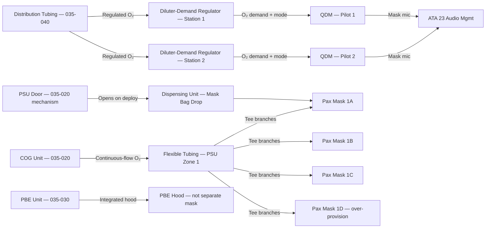
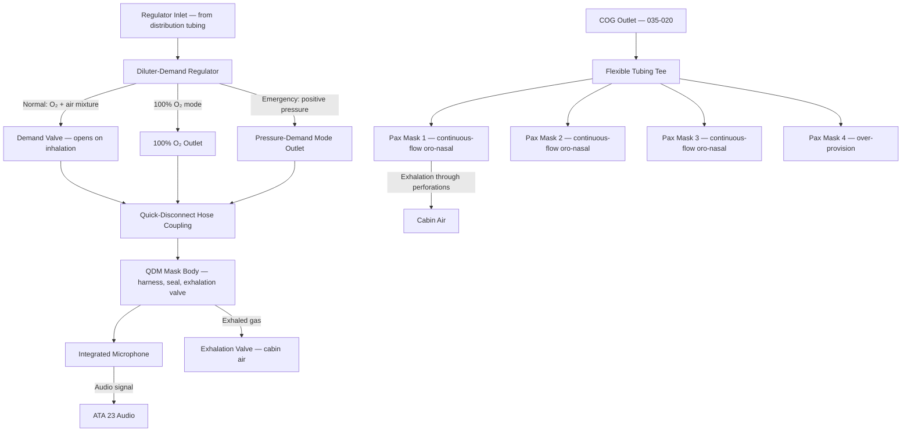
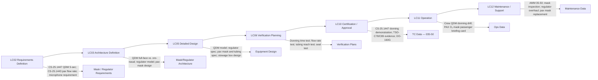

# 035-050 — Oxygen Masks, Regulators, and Dispensing Units
### [PROGRAMME-AIRCRAFT] [PROGRAMME-VARIANT] · ATA 35 · Q+ATLANTIDE ATLAS Scaffold

---

## §0 Hyperlink Policy

All internal links in this document use relative paths from the current directory. External regulatory and standards references use anchor links defined in [§20 References](#20-references). Links marked **TBD** indicate targets not yet allocated within the CSDB or ATLAS hierarchy. Programme-level links traverse five directory levels (`../../../../../`) to reach the repository root. No absolute URLs are used for internal navigation.

---

## §1 Purpose

This document defines the agnostic ATLAS standard-level architecture context for `035-050 — Oxygen Masks, Regulators, and Dispensing Units`.

It describes the controlled scope, functions, interfaces, safety considerations, lifecycle traceability, and S1000D/CSDB mapping logic that programme implementations shall instantiate when this node is applicable.

This document is not a programme design baseline. Programme-specific capacities, locations, part numbers, effectivity, operating limits, maintenance references, and data module codes shall be defined only inside the applicable programme implementation branch.
## §2 Applicability

| Applicability Level | Rule |
|---|---|
| Standard taxonomy | Applies to the ATLAS node `<NODE>` |
| Programme implementation | Conditional; determined by programme architecture, trade studies, certification basis, and applicability model |
| Product configuration | Defined in the programme-specific configuration baseline |
| Effectivity | Defined in the programme CSDB / applicability layer |
| Non-applicability | Must be explicitly stated in the programme impact-study branch when excluded |
## §3 System / Function Overview

Three categories of oxygen mask and regulator equipment are fitted to the [PROGRAMME-AIRCRAFT] [PROGRAMME-VARIANT]:

**Category 1 — Crew QDM and Diluter-Demand Regulator**: At each flight deck crew station, a quick-donning mask (QDM) is stowed in a readily accessible stowage box. The QDM is connected via a quick-disconnect hose to a diluter-demand regulator. The regulator provides altitude-compensated oxygen/air mixture in normal mode, 100% oxygen on crew selection, and positive-pressure oxygen in emergency/pressure-demand mode. The QDM must be donned one-handed within 5 seconds per CS-25.1447. The mask incorporates an integrated microphone for voice communications (ATA 23 interface). Full-face or oro-nasal QDM type: TBD.

**Category 2 — Passenger PSU Dispensing Unit and Continuous-Flow Masks**: Each PSU overhead panel contains a dispensing unit (mask bag, tubing, and COG outlet connection). On COG deployment, the PSU door opens and the mask bag falls to an accessible position. The passenger pulls the mask from the bag and places it over nose and mouth; pulling triggers the COG initiator lanyard. Oxygen flows continuously from the COG through flexible tubing to the mask at a regulated flow rate per CS-25.1443. Mask design is lightweight oro-nasal. Tubing length is sufficient for a seated adult of standard height plus a lap-held infant.

**Category 3 — Portable PBE Integrated Hood**: The portable breathing equipment (PBE) used by cabin crew includes an integrated hood that covers the entire head, providing respiratory, eye, and facial protection from smoke and fumes. The hood is not a separate mask; it is part of the PBE unit assembly (see 035-030).

---

## §4 Scope

### 4.1 Included
- Crew QDM stowage box and mask assembly (hose, harness, exhalation valve, microphone)
- Crew diluter-demand regulator (inlet from distribution tubing; outlet to QDM hose)
- Crew quick-disconnect hose coupling (mask-to-regulator connection)
- Passenger continuous-flow oro-nasal mask (bag, mask body, elastic harness)
- Passenger flexible tubing (COG outlet to mask tee connector)
- PSU dispensing unit (mask bag stowage, door mechanism, tubing routing within PSU)
- Crew QDM oxygen mask microphone (ATA 23 interface)
- PBE hood (described in 035-030; cross-referenced here)

### 4.2 Excluded
- Crew oxygen cylinder, PRV, isolation valve — 035-010 and 035-040
- Passenger COG units — 035-020
- PBE chemical O₂ generator — 035-030
- PSU structural panel (door hinge, solenoid) — 035-020 and ATA 25
- Communications audio management — ATA 23 (interface only)
- ECAM and CAS displays — ATA 31

---

## §5 Architecture Description

- **Crew QDM architecture**: The QDM is stored in a net-enclosed stowage box at each crew station. The mask harness is a net or strap type enabling one-handed donning. The mask body (full-face or oro-nasal TBD) provides an airtight seal against the face. The mask exhalation valve vents exhaled gas to cabin. A quick-disconnect coupling at the mask hose allows the crew member to disconnect the mask from the regulator for mobility (short duration).
- **Diluter-demand regulator architecture**: The regulator mounts at each crew station and connects to the distribution tubing inlet. The regulator contains: a demand valve (opens on inhalation); a diluter valve (blends cabin air with O₂ at altitudes below TBD); a 100% O₂ mode selector; and an emergency pressure-demand mode selector (delivers positive pressure). The regulator microphone port connects to the ATA 23 audio system for voice communications.
- **Passenger dispensing unit architecture**: Within each PSU, the COG outlet connects to a flexible tubing tee that branches to 3–4 mask outlets. Each outlet has a mask bag containing the continuous-flow mask. The mask bag is held by a spring-clip within the PSU door. On door opening, masks fall freely. Tubing length: sufficient for seated adult (TBD — typically 50–75 cm from PSU to mouth level).
- **Passenger mask design**: Lightweight oro-nasal construction. Elastic harness secures mask to face. No demand valve — oxygen flows continuously from COG via tubing. Exhalation through mask body perforations or valve (TBD). Design ensures adequate seal without tight harness tension (passenger comfort for 12–15 min duration).
- **DO-160G compatibility**: Crew regulators and QDM masks subject to DO-160G environmental qualification. Passenger masks and tubing must survive stowage environment (temperature cycling, humidity) over aircraft service life. Qualification evidence TBD.

---

## §6 Functional Breakdown

| Function ID | Function Title | Description | Component |
|---|---|---|---|
| F-050-001 | Crew QDM Stowage | Store QDM mask ready for rapid one-handed donning at each crew station | QDM stowage box, net enclosure |
| F-050-002 | Crew Mask Donning | One-handed donning within 5 sec; airtight seal; harness secures mask | QDM harness and mask body |
| F-050-003 | Crew O₂ Delivery — Dilution | Diluter-demand regulator delivers altitude-compensated O₂/air to QDM | Diluter-demand regulator — dilution mode |
| F-050-004 | Crew O₂ Delivery — 100% | Regulator delivers 100% O₂ on crew selection | Diluter-demand regulator — 100% mode |
| F-050-005 | Crew O₂ Delivery — Pressure-Demand | Positive-pressure O₂ in emergency mode; prevents cabin air inhalation | Diluter-demand regulator — pressure-demand mode |
| F-050-006 | Crew Voice Communications | O₂ mask microphone connected to ATA 23 audio management unit | Mask microphone |
| F-050-007 | Passenger Mask Dispensing | Mask bags fall from PSU panel on COG deployment | PSU dispensing unit, mask bag |
| F-050-008 | Passenger O₂ Delivery | Continuous-flow O₂ from COG via flexible tubing to oro-nasal mask | Flexible tubing, continuous-flow mask |
| F-050-009 | Passenger Mask Accessibility | Tubing length and mask position ensure accessibility for seated adult and lap infant | Tubing length, mask bag drop geometry |
| F-050-010 | PBE Hood (Cross-Ref) | Integrated protective hood on PBE unit — see 035-030 | PBE unit (035-030) |

---

## §7 System Context Diagram

---

## §8 Internal Functional Architecture

---

## §9 Lifecycle Traceability

---

## §10 Interfaces

| Interface ID | System / Chapter | Interface Type | Data / Signal | Direction | Status |
|---|---|---|---|---|---|
| IF-035-50-001 | ATA 035-010 (Crew O₂ System) | Physical / pneumatic | Crew distribution tubing outlet → regulator inlet | ATA35-40 → ATA35-50 |  |
| IF-035-50-002 | ATA 035-020 (Pax O₂ System) | Physical / pneumatic | COG outlet → flexible tubing → pax masks | ATA35-20 → ATA35-50 |  |
| IF-035-50-003 | ATA 23 Communications | Analog electrical | Crew O₂ mask microphone to audio management unit | ATA35 → ATA23 |  |
| IF-035-50-004 | ATA 25 Cabin Interior | Physical | PSU dispensing unit structural integration with PSU panel | ATA35 / ATA25 |  |
| IF-035-50-005 | ATA 035-030 (Portable PBE) | Cross-reference | PBE integrated hood — documented in 035-030 | Cross-ref | N/A |

---

## §11 Operating Modes

| Mode ID | Mode Name | Description | Entry Condition | Exit Condition |
|---|---|---|---|---|
| OM-050-001 | Crew Mask Stowed | QDM in stowage box; regulator connected to supply; masks ready for donning | System serviceable; aircraft powered | Crew donning or maintenance |
| OM-050-002 | Crew Mask Donned — Dilution | QDM donned one-handed; regulator in normal dilution mode; breathing mix | Crew dons QDM; selects NORMAL | Mask removed |
| OM-050-003 | Crew Mask Donned — 100% O₂ | Crew selects 100% on regulator; pure oxygen delivered to mask | 100% selection by crew | Mode reset or mask removed |
| OM-050-004 | Crew Mask Donned — Pressure-Demand | Positive pressure O₂; emergency mode; smoke protection | Emergency selection by crew | Mode reset or mask removed |
| OM-050-005 | Passenger Masks Dispensed | PSU door open; mask bags fallen; masks accessible to passengers | COG deployment (auto or manual) | COG exhausted |
| OM-050-006 | Passenger Masks In Use | Passengers wearing continuous-flow masks; O₂ flowing from COG | Lanyard pulled by passenger | COG exhausted |
| OM-050-007 | Ground Maintenance — Mask Inspection | Crew or pax mask inspection; regulator overhaul | Scheduled maintenance | Inspection/overhaul complete |

---

## §12 Monitoring and Diagnostics

- **Crew QDM seal inspection**: Visual inspection at each A-check for mask seal condition, harness integrity, exhalation valve, and microphone lead. Replace seal or complete mask if damaged.
- **Regulator functional test**: At scheduled overhaul interval (TBD). Bench test: verify dilution ratio at multiple altitude settings; 100% O₂ mode; pressure-demand mode pressure output. Replace or overhaul if outside limits.
- **Crew QDM microphone test**: Functional test at A-check — connect mask to aircraft communication system; verify voice transmission via mask microphone.
- **Passenger mask and tubing inspection**: At scheduled interval (TBD). Inspect all mask bags in PSU panels for bag integrity, tubing connections, mask harness, and tee-connector. Replace damaged masks or tubing.
- **Pax mask reach verification**: After any PSU panel change or cabin reconfiguration. Measure mask bag drop distance to verify reach for seated adult. Test on aircraft rig or representative fuselage section.
- **No automated diagnostics for masks or regulators**: All checks are manual. No fault codes are generated by mask or regulator. Regulator failure (stuck closed) would be detected by loss of O₂ flow when mask is donned — detected by crew during use.

---

## §13 Maintenance Concept

- **Crew QDM inspection (line maintenance — A-check)**: Remove mask from stowage box. Inspect seal, harness, exhalation valve, quick-disconnect, microphone lead, and hose. Check no kinks in hose. Replace any damaged component. Return to stowage box in correct orientation.
- **Crew QDM mask replacement**: Remove at end of service life (TBD years) or physical damage. Install new mask; verify quick-disconnect coupling engages regulator correctly. Perform microphone functional test.
- **Diluter-demand regulator overhaul**: At TBD interval per manufacturer schedule. Remove from crew station. Bench test flow rates, dilution ratio, pressure-demand mode. Overhaul or replace. Re-install and leak test.
- **Passenger mask replacement (PSU)**: At scheduled interval or after COG activation (as masks are single-use deployment items). Open PSU panel (with COG safe pin installed). Remove mask bag assembly. Install new mask bag. Verify tubing connection to COG outlet. Close PSU door.
- **Passenger mask reach verification**: After any cabin layout change. Drop test: manually open one PSU door (safe pin installed) and verify mask position for seated adult mannequin (TBD test procedure).
- **Ground support equipment**: No special GSE required for mask/regulator maintenance. Regulator bench test set per manufacturer.

---

## §14 S1000D / CSDB Mapping

### 14.1 SNS to DMC Mapping

| SNS Code | Subsubject Title | DMC Prefix | Info Codes Planned | DMRL Status |
|---|---|---|---|---|
| 035-50 | Masks, Regulators, and Dispensing Units | DMC-<PROGRAMME>-<VARIANT>-035-50 | 040, 300, 400, 520, 720, 941 |  |

### 14.2 Data Module Breakdown — 035-50

| DM Code Suffix | Info Code | Data Module Title | Priority |
|---|---|---|---|
| -035-50-00-040A | 040 | Masks, Regulators, and Dispensing Units — System Description | High |
| -035-50-00-300A | 300 | Crew QDM — Donning and Operating Procedure | High |
| -035-50-00-300B | 300 | Diluter-Demand Regulator — Mode Selection Procedure | High |
| -035-50-00-400A | 400 | Crew QDM — Inspection and Replacement | High |
| -035-50-00-400B | 400 | Diluter-Demand Regulator — Overhaul and Test | High |
| -035-50-00-400C | 400 | Passenger Mask Assembly — Inspection and Replacement | Medium |
| -035-50-00-520A | 520 | Crew O₂ Mask/Regulator — Fault Isolation | Medium |
| -035-50-00-720A | 720 | Crew QDM Mask — Removal and Installation | Medium |
| -035-50-00-720B | 720 | Diluter-Demand Regulator — Removal and Installation | Medium |
| -035-50-00-720C | 720 | Passenger Mask Assembly — Removal and Installation | Medium |
| -035-50-00-941A | 941 | Masks, Regulators, and Dispensing Units — Illustrated Parts Data | Medium |

---

## §15 Footprints

### 15.1 Physical Footprint
- Crew QDM stowage box: at each flight deck crew station — envelope TBD
- Crew diluter-demand regulator: mounted at each crew station — envelope TBD; mass TBD (~0.5 kg typical)
- Passenger mask bags: within PSU panel — 3–4 masks per PSU; mass per mask TBD (~50 g typical)
- Passenger flexible tubing: within PSU panel and to mask — length TBD (~50–75 cm per branch)

### 15.2 Electrical / Data Footprint
- Crew QDM microphone: analog audio signal to ATA 23 audio management; wiring routed with crew station harness
- Regulator: passive pneumatic device — no electrical interface (except microphone port)
- Passenger dispensing unit: electrical interface for deployment solenoid — see 035-020

### 15.3 Maintenance Footprint
- Crew QDM: line maintenance — A-check interval inspection; replacement at service life expiry
- Regulator: base maintenance — overhaul at TBD interval; no special installation tooling
- Passenger masks: line maintenance — post-COG-activation replacement; scheduled PSU inspection

### 15.4 Data Footprint
- Crew mask service record: serial number, installation date, inspection dates, replacement date
- Regulator service record: serial number, overhaul date, overhaul report, reinstallation date
- Passenger mask installation record: date, quantity, PSU zone, technician

---

## §16 Safety and Certification Considerations

| Requirement | Source | Description | Compliance Approach | Status |
|---|---|---|---|---|
| CS-25.1443 | EASA CS-25 Subpart K | Minimum flow rate — diluter-demand and continuous-flow | Regulator flow rate qualification per TSO-C89; COG + pax mask flow rate |  |
| CS-25.1445 | EASA CS-25 Subpart K | Equipment TSO standards | QDM TSO-C78; regulator TSO-C89; pax mask TSO-C64 or equivalent |  |
| CS-25.1447 | EASA CS-25 Subpart K | Crew QDM: one-handed donning within 5 sec; pax mask over-provision (10%) | Donning test; physical reach test; mask count verification |  |
| DO-160G | RTCA | Environmental qualification — crew regulators and QDM | DO-160G categories applicable to crew station environment |  |
| CS-25.1451 | EASA CS-25 Subpart K | Fire protection — mask and tubing materials | Non-flammable mask and tubing materials in O₂ environment |  |

---

## §17 Verification and Validation

| V&V ID | Requirement | Method | Success Criterion | Status |
|---|---|---|---|---|
| VV-035-50-001 | QDM 5-second donning — CS-25.1447 | Crew representative timed donning test, one-handed | Donned (sealed, O₂ flowing) ≤ 5 sec one-handed |  |
| VV-035-50-002 | Regulator flow rate — CS-25.1443 | Bench flow rate test at each altitude setting | Flow ≥ minimum per CS-25.1443 at each altitude step |  |
| VV-035-50-003 | 100% O₂ mode — functional | Bench test: select 100% mode; verify pure O₂ output | O₂ purity ≥ 99.5% at regulator outlet in 100% mode |  |
| VV-035-50-004 | Pressure-demand mode — CS-25 | Bench test: positive pressure at mask connector in emergency mode | Positive mask pressure ≥ TBD mmH₂O above ambient |  |
| VV-035-50-005 | Pax mask reach test — CS-25.1447 | Physical drop test in representative PSU panel: mask position vs. seated adult | Mask accessible to seated adult of TBD percentile height |  |
| VV-035-50-006 | Pax mask count — CS-25.1447 | Count masks per PSU unit | Mask count ≥ 110% of seat row occupancy |  |
| VV-035-50-007 | Crew mask microphone — ATA 23 | Functional test: don mask, transmit voice via mask microphone | Voice intelligible at audio management unit |  |
| VV-035-50-008 | DO-160G environmental | DO-160G test suite for crew regulators and QDM | All applicable categories passed |  |
| VV-035-50-009 | Pax mask material — CS-25.1451 | Material flammability test per FAR 25 Appendix F or equivalent | Materials meet non-flammable classification in O₂ atmosphere |  |

---

## §18 Glossary

| Term | Definition |
|---|---|
| continuous-flow mask | Passenger oro-nasal mask receiving a constant oxygen flow from the COG regardless of breathing cycle |
| demand valve | A valve in the diluter-demand regulator that opens on inhalation, delivering O₂ only when the crew member breathes in |
| diluter-demand regulator | Crew oxygen regulator that delivers an altitude-compensated mixture of oxygen and cabin air; selectable 100% O₂ and pressure-demand modes |
| exhalation valve | A one-way valve in the crew mask that vents exhaled gas to cabin air, preventing CO₂ build-up in the mask |
| microphone | Integrated electret or dynamic microphone in the crew QDM mask, allowing voice communications via the ATA 23 audio management system |
| oro-nasal mask | A mask covering only the nose and mouth (not the eyes); used for both crew and passenger masks on the [PROGRAMME-VARIANT] |
| over-provision | CS-25.1447 requirement for 10% more masks than the number of seat occupants per dispensing unit |
| pressure-demand regulator | Emergency mode of the diluter-demand regulator; delivers positive-pressure oxygen to prevent smoke/fume inhalation |
| PSU dispensing unit | The mechanism within the PSU overhead panel that holds mask bags and releases them on COG deployment; includes door, tubing, and tee connectors |
| QDM | Quick-Donning Mask — crew oxygen mask designed for one-handed donning within 5 seconds |
| quick-disconnect | A coupling that connects the crew QDM hose to the regulator outlet; allows rapid mask connection/disconnection |
| TSO-C64 | FAA Technical Standard Order for passenger oxygen masks |
| TSO-C78 | FAA Technical Standard Order for chemical oxygen generators (applicable cross-reference for mask compatibility) |
| TSO-C89 | FAA Technical Standard Order for demand oxygen regulators |

---

## §19 Citations

| Citation ID | Source | Title | Relevance |
|---|---|---|---|
| CIT-035-50-001 | EASA | CS-25 §25.1443, §25.1445, §25.1447 | Flow rate, TSO, and QDM donning requirements |
| CIT-035-50-002 | RTCA | DO-160G Environmental Conditions and Test Procedures | Crew regulator and QDM environmental qualification |
| CIT-035-50-003 | FAA | TSO-C89 — Demand oxygen regulators | Diluter-demand regulator qualification standard |
| CIT-035-50-004 | FAA | TSO-C64 — Passenger oxygen masks | Passenger mask qualification standard |
| CIT-035-50-005 | FAA | TSO-C78 — Chemical oxygen generators | Cross-reference for mask compatibility with COG flow rate |
| CIT-035-50-006 | ASD-STAN | S1000D Issue 5.0 | CSDB mapping for ATA 35-50 |

---

## §20 References

| Ref ID | Document | Title | Link |
|---|---|---|---|
| REF-035-50-001 | CS-25.1443 | Minimum mass flow of supplemental oxygen | [EASA CS-25](#) |
| REF-035-50-002 | CS-25.1445 | Equipment standards — TSO requirements | [EASA CS-25](#) |
| REF-035-50-003 | CS-25.1447 | Crew QDM donning and pax mask over-provision | [EASA CS-25](#) |
| REF-035-50-004 | CS-25.1451 | Fire protection — mask and tubing materials | [EASA CS-25](#) |
| REF-035-50-005 | DO-160G | Environmental Conditions and Test Procedures | [RTCA](https://www.rtca.org/) |
| REF-035-50-006 | TSO-C89 | Demand Oxygen Regulators | [FAA](https://www.faa.gov/) |
| REF-035-50-007 | TSO-C64 | Passenger Oxygen Masks | [FAA](https://www.faa.gov/) |
| REF-035-50-008 | S1000D Issue 5.0 | International Specification for Technical Publications | [s1000d.org](https://s1000d.org/) |

---

## §21 Open Issues

| Issue ID | Description | Owner | Priority | Status |
|---|---|---|---|---|
| OI-035-50-001 | QDM mask model — full-face vs. oro-nasal: confirm type; assess eye/face protection benefit of full-face in smoke scenario; microphone model and integration | Q-AIR / ORB-PMO | High |  |
| OI-035-50-002 | Regulator model selection — confirm diluter-demand regulator supplier and model; TSO-C89 qualification; pressure-demand mode output specification | Q-AIR / ORB-PMO | High |  |
| OI-035-50-003 | Passenger mask tubing length — confirm sufficient reach for seated adult (TBD percentile) plus lap infant; cabin layout dependency | Q-AIR / Q-MECHANICS | Medium |  |
| OI-035-50-004 | Passenger mask harness design — confirm elastic harness specification for adequate seal without discomfort during 12–15 min; paediatric coverage TBD | Q-AIR | Low |  |
| OI-035-50-005 | Crew QDM microphone interface — confirm audio connector type, signal level, and ATA 23 ICD requirements for mask microphone integration | Q-AIR / ATA 23 team | Medium |  |

---

## §22 Change Log

| Revision | Date | Author | Description |
|---|---|---|---|
| 0.1.0 | 2026-05-10 | Q+ATLANTIDE / Q-AIR | Initial full-template creation — all §0–§22 sections drafted; TBD items identified; open issues registered |
