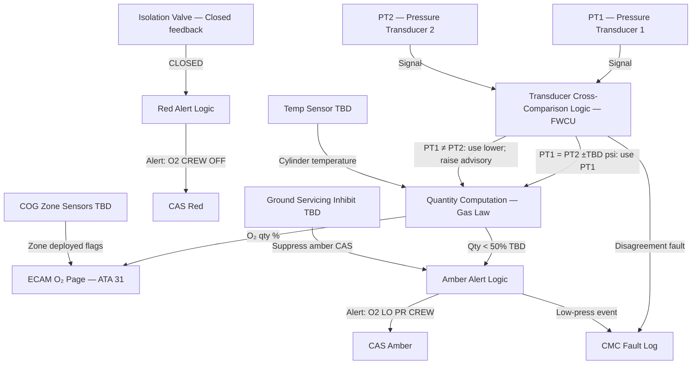
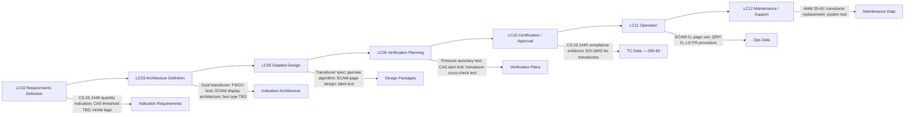

# 035-060 — Oxygen Pressure Indication and Warning
### AMPEL360e eWTW · ATA 35 · Q+ATLANTIDE ATLAS Scaffold

---

## §0 Hyperlink Policy

All internal links in this document use relative paths from the current directory. External regulatory and standards references use anchor links defined in [§20 References](#20-references). Links marked **TBD** indicate targets not yet allocated within the CSDB or ATLAS hierarchy. Programme-level links traverse five directory levels (`../../../../../`) to reach the repository root. No absolute URLs are used for internal navigation.

---

## §1 Purpose

This document describes the Oxygen Pressure Indication and Warning system (ATA 35-60) as implemented on the AMPEL360e Wide Tube-and-Wing (eWTW) fully electric aircraft. It defines the crew oxygen cylinder pressure measurement, quantity computation, ECAM display, cockpit CAS alerts, COG deployment zone status indication, and alert inhibit logic.

Crew oxygen pressure indication is required by CS-25.1449 to enable the flight crew to determine the oxygen supply quantity at all times. On the AMPEL360e eWTW, this is provided by dual redundant pressure transducers on the crew cylinder, gas-law quantity computation, and display on the ECAM O₂ systems page with associated CAS alerts. COG deployment status (per zone, if sensor wired — TBD) is displayed as a cabin zone map on the ECAM O₂ page for crew awareness.

---

## §2 Applicability

| Attribute | Value |
|---|---|
| Programme | AMPEL360e Wide Tube-and-Wing (eWTW) |
| ATA Subsubject | 035-60 — Oxygen Pressure Indication and Warning |
| Pressure Transducers | Dual redundant (crew cylinder) |
| Quantity Computation | Gas-law (pressure × volume / temperature) |
| ECAM Display | O₂ systems synoptic page; pressure gauge; qty % |
| CAS Alerts | Amber "O2 LO PR CREW" (< 50% TBD); Red "O2 CREW OFF" |
| COG Status | Per-zone deployed flag on ECAM (if sensor wired — TBD) |
| Data Bus | ARINC 429 / AFDX TBD |
| Inhibit Logic | Ground servicing inhibit of low-pressure CAS (TBD) |
| Certification Basis | CS-25.1449 |
| S1000D SNS | 035-60 |
| Applicability Code | ALL (all eWTW aircraft in programme) |
| Effectivity | From MSN 001 |

---

## §3 System / Function Overview

The oxygen pressure indication and warning system monitors the crew oxygen cylinder pressure via dual redundant pressure transducers. Transducer outputs are processed by the aircraft warning computer / FWCU (flight warning computer unit). The crew O₂ quantity is computed from cylinder pressure, cylinder volume (known constant), and cylinder temperature (temperature sensor TBD) using the ideal gas law. Quantity is expressed as a percentage of full charge and displayed on the ECAM O₂ systems page.

CAS alerts are generated by the FWCU at defined thresholds: amber "O2 LO PR CREW" when quantity falls below 50% (threshold TBD); red "O2 CREW OFF" when the isolation valve is closed or pressure is below a minimum serviceable level. Transducer cross-comparison detects disagreement between the two sensors, generating a maintenance alert.

COG deployment status is displayed on the ECAM O₂ page as a cabin zone map. If zone deployment sensors are wired (TBD), each PSU zone shows a green (armed) or amber (deployed) indication. If no zone sensors are wired, only the manual deploy switch position (armed/deployed) is indicated.

Alert inhibit logic prevents nuisance low-pressure CAS alerts during ground servicing when the system is intentionally depressurised for cylinder replenishment (TBD implementation).

---

## §4 Scope

### 4.1 Included
- Dual redundant pressure transducers on crew oxygen cylinder
- Temperature sensor for gas-law quantity computation (TBD — if fitted)
- Transducer signal processing and quantity computation (FWCU / avionics host TBD)
- ECAM O₂ systems synoptic page: pressure gauge, qty %, transducer status
- CAS alerts: amber "O2 LO PR CREW", red "O2 CREW OFF"
- Transducer cross-comparison monitoring and CMC fault generation
- COG zone deployment status indication (if sensors wired — TBD)
- Manual deploy switch status indication on ECAM
- Ground servicing alert inhibit logic (TBD)
- ARINC 429 / AFDX data interface from transducers to ECAM and CMC

### 4.2 Excluded
- Crew cylinder, PRV, and isolation valve physical description — 035-010 and 035-040
- COG deployment controller — 035-020
- ECAM display hardware — ATA 31
- FWCU host platform — ATA 31 or ATA 42 TBD
- CMC host platform — ATA 45
- Electrical power — ATA 24

---

## §5 Architecture Description

- **Dual redundant transducers**: Two independent pressure transducers (PT1 and PT2) are mounted on the crew oxygen cylinder or on the supply line immediately downstream of the cylinder isolation fitting. Each transducer outputs an analog or digital signal (TBD). Both signals are processed independently.
- **Gas-law quantity computation**: Crew O₂ quantity (%) is computed from the measured pressure, known cylinder water volume, and cylinder temperature (if temperature sensor is fitted — TBD). Without a temperature sensor, a standard temperature assumption is used (worst-case). Gas law: Q% = (P_measured × V_cylinder) / (P_full × V_cylinder) × 100 (simplified — non-ideal gas correction TBD).
- **FWCU processing**: The FWCU receives both transducer signals. Cross-comparison detects discrepancy (threshold TBD). If both transducers agree: quantity computed and displayed. If transducers disagree: amber advisory generated; quantity shown from the lower-reading transducer (conservative).
- **ECAM O₂ systems page**: Displays a graphical oxygen gauge (analog arc or digital bar) showing crew O₂ quantity as %. Also shows: isolation valve position (OPEN/CLOSED), transducer status (NORMAL/FAULT), COG zone map (deployed/armed — TBD), and manual deploy switch status.
- **CAS alert logic**: Amber "O2 LO PR CREW" at quantity < 50% (TBD threshold). Red "O2 CREW OFF" if isolation valve closed (commanded by crew) or pressure below absolute minimum (TBD). Inhibit during ground servicing TBD.
- **COG zone map**: If zone sensors wired — displays each cabin zone as armed (green) or deployed (amber). If not wired — only overall deployed/armed status from manual switch and deployment controller feedback (TBD).
- **Data bus**: Transducer signals transmitted to FWCU via ARINC 429 or AFDX (TBD — avionics ICD to be defined). FWCU outputs O₂ page data to ECAM via AFDX.

---

## §6 Functional Breakdown

| Function ID | Function Title | Description | Component |
|---|---|---|---|
| F-060-001 | Crew Cylinder Pressure Measurement | Dual transducers measure cylinder pressure continuously | Pressure transducers PT1, PT2 |
| F-060-002 | Cylinder Temperature Measurement | Optional temperature sensor for gas-law accuracy | Temperature sensor (TBD) |
| F-060-003 | Quantity Computation | Gas-law computation of O₂ quantity % from pressure, volume, temperature | FWCU computation |
| F-060-004 | Transducer Cross-Comparison | Compare PT1 and PT2 outputs; detect disagreement | FWCU logic |
| F-060-005 | ECAM O₂ Synoptic Display | Display O₂ qty %, pressure, valve status, COG zone map | ECAM O₂ page (ATA 31) |
| F-060-006 | CAS Alert — Amber "O2 LO PR CREW" | Alert crew when O₂ quantity < 50% threshold TBD | FWCU / CAS (ATA 31) |
| F-060-007 | CAS Alert — Red "O2 CREW OFF" | Alert crew when isolation valve closed or pressure loss | FWCU / CAS (ATA 31) |
| F-060-008 | COG Zone Status Display | Show per-zone COG armed/deployed status on ECAM | Zone sensors TBD / ECAM O₂ page |
| F-060-009 | Alert Inhibit — Ground Servicing | Inhibit low-pressure CAS during cylinder replenishment | FWCU inhibit logic (TBD) |
| F-060-010 | CMC Fault Generation | Generate CMC fault entries on transducer fault, disagreement, or valve fault | FWCU → CMC (ATA 45) |

---

## §7 System Context Diagram

```mermaid
flowchart LR
    COPV[COPV Cylinder — 1800/1850 psi] -->|Pressure signal| PT1[Pressure Transducer 1]
    COPV -->|Pressure signal| PT2[Pressure Transducer 2]
    COPV -->|Temperature TBD| TEMP[Temperature Sensor TBD]
    PT1 -->|ARINC 429 / AFDX TBD| FWCU[FWCU — Flight Warning Computer Unit]
    PT2 -->|ARINC 429 / AFDX TBD| FWCU
    TEMP -->|Signal TBD| FWCU
    FWCU -->|Qty %; valve status; alerts| ECAM[ECAM — O₂ Systems Synoptic Page — ATA 31]
    FWCU -->|Amber CAS| CAS[CAS "O2 LO PR CREW" Amber]
    FWCU -->|Red CAS| CASCREW[CAS "O2 CREW OFF" Red]
    ISOV[Isolation Valve Position Feedback] -->|Open/Closed| FWCU
    ZONESENS[COG Zone Sensors TBD] -->|Deployed flags| FWCU
    FWCU -->|Fault entries| CMC[ATA 45 CMC]
    GROUNDMODE[Ground Servicing Mode] -->|Inhibit signal TBD| FWCU
    ATA24[ATA 24 Electrical Power] -->|28 VDC| PT1
    ATA24 -->|28 VDC| PT2
```

---

## §8 Internal Functional Architecture



---

## §9 Lifecycle Traceability



---

## §10 Interfaces

| Interface ID | System / Chapter | Interface Type | Data / Signal | Direction | Status |
|---|---|---|---|---|---|
| IF-035-60-001 | ATA 24 Electrical Power | 28 VDC essential bus | Power for pressure transducers PT1 and PT2 | ATA24 → ATA35 |  |
| IF-035-60-002 | ATA 31 Indicating / ECAM | ARINC 429 / AFDX TBD | Crew O₂ qty %, pressure, valve status, COG zone status | ATA35 → ATA31 |  |
| IF-035-60-003 | ATA 31 CAS | Discrete / bus | "O2 LO PR CREW" amber; "O2 CREW OFF" red; transducer disagree advisory | ATA35 → ATA31 |  |
| IF-035-60-004 | ATA 45 CMC | AFDX maintenance bus | Transducer faults, disagreement events, pressure history, valve faults | ATA35 → ATA45 |  |
| IF-035-60-005 | ATA 035-010 Isolation Valve | Discrete | Valve position feedback (OPEN/CLOSED) | ATA35-10 → ATA35-60 |  |
| IF-035-60-006 | ATA 035-020 COG Zone Sensors | Discrete TBD | COG zone deployed flags (per zone if wired) | ATA35-20 → ATA35-60 |  |
| IF-035-60-007 | Ground maintenance panel | Discrete TBD | Ground servicing inhibit signal | Ground → ATA35 |  |

---

## §11 Operating Modes

| Mode ID | Mode Name | Description | Entry Condition | Exit Condition |
|---|---|---|---|---|
| OM-060-001 | Normal Monitoring | Both transducers active; O₂ qty displayed; no active CAS | System serviceable; aircraft powered | Threshold breach or transducer fault |
| OM-060-002 | Low Pressure — Amber CAS | Crew O₂ qty < 50% TBD; amber "O2 LO PR CREW" displayed | Qty below threshold | Cylinder replenished; qty restored |
| OM-060-003 | Crew O₂ Off — Red CAS | Isolation valve closed or pressure loss; red "O2 CREW OFF" | Valve closed or minimum pressure reached | Valve reopened or cylinder replaced |
| OM-060-004 | Transducer Disagree | PT1 and PT2 outputs differ > TBD psi; advisory on ECAM; lower reading used | PT1 ≠ PT2 beyond tolerance | Transducer replaced or disagreement resolved |
| OM-060-005 | COG Deployed — Zone Active | One or more PSU zones show deployed on ECAM zone map | COG deployment (auto or manual) | Landing; zone flag reset after maintenance |
| OM-060-006 | Ground Servicing Inhibit | Low-pressure CAS inhibited during cylinder replenishment | Ground mode active TBD | Servicing complete; inhibit removed |
| OM-060-007 | Maintenance Test | FWCU test mode; simulate low-pressure signal; verify CAS | CMC maintenance test mode | Test complete |

---

## §12 Monitoring and Diagnostics

- **Continuous pressure monitoring**: PT1 and PT2 sampled at TBD rate (e.g., 1 Hz). Cross-comparison performed every sample cycle.
- **Quantity trending**: FWCU may optionally trend O₂ quantity over time to detect abnormal depletion rate (slow leak indicator — TBD feature).
- **Isolation valve state monitoring**: Isolation valve OPEN/CLOSED feedback from position sensor. Closed state without crew command generates CMC fault and red CAS.
- **CMC fault log**: Minimum 500 entries (TBD). Records: pressure at time of fault, transducer identity, event type (low-pressure, disagreement, valve fault), timestamp.
- **Maintenance pressure check**: CMC maintenance terminal displays current pressure reading from both transducers. Technician verifies against physical reference gauge for calibration check.
- **ECAM inhibit on ground**: To prevent nuisance alerts during cylinder replenishment, a ground servicing inhibit suppresses the low-pressure amber CAS when ground mode is selected (TBD implementation).

---

## §13 Maintenance Concept

- **Pressure transducer replacement (line maintenance)**: Depressurise system (TBD bleed valve). Disconnect transducer electrical connector. Remove transducer (threaded fitting). Install new transducer; torque to specification. Repressurize system. Verify pressure reading on ECAM matches reference gauge ±TBD psi. Clear CMC fault.
- **Transducer calibration check**: At each C-check interval (TBD). Compare ECAM-displayed pressure to a calibrated reference gauge connected at the fill valve port. Tolerance: ±TBD psi. Recalibrate or replace if outside tolerance.
- **FWCU CAS test (line maintenance)**: Via CMC maintenance terminal: inject simulated low-pressure signal. Verify "O2 LO PR CREW" amber CAS activates. Verify "O2 CREW OFF" red CAS on valve-closed command. Clear test flags after completion.
- **COG zone sensor check**: If zone sensors fitted (TBD). CMC terminal: check zone sensor continuity and status. Inspect zone sensor wiring harness at each C-check.
- **ECAM page functional check**: At each A-check. Verify O₂ synoptic page is displayed; pressure gauge showing; qty % correct (cross-check with reference). Verify COG zone map display (armed status).

---

## §14 S1000D / CSDB Mapping

### 14.1 SNS to DMC Mapping

| SNS Code | Subsubject Title | DMC Prefix | Info Codes Planned | DMRL Status |
|---|---|---|---|---|
| 035-60 | Oxygen Pressure Indication and Warning | DMC-AMPEL360E-EWTW-035-60 | 040, 300, 400, 520 |  |

### 14.2 Data Module Breakdown — 035-60

| DM Code Suffix | Info Code | Data Module Title | Priority |
|---|---|---|---|
| -035-60-00-040A | 040 | Oxygen Pressure Indication and Warning — System Description | High |
| -035-60-00-300A | 300 | O₂ Pressure Indication — Normal and Abnormal Procedures | High |
| -035-60-00-400A | 400 | Pressure Transducer — Inspection, Calibration, Replacement | High |
| -035-60-00-400B | 400 | CAS Alert System Test — O₂ Warning | High |
| -035-60-00-520A | 520 | O₂ Pressure Indication — Fault Isolation | Medium |

---

## §15 Footprints

### 15.1 Physical Footprint
- Pressure transducers PT1 and PT2: on crew cylinder or downstream supply line — TBD thread size; mass TBD (~50 g each)
- Temperature sensor: on cylinder wall or supply line — TBD (if fitted)
- FWCU: avionics bay — shared with other FWCU functions; ATA 31/42 host

### 15.2 Electrical / Data Footprint
- Transducer power: 28 VDC; current per transducer: TBD mA
- Data bus: ARINC 429 (12.5 or 100 kbps TBD) from transducers to FWCU; AFDX from FWCU to ECAM
- ECAM O₂ page update rate: TBD (e.g., 1 Hz)
- COG zone sensor wiring: discrete per zone (28 VDC logic) — TBD wire count and gauge

### 15.3 Maintenance Footprint
- Transducer replacement: line maintenance — access at cylinder location; ~TBD min per task
- Calibration check: C-check — reference gauge comparison; ~TBD min
- CAS test: line maintenance via CMC terminal — ~TBD min

### 15.4 Data Footprint
- CMC fault log: pressure, event type, transducer ID, timestamp — 500 entries min TBD
- ECAM snapshot log: last N pressure readings before fault (TBD — if supported by FWCU)

---

## §16 Safety and Certification Considerations

| Requirement | Source | Description | Compliance Approach | Status |
|---|---|---|---|---|
| CS-25.1449 | EASA CS-25 Subpart K | Means for determining O₂ supply quantity — required at all times | Dual pressure transducers; gas-law qty on ECAM; redundant transducers per CS-25.1449 |  |
| CS-25.1441 | EASA CS-25 Subpart K | Crew must know O₂ quantity to manage supply during emergency | ECAM qty % and CAS alerts enable crew quantity management |  |
| DO-160G | RTCA | Environmental qualification — pressure transducers | DO-160G temperature, vibration, humidity, EMC qualification for transducers |  |
| CS-25.1309 | EASA CS-25 | Systems and equipment — failure analysis | FHA/FMEA for dual transducer architecture; single-transducer failure must not cause loss of O₂ indication |  |

---

## §17 Verification and Validation

| V&V ID | Requirement | Method | Success Criterion | Status |
|---|---|---|---|---|
| VV-035-60-001 | Pressure accuracy — CS-25.1449 | Ground test: fill cylinder; compare transducer reading vs. calibrated reference gauge | Both PT1 and PT2 within ±TBD psi of reference at full charge and 50% charge |  |
| VV-035-60-002 | Quantity computation accuracy | Ground test: compare computed qty % vs. known fill volume | Qty % within ±TBD % of actual quantity at multiple fill levels |  |
| VV-035-60-003 | Amber CAS alert — CS-25.1449 | Inject simulated low-pressure signal; verify CAS | "O2 LO PR CREW" amber CAS displayed ≤ TBD sec after threshold crossing |  |
| VV-035-60-004 | Red CAS alert — isolation valve | Command isolation valve closed; verify CAS | "O2 CREW OFF" red CAS displayed ≤ TBD sec after valve close |  |
| VV-035-60-005 | Transducer cross-comparison | Inject PT1/PT2 signal disagreement; verify advisory | Disagree advisory on ECAM; lower reading used for quantity computation |  |
| VV-035-60-006 | COG zone status — ECAM display | COG deployment test (safe pin installed); verify zone flag | Deployed flag appears on ECAM O₂ zone map within TBD sec (if wired) |  |
| VV-035-60-007 | Ground inhibit test | Activate ground servicing mode; verify amber CAS suppressed | "O2 LO PR CREW" CAS not displayed when ground inhibit active |  |
| VV-035-60-008 | DO-160G — pressure transducers | DO-160G test suite for PT1 and PT2 | All applicable DO-160G categories passed |  |

---

## §18 Glossary

| Term | Definition |
|---|---|
| CAS | Crew Alerting System — cockpit alert function providing amber/red/advisory messages |
| ECAM | Electronic Centralised Aircraft Monitor — aircraft systems monitoring display; provides O₂ synoptic page (ATA 31) |
| FWCU | Flight Warning Computer Unit — processes sensor data to generate CAS alerts and ECAM system page data |
| gas law | Ideal gas law: PV = nRT; used to compute oxygen quantity from pressure, cylinder volume, and temperature |
| inhibit logic | FWCU logic that suppresses a CAS alert during defined ground operations to prevent nuisance alerts |
| pressure transducer | An electromechanical sensor that converts cylinder gas pressure to an electrical signal (typically 4–20 mA or 0–5 VDC or digital) |
| quantity computation | The FWCU function that converts measured cylinder pressure to a percentage of full charge using the gas law |
| transducer cross-comparison | FWCU comparison of PT1 and PT2 outputs; disagreement detection for fault alerting |
| CS-25.1449 | EASA certification requirement for means of determining oxygen supply quantity — requires a pressure gauge or approved equivalent |

---

## §19 Citations

| Citation ID | Source | Title | Relevance |
|---|---|---|---|
| CIT-035-60-001 | EASA | CS-25 §25.1449 — Means for determining supply quantity | Primary certification basis for crew O₂ pressure indication |
| CIT-035-60-002 | RTCA | DO-160G Environmental Conditions and Test Procedures | Pressure transducer environmental qualification |
| CIT-035-60-003 | EASA | CS-25 §25.1309 — Equipment systems and installations | Failure analysis for dual transducer architecture |
| CIT-035-60-004 | ASD-STAN | S1000D Issue 5.0 | CSDB mapping for ATA 35-60 |

---

## §20 References

| Ref ID | Document | Title | Link |
|---|---|---|---|
| REF-035-60-001 | CS-25.1449 | Means for determining oxygen supply quantity | [EASA CS-25](#) |
| REF-035-60-002 | CS-25.1441 | Oxygen equipment and supply | [EASA CS-25](#) |
| REF-035-60-003 | CS-25.1309 | Equipment systems and installations — failure analysis | [EASA CS-25](#) |
| REF-035-60-004 | DO-160G | Environmental Conditions and Test Procedures | [RTCA](https://www.rtca.org/) |
| REF-035-60-005 | S1000D Issue 5.0 | International Specification for Technical Publications | [s1000d.org](https://s1000d.org/) |

---

## §21 Open Issues

| Issue ID | Description | Owner | Priority | Status |
|---|---|---|---|---|
| OI-035-60-001 | Temperature sensor for gas-law computation — confirm whether a temperature sensor is fitted on the crew cylinder; assess accuracy improvement vs. added complexity/cost | Q-AIR / Q-MECHANICS | Medium |  |
| OI-035-60-002 | Low-pressure alert threshold — confirm 50% threshold for amber CAS (other thresholds possible per CS-25.1449 and operational policy); two-step threshold TBD | Q-AIR / ORB-LEG | High |  |
| OI-035-60-003 | COG zone sensor wiring — confirm whether per-zone sensors are fitted; assess weight/cost of wiring harness vs. benefit of zone-level ECAM visibility | Q-AIR / Q-DATAGOV | Medium |  |
| OI-035-60-004 | Data bus selection — confirm ARINC 429 vs. AFDX for transducer-to-FWCU signal; avionics ICD to be defined | Q-AIR / Q-DATAGOV | High |  |
| OI-035-60-005 | Ground servicing inhibit implementation — confirm mechanism (maintenance panel switch, weight-on-wheels, or CMC command); address regulatory view on inhibit | Q-AIR / ORB-LEG | Medium |  |
| OI-035-60-006 | FWCU hosting — confirm which LRU hosts the O₂ pressure computation and alerting (dedicated FWCU, IMA partition, or ECAM-integrated) | Q-AIR / Q-DATAGOV | High |  |

---

## §22 Change Log

| Revision | Date | Author | Description |
|---|---|---|---|
| 0.1.0 | 2026-05-10 | Q+ATLANTIDE / Q-AIR | Initial full-template creation — all §0–§22 sections drafted; TBD items identified; open issues registered |
