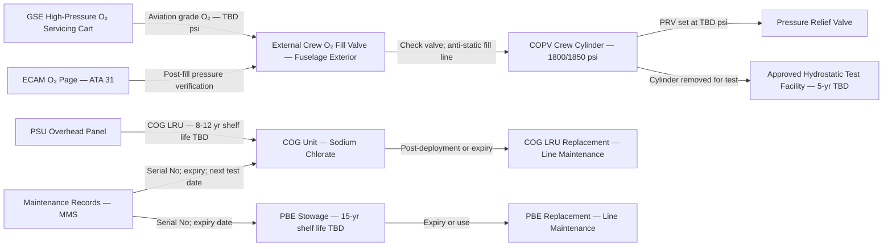
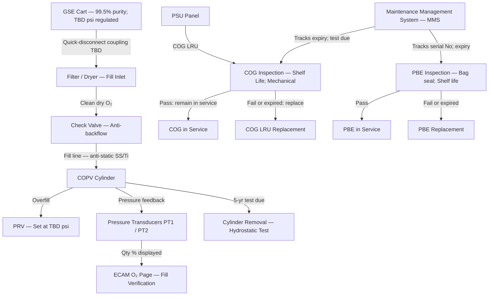
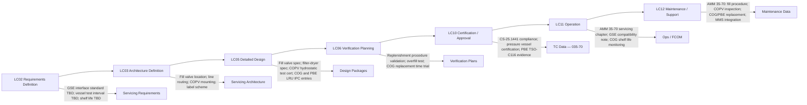

# 035-070 — Oxygen Servicing and Replenishment Interfaces
### [PROGRAMME-AIRCRAFT] [PROGRAMME-VARIANT] · ATA 35 · Q+ATLANTIDE ATLAS Scaffold

---

## §0 Hyperlink Policy

All internal links in this document use relative paths from the current directory. External regulatory and standards references use anchor links defined in [§20 References](#20-references). Links marked **TBD** indicate targets not yet allocated within the CSDB or ATLAS hierarchy. Programme-level links traverse five directory levels (`../../../../../`) to reach the repository root. No absolute URLs are used for internal navigation.

---

## §1 Purpose

This document defines the agnostic ATLAS standard-level architecture context for `035-070 — Oxygen Servicing and Replenishment Interfaces`.

It describes the controlled scope, functions, interfaces, safety considerations, lifecycle traceability, and S1000D/CSDB mapping logic that programme implementations shall instantiate when this node is applicable.

This document is not a programme design baseline. Programme-specific capacities, locations, part numbers, effectivity, operating limits, maintenance references, and data module codes shall be defined only inside the applicable programme implementation branch.
## §2 Applicability

| Applicability Level | Rule |
|---|---|
| Standard taxonomy | Applies to the ATLAS node `<NODE>` |
| Programme implementation | Conditional; determined by programme architecture, trade studies, certification basis, and applicability model |
| Product configuration | Defined in the programme-specific configuration baseline |
| Effectivity | Defined in the programme CSDB / applicability layer |
| Non-applicability | Must be explicitly stated in the programme impact-study branch when excluded |
## §3 System / Function Overview

Oxygen system servicing on the [PROGRAMME-AIRCRAFT] [PROGRAMME-VARIANT] encompasses three distinct activities: (1) crew cylinder high-pressure replenishment via an external filler valve and GSE cart; (2) COPV cylinder periodic inspection and hydrostatic test at 5-year or TBD regulatory intervals; and (3) LRU replacement of COG units (passenger oxygen) and PBE units (portable equipment) when deployed or when their storage life expires.

The crew oxygen cylinder is a COPV (Composite Overwrapped Pressure Vessel) or equivalent (TBD). It is filled through an external quick-disconnect fill valve accessible from the aircraft exterior, typically near a service panel at the fuselage belly or side. Filling uses a high-pressure oxygen cart capable of delivering aviation-grade (Grade A or equivalent) oxygen to the working pressure TBD. A pressure relief fitting on the fill connection protects the cylinder from overfill. The fill valve incorporates a check valve to prevent back-flow from the cylinder.

COG units are passenger oxygen generators installed in PSU overhead panels. Each COG unit is an LRU. Replacement is required after deployment (unit is consumed after one activation) or upon reaching the maximum storage life (8–12 years TBD). COG replacement is a cabin-maintenance task requiring removal of the PSU cover panel, disconnection of the deployment pull-wire lanyard, removal of the expended COG unit, and installation of a new armed unit.

PBE chemical smoke hoods are portable devices with defined shelf life (15 years TBD per TSO-C116). They are tracked by serial number and are replaced at shelf-life expiry or after use. PBE servicing is limited to removal and replacement of the sealed canister; no on-aircraft maintenance is possible.

---

## §4 Scope

### 4.1 Included
- External crew oxygen cylinder fill valve (location TBD on fuselage)
- High-pressure oxygen GSE interface requirements (pressure, flow rate, purity, connection standard)
- COPV cylinder periodic inspection and hydrostatic test intervals
- Overfill protection (PRV on cylinder; check valve on fill line)
- COG LRU: inspection, shelf-life management, post-deployment replacement
- PBE: shelf-life tracking, removal and replacement, servicing labels
- Serviceability label requirements for COPV, COG, and PBE
- No-software servicing confirmation (no ARINC 615A applicable)

### 4.2 Excluded
- Crew cylinder, PRV, and distribution hardware physical description — 035-010 and 035-040
- COG deployment controller and indicator — 035-020 and 035-060
- Pressure indication system — 035-060
- ECAM O₂ page and CAS alerts — 035-060
- Monitoring and diagnostics — 035-080
- Ground support equipment (GSE) design — airport operator / GSE supplier scope

---

## §5 Architecture Description

- **External crew O₂ fill valve**: Located on the aircraft exterior (TBD panel — likely below-wing or fuselage service panel). Provides a standardised high-pressure quick-disconnect interface compatible with aviation oxygen servicing carts. Check valve prevents back-flow. The valve is clearly labelled: "CREW OXYGEN — HIGH PRESSURE — AVIATION GRADE ONLY — DO NOT SMOKE".
- **Fill line and pressure relief**: Fill line from exterior valve to the crew COPV cylinder via an anti-static stainless steel or titanium tube. A pressure relief valve (PRV) on the fill line or cylinder protects against overfill (set at TBD psi above working pressure). A filter/dryer at the fill inlet prevents moisture and particulate contamination.
- **GSE interface**: GSE cart must supply aviation-grade oxygen (99.5%+ purity per MIL-PRF-27210 or equivalent), at a regulated delivery pressure up to the fill pressure TBD, with a compatible quick-disconnect coupling (e.g., CGA 540 or equivalent TBD). GSE cart shall have a calibrated pressure gauge and a shut-off valve.
- **COPV inspection and hydrostatic test**: COPV is a pressure vessel subject to periodic hydrostatic testing per regulatory requirement (DOT/EN/EASA TBD). Test interval: 5 years or TBD per vessel certification. In-service visual inspection (external composite overwrap for damage, delamination, UV degradation) at each C-check TBD. If COPV requires hydrostatic test, cylinder must be removed from aircraft, depressurised, and shipped to an approved test facility.
- **COG LRU replacement**: COG units are self-contained LRUs. Replacement procedure: de-energise deployment circuit; remove PSU cover panel; disconnect lanyard from COG initiator; remove expended COG; install new armed COG (check PIN-in/PIN-out safety); reconnect lanyard; reinstall PSU cover; test deployment circuit continuity; update maintenance records with new COG serial number and manufacture/expiry date.
- **PBE shelf-life management**: PBE units tracked by serial number in the airline's maintenance management system. Shelf life (15 years TBD per TSO-C116). At shelf-life expiry: remove PBE from stowage, verify bag seal integrity, return to manufacturer or dispose per applicable regulations. Install new PBE; update records.
- **Serviceability labels**: Each COPV, COG, and PBE shall carry a label showing: part number, serial number, manufacture date, expiry/next-test date, aircraft applicability. Labels compliant with ATA 104 specification TBD.

---

## §6 Functional Breakdown

| Function ID | Function Title | Description | Component |
|---|---|---|---|
| F-070-001 | Crew O₂ Replenishment | Fill crew COPV cylinder from GSE cart via external fill valve | External fill valve; fill line; PRV; COPV |
| F-070-002 | Fill Overfill Protection | Prevent cylinder overpressure during filling | PRV on cylinder; check valve on fill line |
| F-070-003 | COPV Visual Inspection | Inspect composite overwrap for damage at each C-check | COPV exterior; AMM 35-70 |
| F-070-004 | COPV Hydrostatic Test | Hydrostatic pressure test of COPV at 5-year TBD interval | Approved test facility; COPV removal |
| F-070-005 | COG LRU Inspection | Verify COG shelf life and mechanical integrity | COG unit; PSU panel; AMM 35-70 |
| F-070-006 | COG LRU Replacement | Remove expended or expired COG; install new armed COG | COG unit; PSU cover panel; lanyard |
| F-070-007 | PBE Shelf Life Tracking | Track PBE serial numbers and expiry dates | PBE; maintenance management system |
| F-070-008 | PBE Replacement | Remove expired or used PBE; install new PBE | PBE; stowage bracket/bag; AMM 35-70 |
| F-070-009 | Serviceability Labelling | Apply and maintain servicing labels on COPV, COG, PBE | Labels (ATA 104 TBD) |
| F-070-010 | Post-Fill Pressure Check | Verify cylinder fill pressure on ECAM after replenishment; log in maintenance records | ECAM O₂ page; CMC; AMM 35-70 |

---

## §7 System Context Diagram

---

## §8 Internal Functional Architecture

---

## §9 Lifecycle Traceability

---

## §10 Interfaces

| Interface ID | System / Chapter | Interface Type | Data / Signal | Direction | Status |
|---|---|---|---|---|---|
| IF-035-70-001 | GSE — High-Pressure O₂ Cart | Mechanical quick-disconnect | Aviation-grade O₂ at up to TBD psi | GSE → Aircraft |  |
| IF-035-70-002 | ATA 035-010 Crew O₂ Cylinder | Fill line — anti-static SS/Ti | O₂ gas at working pressure TBD | Fill Valve → COPV |  |
| IF-035-70-003 | ATA 035-060 Pressure Indication | Post-fill pressure verification | O₂ qty % displayed on ECAM after replenishment | COPV → ECAM |  |
| IF-035-70-004 | ATA 035-020 COG PSU Panel | COG LRU mechanical interface | COG unit; deployment lanyard; electrical connector | COG → PSU |  |
| IF-035-70-005 | ATA 030 Portable Equipment Stowage | PBE stowage bracket / bag | PBE canister; retention bracket; accessibility for replacement | PBE → Cabin |  |
| IF-035-70-006 | Maintenance Management System (MMS) | Data record | COG and PBE serial numbers, expiry dates, replacement records | Aircraft → MMS |  |
| IF-035-70-007 | Approved Hydrostatic Test Facility | Logistical / physical | COPV cylinder removal, shipment, test, reinstallation | Aircraft ↔ Test Facility |  |

---

## §11 Operating Modes (Servicing Context)

| Mode ID | Mode Name | Description | Entry Condition | Exit Condition |
|---|---|---|---|---|
| SM-070-001 | Normal Service — Crew O₂ Full | Crew COPV at working pressure; no replenishment required | Aircraft in service; pressure > TBD threshold | Low-pressure alert or scheduled fill |
| SM-070-002 | Replenishment — Crew O₂ | GSE cart connected; cylinder being filled; alert inhibited | Ground; low pressure or scheduled fill | Fill complete; valve disconnected; inhibit removed |
| SM-070-003 | COPV Inspection — C-Check | Visual inspection of composite overwrap at C-check interval | C-check maintenance window | Inspection complete; no defects or cylinder removed |
| SM-070-004 | COPV Hydrostatic Test Due | Cylinder removed for 5-year TBD hydrostatic test | 5-year anniversary or vessel certification limit | Cylinder tested, certified, reinstalled |
| SM-070-005 | COG LRU Replacement | PSU panel opened; expended or expired COG replaced | Post-deployment or shelf-life expiry | New COG installed; circuit continuity verified |
| SM-070-006 | PBE Replacement | PBE removed from stowage; replaced at shelf-life expiry or after use | Shelf-life expiry or post-use | New PBE installed; records updated |

---

## §12 Monitoring and Diagnostics

- **Post-fill pressure verification**: After crew cylinder replenishment, technician verifies fill pressure on ECAM O₂ page. Verify ECAM shows qty ~100% and pressure ≈ working pressure TBD. Record in maintenance log.
- **COPV visual inspection criteria**: External composite overwrap inspected for: impact damage (dents, cuts, gouges); delamination or resin cracking; UV degradation (chalking, colour change); signs of moisture ingress. Any anomaly: cylinder removed and sent for engineering disposition.
- **COG pre-installation check**: Before installing a new COG LRU — verify: part number and serial number match IPC; manufacture date within shelf life (8–12 years TBD); safety pin or shipping plug installed; initiator resistance within specification (if measurable TBD); lanyard length correct per PSU type.
- **PBE pre-installation check**: Before installing a new PBE — verify: bag seal intact (no tears, punctures); manufacture date within shelf life (15 years TBD); part number matches approved list (TSO-C116).
- **MMS tracking**: Airline MMS shall track COPV serial number, hydrostatic test due date, COG serial number per aircraft zone, COG expiry, PBE serial number per station, PBE expiry.

---

## §13 Maintenance Concept

- **Crew O₂ replenishment (line maintenance — turn-around or transit)**: Connect GSE cart to fill valve. Verify oxygen purity certificate of cart. Fill to working pressure TBD. Monitor ECAM O₂ page during fill. Disconnect cart; cap fill valve. Verify post-fill qty on ECAM. Remove ground servicing inhibit. Record fill in log.
- **COPV inspection (C-check interval)**: Access COPV mounting location in fuselage. Inspect overwrap per AMM 35-70 inspection criteria. Record findings. If anomaly: remove cylinder; engineering disposition. If no anomaly: re-secure; record.
- **COPV hydrostatic test (5-year interval TBD)**: Depressurise cylinder. Disconnect all fittings (wear PPE; high-pressure O₂). Remove cylinder from aircraft mount (comply with anti-static precautions; bonding required). Seal ports; ship to approved test facility. Test per applicable pressure vessel standard. Reinstall on receipt of test certificate; refill; verify. Update MMS.
- **COG replacement (post-deployment or expiry)**: De-energise deployment circuit. Remove PSU cover (typically 4–6 fasteners). Disconnect lanyard from COG initiator. Remove COG unit. Install new armed COG; torque TBD. Reconnect lanyard. Reinstall cover. Perform circuit continuity check (TBD resistance). Update MMS with new serial number, expiry.
- **PBE replacement (shelf-life or post-use)**: Remove PBE from stowage. Verify bag seal of replacement PBE. Install new PBE in stowage bracket or bag. Update MMS. Return used/expired PBE per airline handling procedure (disposal or manufacturer return).

---

## §14 S1000D / CSDB Mapping

### 14.1 SNS to DMC Mapping

| SNS Code | Subsubject Title | DMC Prefix | Info Codes Planned | DMRL Status |
|---|---|---|---|---|
| 035-70 | Oxygen Servicing and Replenishment Interfaces | DMC-<PROGRAMME>-<VARIANT>-035-70 | 300, 400, 720 |  |

### 14.2 Data Module Breakdown — 035-70

| DM Code Suffix | Info Code | Data Module Title | Priority |
|---|---|---|---|
| -035-70-00-300A | 300 | Crew O₂ Cylinder Replenishment — Servicing Procedure | High |
| -035-70-00-400A | 400 | COPV Cylinder — Visual Inspection | High |
| -035-70-00-400B | 400 | COPV Cylinder — Removal and Hydrostatic Test Preparation | High |
| -035-70-00-400C | 400 | COG Unit — Replacement (Post-Deployment / Expiry) | High |
| -035-70-00-400D | 400 | PBE — Removal, Inspection, and Replacement | High |
| -035-70-00-720A | 720 | Oxygen System — Servicing Precautions and GSE Requirements | High |

---

## §15 Footprints

### 15.1 Physical Footprint
- External fill valve: on fuselage skin — TBD panel location; mass ~TBD kg; CGA 540 or equivalent coupling TBD
- Fill line: anti-static SS or Ti; wall thickness TBD; mass TBD; routed through fuselage interior to COPV
- Filter/dryer: on fill inlet; mass ~TBD kg; replacement interval TBD

### 15.2 Electrical / Data Footprint
- No electrical interfaces at fill valve (mechanical only)
- COG replacement circuit continuity test: TBD resistance measurement at deployment circuit connector
- MMS data entry: manual by technician after each servicing event

### 15.3 Maintenance Footprint (Estimated)

| Task | Level | Interval | Duration (TBD) |
|---|---|---|---|
| Crew O₂ replenishment | Line maintenance | As needed (low pressure) | TBD min |
| COPV visual inspection | C-check | TBD yr | TBD min |
| COPV hydrostatic test | Base maintenance | 5 yr TBD | TBD days (off-aircraft) |
| COG replacement | Line maintenance | Post-deployment or expiry (8–12 yr TBD) | TBD min per unit |
| PBE replacement | Line maintenance | 15 yr TBD or post-use | TBD min per unit |

### 15.4 Data Footprint
- MMS records: COPV serial; hydrostatic test date; COG serial per zone; PBE serial per station; fill records
- ECAM post-fill screenshot (if ECAM recording supported — TBD)

---

## §16 Safety and Certification Considerations

| Requirement | Source | Description | Compliance Approach | Status |
|---|---|---|---|---|
| CS-25.1441 | EASA CS-25 Subpart K | Oxygen equipment and supply — general | Servicing procedures maintain design O₂ quantity per CS-25.1441 |  |
| CS-25.1453 | EASA CS-25 Subpart K | Crew O₂ lines — segregation from ignition sources | Fill line and fittings routed away from ignition sources; anti-static material |  |
| DOT / EN pressure vessel regs | TBD | COPV hydrostatic test interval | 5-year interval TBD; test at approved facility per applicable regulation |  |
| TSO-C116 | FAA | PBE minimum performance standard | PBE TSO-C116 approved; shelf life per TSO-C116 |  |
| TSO-C78 | FAA | COG minimum performance standard | COG TSO-C78 approved; shelf life per manufacturer specification |  |
| O₂ fire and explosion precautions | MIL-PRF-27210; industry practice | High-pressure O₂ handling — no oil, no grease; bonding; PPE | Servicing procedures specify O₂-compatible lubricants only; bonding required; PPE specified |  |

---

## §17 Verification and Validation

| V&V ID | Requirement | Method | Success Criterion | Status |
|---|---|---|---|---|
| VV-035-70-001 | Fill valve interface — GSE compatibility | Ground test: connect GSE cart; fill cylinder; verify coupling, pressure, no leaks | No coupling leak; cylinder fills to working pressure; no damage to valve |  |
| VV-035-70-002 | Overfill protection — PRV function | Ground test: inject pressure above PRV set point; verify PRV opens and relieves | PRV opens at set point TBD; cylinder not overpressured; PRV reseats |  |
| VV-035-70-003 | Check valve — anti-backflow | Ground test: remove GSE cart after fill; verify no back-flow from cylinder | No O₂ escape from fill coupling on GSE disconnection |  |
| VV-035-70-004 | Post-fill ECAM verification | Ground test: fill cylinder; verify ECAM O₂ page shows ~100% qty | ECAM O₂ qty ≥ 95% within TBD min of fill completion |  |
| VV-035-70-005 | COG replacement — deployment circuit continuity | Post-replacement ground test: measure circuit resistance | Resistance within TBD Ω; no open or short circuit |  |
| VV-035-70-006 | PBE replacement — accessibility | Maintainability trial: technician removes and replaces PBE at each stowage location | Replacement completed within TBD min by one technician with no special tools |  |
| VV-035-70-007 | COG replacement — accessibility | Maintainability trial: technician replaces COG in representative PSU panel | Replacement completed within TBD min; no damage to PSU panel or lanyard |  |

---

## §18 Glossary

| Term | Definition |
|---|---|
| CGA 540 | Compressed Gas Association fitting standard for oxygen (common GSE coupling) — specific coupling standard for [PROGRAMME-VARIANT] TBD |
| COPV | Composite Overwrapped Pressure Vessel — lightweight high-pressure cylinder using carbon fibre overwrap over a liner |
| COG | Chemical Oxygen Generator — sodium chlorate canister generating O₂ by exothermic chemical reaction on activation |
| GSE | Ground Support Equipment — in this context, the high-pressure oxygen servicing cart used for cylinder replenishment |
| hydrostatic test | Proof pressure test of a pressure vessel filled with water or fluid (not gas) to a pressure above working pressure; required periodically to verify structural integrity |
| LRU | Line Replaceable Unit — a component designed to be replaced in the field without special facilities |
| MMS | Maintenance Management System — the airline's electronic system tracking component serial numbers, life limits, and work orders |
| PBE | Protective Breathing Equipment — chemical smoke hood / portable O₂ device for crew/passenger use in fire/smoke events |
| PRV | Pressure Relief Valve — automatic valve that opens to vent gas if pressure exceeds set point, preventing vessel failure |
| shelf life | Maximum storage period for a component from manufacture date to mandatory replacement; applicable to COG and PBE |

---

## §19 Citations

| Citation ID | Source | Title | Relevance |
|---|---|---|---|
| CIT-035-70-001 | EASA | CS-25 §25.1441 — Oxygen equipment and supply | Primary certification basis for O₂ system servicing quantity |
| CIT-035-70-002 | EASA | CS-25 §25.1453 — Crew O₂ lines — segregation | Fill line routing and material compliance |
| CIT-035-70-003 | FAA | TSO-C116 — Protective Breathing Equipment | PBE shelf-life and replacement standard |
| CIT-035-70-004 | FAA | TSO-C78 — Chemical Oxygen Generator | COG shelf-life and replacement standard |
| CIT-035-70-005 | RTCA | DO-160G Environmental Conditions | Fill valve and line qualification (if applicable) |
| CIT-035-70-006 | ASD-STAN | S1000D Issue 5.0 | CSDB mapping for ATA 35-70 |

---

## §20 References

| Ref ID | Document | Title | Link |
|---|---|---|---|
| REF-035-70-001 | CS-25.1441 | Oxygen equipment and supply | [EASA CS-25](#) |
| REF-035-70-002 | CS-25.1453 | Crew O₂ lines — segregation | [EASA CS-25](#) |
| REF-035-70-003 | TSO-C116 | FAA — Protective Breathing Equipment | [FAA](https://rgl.faa.gov/) |
| REF-035-70-004 | TSO-C78 | FAA — Chemical Oxygen Generator | [FAA](https://rgl.faa.gov/) |
| REF-035-70-005 | MIL-PRF-27210 | Aviation oxygen purity specification | [DODL](#) |
| REF-035-70-006 | S1000D Issue 5.0 | International Specification for Technical Publications | [s1000d.org](https://s1000d.org/) |

---

## §21 Open Issues

| Issue ID | Description | Owner | Priority | Status |
|---|---|---|---|---|
| OI-035-70-001 | External fill valve location — TBD on fuselage; confirm panel location, access, and coupling standard (CGA 540 or other); ensure no conflict with fuel, hydraulic, or electrical ground service panels | Q-AIR / Q-MECHANICS | High |  |
| OI-035-70-002 | COPV hydrostatic test interval — confirm 5-year interval vs. COPV manufacturer's certification (some COPVs have no hydrostatic test requirement — "no-test" COPVs); clarify with vessel manufacturer and EASA | Q-AIR / Q-MECHANICS | High |  |
| OI-035-70-003 | COG shelf life — confirm 8–12 years vs. specific manufacturer data; review impact on maintenance burden for 20-year aircraft service life (multiple COG replacements expected) | Q-AIR / Q-MECHANICS | Medium |  |
| OI-035-70-004 | PBE shelf life — confirm 15 years vs. specific TSO-C116 supplier data; review per-aircraft PBE quantity to optimise fleet-wide replacement intervals | Q-AIR / Q-MECHANICS | Medium |  |
| OI-035-70-005 | Ground servicing inhibit implementation — confirm mechanism for suppressing low-pressure CAS during cylinder replenishment (weight-on-wheels, maintenance panel, CMC command) | Q-AIR / Q-DATAGOV | Medium |  |
| OI-035-70-006 | O₂ purity standard — confirm MIL-PRF-27210 Grade A as applicable purity standard for [PROGRAMME-VARIANT] or alternative European standard (EN ISO 7866 TBD) | Q-AIR / Q-GREENTECH | Low |  |

---

## §22 Change Log

| Revision | Date | Author | Description |
|---|---|---|---|
| 0.1.0 | 2026-05-10 | Q+ATLANTIDE / Q-AIR | Initial full-template creation — all §0–§22 sections drafted; TBD items identified; open issues registered |
