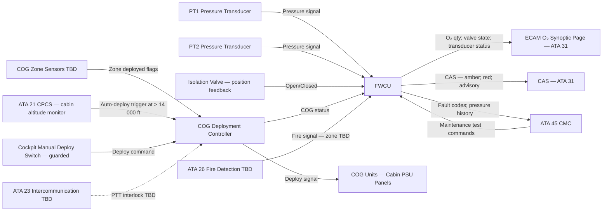
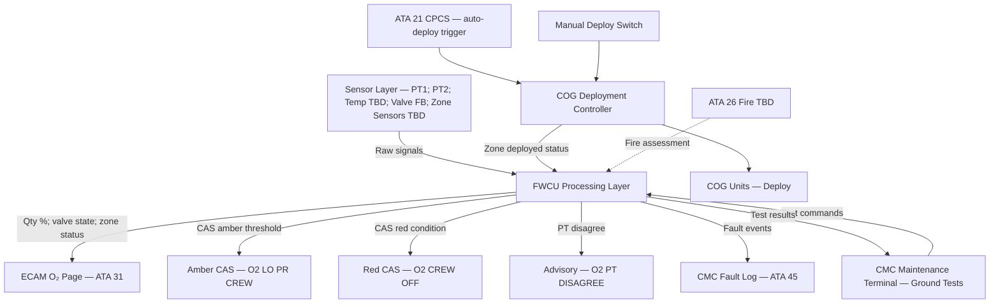
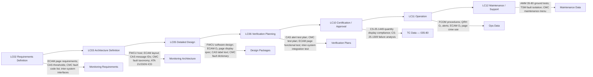

# 035-080 — Oxygen Monitoring, Diagnostics, and Control Interfaces
### [PROGRAMME-AIRCRAFT] [PROGRAMME-VARIANT] · ATA 35 · Q+ATLANTIDE ATLAS Scaffold

---

## §0 Hyperlink Policy

All internal links in this document use relative paths from the current directory. External regulatory and standards references use anchor links defined in [§20 References](#20-references). Links marked **TBD** indicate targets not yet allocated within the CSDB or ATLAS hierarchy. Programme-level links traverse five directory levels (`../../../../../`) to reach the repository root. No absolute URLs are used for internal navigation.

---

## §1 Purpose

This document defines the agnostic ATLAS standard-level architecture context for `035-080 — Oxygen Monitoring, Diagnostics, and Control Interfaces`.

It describes the controlled scope, functions, interfaces, safety considerations, lifecycle traceability, and S1000D/CSDB mapping logic that programme implementations shall instantiate when this node is applicable.

This document is not a programme design baseline. Programme-specific capacities, locations, part numbers, effectivity, operating limits, maintenance references, and data module codes shall be defined only inside the applicable programme implementation branch.
## §2 Applicability

| Applicability Level | Rule |
|---|---|
| Standard taxonomy | Applies to the ATLAS node `<NODE>` |
| Programme implementation | Conditional; determined by programme architecture, trade studies, certification basis, and applicability model |
| Product configuration | Defined in the programme-specific configuration baseline |
| Effectivity | Defined in the programme CSDB / applicability layer |
| Non-applicability | Must be explicitly stated in the programme impact-study branch when excluded |
## §3 System / Function Overview

The oxygen monitoring and diagnostics layer collects data from the ATA 35 sensors and controllers, processes them through the FWCU, and distributes status information to the ECAM (for crew situational awareness), to the CMC (for maintenance fault logging and ground testing), and to interfacing systems (ATA 21, ATA 23, ATA 26, ATA 31).

**Crew oxygen monitoring**: Dual pressure transducers (035-060) provide continuous crew cylinder pressure data. The FWCU computes O₂ quantity %, compares transducer readings, and generates CAS alerts on defined thresholds. The crew O₂ isolation valve state (open/closed) is monitored and displayed. All data are logged to the CMC for post-flight analysis and maintenance.

**Passenger oxygen monitoring**: The COG deployment controller (035-020) sends deployment commands and receives zone feedback (if wired). Deployment state is displayed on the ECAM O₂ zone map. ATA 21 CPCS provides the auto-deploy trigger at cabin altitude > 14 000 ft. A manual deploy switch (guarded, cockpit) provides a crew override.

**Control interfaces**: The crew O₂ isolation valve (if electric solenoid — TBD) is commanded by a guarded cockpit switch. The COG deployment controller receives deploy commands from both the CPCS auto-trigger and the manual cockpit switch. A potential ATA 26 fire interface (TBD) could command crew O₂ isolation valve closure in a fuselage fire scenario.

**Maintenance tests**: Ground maintenance tests are accessed via the CMC terminal. Tests include: pressure check (read both transducers); leak test (observe pressure decay over TBD period); isolation valve test (open/close cycle via CMC command, verify position feedback); CAS alert test (simulate low-pressure or closed-valve condition; verify CAS display); transducer calibration check (compare to reference gauge).

---

## §4 Scope

### 4.1 Included
- ECAM O₂ synoptic page full description: crew qty %, pressure gauge, valve state, transducer status, COG zone map
- CAS alert definitions: amber "O2 LO PR CREW", red "O2 CREW OFF", transducer disagree advisory
- CMC interface: fault codes, pressure history, event timestamps, maintenance test access
- ATA 21 CPCS → COG auto-deploy interface
- ATA 23 → PTT interlock with COG deployment (TBD)
- ATA 26 → fire signal to crew O₂ isolation valve (TBD)
- ATA 31 → ECAM O₂ page; CAS bus
- ATA 45 → CMC maintenance terminal
- Ground maintenance tests: leak test, valve test, CAS test, transducer calibration
- Fault isolation strategy overview

### 4.2 Excluded
- Pressure transducer hardware and gas-law computation — 035-060
- Crew cylinder, PRV, isolation valve hardware — 035-010 and 035-040
- COG deployment controller hardware — 035-020
- ECAM display hardware — ATA 31
- CPCS controller hardware — ATA 21
- CMC hardware — ATA 45
- Electrical power — ATA 24

---

## §5 Architecture Description

- **ECAM O₂ systems synoptic page** (hosted on ATA 31 ECAM): Displays crew O₂ quantity as a graphical arc gauge (0–100%) and digital readout (% and psi TBD). Shows isolation valve state: green "OPEN" / amber "CLOSED". Shows transducer status: "PT1 NORM / PT2 NORM" or "FAULT". Shows COG zone map: cabin floor plan with each PSU zone colour-coded green (armed) / amber (deployed) / grey (no data). Shows manual deploy switch state. Page updated at TBD Hz.
- **CAS alerts** (FWCU → ATA 31 CAS): Three conditions: (1) amber "O2 LO PR CREW" — quantity below threshold TBD (~50%); (2) red "O2 CREW OFF" — isolation valve closed (if commanded without emergency) or pressure loss below minimum; (3) advisory "O2 PT DISAGREE" — PT1 and PT2 differ beyond TBD psi tolerance. CAS messages comply with ATA MSG standard (TBD).
- **CMC fault codes** (FWCU → ATA 45): FWCU generates structured fault codes on any alert condition: code includes system (035), subsystem (e.g., crew pressure indication), fault type (low pressure, valve fault, transducer fault), severity, timestamp. CMC stores minimum TBD entries. Post-flight access via maintenance terminal.
- **ATA 21 CPCS interface**: CPCS monitors cabin altitude (pressure differential). At cabin altitude > 14 000 ft, CPCS sends an auto-deploy command to the COG deployment controller (discrete or AFDX signal TBD). CPCS alert "CABIN ALTITUDE" (ATA 21) is generated simultaneously. ATA 35 responds by deploying COG.
- **ATA 23 intercommunication interface** (TBD): During COG deployment, a PTT (push-to-talk) interlock may prevent crew mic transmission if masks are not donned (TBD — depends on mask mic integration, ATA 23 scope).
- **ATA 26 fire interface** (TBD): If a fuselage fire is detected in the zone adjacent to the crew O₂ cylinder, an assessment of whether to close the crew O₂ isolation valve may be required (TBD — depends on FHA outcome; potential for fire-fed by high-purity O₂ leak vs. crew safety trade-off).
- **Ground maintenance tests**: Accessed via CMC maintenance terminal on ground only. Tests:
  - Pressure check: display current PT1 and PT2 readings.
  - Leak test: close isolation valve; monitor pressure decay over TBD minutes; pass if decay < TBD psi.
  - Isolation valve test: command open → verify "OPEN" position feedback; command close → verify "CLOSED" feedback; re-open.
  - CAS alert test: FWCU inject low-pressure flag; verify amber CAS on ECAM; inject valve-closed flag; verify red CAS; clear flags.
  - Transducer calibration check: compare CMC-displayed pressure vs. reference gauge at fill valve.

---

## §6 Functional Breakdown

| Function ID | Function Title | Description | Component |
|---|---|---|---|
| F-080-001 | ECAM O₂ Page — Crew Qty Display | Display crew O₂ quantity % and pressure on ECAM O₂ synoptic page | ECAM (ATA 31); FWCU |
| F-080-002 | ECAM O₂ Page — Valve State | Display crew O₂ isolation valve state OPEN/CLOSED | ECAM (ATA 31); FWCU |
| F-080-003 | ECAM O₂ Page — Transducer Status | Display PT1 / PT2 health; indicate FAULT if disagree or failed | ECAM (ATA 31); FWCU |
| F-080-004 | ECAM O₂ Page — COG Zone Map | Display COG armed/deployed status per cabin zone | ECAM (ATA 31); COG deployment controller; zone sensors TBD |
| F-080-005 | CAS Alert — Amber "O2 LO PR CREW" | Trigger amber CAS when crew O₂ qty < threshold TBD | FWCU → ATA 31 CAS |
| F-080-006 | CAS Alert — Red "O2 CREW OFF" | Trigger red CAS when isolation valve closed or pressure loss | FWCU → ATA 31 CAS |
| F-080-007 | CAS Alert — Advisory "O2 PT DISAGREE" | Trigger advisory when PT1 and PT2 differ > TBD psi | FWCU → ATA 31 CAS |
| F-080-008 | CMC Fault Logging | Log fault events with code, severity, timestamp, pressure value | FWCU → ATA 45 CMC |
| F-080-009 | ATA 21 CPCS — COG Auto-Deploy Interface | Receive auto-deploy trigger from CPCS at cabin alt > 14 000 ft; command COG deployment | CPCS → COG deployment controller |
| F-080-010 | ATA 23 — PTT Interlock (TBD) | Optional: interlock PTT during COG deployment if mask mic connected | ATA 35 → ATA 23 TBD |
| F-080-011 | ATA 26 — Fire / O₂ Isolation Assessment (TBD) | Optional: assess crew O₂ isolation valve closure on fuselage fire signal | ATA 26 → ATA 35 TBD |
| F-080-012 | Ground Test — Pressure Check | CMC maintenance test: read and display current PT1 and PT2 values | CMC maintenance terminal |
| F-080-013 | Ground Test — Leak Test | Isolate cylinder; monitor pressure decay; verify no leak | CMC maintenance terminal; isolation valve; FWCU |
| F-080-014 | Ground Test — Isolation Valve Test | Open/close isolation valve via CMC; verify position feedback | CMC maintenance terminal; isolation valve |
| F-080-015 | Ground Test — CAS Alert Test | FWCU inject fault flags; verify CAS alerts on ECAM | CMC maintenance terminal; ECAM |
| F-080-016 | Ground Test — Transducer Calibration Check | Compare CMC pressure reading to reference gauge | CMC maintenance terminal; reference gauge |

---

## §7 System Context Diagram

---

## §8 Internal Functional Architecture

---

## §9 Lifecycle Traceability

---

## §10 Interfaces

| Interface ID | System / Chapter | Interface Type | Data / Signal | Direction | Status |
|---|---|---|---|---|---|
| IF-035-80-001 | ATA 31 ECAM | AFDX bus | Crew O₂ qty %; pressure; valve state; transducer status; COG zone map | ATA35 → ATA31 |  |
| IF-035-80-002 | ATA 31 CAS | Discrete / bus | Amber "O2 LO PR CREW"; Red "O2 CREW OFF"; Advisory "O2 PT DISAGREE" | ATA35 → ATA31 |  |
| IF-035-80-003 | ATA 45 CMC | AFDX maintenance bus | Fault codes; pressure history; event log; maintenance test commands/results | ATA35 ↔ ATA45 |  |
| IF-035-80-004 | ATA 21 CPCS | AFDX / discrete TBD | Cabin altitude > 14 000 ft → COG auto-deploy trigger | ATA21 → ATA35 |  |
| IF-035-80-005 | ATA 23 Intercommunication | Discrete TBD | PTT interlock during COG deployment (if mask mic integrated) | ATA35 ↔ ATA23 |  |
| IF-035-80-006 | ATA 26 Fire Detection | Discrete TBD | Fuselage fire signal for crew O₂ isolation valve assessment | ATA26 → ATA35 |  |
| IF-035-80-007 | ATA 24 Electrical Power | 28 VDC | Power for FWCU O₂ computation and alerting functions | ATA24 → ATA35 |  |
| IF-035-80-008 | ATA 035-010 Isolation Valve | Discrete | Valve position feedback; valve command (if electric solenoid) | ATA35-10 ↔ ATA35-80 |  |
| IF-035-80-009 | ATA 035-020 COG Controller | AFDX / discrete TBD | COG deployment status; zone deployed flags | ATA35-20 → ATA35-80 |  |

---

## §11 Operating Modes

| Mode ID | Mode Name | Description | Entry Condition | Exit Condition |
|---|---|---|---|---|
| OM-080-001 | Normal Monitoring | All sensors healthy; ECAM O₂ page nominal; no active CAS | System serviceable; powered | Fault condition or threshold breach |
| OM-080-002 | Low Pressure — Amber CAS Active | Crew O₂ qty below threshold; amber CAS on ECAM | Qty < threshold TBD | Cylinder replenished; qty restored |
| OM-080-003 | Crew O₂ Off — Red CAS Active | Isolation valve closed or pressure loss; red CAS on ECAM | Valve closed or minimum pressure | Valve reopened or cylinder replaced |
| OM-080-004 | Transducer Disagree — Advisory | PT1 and PT2 differ beyond tolerance; advisory on ECAM | PT1 ≠ PT2 > TBD psi | Transducer replaced or disagreement resolved |
| OM-080-005 | COG Deployed — Zone Active | One or more PSU zones deployed; amber zone on ECAM zone map | Auto or manual COG deployment | Post-landing maintenance reset |
| OM-080-006 | Ground Maintenance Test | CMC-commanded test active; ECAM may show test status | Ground; CMC maintenance test selected | Test complete; all flags cleared |
| OM-080-007 | Fire Interface Active (TBD) | Fire signal received from ATA 26; crew O₂ isolation valve assessment underway | Fuselage fire detection signal | Fire extinguished or flight crew action |

---

## §12 Monitoring and Diagnostics (Detail)

- **Continuous in-flight monitoring**: FWCU samples PT1 and PT2 at TBD Hz. Transducer cross-comparison performed each sample. Quantity computed. Valve state polled at TBD Hz. COG deployment controller polled at TBD Hz. All data logged to CMC at defined intervals.
- **CMC fault dictionary**: Fault codes to be defined in the avionics ICD. Example structure: `035-PR-001` = Crew O₂ transducer PT1 fault; `035-PR-002` = PT2 fault; `035-PR-003` = PT1/PT2 disagree; `035-VL-001` = Isolation valve fault — position feedback loss; `035-LO-001` = Low pressure event; `035-CO-001` = COG deployment event. Codes TBD — subject to ICD definition.
- **Post-deployment data**: After COG deployment, FWCU logs the deployment trigger source (auto CPCS vs. manual), deployment time, zone(s) deployed, and any anomalies (zone sensor fault, partial deployment — if detectable). CMC stores this log for post-flight investigation.
- **Fault isolation strategy**: CMC fault codes enable fault isolation to LRU level: transducer fault → replace PT1 or PT2; valve fault → replace isolation valve; FWCU fault → replace FWCU host LRU (ATA 31/42 TBD); COG zone sensor fault (if wired) → replace zone sensor. TSM (Troubleshooting Manual) 035-80 provides isolation trees.
- **Health trending**: FWCU may optionally trend crew O₂ pressure over time to detect slow leak (pressure decay rate > TBD psi/hr → CMC advisory) — TBD feature, subject to FWCU resource allocation.

---

## §13 Maintenance Concept

- **Ground leak test** (A-check interval TBD): Via CMC maintenance terminal. Command isolation valve closed. Monitor PT1 and PT2 readings over TBD minutes. Allowable decay: < TBD psi/hr. If decay exceeds limit: inspect distribution tubing, fittings, and PRV for leak source per AMM 35-80.
- **Isolation valve test** (A-check TBD): Via CMC maintenance terminal. Command valve OPEN → verify position feedback OPEN on ECAM. Command valve CLOSED → verify feedback CLOSED. Re-open valve. Verify CAS clear. Record result.
- **CAS alert functional test** (A-check TBD): Via CMC maintenance terminal. Inject simulated low-pressure flag → verify amber "O2 LO PR CREW" on ECAM CAS. Inject valve-closed flag → verify red "O2 CREW OFF". Inject PT disagree flag → verify advisory. Clear all test flags. Record result.
- **Transducer calibration check** (C-check TBD): Connect calibrated reference gauge to fill valve port. Compare CMC-displayed PT1 and PT2 readings to reference. Allowable discrepancy: ±TBD psi. If outside tolerance: replace transducer; repeat check.
- **ECAM O₂ page functional check** (A-check TBD): Power aircraft. Navigate to ECAM O₂ systems synoptic page. Verify all elements displayed: qty gauge, valve state, transducer status, COG zone map. Verify no spurious alerts.

---

## §14 S1000D / CSDB Mapping

### 14.1 SNS to DMC Mapping

| SNS Code | Subsubject Title | DMC Prefix | Info Codes Planned | DMRL Status |
|---|---|---|---|---|
| 035-80 | Oxygen Monitoring, Diagnostics, and Control Interfaces | DMC-<PROGRAMME>-<VARIANT>-035-80 | 040, 300, 520, 720 |  |

### 14.2 Data Module Breakdown — 035-80

| DM Code Suffix | Info Code | Data Module Title | Priority |
|---|---|---|---|
| -035-80-00-040A | 040 | Oxygen Monitoring and Diagnostics — System Description | High |
| -035-80-00-300A | 300 | Ground Maintenance Tests — Oxygen System | High |
| -035-80-00-300B | 300 | ECAM O₂ Page — Normal and Abnormal Procedures | High |
| -035-80-00-520A | 520 | Oxygen System — CMC Fault Code Isolation | High |
| -035-80-00-720A | 720 | Inter-System Interfaces — ATA 21 / ATA 26 / ATA 23 — O₂ System | Medium |

---

## §15 Footprints

### 15.1 Physical Footprint
- FWCU: Avionics bay — shared with ATA 31 / ATA 42 host. No additional physical O₂ system hardware in this chapter beyond sensors already described in 035-060.
- CMC maintenance terminal: Standard CMC terminal at maintenance panel (ATA 45).

### 15.2 Electrical / Data Footprint
- AFDX bandwidth: O₂ page data to ECAM — estimated < 1 Kbps; CMC fault data — burst on fault events
- ARINC 429 or AFDX: Transducer signals — TBD (per avionics ICD)
- Discrete interface to ATA 21 CPCS: 28 VDC logic — TBD wire
- Discrete interface to ATA 26: 28 VDC logic — TBD (if fire interface implemented)

### 15.3 Maintenance Footprint (Estimated)

| Task | Level | Interval | Duration (TBD) |
|---|---|---|---|
| Leak test | A-check | TBD | TBD min |
| Isolation valve test | A-check | TBD | TBD min |
| CAS alert test | A-check | TBD | TBD min |
| ECAM page functional check | A-check | TBD | TBD min |
| Transducer calibration check | C-check | TBD | TBD min |

### 15.4 Data Footprint
- CMC fault log: minimum TBD entries; records per fault: code, timestamp, pressure value, valve state, transducer ID, severity
- Post-deployment log: deployment trigger source, time, zones deployed, anomalies

---

## §16 Safety and Certification Considerations

| Requirement | Source | Description | Compliance Approach | Status |
|---|---|---|---|---|
| CS-25.1449 | EASA CS-25 Subpart K | Means for determining O₂ quantity — crew display | ECAM O₂ page qty % satisfies CS-25.1449 display requirement |  |
| CS-25.1309 | EASA CS-25 | Systems and equipment — failure analysis | FHA/FMEA of FWCU monitoring functions; ECAM page availability; CAS alert availability |  |
| CS-25.858 | EASA CS-25 | Cabin pressurisation — monitoring (via ATA 21 CPCS interface) | ATA 21 CPCS and ATA 35 COG auto-deploy interface satisfies CS-25.858 response requirement |  |
| DO-178C | RTCA | Software qualification — FWCU O₂ monitoring functions | FWCU O₂ monitoring software qualified to DAL TBD (likely DAL B for CAS alert function) |  |
| DO-254 | RTCA | Hardware qualification — any custom FPGA or ASIC in FWCU | FWCU hardware qualified to DAL TBD |  |

---

## §17 Verification and Validation

| V&V ID | Requirement | Method | Success Criterion | Status |
|---|---|---|---|---|
| VV-035-80-001 | ECAM O₂ page display — CS-25.1449 | Ground test: power aircraft; navigate to ECAM O₂ page; verify all elements present and correct | Qty %, pressure, valve state, transducer status, COG zone map displayed correctly |  |
| VV-035-80-002 | Amber CAS alert — functionality | Ground test via CMC: inject low-pressure flag; verify amber CAS | "O2 LO PR CREW" amber CAS displayed within TBD sec; ECAM O₂ page highlights qty gauge |  |
| VV-035-80-003 | Red CAS alert — isolation valve | Ground test via CMC: inject valve-closed flag; verify red CAS | "O2 CREW OFF" red CAS displayed within TBD sec |  |
| VV-035-80-004 | Advisory — transducer disagree | Ground test via CMC: inject PT disagree condition; verify advisory | "O2 PT DISAGREE" advisory on ECAM; lower reading used for qty computation |  |
| VV-035-80-005 | CMC fault logging | Ground test: generate fault condition; verify CMC records fault code, timestamp, data | CMC fault log entry created with all required fields within TBD sec of fault |  |
| VV-035-80-006 | Leak test procedure — CMC | Ground test: command isolation valve closed; monitor pressure | Pressure decay < TBD psi over TBD min; no leak indication |  |
| VV-035-80-007 | ATA 21 CPCS auto-deploy interface | Iron bird / integration test: simulate cabin altitude > 14 000 ft; verify COG deployment command | COG deployment controller receives deploy command within TBD sec of CPCS trigger |  |
| VV-035-80-008 | DO-178C software qualification | Software development lifecycle evidence review | FWCU O₂ monitoring software qualified to DAL TBD; all DO-178C objectives met |  |

---

## §18 Glossary

| Term | Definition |
|---|---|
| CAS | Crew Alerting System — cockpit alert messages classified as warning (red), caution (amber), or advisory |
| CMC | Central Maintenance Computer — ATA 45 system providing aircraft-wide fault logging and ground maintenance test access |
| CPCS | Cabin Pressure Control System — ATA 21 system monitoring cabin altitude and issuing COG auto-deploy trigger |
| DAL | Design Assurance Level — DO-178C/DO-254 software/hardware criticality classification (A = most critical; E = least) |
| ECAM | Electronic Centralised Aircraft Monitor — ATA 31 system managing aircraft system synoptic displays and CAS |
| FWCU | Flight Warning Computer Unit — the avionics LRU hosting the O₂ monitoring, computation, and alerting software |
| FHA | Functional Hazard Assessment — systematic identification and classification of failure conditions (CS-25.1309 process) |
| FMEA | Failure Mode and Effects Analysis — component-level failure analysis to support FHA |
| LRU | Line Replaceable Unit — a component designed to be replaced in the field without special facilities |
| TSM | Troubleshooting Manual — AMM companion document providing fault isolation logic |

---

## §19 Citations

| Citation ID | Source | Title | Relevance |
|---|---|---|---|
| CIT-035-80-001 | EASA | CS-25 §25.1449 — Means for determining supply quantity | Primary basis for ECAM O₂ display requirement |
| CIT-035-80-002 | EASA | CS-25 §25.1309 — Equipment systems and installations | Failure analysis basis for FWCU and CAS alert architecture |
| CIT-035-80-003 | EASA | CS-25 §25.858 — Cabin pressure — monitoring | ATA 21/ATA 35 auto-deploy interface compliance |
| CIT-035-80-004 | RTCA | DO-178C — Software Considerations in Airborne Systems | FWCU software qualification |
| CIT-035-80-005 | RTCA | DO-254 — Hardware Considerations in Airborne Systems | FWCU hardware qualification if custom hardware used |
| CIT-035-80-006 | ASD-STAN | S1000D Issue 5.0 | CSDB mapping for ATA 35-80 |

---

## §20 References

| Ref ID | Document | Title | Link |
|---|---|---|---|
| REF-035-80-001 | CS-25.1449 | Means for determining oxygen supply quantity | [EASA CS-25](#) |
| REF-035-80-002 | CS-25.1309 | Equipment systems and installations — failure analysis | [EASA CS-25](#) |
| REF-035-80-003 | CS-25.858 | Cabin pressure monitoring | [EASA CS-25](#) |
| REF-035-80-004 | DO-178C | Software Considerations in Airborne Systems | [RTCA](https://www.rtca.org/) |
| REF-035-80-005 | DO-254 | Design Assurance Guidance for Airborne Electronic Hardware | [RTCA](https://www.rtca.org/) |
| REF-035-80-006 | S1000D Issue 5.0 | International Specification for Technical Publications | [s1000d.org](https://s1000d.org/) |

---

## §21 Open Issues

| Issue ID | Description | Owner | Priority | Status |
|---|---|---|---|---|
| OI-035-80-001 | FWCU hosting — confirm which LRU hosts the ATA 35 monitoring and alerting functions (dedicated FWCU, IMA module, or ECAM-integrated FWCU) | Q-AIR / Q-DATAGOV | High |  |
| OI-035-80-002 | CAS alert message IDs — define ATA MSG-compliant message text and IDs for the three O₂ CAS alerts; confirm amber/red/advisory classification with safety analysis | Q-AIR / ORB-LEG | High |  |
| OI-035-80-003 | CMC fault code dictionary — define full fault code taxonomy for ATA 35; align with aircraft-level CMC system ICD | Q-AIR / Q-DATAGOV | High |  |
| OI-035-80-004 | ATA 21 CPCS auto-deploy interface — confirm discrete vs. AFDX signal; ICD with CPCS supplier; latency requirement | Q-AIR / Q-DATAGOV | High |  |
| OI-035-80-005 | ATA 26 fire interface — determine if a crew O₂ isolation valve close command on fuselage fire is required; FHA outcome needed to define interface scope | Q-AIR / ORB-LEG | Medium |  |
| OI-035-80-006 | ATA 23 PTT interlock — confirm whether mask mic integration (ATA 23) creates a PTT interlock requirement; assess scope boundary with ATA 23 team | Q-AIR / Q-DATAGOV | Low |  |
| OI-035-80-007 | DO-178C DAL assignment — confirm DAL for FWCU O₂ monitoring software (likely DAL B for CAS alert function) based on FHA outcome | Q-AIR / ORB-LEG | High |  |
| OI-035-80-008 | Pressure trend leak detection — determine if FWCU pressure trend monitoring (slow leak detection) is included in scope; assess feasibility vs. FWCU resource budget | Q-AIR / Q-DATAGOV | Low |  |

---

## §22 Change Log

| Revision | Date | Author | Description |
|---|---|---|---|
| 0.1.0 | 2026-05-10 | Q+ATLANTIDE / Q-AIR | Initial full-template creation — all §0–§22 sections drafted; inter-system interfaces identified; TBD items flagged; open issues registered |
