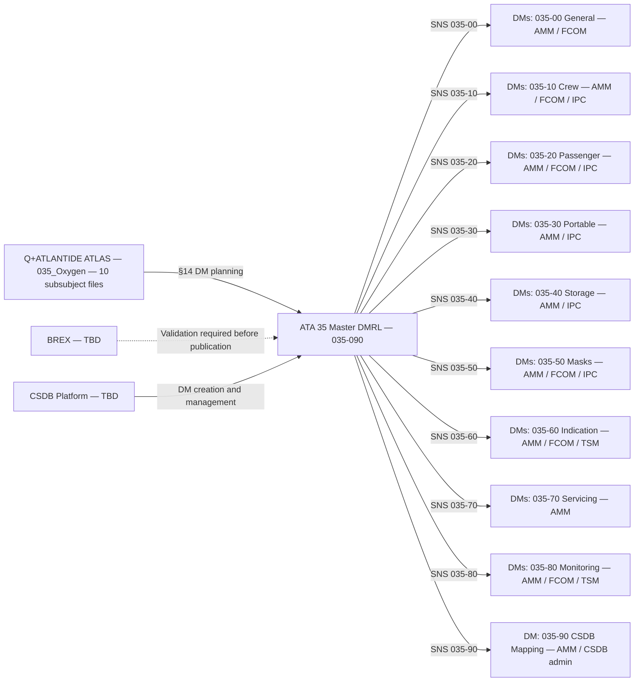
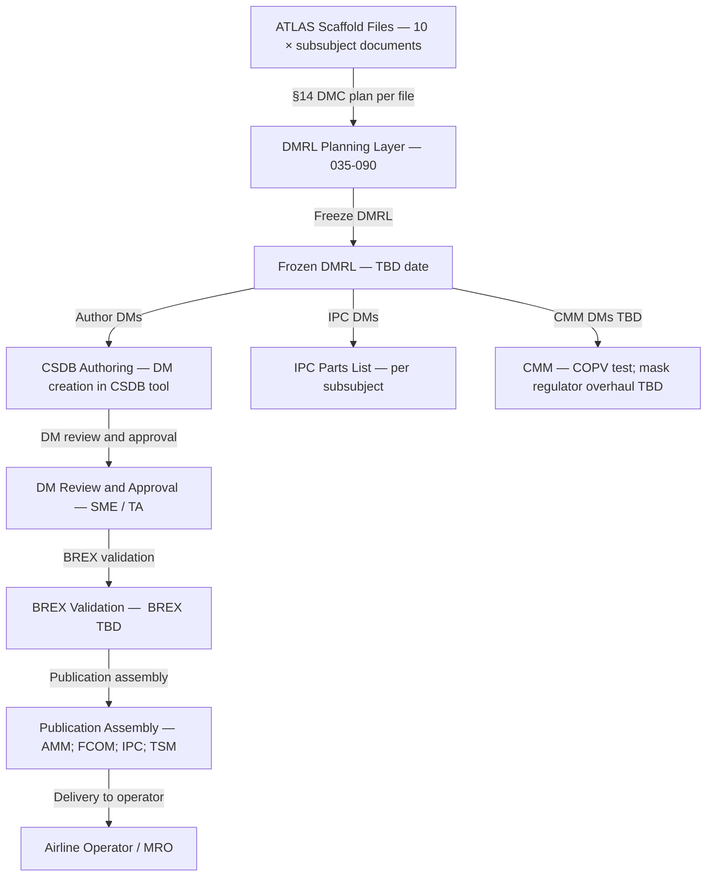

# 035-090 — S1000D CSDB Mapping and Traceability
### <PROGRAMME> · ATA 35 · Q+ATLANTIDE ATLAS Scaffold

---

## §0 Hyperlink Policy

All internal links in this document use relative paths from the current directory. External regulatory and standards references use anchor links defined in [§20 References](#20-references). Links marked **TBD** indicate targets not yet allocated within the CSDB or ATLAS hierarchy. Programme-level links traverse five directory levels (`../../../../../`) to reach the repository root. No absolute URLs are used for internal navigation.

---

## §1 Purpose

This document provides the complete S1000D Data Module Requirements List (DMRL) mapping and CSDB traceability for the <PROGRAMME> ATA 35 Oxygen system, covering all ten subsubjects (035-00 through 035-90). It defines the SNS (System Numbering Standard) codes, recommended Data Module Code (DMC) prefixes, planned information codes, BREX applicability, and the planned publication hierarchy for all oxygen system technical data.

This is the master CSDB planning document for ATA 35. Its purpose is to provide the CSDB administrator and the technical publication team with a single source of truth for DM planning status, enabling tracking of DM creation, review, and publication progress across the oxygen system lifecycle.

---

> **Agnostic standard.** This file defines the S1000D/CSDB mapping rule for this ATLAS node. It does not instantiate programme-specific DMCs, model identifiers, or system-difference codes. Programme-specific content belongs in the programme implementation branch.

## §2 Applicability

| Attribute | Value |
|---|---|
| Programme | AMPEL360e Wide Tube-and-Wing (<PROGRAMME-SHORT>) |
| ATA Chapter | ATA 35 — Oxygen |
| ATA Subsubjects Covered | 035-00 through 035-90 (10 subsubjects) |
| S1000D Issue | Issue 5.0 |
| SNS Range | 035-00 to 035-90 |
| DMC Prefix | DMC-<MODEL>-<SYSTEMDIFF>-035-{subsubject} |
| DMRL Status | Draft — not yet frozen |
| BREX | Ampel360e <PROGRAMME-SHORT> BREX TBD |
| Publication Types Planned | AMM, FCOM, IPC, TSM, CMM (per DM type) |
| Applicability Code | ALL (all <PROGRAMME-SHORT> aircraft in programme) |
| Effectivity | From MSN 001 |
| S1000D SNS | 035-90 |

---

## §3 System / Function Overview

The <PROGRAMME> ATA 35 Oxygen system is divided into ten subsubjects as defined in the Q+ATLANTIDE ATLAS scaffold. Each subsubject corresponds to an ATA 35 subsystem area and has a dedicated ATLAS document (this file set, 035-000 through 035-090). Each ATLAS document contains a §14 S1000D/CSDB mapping section that defines the planned DMCs for that subsubject.

This master document (035-090) consolidates all §14 entries from the ten ATLAS files into a single DMRL overview table. It provides the programme-level CSDB administrator with a comprehensive view of all planned DMs, their information codes, priority, and current DMRL status.

The ATA 35 oxygen system on the <PROGRAMME-SHORT> is architecturally simple: no LOX (liquid oxygen), no OBOGS (on-board oxygen generation system), no ARINC 615A software servicing. The DM set is therefore relatively compact, with the majority of DMs in the AMM (maintenance), FCOM (operations), and IPC (parts) publication types.

---

## §4 Scope

### 4.1 Included
- Master DMRL table: all planned DMs for ATA 35-00 through 35-90
- SNS code assignments for all ten subsubjects
- DMC prefix and information code plan per subsubject
- BREX applicability statement
- Publication hierarchy overview (AMM, FCOM, IPC, TSM, CMM)
- DMRL status tracking per subsubject
- Atlas-to-CSDB traceability matrix
- Open DMRL issues and planning decisions

### 4.2 Excluded
- Physical descriptions of oxygen system components — see individual subsubject documents
- DM content (this document plans DMs; DM authoring is a CSDB team task)
- CSDB tool configuration (CSDB platform TBD)
- IPC part numbering — IPC chapter to be authored separately by the IPC team

---

## §5 Architecture Description

### 5.1 SNS Structure for ATA 35 on <PROGRAMME-SHORT>

| SNS Code | Subsubject Title | ATLAS File |
|---|---|---|
| 035-00 | Oxygen — General | 035-000-Oxygen-General.md |
| 035-10 | Crew Oxygen System | 035-010-Crew-Oxygen-System.md |
| 035-20 | Passenger Oxygen System | 035-020-Passenger-Oxygen-System.md |
| 035-30 | Portable Oxygen Equipment | 035-030-Portable-Oxygen-Equipment.md |
| 035-40 | Oxygen Storage and Distribution | 035-040-Oxygen-Storage-and-Distribution.md |
| 035-50 | Oxygen Masks, Regulators, and Dispensing Units | 035-050-Oxygen-Masks-Regulators-and-Dispensing-Units.md |
| 035-60 | Oxygen Pressure Indication and Warning | 035-060-Oxygen-Pressure-Indication-and-Warning.md |
| 035-70 | Oxygen Servicing and Replenishment Interfaces | 035-070-Oxygen-Servicing-and-Replenishment-Interfaces.md |
| 035-80 | Oxygen Monitoring, Diagnostics, and Control Interfaces | 035-080-Oxygen-Monitoring-Diagnostics-and-Control-Interfaces.md |
| 035-90 | S1000D CSDB Mapping and Traceability | 035-090-S1000D-CSDB-Mapping-and-Traceability.md |

### 5.2 DMC Construction

DMC format: `DMC-<MODEL>-<SYSTEMDIFF>-035-{NN}-{variant}-{info code}-{lang}`

- Model ident code: `<MODEL>`
- System diff code: `<PROGRAMME-SHORT>`
- System code: `035`
- Subsystem code: `{NN}` (00 through 90)
- Subject code and variant: TBD per DM
- Info code: see §6 master DMRL table
- Lang: `AA` (English)

### 5.3 BREX Applicability

The Ampel360e <PROGRAMME-SHORT> BREX (Business Rules EXchange) is **TBD** — not yet defined. The ATLAS scaffold documents are authored to be BREX-compatible with S1000D Issue 5.0 default rules. When the programme BREX is defined, all 035 DMs must be validated against it before publication.

### 5.4 Publication Hierarchy

| Publication Type | S1000D Definition | ATA 35 Applicability |
|---|---|---|
| AMM | Aircraft Maintenance Manual — procedural DMs for maintenance tasks | Primary publication for all 035 maintenance, inspection, and replacement tasks |
| FCOM | Flight Crew Operating Manual — crew procedures and system descriptions | Crew O₂ normal and abnormal procedures; COG deployment; QRH O₂ alerts |
| IPC | Illustrated Parts Catalogue — parts data DMs | Oxygen components: COPV, COG, PBE, masks, regulators, valves, transducers |
| TSM | Troubleshooting Manual — fault isolation DMs | ECAM/CAS fault isolation; CMC fault code troubleshooting |
| CMM | Component Maintenance Manual — if required for component overhaul | COPV hydrostatic test (external facility); mask regulator overhaul TBD |

---

## §6 Master DMRL Table — ATA 35 All Subsubjects

| SNS | Subsubject | DMC Suffix | Info Code | DM Title | Publication | Priority | DMRL Status |
|---|---|---|---|---|---|---|---|
| 035-00 | Oxygen General | -035-00-00-040A | 040 | Oxygen System — General Description | AMM | High |  |
| 035-00 | Oxygen General | -035-00-00-300A | 300 | Oxygen System — General Normal and Emergency Procedures | FCOM | High |  |
| 035-10 | Crew Oxygen | -035-10-00-040A | 040 | Crew Oxygen System — Description | AMM | High |  |
| 035-10 | Crew Oxygen | -035-10-00-300A | 300 | Crew Oxygen — Normal Procedures | FCOM | High |  |
| 035-10 | Crew Oxygen | -035-10-00-300B | 300 | Crew Oxygen — Abnormal Procedures (O2 LO PR; O2 OFF) | FCOM | High |  |
| 035-10 | Crew Oxygen | -035-10-00-400A | 400 | Crew Oxygen Isolation Valve — Removal, Test, Installation | AMM | High |  |
| 035-10 | Crew Oxygen | -035-10-00-400B | 400 | Crew Oxygen PRV — Removal, Test, Installation | AMM | High |  |
| 035-10 | Crew Oxygen | -035-10-00-941A | 941 | Crew Oxygen System — IPC Parts List | IPC | High |  |
| 035-20 | Passenger Oxygen | -035-20-00-040A | 040 | Passenger Oxygen System — Description | AMM | High |  |
| 035-20 | Passenger Oxygen | -035-20-00-300A | 300 | COG Deployment — Normal and Emergency Procedures | FCOM | High |  |
| 035-20 | Passenger Oxygen | -035-20-00-400A | 400 | COG Unit — Removal and Replacement | AMM | High |  |
| 035-20 | Passenger Oxygen | -035-20-00-400B | 400 | PSU Panel — Removal and Access | AMM | Medium |  |
| 035-20 | Passenger Oxygen | -035-20-00-941A | 941 | Passenger Oxygen System — IPC Parts List | IPC | High |  |
| 035-30 | Portable Equipment | -035-30-00-040A | 040 | Portable Oxygen Equipment — Description | AMM | High |  |
| 035-30 | Portable Equipment | -035-30-00-400A | 400 | PBE — Removal and Replacement | AMM | High |  |
| 035-30 | Portable Equipment | -035-30-00-400B | 400 | Medical O₂ Cylinder — Removal and Replacement | AMM | High |  |
| 035-30 | Portable Equipment | -035-30-00-941A | 941 | Portable Oxygen Equipment — IPC Parts List | IPC | Medium |  |
| 035-40 | Storage and Distribution | -035-40-00-040A | 040 | Oxygen Storage and Distribution — Description | AMM | High |  |
| 035-40 | Storage and Distribution | -035-40-00-400A | 400 | COPV Cylinder — Visual Inspection | AMM | High |  |
| 035-40 | Storage and Distribution | -035-40-00-400B | 400 | COPV Cylinder — Removal, Hydrostatic Test, Reinstallation | AMM | High |  |
| 035-40 | Storage and Distribution | -035-40-00-400C | 400 | Distribution Tubing — Leak Test and Inspection | AMM | High |  |
| 035-40 | Storage and Distribution | -035-40-00-941A | 941 | Oxygen Storage and Distribution — IPC Parts List | IPC | High |  |
| 035-50 | Masks / Regulators | -035-50-00-040A | 040 | Oxygen Masks, Regulators, Dispensing Units — Description | AMM | High |  |
| 035-50 | Masks / Regulators | -035-50-00-300A | 300 | Crew Mask Donning — Normal Procedures | FCOM | High |  |
| 035-50 | Masks / Regulators | -035-50-00-400A | 400 | QDM Mask — Removal, Inspection, Replacement | AMM | High |  |
| 035-50 | Masks / Regulators | -035-50-00-400B | 400 | Diluter-Demand Regulator — Removal, Test, Replacement | AMM | High |  |
| 035-50 | Masks / Regulators | -035-50-00-400C | 400 | Passenger Dispensing Unit — Functional Check | AMM | High |  |
| 035-50 | Masks / Regulators | -035-50-00-941A | 941 | Oxygen Masks, Regulators, Dispensing Units — IPC Parts List | IPC | High |  |
| 035-60 | Pressure Indication | -035-60-00-040A | 040 | Oxygen Pressure Indication and Warning — Description | AMM | High |  |
| 035-60 | Pressure Indication | -035-60-00-300A | 300 | O₂ Pressure Indication — Normal and Abnormal Procedures | FCOM | High |  |
| 035-60 | Pressure Indication | -035-60-00-400A | 400 | Pressure Transducer — Inspection, Calibration, Replacement | AMM | High |  |
| 035-60 | Pressure Indication | -035-60-00-400B | 400 | CAS Alert System Test — O₂ Warning | AMM | High |  |
| 035-60 | Pressure Indication | -035-60-00-520A | 520 | O₂ Pressure Indication — Fault Isolation | TSM | Medium |  |
| 035-70 | Servicing | -035-70-00-300A | 300 | Crew O₂ Cylinder Replenishment — Servicing Procedure | AMM | High |  |
| 035-70 | Servicing | -035-70-00-400A | 400 | COPV Cylinder — Visual Inspection | AMM | High |  |
| 035-70 | Servicing | -035-70-00-400B | 400 | COPV Cylinder — Removal, Hydrostatic Test Preparation | AMM | High |  |
| 035-70 | Servicing | -035-70-00-400C | 400 | COG Unit — Replacement (Post-Deployment / Expiry) | AMM | High |  |
| 035-70 | Servicing | -035-70-00-400D | 400 | PBE — Removal, Inspection, Replacement | AMM | High |  |
| 035-70 | Servicing | -035-70-00-720A | 720 | Oxygen Servicing Precautions and GSE Requirements | AMM | High |  |
| 035-80 | Monitoring / Diagnostics | -035-80-00-040A | 040 | Oxygen Monitoring and Diagnostics — Description | AMM | High |  |
| 035-80 | Monitoring / Diagnostics | -035-80-00-300A | 300 | Ground Maintenance Tests — Oxygen System | AMM | High |  |
| 035-80 | Monitoring / Diagnostics | -035-80-00-300B | 300 | ECAM O₂ Page — Normal and Abnormal Procedures | FCOM | High |  |
| 035-80 | Monitoring / Diagnostics | -035-80-00-520A | 520 | Oxygen System — CMC Fault Code Isolation | TSM | High |  |
| 035-80 | Monitoring / Diagnostics | -035-80-00-720A | 720 | Inter-System Interfaces — ATA 21/26/23 Oxygen System | AMM | Medium |  |
| 035-90 | CSDB Mapping | -035-90-00-040A | 040 | ATA 35 S1000D CSDB Mapping and DMRL Overview | AMM / CSDB admin | Medium |  |

---

## §7 System Context Diagram



---

## §8 Internal Functional Architecture



---

## §9 Lifecycle Traceability

```mermaid
flowchart LR
    LC02[LC02 Requirements Definition] --> LC03[LC03 Architecture Definition]
    LC03 --> LC05[LC05 Detailed Design]
    LC05 --> LC06[LC06 Verification Planning]
    LC06 --> LC10[LC10 Certification / Approval]
    LC10 --> LC11[LC11 Operation]
    LC11 --> LC12[LC12 Maintenance / Support]
    LC02 -->|ATLAS subsubject structure; DM type requirements; publication types| REQ[CSDB Planning Requirements]
    LC03 -->|SNS assignment; DMC prefix scheme; BREX selection; CSDB tool TBD| ARCH[CSDB Architecture]
    LC05 -->|DMRL freeze; DM authoring begins; info code assignments confirmed| DESIGN[CSDB Design Phase]
    LC06 -->|DM review and BREX validation for V&V procedures DMs| VPLAN[Verification DM Planning]
    LC10 -->|TC deliverable DMs: 040 descriptions; 300 procedures; evidence data modules| TC[TC CSDB Deliverables]
    LC11 -->|FCOM DMs; QRH; FOTT (if required)| OPS[Operational Publications]
    LC12 -->|AMM DMs: all maintenance tasks; TSM fault isolation; IPC parts; CMM TBD| MAINT[Maintenance Publications]
```

---

## §10 Interfaces

| Interface ID | System / Chapter | Interface Type | Data / Signal | Direction | Status |
|---|---|---|---|---|---|
| IF-035-90-001 | CSDB Platform | CSDB tool integration | DM creation, revision, and export | CSDB tool ↔ DMRL plan |  |
| IF-035-90-002 | BREX validation tool | XML/BREX | DM business rule validation | CSDB DMs → BREX tool |  |
| IF-035-90-003 | Q+ATLANTIDE ATLAS | Document reference | ATLAS §14 sections as DMRL planning inputs | ATLAS → DMRL | Internal |
| IF-035-90-004 | IPC authoring tool | Parts data | IPC DMs referencing oxygen system component part numbers | IPC tool → CSDB |  |
| IF-035-90-005 | Certification data package | Document/DM | TC submission DMs: 040 descriptions; 300 procedures | CSDB → TC package |  |
| IF-035-90-006 | Operator EFB / MMS | Publication delivery | Published AMM, FCOM, IPC, TSM DMs delivered to operator | CSDB → Operator |  |

---

## §11 DMRL Status Summary

| Status | Count | Description |
|---|---|---|
| Planned — Not Yet Created | 44 | All DMs in the master DMRL table above — none yet created in CSDB |
| In Authoring | 0 | No DMs yet in active authoring (DMRL not yet frozen) |
| In Review | 0 | No DMs yet in review |
| Approved | 0 | No DMs yet approved |
| BREX Validated | 0 | BREX not yet defined |
| Published | 0 | No DMs yet published |

*Status as of revision 0.1.0 (2026-05-10). DMRL freeze date: TBD.*

---

## §12 Monitoring and Diagnostics (CSDB Context)

- **DMRL tracking**: The DMRL status table (§11) shall be updated at each programme milestone (PDR, CDR, FDR, TC submission). Each update increments the revision of this document.
- **BREX compliance**: All DMs must be validated against the <PROGRAMME-SHORT> BREX before publication. BREX validation is the responsibility of the CSDB administrator. Non-compliant DMs must be corrected before publication.
- **DM version control**: All DMs managed in CSDB with S1000D issue number control. ATLAS scaffold documents are not CSDB DMs — they are programme-controlled markdown files in the Q+ATLANTIDE repository.
- **IPC status**: IPC parts lists for ATA 35 cannot be authored until part numbers are assigned by the design team. IPC DM authoring is a dependency on design freeze for each subsubject.
- **CMM status**: CMM DMs (COPV hydrostatic test; mask regulator overhaul) are TBD — dependent on whether component maintenance is performed in-house or delegated to component manufacturer (Component Maintenance Manual may be a supplier deliverable).

---

## §13 Maintenance Concept (Publications Context)

- **AMM (Aircraft Maintenance Manual)**: Primary publication for all line and base maintenance tasks for ATA 35. DMs planned at info code 300 (procedures), 400 (inspections/removals/installations), 720 (servicing precautions).
- **FCOM (Flight Crew Operating Manual)**: DMs at info code 300 for crew normal and abnormal procedures. Includes QRH-equivalent content for "O2 LO PR CREW", "O2 CREW OFF", and COG deployment.
- **IPC (Illustrated Parts Catalogue)**: DMs at info code 941 for all ATA 35 assemblies. Planned per subsubject (10 IPC DMs minimum). Part numbers TBD.
- **TSM (Troubleshooting Manual)**: DMs at info code 520 for fault isolation. Planned for 035-60 (pressure indication) and 035-80 (monitoring/diagnostics). CMC fault code isolation trees.
- **CMM (Component Maintenance Manual)**: TBD — potentially applicable to COPV (hydrostatic test) and diluter-demand regulator (overhaul). May be a supplier deliverable rather than an <PROGRAMME-SHORT> programme document.

---

## §14 S1000D / CSDB Mapping (Self-Reference)

### 14.1 SNS to DMC Mapping

| SNS Code | Subsubject Title | DMC Prefix | Info Codes Planned | DMRL Status |
|---|---|---|---|---|
| 035-90 | S1000D CSDB Mapping and Traceability | DMC-<MODEL>-<SYSTEMDIFF>-035-90 | 040 |  |

### 14.2 Data Module Breakdown — 035-90

| DM Code Suffix | Info Code | Data Module Title | Priority |
|---|---|---|---|
| -035-90-00-040A | 040 | ATA 35 S1000D CSDB Mapping and DMRL Overview | Medium |

---

## §15 Footprints

### 15.1 Physical Footprint
- Not applicable — this is a data/publications planning document with no physical system component.

### 15.2 Electrical / Data Footprint
- Not applicable.

### 15.3 Maintenance Footprint
- DMRL document maintenance: updated at each programme milestone by CSDB administrator / publications lead. Estimated effort: TBD hours per update.

### 15.4 Data Footprint — DMRL Summary

| Item | Count |
|---|---|
| SNS subsubjects covered | 10 |
| Total DMs planned | 44 |
| AMM DMs planned | 30 |
| FCOM DMs planned | 7 |
| IPC DMs planned | 5 |
| TSM DMs planned | 2 |
| CMM DMs planned | TBD |
| CSDB platform | TBD |
| BREX | TBD |

---

## §16 Safety and Certification Considerations

| Requirement | Source | Description | Compliance Approach | Status |
|---|---|---|---|---|
| CS-25.1529 | EASA CS-25 App H | Instructions for Continued Airworthiness (ICA) — AMM deliverable required | All ATA 35 AMM DMs (300, 400 info codes) contribute to ICA compliance |  |
| CS-25.1541 | EASA CS-25 | Placards and markings | Not directly a CSDB DM requirement, but servicing label DMs (720 info code) support placard compliance |  |
| S1000D Issue 5.0 | ASD-STAN | DM construction and CSDB compliance | All DMs authored to S1000D Issue 5.0; BREX validated when BREX is defined |  |

---

## §17 Verification and Validation (Publications Context)

| V&V ID | Requirement | Method | Success Criterion | Status |
|---|---|---|---|---|
| VV-035-90-001 | DMRL completeness — CS-25.1529 ICA | Review: DMRL reviewed against ATA 35 system description to confirm all maintenance tasks are covered by at least one DM | All identified maintenance tasks have a corresponding DM in DMRL |  |
| VV-035-90-002 | BREX compliance | BREX validation tool: run all ATA 35 DMs against <PROGRAMME-SHORT> BREX | Zero BREX violations in any ATA 35 DM |  |
| VV-035-90-003 | DMC uniqueness | CSDB tool: verify no duplicate DMCs within ATA 35 | All 44 planned DMCs are unique and correctly constructed |  |
| VV-035-90-004 | FCOM procedure completeness | Review: FCOM DMs reviewed against QRH alert list | All O₂ CAS alerts have a corresponding FCOM abnormal procedure DM |  |
| VV-035-90-005 | IPC part number assignment | Review: IPC DMs cross-checked against design BoM for ATA 35 | All components in the ATA 35 BoM are represented in an IPC DM |  |

---

## §18 Glossary

| Term | Definition |
|---|---|
| BREX | Business Rules EXchange — S1000D mechanism for defining programme-specific rules governing DM content and structure |
| CMM | Component Maintenance Manual — technical publication covering overhaul and test of aircraft components |
| CSDB | Common Source Data Base — the S1000D database environment where DMs are created, managed, and published |
| DM | Data Module — the basic unit of technical information in S1000D; identified by a DMC |
| DMC | Data Module Code — the unique identifier for a DM in S1000D; structured as model/system/subsystem/variant/info code/lang |
| DMRL | Data Module Requirements List — the programme-controlled master list of all planned DMs, their DMCs, status, and priority |
| FCOM | Flight Crew Operating Manual — publication for flight crew; includes normal and abnormal procedures, system descriptions |
| IPC | Illustrated Parts Catalogue — publication listing all aircraft parts with part numbers and illustrative cross-sections |
| SNS | System Numbering Standard — S1000D system for assigning numeric codes to aircraft systems and subsubjects |
| TSM | Troubleshooting Manual — publication providing fault isolation logic and procedures for maintenance use |

---

## §19 Citations

| Citation ID | Source | Title | Relevance |
|---|---|---|---|
| CIT-035-90-001 | ASD-STAN | S1000D Issue 5.0 — International Specification for Technical Publications | Primary standard for all CSDB mapping and DM construction |
| CIT-035-90-002 | EASA | CS-25 Appendix H — Instructions for Continued Airworthiness | Basis for AMM DM completeness requirement (CS-25.1529) |
| CIT-035-90-003 | ATA | iSpec 2200 — Information Standards for Aviation Maintenance | SNS code alignment with ATA chapter structure |

---

## §20 References

| Ref ID | Document | Title | Link |
|---|---|---|---|
| REF-035-90-001 | S1000D Issue 5.0 | International Specification for Technical Publications | [s1000d.org](https://s1000d.org/) |
| REF-035-90-002 | CS-25 Appendix H | EASA — Instructions for Continued Airworthiness | [EASA CS-25](#) |
| REF-035-90-003 | ATA iSpec 2200 | Information Standards for Aviation Maintenance | [ATA](#) |
| REF-035-90-004 | Q+ATLANTIDE ATLAS | 035-000 through 035-080 ATLAS scaffold files | [./035-000-Oxygen-General.md](./035-000-Oxygen-General.md) |

---

## §21 Open Issues

| Issue ID | Description | Owner | Priority | Status |
|---|---|---|---|---|
| OI-035-90-001 | CSDB platform selection — confirm which CSDB tool will be used (e.g., Cortona3D, Flatirons, custom) for the <PROGRAMME> programme; tool must support S1000D Issue 5.0 | Q-DATAGOV | High |  |
| OI-035-90-002 | BREX definition — <PROGRAMME-SHORT> BREX must be defined before DMRL freeze; all ATA 35 ATLAS §14 DMC plans assume S1000D Issue 5.0 default rules | Q-DATAGOV | High |  |
| OI-035-90-003 | DMRL freeze date — confirm target date for DMRL freeze (aligned with CDR or PDR milestone); freeze is a prerequisite for commencing DM authoring | Q-DATAGOV / ORB-PMO | High |  |
| OI-035-90-004 | IPC part number dependency — IPC DMs cannot be authored until ATA 35 design is frozen and part numbers are assigned; confirm design freeze date for each subsubject | Q-AIR / Q-MECHANICS | High |  |
| OI-035-90-005 | CMM scope — determine whether COPV hydrostatic test and diluter-demand regulator overhaul will be covered by <PROGRAMME-SHORT> programme CMMs or by component supplier CMMs; assess impact on DMRL count | Q-AIR / Q-MECHANICS | Medium |  |
| OI-035-90-006 | FOTT (Flight Operations Training Tasks) — assess whether any ATA 35 FCOM DMs also need to produce FOTT content; TBD per airline training agreement | Q-AIR / ORB-LEG | Low |  |
| OI-035-90-007 | DM count validation — the 44 DMs planned in this DMRL are based on the ATLAS scaffold §14 entries; a formal DM count review is required after ATLAS SME review to confirm completeness | Q-DATAGOV / Q-AIR | Medium |  |

---

## §22 Change Log

| Revision | Date | Author | Description |
|---|---|---|---|
| 0.1.0 | 2026-05-10 | Q+ATLANTIDE / Q-AIR | Initial full-template creation — master DMRL table with 44 DMs across all 10 ATA 35 subsubjects; BREX and CSDB platform TBD; open issues registered |
