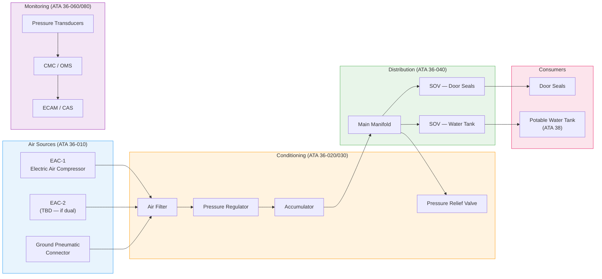
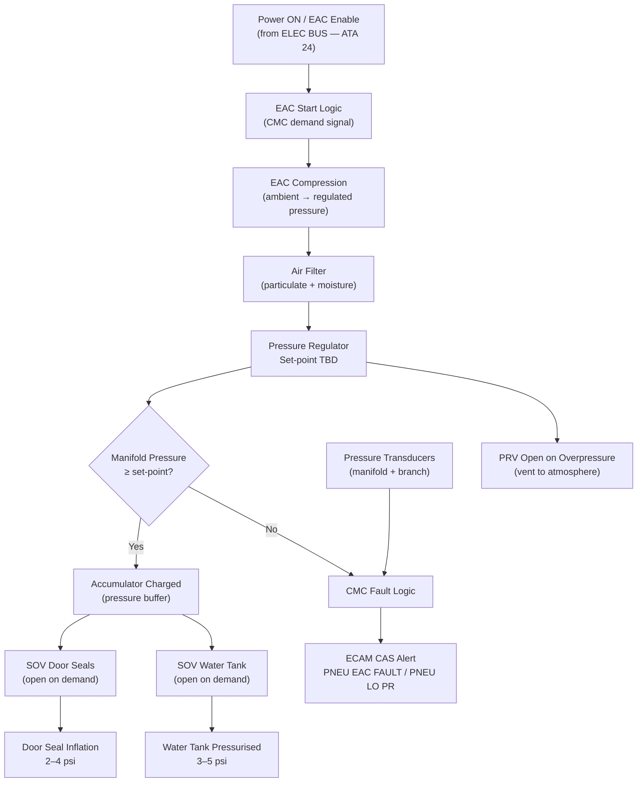
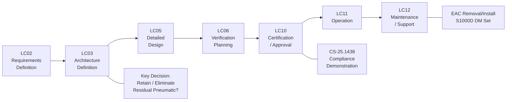

# 036-000 — Pneumatic — General
### AMPEL360e eWTW · ATA 36 · Q+ATLANTIDE ATLAS Scaffold

---

## §0 Hyperlink Policy

All internal links in this document use relative paths from the current directory. External regulatory and standards references use anchor links defined in [§20 References](#20-references). Links marked **TBD** indicate targets not yet allocated within the CSDB or ATLAS hierarchy. Programme-level links traverse five directory levels (`../../../../../`) to reach the repository root. No absolute URLs are used for internal navigation.

---

## §1 Purpose

This document provides the top-level general description of ATA 36 — Pneumatic — as implemented on the AMPEL360e Wide Tube-and-Wing (eWTW) fully electric aircraft. It establishes the architectural philosophy, scope, and functional decomposition across nine subsubjects (036-010 through 036-090).

**Fundamental eWTW architectural difference**: The AMPEL360e eWTW is a **bleed-less / no-bleed** aircraft. Unlike conventional commercial transport aircraft that extract high-pressure, high-temperature air from engine compressor stages for pneumatic services (cabin pressurisation, wing anti-ice, hydraulic reservoir pressurisation), the eWTW **does not use engine bleed air for any purpose**. There are no High-Pressure (HP) or Low-Pressure (LP) bleed ports on the eWTW propulsion system. All functions traditionally served by engine bleed air are supplied by electric means on the eWTW.

ATA 36 on the eWTW therefore covers a **residual low-pressure pneumatic circuit** whose scope, necessity, and architecture remain **under architectural review** (see §21 Open Issues). If retained, the residual circuit provides pneumatic supply to a limited set of consumers: door seal inflation, potable water tank pressurisation, and ground pneumatic service. Air is sourced from one or more Electric Air Compressors (EAC) and/or a Ground Pneumatic Connector (external cart). Primary Q-Division is [Q-AIR](../../../../../Q-Divisions/Q-AIR/); supporting Q-Divisions are [Q-MECHANICS](../../../../../Q-Divisions/Q-MECHANICS/), [Q-DATAGOV](../../../../../Q-Divisions/Q-DATAGOV/), and [Q-GREENTECH](../../../../../Q-Divisions/Q-GREENTECH/).

---

## §2 Applicability

| Attribute | Value |
|---|---|
| Programme | AMPEL360e Wide Tube-and-Wing (eWTW) |
| ATA Chapter | 36 — Pneumatic |
| Aircraft Variant | eWTW-100 (baseline) |
| Propulsion | Full-electric (no engine bleed air; no hydraulic actuation) |
| Engine Bleed | **None** — bleed-less architecture |
| APU Bleed | **None** — no APU fitted; electric ground power unit equivalent |
| Residual Pneumatic | EAC-sourced low-pressure circuit (TBD — under review) |
| Working Pressure |  (estimated 3–50 psi range) |
| Certification Basis | CS-25.1438 (Pneumatic Systems); CS-25.1301/1309 |
| Environmental Std | DO-160G |
| S1000D Issue | 5.0 |
| SNS Reference | 036-00 |
| Applicability Code | ALL (all eWTW aircraft in programme) |
| Effectivity | From MSN 001 |

---

## §3 System / Function Overview

ATA 36 on the AMPEL360e eWTW covers the **residual low-pressure pneumatic system**, which is architecturally minimal compared to conventional bleed-air aircraft. The conventional ATA 36 scope on bleed-equipped aircraft includes: engine bleed air extraction, bleed valve control, cross-bleed manifold, high-temperature duct distribution, pre-coolers, and supply to ECS (ATA 21), wing anti-ice (ATA 30), and hydraulic reservoir pressurisation. **None of these apply to the eWTW.**

### 3.1 eWTW Pneumatic Consumers (If Residual Circuit Retained)

| Consumer | Nominal Pressure | Source | Status |
|---|---|---|---|
| Door seal inflation | 2–4 psi | EAC or ground |  |
| Potable water tank pressurisation | 3–5 psi | EAC or dedicated small pump |  |
| Ground pneumatic service | External cart | Ground connector |  |
| Wing anti-ice (ATA 30) | N/A | **NOT supplied by ATA 36** — electrothermal EWAI | Eliminated |
| Cabin pressurisation (ATA 21) | N/A | **NOT supplied by ATA 36** — EDC-sourced | Eliminated |
| Hydraulic reservoir pressurisation | N/A | **ELIMINATED** — no hydraulics | Eliminated |
| Pneumatic actuators | N/A | **ELIMINATED** — all electric actuators | Eliminated |
| Waste system | N/A | Vacuum waste — no pneumatic required | Eliminated |
| Rain repellent | N/A | Likely eliminated — TBD |  |

### 3.2 Residual EAC Architecture (If Retained)

If the ATA 36 pneumatic circuit is retained, the architecture consists of:
- One or two **Electric Air Compressors (EAC)** — motor-driven, sized for low-pressure, low-flow consumers
- **Air filter** (particulate, moisture separator)
- **Pressure regulator** — downstream of EAC, set point TBD
- **Pressure accumulator** — small buffer vessel for transient demand
- **Distribution manifold** — low-pressure, compact
- **Solenoid valves** — electrically controlled, normally closed, to each consumer branch
- **Check valves / NRV** — prevent backflow between branches
- **Pressure relief valve (PRV)** — overpressure protection
- **Pressure transducers** — manifold and branch monitoring

---

## §4 Scope

### 4.1 Included
- Residual low-pressure pneumatic circuit (if retained): EAC(s), filter, regulator, accumulator, manifold
- Pneumatic distribution lines to door seals and water tank (TBD)
- Solenoid shutoff valves (SOV) per consumer branch
- Check valves (NRV) and pressure relief valve (PRV)
- Ground pneumatic connector (external service receptacle, TBD)
- Manifold pressure transducers and branch pressure sensors
- CMC/OMS fault flagging for EAC and pressure faults
- Cockpit indication: EAC status, manifold pressure (if circuit retained)
- CAS alerts: "PNEU EAC FAULT" (amber), "PNEU LO PR" (amber)
- S1000D CSDB mapping for ATA 36 subsubjects (036-090)

### 4.2 Excluded
- Engine bleed air (NOT applicable — bleed-less architecture)
- APU bleed air (NOT applicable — no APU)
- Cross-bleed manifold (NOT applicable)
- Bleed valve / pre-cooler / HP/LP port (NOT applicable)
- Hot-air duct overheat (OHT) sensors (NOT required — no hot bleed)
- Wing anti-ice pneumatic supply (ATA 30 — electrothermal on eWTW)
- Cabin pressurisation pneumatic supply (ATA 21 — EDC-sourced)
- Hydraulic reservoir pressurisation (no hydraulics on eWTW)
- Pneumatic actuators (all electric on eWTW)

---

## §5 Architecture Description

### 5.1 Bleed-less Philosophy

The eWTW eliminates engine bleed by replacing bleed-supplied functions with electrically driven equivalents:
- **Cabin pressurisation (ATA 21)**: Electric Driven Compressors (EDC) — dedicated high-flow compressors, not part of ATA 36.
- **Wing anti-ice (ATA 30)**: Electrothermal Wing Anti-Ice (EWAI) system — electric heating mats in wing leading edge.
- **Engine nacelle anti-ice**: Electric (TBD).
- **Hydraulics**: ELIMINATED — eWTW is fully electric.

ATA 36 retains only the **residual low-pressure utility circuit** for functions that cannot be economically electrified (door seals, water tank pressurisation). Even these are under review for elimination or replacement by alternative means (e.g., electric compression door seals, electric water pump pressurisation).

### 5.2 EAC Configuration

| Parameter | Value |
|---|---|
| EAC quantity |  (1 or 2) |
| EAC type | Motor-driven reciprocating or scroll compressor |
| EAC rated pressure |  |
| EAC rated flow |  |
| EAC motor power |  |
| EAC location |  (E/E bay or belly fairing) |
| EAC redundancy |  |
| Accumulator volume |  |
| Manifold material |  (aluminium alloy TBD) |
| Distribution tubing |  (aluminium, stainless, or PTFE-lined) |

---

## §6 Functional Breakdown

| Subsubject | Title | Status |
|---|---|---|
| 036-010 | Pneumatic Air Sources |  |
| 036-020 | Pneumatic Air Distribution |  |
| 036-030 | Pressure Regulation and Shutoff |  |
| 036-040 | Pneumatic Valves, Ducts, and Manifolds |  |
| 036-050 | Leak Detection and Overheat Protection |  |
| 036-060 | Pneumatic System Indication and Warning |  |
| 036-070 | Pneumatic Ground Service and Test Interfaces |  |
| 036-080 | Pneumatic Monitoring, Diagnostics, and Control Interfaces |  |
| 036-090 | S1000D / CSDB Mapping and Traceability |  |

---

## §7 System Context Diagram

---

## §8 Internal Functional Architecture

---

## §9 Lifecycle Traceability

---

## §10 Interfaces

| Interface | ATA Chapter | Description | Direction |
|---|---|---|---|
| Electric power supply | ATA 24 | 28 VDC / 115 VAC for EAC motor, SOV actuation | ATA 24 → ATA 36 |
| ECS / Pressurisation | ATA 21 | No bleed supply from ATA 36; EDC is independent source | Informational |
| Wing Anti-Ice | ATA 30 | No bleed supply from ATA 36; EWAI is electric — cross-ref only | Informational |
| Potable Water | ATA 38 | Pneumatic pressurisation of water tank (TBD) | ATA 36 → ATA 38 |
| Doors | ATA 52 | Door seal inflation from manifold SOV (TBD) | ATA 36 → ATA 52 |
| CMC / OMS | ATA 45 | Fault flags, EAC status, pressure data via AFDX | ATA 36 → ATA 45 |
| ECAM / Display | ATA 31 | CAS alerts, EAC indication page | ATA 36 → ATA 31 |
| Ground Support | — | Ground pneumatic connector — external cart | External → ATA 36 |
| Propulsion | ATA 70–80 | **No interface** — no bleed ports on eWTW engines | None |
| APU | ATA 49 | **No interface** — no APU bleed on eWTW | None |

---

## §11 Operating Modes

| Mode | Description | EAC State | SOVs |
|---|---|---|---|
| Normal Flight | EAC on-demand; door seals inflated; water tank pressurised | Auto (demand) | Per consumer demand |
| Ground — Engines Running | EAC available (if retained); ground connector disconnected | Auto | Per consumer demand |
| Ground — GPU Only | EAC powered from ground power; ground connector may be connected | Auto or Manual | Per consumer demand |
| Maintenance | EAC manually commanded; circuit isolated for test | Manual via maintenance terminal | Manual |
| Fault — EAC Failure | CAS alert; accumulator provides residual pressure; graceful degradation | OFF / FAULT | Closed (no demand) |
| Fault — Pressure Loss | CMC flags PNEU LO PR; SOVs close; investigation required | Auto shutdown TBD | Closed |
| Ground Pneumatic Service | External cart connected to ground pneumatic connector | OFF (EAC bypassed) | Per service procedure |

---

## §12 Monitoring and Diagnostics

| Parameter | Sensor | Location | Threshold | CAS Alert |
|---|---|---|---|---|
| EAC status | Motor controller feedback | EAC unit | ON/OFF/FAULT | PNEU EAC FAULT (amber) |
| EAC outlet pressure | Pressure transducer | EAC outlet |  | PNEU LO PR (amber) |
| Manifold pressure | Pressure transducer | Main manifold |  | PNEU LO PR (amber) |
| Door seal pressure | Pressure transducer (TBD) | Per door (TBD) |  |  |
| Water tank pressure | Pressure transducer | Water tank (ATA 38) |  |  |
| EAC run hours | CMC accumulator | CMC | Maintenance interval TBD | Maintenance advisory |
| SOV position | Valve feedback (TBD) | Each SOV | Open/Closed |  |

---

## §13 Maintenance Concept

### 13.1 Line Maintenance
- EAC filter replacement: scheduled interval TBD; accessible from  access panel
- Pressure transducer check: functional test via maintenance terminal
- SOV function test: open/close cycle via maintenance terminal
- System leak test: pressure decay test, acceptance criteria TBD

### 13.2 Base Maintenance
- EAC removal and installation: S1000D DM set (036-090 planned)
- Accumulator inspection / replacement: per pressure vessel inspection requirements
- Manifold inspection: visual and pressure test
- Ground connector inspection: coupling integrity, seal condition

### 13.3 Servicing
- Ground pneumatic connector: servicing procedure TBD (AMM ATA 36-070)
- EAC does not require fluid servicing (dry compression — TBD if oil-free scroll type confirmed)

---

## §14 S1000D / CSDB Mapping

| Subsubject | SNS | DMC Prefix | DM Types Planned | Status |
|---|---|---|---|---|
| 036-000 | 036-00 | DMC-AMPEL360E-EWTW-036-00 | 040 (Desc), 300 (Insp) |  |
| 036-010 | 036-10 | DMC-AMPEL360E-EWTW-036-10 | 040, 300, 520, 720 |  |
| 036-020 | 036-20 | DMC-AMPEL360E-EWTW-036-20 | 040, 300 |  |
| 036-030 | 036-30 | DMC-AMPEL360E-EWTW-036-30 | 040, 300, 520, 720 |  |
| 036-040 | 036-40 | DMC-AMPEL360E-EWTW-036-40 | 040, 300 |  |
| 036-050 | 036-50 | DMC-AMPEL360E-EWTW-036-50 | 040, 300, 400 |  |
| 036-060 | 036-60 | DMC-AMPEL360E-EWTW-036-60 | 040, 300 |  |
| 036-070 | 036-70 | DMC-AMPEL360E-EWTW-036-70 | 040, 300, 400 |  |
| 036-080 | 036-80 | DMC-AMPEL360E-EWTW-036-80 | 040, 300, 400 |  |
| 036-090 | 036-90 | DMC-AMPEL360E-EWTW-036-90 | 040 |  |

---

## §15 Footprints

| Item | Mass (kg) | Volume (L) | Location | Status |
|---|---|---|---|---|
| EAC-1 |  |  |  |  |
| EAC-2 (if dual) |  |  |  |  |
| Air filter |  |  |  |  |
| Pressure regulator |  |  |  |  |
| Accumulator |  |  |  |  |
| Manifold + valves |  |  |  |  |
| Distribution tubing |  |  | Throughout fuselage |  |
| Ground connector |  |  | Lower fuselage panel |  |
| **Total ATA 36** |  | — | — |  |

---

## §16 Safety and Certification

| Requirement | Standard | Applicability | Notes |
|---|---|---|---|
| Pneumatic systems design | CS-25.1438 | Full | Primary certification paragraph for ATA 36 on eWTW |
| Equipment and installations | CS-25.1301 | Full | General equipment requirements |
| Systems and installations | CS-25.1309 | Full | Failure mode, effects, and criticality analysis (FMECA) required |
| Environmental qualification | DO-160G | Full (pressurised components) | Temperature, vibration, humidity per equipment category |
| Bleed air contamination | CS-25.831 | **Not applicable** | No bleed air — eWTW architecture eliminates this hazard |
| Ventilation | CS-25.831 | Informational only | No bleed air contamination pathway |
| Pressure vessel (accumulator) | CS-25.1438 + authority PED | Full | Accumulator design proof pressure TBD |

### 16.1 Failure Effects (High Level)

| Failure | Effect | Classification |
|---|---|---|
| EAC-1 failure (if single EAC) | Loss of pneumatic supply; accumulator provides transient; door seals may deflate after accumulator depletion |  |
| Manifold pressure loss | Potential door seal deflation; water tank depressurisation |  |
| SOV stuck open (door seal branch) | Door seal over-pressurisation (limited by PRV) |  |
| SOV stuck closed (door seal branch) | Door seal not inflated — door sealing degraded |  |
| PRV fails open | Continuous vent — loss of system pressure |  |

---

## §17 Verification and Validation

| V&V Activity | Method | Acceptance Criteria | Status |
|---|---|---|---|
| EAC functional test | Ground test — power EAC, measure outlet pressure and flow | Pressure ≥ set-point; flow ≥ TBD |  |
| Regulator set-point verification | Ground test — downstream pressure measurement | Set-point ± TBD % |  |
| SOV open/close test | Ground test — command SOV, verify position feedback and downstream pressure change | Open: pressure downstream; Closed: no flow |  |
| System leak test (pressure decay) | Pressurize circuit to TBD psi, isolate EAC, monitor for TBD min | Pressure decay < TBD psi/min |  |
| Ground connector coupling test | Connect ground pneumatic cart, verify supply to manifold | Manifold pressure achieved within TBD s |  |
| Manifold pressure indication accuracy | Compare transducer output vs. reference gauge | ± TBD psi |  |
| CMC fault flag verification | Induce EAC fault; verify CMC flags and CAS alert | "PNEU EAC FAULT" within TBD s |  |
| CS-25.1438 compliance demonstration | Analysis + test | Authority acceptance |  |
| DO-160G environmental qualification | Test per DO-160G categories | Pass all applicable categories |  |

---

## §18 Glossary

| Term | Definition |
|---|---|
| ATA 36 | Air Transport Association chapter 36 — Pneumatic systems |
| Bleed-less architecture | Aircraft design in which no engine compressor bleed air is extracted; all pneumatic functions replaced by electric equivalents |
| EAC | Electric Air Compressor — motor-driven compressor providing low-pressure air for residual pneumatic consumers on eWTW |
| EDC | Electric Driven Compressor — high-flow compressor for cabin pressurisation (ATA 21); distinct from EAC |
| SOV | Shutoff Valve — electrically actuated solenoid valve controlling flow to a consumer branch |
| PRV | Pressure Relief Valve — prevents system overpressure by venting to atmosphere at set threshold |
| NRV | Non-Return Valve — check valve preventing reverse flow |
| OHT | Overheat sensor / loop — used on conventional aircraft to detect hot bleed duct rupture; **not required on eWTW** (no hot bleed) |
| CPCS | Cabin Pressure Control System (ATA 21) — sourced by EDC on eWTW, not by ATA 36 EAC |
| Manifold | Distribution header connecting pneumatic supply to multiple consumer branches |
| Accumulator | Pressurised vessel providing transient buffer capacity to maintain manifold pressure during EAC start lag or brief demand surges |
| Working pressure | Nominal operating pressure of the residual pneumatic circuit — TBD (3–50 psi range) |
| Ground pneumatic connector | External service receptacle on fuselage allowing connection of ground pneumatic cart for maintenance or servicing |
| CS-25.1438 | EASA Certification Specification paragraph governing pneumatic system design for large aeroplanes |
| DO-160G | RTCA standard for environmental conditions and test procedures for airborne equipment |
| CAS | Crew Alerting System — cockpit alert presentation layer |
| ECAM | Electronic Centralised Aircraft Monitor — multi-function display system for system status and alerts |
| CMC | Central Maintenance Computer — on-board system for fault recording, BITE, and maintenance support |
| EWAI | Electrothermal Wing Anti-Ice — electric heating system for wing leading edge ice protection (ATA 30); replaces bleed anti-ice |
| AFDX | Avionics Full-Duplex Switched Ethernet — aircraft data communication bus |

---

## §19 Citations

1. EASA Certification Specifications CS-25 Subpart F — Equipment, §25.1438 (Pneumatic Systems)
2. EASA CS-25 §25.1301 — Equipment and Installations (Function and Installation)
3. EASA CS-25 §25.1309 — Equipment, Systems, and Installations
4. RTCA DO-160G — Environmental Conditions and Test Procedures for Airborne Equipment
5. S1000D Issue 5.0 — International Specification for Technical Publications
6. ATA iSpec 2200 — Information Standards for Aviation Maintenance
7. ATA Chapter 36 — Pneumatic (SNS reference)
8. Q+ATLANTIDE ATLAS Node 036 — eWTW architectural framework
9. AMPEL360e eWTW System Architecture Document (SAD) — TBD reference
10. Q-AIR Division Technical Standard — Bleed-less Architecture Design Rules — TBD

---

## §20 References

| Ref ID | Document | Source | Link |
|---|---|---|---|
| [ATA36] | ATA iSpec 2200 Chapter 36 — Pneumatic | ATA | — |
| [CS25-1438] | CS-25 §25.1438 Pneumatic Systems | EASA | https://www.easa.europa.eu/ |
| [CS25-1301] | CS-25 §25.1301 Equipment and Installations | EASA | https://www.easa.europa.eu/ |
| [CS25-1309] | CS-25 §25.1309 Systems and Installations | EASA | https://www.easa.europa.eu/ |
| [DO-160G] | RTCA DO-160G Environmental Qualification | RTCA | https://www.rtca.org/ |
| [S1000D] | S1000D Issue 5.0 | ASD/AIA | https://s1000d.org/ |
| [ATA21] | ATA 21 — Air Conditioning / Pressurisation | Internal | [036-080](./036-080-Pneumatic-Monitoring-Diagnostics-and-Control-Interfaces.md) |
| [ATA30] | ATA 30 — Ice and Rain Protection | Internal | [036-050](./036-050-Leak-Detection-and-Overheat-Protection.md) |
| [ATA38] | ATA 38 — Water / Waste | Internal | [036-020](./036-020-Pneumatic-Air-Distribution.md) |
| [ATA52] | ATA 52 — Doors | Internal | [036-040](./036-040-Pneumatic-Valves-Ducts-and-Manifolds.md) |

---

## §21 Open Issues

| Issue ID | Description | Owner | Priority | Status |
|---|---|---|---|---|
| OI-036-001 | **Retain or eliminate ATA 36 residual pneumatic circuit**: architectural decision on whether any pneumatic circuit is needed on eWTW | Q-AIR | Critical |  |
| OI-036-002 | **Door seal technology**: pneumatic inflation vs. electric compression seal (e.g., inflatable rubber vs. electric motor-driven compression) — TBD | Q-MECHANICS | High |  |
| OI-036-003 | **Potable water pressurisation method**: pneumatic EAC vs. dedicated electric pump vs. bladder-type pressurisation — TBD | Q-AIR / ATA 38 | High |  |
| OI-036-004 | **EAC sizing and quantity**: rated pressure, flow, power, single vs. dual EAC — depends on consumer finalisation | Q-AIR | High |  |
| OI-036-005 | **Ground pneumatic connector retention**: whether to retain standard ground pneumatic receptacle or replace with ground electric supply only | Q-AIR | Medium |  |
| OI-036-006 | **Manifold material and routing**: aluminium vs. stainless vs. PTFE-lined; routing through composite fuselage (bonding, grounding, penetration sealing) | Q-MECHANICS | Medium |  |
| OI-036-007 | **Rain repellent system**: conventional rain repellent uses pneumatic blow — TBD if eliminated or retained on eWTW | Q-AIR | Low |  |
| OI-036-008 | **CS-25.1438 compliance pathway**: formal compliance document and agreed test plan with authority — not yet initiated | Q-AIR / ORB-LEG | High |  |

---

## §22 Change Log

| Revision | Date | Author | Description |
|---|---|---|---|
| 0.1.0 | 2026-05-10 | Q+ATLANTIDE scaffold generator | Initial full-template scaffold — all sections present; content TBD/DRAFT |
