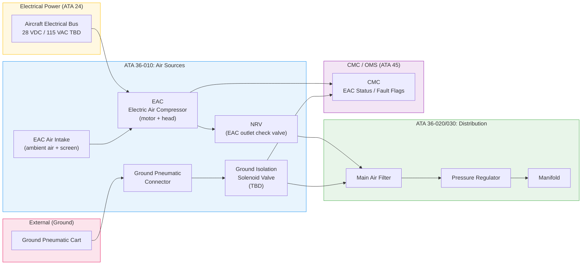
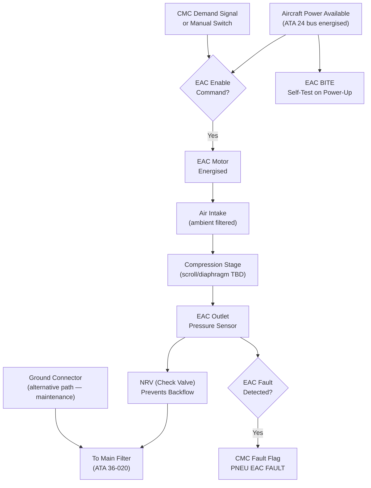
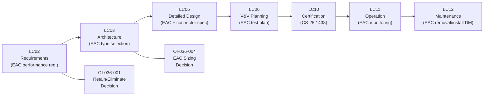

# 036-010 — Pneumatic Air Sources
### AMPEL360e eWTW · ATA 36 · Q+ATLANTIDE ATLAS Scaffold

---

## §0 Hyperlink Policy

All internal links in this document use relative paths from the current directory. External regulatory and standards references use anchor links defined in [§20 References](#20-references). Links marked **TBD** indicate targets not yet allocated within the CSDB or ATLAS hierarchy. Programme-level links traverse five directory levels (`../../../../../`) to reach the repository root. No absolute URLs are used for internal navigation.

---

## §1 Purpose

This document describes the pneumatic air sources for the AMPEL360e eWTW residual pneumatic circuit (ATA 36-010). The most critical architectural fact is stated at the outset:

> **The AMPEL360e eWTW has NO engine bleed air. There are no HP or LP bleed ports on the eWTW propulsion system. There is no APU bleed air. All functions conventionally served by engine bleed are provided by electric systems.**

ATA 36 air sources on the eWTW are therefore limited to:
1. **Electric Air Compressor(s) (EAC)** — on-board, motor-driven, providing low-pressure air for residual pneumatic consumers (door seals, water tank pressurisation — TBD per §21 Open Issues).
2. **Ground Pneumatic Connector** — external receptacle for connection of ground pneumatic cart during maintenance and ground servicing operations.

This document defines the EAC specifications (to the extent known), the ground connector interface, the control and monitoring provisions, and the S1000D mapping for this subsubject.

---

## §2 Applicability

| Attribute | Value |
|---|---|
| Programme | AMPEL360e Wide Tube-and-Wing (eWTW) |
| ATA Subsubject | 036-010 — Pneumatic Air Sources |
| Engine Bleed | **None** — bleed-less architecture |
| APU Bleed | **None** — no APU; electric ground power equivalent |
| On-board Air Source | Electric Air Compressor(s) (EAC) |
| Ground Air Source | Ground Pneumatic Connector (external cart) |
| EAC Quantity |  |
| EAC Rated Pressure |  |
| EAC Rated Flow |  |
| EAC Motor Power |  |
| EAC Location |  |
| Ground Connector Type |  (standard aircraft pneumatic coupling TBD) |
| Ground Connector Location | Lower fuselage panel —  |
| Certification Basis | CS-25.1438; CS-25.1301/1309 |
| Environmental Std | DO-160G |
| S1000D SNS | 036-10 |

---

## §3 System / Function Overview

### 3.1 Conventional Aircraft vs. eWTW

| Feature | Conventional (bleed) | eWTW (bleed-less) |
|---|---|---|
| Primary air source | Engine HP/LP compressor bleed | **None** (no bleed) |
| APU air source | APU bleed compressor | **None** (no APU) |
| Cross-bleed capability | Cross-bleed manifold with isolation valve | **Not applicable** |
| Pre-cooler | Heat exchanger (fan air vs. bleed) | **Not applicable** |
| Bleed valve | Modulating bleed valve per engine | **Not applicable** |
| On-board electric compressor | Generally none for pneumatic | **EAC** (primary source) |
| Ground air source | Ground air cart | Ground pneumatic connector (if retained) |

### 3.2 EAC Function

The EAC(s) compress ambient air to the circuit working pressure (TBD, estimated 3–50 psi) to supply the residual pneumatic manifold. Key operational aspects:
- Commanded ON by CMC or manual maintenance switch
- Runs as-needed (demand-based control or continuous — TBD)
- Motor powered from aircraft electrical bus (ATA 24)
- Outlet air passes through filter, then pressure regulator, to manifold and accumulator
- EAC is non-bleed — no engine interface, no cross-bleed, no pre-cooler

### 3.3 Ground Pneumatic Connector Function

The ground pneumatic connector (if retained) provides an interface for:
- Maintenance blow-down of residual circuit
- Door seal inflation test with EAC de-energised
- Water tank pressurisation from ground (if EAC not used on ground for servicing)
- Cargo hold pneumatic cleaning (if applicable — TBD)
- Supply to circuit during maintenance procedures where EAC isolation is required

---

## §4 Scope

### 4.1 Included
- Electric Air Compressor(s) (EAC): motor unit, compression head, outlet port, local temperature and pressure sensors
- EAC inlet filter / air intake (ambient air intake with screen — location TBD)
- EAC motor controller and enable/disable interface (to CMC/ELMS)
- EAC outlet check valve (NRV — prevents backflow from accumulator into EAC on shutdown)
- Ground pneumatic connector: receptacle body, coupling, check valve, dust cap, location panel
- Ground connector isolation valve (solenoid — prevents ground air from entering when not connected)
- Interconnecting plumbing from EAC outlet to main filter inlet (ATA 36-020 interface)
- Interconnecting plumbing from ground connector to main filter inlet (ATA 36-020 interface)

### 4.2 Excluded
- Engine bleed valves / HP/LP ports (not applicable)
- APU bleed (not applicable)
- Pre-cooler / heat exchanger (not applicable)
- Main filter, pressure regulator, accumulator, manifold (covered in ATA 36-020/030/040)
- ECS EDC (ATA 21 — separate system, not ATA 36)
- Wing anti-ice (ATA 30 — electrothermal, no ATA 36 supply)

---

## §5 Architecture Description

### 5.1 EAC Architecture Options Under Review

| Option | Description | Status |
|---|---|---|
| Option A — Single EAC | One EAC sized for all residual consumers; accumulator provides buffer |  |
| Option B — Dual EAC | Two EACs (active/standby); improved availability; higher cost/mass |  |
| Option C — No EAC | Eliminate ATA 36 entirely; replace consumers with electric alternatives |  |

**Decision required**: See OI-036-001 and OI-036-004 in §21.

### 5.2 EAC Preliminary Specification (TBD)

| Parameter | Preliminary Estimate | Status |
|---|---|---|
| Compressor type | Scroll (oil-free) or diaphragm — TBD |  |
| Rated outlet pressure | TBD (estimated 50 psi max, regulated to consumer req.) |  |
| Rated flow (SCFM) | TBD (low — door seals + water tank only) |  |
| Motor type | Brushless DC or 3-phase AC — TBD |  |
| Motor rated power | TBD (estimated < 500 W) |  |
| Supply voltage | 28 VDC or 115 VAC — TBD (from ATA 24) |  |
| Ambient temp range | −40°C to +70°C per DO-160G |  |
| Altitude qualification | Ground to 43,000 ft (outlet pressure maintained by regulator) |  |
| Mass (est.) | TBD |  |
| MTBF (est.) | TBD |  |
| Oil-free | Yes (assumed — avoids oil contamination of pneumatic circuit) |  |

### 5.3 Ground Pneumatic Connector Specification (TBD)

| Parameter | Value |
|---|---|
| Connector standard | TBD (e.g., standard 2.5" aircraft pneumatic quick-disconnect) |
| Location | Lower fuselage skin panel —  |
| Max supply pressure from cart |  psi |
| Check valve | Yes — prevents backflow into ground cart when EAC active |
| Dust cap / cover | Hinged or removable — TBD |
| Ground isolation solenoid | TBD (normally closed solenoid — opens when cart connected and system enabled) |

---

## §6 Functional Breakdown

| Function | Component | Controlled By | Status |
|---|---|---|---|
| Air compression (on-board) | EAC motor + head | CMC / maintenance switch |  |
| EAC enable/disable | Motor controller relay | CMC (AFDX command) |  |
| EAC outlet NRV | Check valve | Passive (self-actuating) |  |
| EAC air intake | Inlet screen + filter | Passive |  |
| Ground air supply | Ground connector + isolation valve | Ground crew / maintenance terminal |  |
| Source selection (EAC vs. ground) | NRV architecture (no active switching) | Passive priority |  |

---

## §7 System Context Diagram

---

## §8 Internal Functional Architecture

---

## §9 Lifecycle Traceability

---

## §10 Interfaces

| Interface | ATA Chapter | Description | Direction |
|---|---|---|---|
| Electrical power | ATA 24 | 28 VDC / 115 VAC for EAC motor, ground isolation SOV | ATA 24 → ATA 36 |
| CMC / OMS | ATA 45 | EAC enable/disable command, EAC status, fault flags, run hours | ATA 36 ↔ ATA 45 |
| Main air filter | ATA 36-020 | EAC outlet air to main filter (downstream boundary) | ATA 36-010 → ATA 36-020 |
| Ground connector | — | External ground pneumatic cart (maintenance) | External → ATA 36-010 |
| ECS / Pressurisation | ATA 21 | **No interface** — EDC is separate source; EAC does NOT supply ATA 21 | None |
| Wing Anti-Ice | ATA 30 | **No interface** — electrothermal; EAC does NOT supply ATA 30 | None |
| APU | ATA 49 | **No interface** — no APU on eWTW | None |
| Propulsion | ATA 70–80 | **No interface** — no bleed ports | None |

---

## §11 Operating Modes

| Mode | EAC State | Ground Connector | Description |
|---|---|---|---|
| Normal flight — demand met | Running | Disconnected | EAC supplies manifold; accumulator buffering |
| Normal flight — demand satisfied | Standby / OFF | Disconnected | EAC idle; accumulator maintains pressure |
| Ground — GPU power | Available (demand) | Disconnected (or connected) | EAC operable from ground power |
| Ground maintenance | Manual command | May be connected | EAC or ground cart supplies circuit for test |
| EAC FAULT | OFF / FAULT | N/A | CMC flags fault; accumulator provides residual |
| Ground pneumatic service | OFF (isolated) | Connected (cart) | Ground cart provides air; EAC isolated by NRV |
| Post-maintenance | Reset by CMC | Disconnected | EAC re-enabled after maintenance release |

---

## §12 Monitoring and Diagnostics

| Parameter | Sensor | Threshold | Alert | Destination |
|---|---|---|---|---|
| EAC ON/OFF status | Motor controller relay feedback | — | Annunciation | CMC, ECAM |
| EAC FAULT | Motor controller fault output | Over-current / overtemp / stall | PNEU EAC FAULT (amber CAS) | CMC, ECAM |
| EAC outlet pressure | Pressure transducer (EAC outlet) | Below set-point | PNEU LO PR (amber CAS) | CMC, ECAM |
| EAC run hours | CMC software accumulator | Maintenance interval TBD | Maintenance advisory | CMC |
| EAC motor temperature | Motor winding thermistor (TBD) | Over-temp TBD | PNEU EAC FAULT | CMC |
| Ground connector status | Micro-switch or pressure sense (TBD) | Connected/Disconnected | Indication (maintenance terminal) | CMC |
| BITE | EAC built-in self-test | Power-up and commanded | Pass/Fail | CMC, maintenance terminal |

---

## §13 Maintenance Concept

### 13.1 On-Wing Maintenance (Line)
- **EAC filter/inlet screen inspection**: scheduled interval TBD; access via  access panel; refer to S1000D DM 036-10-00 (Inspect)
- **EAC BITE check**: commanded via maintenance terminal; pass/fail result logged in CMC
- **EAC run-hour check**: CMC readout; compare to maintenance interval
- **Ground connector inspection**: dust cap condition, coupling wear, seal condition — visual

### 13.2 Base / Heavy Maintenance
- **EAC removal**: S1000D DM DMC-AMPEL360E-EWTW-036-10-520 (Remove) — TBD
- **EAC installation**: S1000D DM DMC-AMPEL360E-EWTW-036-10-720 (Install) — TBD
- **EAC functional test post-install**: DM DMC-AMPEL360E-EWTW-036-10-300 (Inspect/Check)
- **Ground connector replacement**: TBD

### 13.3 Consumables
- EAC inlet filter element: P/N ; interval TBD
- EAC (if non-repairable unit): P/N ; LLP / on-condition TBD

---

## §14 S1000D / CSDB Mapping

| DM Code (planned) | Info Code | Title | Status |
|---|---|---|---|
| DMC-AMPEL360E-EWTW-036-10-00A-040A-A | 040 | ATA 36-010 — Pneumatic Air Sources — Description |  |
| DMC-AMPEL360E-EWTW-036-10-00A-300A-A | 300 | ATA 36-010 — EAC Inspection |  |
| DMC-AMPEL360E-EWTW-036-10-00A-520A-A | 520 | ATA 36-010 — EAC Removal |  |
| DMC-AMPEL360E-EWTW-036-10-00A-720A-A | 720 | ATA 36-010 — EAC Installation |  |
| DMC-AMPEL360E-EWTW-036-10-00A-400A-A | 400 | ATA 36-010 — EAC Fault Isolation |  |

---

## §15 Footprints

| Item | Mass (kg) | Volume (L) | Location | Status |
|---|---|---|---|---|
| EAC-1 (compressor unit) |  |  |  |  |
| EAC-2 (if dual) |  |  |  |  |
| EAC motor controller |  |  |  |  |
| NRV (EAC outlet) |  |  | Adjacent to EAC |  |
| Ground pneumatic connector |  |  | Lower fuselage panel |  |
| Ground isolation SOV |  |  | Near ground connector |  |
| **Total 036-010** |  | — | — |  |

---

## §16 Safety and Certification

| Requirement | Standard | Applicability | Notes |
|---|---|---|---|
| Pneumatic systems | CS-25.1438 | Full | EAC as pneumatic source |
| Equipment and installations | CS-25.1301 | Full | EAC motor and controller installation |
| Systems and installations | CS-25.1309 | Full | EAC failure mode analysis; DAL TBD |
| Environmental qualification | DO-160G | EAC, motor controller, transducers | Temperature, vibration, humidity |
| Electrical systems | CS-25.1353 | Full (motor power wiring) | Battery and electrical system protection |
| Fire protection | CS-25.1197/1203 | Informational | EAC not bleed — no hot duct fire risk; motor overtemp is only thermal concern |
| Oil contamination | N/A | Not applicable if oil-free EAC | Oil-free compressor eliminates contamination risk |

### 16.1 Key Safety Note
Unlike conventional bleed air sources (which operate at 200–500°C and 40–60 psi), the EAC on the eWTW provides low-pressure, near-ambient-temperature air. There is **no hot bleed air hazard** associated with the ATA 36 air source on the eWTW. The EAC failure modes are primarily: motor overtemperature, motor stall, bearing failure (compressor), and controller failure.

---

## §17 Verification and Validation

| V&V Activity | Method | Acceptance Criteria | Status |
|---|---|---|---|
| EAC functional test | Ground test — power EAC, measure outlet pressure and flow at rated conditions | Pressure ≥ set-point TBD; flow ≥ TBD SCFM |  |
| EAC BITE self-test | Commanded via maintenance terminal on power-up | BITE PASS reported to CMC within TBD s |  |
| EAC fault flag verification | Induce EAC motor overcurrent; verify CMC fault flag and CAS alert | "PNEU EAC FAULT" within TBD s |  |
| Ground connector coupling test | Connect calibrated ground cart; verify supply to manifold | Manifold pressure achieved within TBD s; no leak at coupling |  |
| NRV backflow test | Pressurize downstream; confirm no flow back through EAC outlet NRV | Zero backflow (< TBD leakage rate) |  |
| EAC run-hour CMC accumulation | Run EAC for known duration; verify CMC hour count | CMC hours ± TBD min |  |
| DO-160G environmental qualification | Test per DO-160G categories (EAC unit) | Pass per applicable categories |  |
| CS-25.1438 compliance | Analysis + test evidence submission | Authority acceptance |  |

---

## §18 Glossary

| Term | Definition |
|---|---|
| EAC | Electric Air Compressor — on-board motor-driven compressor providing low-pressure air for residual pneumatic consumers on eWTW |
| EDC | Electric Driven Compressor — high-flow compressor for cabin pressurisation (ATA 21); a separate, larger system not part of ATA 36 |
| Bleed-less architecture | Aircraft design with no engine compressor bleed air extraction |
| NRV | Non-Return Valve — check valve preventing reverse flow through EAC outlet on shutdown |
| SOV | Shutoff Valve — electrically actuated solenoid valve |
| BITE | Built-In Test Equipment — self-test logic within the EAC motor controller |
| CMC | Central Maintenance Computer — on-board fault recording and maintenance support system |
| OHT | Overheat sensor — used on conventional bleed duct systems; **not required on eWTW ATA 36** |
| Ground pneumatic connector | External service receptacle on fuselage for connection of ground pneumatic cart |
| CS-25.1438 | EASA CS-25 paragraph governing pneumatic system design |
| DO-160G | RTCA environmental qualification standard for airborne equipment |
| AFDX | Avionics Full-Duplex Switched Ethernet — aircraft data bus for CMC interface |
| CAS | Crew Alerting System |
| ECAM | Electronic Centralised Aircraft Monitor |
| SCFM | Standard Cubic Feet per Minute — volumetric flow rate at standard conditions |
| Motor controller | Electronic unit controlling EAC motor speed, current, and protection |

---

## §19 Citations

1. EASA CS-25 §25.1438 — Pneumatic Systems
2. EASA CS-25 §25.1301 — Equipment and Installations
3. EASA CS-25 §25.1309 — Systems and Installations
4. EASA CS-25 §25.1353 — Electrical Equipment and Installations
5. RTCA DO-160G — Environmental Conditions and Test Procedures
6. S1000D Issue 5.0 — Technical Publication Standard
7. ATA iSpec 2200 — ATA 36 Pneumatic
8. AMPEL360e eWTW Bleed-less Architecture Design Rules — TBD
9. Q-AIR Division — EAC Preliminary Specification — TBD

---

## §20 References

| Ref ID | Document | Source | Link |
|---|---|---|---|
| [ATA36] | ATA iSpec 2200 Chapter 36 — Pneumatic | ATA | — |
| [CS25-1438] | CS-25 §25.1438 Pneumatic Systems | EASA | https://www.easa.europa.eu/ |
| [CS25-1309] | CS-25 §25.1309 Systems and Installations | EASA | https://www.easa.europa.eu/ |
| [DO-160G] | RTCA DO-160G | RTCA | https://www.rtca.org/ |
| [S1000D] | S1000D Issue 5.0 | ASD/AIA | https://s1000d.org/ |
| [036-000] | ATA 36 General | Internal | [036-000](./036-000-Pneumatic-General.md) |
| [036-020] | ATA 36 Air Distribution | Internal | [036-020](./036-020-Pneumatic-Air-Distribution.md) |
| [ATA21] | ATA 21 — ECS / Pressurisation | Internal | — |
| [ATA24] | ATA 24 — Electrical Power | Internal | — |
| [ATA45] | ATA 45 — CMC / OMS | Internal | — |

---

## §21 Open Issues

| Issue ID | Description | Owner | Priority | Status |
|---|---|---|---|---|
| OI-036-001 | **Retain or eliminate ATA 36 circuit**: if consumers are all electrified, EAC and ground connector may be eliminated entirely | Q-AIR | Critical |  |
| OI-036-004 | **EAC sizing**: rated pressure, flow, power, motor type — pending consumer finalisation | Q-AIR | High |  |
| OI-036-004b | **EAC quantity**: single vs. dual — reliability vs. mass trade-off | Q-AIR | High |  |
| OI-036-004c | **EAC location**: E/E bay, belly fairing, or other — structural and access trade-off | Q-MECHANICS | Medium |  |
| OI-036-005 | **Ground pneumatic connector retention**: standard pneumatic receptacle or replaced by ground electric supply only | Q-AIR | Medium |  |
| OI-036-009 | **EAC inlet air quality**: filtration requirements, moisture separator — depends on compressor type and consumer sensitivity | Q-MECHANICS | Medium |  |
| OI-036-010 | **EAC DAL assignment**: criticality of EAC failure depends on consumer criticality (door seals) — FMECA required | Q-AIR / ORB-LEG | High |  |

---

## §22 Change Log

| Revision | Date | Author | Description |
|---|---|---|---|
| 0.1.0 | 2026-05-10 | Q+ATLANTIDE scaffold generator | Initial full-template scaffold — all sections present; content TBD/DRAFT |
