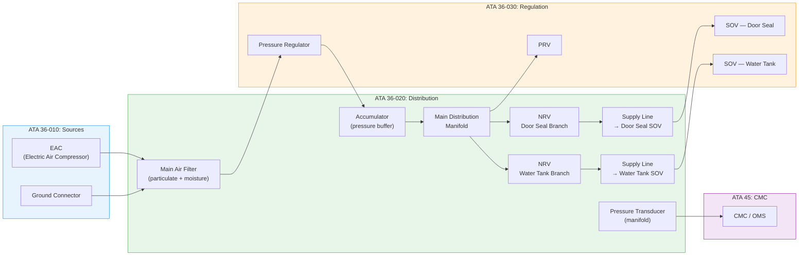
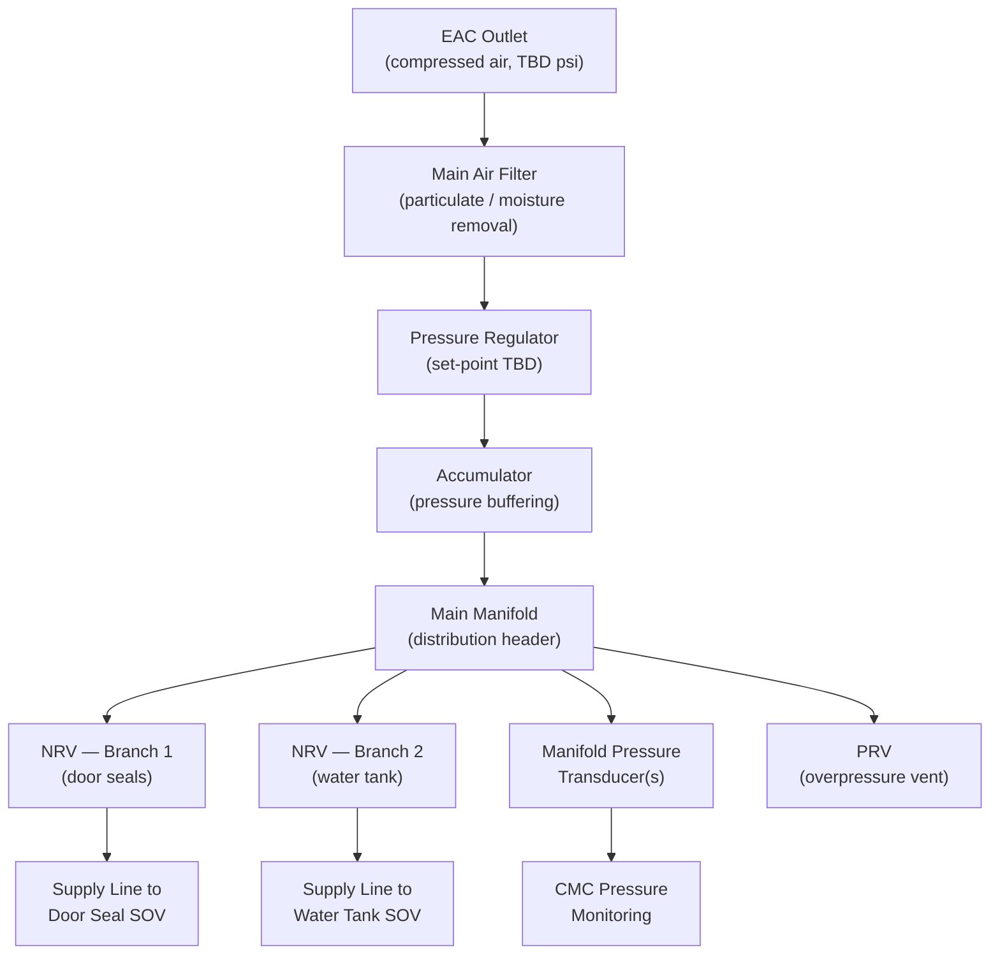
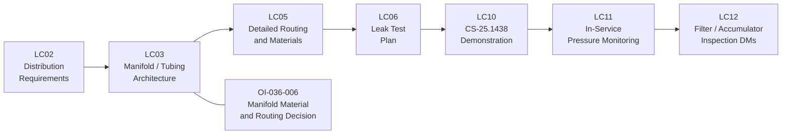

# 036-020 — Pneumatic Air Distribution
### [PROGRAMME-AIRCRAFT] [PROGRAMME-VARIANT] · ATA 36 · Q+ATLANTIDE ATLAS Scaffold

---

## §0 Hyperlink Policy

All internal links in this document use relative paths from the current directory. External regulatory and standards references use anchor links defined in [§20 References](#20-references). Links marked **TBD** indicate targets not yet allocated within the CSDB or ATLAS hierarchy. Programme-level links traverse five directory levels (`../../../../../`) to reach the repository root. No absolute URLs are used for internal navigation.

---

## §1 Purpose

This document defines the agnostic ATLAS standard-level architecture context for `036-020 — Pneumatic Air Distribution`.

It describes the controlled scope, functions, interfaces, safety considerations, lifecycle traceability, and S1000D/CSDB mapping logic that programme implementations shall instantiate when this node is applicable.

This document is not a programme design baseline. Programme-specific capacities, locations, part numbers, effectivity, operating limits, maintenance references, and data module codes shall be defined only inside the applicable programme implementation branch.
## §2 Applicability

| Applicability Level | Rule |
|---|---|
| Standard taxonomy | Applies to the ATLAS node `<NODE>` |
| Programme implementation | Conditional; determined by programme architecture, trade studies, certification basis, and applicability model |
| Product configuration | Defined in the programme-specific configuration baseline |
| Effectivity | Defined in the programme CSDB / applicability layer |
| Non-applicability | Must be explicitly stated in the programme impact-study branch when excluded |
## §3 System / Function Overview

### 3.1 Distribution Architecture Overview

The ATA 36-020 distribution system receives conditioned low-pressure air from the EAC/filter/regulator chain (ATA 36-010/030) and distributes it to consumers via:
1. **Main Air Filter** — removes particulates and moisture after EAC compression and before accumulator charging
2. **Pressure Accumulator** — small buffer vessel providing transient demand capacity and maintaining manifold pressure during EAC start or brief shutdowns
3. **Main Distribution Manifold** — header connecting accumulator to all consumer branches
4. **Consumer Supply Lines** — individual small-bore tubing runs to each consumer (door seals, water tank)
5. **Check Valves (NRV)** — prevent cross-flow between consumer branches and backflow into manifold

### 3.2 [PROGRAMME-VARIANT] vs. Conventional Distribution Comparison

| Feature | Conventional (bleed) | [PROGRAMME-VARIANT] |
|---|---|---|
| Duct temperature | Up to 500°C (bleed) | Near-ambient (<50°C est.) |
| Duct pressure | 40–60 psi typical bleed | 3–50 psi (TBD) |
| Duct material | Titanium / Inconel / SS with insulation | Aluminium / SS / PTFE-lined (TBD) |
| Thermal insulation blankets | Required | **Not required** |
| Thermal expansion joints | Required | Minimal / standard flex connections |
| OHT detection loops | Required | **Not required** — see ATA 36-050 |
| Duct diameter | Large (ATA 21, 30 bleed supply = large bore) | Small (low-flow, low-pressure consumers) |
| Manifold complexity | Complex multi-port with isolation | Simple, compact |

---

## §4 Scope

### 4.1 Included
- Main air filter (post-EAC, pre-accumulator): filter element, housing, drain port (TBD)
- Pressure accumulator: vessel, inlet/outlet ports, pressure transducer tap, drain (TBD)
- Main distribution manifold: multi-port header, pressure transducer taps, drain/vent ports
- Consumer supply lines: small-bore tubing from manifold to each consumer SOV (ATA 36-030/040 boundary)
- Check valves (NRV) between manifold and consumer SOVs (or integrated with SOVs — TBD)
- Tube fittings: swaged, flared, or push-to-connect (TBD per tubing material)
- Bonding jumpers for static discharge on tubing runs (per CS-25.1353 bonding requirements)
- Tubing support clamps and routing provisions through fuselage structure

### 4.2 Excluded
- EAC and EAC outlet NRV (ATA 36-010)
- Pressure regulator and SOVs (ATA 36-030/040)
- Consumer equipment (door seals — ATA 52; water tank — ATA 38)
- Hot bleed ducts (not applicable — bleed-less architecture)
- Thermal insulation blankets (not required)
- OHT sensors (not required — see ATA 36-050)

---

## §5 Architecture Description

### 5.1 Main Air Filter

| Parameter | Value |
|---|---|
| Filter type | Particulate + coalescing moisture separator (TBD) |
| Filtration rating | TBD (µm) |
| Housing material |  |
| Drain provision | Manual drain (TBD) or auto-drain |
| Replacement interval |  (on-condition or scheduled) |
| Location | Adjacent to EAC —  |

### 5.2 Pressure Accumulator

| Parameter | Value |
|---|---|
| Vessel type | Small cylindrical pressure vessel |
| Volume |  litres |
| Design pressure |  psi (proof pressure = 1.5× working) |
| Material |  (aluminium alloy TBD) |
| Location |  |
| Pressure transducer tap | Yes — 1/4" NPT or AN fitting TBD |
| Certification | Pressure vessel — CS-25.1438 + authority PED rules TBD |

### 5.3 Main Distribution Manifold

| Parameter | Value |
|---|---|
| Material |  (machined aluminium block TBD) |
| Number of ports |  (1 inlet, 2+ consumer outlets, 1 PRV port, 1 drain) |
| Working pressure |  psi |
| Pressure transducer provision | Yes — 1 primary + 1 redundant TBD |
| Seals | Elastomeric O-ring (TBD material — Viton or EPDM) |
| Bonding | Bonding lug provision for static dissipation |
| Location |  (centralised — near E/E bay or belly) |

### 5.4 Distribution Tubing

| Parameter | Value |
|---|---|
| Material |  (aluminium 6061 / stainless 304 / PTFE-lined SS) |
| Outer diameter |  (small bore — est. 1/4"–1/2" OD) |
| Wall thickness |  |
| Fittings |  (AN flared / Swagelok / push-to-connect) |
| Routing | Fuselage interior; composite fuselage penetrations with grommets / sealing (TBD) |
| Thermal insulation | **Not required** (low-temperature air) |
| Clamp spacing | TBD per structural vibration analysis |
| Bonding | Bonding jumper at each clamp group TBD |

---

## §6 Functional Breakdown

| Function | Component | Notes |
|---|---|---|
| Air filtration (post-EAC) | Main air filter | Removes particulates; coalesces moisture |
| Pressure buffering | Accumulator | Maintains manifold pressure during EAC start lag or brief shutdowns |
| Air distribution to consumers | Manifold + supply lines | Delivers regulated pressure to each consumer SOV |
| Backflow prevention (consumer branches) | NRVs | Prevents cross-contamination between consumer branches |
| Overpressure protection | PRV (ATA 36-030) | Downstream of regulator — see ATA 36-030 |
| Pressure monitoring | Manifold transducers | Feeds CMC and ECAM |
| Static dissipation | Bonding jumpers | Prevents static charge buildup on tubing runs |

---

## §7 System Context Diagram

---

## §8 Internal Functional Architecture

---

## §9 Lifecycle Traceability

---

## §10 Interfaces

| Interface | ATA Chapter | Description | Direction |
|---|---|---|---|
| EAC outlet | ATA 36-010 | Compressed air inlet to filter | ATA 36-010 → ATA 36-020 |
| Ground connector | ATA 36-010 | Alternative air inlet to filter | ATA 36-010 → ATA 36-020 |
| Pressure regulator | ATA 36-030 | Regulated outlet feeds accumulator | ATA 36-020 ↔ ATA 36-030 |
| SOV — door seals | ATA 36-030/040 | Supply line to SOV inlet | ATA 36-020 → ATA 36-030 |
| SOV — water tank | ATA 36-030/040 | Supply line to SOV inlet | ATA 36-020 → ATA 36-030 |
| Door seal inflation | ATA 52 | Downstream of SOV | ATA 36 → ATA 52 |
| Potable water tank | ATA 38 | Downstream of SOV | ATA 36 → ATA 38 |
| CMC pressure monitoring | ATA 45 | Manifold pressure transducer data | ATA 36-020 → ATA 45 |
| Structural support | Airframe | Clamps, brackets, penetration provisions | ATA 53 / ATA 51 |

---

## §11 Operating Modes

| Mode | Filter | Accumulator | Manifold | Lines |
|---|---|---|---|---|
| Normal (EAC running) | Filtering | Charging / charged | Pressurised at set-point | Pressurised |
| EAC standby (demand met) | Idle | Charged (maintaining) | Pressurised | Pressurised |
| EAC fault (accumulator providing) | Idle | Discharging | Pressure declining | Declining |
| Ground maintenance | As selected | May be isolated | Test pressure applied | Per test |
| Ground pneumatic cart | Filtering | Charging | Pressurised | Pressurised |
| System isolated / depressurised | Isolated | Drained | Vented | Vented |

---

## §12 Monitoring and Diagnostics

| Parameter | Sensor | Location | Threshold | Alert |
|---|---|---|---|---|
| Manifold pressure (primary) | Pressure transducer | Main manifold | Below set-point TBD | PNEU LO PR (amber CAS) |
| Manifold pressure (redundant) | Pressure transducer | Main manifold | Below set-point TBD | PNEU LO PR (amber CAS) |
| Accumulator pressure (TBD) | Pressure transducer (TBD) | Accumulator port | Below min TBD | Advisory (CMC) |
| Filter differential pressure (TBD) | Diff pressure indicator or sensor | Filter housing | ΔP > TBD psi | Maintenance advisory |

---

## §13 Maintenance Concept

### 13.1 Line Maintenance
- **Main air filter inspection and replacement**: interval TBD; access panel ; drain moisture if manual drain fitted
- **System leak check**: visual inspection of fittings and tubing for signs of leakage; pressure decay test per AMM procedure
- **Manifold pressure transducer check**: functional check via maintenance terminal

### 13.2 Base / Heavy Maintenance
- **Manifold removal and reinstall**: TBD (if modular design allows access); S1000D DM TBD
- **Accumulator inspection**: per pressure vessel inspection schedule; visual for corrosion, dents, seal condition; hydrostatic test interval TBD
- **Tubing inspection**: visual for chafing, corrosion, kinking; pressure test after any repair
- **Filter housing inspection**: O-ring and housing condition

### 13.3 Repair
- Tubing repair: replacement of damaged sections; no repair to composite overwrap (accumulator) — replace unit
- Fitting replacement: use approved fittings only (P/N TBD)

---

## §14 S1000D / CSDB Mapping

| DM Code (planned) | Info Code | Title | Status |
|---|---|---|---|
| DMC-<PROGRAMME>-<VARIANT>-036-20-00A-040A-A | 040 | ATA 36-020 — Air Distribution — Description |  |
| DMC-<PROGRAMME>-<VARIANT>-036-20-00A-300A-A | 300 | ATA 36-020 — Filter / Accumulator / Manifold Inspection |  |
| DMC-<PROGRAMME>-<VARIANT>-036-20-00A-400A-A | 400 | ATA 36-020 — Pressure Loss Fault Isolation |  |

---

## §15 Footprints

| Item | Mass (kg) | Length/Volume | Location | Status |
|---|---|---|---|---|
| Main air filter |  |  | Adjacent to EAC |  |
| Accumulator |  |  L |  |  |
| Main manifold |  |  |  |  |
| Distribution tubing (total) |  |  m total | Fuselage interior |  |
| NRVs (all branches) |  |  | At manifold outlets |  |
| **Total 036-020** |  | — | — |  |

---

## §16 Safety and Certification

| Requirement | Standard | Applicability | Notes |
|---|---|---|---|
| Pneumatic systems | CS-25.1438 | Full | Manifold, accumulator, tubing design |
| Systems and installations | CS-25.1309 | Full | Failure mode analysis for distribution loss |
| Pressure vessels | CS-25.1438 + authority rules | Accumulator | Proof pressure = 1.5× working TBD |
| Tubing and fittings | CS-25.1435 (hydraulic by analogy) | By analogy | Formal applicability TBD with authority |
| Bonding and grounding | CS-25.1353 | Tubing bonding jumpers | Static dissipation in composite fuselage |
| Hot air hazard | N/A | **Not applicable** | [PROGRAMME-VARIANT] — low-temp air only; no bleed-air fire/burn hazard |

### 16.1 Failure Effects
| Failure | Effect | Classification |
|---|---|---|
| Filter blocked | Reduced flow to manifold; EAC outlet overpressure (PRV opens) |  |
| Accumulator rupture | Rapid pressure loss; possible structural — proof pressure and material design |  |
| Manifold crack / tubing failure | Pressure loss; consumer depressurisation |  |
| NRV failed open | Cross-flow between branches — pressure equalisation |  |
| NRV failed closed | Consumer branch isolated — no supply to consumer |  |

---

## §17 Verification and Validation

| V&V Activity | Method | Acceptance Criteria | Status |
|---|---|---|---|
| System leak test (pressure decay) | Pressurise circuit to TBD psi; isolate EAC; monitor for TBD min | Pressure decay < TBD psi/min |  |
| Manifold pressure indication accuracy | Compare manifold transducer vs. reference gauge | ± TBD psi |  |
| Accumulator proof pressure test | Hydrostatic test at 1.5× working pressure | No deformation, no leakage |  |
| NRV backflow test | Pressurize consumer side; measure reverse flow | Zero backflow (< TBD leak rate) |  |
| Filter differential pressure check | Measure ΔP at rated flow | ΔP < TBD psi (clean element) |  |
| CMC fault flag — pressure loss | Induce manifold pressure loss; verify CMC flags PNEU LO PR | CAS alert within TBD s |  |
| Tubing vibration survey | Ground run + flight test measurement at clamp locations | Stress < TBD MPa |  |
| CS-25.1438 compliance | Analysis + test | Authority acceptance |  |

---

## §18 Glossary

| Term | Definition |
|---|---|
| Manifold | Distribution header connecting pneumatic supply to multiple consumer branches |
| Accumulator | Pressurised vessel buffering transient demand and maintaining manifold pressure during EAC start lag |
| NRV | Non-Return Valve — check valve preventing reverse flow between branches or into manifold |
| EAC | Electric Air Compressor — on-board source (ATA 36-010) |
| PRV | Pressure Relief Valve — overpressure protection, vents excess pressure to atmosphere |
| SOV | Shutoff Valve — electrically controlled valve to each consumer branch (ATA 36-030/040) |
| Working pressure | Nominal operating pressure of residual pneumatic circuit (TBD, estimated 3–50 psi) |
| OHT | Overheat sensor — not required on [PROGRAMME-VARIANT] (no hot bleed air in distribution) |
| Bleed-less architecture | No engine bleed air; all functions electrically supplied |
| PTFE | Polytetrafluoroethylene — tube liner material for chemical resistance and low friction |
| Bonding jumper | Electrical bonding strap ensuring metallic continuity across tubing joints for static discharge |
| CS-25.1438 | EASA certification requirement for pneumatic systems |
| DO-160G | RTCA environmental qualification standard for airborne equipment |
| CMC | Central Maintenance Computer |
| CAS | Crew Alerting System |
| ECAM | Electronic Centralised Aircraft Monitor |

---

## §19 Citations

1. EASA CS-25 §25.1438 — Pneumatic Systems
2. EASA CS-25 §25.1309 — Systems and Installations
3. EASA CS-25 §25.1353 — Electrical Equipment (bonding)
4. RTCA DO-160G — Environmental Conditions and Test Procedures
5. S1000D Issue 5.0 — Technical Publication Standard
6. ATA iSpec 2200 — ATA 36 Pneumatic

---

## §20 References

| Ref ID | Document | Source | Link |
|---|---|---|---|
| [ATA36] | ATA iSpec 2200 Chapter 36 — Pneumatic | ATA | — |
| [CS25-1438] | CS-25 §25.1438 | EASA | https://www.easa.europa.eu/ |
| [CS25-1309] | CS-25 §25.1309 | EASA | https://www.easa.europa.eu/ |
| [DO-160G] | RTCA DO-160G | RTCA | https://www.rtca.org/ |
| [S1000D] | S1000D Issue 5.0 | ASD/AIA | https://s1000d.org/ |
| [036-000] | ATA 36 General | Internal | [036-000](./036-000-Pneumatic-General.md) |
| [036-010] | ATA 36 Air Sources | Internal | [036-010](./036-010-Pneumatic-Air-Sources.md) |
| [036-030] | ATA 36 Pressure Regulation | Internal | [036-030](./036-030-Pressure-Regulation-and-Shutoff.md) |
| [ATA38] | ATA 38 — Potable Water | Internal | — |
| [ATA52] | ATA 52 — Doors | Internal | — |

---

## §21 Open Issues

| Issue ID | Description | Owner | Priority | Status |
|---|---|---|---|---|
| OI-036-006 | **Manifold material and routing**: aluminium vs. stainless vs. PTFE-lined; routing through composite fuselage — bonding, penetration sealing | Q-MECHANICS | Medium |  |
| OI-036-011 | **Accumulator sizing**: volume required for transient door seal demand — depends on door seal design decision | Q-AIR | Medium |  |
| OI-036-012 | **Tubing diameter and routing**: small-bore routing through composite fuselage — penetration provisions, fire stop considerations | Q-MECHANICS | Medium |  |
| OI-036-013 | **Filter type**: particulate only vs. coalescing moisture separator — depends on EAC type and consumer moisture sensitivity | Q-AIR | Low |  |
| OI-036-001 | **Retain or eliminate**: if circuit eliminated, ATA 36-020 content becomes informational placeholder only | Q-AIR | Critical |  |

---

## §22 Change Log

| Revision | Date | Author | Description |
|---|---|---|---|
| 0.1.0 | 2026-05-10 | Q+ATLANTIDE scaffold generator | Initial full-template scaffold — all sections present; content TBD/DRAFT |
